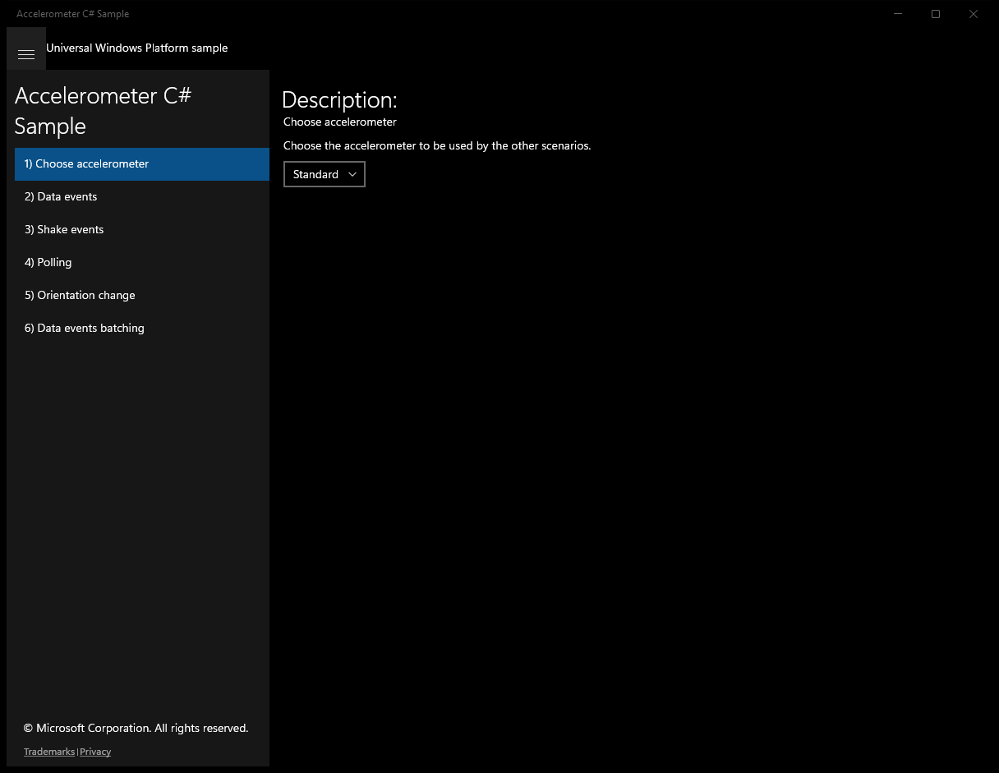
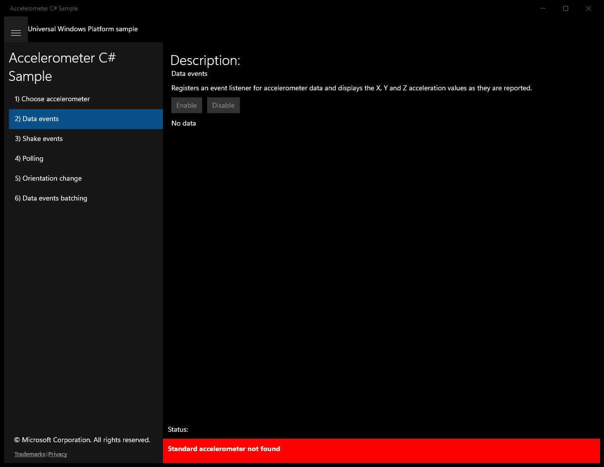
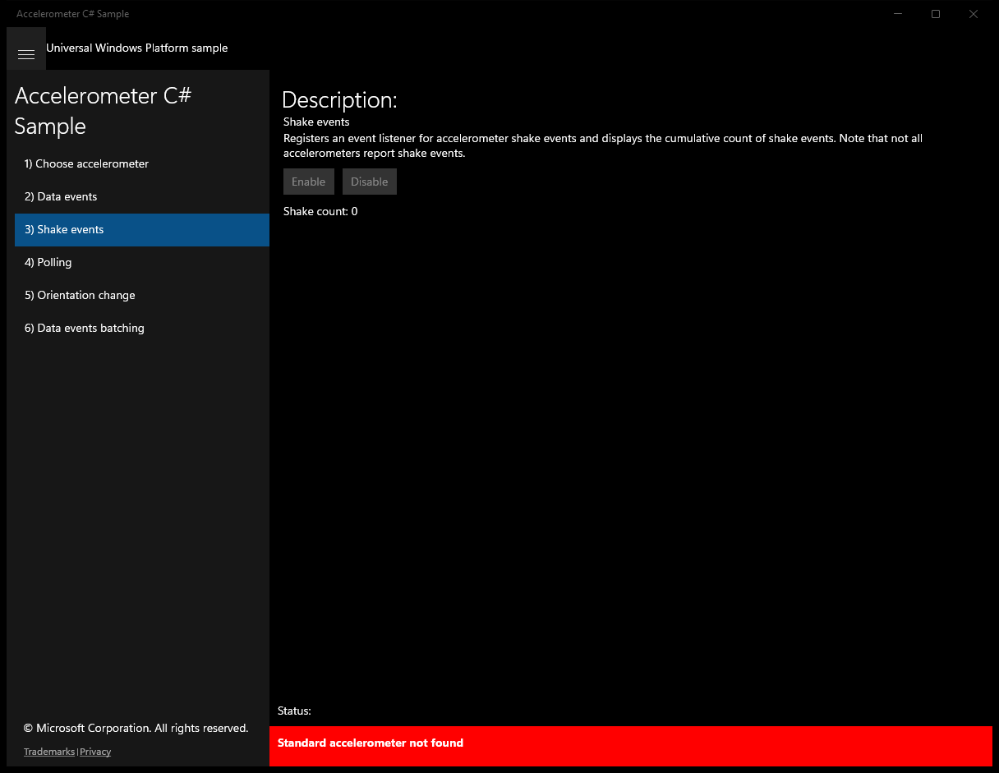
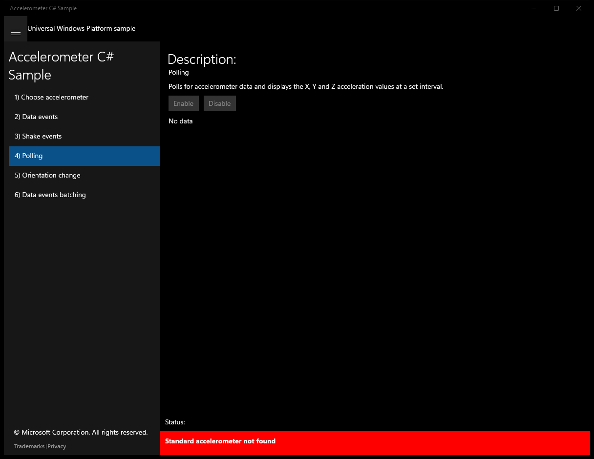
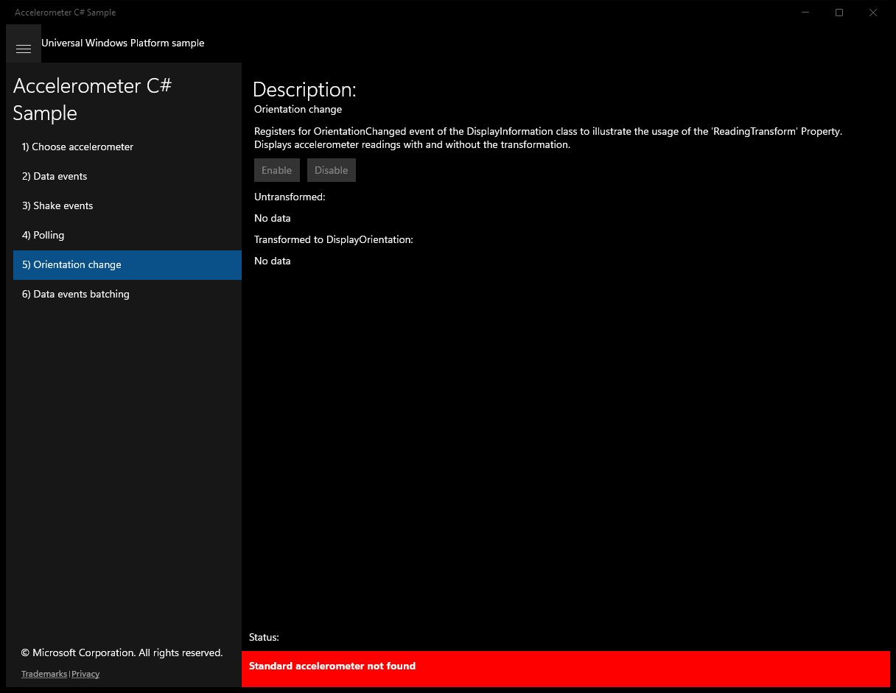

# Accelerometer (C#)

> **Source**: `Samples\Accelerometer\cs\`  
> **Feature**: Accelerometer C# Sample  
> **AUMID**: `Microsoft.SDKSamples.Accelerometer.CS_8wekyb3d8bbwe!App`  
> **PackageFamilyName**: `Microsoft.SDKSamples.Accelerometer.CS_8wekyb3d8bbwe`  

## Build / deploy / capture status
- build: ok
- deploy: ok
- launch: ok
- capture: ok
- uninstall: ok

## Main page

---

## Scenario 0 - Choose accelerometer

### UI elements
- **TextBlock**  - text="Description:"
- **TextBlock**  - text="Choose accelerometer"
- **TextBlock**  - text="Choose the accelerometer to be used by the other scenarios."
- **ComboBox**  - x:Name="ReadingTypeComboBox"

### Code behavior
- **`OnNavigatingFrom`**
    - API refs: `ReadingTypeComboBox.SelectedValue`

---

## Scenario 1 - Data events

### UI elements
- **TextBlock**  - text="Description:"
- **TextBlock**  - text="Data events"
- **TextBlock**  - text="Registers an event listener for accelerometer data and displays the X, Y and Z acceleration values as they are reported."
- **Button**  - x:Name="ScenarioEnableButton"; content="Enable"; events: Click={x:Bind ScenarioEnable}
- **Button**  - x:Name="ScenarioDisableButton"; content="Disable"; events: Click={x:Bind ScenarioDisable}
- **TextBlock**  - x:Name="ScenarioOutput"; text="No data"

### Code behavior
- **`OnNavigatedTo`**
    - API refs: `Accelerometer.GetDefault`, `NotifyType.StatusMessage`, `ScenarioEnableButton.IsEnabled`, `NotifyType.ErrorMessage`
- **`OnNavigatingFrom`**
    - API refs: `ScenarioDisableButton.IsEnabled`
- **`VisibilityChanged`**
    - API refs: `ScenarioDisableButton.IsEnabled`
- **`ReadingChanged`**
    - API refs: `Dispatcher.RunAsync`, `CoreDispatcherPriority.Normal`, `MainPage.SetReadingText`
- **`ScenarioEnable`**
    - API refs: `Math.Max`, `Window.Current`, `ScenarioEnableButton.IsEnabled`, `ScenarioDisableButton.IsEnabled`
- **`ScenarioDisable`**
    - API refs: `Window.Current`, `ScenarioEnableButton.IsEnabled`, `ScenarioDisableButton.IsEnabled`

### Screenshots
Initial state:

---

## Scenario 2 - Shake events

### UI elements
- **TextBlock**  - text="Description:"
- **TextBlock**  - text="Shake events"
- **TextBlock**  - text="Registers an event listener for accelerometer shake events and displays the cumulative count of shake events. Note that not all accelerometers report shake events."
- **Button**  - x:Name="ScenarioEnableButton"; content="Enable"; events: Click={x:Bind ScenarioEnable}
- **Button**  - x:Name="ScenarioDisableButton"; content="Disable"; events: Click={x:Bind ScenarioDisable}
- **TextBlock**  - text="Shake count:"

### Code behavior
- **`OnNavigatedTo`**
    - API refs: `Accelerometer.GetDefault`, `NotifyType.StatusMessage`, `ScenarioEnableButton.IsEnabled`, `NotifyType.ErrorMessage`
- **`OnNavigatingFrom`**
    - API refs: `ScenarioDisableButton.IsEnabled`
- **`VisibilityChanged`**
    - API refs: `ScenarioDisableButton.IsEnabled`
- **`Shaken`**
    - API refs: `Dispatcher.RunAsync`, `CoreDispatcherPriority.Normal`, `ScenarioOutputText.Text`
- **`ScenarioEnable`**
    - API refs: `Window.Current`, `ScenarioEnableButton.IsEnabled`, `ScenarioDisableButton.IsEnabled`
- **`ScenarioDisable`**
    - API refs: `Window.Current`, `ScenarioEnableButton.IsEnabled`, `ScenarioDisableButton.IsEnabled`

### Screenshots
Initial state:

---

## Scenario 3 - Polling

### UI elements
- **TextBlock**  - text="Description:"
- **TextBlock**  - text="Polling"
- **TextBlock**  - text="Polls for accelerometer data and displays the X, Y and Z acceleration values at a set interval."
- **Button**  - x:Name="ScenarioEnableButton"; content="Enable"; events: Click={x:Bind ScenarioEnable}
- **Button**  - x:Name="ScenarioDisableButton"; content="Disable"; events: Click={x:Bind ScenarioDisable}
- **TextBlock**  - x:Name="ScenarioOutput"; text="No data"

### Code behavior
- **`OnNavigatedTo`**
    - instantiates: `DispatcherTimer`
    - API refs: `Accelerometer.GetDefault`, `Math.Max`, `TimeSpan.FromMilliseconds`, `NotifyType.StatusMessage`, `ScenarioEnableButton.IsEnabled`, `NotifyType.ErrorMessage`
- **`OnNavigatingFrom`**
    - API refs: `ScenarioDisableButton.IsEnabled`
- **`VisibilityChanged`**
    - API refs: `ScenarioDisableButton.IsEnabled`
- **`DisplayCurrentReading`**
    - API refs: `MainPage.SetReadingText`
- **`ScenarioEnable`**
    - API refs: `Window.Current`, `ScenarioEnableButton.IsEnabled`, `ScenarioDisableButton.IsEnabled`
- **`ScenarioDisable`**
    - API refs: `Window.Current`, `ScenarioEnableButton.IsEnabled`, `ScenarioDisableButton.IsEnabled`

### Screenshots
Initial state:

---

## Scenario 4 - Orientation change

### UI elements
- **TextBlock**  - text="Description:"
- **TextBlock**  - text="Orientation change"
- **TextBlock**  - text="Registers for OrientationChanged event of the DisplayInformation class to illustrate the usage of the 'ReadingTransform' Property. Displays accelerometer readings with and without the transformation."
- **Button**  - x:Name="ScenarioEnableButton"; content="Enable"; events: Click={x:Bind ScenarioEnable}
- **Button**  - x:Name="ScenarioDisableButton"; content="Disable"; events: Click={x:Bind ScenarioDisable}
- **TextBlock**  - text="Untransformed:"
- **TextBlock**  - x:Name="ScenarioOutputOriginal"; text="No data"
- **TextBlock**  - text="Transformed to DisplayOrientation:"
- **TextBlock**  - x:Name="ScenarioOutputReadingTransform"; text="No data"

### Code behavior
- **`OnNavigatedTo`**
    - API refs: `Accelerometer.GetDefault`, `NotifyType.ErrorMessage`, `NotifyType.StatusMessage`, `ScenarioEnableButton.IsEnabled`, `DisplayInformation.GetForCurrentView`
- **`OnNavigatingFrom`**
    - API refs: `ScenarioDisableButton.IsEnabled`
- **`ScenarioEnable`**
    - API refs: `Window.Current`, `ScenarioEnableButton.IsEnabled`, `ScenarioDisableButton.IsEnabled`
- **`Current_VisibilityChanged`**
    - API refs: `ScenarioDisableButton.IsEnabled`
- **`ScenarioDisable`**
    - API refs: `Window.Current`, `ScenarioEnableButton.IsEnabled`, `ScenarioDisableButton.IsEnabled`

### Screenshots
Initial state:

---

## Scenario 5 - Data events batching

### UI elements
- **TextBlock**  - text="Description:"
- **TextBlock**  - text="Orientation change"
- **TextBlock**  - text="Registers an event listener for accelerometer data (with a report latency specified) and displays the X, Y and Z acceleration values as they are reported."
- **Button**  - x:Name="ScenarioEnableButton"; content="Enable"; events: Click={x:Bind ScenarioEnable}
- **Button**  - x:Name="ScenarioDisableButton"; content="Disable"; events: Click={x:Bind ScenarioDisable}
- **TextBlock**  - x:Name="ScenarioOutput"; text="No data"

### Code behavior
- **`OnNavigatedTo`**
    - API refs: `Accelerometer.GetDefault`, `Math.Max`, `Math.Min`, `NotifyType.StatusMessage`, `ScenarioEnableButton.IsEnabled`, `NotifyType.ErrorMessage`
- **`OnNavigatingFrom`**
    - API refs: `ScenarioDisableButton.IsEnabled`
- **`VisibilityChanged`**
    - API refs: `ScenarioDisableButton.IsEnabled`
- **`ReadingChanged`**
    - API refs: `Dispatcher.RunAsync`, `CoreDispatcherPriority.Normal`, `MainPage.SetReadingText`
- **`ScenarioEnable`**
    - API refs: `Window.Current`, `ScenarioEnableButton.IsEnabled`, `ScenarioDisableButton.IsEnabled`
- **`ScenarioDisable`**
    - API refs: `Window.Current`, `ScenarioEnableButton.IsEnabled`, `ScenarioDisableButton.IsEnabled`

### Screenshots
Initial state:

