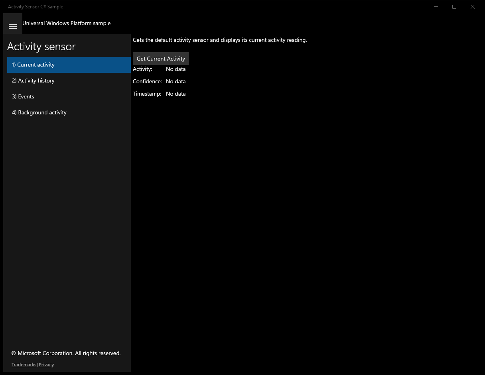
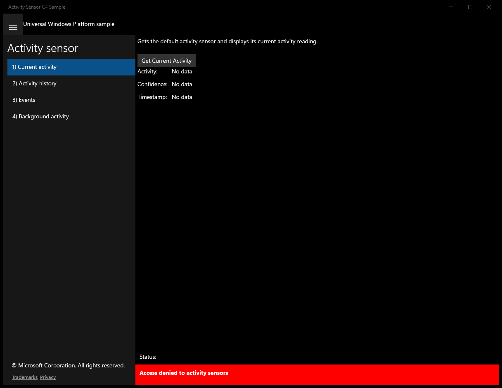
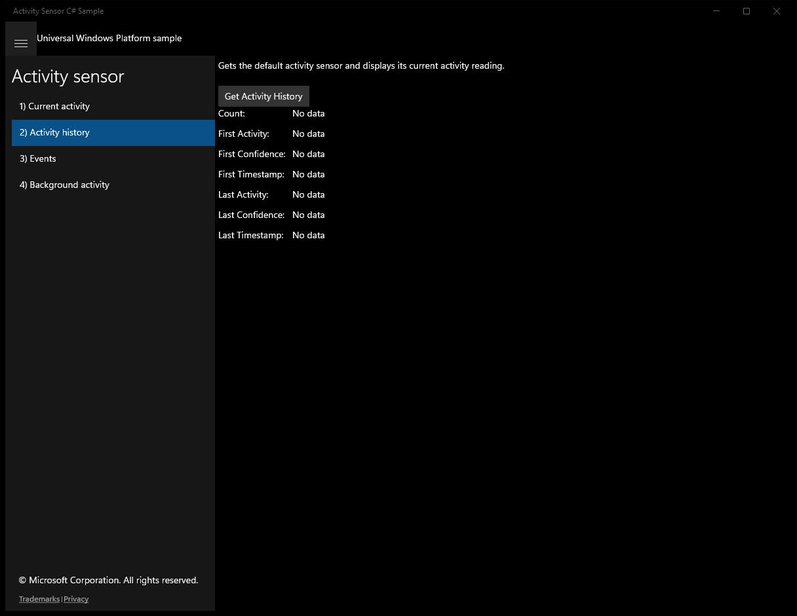
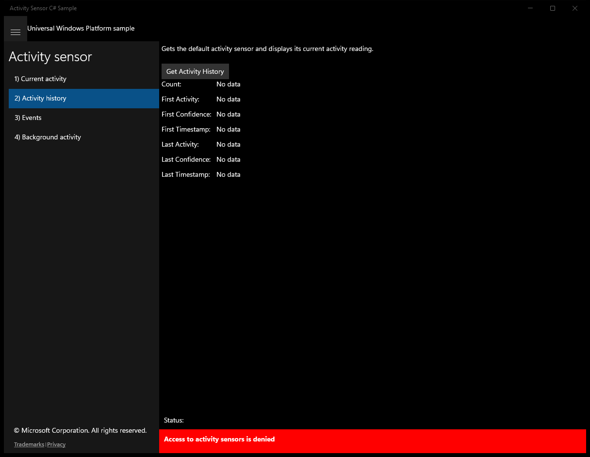
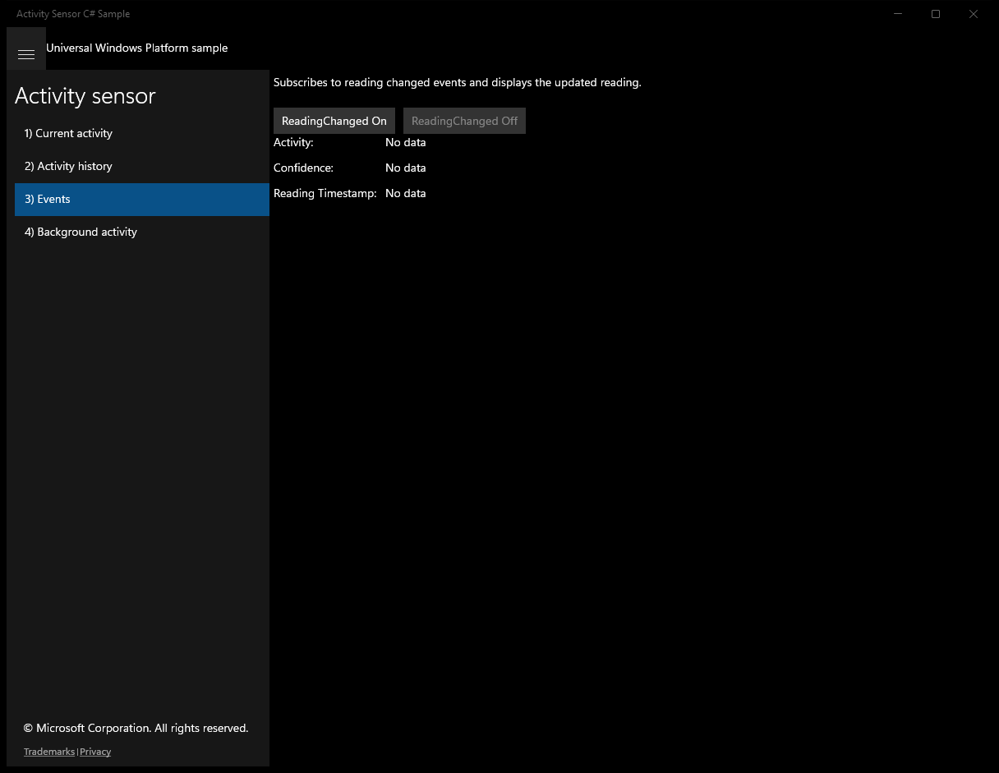
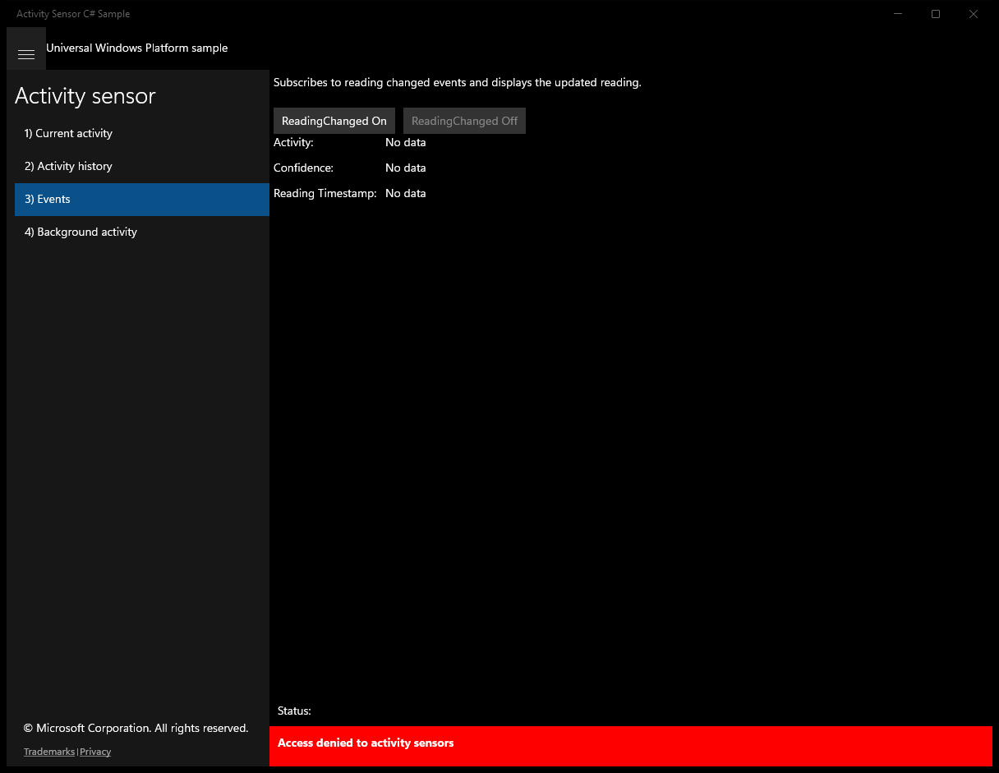
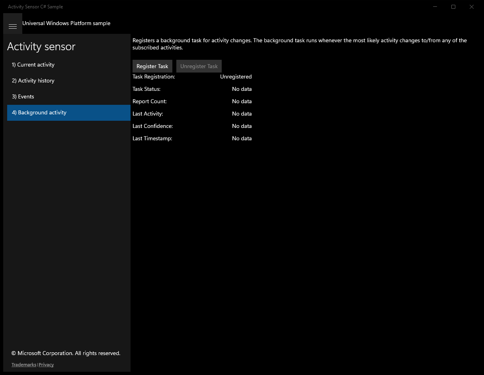
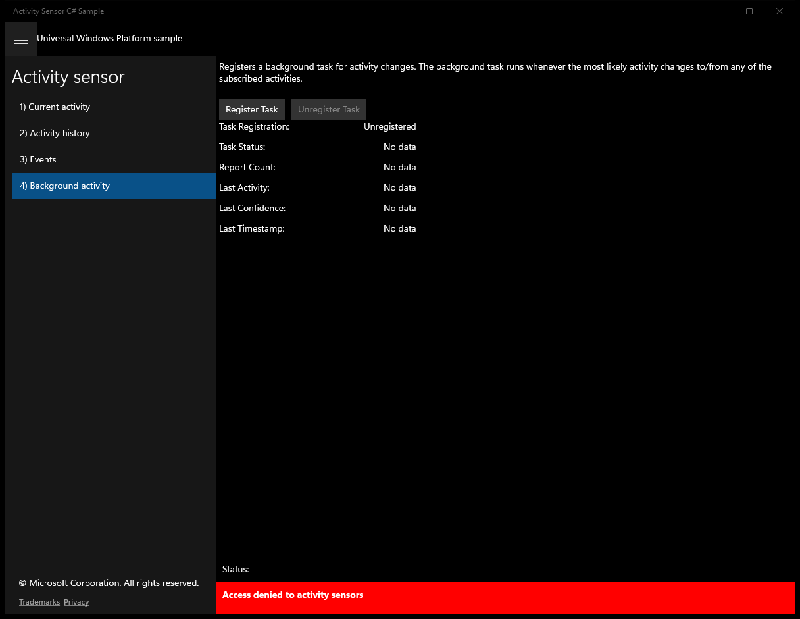

# ActivitySensor (C#)

> **Source**: `Samples\ActivitySensor\cs\`  
> **Feature**: Activity sensor  
> **AUMID**: `Microsoft.SDKSamples.ActivitySensor.CS_8wekyb3d8bbwe!App`  
> **PackageFamilyName**: `Microsoft.SDKSamples.ActivitySensor.CS_8wekyb3d8bbwe`  

## Build / deploy / capture status
- build: ok
- deploy: ok
- launch: ok
- capture: ok
- uninstall: ok

## Main page

---

## Scenario 1 - Current activity

### UI elements
- **TextBlock**  - x:Name="InputTextBlock"; text="Gets the default activity sensor and displays its current activity reading."
- **Button**  - x:Name="ScenarioGetCurrentActivityButton"; content="Get Current Activity"; events: Click=ScenarioGetCurrentActivity
- **TextBlock**  - text="Activity:"
- **TextBlock**  - text="Confidence:"
- **TextBlock**  - text="Timestamp:"
- **TextBlock**  - x:Name="ScenarioOutput_Activity"; text="No data"
- **TextBlock**  - x:Name="ScenarioOutput_Confidence"; text="No data"
- **TextBlock**  - x:Name="ScenarioOutput_Timestamp"; text="No data"

### Code behavior
- **`ScenarioGetCurrentActivity`**
    - API refs: `ScenarioOutput_Activity.Text`, `ScenarioOutput_Confidence.Text`, `ScenarioOutput_Timestamp.Text`, `NotifyType.StatusMessage`, `DeviceAccessInformation.CreateFromDeviceClassId`, `DeviceAccessStatus.Allowed`, `ActivitySensor.GetDefaultAsync`, `Activity.ToString`, `Confidence.ToString`, `Timestamp.ToString`, `NotifyType.ErrorMessage`

### Screenshots
Initial state:

After click **Get Current Activity**:

---

## Scenario 2 - Activity history

### UI elements
- **TextBlock**  - x:Name="InputTextBlock"; text="Gets the default activity sensor and displays its current activity reading."
- **Button**  - x:Name="ScenarioGetActivityHistoryButton"; content="Get Activity History"; events: Click=ScenarioGetActivityHistory
- **TextBlock**  - text="Count:"
- **TextBlock**  - text="First Activity:"
- **TextBlock**  - text="First Confidence:"
- **TextBlock**  - text="First Timestamp:"
- **TextBlock**  - text="Last Activity:"
- **TextBlock**  - text="Last Confidence:"
- **TextBlock**  - text="Last Timestamp:"
- **TextBlock**  - x:Name="ScenarioOutput_Count"; text="No data"
- **TextBlock**  - x:Name="ScenarioOutput_Activity1"; text="No data"
- **TextBlock**  - x:Name="ScenarioOutput_Confidence1"; text="No data"
- **TextBlock**  - x:Name="ScenarioOutput_Timestamp1"; text="No data"
- **TextBlock**  - x:Name="ScenarioOutput_ActivityN"; text="No data"
- **TextBlock**  - x:Name="ScenarioOutput_ConfidenceN"; text="No data"
- **TextBlock**  - x:Name="ScenarioOutput_TimestampN"; text="No data"

### Code behavior
- **`ScenarioGetActivityHistory`**
    - instantiates: `Calendar`
    - API refs: `ScenarioOutput_Count.Text`, `ScenarioOutput_Activity1.Text`, `ScenarioOutput_Confidence1.Text`, `ScenarioOutput_Timestamp1.Text`, `ScenarioOutput_ActivityN.Text`, `ScenarioOutput_ConfidenceN.Text`, `ScenarioOutput_TimestampN.Text`, `NotifyType.StatusMessage`, `DeviceAccessInformation.CreateFromDeviceClassId`, `DeviceAccessStatus.Allowed`, `ActivitySensor.GetDefaultAsync`, `ActivitySensor.GetSystemHistoryAsync`, `Count.ToString`, `Activity.ToString`, `Confidence.ToString`, `Timestamp.ToString`, `NotifyType.ErrorMessage`

### Screenshots
Initial state:

After click **Get Activity History**:

---

## Scenario 3 - Events

### UI elements
- **TextBlock**  - x:Name="InputTextBlock"; text="Subscribes to reading changed events and displays the updated reading."
- **Button**  - x:Name="ScenarioEnableReadingChangedButton"; content="ReadingChanged On"; events: Click=ScenarioEnableReadingChanged
- **Button**  - x:Name="ScenarioDisableReadingChangedButton"; content="ReadingChanged Off"; events: Click=ScenarioDisableReadingChanged
- **TextBlock**  - text="Activity:"
- **TextBlock**  - text="Confidence:"
- **TextBlock**  - text="Reading Timestamp:"
- **TextBlock**  - x:Name="ScenarioOutput_Activity"; text="No data"
- **TextBlock**  - x:Name="ScenarioOutput_Confidence"; text="No data"
- **TextBlock**  - x:Name="ScenarioOutput_ReadingTimestamp"; text="No data"

### Code behavior
- **`OnNavigatedTo`**
    - API refs: `ScenarioEnableReadingChangedButton.IsEnabled`, `ScenarioDisableReadingChangedButton.IsEnabled`
- **`OnNavigatingFrom`**
    - instantiates: `TypedEventHandler`
    - API refs: `ScenarioDisableReadingChangedButton.IsEnabled`
- **`ReadingChanged`**
    - API refs: `Dispatcher.RunAsync`, `CoreDispatcherPriority.Normal`, `ScenarioOutput_Activity.Text`, `Activity.ToString`, `ScenarioOutput_Confidence.Text`, `Confidence.ToString`, `ScenarioOutput_ReadingTimestamp.Text`, `Timestamp.ToString`
- **`ScenarioEnableReadingChanged`**
    - instantiates: `TypedEventHandler`
    - API refs: `DeviceAccessStatus.Allowed`, `ActivitySensor.GetDefaultAsync`, `SubscribedActivities.Add`, `ActivityType.Walking`, `ActivityType.Running`, `ActivityType.InVehicle`, `ActivityType.Biking`, `ActivityType.Fidgeting`, `ScenarioEnableReadingChangedButton.IsEnabled`, `ScenarioDisableReadingChangedButton.IsEnabled`, `NotifyType.StatusMessage`, `NotifyType.ErrorMessage`
- **`ScenarioDisableReadingChanged`**
    - instantiates: `TypedEventHandler`
    - API refs: `NotifyType.StatusMessage`, `ScenarioEnableReadingChangedButton.IsEnabled`, `ScenarioDisableReadingChangedButton.IsEnabled`
- **`AccessChanged`**
    - API refs: `DeviceAccessStatus.Allowed`, `Dispatcher.RunAsync`, `CoreDispatcherPriority.Normal`, `NotifyType.ErrorMessage`, `ScenarioEnableReadingChangedButton.IsEnabled`, `ScenarioDisableReadingChangedButton.IsEnabled`

### Screenshots
Initial state:

After click **ReadingChanged On**:

---

## Scenario 4 - Background activity

### UI elements
- **TextBlock**  - x:Name="InputTextBlock"; text="Registers a background task for activity changes. The background task runs whenever the most likely activity changes to/from any of the subscribed activities."
- **Button**  - x:Name="ScenarioRegisterTaskButton"; content="Register Task"; events: Click=ScenarioRegisterTask
- **Button**  - x:Name="ScenarioUnregisterTaskButton"; content="Unregister Task"; events: Click=ScenarioUnregisterTask
- **TextBlock**  - text="Task Registration:"
- **TextBlock**  - text="Task Status:"
- **TextBlock**  - text="Report Count:"
- **TextBlock**  - text="Last Activity:"
- **TextBlock**  - text="Last Confidence:"
- **TextBlock**  - text="Last Timestamp:"
- **TextBlock**  - x:Name="ScenarioOutput_TaskRegistration"; text="No data"
- **TextBlock**  - x:Name="ScenarioOutput_TaskStatus"; text="No data"
- **TextBlock**  - x:Name="ScenarioOutput_ReportCount"; text="No data"
- **TextBlock**  - x:Name="ScenarioOutput_LastActivity"; text="No data"
- **TextBlock**  - x:Name="ScenarioOutput_LastConfidence"; text="No data"
- **TextBlock**  - x:Name="ScenarioOutput_LastTimestamp"; text="No data"

### Code behavior
- **`OnNavigatedTo`**
    - API refs: `BackgroundTaskRegistration.AllTasks`, `Value.Name`, `Scenario4_BackgroundActivity.SampleBackgroundTaskName`
- **`ScenarioRegisterTask`**
    - API refs: `DeviceAccessInformation.CreateFromDeviceClassId`, `DeviceAccessStatus.Allowed`, `ActivitySensor.GetDefaultAsync`, `BackgroundExecutionManager.RequestAccessAsync`, `BackgroundAccessStatus.AlwaysAllowed`, `BackgroundAccessStatus.AllowedSubjectToSystemPolicy`, `NotifyType.ErrorMessage`
- **`ScenarioUnregisterTask`**
    - API refs: `BackgroundTaskRegistration.AllTasks`, `Value.Name`, `Value.Unregister`
- **`RegisterBackgroundTask`**
    - instantiates: `BackgroundTaskBuilder`, `ActivitySensorTrigger`, `BackgroundTaskCompletedEventHandler`
    - API refs: `SubscribedActivities.Add`, `ActivityType.Walking`, `ActivityType.Running`, `ActivityType.Biking`
- **`UpdateUIAsync`**
    - API refs: `Dispatcher.RunAsync`, `CoreDispatcherPriority.Normal`, `ScenarioRegisterTaskButton.IsEnabled`, `ScenarioUnregisterTaskButton.IsEnabled`, `ScenarioOutput_TaskRegistration.Text`, `ApplicationData.Current`, `Values.ContainsKey`, `ScenarioOutput_ReportCount.Text`, `ScenarioOutput_TaskStatus.Text`, `ScenarioOutput_LastActivity.Text`, `ScenarioOutput_LastConfidence.Text`, `ScenarioOutput_LastTimestamp.Text`

### Screenshots
Initial state:

After click **Register Task**:

