# AdaptiveStreaming (C#)

> **Source**: `Samples\AdaptiveStreaming\cs\`  
> **Feature**: AdaptiveStreaming  
> **AUMID**: `Microsoft.SDKSamples.AdaptiveStreaming.CS_8wekyb3d8bbwe!AdaptiveStreaming.App`  
> **PackageFamilyName**: `Microsoft.SDKSamples.AdaptiveStreaming.CS_8wekyb3d8bbwe`  

## Sample purpose
Shows various features of the AdaptiveMediaSource object.

## Scenarios demonstrated (from README)
- Passing a Stream to a manifest in the constructor of AdaptiveMediaSource, to replace the first web request for a Uri.
- Getting a copy of the downloaded bytes after they have been consumed by the platform in DownloadCompleted.
- ID3 tags within TS content
- emsg boxes within fragmented MP4 content
- Comment tags found in HLS manifests
- MinLiveOffset: The leading edge of the DRV window, as imposed by the content or platform.
- DesiredLiveOffset: The application-controlled leading-edge of the DRV window.
- DesiredSeekableWindowSize: The application-controlled DVR window depth.
- MaxSeekableWindowSize: The DRV window depth, as imposed by the content.

## Top-level UWP namespaces used
- `Windows.Web.Http`

## Build / deploy / capture status
- build: skipped
- deploy: ok
- launch: ok
- capture: ok
- uninstall: ok

## Main page

---

## Scenario 1 - Simplest Adaptive Streaming

**Description**: In XAML, a URI in the Source property of a MediaPlayerElement goes through a format converter to create a MediaSource. An AdaptiveMediaSource is created implicitly when a manifest URI is used with MediaSource.CreateFromUri(uri). No properties or callbacks of the AdaptiveMediaSource can be retrieved when it is created implicitly.

### UI elements
- **TextBlock**  - text="Description:"
- **Button**  - x:Name="Load"; content="Load"; events: Click=Load_Click
- **MediaPlayerElement**  - x:Name="mediaPlayerElement"

### Code behavior
- **`Load_Click`**
    - instantiates: `MediaPlayer`, `PlayReadyHelper`
    - API refs: `MainPage.FindContentById`, `MediaPlayer.MediaProtectionManager`, `SDKTemplate.Helpers`, `MediaSource.CreateFromUri`

### Screenshots
Initial state:

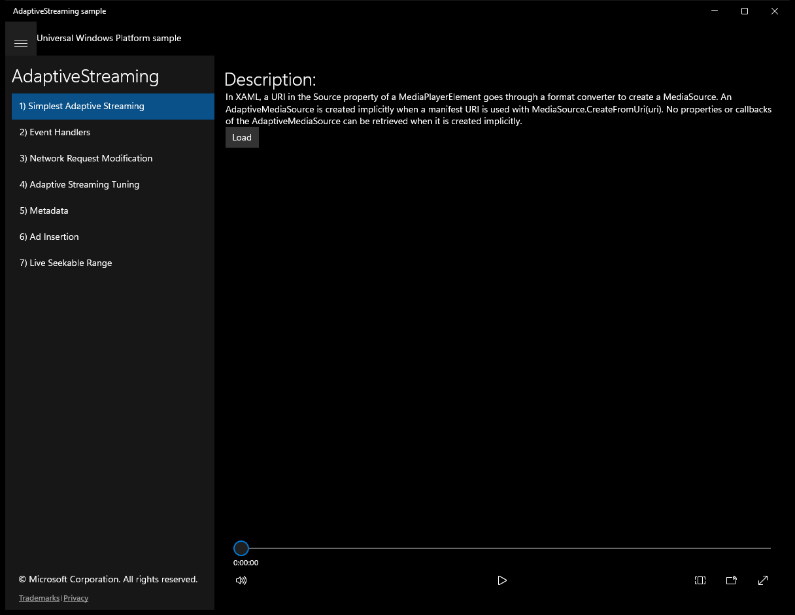

After click **Load**:

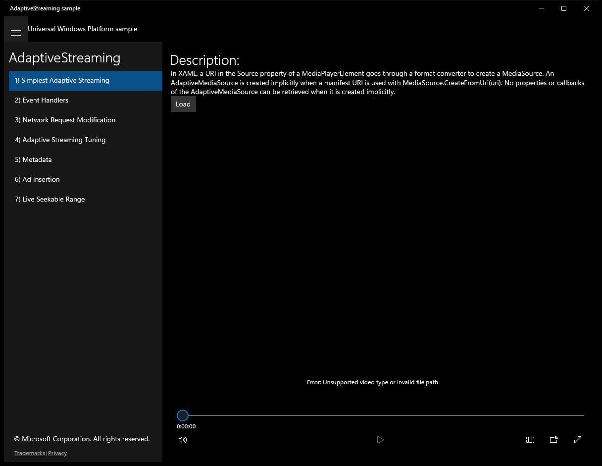

After click **Volume**:

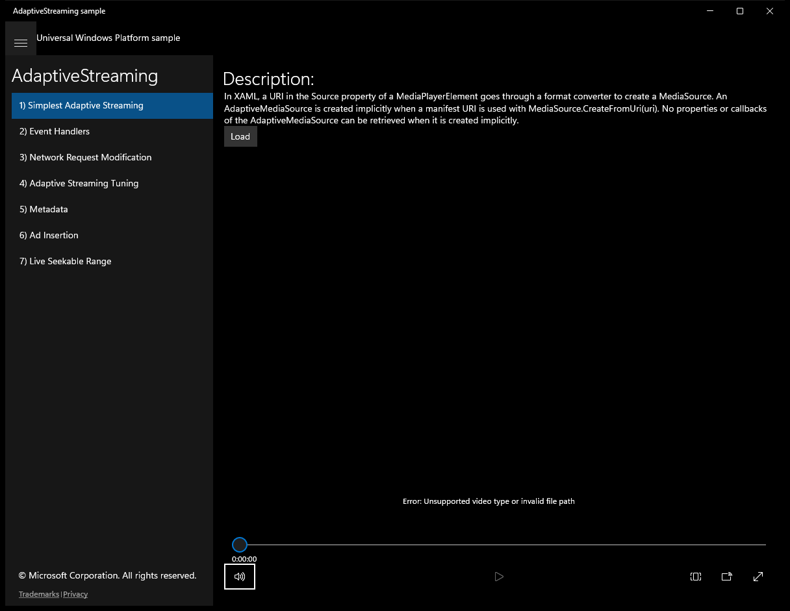

> Button **Play** skipped (invoke_failed)

After click **Aspect Ratio**:

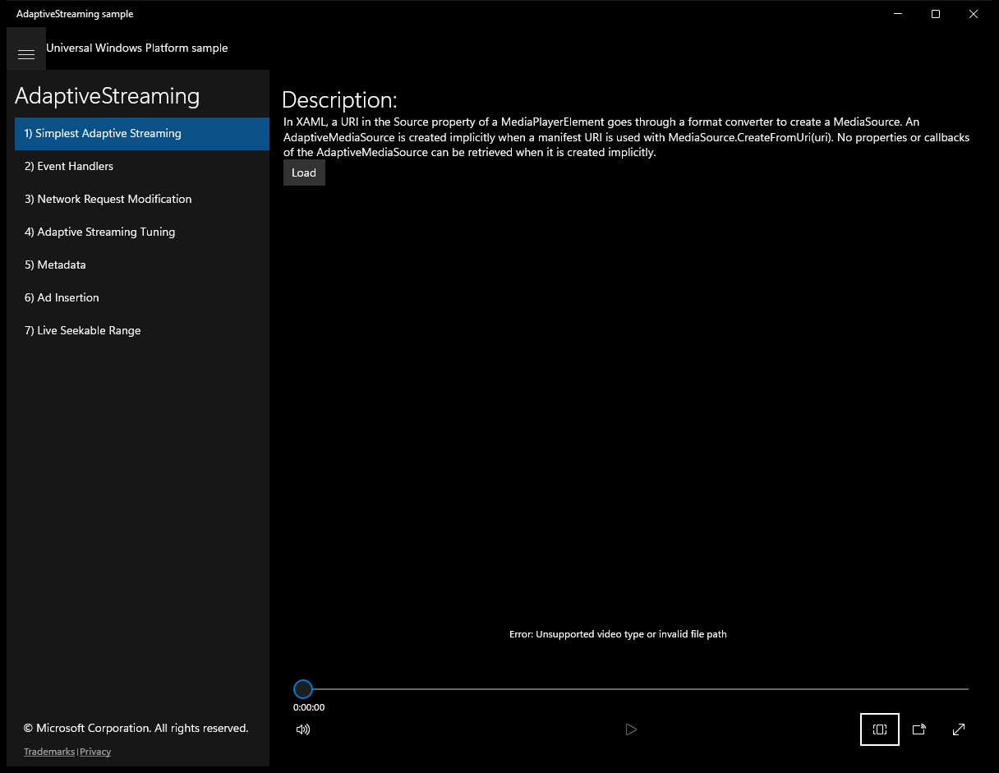

---

## Scenario 2 - Event Handlers

**Description**: This scenario demonstrates the explicit use of an AdaptiveMediaSource and all those events which report the state of adaptive streaming and the rest of the playback pipeline. If the URI entered below is not supported for adaptive streaming, the sample falls back to MediaSource.CreateFromUri().

### UI elements
- **TextBlock**  - text="Description:"
- **TextBlock**  - name="txtDownloadBitrate"
- **TextBlock**  - name="txtPlaybackBitrate"
- **MediaPlayerElement**  - x:Name="mediaPlayerElement"

### Code behavior
- **`OnNavigatedFrom`**
    - API refs: `ContentSelectorControl.MediaPlaybackItem`
- **`UnregisterHandlers`**
    - API refs: `Source.AdaptiveMediaSource`
- **`Page_OnLoaded`**
    - namespaces: `Windows.Web.Http`
    - instantiates: `MediaPlayer`, `MediaPlayerLogger`, `PlayReadyHelper`, `HttpBaseProtocolFilter`, `AdaptiveMediaSourceHttpFilterLogger`, `HttpClient`
    - API refs: `Windows.Web`, `CacheControl.WriteBehavior`, `HttpCacheWriteBehavior.NoCache`, `ContentSelectorControl.Initialize`, `MainPage.ContentManagementSystemStub`
- **`LoadSourceFromUriAsync`**
    - instantiates: `AdaptiveMediaSourceLogger`, `BitrateHelper`, `MediaSourceLogger`, `MediaPlaybackItem`, `MediaPlaybackItemLogger`
    - API refs: `AdaptiveMediaSource.CreateFromUriAsync`, `AdaptiveMediaSourceCreationStatus.Success`, `MediaSource.CreateFromAdaptiveMediaSource`, `ExtendedError.Message`, `ExtendedError.HResult`, `MediaSource.CreateFromUri`, `MediaSource.CustomProperties`, `Guid.NewGuid`
- **`HideDescriptionOnSmallScreen`**
    - API refs: `Dispatcher.RunAsync`, `CoreDispatcherPriority.Normal`, `DescriptionText.Visibility`, `Visibility.Collapsed`, `Visibility.Visible`
- **`UpdateDownloadBitrateAsync`**
    - instantiates: `DispatchedHandler`
    - API refs: `Dispatcher.RunAsync`, `CoreDispatcherPriority.Normal`
- **`UpdatePlaybackBitrateAsync`**
    - instantiates: `DispatchedHandler`
    - API refs: `Dispatcher.RunAsync`, `CoreDispatcherPriority.Normal`
- **`Log`**
    - API refs: `LoggerControl.Log`

### Screenshots
Initial state:

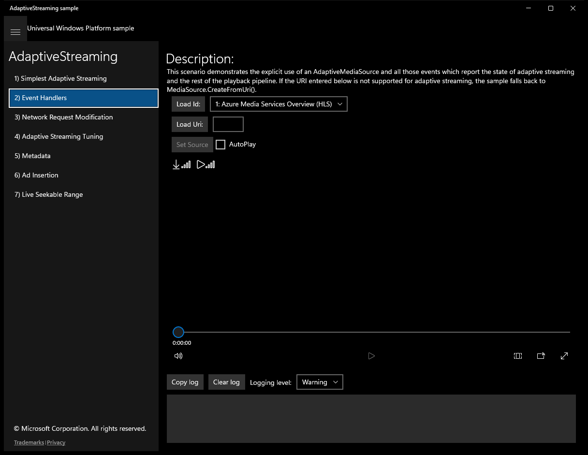

After click **Load Id:**:

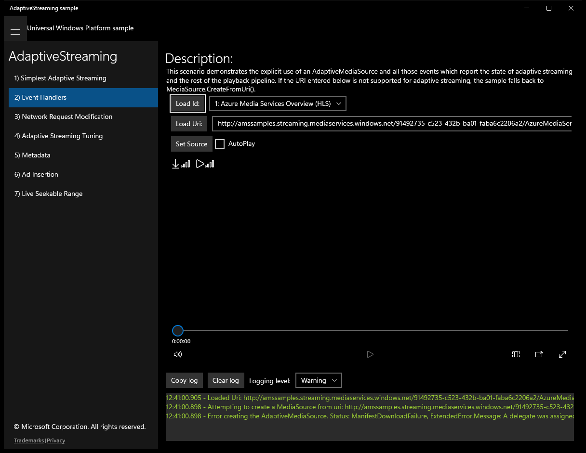

After click **Load Uri:**:

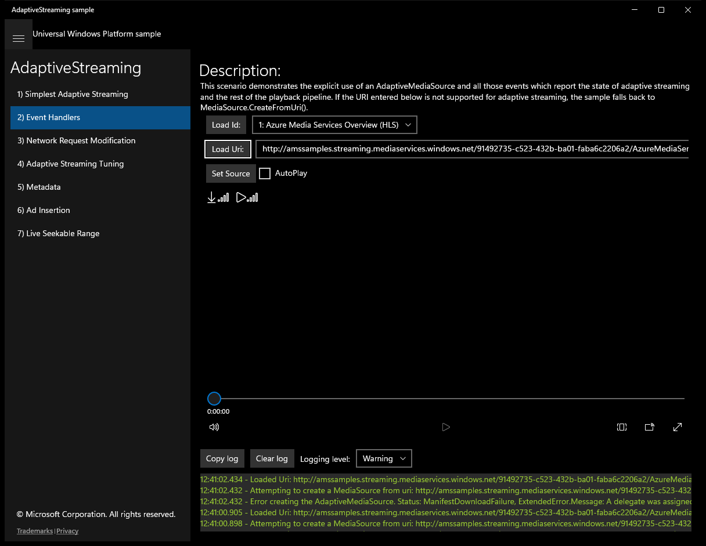

After click **Volume**:

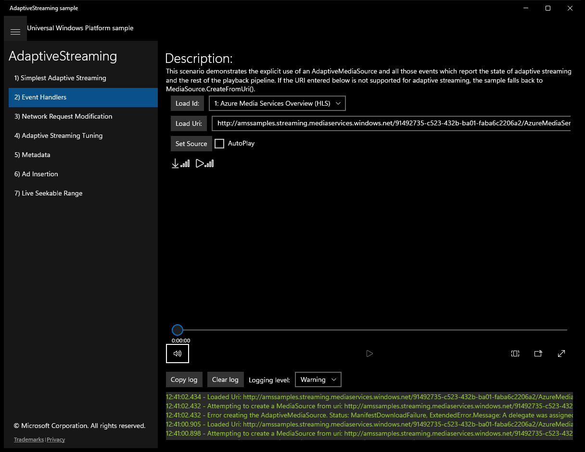

---

## Scenario 3 - Network Request Modification

**Description**: The AdaptiveMediaSource allows the app to manage some or all aspects of content download. This can be done by modifying the arguments of the DownloadRequested callback, or by passing an HttpClient to the constructor. The default content of this scenario requires a Bearer or Url token to be presented to the key service before responding with the decryption key. Select an authentication mechanism to ensure this content loads. This scenario also imposes bandwidth restriction based on the HDCP protection level.

### UI elements
- **TextBlock**  - text="Description:"
- **RadioButton**  - x:Name="RadioButtonNone"; content="None"; events: Click=AzureMethodSelected_Click
- **RadioButton**  - x:Name="RadioButtonAuthorizationHeader"; content="Authorization Header"; events: Click=AzureMethodSelected_Click
- **RadioButton**  - x:Name="RadioButtonUrlQueryParameter"; content="Url Query Parameter"; events: Click=AzureMethodSelected_Click
- **RadioButton**  - x:Name="RadioButtonApplicationDownloaded"; content="Application Downloaded"; events: Click=AzureMethodSelected_Click
- **TextBlock**  - text="Desired HDCP minimum protection"
- **RadioButton**  - x:Name="HcdpOff"; content="HDCP Off"; events: Click=HdcpDesiredMinimumProtection_Click
- **RadioButton**  - x:Name="HcdpOn"; content="HDCP On"; events: Click=HdcpDesiredMinimumProtection_Click
- **RadioButton**  - x:Name="HdcpOnWithTypeEnforcement"; content="HDCP On With Type Enforcement"; events: Click=HdcpDesiredMinimumProtection_Click
- **TextBlock**  - text="Effective protection: ()"
- **MediaPlayerElement**  - x:Name="mediaPlayerElement"

### Code behavior
- **`OnNavigatedFrom`**
    - API refs: `ContentSelectorControl.MediaPlaybackItem`
- **`UnregisterHandlers`**
    - API refs: `Source.AdaptiveMediaSource`
- **`Page_OnLoaded`**
    - instantiates: `HdcpSession`, `MediaPlayer`, `MediaPlayerLogger`
    - API refs: `ContentSelectorControl.Initialize`, `MainPage.ContentManagementSystemStub`, `ContentSelectorControl.HideLoadUri`, `AzureAuthorizationMethodPanel.Children`, `IsChecked.Value`, `Enum.TryParse`, `ContentSelectorControl.SetSelectedModel`
- **`LoadSourceFromUriAsync`**
    - instantiates: `HttpBaseProtocolFilter`, `AddAuthorizationHeaderFilter`, `HttpCredentialsHeaderValue`, `HttpClient`, `AdaptiveMediaSourceLogger`, `MediaSourceLogger`, `MediaPlaybackItem`, `MediaPlaybackItemLogger`
    - API refs: `AzureKeyAcquisitionMethod.AuthorizationHeader`, `ContentSelectorControl.SelectedModel`, `CacheControl.WriteBehavior`, `HttpCacheWriteBehavior.NoCache`, `DefaultRequestHeaders.Append`, `AdaptiveMediaSource.CreateFromUriAsync`, `AdaptiveMediaSourceCreationStatus.Success`, `MediaSource.CreateFromAdaptiveMediaSource`, `ExtendedError.Message`, `ExtendedError.HResult`, `Guid.NewGuid`
- **`HideDescriptionOnSmallScreen`**
    - API refs: `Dispatcher.RunAsync`, `CoreDispatcherPriority.Normal`, `DescriptionText.Visibility`, `Visibility.Collapsed`, `Visibility.Visible`
- **`DownloadRequested`**
    - API refs: `AdaptiveMediaSourceResourceType.Key`, `AzureKeyAcquisitionMethod.None`, `AzureKeyAcquisitionMethod.AuthorizationHeader`, `ResourceUri.Host`, `AzureKeyAcquisitionMethod.UrlQueryParameter`, `AzureKeyAcquisitionMethod.ApplicationDownloaded`
- **`ModifyKeyRequestUri`**
    - instantiates: `Uri`
    - API refs: `ContentSelectorControl.SelectedModel`, `Result.ResourceUri`, `System.Net`, `WebUtility.UrlEncode`, `ResourceUri.AbsoluteUri`
- **`AppDownloadedKeyRequest`**
    - instantiates: `HttpClient`, `HttpCredentialsHeaderValue`, `HttpRequestMessage`
    - API refs: `ContentSelectorControl.SelectedModel`, `AzureKeyAcquisitionMethod.ApplicationDownloaded`, `Result.InputStream`, `Result.Buffer`, `DefaultRequestHeaders.Authorization`, `HttpMethod.Get`, `HttpCompletionOption.ResponseHeadersRead`, `Content.ReadAsInputStreamAsync`, `Content.ReadAsBufferAsync`, `Result.ExtendedStatus`, `HttpStatusCode.Unauthorized`, `HttpStatusCode.NotFound`
- **`AzureMethodSelected_Click`**
    - API refs: `Tag.ToString`, `Enum.TryParse`
- **`HdcpDesiredMinimumProtection_Click`**
    - API refs: `HdcpProtection.Off`, `Tag.ToString`, `Enum.TryParse`, `HdcpSetProtectionResult.Success`
- **`SetMaxBitrateForProtectionLevel`**
    - instantiates: `List`
    - API refs: `Dispatcher.RunAsync`, `CoreDispatcherPriority.Normal`, `EffectiveHdcpProtectionText.Text`, `AvailableBitrates.Count`, `HdcpProtection.OnWithTypeEnforcement`, `DesiredMaxBitrateText.Text`, `HdcpProtection.On`, `HdcpProtection.Off`
- **`Log`**
    - API refs: `LoggerControl.Log`
- **`SendRequestAsync`**
    - API refs: `String.Equals`, `RequestUri.Host`, `StringComparison.OrdinalIgnoreCase`, `Headers.Authorization`

### Screenshots
Initial state:

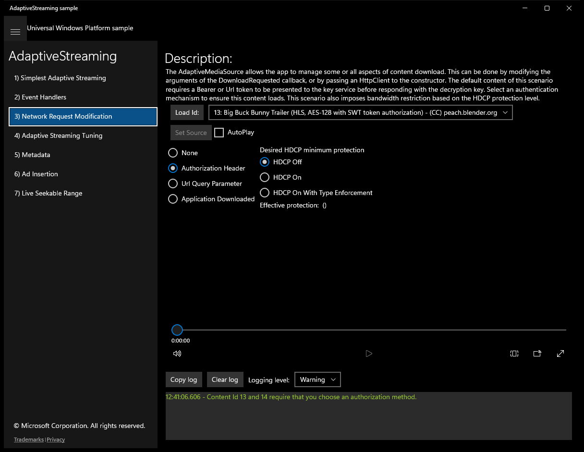

After click **Load Id:**:

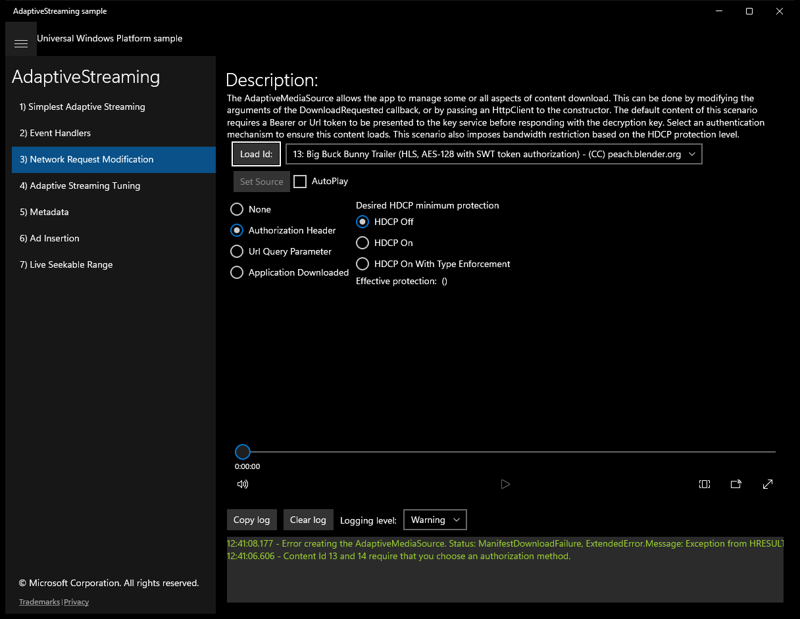

After click **Volume**:

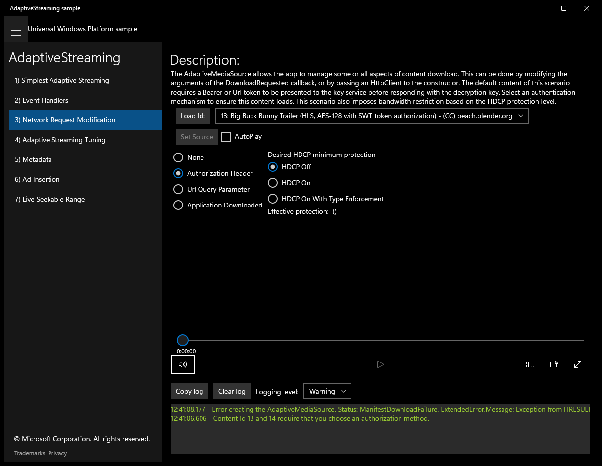

After click **Aspect Ratio**:

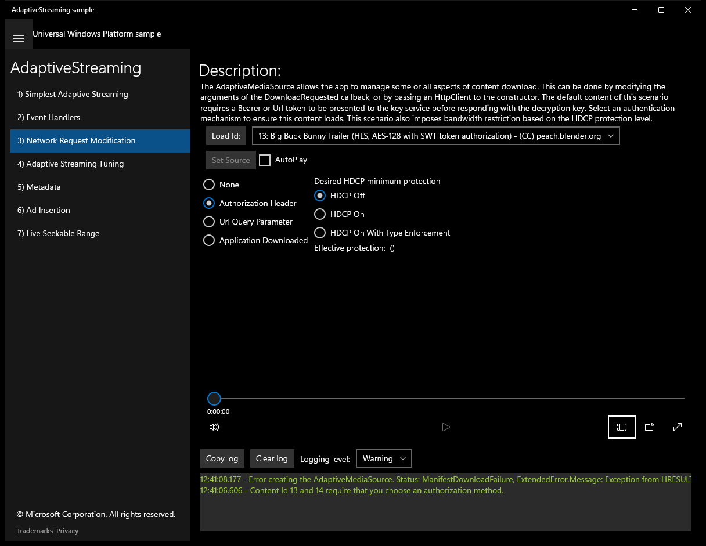

---

## Scenario 4 - Adaptive Streaming Tuning

**Description**: This scenario shows several ways in which the app can tune the adaptive media source. Setting initial, minimum or maximum bitrates is typical and expected. Setting InboundBitsPerSecondWindow, BitrateDowngradeTriggerRatio, and DesiredBitrateHeadroomRatio should only be done after extensive testing under a range of network conditions.

### UI elements
- **TextBlock**  - text="Description:"
- **TextBlock**  - name="txtDownloadBitrate"
- **TextBlock**  - name="txtPlaybackBitrate"
- **TextBlock**  - name="InboundBitsPerSecondText"
- **TextBlock**  - text="Min Bitrate ≤"
- **ComboBox**  - x:Name="DesiredMinBitrateList"; events: SelectionChanged=DesiredMinBitrateList_SelectionChanged
- **TextBlock**  - text="Initial Bitrate ≤"
- **ComboBox**  - x:Name="InitialBitrateList"; events: SelectionChanged=InitialBitrateList_SelectionChanged
- **TextBlock**  - text="Max Bitrate"
- **ComboBox**  - x:Name="DesiredMaxBitrateList"; events: SelectionChanged=DesiredMaxBitrateList_SelectionChanged
- **TextBlock**  - text="Downgrade ratio:"
- **TextBox**  - x:Name="BitrateDowngradeTriggerRatioText"
- **Button**  - content="Set"; events: Click={x:Bind SetBitrateDowngradeTriggerRatio_Click}
- **TextBlock**  - text="Desired headroom ratio:"
- **TextBox**  - x:Name="BitrateHeadroomTriggerRatioText"
- **Button**  - content="Set"; events: Click={x:Bind SetDesiredBitrateHeadroomRatio_Click}
- **MediaPlayerElement**  - x:Name="mediaPlayerElement"

### Code behavior
- **`OnNavigatedFrom`**
    - API refs: `ContentSelectorControl.MediaPlaybackItem`
- **`UnregisterHandlers`**
    - API refs: `Source.AdaptiveMediaSource`
- **`Page_OnLoaded`**
    - instantiates: `MediaPlayer`, `MediaPlayerLogger`, `PlayReadyHelper`
    - API refs: `ContentSelectorControl.Initialize`, `MainPage.ContentManagementSystemStub`
- **`PollForInboundBitsPerSecond`**
    - API refs: `TimeSpan.FromSeconds`, `InboundBitsPerSecondText.Text`, `InboundBitsPerSecondLast.ToString`, `Task.Delay`
- **`LoadSourceFromUriAsync`**
    - instantiates: `AdaptiveMediaSourceLogger`, `BitrateHelper`, `MediaSourceLogger`, `MediaPlaybackItem`, `MediaPlaybackItemLogger`
    - API refs: `AdaptiveMediaSource.CreateFromUriAsync`, `AdaptiveMediaSourceCreationStatus.Success`, `MediaSource.CreateFromAdaptiveMediaSource`, `ExtendedError.Message`, `ExtendedError.HResult`, `Guid.NewGuid`
- **`HideDescriptionOnSmallScreen`**
    - API refs: `Dispatcher.RunAsync`, `CoreDispatcherPriority.Normal`, `DescriptionText.Visibility`, `Visibility.Collapsed`, `Visibility.Visible`
- **`InitializeBitrateLists`**
    - instantiates: `BitrateItem`
    - API refs: `AvailableBitrates.OrderByDescending`, `InitialBitrateList.ItemsSource`, `InitialBitrateList.SelectedItem`, `DesiredMaxBitrateList.ItemsSource`, `DesiredMinBitrateList.ItemsSource`, `DesiredMaxBitrateList.SelectedItem`, `DesiredMinBitrateList.SelectedItem`
- **`InitialBitrateList_SelectionChanged`**
    - API refs: `AddedItems.Count`, `Bitrate.Value`, `InitialBitrateList.SelectedItem`
- **`DesiredMinBitrateList_SelectionChanged`**
    - API refs: `AddedItems.Count`, `DesiredMinBitrateList.SelectedItem`
- **`DesiredMaxBitrateList_SelectionChanged`**
    - API refs: `AddedItems.Count`, `DesiredMaxBitrateList.SelectedItem`
- **`SetBitrateDowngradeTriggerRatio_Click`**
    - API refs: `BitrateDowngradeTriggerRatioText.Text`, `AdvancedSettings.BitrateDowngradeTriggerRatio`
- **`SetDesiredBitrateHeadroomRatio_Click`**
    - API refs: `BitrateDowngradeTriggerRatioText.Text`, `AdvancedSettings.DesiredBitrateHeadroomRatio`
- **`UpdateDownloadBitrateAsync`**
    - instantiates: `DispatchedHandler`
    - API refs: `Dispatcher.RunAsync`, `CoreDispatcherPriority.Normal`
- **`UpdatePlaybackBitrateAsync`**
    - instantiates: `DispatchedHandler`
    - API refs: `Dispatcher.RunAsync`, `CoreDispatcherPriority.Normal`
- **`Log`**
    - API refs: `LoggerControl.Log`
- **`ToString`**
    - API refs: `Bitrate.ToString`

### Screenshots
Initial state:

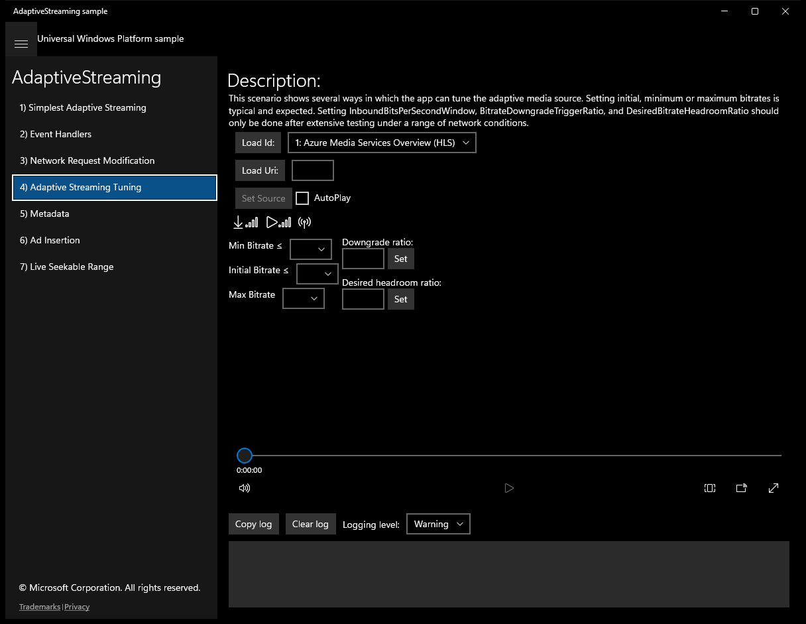

After click **Load Id:**:

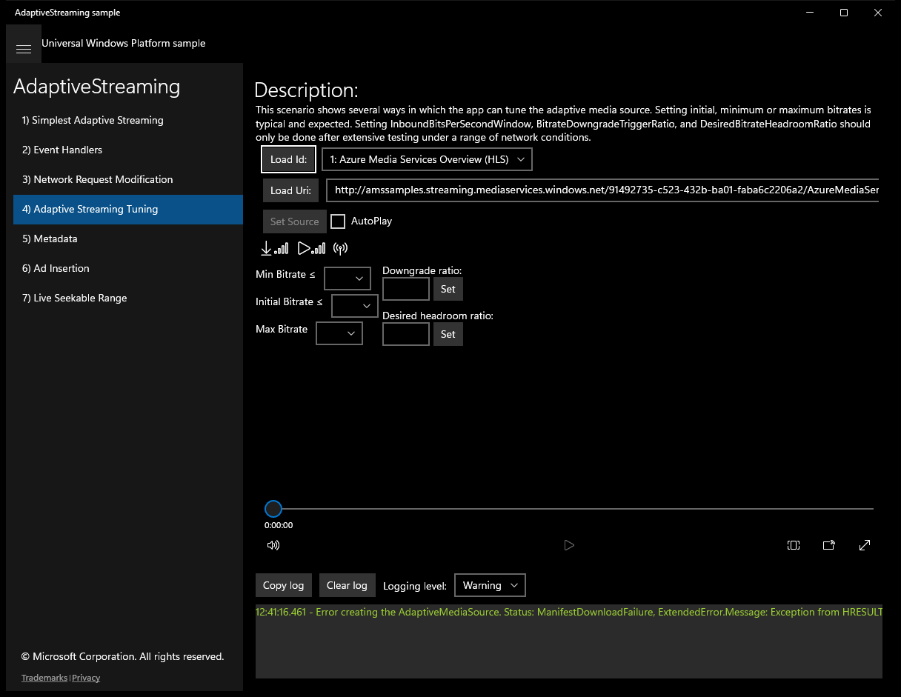

After click **Load Uri:**:

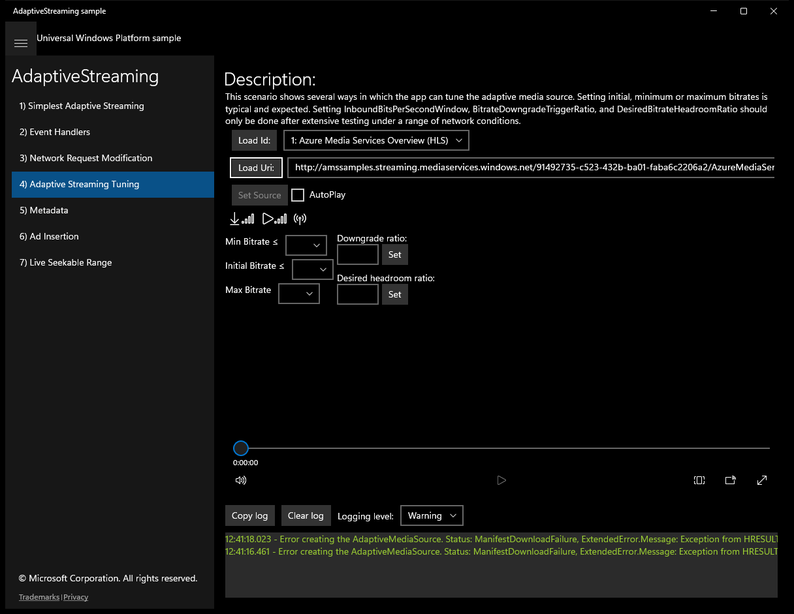

After click **Set**:

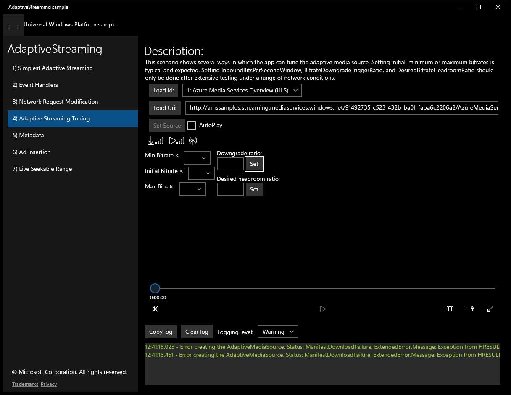

---

## Scenario 5 - Metadata

**Description**: This scenario shows several ways in which the app can consume or create timed metadata. Enter your own: HLS manifest URI which contains m3u8 comments or ID3 tags in the TS segments; or DASH manifest URI with fMp4 segments that contain emsg boxes (stce35 will be parsed to insert ads).

### UI elements
- **TextBlock**  - text="Description:"
- **MediaPlayerElement**  - x:Name="mediaPlayerElement"

### Code behavior
- **`OnNavigatedFrom`**
    - API refs: `ContentSelectorControl.MediaPlaybackItem`
- **`UnregisterHandlers`**
    - API refs: `Source.AdaptiveMediaSource`
- **`Page_OnLoaded`**
    - instantiates: `MediaPlayer`, `MediaPlayerLogger`, `PlayReadyHelper`
    - API refs: `ContentSelectorControl.Initialize`, `MainPage.ContentManagementSystemStub`, `ContentSelectorControl.SetAutoPlay`
- **`LoadSourceFromUriAsync`**
    - instantiates: `AdaptiveMediaSourceLogger`, `MediaSourceLogger`, `MediaPlaybackItem`, `MediaPlaybackItemLogger`
    - API refs: `AdaptiveMediaSource.CreateFromUriAsync`, `AdaptiveMediaSourceCreationStatus.Success`, `MediaSource.CreateFromAdaptiveMediaSource`, `ExtendedError.Message`, `ExtendedError.HResult`, `Guid.NewGuid`
- **`HideDescriptionOnSmallScreen`**
    - API refs: `Dispatcher.RunAsync`, `CoreDispatcherPriority.Normal`, `DescriptionText.Visibility`, `Visibility.Collapsed`, `Visibility.Visible`
- **`Source_OpenOperationCompleted`**
    - API refs: `CustomProperties.TryGetValue`, `TrackingEventCue.CreateTrackingEventsTrack`
- **`RegisterForMediaPlaybackItemEvents`**
    - API refs: `TimedMetadataTracks.Count`
- **`Item_TimedMetadataTracksChanged`**
    - API refs: `TimedMetadataTracks.Count`, `CollectionChange.ItemInserted`, `CollectionChange.Reset`
- **`RegisterMetadataHandlers`**
    - instantiates: `StringBuilder`
    - API refs: `Source.CustomProperties`, `MediaTrackKind.TimedMetadata`, `TimedMetadataKind.Data`, `TimedMetadataKind.Custom`, `String.Equals`, `StringComparison.OrdinalIgnoreCase`, `TimedMetadataTracks.SetPresentationMode`, `TimedMetadataTrackPresentationMode.ApplicationPresented`
- **`ScheduleAdFromScte35Payload`**
    - instantiates: `Uri`, `MediaBreak`, `MediaPlaybackItem`
    - API refs: `PlaybackItem.Source`, `StringSplitOptions.RemoveEmptyEntries`, `Position.HasValue`, `PresentationTimeStamp.HasValue`, `Dispatcher.RunAsync`, `CoreDispatcherPriority.Normal`, `MediaPlayer.PlaybackSession`, `TimeSpan.FromSeconds`, `PresentationTimeStamp.Value`, `Position.Value`, `TimeSpan.FromTicks`, `PlaybackSession.Position`, `Ams.Position`, `Position.GetValueOrDefault`, `Ams.PresentationTimeStamp`, `PresentationTimeStamp.GetValueOrDefault`, `Ams.ProgramDateTime`, `ProgramDateTime.GetValueOrDefault`, `MediaBreakInsertionMethod.Replace`, `MediaBreakInsertionMethod.Interrupt`, `TimeSpan.Zero`, `PlaybackList.Items`, `MediaSource.CreateFromUri`, `PlaybackItem.BreakSchedule`, `MediaPlayer.BreakManager`
- **`Log`**
    - API refs: `LoggerControl.Log`

### Screenshots
Initial state:

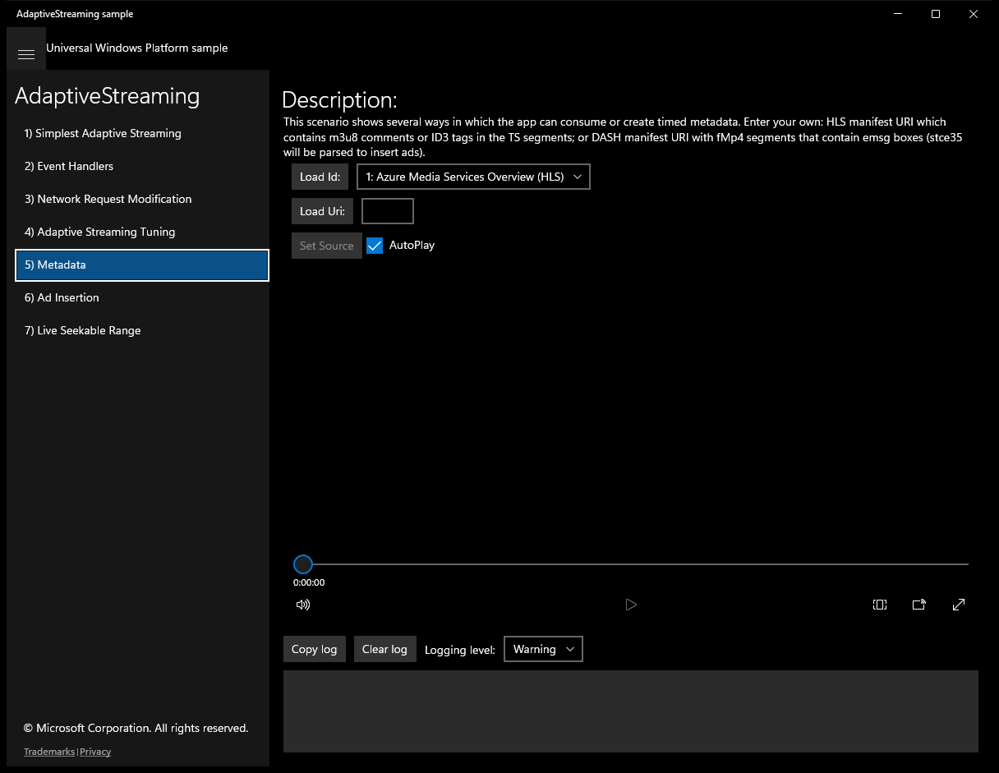

After click **Load Id:**:

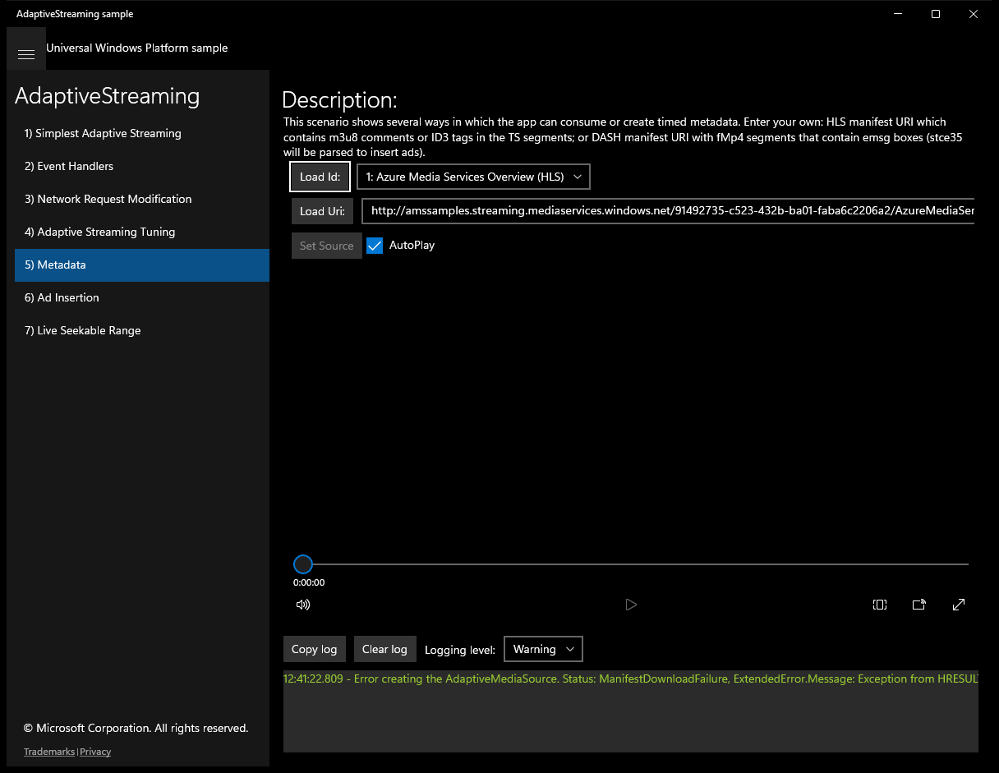

After click **Load Uri:**:

After click **Volume**:

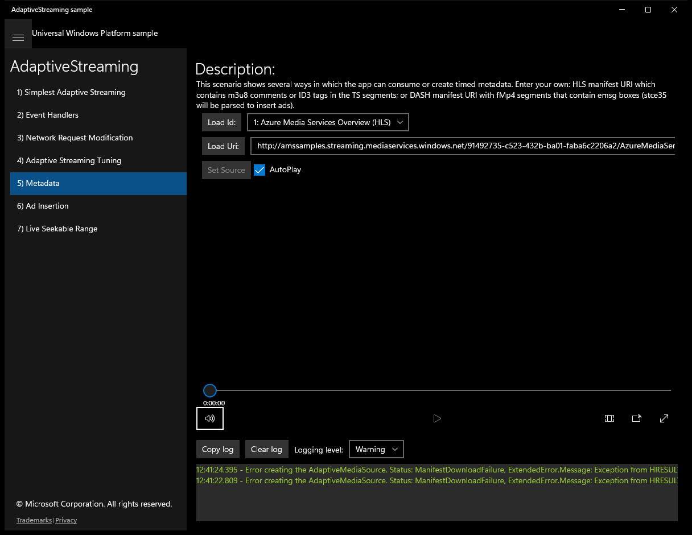

---

## Scenario 6 - Ad Insertion

**Description**: This scenario demonstrates simple Ad insertion with playback progress reporting. We add two pre-roll ads, two mid-roll ads at 10% into the main content, and a post-roll ad. For each of these ads, and the main content, we re-use the Custom TimedMetadataTracks from the Metadata sample to raise playback progress events.

### UI elements
- **TextBlock**  - text="Description:"
- **MediaPlayerElement**  - x:Name="mediaPlayerElement"

### Code behavior
- **`OnNavigatedFrom`**
    - API refs: `ContentSelectorControl.MediaPlaybackItem`
- **`UnregisterHandlers`**
    - API refs: `Source.AdaptiveMediaSource`
- **`Page_OnLoaded`**
    - instantiates: `MediaPlayer`, `MediaPlayerLogger`, `PlayReadyHelper`
    - API refs: `ContentSelectorControl.Initialize`, `MainPage.ContentManagementSystemStub`
- **`LoadSourceFromUriAsync`**
    - instantiates: `AdaptiveMediaSourceLogger`, `MediaSourceLogger`, `MediaPlaybackItem`, `MediaPlaybackItemLogger`
    - API refs: `AdaptiveMediaSource.CreateFromUriAsync`, `AdaptiveMediaSourceCreationStatus.Success`, `MediaSource.CreateFromAdaptiveMediaSource`, `ExtendedError.Message`, `ExtendedError.HResult`
- **`HideDescriptionOnSmallScreen`**
    - API refs: `Dispatcher.RunAsync`, `CoreDispatcherPriority.Normal`, `DescriptionText.Visibility`, `Visibility.Collapsed`, `Visibility.Visible`
- **`CreateMediaBreaksForItem`**
    - instantiates: `Uri`, `MediaPlaybackItem`, `MediaBreak`
    - API refs: `MediaSource.CreateFromUri`, `Source.CustomProperties`, `BreakSchedule.PrerollBreak`, `MediaBreakInsertionMethod.Interrupt`, `PlaybackList.Items`, `MediaSource.OpenOperationCompleted`, `Source.OpenOperationCompleted`, `MediaPlaybackItem.FindFromMediaSource`, `Duration.HasValue`, `TimeSpan.MaxValue`, `Source.AdaptiveMediaSource`, `TimeSpan.FromMinutes`, `Duration.Value`, `TimeSpan.FromTicks`, `MediaBreakInsertionMethod.Replace`, `BreakSchedule.InsertMidrollBreak`, `BreakSchedule.PostrollBreak`
- **`Source_OpenOperationCompleted`**
    - API refs: `CustomProperties.TryGetValue`, `TrackingEventCue.CreateTrackingEventsTrack`
- **`RegisterForMediaPlaybackItemEvents`**
    - API refs: `TimedMetadataTracks.Count`
- **`Item_TimedMetadataTracksChanged`**
    - API refs: `TimedMetadataTracks.Count`, `CollectionChange.ItemInserted`, `CollectionChange.Reset`
- **`RegisterMetadataHandlers`**
    - instantiates: `StringBuilder`
    - API refs: `Source.CustomProperties`, `MediaTrackKind.TimedMetadata`, `TimedMetadataKind.Custom`, `TimedMetadataTracks.SetPresentationMode`, `TimedMetadataTrackPresentationMode.ApplicationPresented`
- **`Log`**
    - API refs: `LoggerControl.Log`

### Screenshots
Initial state:

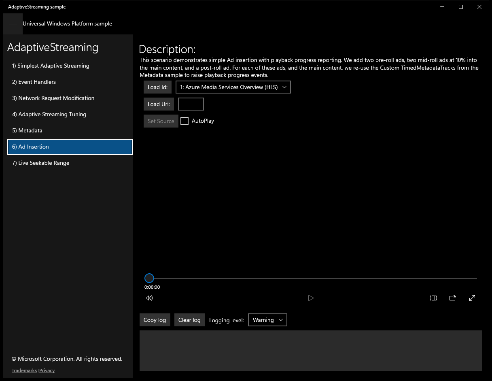

After click **Load Id:**:

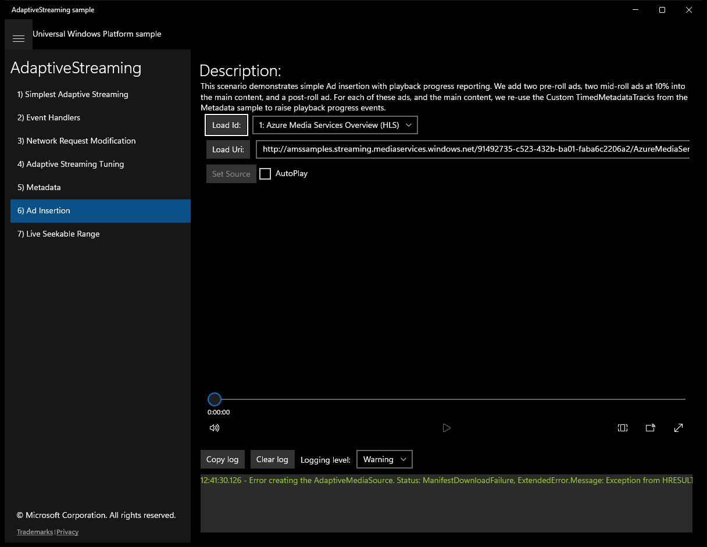

After click **Load Uri:**:

After click **Volume**:

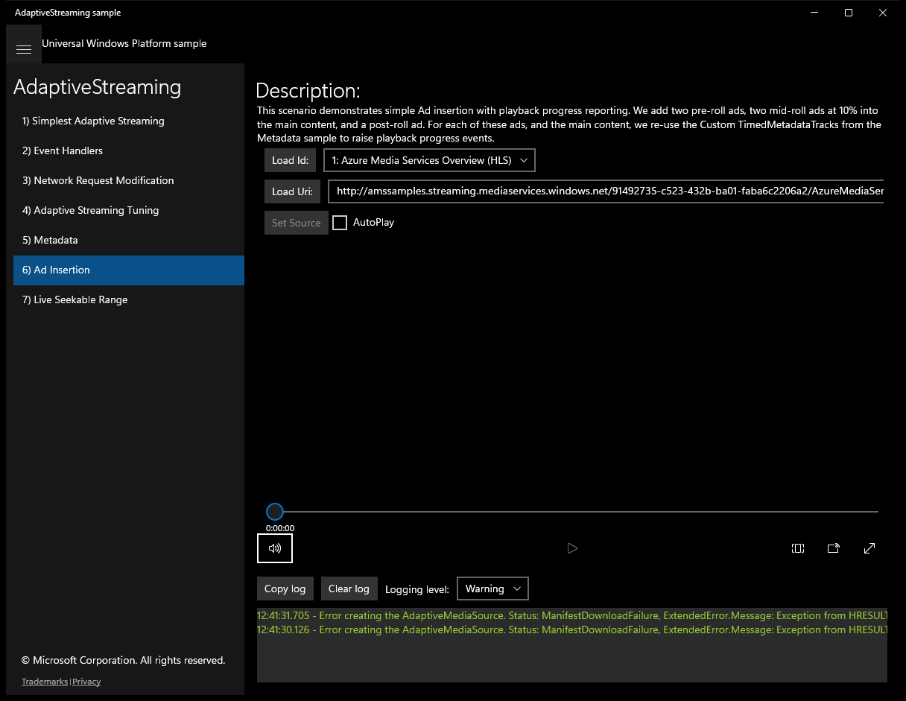

---

## Scenario 7 - Live Seekable Range

**Description**: This scenario demonstrates a seekable range in Live content, also known as a Live DVR window.

### UI elements
- **TextBlock**  - text="Description:"
- **TextBlock**  - text="This scenario demonstrates a seekable range in Live content, also known as a Live DVR window."
- **MediaPlayerElement**  - x:Name="mediaPlayerElement"
- **TextBlock**  - text="MaxSeekableWindowSize"
- **TextBlock**  - x:Name="MaxSeekableWindowSize"; text="MaxSeekableWindowSize"
- **TextBlock**  - text="DesiredSeekableWindowSize"
- **TextBox**  - x:Name="DesiredSeekableWindowSize"; text="DesiredSeekableWindowSize"
- **Button**  - x:Name="DesiredSeekableWindowSizeButton"; content="Set"; events: Click=DesiredSeekableWindowSizeButton_Click
- **TextBlock**  - text="DesiredLiveOffset"
- **TextBox**  - x:Name="DesiredLiveOffset"; text="DesiredLiveOffset"
- **Button**  - x:Name="DesiredLiveOffsetButton"; content="Set"; events: Click=DesiredLiveOffsetButton_Click
- **TextBlock**  - text="MinLiveOffset"
- **TextBlock**  - x:Name="MinLiveOffset"; text="MinLiveOffset"
- **TextBlock**  - text="StartPosition"
- **TextBlock**  - x:Name="StartPosition"; text="Start"
- **TextBlock**  - text="CurrentPosition"
- **TextBlock**  - x:Name="CurrentPosition"; text="Current"
- **TextBlock**  - text="EndPosition"
- **TextBlock**  - x:Name="EndPosition"; text="End"
- **Slider**  - x:Name="PositionSlider"
- **Button**  - x:Name="LogCurrentTimeCorrelation"; content="Log Times"; events: Click=LogCurrentTimeCorrelation_Click
- **Button**  - x:Name="GoToStart"; content="GoToStart"; events: Click=GoToStart_Click
- **Button**  - content="<<15m"; events: Click=SeekFixedAmount_Click
- **Button**  - content="<<5m"; events: Click=SeekFixedAmount_Click
- **Button**  - content="<<30s"; events: Click=SeekFixedAmount_Click
- **Button**  - content="<<2s"; events: Click=SeekFixedAmount_Click
- **Button**  - x:Name="PlayButton"; events: Click=Play_Click
- **Button**  - x:Name="PauseButton"; events: Click=Pause_Click
- **Button**  - content="2s>>"; events: Click=SeekFixedAmount_Click
- **Button**  - content="30s>>"; events: Click=SeekFixedAmount_Click
- **Button**  - content="5m>>"; events: Click=SeekFixedAmount_Click
- **Button**  - content="15m>>"; events: Click=SeekFixedAmount_Click
- **Button**  - x:Name="GoToLive"; content="GoToLive"; events: Click=GoToLive_Click

### Code behavior
- **`OnNavigatedFrom`**
    - API refs: `ContentSelectorControl.MediaPlaybackItem`
- **`Page_OnLoaded`**
    - instantiates: `MediaPlayer`, `MediaPlayerLogger`, `PlayReadyHelper`
    - API refs: `ContentSelectorControl.Initialize`, `MainPage.ContentManagementSystemStub`, `ContentSelectorControl.SetAutoPlay`, `LoggerControl.Height`
- **`LoadSourceFromUriAsync`**
    - instantiates: `AdaptiveMediaSourceLogger`, `MediaSourceLogger`, `MediaPlaybackItem`, `MediaPlaybackItemLogger`
    - API refs: `AdaptiveMediaSource.CreateFromUriAsync`, `AdaptiveMediaSourceCreationStatus.Success`, `MediaSource.CreateFromAdaptiveMediaSource`, `MaxSeekableWindowSize.HasValue`, `ExtendedError.Message`, `ExtendedError.HResult`, `Guid.NewGuid`
- **`HideDescriptionOnSmallScreen`**
    - API refs: `Dispatcher.RunAsync`, `CoreDispatcherPriority.Normal`, `DescriptionText.Visibility`, `Visibility.Collapsed`, `Visibility.Visible`
- **`DesiredSeekableWindowSizeButton_Click`**
    - API refs: `MediaPlayer.Source`, `DesiredSeekableWindowSize.GetValueOrDefault`, `TimeSpan.TryParse`, `DesiredSeekableWindowSize.Text`
- **`DesiredLiveOffsetButton_Click`**
    - API refs: `MediaPlayer.Source`, `TimeSpan.TryParse`, `DesiredLiveOffset.Text`
- **`UpdateSeekableWindowControls`**
    - API refs: `MediaPlayer.Source`
- **`UpdateSeekableWindowControls`**
    - API refs: `Dispatcher.RunAsync`, `CoreDispatcherPriority.Normal`, `MaxSeekableWindowSize.Text`, `MaxSeekableWindowSize.HasValue`, `MaxSeekableWindowSize.Value`, `DesiredSeekableWindowSize.Text`, `DesiredSeekableWindowSize.HasValue`, `DesiredSeekableWindowSize.Value`, `DesiredLiveOffset.Text`, `DesiredLiveOffset.ToString`, `MinLiveOffset.Text`, `MinLiveOffset.HasValue`, `MinLiveOffset.Value`
- **`RegisterForPositionUpdateControls`**
    - API refs: `PositionSlider.Minimum`, `PositionSlider.Maximum`, `PositionSlider.Value`, `PlaybackSession.PositionChanged`, `PlaybackSession.SeekableRangesChanged`
- **`PositionUpdateControl_SourceChanged`**
    - API refs: `TimeSpan.FromHours`, `TimeSpan.Zero`
- **`UnregisterForPositionUpdateControl`**
    - API refs: `PlaybackSession.PositionChanged`, `PlaybackSession.SeekableRangesChanged`
- **`UpdateSeekableRangesControl`**
    - API refs: `SeekableRanges.Count`, `SeekableRanges.First`, `SeekableRangeMin.Start`, `SeekableRanges.Last`, `SeekableRangeMax.End`, `TimeSpan.FromHours`, `TimeSpan.Zero`, `Dispatcher.RunAsync`, `CoreDispatcherPriority.Normal`, `StartPosition.Text`, `EndPosition.Text`
- **`PositionUpdateControl_PositionChanged`**
    - API refs: `Dispatcher.RunAsync`, `CoreDispatcherPriority.Normal`, `CurrentPosition.Text`, `PositionSlider.Value`
- **`SeekToRequestedPosition`**
    - API refs: `MediaPlayer.PlaybackSession`
- **`GetPlaybackPosition`**
    - API refs: `TimeSpan.Zero`, `TimeSpan.FromTicks`, `MinPosition.Ticks`
- **`GetSliderPositionAtPlaybackPosition`**
    - API refs: `TimeSpan.Zero`, `LoggerControl.Log`, `LogViewLoggingLevel.Error`
- **`SeekFixedAmount_Click`**
    - API refs: `TimeSpan.Zero`, `Tag.ToString`, `TimeSpan.TryParse`, `MediaPlayer.PlaybackSession`
- **`Play_Click`**
    - API refs: `MediaPlayer.PlaybackSession`, `MediaPlaybackState.Paused`, `MediaPlayer.Play`
- **`Pause_Click`**
    - API refs: `MediaPlayer.PlaybackSession`, `MediaPlaybackState.Playing`, `MediaPlayer.Pause`
- **`GoToStart_Click`**
    - API refs: `MediaPlayer.PlaybackSession`
- **`GoToLive_Click`**
    - API refs: `MediaPlayer.PlaybackSession`
- **`RegisterForDiscreteControls`**
    - API refs: `PlaybackSession.PlaybackStateChanged`
- **`UnregisterForDiscreteControls`**
    - API refs: `PlaybackSession.PlaybackStateChanged`
- **`MediaPlayer_PlaybackSession_PlaybackStateChanged`**
    - API refs: `Dispatcher.RunAsync`, `CoreDispatcherPriority.Normal`, `MediaPlaybackState.None`, `MediaPlaybackState.Opening`, `MediaPlaybackState.Buffering`, `PlayButton.IsEnabled`, `PauseButton.IsEnabled`, `MediaPlaybackState.Playing`, `MediaPlaybackState.Paused`
- **`LogCurrentTimeCorrelation_Click`**
    - API refs: `MediaPlayer.Source`
- **`Log`**
    - API refs: `LoggerControl.Log`

### Screenshots
Initial state:

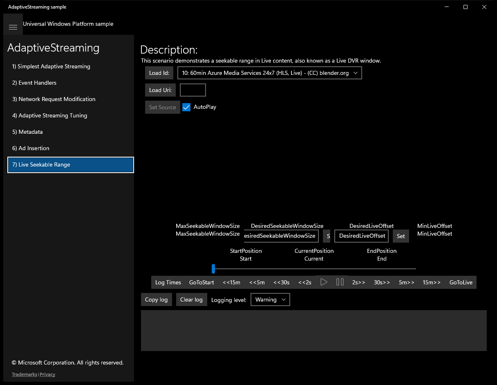

After click **Load Id:**:

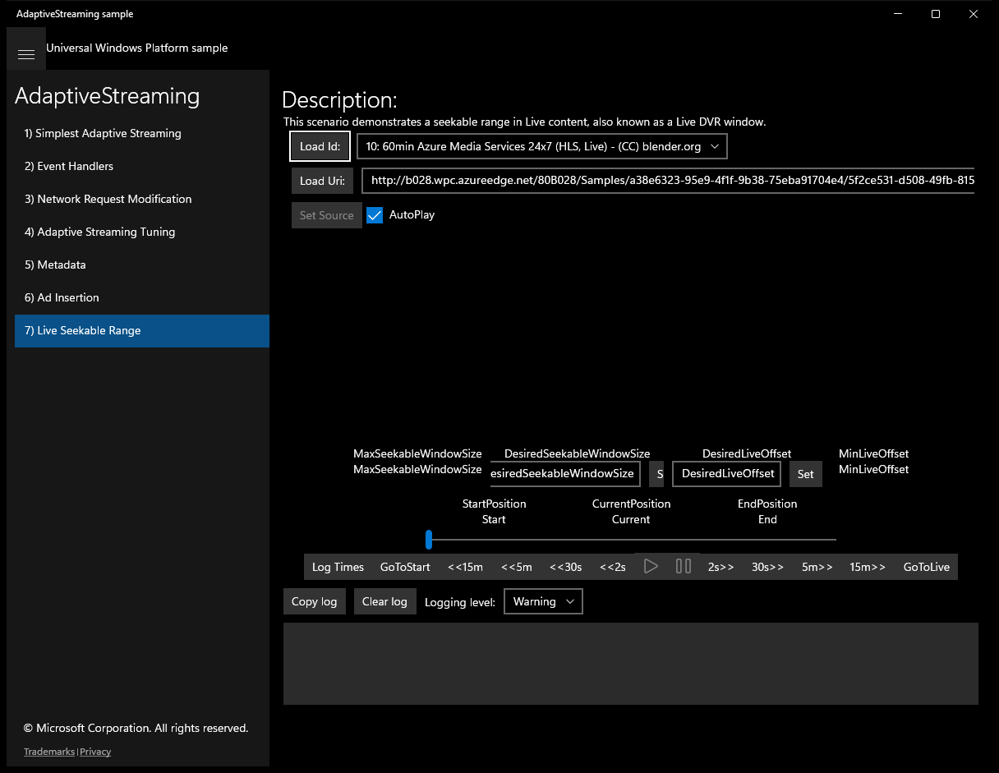

After click **Load Uri:**:

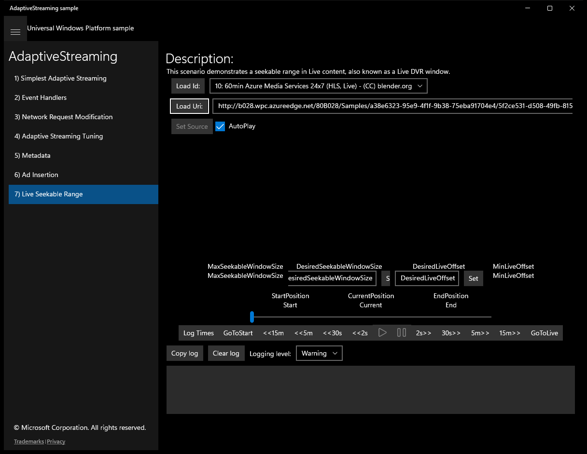

After click **Set**:

