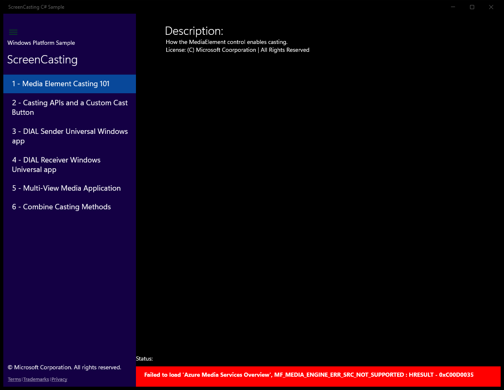
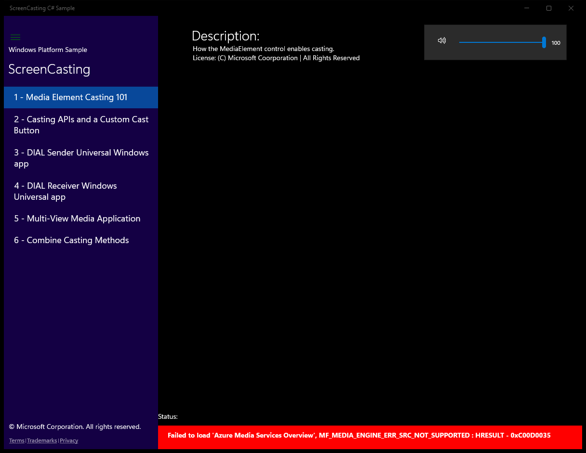
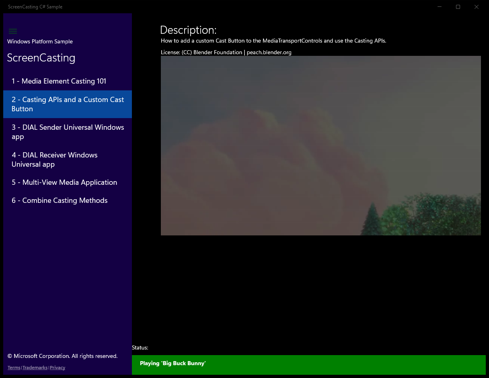
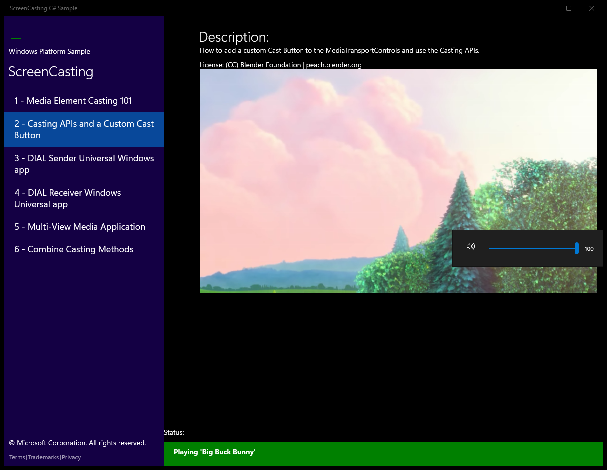
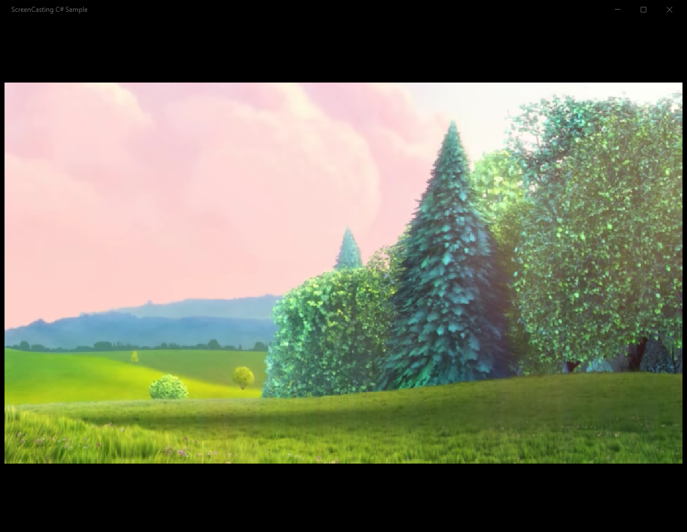
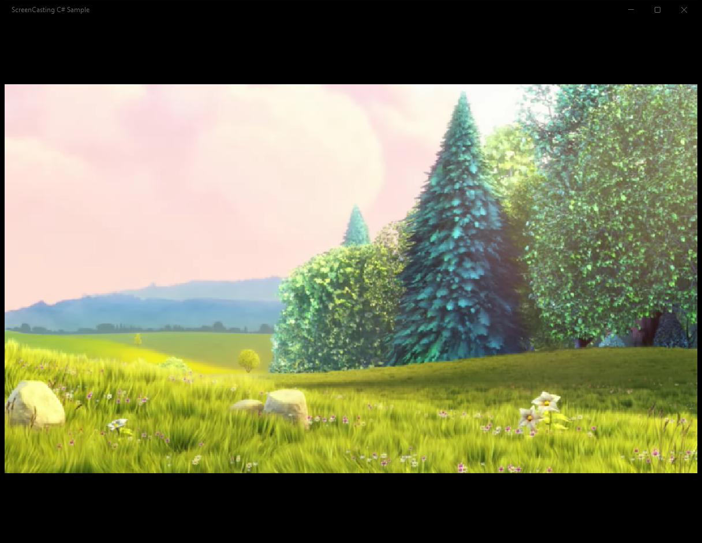
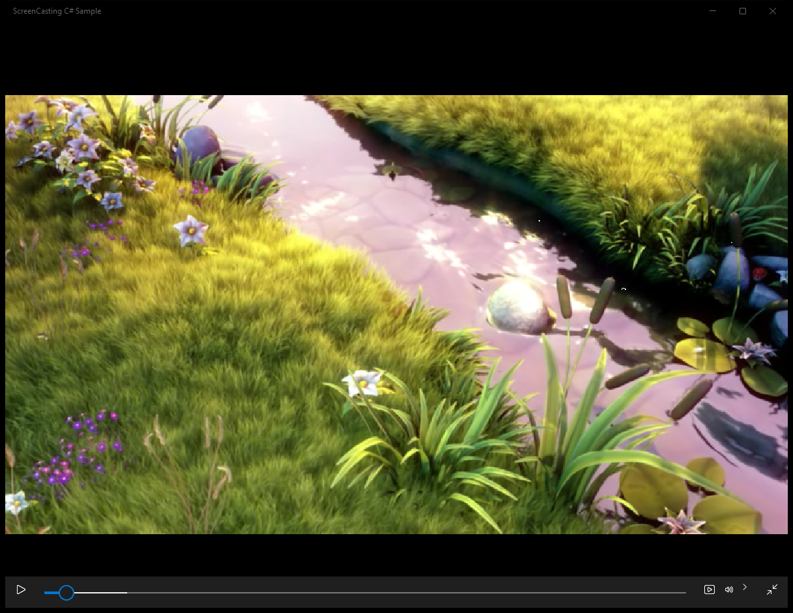
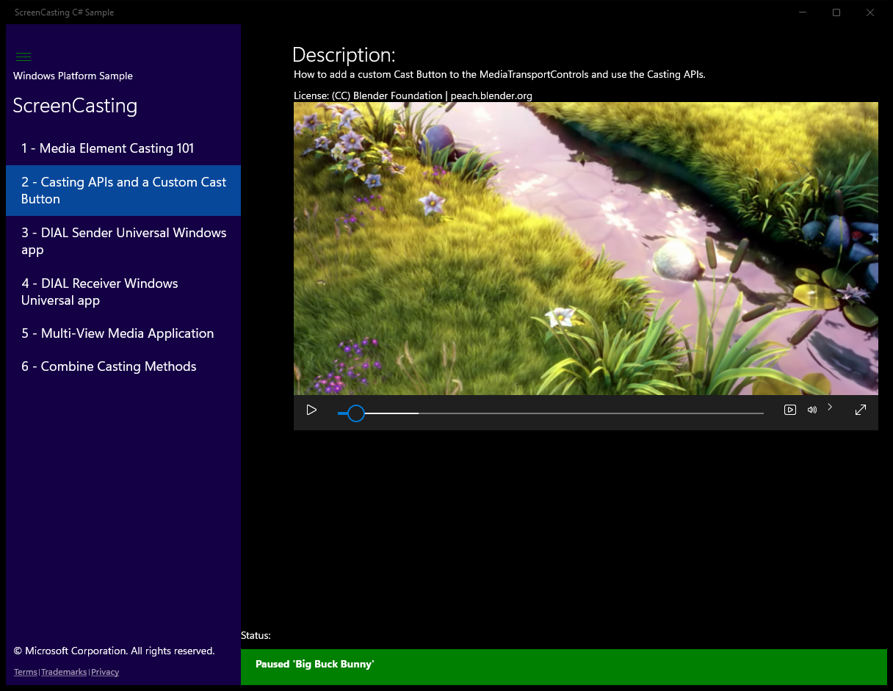
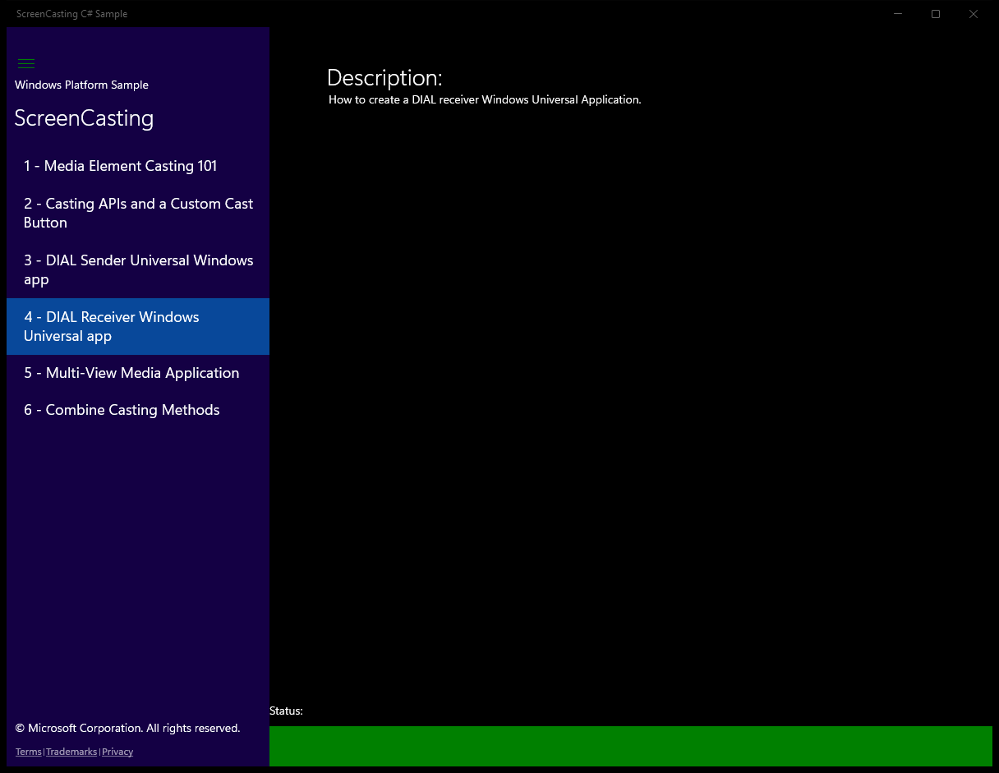

# AdvancedCasting (C#)

> **Source**: `Samples\AdvancedCasting\cs\`  
> **Feature**: ScreenCasting  
> **AUMID**: `Microsoft.SDKSamples.ScreenCasting.CS_8wekyb3d8bbwe!App`  
> **PackageFamilyName**: `Microsoft.SDKSamples.ScreenCasting.CS_8wekyb3d8bbwe`  

## Top-level UWP namespaces used
- `Windows.UI.Colors.Green`
- `Windows.UI.Colors.Red`
- `Windows.System.Launcher.LaunchUriAsync`

## Build / deploy / capture status
- build: ok
- deploy: ok
- launch: ok
- capture: ok
- uninstall: ok

## Main page

---

## Scenario 1 - 1 - Media Element Casting 101

### Screenshots
Initial state:

After click **Play**:

After click **Volume**:

After click **Aspect Ratio**:

---

## Scenario 2 - 2 - Casting APIs and a Custom Cast Button

### Screenshots
Initial state:

After click **Play**:

After click **Volume**:

After click **Full Screen**:

---

## Scenario 3 - 3 - DIAL Sender Universal Windows app

### Screenshots
Initial state:

After click **Pause**:

After click **Volume**:

After click **Exit Full Screen**:

---

## Scenario 4 - 4 - DIAL Receiver Windows Universal app

### Screenshots
Initial state:

---

## Scenario 5 - 5 - Multi-View Media Application

---

## Scenario 6 - 6 - Combine Casting Methods

---

## MainPage (static analysis)

This sample is a single-page app (no scenario list). The MainPage covers the entire functionality.

### UI elements
- **TextBlock**  - x:Name="Header"; text="Windows Platform Sample"
- **TextBlock**  - x:Name="SampleTitle"; text="Sample Title Here"
- **ListBox**  - x:Name="ScenarioControl"
- **TextBlock**  - text="{Binding Title}"
- **TextBlock**  - x:Name="Copyright"; text="© Microsoft Corporation. All rights reserved."
- **HyperlinkButton**  - content="Terms"; events: Click=Footer_Click
- **TextBlock**  - text="|"
- **HyperlinkButton**  - content="Trademarks"; events: Click=Footer_Click
- **TextBlock**  - text="|"
- **HyperlinkButton**  - x:Name="PrivacyLink"; content="Privacy"; events: Click=Footer_Click
- **TextBlock**  - x:Name="StatusLabel"; text="Status:"
- **TextBlock**  - x:Name="StatusBlock"
- **ToggleButton**  - events: Click=Button_Click

### Code behavior
- **`MainPage`**
    - API refs: `SampleTitle.Text`
- **`OnNavigatedTo`**
    - instantiates: `Frame`
    - API refs: `ApplicationView.GetForCurrentView`, `ScenarioControl.SelectionChanged`, `ScenarioControl.ItemsSource`, `ScenarioControl.SelectedIndex`, `Window.Current`
- **`ScenarioControl_SelectionChanged`**
    - API refs: `String.Empty`, `NotifyType.StatusMessage`, `ScenarioFrame.Navigate`, `Window.Current`, `Bounds.Width`, `Splitter.IsPaneOpen`, `StatusBorder.Visibility`, `Visibility.Collapsed`, `Visibility.Visible`
- **`NavigateToScenario`**
    - instantiates: `Frame`
    - API refs: `String.Empty`, `NotifyType.StatusMessage`, `ScenarioControl.SelectionChanged`, `Items.Count`, `ScenarioFrame.Navigate`, `Window.Current`, `Bounds.Width`, `Splitter.IsPaneOpen`, `StatusBorder.Visibility`, `Visibility.Collapsed`, `Visibility.Visible`
- **`NotifyUser`**
    - namespaces: `Windows.UI.Colors.Green`, `Windows.UI.Colors.Red`
    - instantiates: `SolidColorBrush`
    - API refs: `NotifyType.StatusMessage`, `StatusBorder.Background`, `Windows.UI`, `Colors.Green`, `NotifyType.ErrorMessage`, `Colors.Red`, `StatusBlock.Text`, `StatusBorder.Visibility`, `String.Empty`, `Visibility.Visible`, `Visibility.Collapsed`
- **`Footer_Click`**
    - namespaces: `Windows.System.Launcher.LaunchUriAsync`
    - instantiates: `Uri`
    - API refs: `Windows.System`, `Launcher.LaunchUriAsync`, `Tag.ToString`
- **`Button_Click`**
    - API refs: `Splitter.IsPaneOpen`, `StatusBorder.Visibility`, `Visibility.Collapsed`

