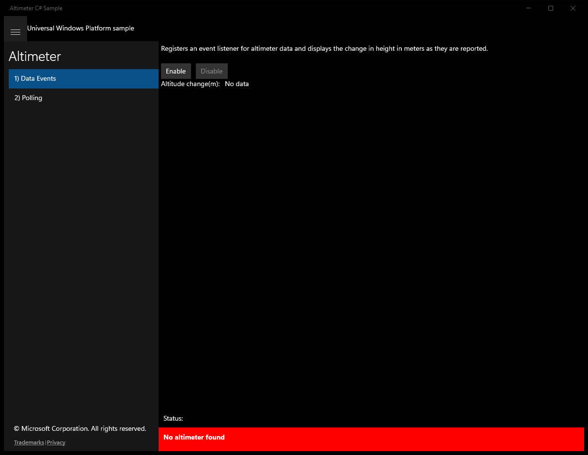
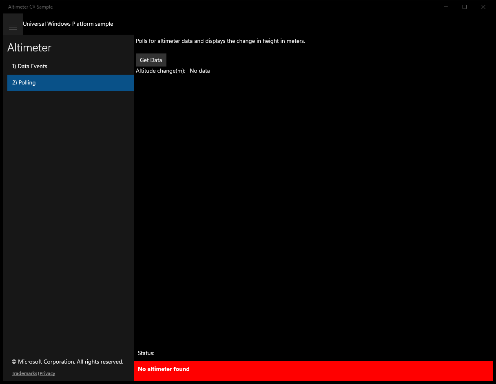

# Altimeter (C#)

> **Source**: `Samples\Altimeter\cs\`  
> **Feature**: Altimeter  
> **AUMID**: `Microsoft.SDKSamples.Altimeter.CS_8wekyb3d8bbwe!App`  
> **PackageFamilyName**: `Microsoft.SDKSamples.Altimeter.CS_8wekyb3d8bbwe`  

## Build / deploy / capture status
- build: ok
- deploy: ok
- launch: ok
- capture: ok
- uninstall: ok

## Main page

---

## Scenario 1 - Data Events

### UI elements
- **TextBlock**  - x:Name="InputTextBlock"; text="Registers an event listener for altimeter data and displays the change in height in meters as they are reported."
- **Button**  - x:Name="ScenarioEnableButton"; content="Enable"; events: Click=ScenarioEnable
- **Button**  - x:Name="ScenarioDisableButton"; content="Disable"; events: Click=ScenarioDisable
- **TextBlock**  - text="Altitude change(m): "
- **TextBlock**  - x:Name="ScenarioOutput_M"; text="No data"

### Code behavior
- **`OnNavigatedTo`**
    - API refs: `ScenarioEnableButton.IsEnabled`, `ScenarioDisableButton.IsEnabled`
- **`OnNavigatingFrom`**
    - instantiates: `WindowVisibilityChangedEventHandler`, `TypedEventHandler`
    - API refs: `ScenarioDisableButton.IsEnabled`, `Window.Current`
- **`VisibilityChanged`**
    - instantiates: `TypedEventHandler`
    - API refs: `ScenarioDisableButton.IsEnabled`
- **`ReadingChanged`**
    - API refs: `Dispatcher.RunAsync`, `CoreDispatcherPriority.Normal`, `ScenarioOutput_M.Text`, `String.Format`
- **`ScenarioEnable`**
    - instantiates: `WindowVisibilityChangedEventHandler`, `TypedEventHandler`
    - API refs: `Window.Current`, `ScenarioEnableButton.IsEnabled`, `ScenarioDisableButton.IsEnabled`, `NotifyType.ErrorMessage`
- **`ScenarioDisable`**
    - instantiates: `WindowVisibilityChangedEventHandler`, `TypedEventHandler`
    - API refs: `Window.Current`, `ScenarioEnableButton.IsEnabled`, `ScenarioDisableButton.IsEnabled`

### Screenshots
Initial state:

After click **Enable**:

---

## Scenario 2 - Polling

### UI elements
- **TextBlock**  - x:Name="InputTextBlock"; text="Polls for altimeter data and displays the change in height in meters."
- **Button**  - x:Name="ScenarioGetDataButton"; content="Get Data"; events: Click=ScenarioGetData
- **TextBlock**  - text="Altitude change(m): "
- **TextBlock**  - x:Name="ScenarioOutput_M"; text="No data"

### Code behavior
- **`ScenarioGetData`**
    - API refs: `ScenarioOutput_M.Text`, `String.Format`, `NotifyType.ErrorMessage`

### Screenshots
Initial state:

After click **Get Data**:

