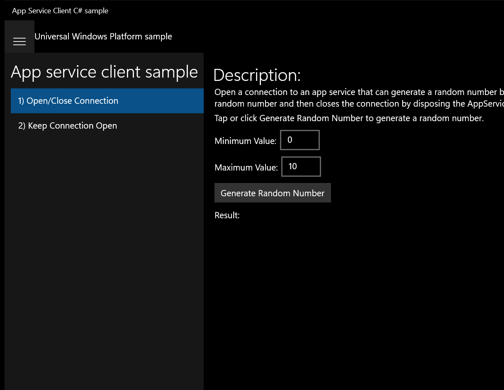
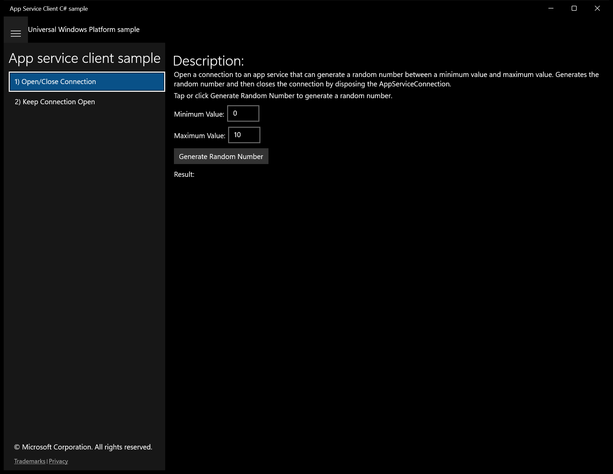
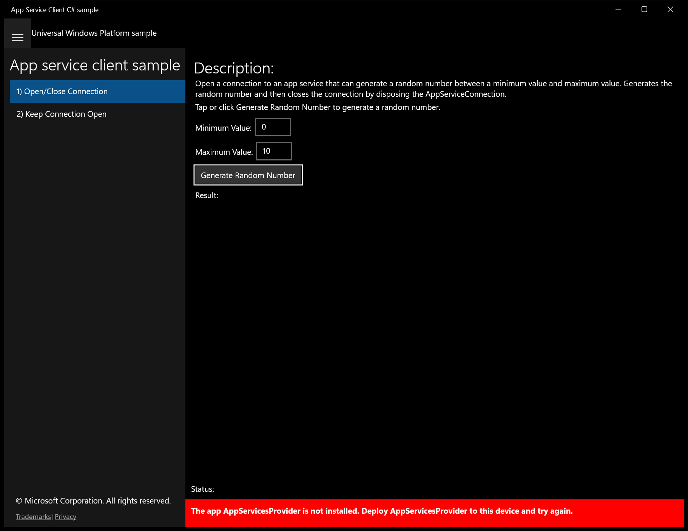
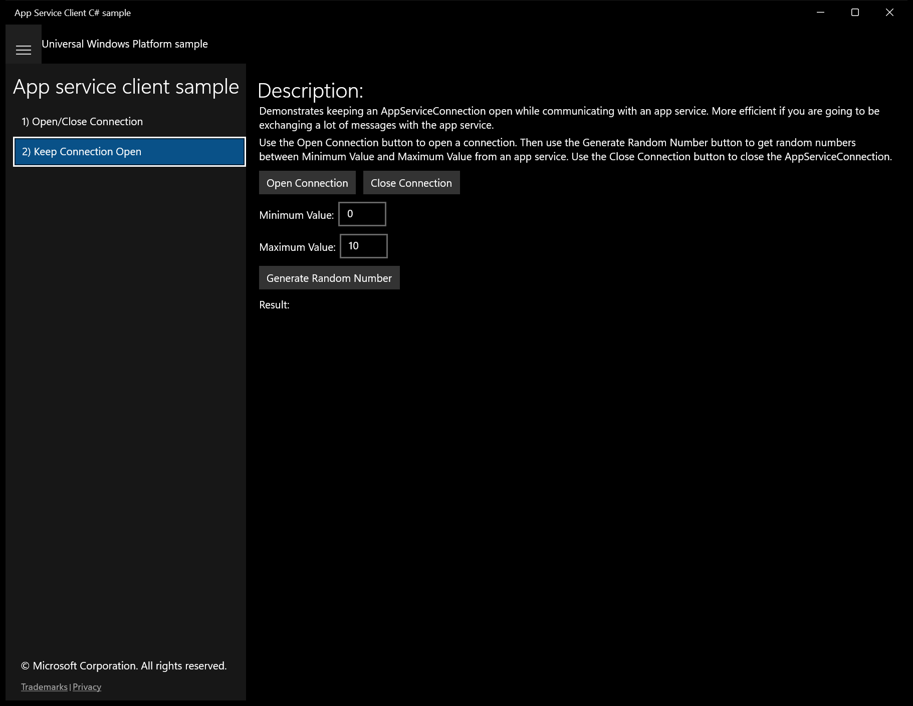
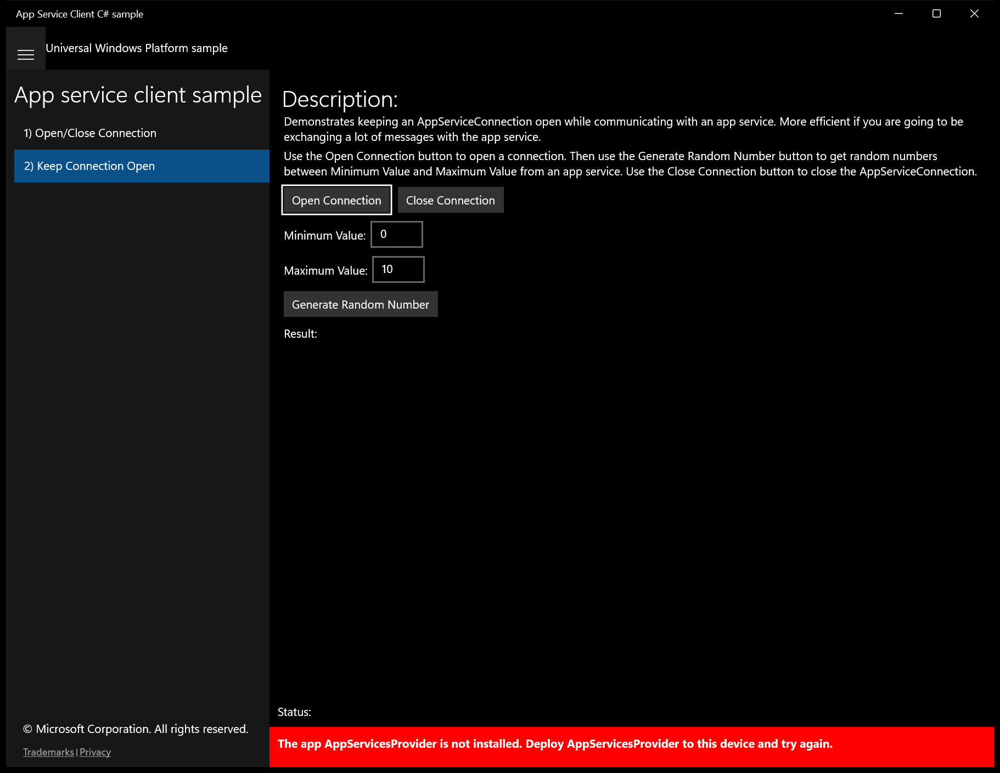
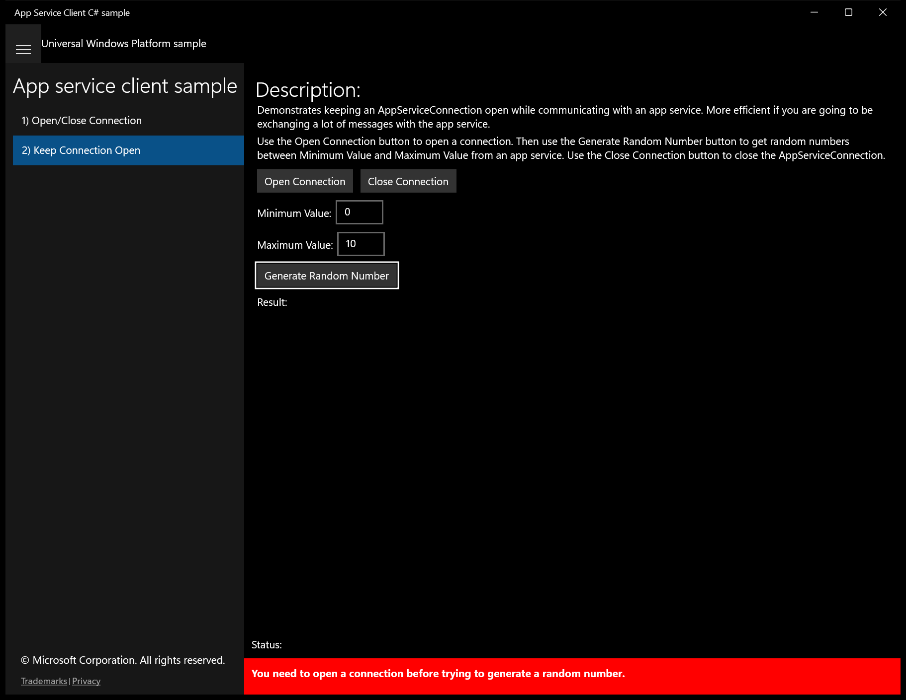

# AppServices_AppServicesClient (C#)

> **Source**: `Samples\AppServices_AppServicesClient\cs\`  
> **Feature**: App service client sample  
> **AUMID**: `Microsoft.SDKSamples.AppServicesClient.CS_8wekyb3d8bbwe!AppServicesClient.App`  
> **PackageFamilyName**: `Microsoft.SDKSamples.AppServicesClient.CS_8wekyb3d8bbwe`  

## Build / deploy / capture status
- build: ok
- deploy: ok
- launch: ok
- capture: ok
- uninstall: ok

## Main page

---

## Scenario 1 - 1) Open/Close Connection

### Screenshots
Initial state:

After click **Generate Random Number**:

---

## Scenario 2 - 2) Keep Connection Open

### Screenshots
Initial state:

After click **Open Connection**:

After click **Generate Random Number**:

