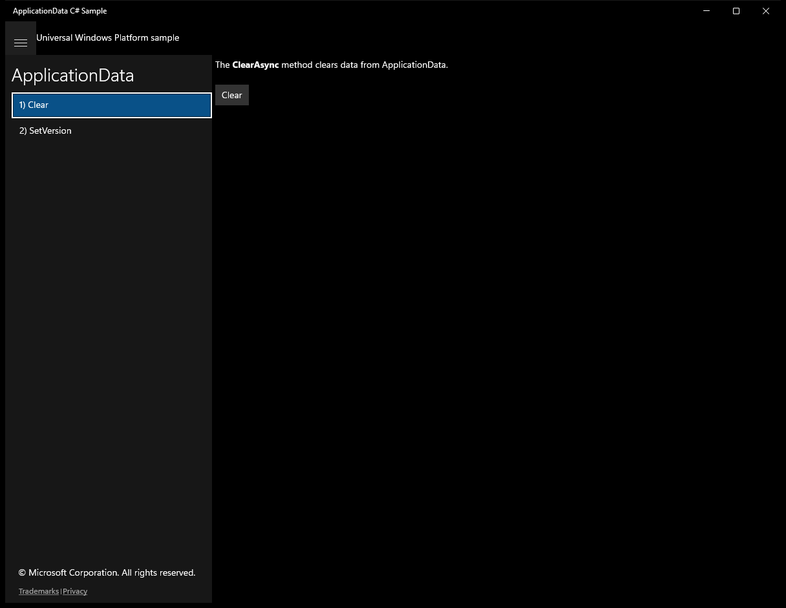
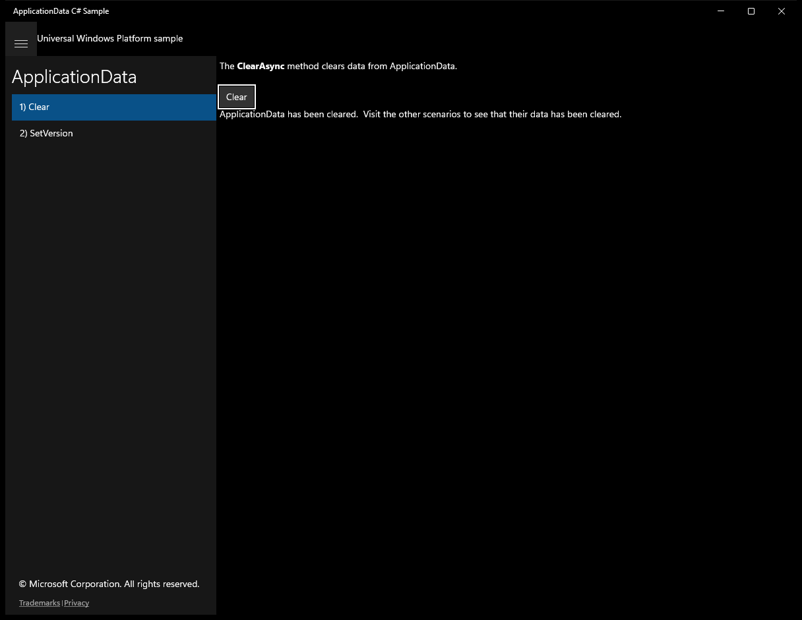
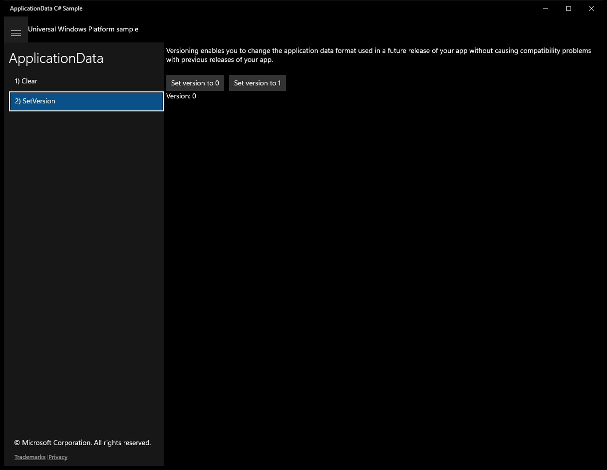
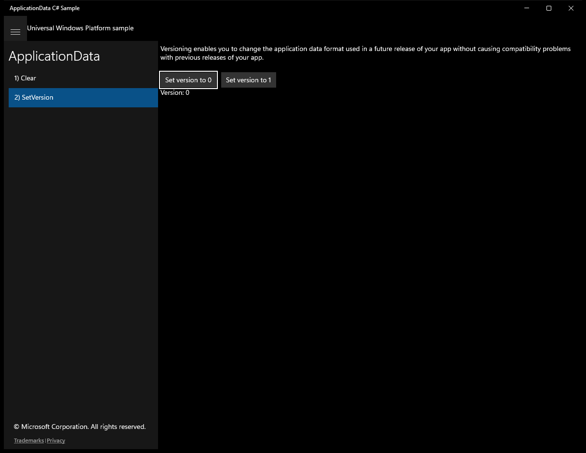
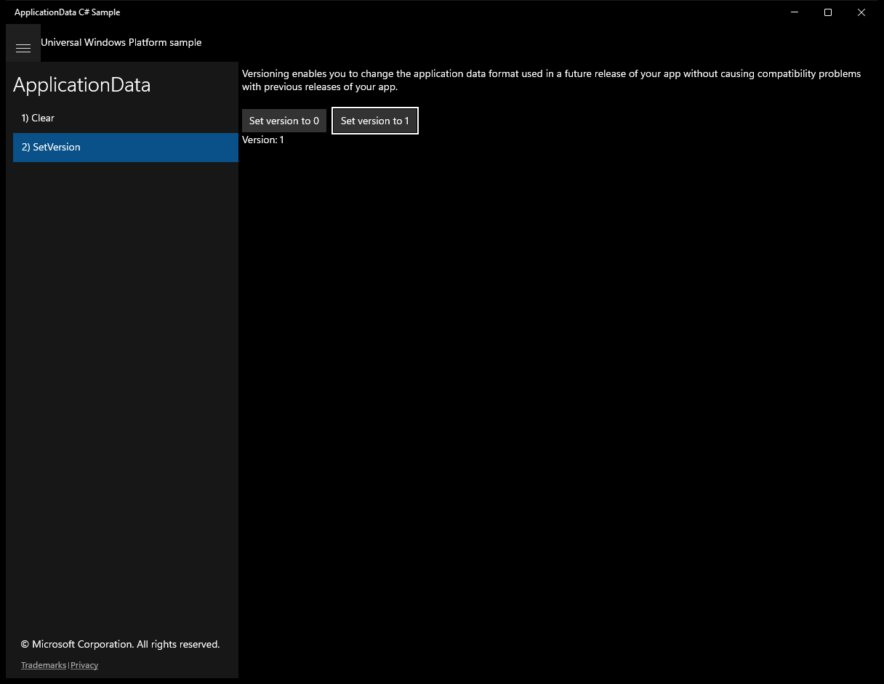

# ApplicationData (C#)

> **Source**: `Samples\ApplicationData\cs\`  
> **Feature**: ApplicationData  
> **AUMID**: `Microsoft.SDKSamples.ApplicationData.CS_8wekyb3d8bbwe!App`  
> **PackageFamilyName**: `Microsoft.SDKSamples.ApplicationData.CS_8wekyb3d8bbwe`  

## Sample purpose
Shows how to store and retrieve data that is specific to each user and app by using the Windows Runtime application data APIs.

## Scenarios demonstrated (from README)
- Reading and writing settings to an app data store
- Reading and writing files to an app data store

## Top-level UWP namespaces used
- `Windows.Storage.ApplicationData.Current.ClearAsync`

## Build / deploy / capture status
- build: skipped
- deploy: ok
- launch: ok
- capture: ok
- uninstall: ok

## Main page

---

## Scenario 1 - Clear

### UI elements
- **TextBlock**  - text="The ClearAsync method clears data from ApplicationData."
- **Button**  - x:Name="Clear"; content="Clear"; events: Click=Clear_Click
- **TextBlock**  - x:Name="OutputTextBlock"

### Code behavior
- **`Clear_Click`**
    - namespaces: `Windows.Storage.ApplicationData.Current.ClearAsync`
    - API refs: `Windows.Storage`, `ApplicationData.Current`, `OutputTextBlock.Text`
    - updates UI: `OutputTextBlock.Text`

### Screenshots
Initial state:

After click **Clear**:

---

## Scenario 2 - SetVersion

### UI elements
- **TextBlock**  - text="Versioning enables you to change the application data format used in a future release of your app without causing compatibility problems with previous releases of your app."
- **Button**  - x:Name="SetVersion0"; content="Set version to 0"; events: Click=SetVersion0_Click
- **Button**  - x:Name="SetVersion1"; content="Set version to 1"; events: Click=SetVersion1_Click
- **TextBlock**  - x:Name="OutputTextBlock"

### Code behavior
- **`SetVersionHandler0`**
    - instantiates: `Exception`
    - API refs: `LocalSettings.Values`
- **`SetVersionHandler1`**
    - instantiates: `Exception`
    - API refs: `LocalSettings.Values`
- **`DisplayOutput`**
    - API refs: `OutputTextBlock.Text`
    - updates UI: `OutputTextBlock.Text`

### Screenshots
Initial state:

After click **Set version to 0**:

After click **Set version to 1**:

