# ApplicationResources (C#)

> **Source**: `Samples\ApplicationResources\cs\`  
> **AUMID**: `Microsoft.SDKSamples.ApplicationResources.CS_8wekyb3d8bbwe!ApplicationResources.App`  
> **PackageFamilyName**: `Microsoft.SDKSamples.ApplicationResources.CS_8wekyb3d8bbwe`  

## Top-level UWP namespaces used
- `Windows.UI.Core.CoreDispatcherPriority.Normal`
- `Windows.System.Threading.ThreadPool.RunAsync`
- `Windows.ApplicationModel.Resources`
- `Windows.ApplicationModel.Resources.Core`

## Build / deploy / capture status
- build: ok
- deploy: ok
- launch: ok
- capture: ok
- uninstall: ok

## Main page
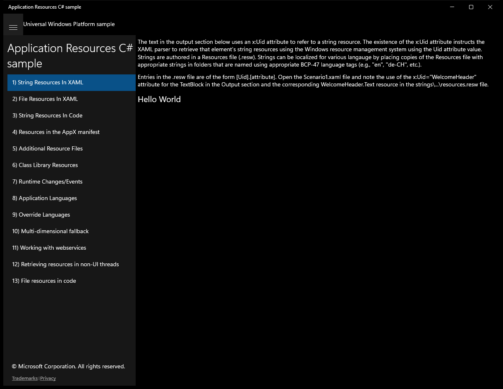

---

## Scenario 1 - scenario1

### Screenshots
Initial state:

---

## Scenario 2 - scenario2

### Screenshots
Initial state:

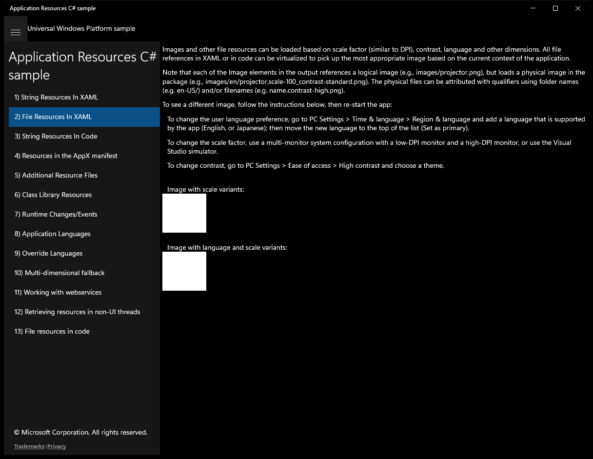

---

## Scenario 3 - scenario3

### Code behavior
- **`OnNavigatedTo`**
    - API refs: `Scenario3TextBlock.Text`
    - updates UI: `Scenario3TextBlock.Text`
- **`Scenario3Button_Show_Click`**
    - API refs: `ResourceLoader.GetForCurrentView`, `Scenario3TextBlock.Text`
    - updates UI: `Scenario3TextBlock.Text`

### Screenshots
Initial state:

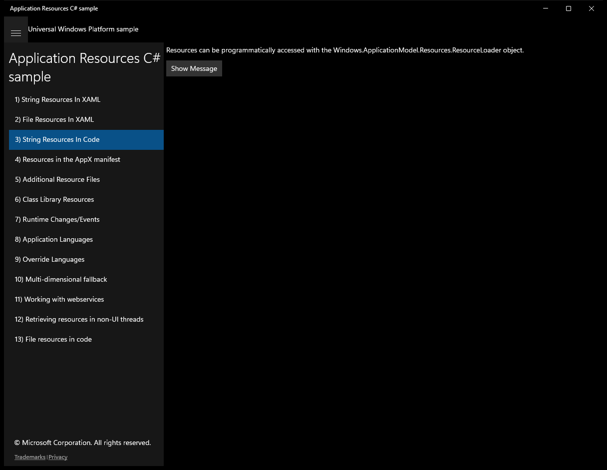

After click **Show Message**:

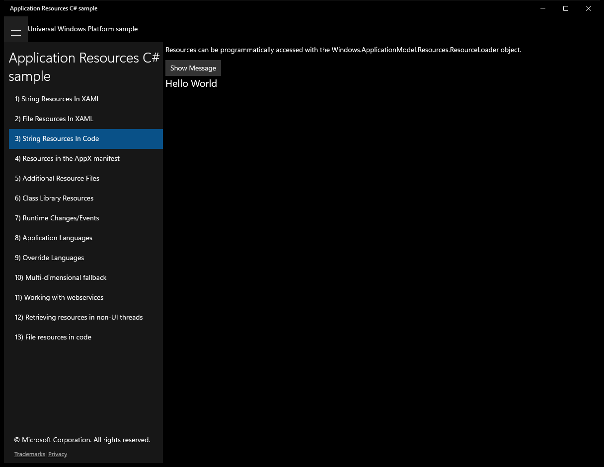

---

## Scenario 4 - scenario4

### Screenshots
Initial state:

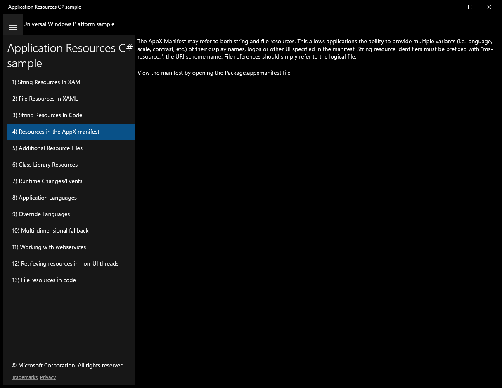

---

## Scenario 5 - scenario5

### Code behavior
- **`OnNavigatedTo`**
    - API refs: `Scenario5TextBlock.Text`
    - updates UI: `Scenario5TextBlock.Text`
- **`Scenario5Button_Show_Click`**
    - API refs: `ResourceLoader.GetForCurrentView`, `Scenario5TextBlock.Text`
    - updates UI: `Scenario5TextBlock.Text`

### Screenshots
Initial state:

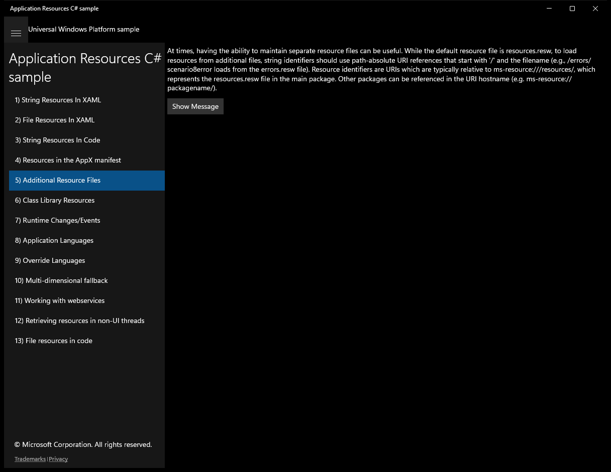

After click **Show Message**:

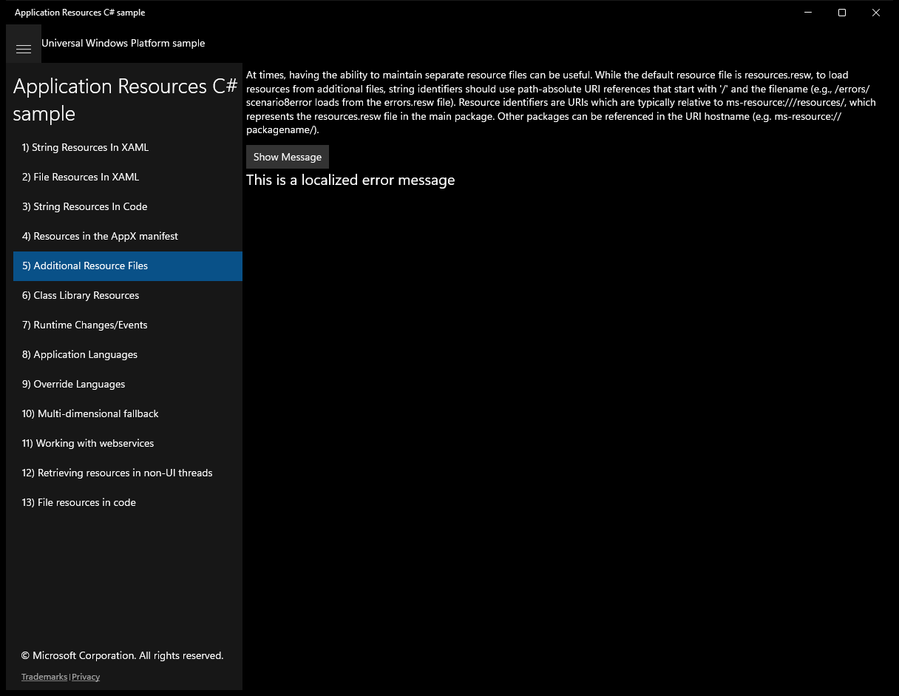

---

## Scenario 6 - scenario6

### Code behavior
- **`Scenario6Button_Show_Click`**
    - API refs: `ResourceLoader.GetForCurrentView`, `Scenario6TextBlock.Text`, `Scenario6TextBlock2.Text`, `AppResourceClassLibrary.LocalizedNamesLibrary`
    - updates UI: `Scenario6TextBlock.Text`

### Screenshots
Initial state:

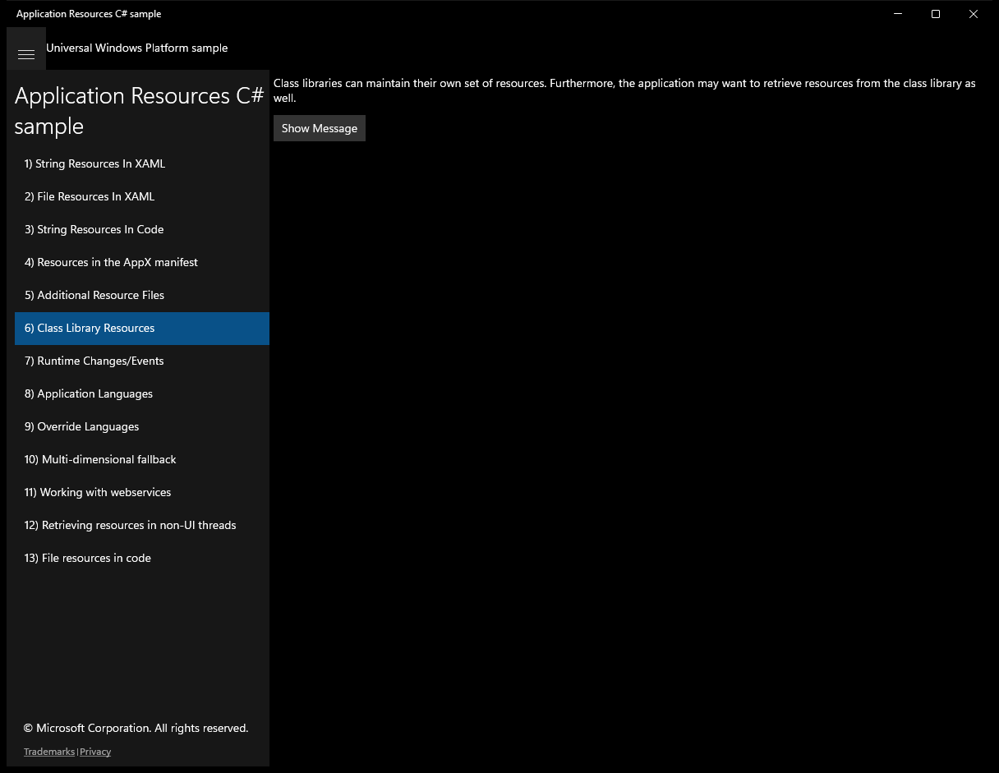

After click **Show Message**:

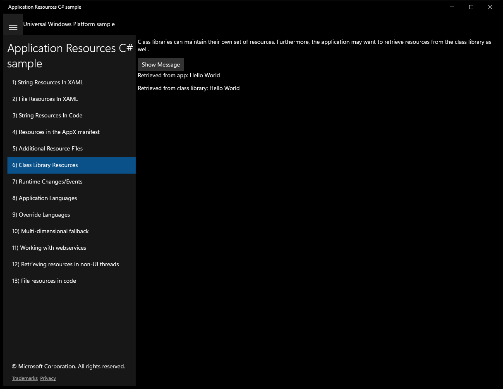

---

## Scenario 7 - scenario7

### Code behavior
- **`OnNavigatedTo`**
    - API refs: `Scenario7TextBlock.Text`
    - updates UI: `Scenario7TextBlock.Text`
- **`Scenario7Button_Show_Click`**
    - namespaces: `Windows.UI.Core.CoreDispatcherPriority.Normal`
    - API refs: `Scenario7TextBlock.Text`, `ResourceManager.Current`, `MainResourceMap.GetValue`, `QualifierValues.MapChanged`, `Scenario7TextBlock.Dispatcher`, `Windows.UI`, `Core.CoreDispatcherPriority`
    - updates UI: `Scenario7TextBlock.Text`

### Screenshots
Initial state:

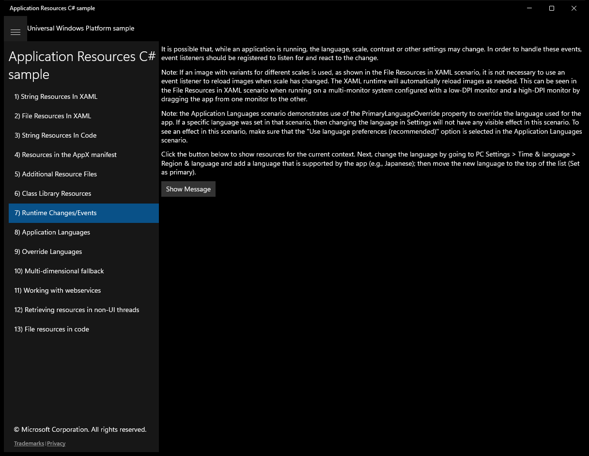

After click **Show Message**:

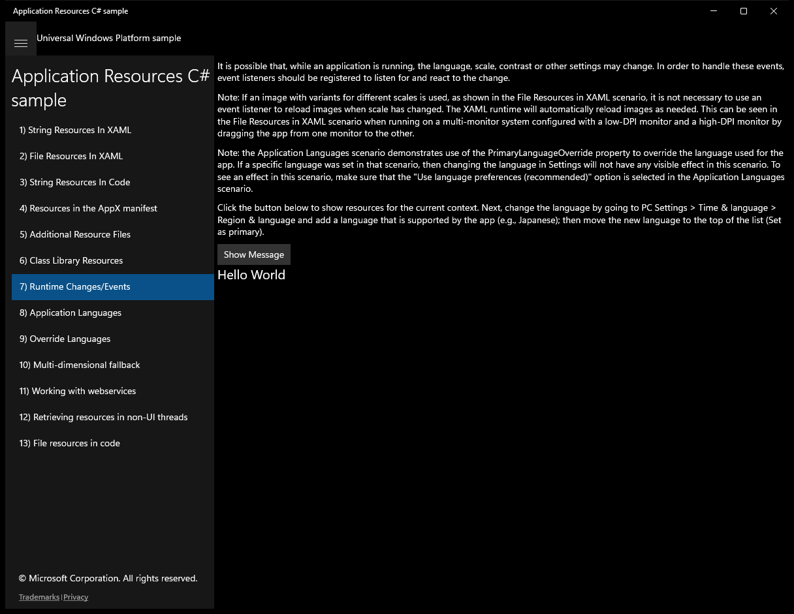

---

## Scenario 8 - scenario8

### Code behavior
- **`ShowText`**
    - API refs: `ResourceContext.GetForCurrentView`, `ResourceManager.Current`, `MainResourceMap.GetSubtree`, `Scenario8MessageTextBlock.Text`
    - updates UI: `Scenario8MessageTextBlock.Text`
- **`LanguageOverrideCombo_SelectionChanged`**
    - API refs: `ApplicationLanguages.PrimaryLanguageOverride`
- **`AddItemForLanguageTag`**
    - instantiates: `Language`
    - API refs: `LanguageOverrideCombo.Items`, `ApplicationLanguages.PrimaryLanguageOverride`, `LanguageOverrideCombo.SelectedItem`
- **`PopulateComboBox`**
    - API refs: `LanguageOverrideCombo.Items`, `LanguageOverrideCombo.SelectedIndex`, `ApplicationLanguages.Languages`, `ApplicationLanguages.ManifestLanguages`, `LanguageOverrideCombo.SelectionChanged`
- **`UpdateCurrentAppLanguageMessage`**
    - API refs: `Scenario8AppLanguagesTextBlock.Text`
    - updates UI: `Scenario8AppLanguagesTextBlock.Text`
- **`GetAppLanguagesAsFormattedString`**
    - API refs: `String.Join`, `ApplicationLanguages.Languages`

### Screenshots
Initial state:

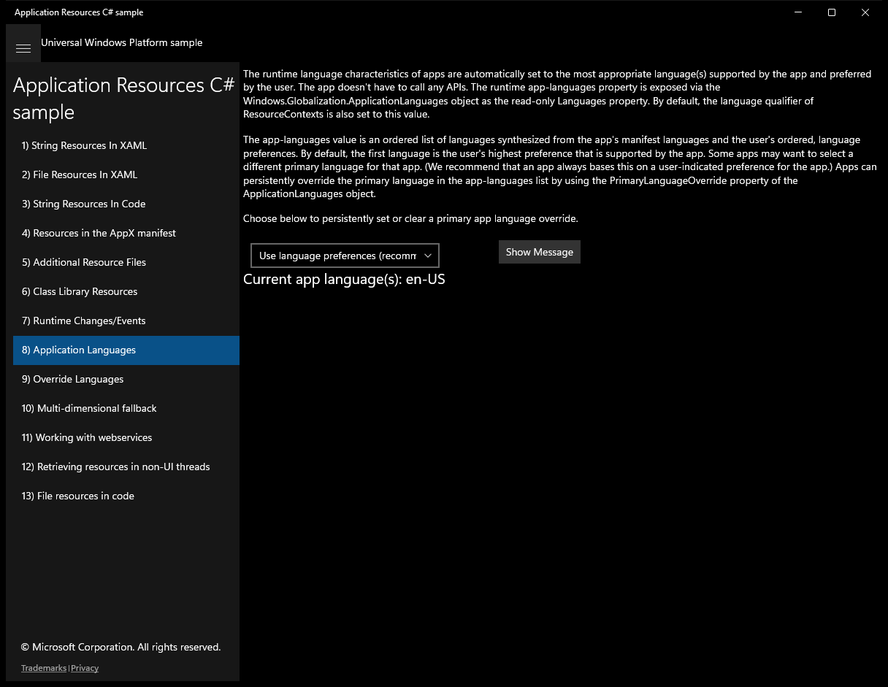

After click **Show Message**:

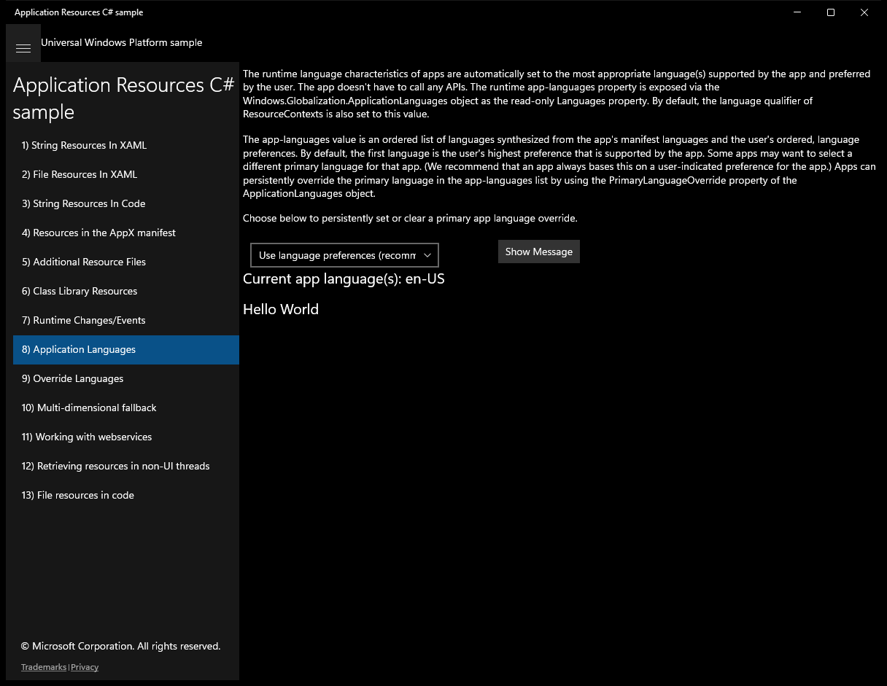

---

## Scenario 9 - scenario9

### Code behavior
- **`OnNavigatedFrom`**
    - API refs: `ResourceContext.GetForCurrentView`
- **`Scenario9Button_Show_Click`**
    - instantiates: `List`
    - API refs: `ResourceContext.GetForCurrentView`, `Scenario9ComboBox.SelectedValue`, `ResourceManager.Current`, `MainResourceMap.GetSubtree`, `Scenario9TextBlock.Text`
    - updates UI: `Scenario9TextBlock.Text`

### Screenshots
Initial state:

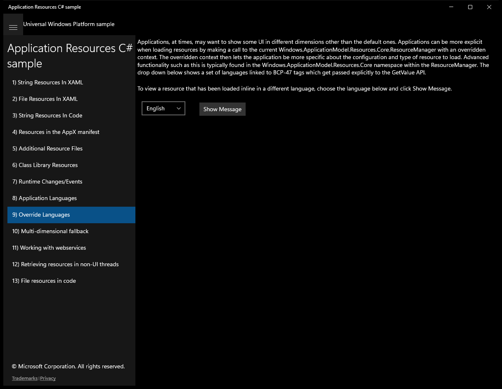

After click **Show Message**:

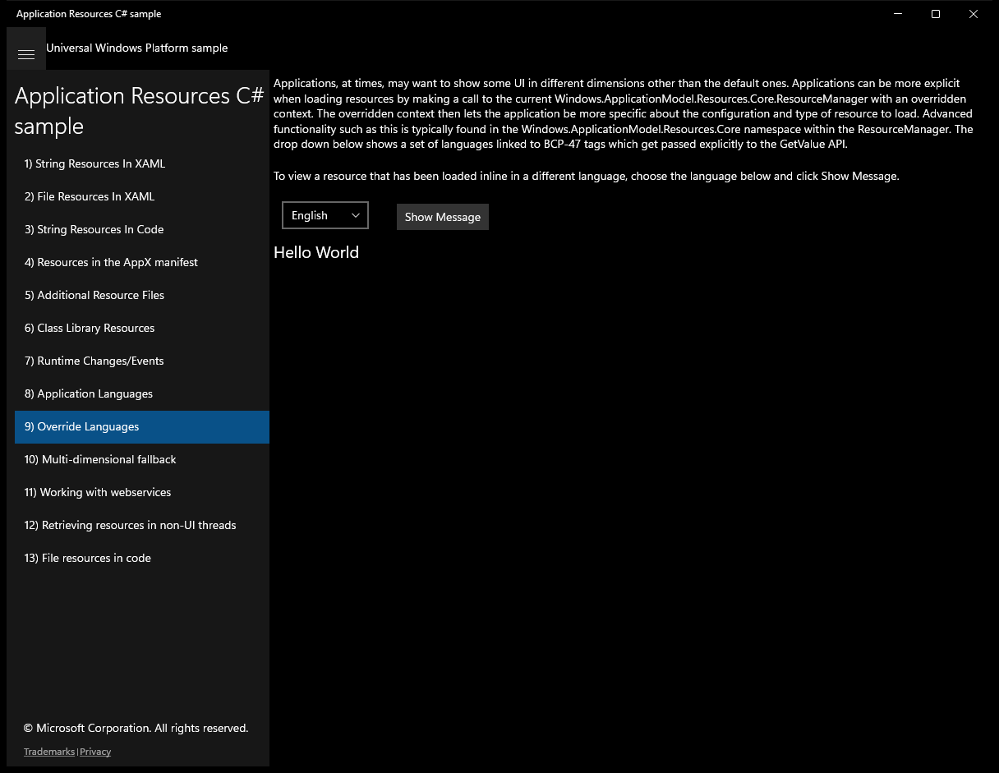

---

## Scenario 10 - scenario10

### Code behavior
- **`Scenario10Button_Show_Click`**
    - API refs: `ResourceContext.GetForCurrentView`, `Scenario10ComboBox_Language.SelectedValue`, `Scenario10ComboBox_Scale.SelectedValue`, `Scenario10ComboBox_Contrast.SelectedValue`, `Scenario10ComboBox_HomeRegion.SelectedValue`
- **`Scenario10_SearchMultipleResourceIds`**
    - API refs: `Scenario10TextBlock.Text`, `ResourceManager.Current`, `MainResourceMap.GetSubtree`
    - updates UI: `Scenario10TextBlock.Text`
- **`Scenario10_ShowCandidates`**
    - API refs: `IsMatch.ToString`, `IsDefault.ToString`, `Scenario10TextBlock.Text`

### Screenshots
Initial state:

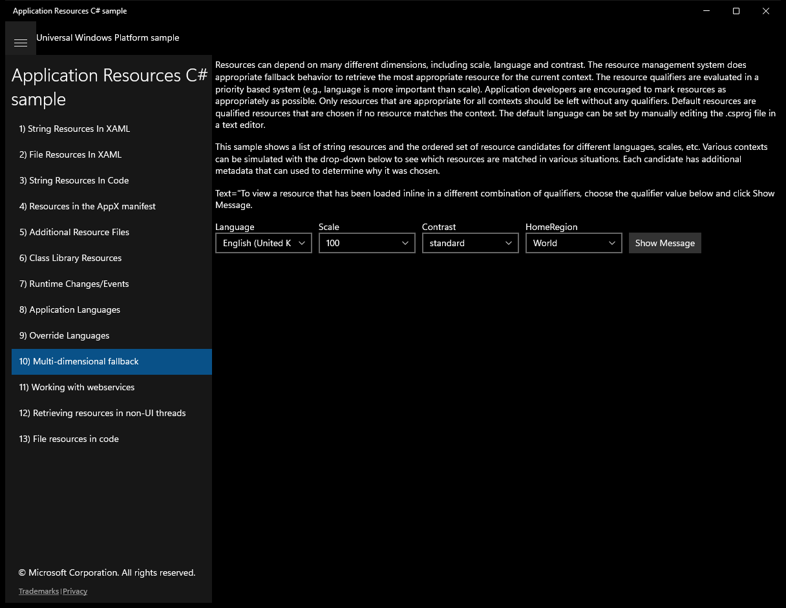

After click **Show Message**:

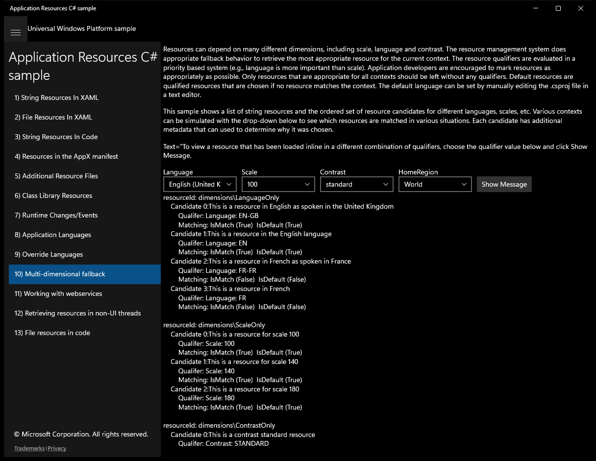

---

## Scenario 11 - scenario11

### Code behavior
- **`Scenario11Button_Show_Click`**
    - API refs: `ResourceLoader.GetForCurrentView`, `Scenario11TextBlock.Text`
    - updates UI: `Scenario11TextBlock.Text`

### Screenshots
Initial state:

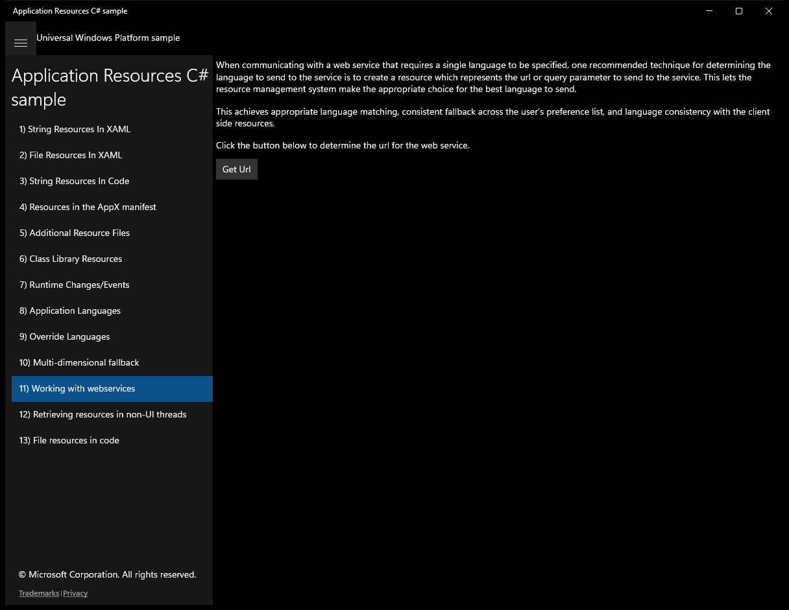

After click **Get Url**:

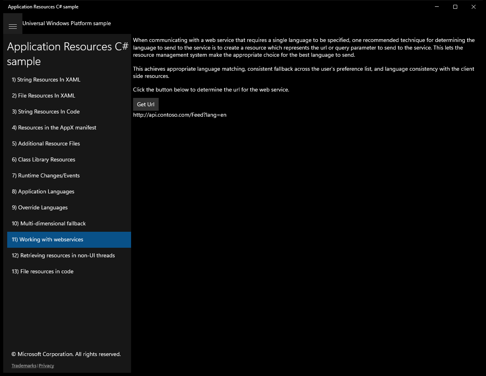

---

## Scenario 12 - scenario12

### Code behavior
- **`Scenario12Button_Show_Click`**
    - namespaces: `Windows.System.Threading.ThreadPool.RunAsync`
    - instantiates: `List`
    - API refs: `ResourceContext.GetForCurrentView`, `Windows.System`, `Threading.ThreadPool`, `ResourceManager.Current`, `MainResourceMap.GetSubtree`, `ResourceContext.GetForViewIndependentUse`, `ResourceContext.Reset`, `ViewDependentResourcesList.ItemsSource`, `ViewIndependentResourcesList.ItemsSource`

### Screenshots
Initial state:

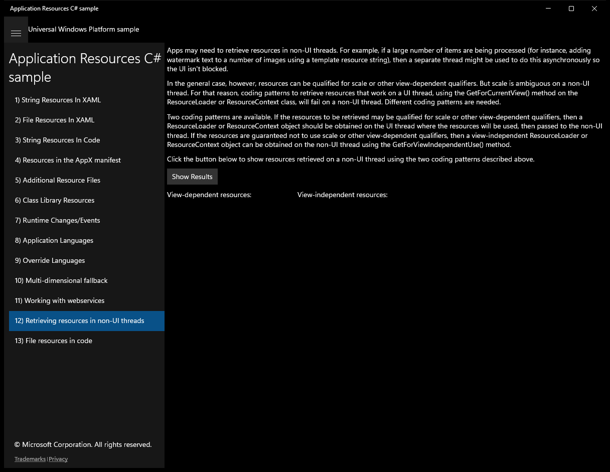

After click **Show Results**:

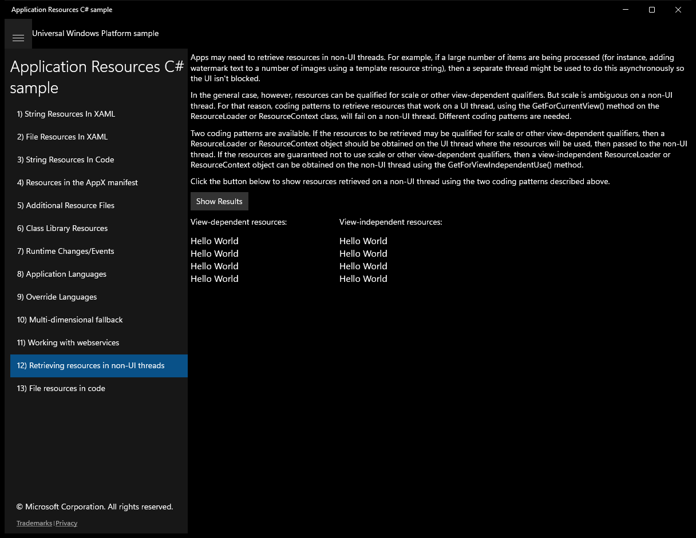

---

## Scenario 13 - scenario13

### Code behavior
- **`DXFLOptionCombo_SelectionChanged`**
    - namespaces: `Windows.ApplicationModel.Resources`, `Windows.ApplicationModel.Resources.Core`
    - instantiates: `Uri`
    - API refs: `ResourceMap.GetValue`, `ResourceContext.SetGlobalQualifierValue`, `SelectedValue.ToString`, `Windows.ApplicationModel`, `Resources.Core`, `StorageFile.GetFileFromApplicationUriAsync`, `FileIO.ReadTextAsync`, `ResultText.Text`

### Screenshots
Initial state:

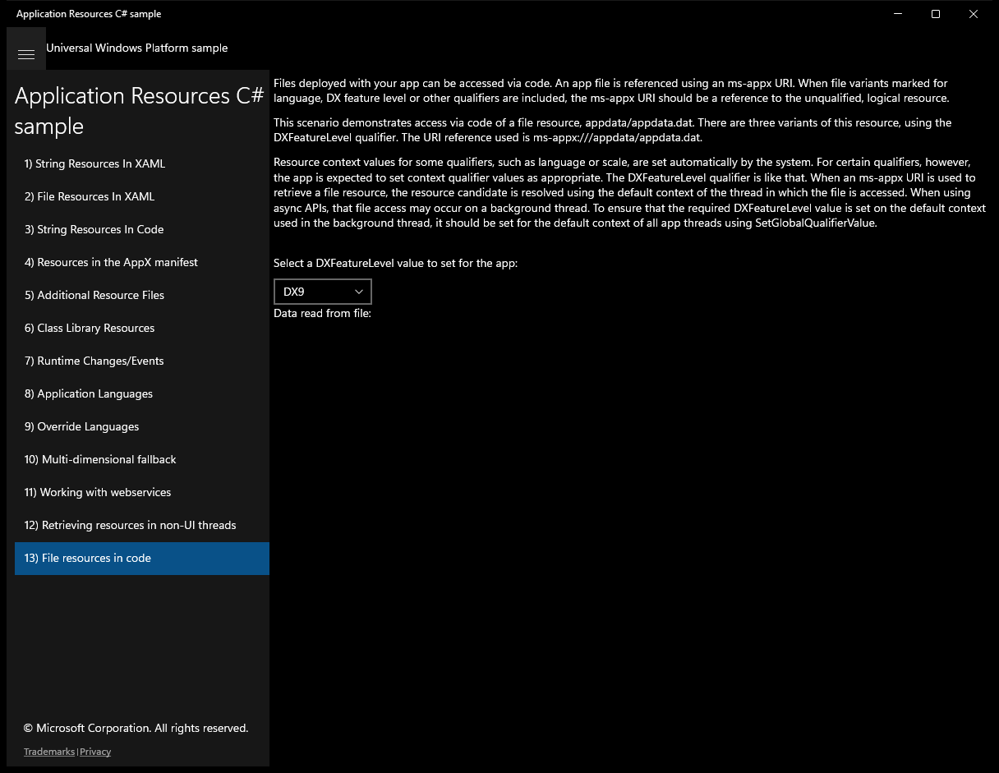

