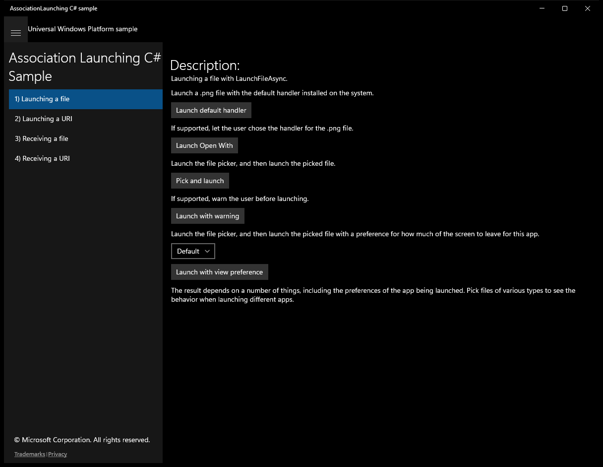
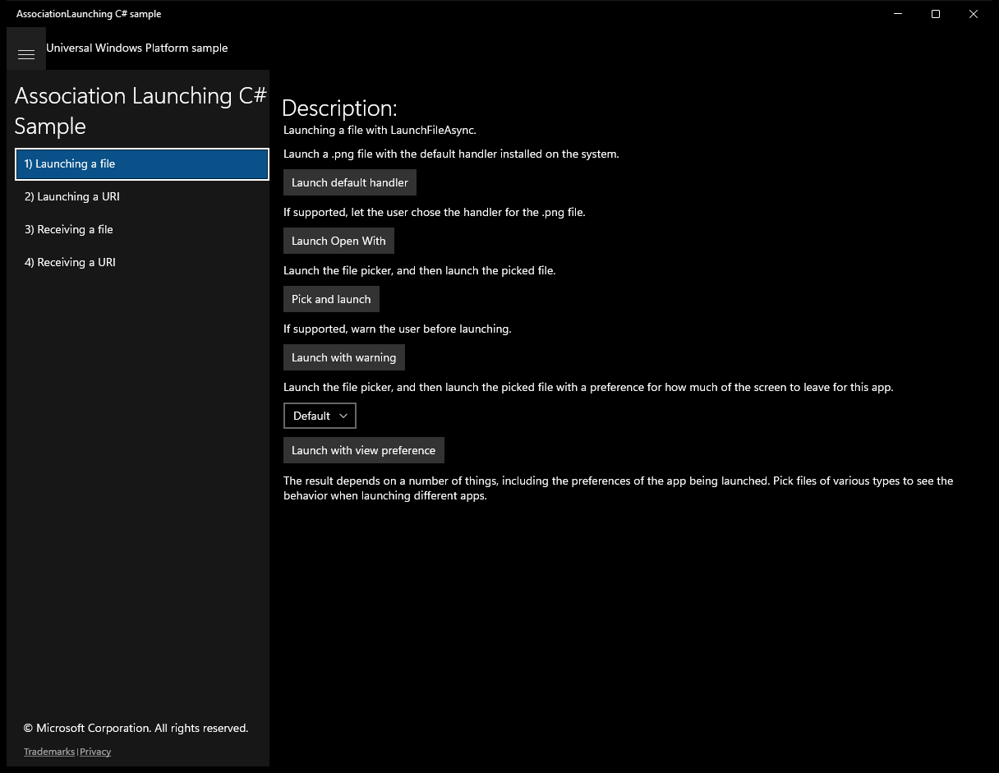
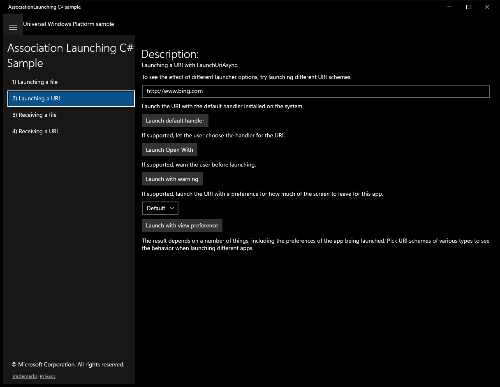
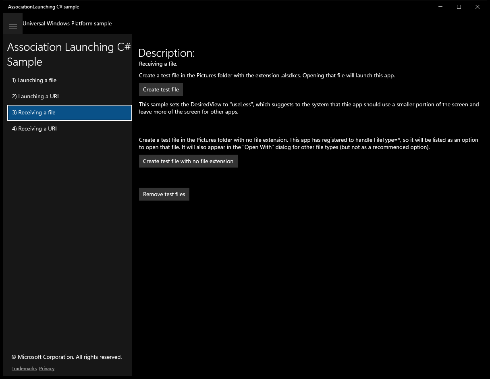
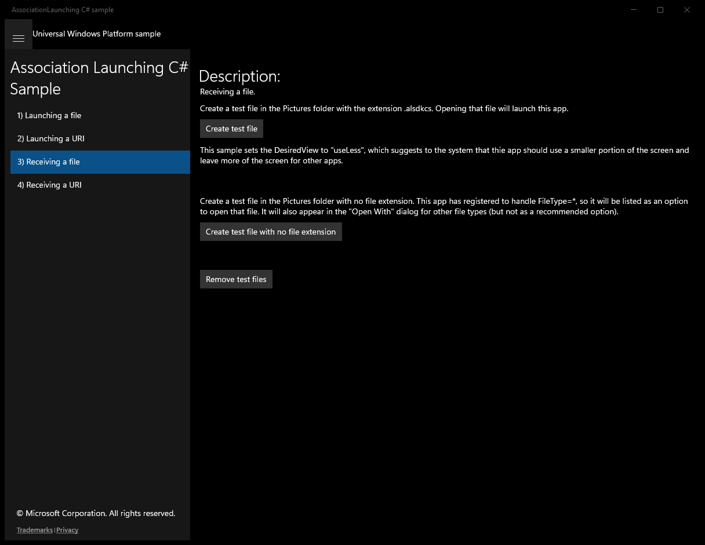
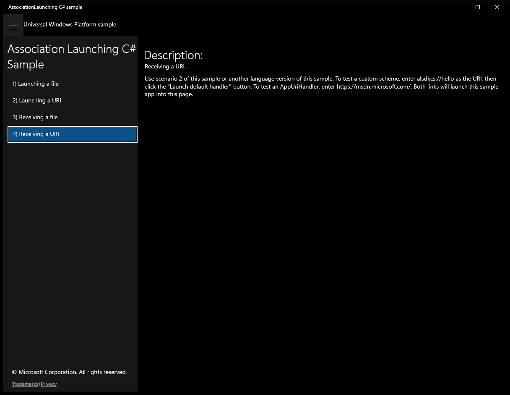

# AssociationLaunching (C#)

> **Source**: `Samples\AssociationLaunching\cs\`  
> **Feature**: Association Launching C# Sample  
> **AUMID**: `Microsoft.SDKSamples.AssociationLaunching.CS_8wekyb3d8bbwe!AssociationLaunching.App`  
> **PackageFamilyName**: `Microsoft.SDKSamples.AssociationLaunching.CS_8wekyb3d8bbwe`  

## Sample purpose
Shows how to launch an app to handle a file type or a protocol (also known as custom scheme).

## Scenarios demonstrated (from README)
- launching an  app for a file using LaunchFileAsync
- handling file activation through the **Activated** event
- launching an app for a protocol using LaunchUriAsync
- handling protocol activation through the **Activated** event
- associating the app with a website using the **AppUriHandler** extension
- launching a target app and having the currently running source app remain on the screen for various amounts of screen space using LauncherOptions.DesiredRemainingView.
- **Note**  LauncherOptions.DesiredRemainingView is only supported on desktop Windows when it is running in tablet mode.

## Top-level UWP namespaces used
- `Windows.ApplicationModel.Package.Current.InstalledLocation.GetFileAsync`
- `Windows.UI.Popups.Placement.Below`
- `Windows.Storage.Pickers.FileOpenPicker`
- `Windows.Storage.StorageFile`
- `Windows.UI.Xaml.Media.GeneralTransform`
- `Windows.System.Launcher.LaunchFolderAsync`

## Build / deploy / capture status
- build: skipped
- deploy: ok
- launch: ok
- capture: ok
- uninstall: ok

## Main page

---

## Scenario 1 - Launching a file

**Description**: Launching a file with LaunchFileAsync.

### UI elements
- **TextBlock**  - text="Description:"
- **TextBlock**  - text="Launching a file with LaunchFileAsync."
- **TextBlock**  - text="Launch a .png file with the default handler installed on the system."
- **Button**  - content="Launch default handler"; events: Click={x:Bind LaunchFileDefault}
- **TextBlock**  - text="If supported, let the user chose the handler for the .png file."
- **Button**  - content="Launch Open With"; events: Click={x:Bind LaunchFileOpenWith}
- **TextBlock**  - text="Launch the file picker, and then launch the picked file."
- **Button**  - content="Pick and launch"; events: Click={x:Bind PickAndLaunchFile}
- **TextBlock**  - text="If supported, warn the user before launching."
- **Button**  - content="Launch with warning"; events: Click={x:Bind LaunchFileWithWarning}
- **TextBlock**  - text="Launch the file picker, and then launch the picked file with a preference for how much of the screen to leave for this app."
- **ComboBox**  - x:Name="ViewPreference"
- **Button**  - content="Launch with view preference"; events: Click={x:Bind LaunchFileSplitScreen}
- **TextBlock**  - text="The result depends on a number of things, including the preferences of the app being launched. Pick files of various types to see the behavior when launching different apps."

### Code behavior
- **`GetFileToLaunch`**
    - namespaces: `Windows.ApplicationModel.Package.Current.InstalledLocation.GetFileAsync`
    - API refs: `Windows.ApplicationModel`, `Package.Current`, `InstalledLocation.GetFileAsync`, `ApplicationData.Current`, `NameCollisionOption.ReplaceExisting`
- **`LaunchFileDefault`**
    - API refs: `Launcher.LaunchFileAsync`, `NotifyType.StatusMessage`, `NotifyType.ErrorMessage`
- **`LaunchFileWithWarning`**
    - instantiates: `LauncherOptions`
    - API refs: `Launcher.LaunchFileAsync`, `NotifyType.StatusMessage`, `NotifyType.ErrorMessage`
- **`LaunchFileOpenWith`**
    - namespaces: `Windows.UI.Popups.Placement.Below`
    - instantiates: `LauncherOptions`
    - API refs: `MainPage.GetElementLocation`, `UI.InvocationPoint`, `UI.PreferredPlacement`, `Windows.UI`, `Popups.Placement`, `Launcher.LaunchFileAsync`, `NotifyType.StatusMessage`, `NotifyType.ErrorMessage`
- **`LaunchFileSplitScreen`**
    - namespaces: `Windows.Storage.Pickers.FileOpenPicker`, `Windows.Storage.StorageFile`
    - instantiates: `Windows.Storage.Pickers.FileOpenPicker`, `LauncherOptions`
    - API refs: `Windows.Storage`, `Pickers.FileOpenPicker`, `FileTypeFilter.Add`, `ViewPreference.SelectedValue`, `Launcher.LaunchFileAsync`, `NotifyType.StatusMessage`, `NotifyType.ErrorMessage`
- **`LauncherOptions`**
    - API refs: `ViewPreference.SelectedValue`
- **`PickAndLaunchFile`**
    - namespaces: `Windows.Storage.Pickers.FileOpenPicker`, `Windows.Storage.StorageFile`
    - instantiates: `Windows.Storage.Pickers.FileOpenPicker`
    - API refs: `Windows.Storage`, `Pickers.FileOpenPicker`, `FileTypeFilter.Add`, `Launcher.LaunchFileAsync`, `NotifyType.StatusMessage`, `NotifyType.ErrorMessage`
- **`GetOpenWithPosition`**
    - namespaces: `Windows.UI.Xaml.Media.GeneralTransform`
    - instantiates: `Point`
    - API refs: `Windows.UI`, `Xaml.Media`

### Screenshots
Initial state:

> Button **Launch default handler** skipped (blocklist)

> Button **Launch Open With** skipped (blocklist)

> Button **Pick and launch** skipped (blocklist)

> Button **Launch with warning** skipped (blocklist)

> Button **Launch with view preference** skipped (blocklist)

---

## Scenario 2 - Launching a URI

**Description**: Launching a URI with LaunchUriAsync.

### UI elements
- **TextBlock**  - text="Description:"
- **TextBlock**  - text="Launching a URI with LaunchUriAsync."
- **TextBlock**  - text="To see the effect of different launcher options, try launching different URI schemes."
- **TextBox**  - x:Name="UriToLaunch"; text="http://www.bing.com"
- **TextBlock**  - text="Launch the URI with the default handler installed on the system."
- **Button**  - content="Launch default handler"; events: Click={x:Bind LaunchUriDefault}
- **TextBlock**  - text="If supported, let the user choose the handler for the URI."
- **Button**  - content="Launch Open With"; events: Click={x:Bind LaunchUriOpenWith}
- **TextBlock**  - text="If supported, warn the user before launching."
- **Button**  - content="Launch with warning"; events: Click={x:Bind LaunchUriWithWarning}
- **TextBlock**  - text="If supported, launch the URI with a preference for how much of the screen to leave for this app."
- **ComboBox**  - x:Name="ViewPreference"
- **Button**  - content="Launch with view preference"; events: Click={x:Bind LaunchUriSplitScreen}
- **TextBlock**  - text="The result depends on a number of things, including the preferences of the app being launched. Pick URI schemes of various types to see the behavior when launching different apps."

### Code behavior
- **`LaunchUriDefault`**
    - instantiates: `Uri`
    - API refs: `UriToLaunch.Text`, `Launcher.LaunchUriAsync`, `NotifyType.StatusMessage`, `NotifyType.ErrorMessage`
- **`LaunchUriWithWarning`**
    - instantiates: `Uri`, `LauncherOptions`
    - API refs: `UriToLaunch.Text`, `Launcher.LaunchUriAsync`, `NotifyType.StatusMessage`, `NotifyType.ErrorMessage`
- **`LaunchUriOpenWith`**
    - namespaces: `Windows.UI.Popups.Placement.Below`
    - instantiates: `Uri`, `LauncherOptions`
    - API refs: `UriToLaunch.Text`, `MainPage.GetElementLocation`, `UI.InvocationPoint`, `UI.PreferredPlacement`, `Windows.UI`, `Popups.Placement`, `Launcher.LaunchUriAsync`, `NotifyType.StatusMessage`, `NotifyType.ErrorMessage`
- **`LaunchUriSplitScreen`**
    - instantiates: `Uri`, `LauncherOptions`
    - API refs: `UriToLaunch.Text`, `ViewPreference.SelectedValue`, `Launcher.LaunchUriAsync`, `NotifyType.StatusMessage`, `NotifyType.ErrorMessage`
- **`LauncherOptions`**
    - API refs: `ViewPreference.SelectedValue`

### Screenshots
Initial state:

> Button **Launch default handler** skipped (blocklist)

> Button **Launch Open With** skipped (blocklist)

> Button **Launch with warning** skipped (blocklist)

> Button **Launch with view preference** skipped (blocklist)

---

## Scenario 3 - Receiving a file

**Description**: Receiving a file.

### UI elements
- **TextBlock**  - text="Description:"
- **TextBlock**  - text="Receiving a file."
- **TextBlock**  - text="Create a test file in the Pictures folder with the extension .. Opening that file will launch this app."
- **Button**  - content="Create test file"; events: Click={x:Bind CreateTestFile}
- **TextBlock**  - text="This sample sets the DesiredView to "useLess", which suggests to the system that thie app should use a smaller portion of the screen and leave more of the screen for other apps."
- **Button**  - content="Create test file with no file extension"; events: Click={x:Bind CreateTestFileWithNoExtension}
- **Button**  - content="Remove test files"; events: Click={x:Bind RemoveTestFiles}

### Code behavior
- **`OnNavigatedTo`**
    - API refs: `Files.Count`, `NeighboringFilesQuery.GetFilesAsync`, `Math.Min`, `NotifyType.StatusMessage`
- **`CreateTestFile`**
    - namespaces: `Windows.System.Launcher.LaunchFolderAsync`
    - API refs: `KnownFolders.GetFolderAsync`, `KnownFolderId.PicturesLibrary`, `CreationCollisionOption.ReplaceExisting`, `Windows.System`, `Launcher.LaunchFolderAsync`
- **`CreateTestFileWithNoExtension`**
    - namespaces: `Windows.System.Launcher.LaunchFolderAsync`
    - API refs: `KnownFolders.GetFolderAsync`, `KnownFolderId.PicturesLibrary`, `CreationCollisionOption.ReplaceExisting`, `Windows.System`, `Launcher.LaunchFolderAsync`
- **`RemoveTestFiles`**
    - API refs: `KnownFolders.GetFolderAsync`, `KnownFolderId.PicturesLibrary`

### Screenshots
Initial state:

After click **Create test file**:

After click **Create test file with no file extension**:

After click **Remove test files**:

---

## Scenario 4 - Receiving a URI

**Description**: Receiving a URI.

### UI elements
- **TextBlock**  - text="Description:"
- **TextBlock**  - text="Receiving a URI."

### Code behavior
- **`OnNavigatedTo`**
    - API refs: `Uri.AbsoluteUri`, `NotifyType.StatusMessage`

### Screenshots
Initial state:

