# AudioCreation (C#)

> **Source**: `Samples\AudioCreation\cs\`  
> **Feature**: AudioCreation  
> **AUMID**: `Microsoft.SDKSamples.AudioCreation.CS_8wekyb3d8bbwe!App`  
> **PackageFamilyName**: `Microsoft.SDKSamples.AudioCreation.CS_8wekyb3d8bbwe`  

## Top-level UWP namespaces used
- `Windows.UI.Core.CoreDispatcherPriority.Normal`

## Build / deploy / capture status
- build: ok
- deploy: ok
- launch: ok
- capture: ok
- uninstall: ok

## Main page
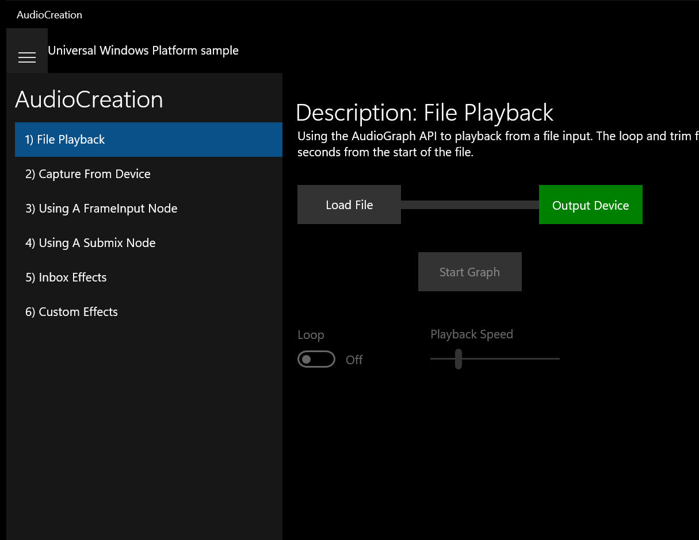

---

## Scenario 1 - File Playback

### UI elements
- **TextBlock**  - x:Name="SampleHeader"; text="Description: File Playback"
- **TextBlock**  - x:Name="SampleDescription"; text="Using the AudioGraph API to playback from a file input. The loop and trim functionalities are demonstrated. The playback is started 3 seconds from the start of the file."
- **Button**  - x:Name="fileButton"; content="Load File"; events: Click=File_Click
- **TextBlock**  - x:Name="speaker"; text="Output Device"
- **Button**  - x:Name="graphButton"; content="Start Graph"; events: Click=Graph_Click
- **ToggleSwitch**  - x:Name="loopToggle"; events: Toggled=LoopToggle_Toggled
- **Slider**  - x:Name="playSpeedSlider"; events: ValueChanged=PlaySpeedSlider_ValueChanged
- **TextBlock**  - x:Name="StatusBlock"

### Code behavior
- **`OnNavigatedTo`**
    - API refs: `MainPage.Current`
- **`File_Click`**
    - instantiates: `FileOpenPicker`, `SolidColorBrush`
    - API refs: `NotifyType.StatusMessage`, `Content.Equals`, `PickerLocationId.MusicLibrary`, `FileTypeFilter.Add`, `PickerViewMode.Thumbnail`, `AudioFileNodeCreationStatus.Success`, `String.Format`, `Status.ToString`, `NotifyType.ErrorMessage`, `TimeSpan.FromSeconds`, `Colors.Green`
- **`TogglePlay`**
    - instantiates: `SolidColorBrush`
    - API refs: `Content.Equals`, `Colors.Blue`, `Color.FromArgb`
- **`LoopToggle_Toggled`**
    - API refs: `StartTime.Value`
- **`CreateAudioGraph`**
    - instantiates: `AudioGraphSettings`, `SolidColorBrush`
    - API refs: `AudioRenderCategory.Media`, `AudioGraph.CreateAsync`, `AudioGraphCreationStatus.Success`, `String.Format`, `Status.ToString`, `NotifyType.ErrorMessage`, `AudioDeviceNodeCreationStatus.Success`, `Colors.Red`, `NotifyType.StatusMessage`, `Colors.Green`

### Screenshots
Initial state:

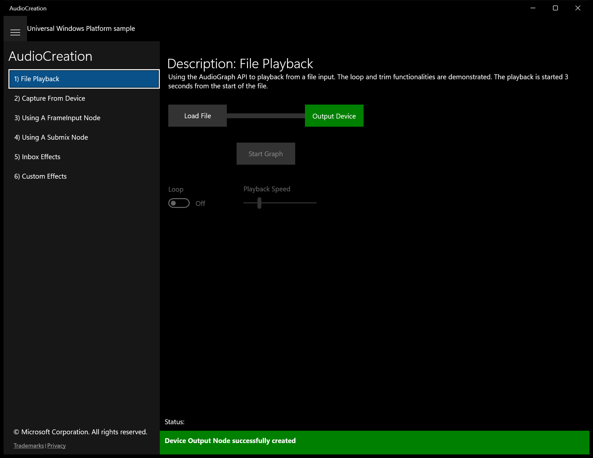

After click **Load File** (popup: Open):

After click **Load File**:

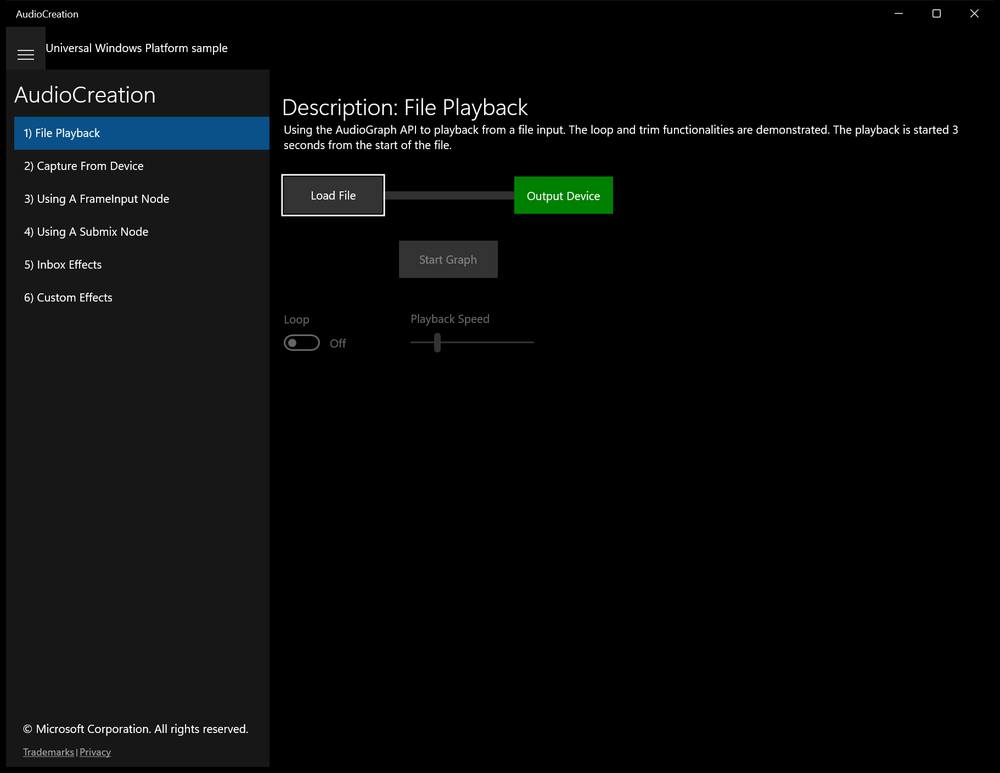

---

## Scenario 2 - Capture From Device

### UI elements
- **TextBlock**  - text="Description:"
- **TextBlock**  - text="This scenario shows using AudioGraph for audio capture from a microphone with low latency. The captured signal is also monitored through a user-selected output device."
- **ListBox**  - x:Name="outputDevicesListBox"; events: SelectionChanged=outputDevicesListBox_SelectionChanged
- **ListBox**  - x:Name="inputDevicesListBox"; events: SelectionChanged=inputDevicesListBox_SelectionChanged
- **TextBlock**  - text="Input Device"
- **TextBlock**  - x:Name="outputDevice"; text="Output Device"
- **Button**  - x:Name="fileButton"; content="Pick Output File"; events: Click=FileButton_Click
- **Button**  - x:Name="recordStopButton"; content="Record"; events: Click=RecordStopButton_Click
- **Button**  - x:Name="createGraphButton"; content="Create Graph"; events: Click=CreateGraphButton_Click
- **TextBlock**  - x:Name="StatusBlock"

### Code behavior
- **`OnNavigatedTo`**
    - API refs: `MainPage.Current`
- **`SelectOutputFile`**
    - instantiates: `FileSavePicker`, `List`, `SolidColorBrush`
    - API refs: `FileTypeChoices.Add`, `String.Format`, `Name.ToString`, `NotifyType.StatusMessage`, `AudioFileNodeCreationStatus.Success`, `Status.ToString`, `NotifyType.ErrorMessage`, `Colors.Red`, `Colors.YellowGreen`
- **`CreateMediaEncodingProfile`**
    - instantiates: `ArgumentException`
    - API refs: `FileType.ToString`, `MediaEncodingProfile.CreateWma`, `AudioEncodingQuality.High`, `MediaEncodingProfile.CreateMp3`, `MediaEncodingProfile.CreateWav`
- **`ToggleRecordStop`**
    - instantiates: `SolidColorBrush`
    - API refs: `Content.Equals`, `Colors.Blue`, `Color.FromArgb`, `TranscodeFailureReason.None`, `String.Format`, `NotifyType.ErrorMessage`, `Colors.Red`, `NotifyType.StatusMessage`, `Colors.Green`
- **`PopulateOutputDeviceList`**
    - API refs: `Items.Clear`, `DeviceInformation.FindAllAsync`, `MediaDevice.GetAudioRenderSelector`, `Items.Add`
- **`PopulateInputDeviceList`**
    - API refs: `Items.Clear`, `DeviceInformation.FindAllAsync`, `MediaDevice.GetAudioCaptureSelector`, `Items.Add`
- **`CreateAudioGraph`**
    - instantiates: `AudioGraphSettings`, `SolidColorBrush`
    - API refs: `AudioRenderCategory.Media`, `QuantumSizeSelectionMode.LowestLatency`, `AudioGraph.CreateAsync`, `AudioGraphCreationStatus.Success`, `String.Format`, `Status.ToString`, `NotifyType.ErrorMessage`, `NotifyType.StatusMessage`, `AudioDeviceNodeCreationStatus.Success`, `Colors.Red`, `Colors.Green`, `MediaCategory.Other`
- **`Graph_UnrecoverableErrorOccurred`**
    - namespaces: `Windows.UI.Core.CoreDispatcherPriority.Normal`
    - instantiates: `SolidColorBrush`
    - API refs: `Dispatcher.RunAsync`, `Windows.UI`, `Core.CoreDispatcherPriority`, `Color.FromArgb`

### Screenshots
Initial state:

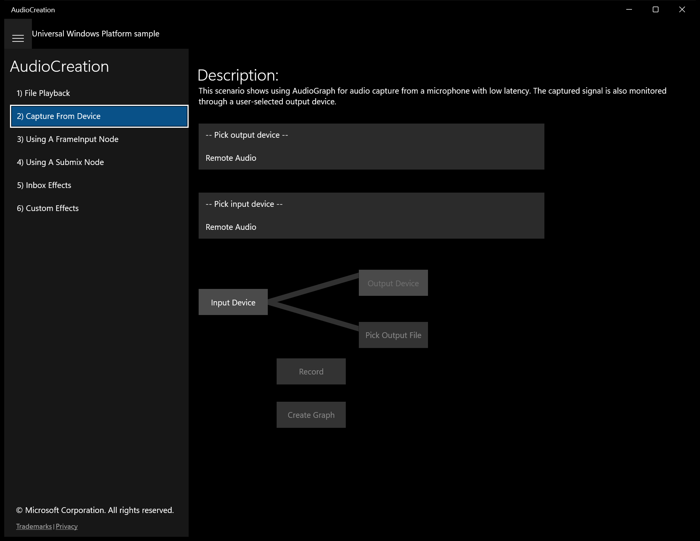

---

## Scenario 4 - Using A Submix Node

### UI elements
- **TextBlock**  - text="Description:"
- **TextBlock**  - text="This scenario shows the use of a Submix node. A Submix node can be used to to mix multiple streams into a single one or apply an effect to multiple streams."
- **Button**  - x:Name="fileButton1"; content="Load File 1"; events: Click=File1_Click
- **Button**  - x:Name="fileButton2"; content="Load File 2"; events: Click=File2_Click
- **TextBlock**  - x:Name="submixLabel"; text="SubMix Node"
- **ToggleSwitch**  - x:Name="echoEffectToggle"; events: Toggled=EchoEffectToggle_Toggled
- **TextBlock**  - x:Name="speaker"; text="Output Device"
- **Button**  - x:Name="graphButton"; content="Start Graph"; events: Click=GraphButton_Click
- **TextBlock**  - x:Name="StatusBlock"

### Code behavior
- **`OnNavigatedTo`**
    - API refs: `MainPage.Current`
- **`File1_Click`**
    - instantiates: `FileOpenPicker`, `SolidColorBrush`
    - API refs: `Content.Equals`, `PickerLocationId.MusicLibrary`, `FileTypeFilter.Add`, `PickerViewMode.Thumbnail`, `AudioFileNodeCreationStatus.Success`, `String.Format`, `Status.ToString`, `NotifyType.ErrorMessage`, `Colors.Blue`, `NotifyType.StatusMessage`, `Colors.Green`
- **`File2_Click`**
    - instantiates: `FileOpenPicker`, `SolidColorBrush`
    - API refs: `Content.Equals`, `PickerLocationId.MusicLibrary`, `FileTypeFilter.Add`, `PickerViewMode.Thumbnail`, `AudioFileNodeCreationStatus.Success`, `String.Format`, `Status.ToString`, `NotifyType.ErrorMessage`, `Colors.Blue`, `NotifyType.StatusMessage`, `Colors.Green`
- **`TogglePlay`**
    - instantiates: `SolidColorBrush`
    - API refs: `Content.Equals`, `Colors.Blue`, `Color.FromArgb`
- **`CreateAudioGraph`**
    - instantiates: `AudioGraphSettings`, `SolidColorBrush`, `EchoEffectDefinition`
    - API refs: `AudioRenderCategory.Media`, `AudioGraph.CreateAsync`, `AudioGraphCreationStatus.Success`, `String.Format`, `Status.ToString`, `NotifyType.ErrorMessage`, `AudioDeviceNodeCreationStatus.Success`, `Colors.Red`, `NotifyType.StatusMessage`, `Colors.Green`, `EffectDefinitions.Add`

### Screenshots
Initial state:

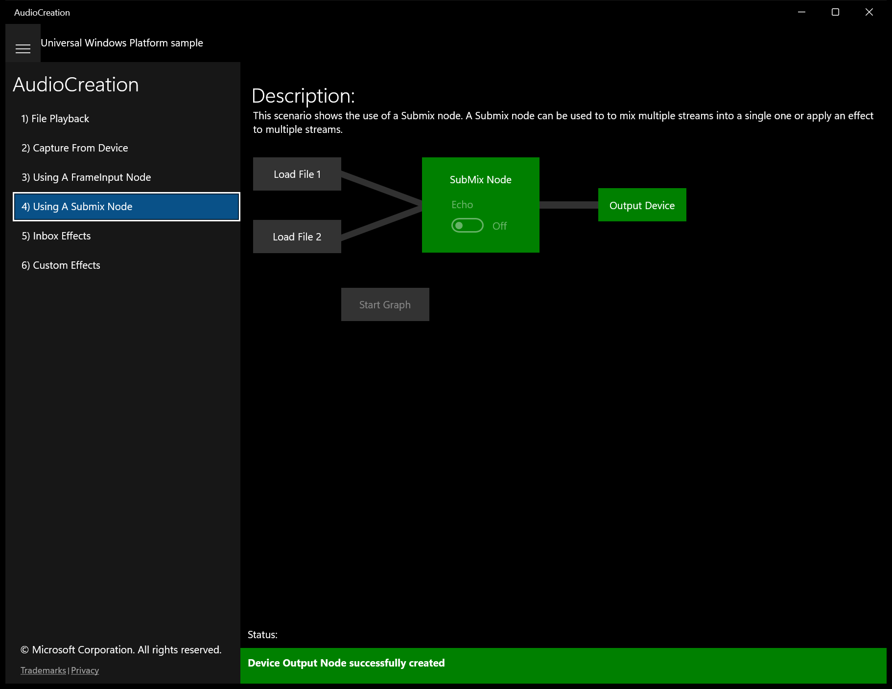

After click **Load File 1** (popup: Open):

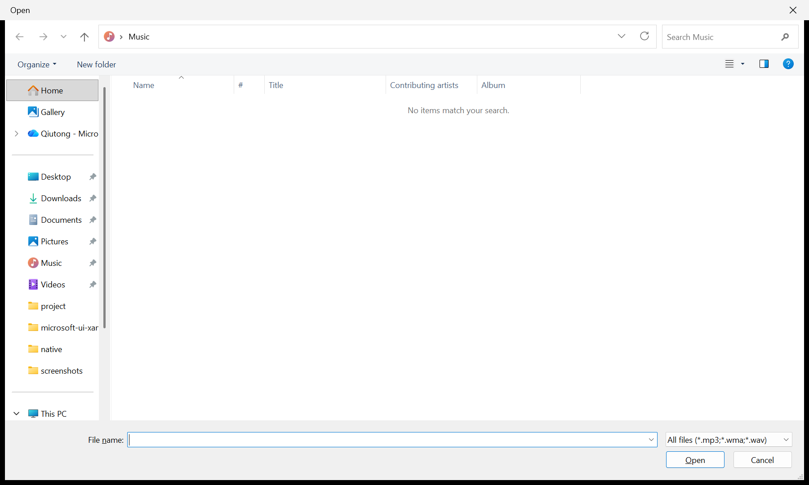

After click **Load File 1**:

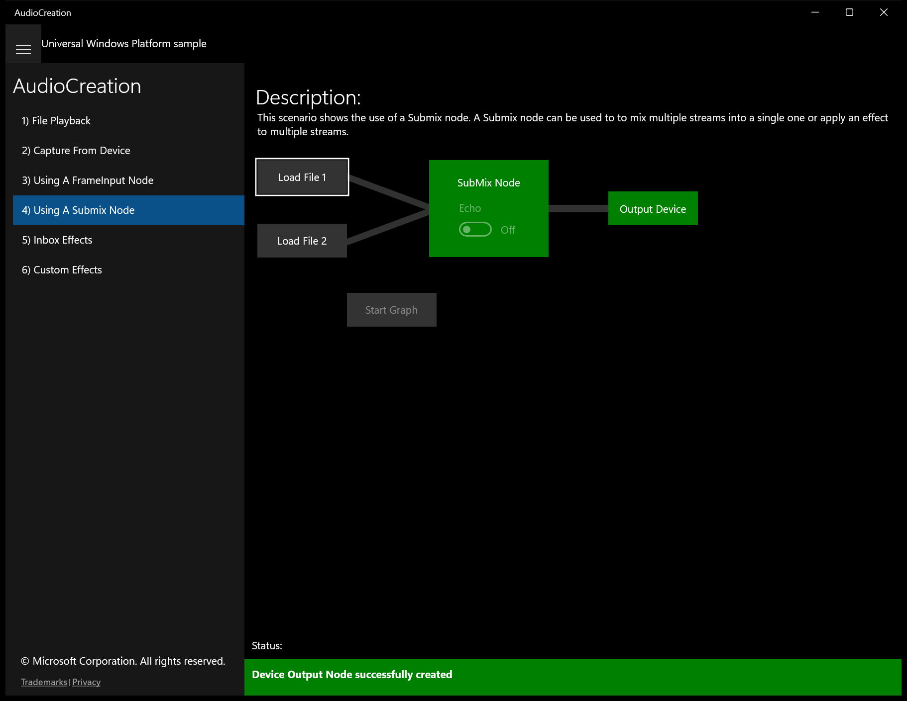

After click **Load File 2** (popup: Open):

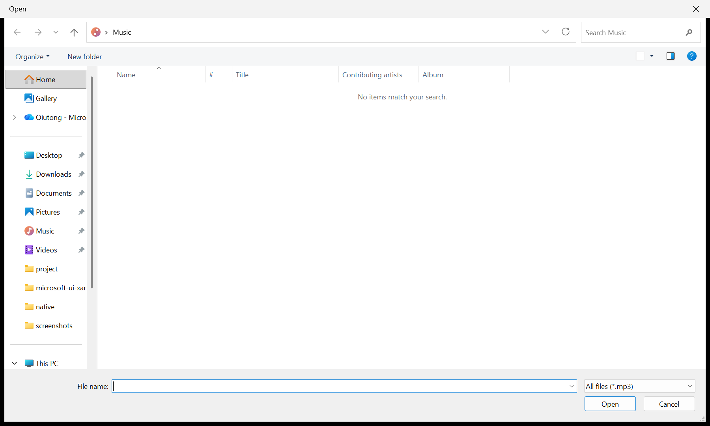

After click **Load File 2**:

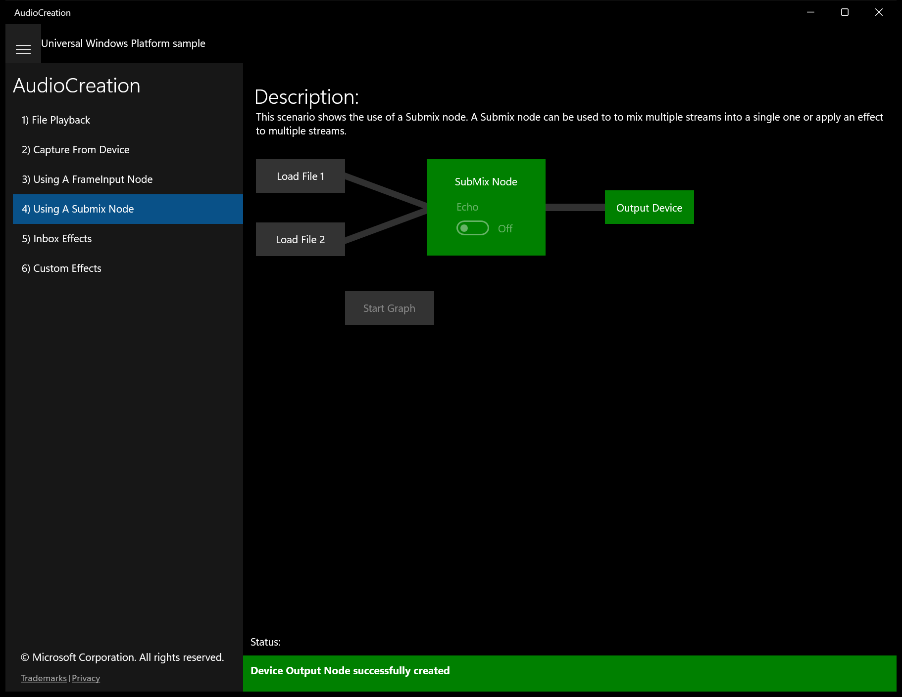

---

## Scenario 5 - Inbox Effects

### UI elements
- **TextBlock**  - text="Description:"
- **TextBlock**  - text="This scenario is to demonstrate the use of Built-In Effects."
- **Button**  - x:Name="fileButton"; content="Load File"; events: Click=File_Click
- **TextBlock**  - x:Name="speaker"; text="Output Device"
- **Button**  - x:Name="graphButton"; content="Start Graph"; events: Click=Graph_Click
- **ToggleSwitch**  - x:Name="echoEffectToggle"; events: Toggled=EchoEffectToggle_Toggled
- **TextBlock**  - x:Name="echoLabel"; text="Delay: 500ms"
- **Slider**  - x:Name="echoSlider"; events: ValueChanged=EchoSlider_ValueChanged
- **ToggleSwitch**  - x:Name="reverbEffectToggle"; events: Toggled=ReverbEffectToggle_Toggled
- **TextBlock**  - x:Name="decayLabel"; text="Decay: 5s"
- **Slider**  - x:Name="decaySlider"; events: ValueChanged=DecaySlider_ValueChanged
- **ToggleSwitch**  - x:Name="limiterEffectToggle"; events: Toggled=LimiterEffectToggle_Toggled
- **TextBlock**  - x:Name="loudnessLabel"; text="Loudness: 1000"
- **Slider**  - x:Name="loudnessSlider"; events: ValueChanged=LoudnessSlider_ValueChanged
- **ToggleSwitch**  - x:Name="eqToggle"; events: Toggled=EqToggle_Toggled
- **Slider**  - x:Name="eq1Slider"; events: ValueChanged=Eq1Slider_ValueChanged
- **TextBlock**  - x:Name="eq1SliderLabel"; text="100Hz"
- **Slider**  - x:Name="eq2Slider"; events: ValueChanged=Eq2Slider_ValueChanged
- **TextBlock**  - x:Name="eq2SliderLabel"; text="900Hz"
- **Slider**  - x:Name="eq3Slider"; events: ValueChanged=Eq3Slider_ValueChanged
- **TextBlock**  - x:Name="eq3SliderLabel"; text="5kHz"
- **Slider**  - x:Name="eq4Slider"; events: ValueChanged=Eq4Slider_ValueChanged
- **TextBlock**  - x:Name="eq4SliderLabel"; text="12kHz"
- **TextBlock**  - x:Name="StatusBlock"

### Code behavior
- **`OnNavigatedTo`**
    - API refs: `MainPage.Current`
- **`File_Click`**
    - instantiates: `FileOpenPicker`, `SolidColorBrush`
    - API refs: `Content.Equals`, `PickerLocationId.MusicLibrary`, `FileTypeFilter.Add`, `PickerViewMode.Thumbnail`, `AudioFileNodeCreationStatus.Success`, `String.Format`, `Status.ToString`, `NotifyType.ErrorMessage`, `NotifyType.StatusMessage`, `Colors.Green`
- **`TogglePlay`**
    - instantiates: `SolidColorBrush`
    - API refs: `Content.Equals`, `Colors.Blue`, `Color.FromArgb`
- **`EchoEffectToggle_Toggled`**
    - instantiates: `SolidColorBrush`
    - API refs: `Colors.White`, `Color.FromArgb`
- **`ReverbEffectToggle_Toggled`**
    - instantiates: `SolidColorBrush`
    - API refs: `Colors.White`, `Color.FromArgb`
- **`LimiterEffectToggle_Toggled`**
    - instantiates: `SolidColorBrush`
    - API refs: `Colors.White`, `Color.FromArgb`
- **`EqToggle_Toggled`**
    - instantiates: `SolidColorBrush`
    - API refs: `Colors.White`, `Color.FromArgb`
- **`CreateEchoEffect`**
    - instantiates: `EchoEffectDefinition`
    - API refs: `EffectDefinitions.Add`
- **`CreateReverbEffect`**
    - instantiates: `ReverbEffectDefinition`
    - API refs: `EffectDefinitions.Add`
- **`CreateLimiterEffect`**
    - instantiates: `LimiterEffectDefinition`
    - API refs: `EffectDefinitions.Add`
- **`CreateEqEffect`**
    - instantiates: `EqualizerEffectDefinition`
    - API refs: `EffectDefinitions.Add`
- **`CreateAudioGraph`**
    - instantiates: `AudioGraphSettings`, `SolidColorBrush`
    - API refs: `AudioRenderCategory.Media`, `AudioGraph.CreateAsync`, `AudioGraphCreationStatus.Success`, `String.Format`, `Status.ToString`, `NotifyType.ErrorMessage`, `AudioDeviceNodeCreationStatus.Success`, `Colors.Red`, `NotifyType.StatusMessage`, `Colors.Green`

### Screenshots
Initial state:

After click **Load File** (popup: Open):

After click **Load File**:

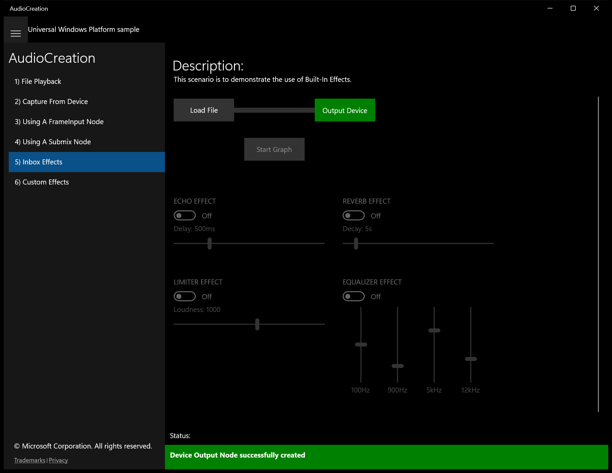

---

## Scenario 6 - Custom Effects

### UI elements
- **TextBlock**  - text="Description:"
- **TextBlock**  - text="This scenario shows using custom effects with the AudioGraph API. In this example, an echo effect is created using the IBasicAudioEffect interface."
- **Button**  - x:Name="fileButton"; content="Load File"; events: Click=File_Click
- **TextBlock**  - x:Name="speaker"; text="Output Device"
- **Button**  - x:Name="graphButton"; content="Start Graph"; events: Click=Graph_Click
- **TextBlock**  - x:Name="StatusBlock"

### Code behavior
- **`OnNavigatedTo`**
    - API refs: `MainPage.Current`
- **`SelectInputFile`**
    - instantiates: `FileOpenPicker`, `SolidColorBrush`
    - API refs: `Content.Equals`, `PickerLocationId.MusicLibrary`, `FileTypeFilter.Add`, `PickerViewMode.Thumbnail`, `AudioFileNodeCreationStatus.Success`, `String.Format`, `Status.ToString`, `NotifyType.ErrorMessage`, `Colors.Green`
- **`TogglePlay`**
    - instantiates: `SolidColorBrush`
    - API refs: `Content.Equals`, `Colors.Blue`, `Color.FromArgb`
- **`CreateAudioGraph`**
    - instantiates: `AudioGraphSettings`, `SolidColorBrush`
    - API refs: `AudioRenderCategory.Media`, `AudioGraph.CreateAsync`, `AudioGraphCreationStatus.Success`, `String.Format`, `Status.ToString`, `NotifyType.ErrorMessage`, `AudioDeviceNodeCreationStatus.Success`, `Colors.Red`, `NotifyType.StatusMessage`, `Colors.Green`
- **`AddCustomEffect`**
    - instantiates: `PropertySet`, `AudioEffectDefinition`
    - API refs: `EffectDefinitions.Add`
- **`FileInput_FileCompleted`**
    - namespaces: `Windows.UI.Core.CoreDispatcherPriority.Normal`
    - API refs: `Dispatcher.RunAsync`, `Windows.UI`, `Core.CoreDispatcherPriority`, `NotifyType.StatusMessage`

### Screenshots
Initial state:

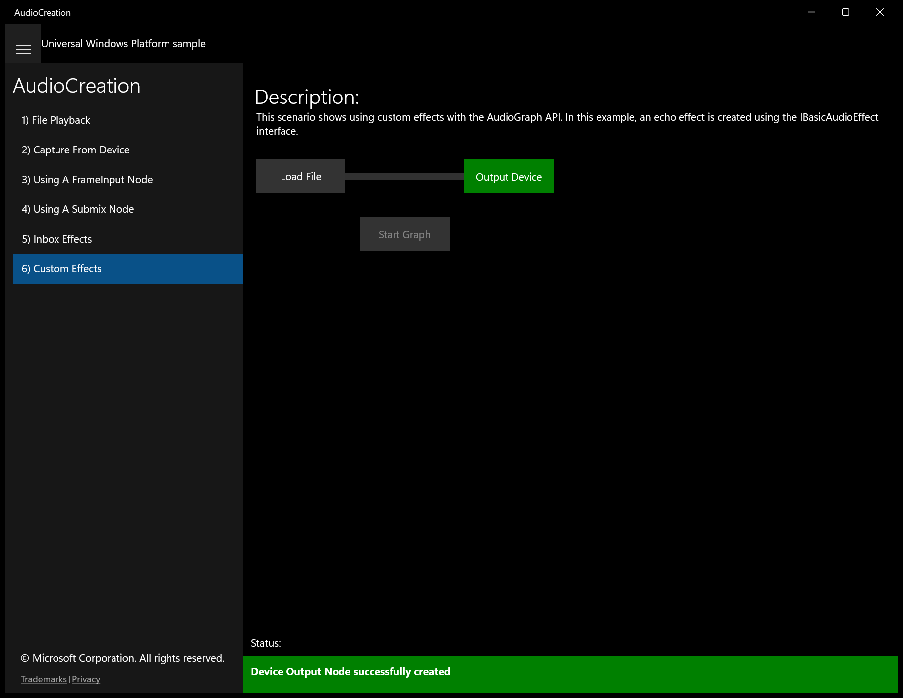

After click **Load File** (popup: Open):

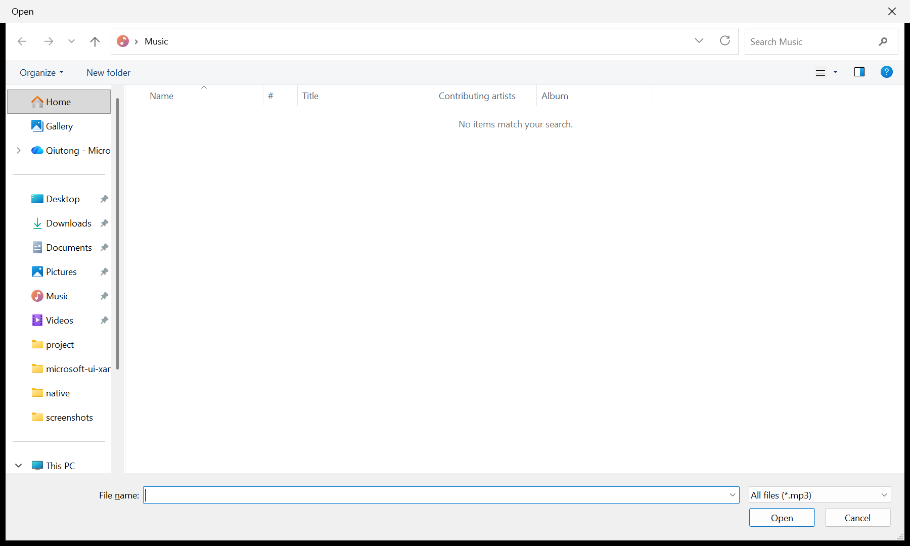

After click **Load File**:

