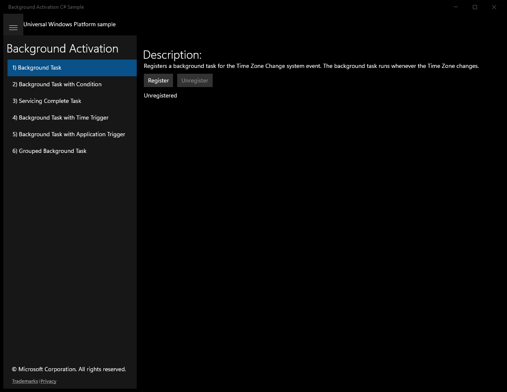
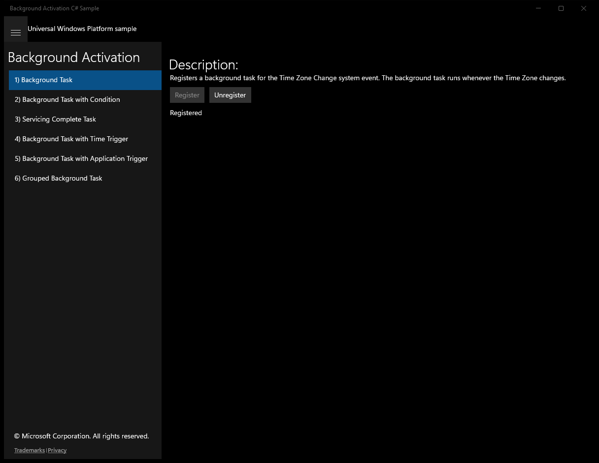
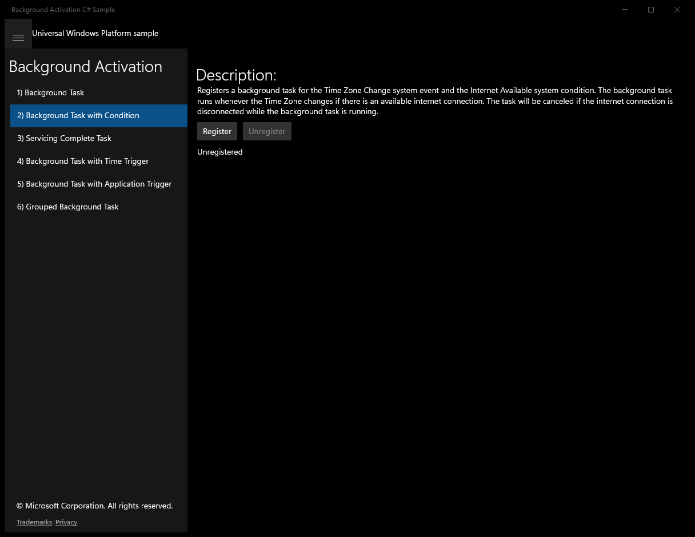
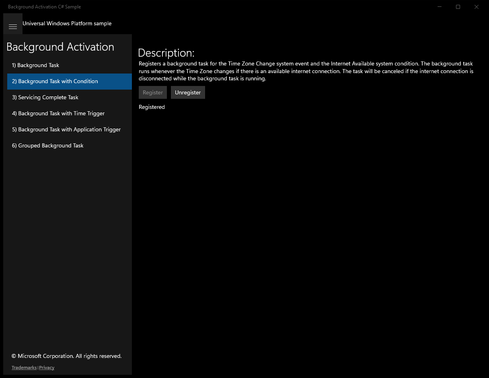
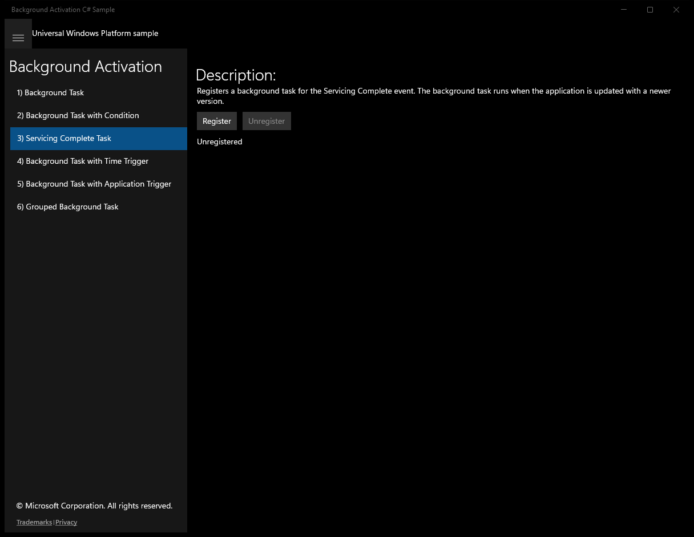
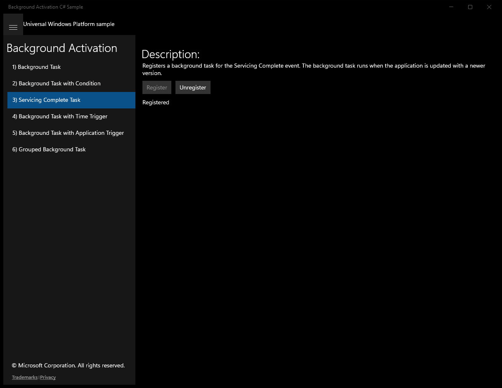
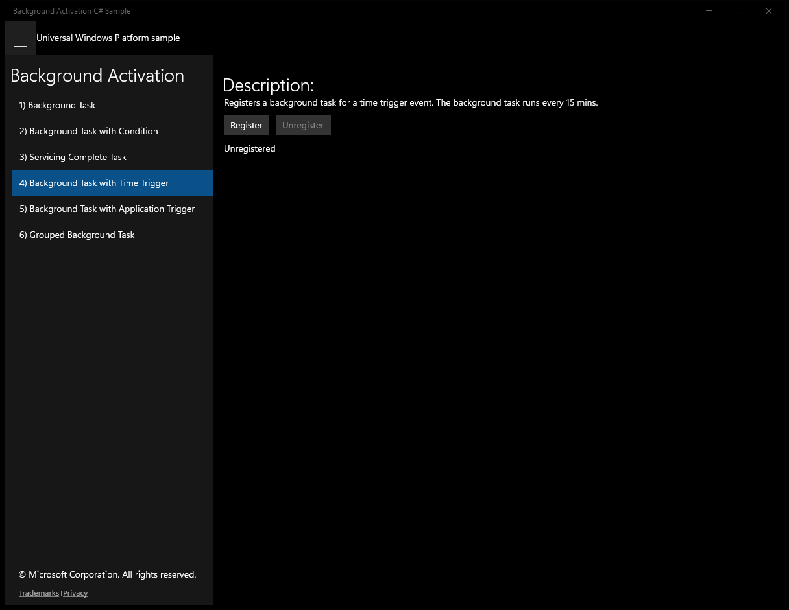
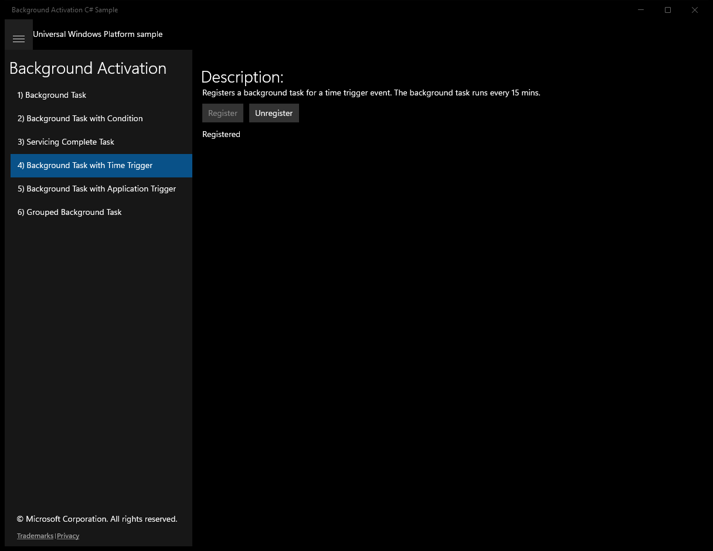
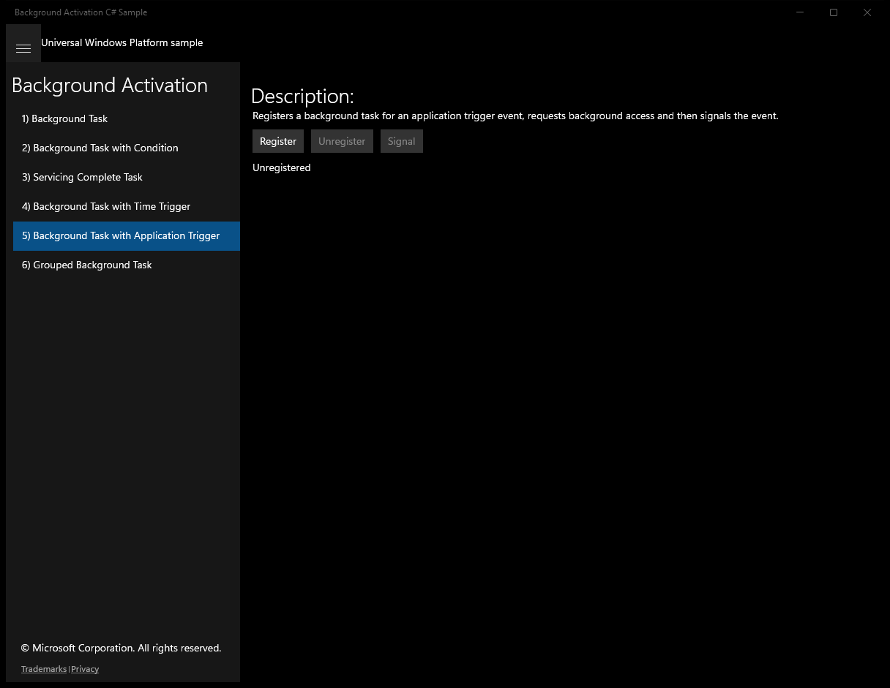
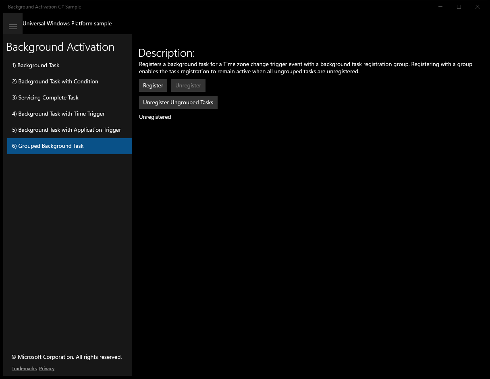

# BackgroundActivation (C#)

> **Source**: `Samples\BackgroundActivation\cs\`  
> **Feature**: Background Activation  
> **AUMID**: `Microsoft.SDKSamples.BackgroundActivation.CS_8wekyb3d8bbwe!App`  
> **PackageFamilyName**: `Microsoft.SDKSamples.BackgroundActivation.CS_8wekyb3d8bbwe`  

## Build / deploy / capture status
- build: ok
- deploy: ok
- launch: ok
- capture: ok
- uninstall: ok

## Main page

---

## Scenario 1 - Scenario1_SampleBackgroundTask

**Description**: Registers a background task for the Time Zone Change system event. The background task runs whenever the Time Zone changes.

### UI elements
- **TextBlock**  - text="Description:"
- **TextBlock**  - text="Registers a background task for the Time Zone Change system event. The background task runs whenever the Time Zone changes."
- **Button**  - x:Name="RegisterButton"; content="Register"; events: Click=RegisterBackgroundTask
- **Button**  - x:Name="UnregisterButton"; content="Unregister"; events: Click=UnregisterBackgroundTask
- **TextBlock**  - x:Name="Status"; text="Unregistered"
- **TextBlock**  - x:Name="Progress"

### Code behavior
- **`OnNavigatedTo`**
    - API refs: `BackgroundTaskRegistration.AllTasks`, `Value.Name`, `BackgroundTaskSample.SampleBackgroundTaskName`, `BackgroundTaskSample.UpdateBackgroundTaskRegistrationStatus`
- **`RegisterBackgroundTask`**
    - instantiates: `SystemTrigger`
    - API refs: `BackgroundTaskSample.RegisterBackgroundTask`, `BackgroundTaskSample.SampleBackgroundTaskName`, `SystemTriggerType.TimeZoneChange`
- **`UnregisterBackgroundTask`**
    - API refs: `BackgroundTaskSample.UnregisterBackgroundTasks`, `BackgroundTaskSample.SampleBackgroundTaskName`
- **`OnProgress`**
    - API refs: `Dispatcher.RunAsync`, `CoreDispatcherPriority.Normal`, `BackgroundTaskSample.SampleBackgroundTaskProgress`
- **`UpdateUI`**
    - API refs: `Dispatcher.RunAsync`, `CoreDispatcherPriority.Normal`, `RegisterButton.IsEnabled`, `BackgroundTaskSample.SampleBackgroundTaskRegistered`, `UnregisterButton.IsEnabled`, `Progress.Text`, `BackgroundTaskSample.SampleBackgroundTaskProgress`, `Status.Text`, `BackgroundTaskSample.GetBackgroundTaskStatus`, `BackgroundTaskSample.SampleBackgroundTaskName`

### Screenshots
Initial state:

After click **Register**:

---

## Scenario 2 - Scenario2_SampleBackgroundTaskWithCondition

**Description**: Registers a background task for the Time Zone Change system event and the Internet Available system condition. The background task runs whenever the Time Zone changes if there is an available internet connection. The task will be canceled if the internet connection is disconnected while the background task is running.

### UI elements
- **TextBlock**  - text="Description:"
- **Button**  - x:Name="RegisterButton"; content="Register"; events: Click=RegisterBackgroundTask
- **Button**  - x:Name="UnregisterButton"; content="Unregister"; events: Click=UnregisterBackgroundTask
- **TextBlock**  - x:Name="Status"; text="Unregistered"
- **TextBlock**  - x:Name="Progress"

### Code behavior
- **`OnNavigatedTo`**
    - API refs: `BackgroundTaskRegistration.AllTasks`, `Value.Name`, `BackgroundTaskSample.SampleBackgroundTaskWithConditionName`, `BackgroundTaskSample.UpdateBackgroundTaskRegistrationStatus`
- **`RegisterBackgroundTask`**
    - instantiates: `SystemTrigger`, `SystemCondition`
    - API refs: `BackgroundTaskSample.RegisterBackgroundTask`, `BackgroundTaskSample.SampleBackgroundTaskWithConditionName`, `SystemTriggerType.TimeZoneChange`, `SystemConditionType.InternetAvailable`
- **`UnregisterBackgroundTask`**
    - API refs: `BackgroundTaskSample.UnregisterBackgroundTasks`, `BackgroundTaskSample.SampleBackgroundTaskWithConditionName`
- **`OnProgress`**
    - API refs: `Dispatcher.RunAsync`, `CoreDispatcherPriority.Normal`, `BackgroundTaskSample.SampleBackgroundTaskWithConditionProgress`
- **`UpdateUI`**
    - API refs: `Dispatcher.RunAsync`, `CoreDispatcherPriority.Normal`, `RegisterButton.IsEnabled`, `BackgroundTaskSample.SampleBackgroundTaskWithConditionRegistered`, `UnregisterButton.IsEnabled`, `Progress.Text`, `BackgroundTaskSample.SampleBackgroundTaskWithConditionProgress`, `Status.Text`, `BackgroundTaskSample.GetBackgroundTaskStatus`, `BackgroundTaskSample.SampleBackgroundTaskWithConditionName`

### Screenshots
Initial state:

After click **Register**:

---

## Scenario 3 - Scenario3_ServicingCompleteTask

**Description**: Registers a background task for the Servicing Complete event. The background task runs when the application is updated with a newer version.

### UI elements
- **TextBlock**  - text="Description:"
- **TextBlock**  - text="Registers a background task for the Servicing Complete event. The background task runs when the application is updated with a newer version."
- **Button**  - x:Name="RegisterButton"; content="Register"; events: Click=RegisterBackgroundTask
- **Button**  - x:Name="UnregisterButton"; content="Unregister"; events: Click=UnregisterBackgroundTask
- **TextBlock**  - x:Name="Status"; text="Unregistered"
- **TextBlock**  - x:Name="Progress"

### Code behavior
- **`OnNavigatedTo`**
    - API refs: `BackgroundTaskRegistration.AllTasks`, `Value.Name`, `BackgroundTaskSample.ServicingCompleteTaskName`, `BackgroundTaskSample.UpdateBackgroundTaskRegistrationStatus`
- **`RegisterBackgroundTask`**
    - instantiates: `SystemTrigger`
    - API refs: `BackgroundTaskSample.RegisterBackgroundTask`, `BackgroundTaskSample.ServicingCompleteTaskName`, `SystemTriggerType.ServicingComplete`
- **`UnregisterBackgroundTask`**
    - API refs: `BackgroundTaskSample.UnregisterBackgroundTasks`, `BackgroundTaskSample.ServicingCompleteTaskName`
- **`OnProgress`**
    - API refs: `Dispatcher.RunAsync`, `CoreDispatcherPriority.Normal`, `BackgroundTaskSample.ServicingCompleteTaskProgress`
- **`UpdateUI`**
    - API refs: `Dispatcher.RunAsync`, `CoreDispatcherPriority.Normal`, `RegisterButton.IsEnabled`, `BackgroundTaskSample.ServicingCompleteTaskRegistered`, `UnregisterButton.IsEnabled`, `Progress.Text`, `BackgroundTaskSample.ServicingCompleteTaskProgress`, `Status.Text`, `BackgroundTaskSample.GetBackgroundTaskStatus`, `BackgroundTaskSample.ServicingCompleteTaskName`

### Screenshots
Initial state:

After click **Register**:

---

## Scenario 4 - Scenario4_TimeTriggeredTask

**Description**: Registers a background task for a time trigger event. The background task runs every 15 mins.

### UI elements
- **TextBlock**  - text="Description:"
- **TextBlock**  - text="Registers a background task for a time trigger event. The background task runs every 15 mins."
- **Button**  - x:Name="RegisterButton"; content="Register"; events: Click=RegisterBackgroundTask
- **Button**  - x:Name="UnregisterButton"; content="Unregister"; events: Click=UnregisterBackgroundTask
- **TextBlock**  - x:Name="Status"; text="Unregistered"
- **TextBlock**  - x:Name="Progress"

### Code behavior
- **`OnNavigatedTo`**
    - API refs: `BackgroundTaskRegistration.AllTasks`, `Value.Name`, `BackgroundTaskSample.TimeTriggeredTaskName`, `BackgroundTaskSample.UpdateBackgroundTaskRegistrationStatus`
- **`RegisterBackgroundTask`**
    - instantiates: `TimeTrigger`
    - API refs: `BackgroundTaskSample.RegisterBackgroundTask`, `BackgroundTaskSample.TimeTriggeredTaskName`
- **`UnregisterBackgroundTask`**
    - API refs: `BackgroundTaskSample.UnregisterBackgroundTasks`, `BackgroundTaskSample.TimeTriggeredTaskName`
- **`OnProgress`**
    - API refs: `Dispatcher.RunAsync`, `CoreDispatcherPriority.Normal`, `BackgroundTaskSample.TimeTriggeredTaskProgress`
- **`UpdateUI`**
    - API refs: `Dispatcher.RunAsync`, `CoreDispatcherPriority.Normal`, `RegisterButton.IsEnabled`, `BackgroundTaskSample.TimeTriggeredTaskRegistered`, `UnregisterButton.IsEnabled`, `Progress.Text`, `BackgroundTaskSample.TimeTriggeredTaskProgress`, `Status.Text`, `BackgroundTaskSample.GetBackgroundTaskStatus`, `BackgroundTaskSample.TimeTriggeredTaskName`

### Screenshots
Initial state:

After click **Register**:

---

## Scenario 5 - Scenario5_ApplicationTriggerTask

**Description**: Registers a background task for an application trigger event, requests background access and then signals the event.

### UI elements
- **TextBlock**  - text="Description:"
- **TextBlock**  - text="Registers a background task for an application trigger event, requests background access and then signals the event."
- **Button**  - x:Name="RegisterButton"; content="Register"; events: Click=RegisterBackgroundTask
- **Button**  - x:Name="UnregisterButton"; content="Unregister"; events: Click=UnregisterBackgroundTask
- **Button**  - x:Name="SignalButton"; content="Signal"; events: Click=SignalBackgroundTask
- **TextBlock**  - x:Name="Status"; text="Unregistered"
- **TextBlock**  - x:Name="Progress"
- **TextBlock**  - x:Name="Result"

### Code behavior
- **`OnNavigatedTo`**
    - instantiates: `ApplicationTrigger`
    - API refs: `BackgroundTaskRegistration.AllTasks`, `Value.Name`, `BackgroundTaskSample.ApplicationTriggerTaskName`, `BackgroundTaskSample.UpdateBackgroundTaskRegistrationStatus`
- **`RegisterBackgroundTask`**
    - API refs: `BackgroundTaskSample.RegisterBackgroundTask`, `BackgroundTaskSample.ApplicationTriggerTaskName`
- **`UnregisterBackgroundTask`**
    - API refs: `BackgroundTaskSample.UnregisterBackgroundTasks`, `BackgroundTaskSample.ApplicationTriggerTaskName`, `BackgroundTaskSample.ApplicationTriggerTaskResult`
- **`SignalBackgroundTask`**
    - API refs: `BackgroundTaskSample.TaskStatuses`, `BackgroundTaskSample.ApplicationTriggerTaskName`, `BackgroundTaskSample.ApplicationTriggerTaskResult`
- **`OnProgress`**
    - API refs: `Dispatcher.RunAsync`, `CoreDispatcherPriority.Normal`, `BackgroundTaskSample.ApplicationTriggerTaskProgress`
- **`UpdateUI`**
    - API refs: `Dispatcher.RunAsync`, `CoreDispatcherPriority.Normal`, `RegisterButton.IsEnabled`, `BackgroundTaskSample.ApplicationTriggerTaskRegistered`, `UnregisterButton.IsEnabled`, `SignalButton.IsEnabled`, `Progress.Text`, `BackgroundTaskSample.ApplicationTriggerTaskProgress`, `Result.Text`, `BackgroundTaskSample.ApplicationTriggerTaskResult`, `Status.Text`, `BackgroundTaskSample.GetBackgroundTaskStatus`, `BackgroundTaskSample.ApplicationTriggerTaskName`

### Screenshots
Initial state:

After click **Register**:

---

## Scenario 6 - Scenario6_GroupedTask

**Description**: Registers a background task for a Time zone change trigger event with a background task registration group. Registering with a group enables the task registration to remain active when all ungrouped tasks are unregistered.

### UI elements
- **TextBlock**  - text="Description:"
- **Button**  - x:Name="RegisterButton"; content="Register"; events: Click=RegisterGroupedBackgroundTask
- **Button**  - x:Name="UnregisterGroupedButton"; content="Unregister"; events: Click=UnregisterGroupedTask
- **Button**  - x:Name="UnregisterUngroupedButton"; events: Click=UnregisterUngroupedTasks
- **TextBlock**  - text="Unregister Ungrouped Tasks"
- **TextBlock**  - x:Name="Status"; text="Unregistered"
- **TextBlock**  - x:Name="Progress"
- **TextBlock**  - x:Name="Result"

### Code behavior
- **`OnNavigatedTo`**
    - API refs: `BackgroundTaskSample.GetTaskGroup`, `BackgroundTaskSample.BackgroundTaskGroupId`, `BackgroundTaskSample.BackgroundTaskGroupFriendlyName`, `Value.Name`, `BackgroundTaskSample.GroupedBackgroundTaskName`, `BackgroundTaskSample.UpdateBackgroundTaskRegistrationStatus`
- **`RegisterGroupedBackgroundTask`**
    - instantiates: `SystemTrigger`
    - API refs: `BackgroundTaskSample.RegisterBackgroundTask`, `BackgroundTaskSample.GroupedBackgroundTaskName`, `SystemTriggerType.TimeZoneChange`
- **`UnregisterGroupedTask`**
    - API refs: `BackgroundTaskSample.UnregisterBackgroundTasks`, `BackgroundTaskSample.GroupedBackgroundTaskName`
- **`UnregisterUngroupedTasks`**
    - API refs: `BackgroundTaskRegistration.AllTasks`, `Value.Unregister`, `BackgroundTaskSample.UpdateBackgroundTaskRegistrationStatus`, `Value.Name`
- **`OnProgress`**
    - API refs: `Dispatcher.RunAsync`, `CoreDispatcherPriority.Normal`, `BackgroundTaskSample.GroupedBackgroundTaskProgress`
- **`UpdateUI`**
    - API refs: `Dispatcher.RunAsync`, `CoreDispatcherPriority.Normal`, `RegisterButton.IsEnabled`, `BackgroundTaskSample.GroupedBackgroundTaskRegistered`, `UnregisterGroupedButton.IsEnabled`, `Progress.Text`, `BackgroundTaskSample.GroupedBackgroundTaskProgress`, `Status.Text`, `BackgroundTaskSample.GetBackgroundTaskStatus`, `BackgroundTaskSample.GroupedBackgroundTaskName`

### Screenshots
Initial state:

After click **Register**:

After click **Unregister Ungrouped Tasks**:

