# BackgroundTask (C#)

> **Source**: `Samples\BackgroundTask\cs\`  
> **Feature**: Background tasks  
> **AUMID**: `Microsoft.SDKSamples.BackgroundTask.CS_8wekyb3d8bbwe!App`  
> **PackageFamilyName**: `Microsoft.SDKSamples.BackgroundTask.CS_8wekyb3d8bbwe`  

## Build / deploy / capture status
- build: ok
- deploy: ok
- launch: ok
- capture: ok
- uninstall: ok

## Main page
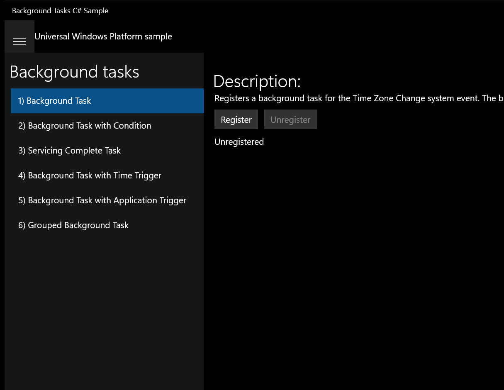

---

## Scenario 1 - 1) Background Task

### Screenshots
Initial state:

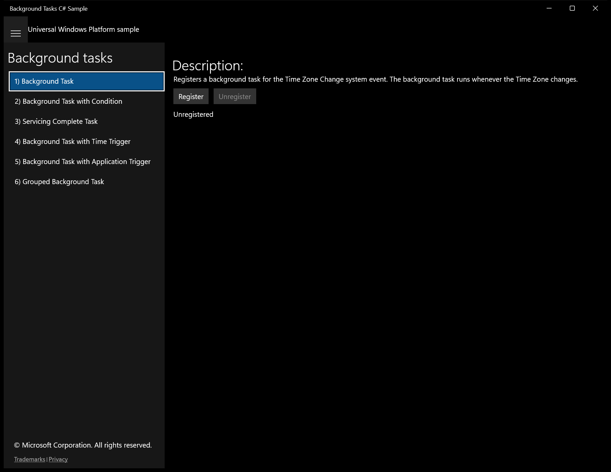

After click **Register**:

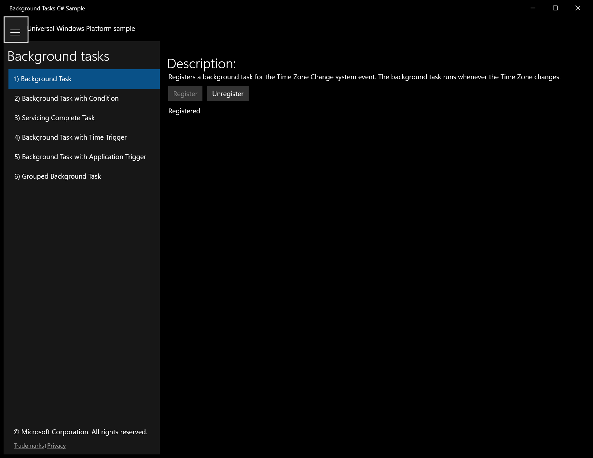

---

## Scenario 2 - 2) Background Task with Condition

### Screenshots
Initial state:

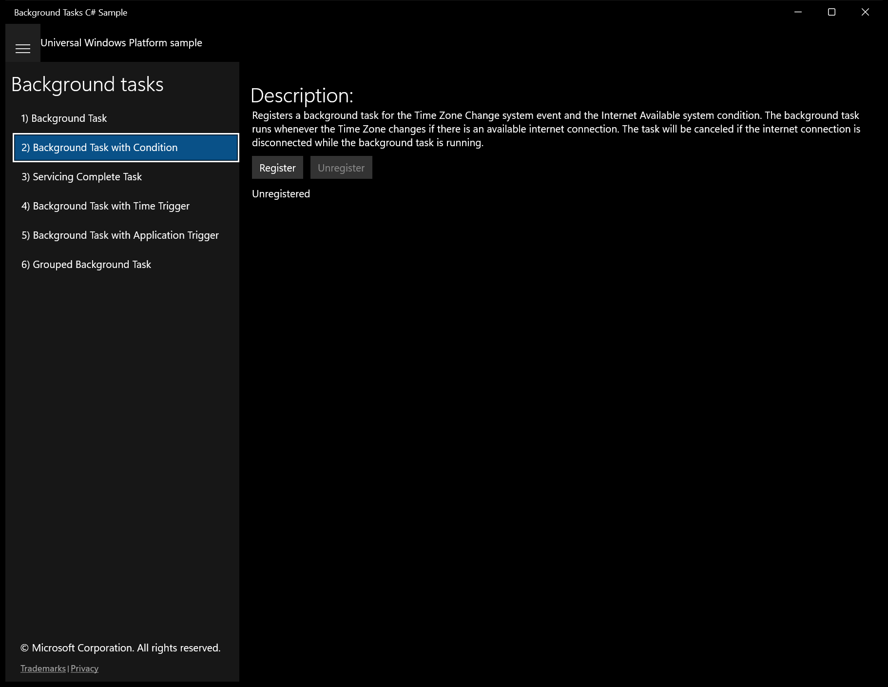

After click **Register**:

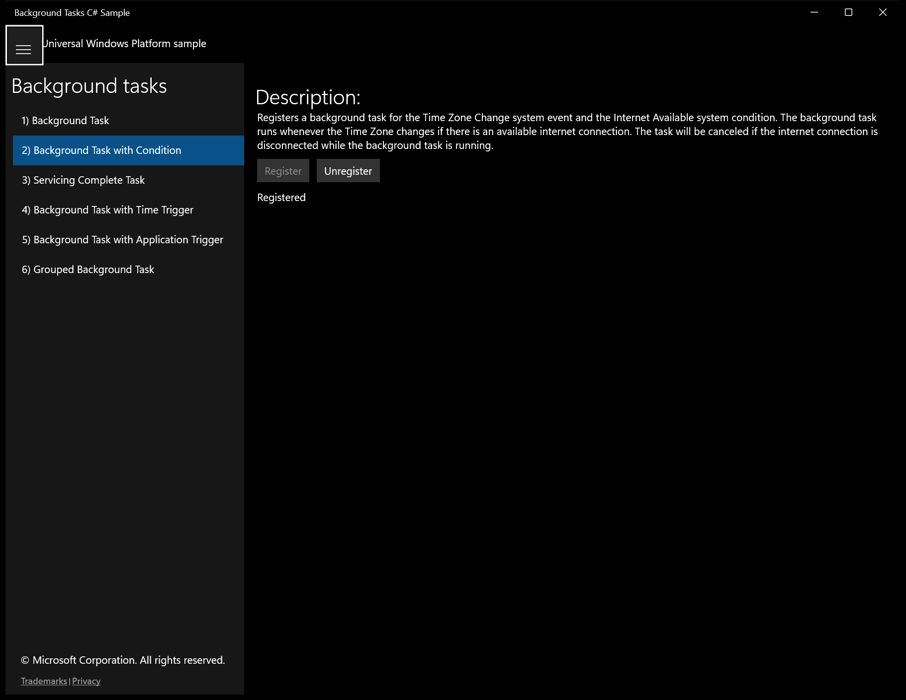

---

## Scenario 3 - 3) Servicing Complete Task

### Screenshots
Initial state:

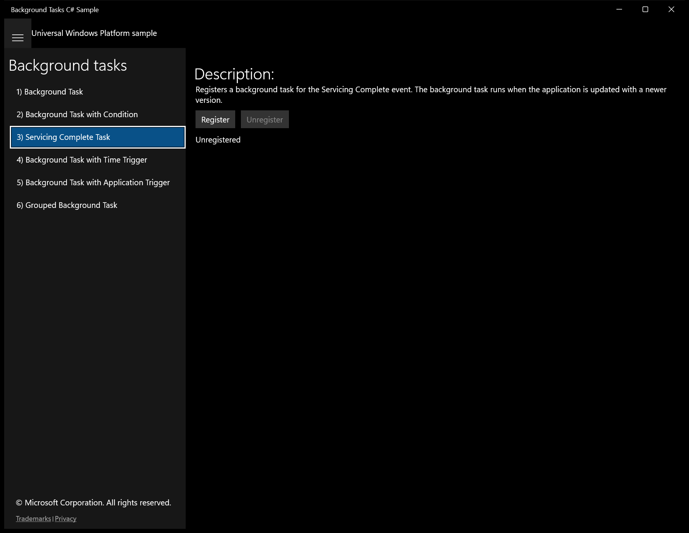

After click **Register**:

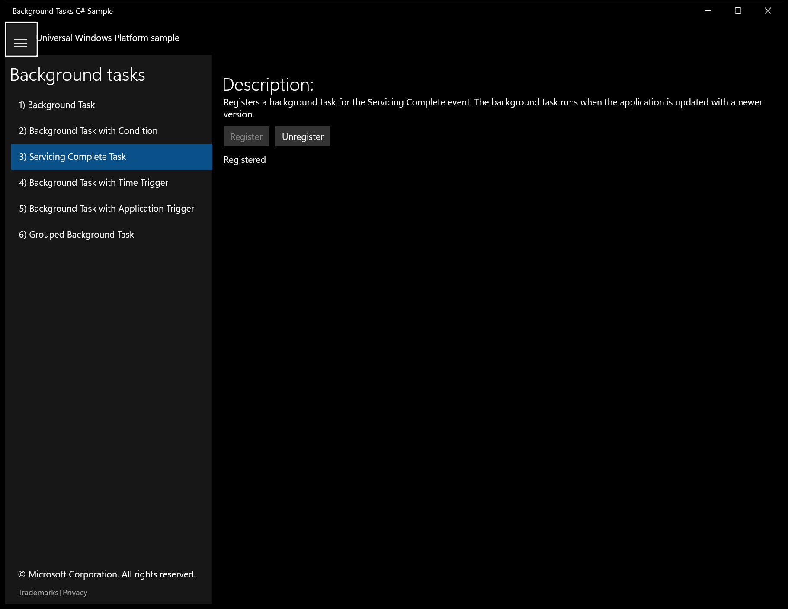

---

## Scenario 4 - 4) Background Task with Time Trigger

### Screenshots
Initial state:

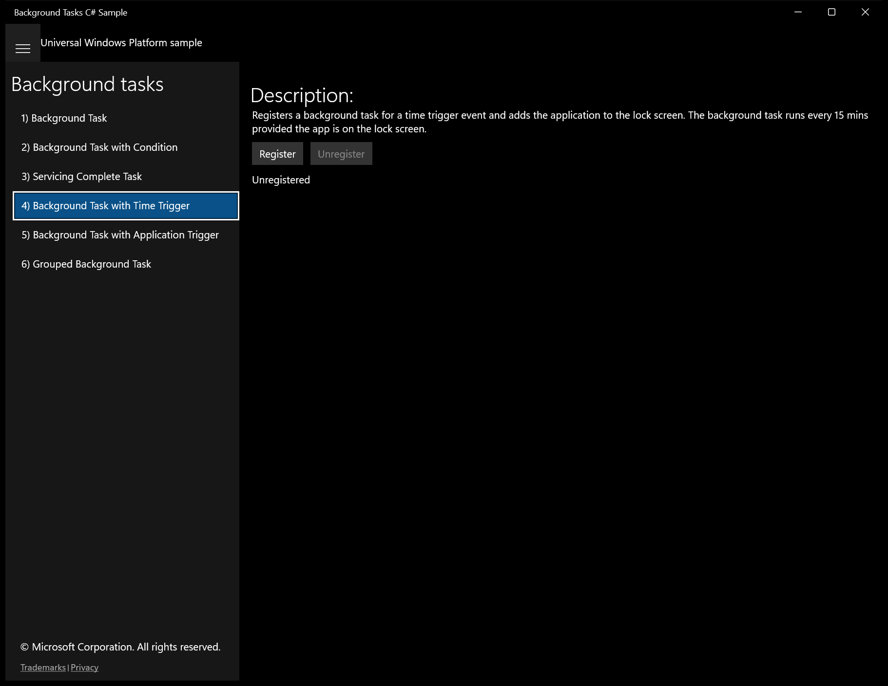

After click **Register**:

---

## Scenario 5 - 5) Background Task with Application Trigger

### Screenshots
Initial state:

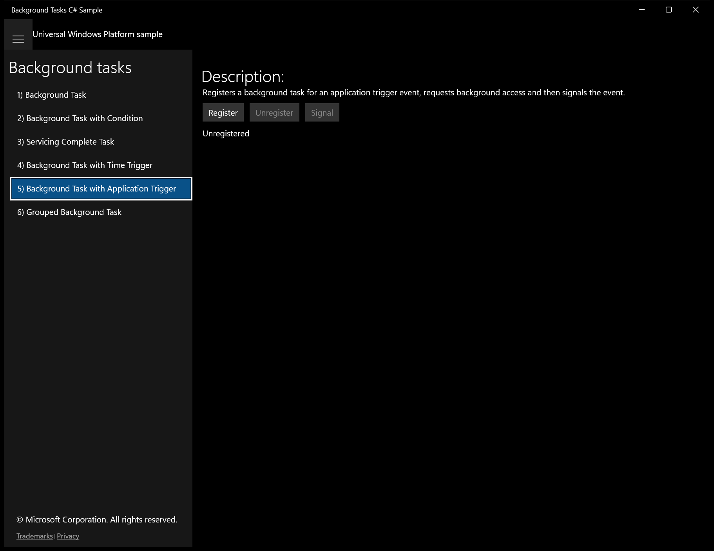

After click **Register**:

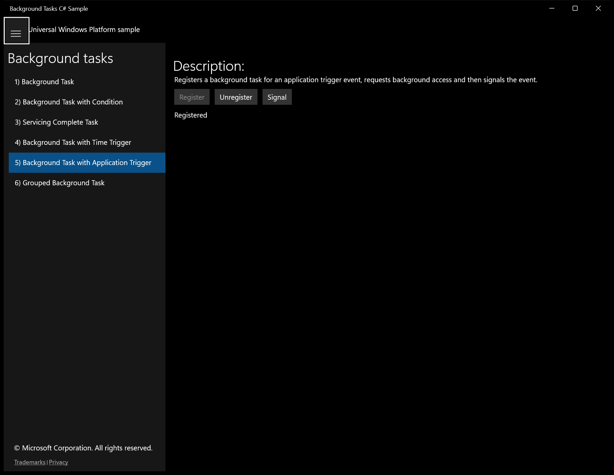

---

## Scenario 6 - 6) Grouped Background Task

### Screenshots
Initial state:

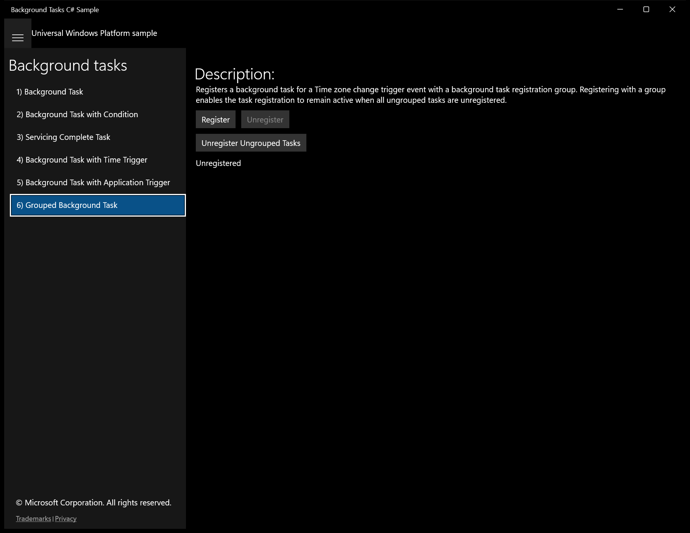

After click **Register**:

After click **Unregister Ungrouped Tasks**:

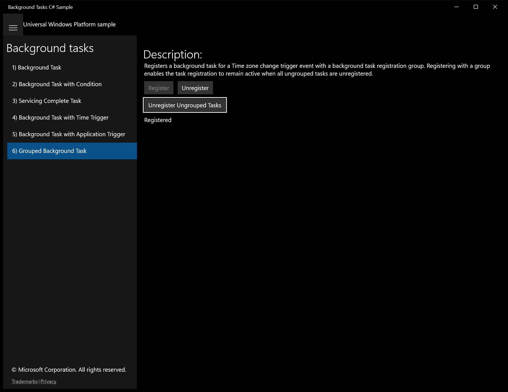

