# BackgroundTransfer (C#)

> **Source**: `Samples\BackgroundTransfer\cs\`  
> **Feature**: BackgroundTransfer  
> **AUMID**: `Microsoft.SDKSamples.BackgroundTransfer.CS_8wekyb3d8bbwe!App`  
> **PackageFamilyName**: `Microsoft.SDKSamples.BackgroundTransfer.CS_8wekyb3d8bbwe`  

## Top-level UWP namespaces used
- `Windows.UI.Core.CoreDispatcherPriority.Normal`
- `Windows.Media.Playback.MediaPlayer`
- `Windows.Media.Core.MediaSource.CreateFromStream`
- `Windows.Storage.Streams.Buffer`

## Build / deploy / capture status
- build: ok
- deploy: ok
- launch: ok
- capture: ok
- uninstall: ok

## Main page
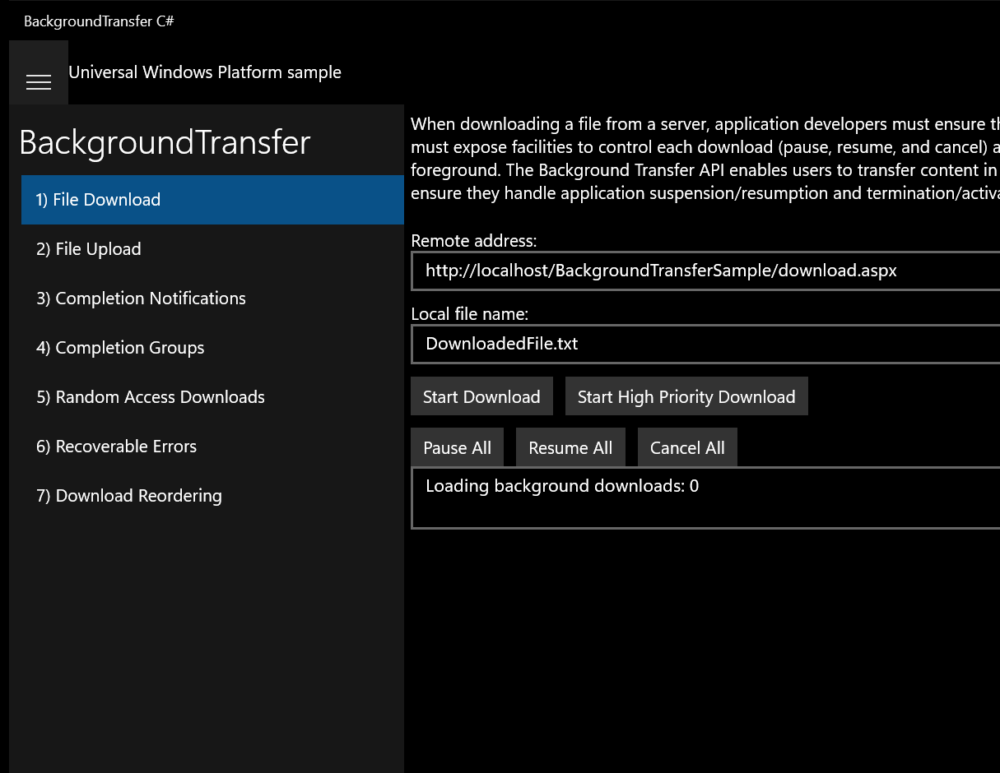

---

## Scenario 1 - File Download

### UI elements
- **TextBlock**  - x:Name="InputTextBlock1"
- **TextBlock**  - text="Remote address: "
- **TextBox**  - x:Name="serverAddressField"; text="http://localhost/BackgroundTransferSample/download.aspx"
- **TextBlock**  - text="Local file name: "
- **TextBox**  - x:Name="fileNameField"; text="DownloadedFile.txt"
- **Button**  - x:Name="StartDownloadButton"; content="Start Download"; events: Click=StartDownload_Click
- **Button**  - x:Name="StartHighPriorityDownloadButton"; content="Start High Priority Download"; events: Click=StartHighPriorityDownload_Click
- **Button**  - x:Name="PauseAllButton"; content="Pause All"; events: Click=PauseAll_Click
- **Button**  - x:Name="ResumeAllButton"; content="Resume All"; events: Click=ResumeAll_Click
- **Button**  - x:Name="CancelAllButton"; content="Cancel All"; events: Click=CancelAll_Click
- **TextBox**  - x:Name="outputField"

### Code behavior
- **`Dispose`**
    - API refs: `GC.SuppressFinalize`
- **`OnNavigatedTo`**
    - API refs: `ActivationKind.Launch`
- **`DiscoverActiveDownloadsAsync`**
    - instantiates: `List`
    - API refs: `BackgroundDownloader.GetCurrentDownloadsAsync`, `String.Format`, `CultureInfo.CurrentCulture`, `Progress.Status`, `Task.WhenAll`
- **`StartDownload`**
    - instantiates: `BackgroundDownloader`
    - API refs: `Uri.TryCreate`, `Text.Trim`, `UriKind.Absolute`, `NotifyType.ErrorMessage`, `KnownFolders.GetFolderForUserAsync`, `KnownFolderId.PicturesLibrary`, `CreationCollisionOption.GenerateUniqueName`, `String.Format`, `CultureInfo.CurrentCulture`
- **`StartDownload_Click`**
    - API refs: `BackgroundTransferPriority.Default`
- **`StartHighPriorityDownload_Click`**
    - API refs: `BackgroundTransferPriority.High`
- **`PauseAll_Click`**
    - API refs: `DownloadOperation.Progress`, `BackgroundTransferStatus.Running`, `String.Format`, `CultureInfo.CurrentCulture`
- **`ResumeAll_Click`**
    - API refs: `DownloadOperation.Progress`, `BackgroundTransferStatus.PausedByApplication`, `String.Format`, `CultureInfo.CurrentCulture`
- **`DownloadProgress`**
    - API refs: `DownloadOperation.Progress`, `String.Format`, `CultureInfo.CurrentCulture`, `Headers.Count`
- **`HandleDownloadAsync`**
    - instantiates: `Progress`
    - API refs: `NotifyType.StatusMessage`, `StatusCode.ToString`, `String.Empty`, `String.Format`, `CultureInfo.CurrentCulture`
- **`IsExceptionHandled`**
    - API refs: `BackgroundTransferError.GetStatus`, `WebErrorStatus.Unknown`, `String.Format`, `CultureInfo.CurrentCulture`, `NotifyType.ErrorMessage`
- **`MarshalLog`**
    - namespaces: `Windows.UI.Core.CoreDispatcherPriority.Normal`
    - API refs: `Dispatcher.RunAsync`, `Windows.UI`, `Core.CoreDispatcherPriority`

### Screenshots
Initial state:

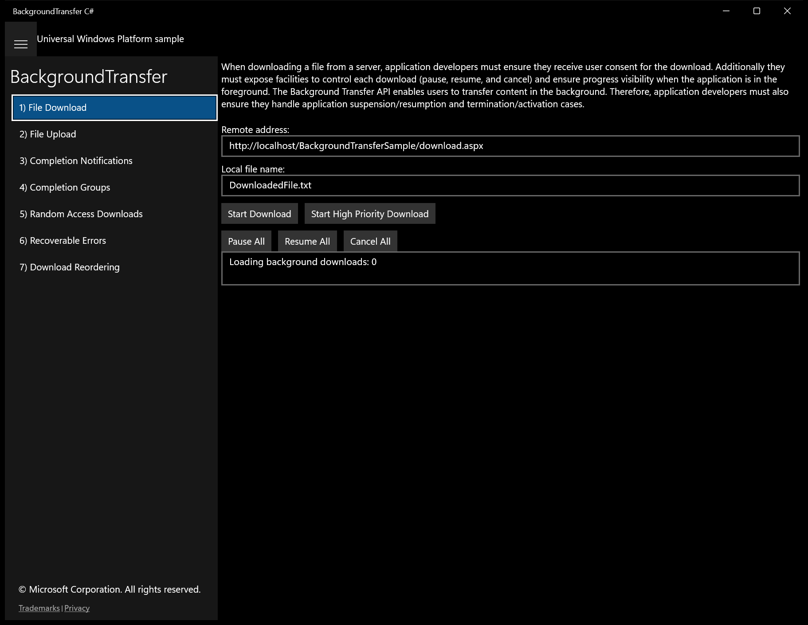

After click **Start Download**:

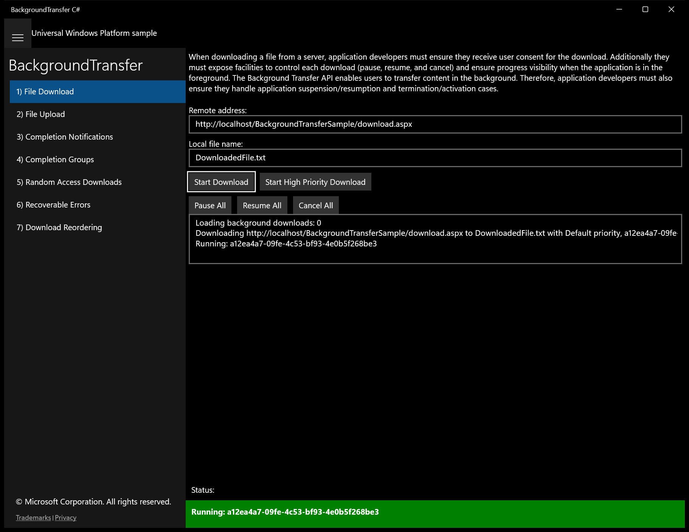

After click **Start High Priority Download**:

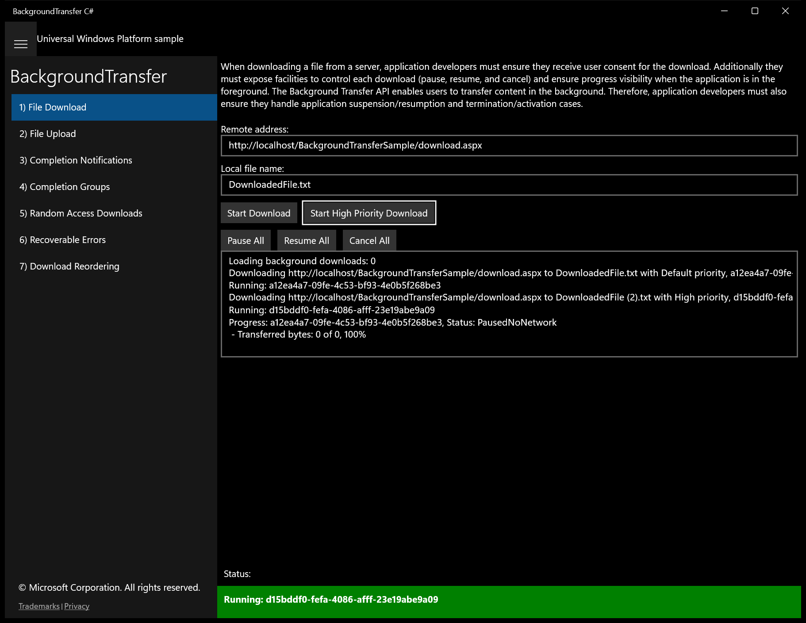

After click **Pause All**:

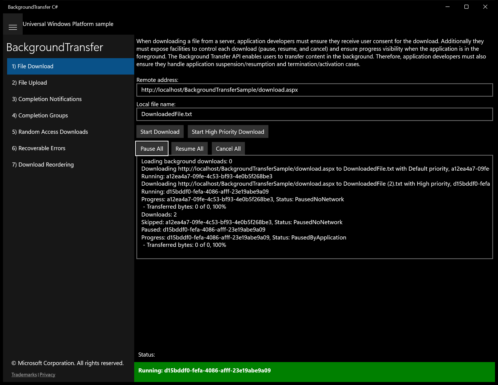

---

## Scenario 2 - File Upload

### UI elements
- **TextBlock**  - x:Name="InputTextBlock1"
- **TextBlock**  - text="Remote address: "
- **TextBox**  - x:Name="serverAddressField"; text="http://localhost/BackgroundTransferSample/Upload.aspx"
- **Button**  - x:Name="StartUploadButton"; content="Start Upload"; events: Click=StartUpload_Click
- **Button**  - x:Name="StartMultipartUploadButton"; content="Start Multipart Upload"; events: Click=StartMultipartUpload_Click
- **Button**  - x:Name="CancelAllButton"; content="Cancel All"; events: Click=CancelAll_Click
- **TextBox**  - x:Name="outputField"

### Code behavior
- **`Dispose`**
    - API refs: `GC.SuppressFinalize`
- **`OnNavigatedTo`**
    - API refs: `ActivationKind.Launch`
- **`DiscoverActiveUploadsAsync`**
    - instantiates: `List`
    - API refs: `BackgroundUploader.GetCurrentUploadsAsync`, `String.Format`, `CultureInfo.CurrentCulture`, `Progress.Status`, `Task.WhenAll`
- **`StartUpload_Click`**
    - instantiates: `FileOpenPicker`
    - API refs: `Uri.TryCreate`, `Text.Trim`, `UriKind.Absolute`, `NotifyType.ErrorMessage`, `FileTypeFilter.Add`
- **`UploadSingleFile`**
    - instantiates: `BackgroundUploader`
    - API refs: `NotifyType.ErrorMessage`, `String.Format`, `CultureInfo.CurrentCulture`
- **`StartMultipartUpload_Click`**
    - instantiates: `FileOpenPicker`
    - API refs: `Uri.TryCreate`, `Text.Trim`, `UriKind.Absolute`, `NotifyType.ErrorMessage`, `FileTypeFilter.Add`
- **`UploadMultipleFiles`**
    - instantiates: `List`, `BackgroundTransferContentPart`, `BackgroundUploader`
    - API refs: `NotifyType.ErrorMessage`, `String.Format`, `CultureInfo.CurrentCulture`
- **`UploadProgress`**
    - API refs: `UploadOperation.Progress`, `String.Format`, `CultureInfo.CurrentCulture`, `Headers.Count`
- **`HandleUploadAsync`**
    - instantiates: `Progress`
    - API refs: `NotifyType.StatusMessage`, `String.Format`, `CultureInfo.CurrentCulture`
- **`IsExceptionHandled`**
    - API refs: `BackgroundTransferError.GetStatus`, `WebErrorStatus.Unknown`, `String.Format`, `CultureInfo.CurrentCulture`, `NotifyType.ErrorMessage`
- **`MarshalLog`**
    - namespaces: `Windows.UI.Core.CoreDispatcherPriority.Normal`
    - API refs: `Dispatcher.RunAsync`, `Windows.UI`, `Core.CoreDispatcherPriority`

### Screenshots
Initial state:

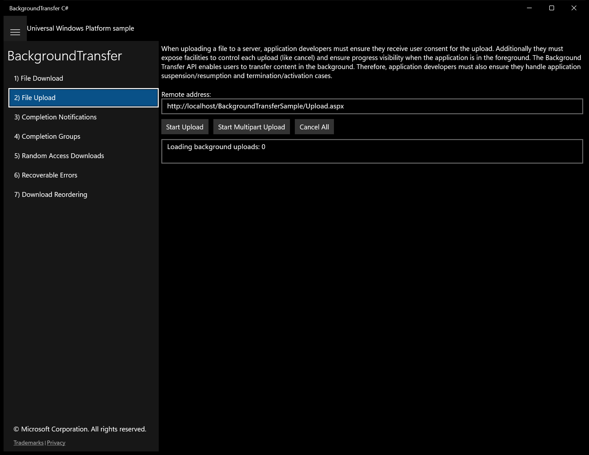

After click **Start Upload** (popup: Open):

After click **Start Upload**:

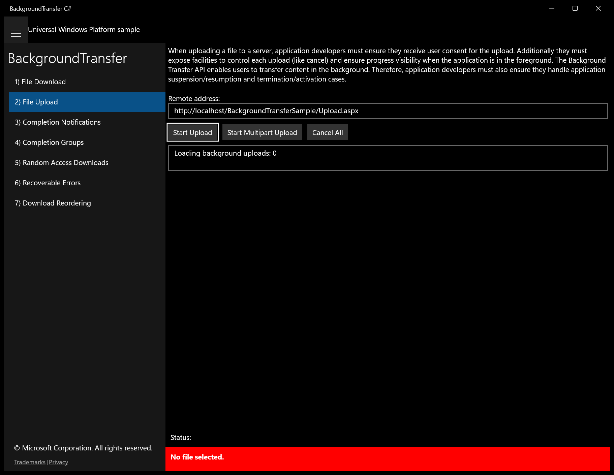

After click **Start Multipart Upload** (popup: Open):

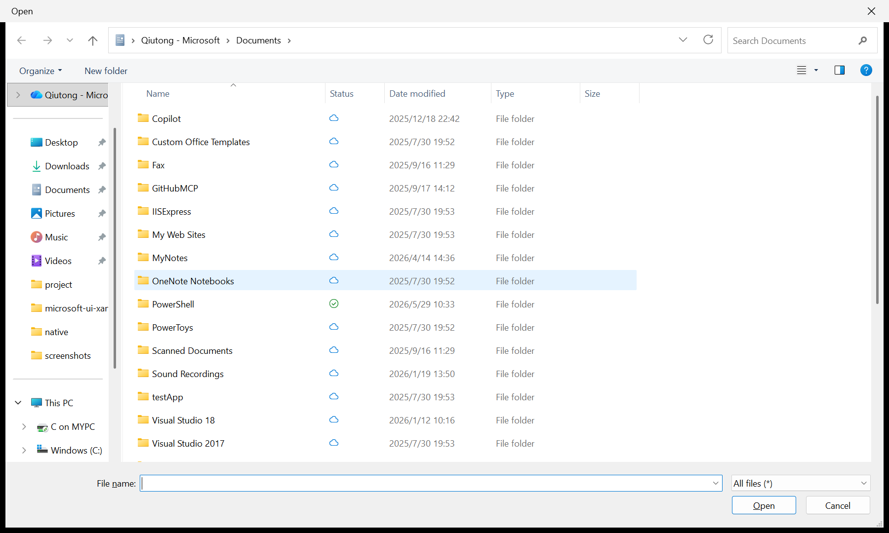

After click **Start Multipart Upload**:

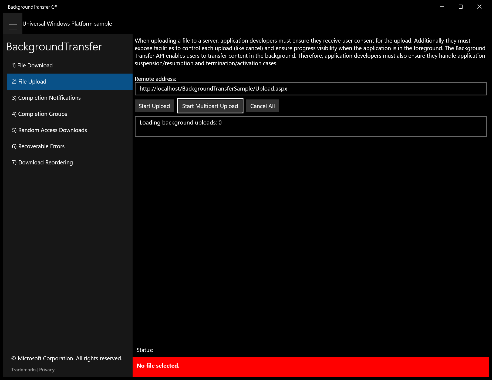

After click **Cancel All**:

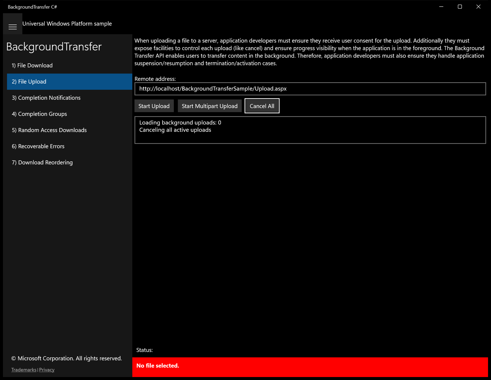

---

## Scenario 3 - Completion Notifications

### UI elements
- **TextBlock**  - x:Name="InputTextBlock1"; text="BackgroundTransfer completion notifications allow apps to show a toast or update a tile once a set of operations complete."
- **TextBlock**  - text="Remote address: "
- **TextBox**  - x:Name="serverAddressField"; text="http://localhost/BackgroundTransferSample/notifications.aspx"
- **Button**  - x:Name="ToastNotificationButton"; content="Start three downloads and show toast on completion"; events: Click=ToastNotificationButton_Click
- **Button**  - x:Name="TileNotificationButton"; content="Start three downloads and update tile on completion"; events: Click=TileNotificationButton_Click
- **TextBox**  - x:Name="outputField"

### Code behavior
- **`OnNavigatedTo`**
    - API refs: `ActivationKind.Launch`
- **`CancelActiveDownloadsAsync`**
    - instantiates: `CancellationTokenSource`
    - API refs: `BackgroundDownloader.GetCurrentDownloadsForTransferGroupAsync`, `Task.WhenAll`, `String.Format`, `CultureInfo.CurrentCulture`, `ToastNotificationButton.IsEnabled`, `TileNotificationButton.IsEnabled`
- **`ToastNotificationButton_Click`**
    - instantiates: `BackgroundDownloader`, `ToastNotification`
    - API refs: `ToastNotificationManager.GetTemplateContent`, `ToastTemplateType.ToastText01`, `ScenarioType.Toast`
- **`TileNotificationButton_Click`**
    - instantiates: `BackgroundDownloader`, `TileNotification`
    - API refs: `TileUpdateManager.GetTemplateContent`, `TileTemplateType.TileSquare150x150Text03`, `DateTime.Now`, `ScenarioType.Tile`
- **`RunDownloadsAsync`**
    - API refs: `Uri.TryCreate`, `Text.Trim`, `UriKind.Absolute`, `NotifyType.ErrorMessage`, `String.Format`, `CultureInfo.InvariantCulture`, `Task.WhenAll`
- **`CreateDownload`**
    - instantiates: `Uri`
    - API refs: `String.Format`, `CultureInfo.InvariantCulture`, `KnownFolders.GetFolderForUserAsync`, `KnownFolderId.PicturesLibrary`, `CreationCollisionOption.GenerateUniqueName`, `NotifyType.ErrorMessage`
- **`DownloadAsync`**
    - API refs: `String.Format`, `CultureInfo.CurrentCulture`, `ResultFile.Name`, `NotifyType.StatusMessage`
- **`IsExceptionHandled`**
    - API refs: `BackgroundTransferError.GetStatus`, `WebErrorStatus.Unknown`, `String.Format`, `CultureInfo.CurrentCulture`, `NotifyType.ErrorMessage`, `ResultFile.Name`

### Screenshots
Initial state:

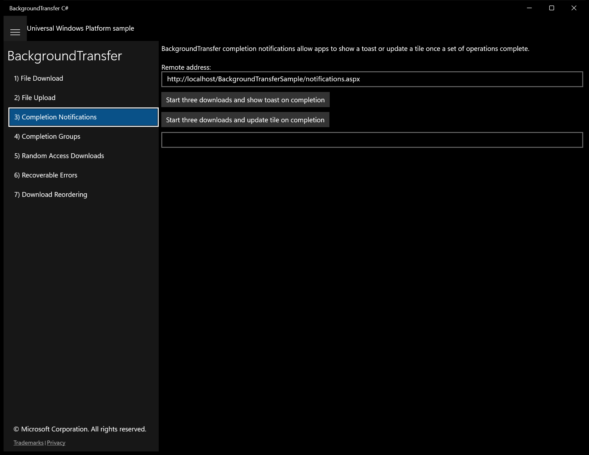

After click **Start three downloads and show toast on completion**:

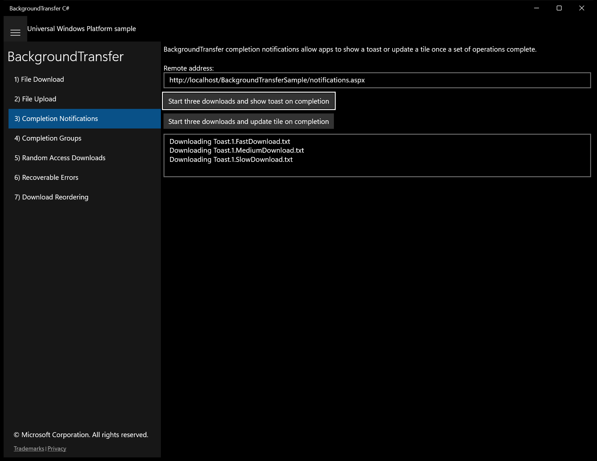

After click **Start three downloads and update tile on completion**:

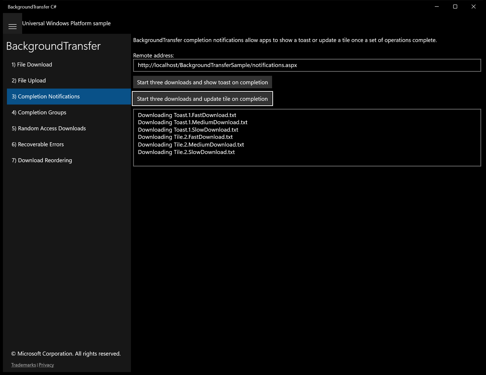

---

## Scenario 4 - Completion Groups

### UI elements
- **TextBlock**  - x:Name="InputTextBlock1"; text="Execute a background task when a set of uploads or downloads completes."
- **TextBlock**  - text="Remote address: "
- **TextBox**  - x:Name="serverAddressField"; text="http://localhost/BackgroundTransferSample/bitmap.aspx"
- **Button**  - x:Name="StartDownloadsButton"; content="Start ten downloads in a completion group"; events: Click=StartDownloadsButton_Click
- **TextBlock**  - x:Name="SubstatusBlock"

### Code behavior
- **`StartDownloadsButton_Click`**
    - instantiates: `Uri`
    - API refs: `Uri.TryCreate`, `Text.Trim`, `UriKind.Absolute`, `NotifyType.ErrorMessage`, `CompletionGroupTask.CreateBackgroundDownloader`, `String.Format`, `CultureInfo.InvariantCulture`, `CompletionGroup.Enable`
- **`CreateResultFileAsync`**
    - API refs: `KnownFolders.GetFolderForUserAsync`, `KnownFolderId.PicturesLibrary`, `String.Format`, `CultureInfo.InvariantCulture`, `CreationCollisionOption.GenerateUniqueName`
- **`SetSubstatus`**
    - API refs: `SubstatusBlock.Dispatcher`, `CoreDispatcherPriority.Normal`, `SubstatusBlock.Text`
- **`OnDownloadCompleted`**
    - API refs: `Dispatcher.RunAsync`, `CoreDispatcherPriority.Normal`, `String.Format`, `CultureInfo.InvariantCulture`, `NotifyType.StatusMessage`

### Screenshots
Initial state:

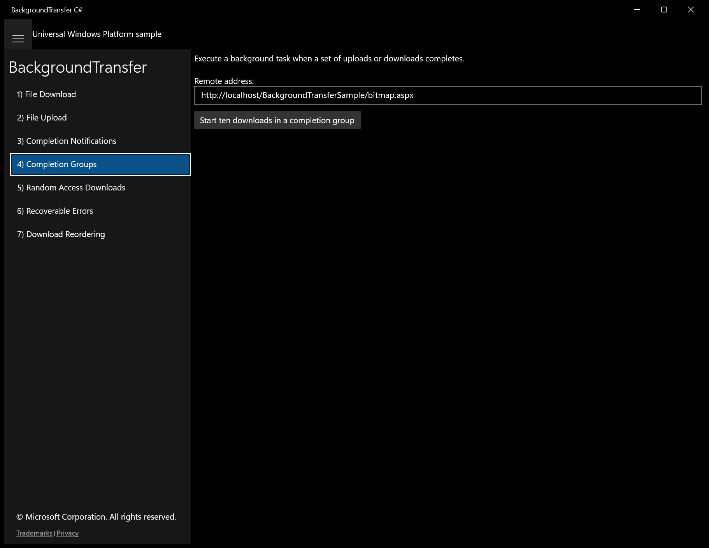

After click **Start ten downloads in a completion group**:

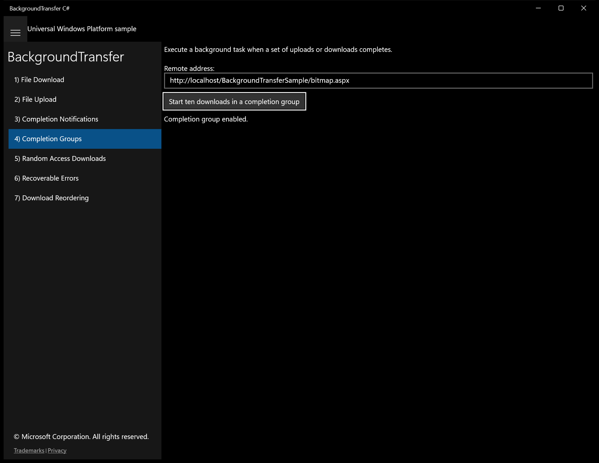

---

## Scenario 5 - Random Access Downloads

### UI elements
- **TextBlock**  - text="Description:"
- **TextBlock**  - text="Random Access Downloads"
- **TextBlock**  - x:Name="inputTextBlock1"
- **TextBlock**  - text="Remote address: "
- **TextBox**  - x:Name="serverAddressField"; text="http://localhost/BackgroundTransferSample/randomAccess.aspx"
- **TextBlock**  - text="Local file name: "
- **TextBox**  - x:Name="fileNameField"; text="RandomAccessFile.txt"
- **Button**  - x:Name="startDownloadButton"; content="Start"; events: Click=StartDownload_Click
- **Button**  - x:Name="pauseDownloadButton"; content="Pause"; events: Click=PauseDownload_Click
- **Button**  - x:Name="resumeDownloadButton"; content="Resume"; events: Click=ResumeDownload_Click
- **Slider**  - x:Name="seekSlider"
- **TextBlock**  - text="{Binding ElementName=seekSlider, Path=Value}"
- **Button**  - x:Name="seekDownloadButton"; content="Seek"; events: Click=SeekDownload_Click
- **Slider**  - x:Name="currentPositionSlider"
- **TextBlock**  - text="{Binding ElementName=currentPositionSlider, Path=Value, Mode=OneWay}"
- **TextBlock**  - x:Name="DownloadedInfoText"
- **TextBlock**  - text="Download status:"
- **TextBlock**  - text="Downloaded ranges:"
- **TextBlock**  - text="Previous read operation:"
- **TextBlock**  - text="Current read operation:"

### Code behavior
- **`OnNavigatedTo`**
    - API refs: `ActivationKind.Launch`
- **`CancelActiveDownloadsAsync`**
    - instantiates: `CancellationTokenSource`
    - API refs: `BackgroundDownloader.GetCurrentDownloadsAsync`, `Task.WhenAll`, `NotifyType.StatusMessage`
- **`OnDownloadProgress`**
    - API refs: `DownloadOperation.Progress`, `Dispatcher.RunAsync`, `CoreDispatcherPriority.Normal`, `DownloadedStatusText.Text`
- **`OnRangesDownloaded`**
    - API refs: `Dispatcher.RunAsync`, `CoreDispatcherPriority.Normal`, `DownloadedRangesText.Text`, `NotifyType.StatusMessage`
- **`StartDownload_Click`**
    - instantiates: `BackgroundDownloader`
    - API refs: `DownloadedInfoText.Text`, `DownloadedStatusText.Text`, `DownloadedRangesText.Text`, `PreviousReadText.Text`, `CurrentReadText.Text`, `Uri.TryCreate`, `Text.Trim`, `UriKind.Absolute`, `NotifyType.ErrorMessage`, `KnownFolders.GetFolderForUserAsync`, `KnownFolderId.PicturesLibrary`, `CreationCollisionOption.GenerateUniqueName`
- **`StartDownloadAndReadContentsAsync`**
    - namespaces: `Windows.Media.Playback.MediaPlayer`, `Windows.Media.Core.MediaSource.CreateFromStream`, `Windows.Storage.Streams.Buffer`
    - instantiates: `Windows.Media.Playback.MediaPlayer`, `Windows.Storage.Streams.Buffer`
    - API refs: `Windows.Media`, `Playback.MediaPlayer`, `Core.MediaSource`, `WebErrorStatus.InsufficientRangeSupport`, `WebErrorStatus.MissingContentLengthSupport`, `Windows.Storage`, `Streams.Buffer`, `PreviousReadText.Text`, `CurrentReadText.Text`, `InputStreamOptions.None`, `NotifyType.StatusMessage`
- **`IsWebException`**
    - API refs: `BackgroundTransferError.GetStatus`, `WebErrorStatus.Unknown`, `NotifyType.ErrorMessage`

### Screenshots
Initial state:

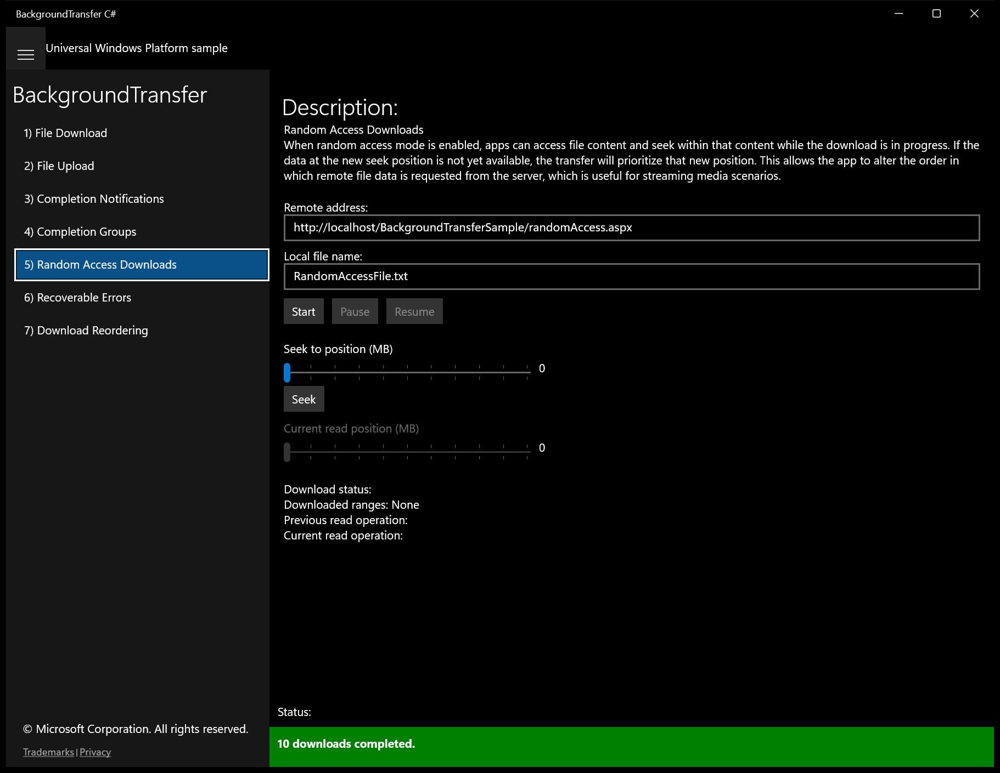

After click **Start**:

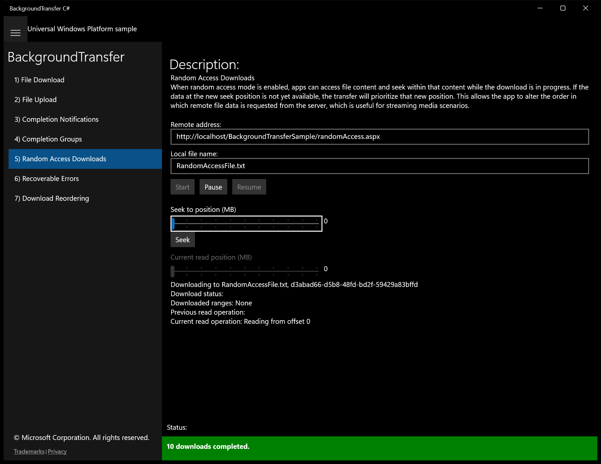

After click **Seek**:

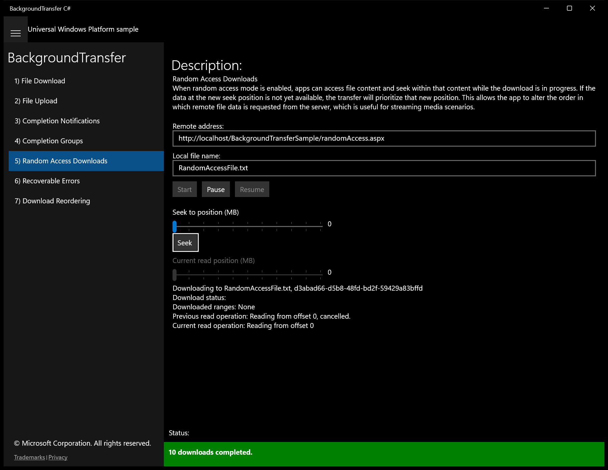

---

## Scenario 6 - Recoverable Errors

### UI elements
- **TextBlock**  - text="Description:"
- **TextBlock**  - text="Recoverable Errors"
- **TextBlock**  - text="The sample server provided with this sample provides a time-limited URL. If you check the box below, then when the URL expires, the app switches to different URL to continue downloading."
- **TextBlock**  - text="Remote address: "
- **TextBox**  - x:Name="serverAddressField"; text="http://localhost/BackgroundTransferSample/recoverableErrors.aspx?shouldExpire=yes"
- **TextBlock**  - text="Local file name: "
- **TextBox**  - x:Name="fileNameField"; text="RecoverableErrorsFile.txt"
- **CheckBox**  - x:Name="configureRecoverableErrorsCheckBox"; content="Recover from expired URL"
- **Button**  - x:Name="startDownloadButton"; content="Start"; events: Click=StartDownload_Click
- **TextBlock**  - x:Name="DownloadedInfoText"
- **TextBlock**  - text="Download status:"
- **TextBlock**  - text="The download URL has expired. Enter a new authorization code to resume the download."

### Code behavior
- **`OnNavigatedTo`**
    - API refs: `ActivationKind.Launch`
- **`CancelActiveDownloadsAsync`**
    - instantiates: `CancellationTokenSource`
    - API refs: `BackgroundDownloader.GetCurrentDownloadsAsync`, `Task.WhenAll`, `NotifyType.StatusMessage`
- **`OnDownloadProgress`**
    - instantiates: `Uri`, `CancellationTokenSource`
    - API refs: `DownloadOperation.Progress`, `Dispatcher.RunAsync`, `CoreDispatcherPriority.Normal`, `DownloadedStatusText.Text`, `NotifyType.StatusMessage`, `BackgroundTransferStatus.PausedRecoverableWebErrorStatus`, `WebErrorStatus.Forbidden`, `System.Diagnostics`, `Debug.Assert`, `NotifyType.ErrorMessage`, `ReauthorizeDialog.ShowAsync`, `ContentDialogResult.Primary`, `RequestedUri.OriginalString`
- **`StartDownload_Click`**
    - instantiates: `BackgroundDownloader`
    - API refs: `DownloadedInfoText.Text`, `DownloadedStatusText.Text`, `NotifyType.StatusMessage`, `Uri.TryCreate`, `Text.Trim`, `UriKind.Absolute`, `NotifyType.ErrorMessage`, `KnownFolders.GetFolderForUserAsync`, `KnownFolderId.PicturesLibrary`, `CreationCollisionOption.GenerateUniqueName`, `IsChecked.Value`, `WebErrorStatus.Forbidden`, `RecoverableWebErrorStatuses.Add`
- **`HandleDownloadAsync`**
    - API refs: `NotifyType.StatusMessage`
- **`IsWebException`**
    - API refs: `BackgroundTransferError.GetStatus`, `WebErrorStatus.Unknown`, `NotifyType.ErrorMessage`

### Screenshots
Initial state:

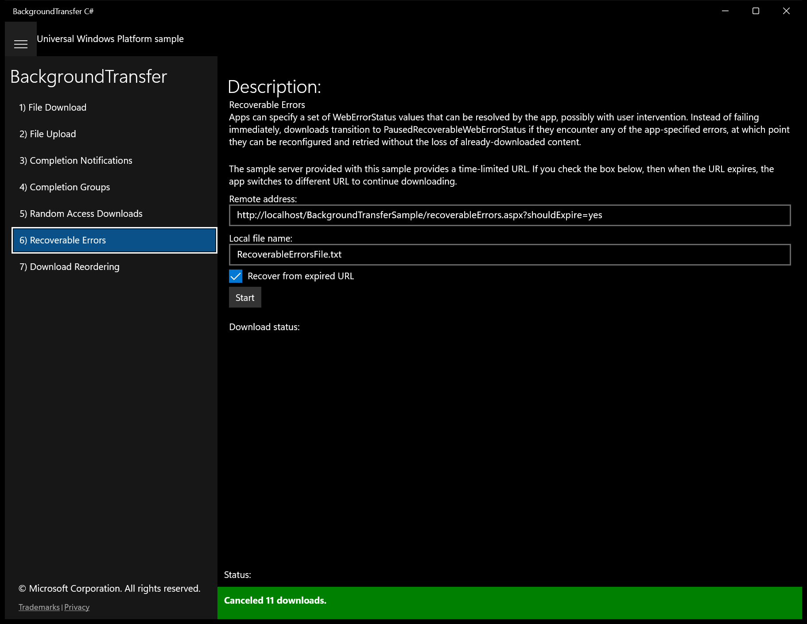

After click **Start**:

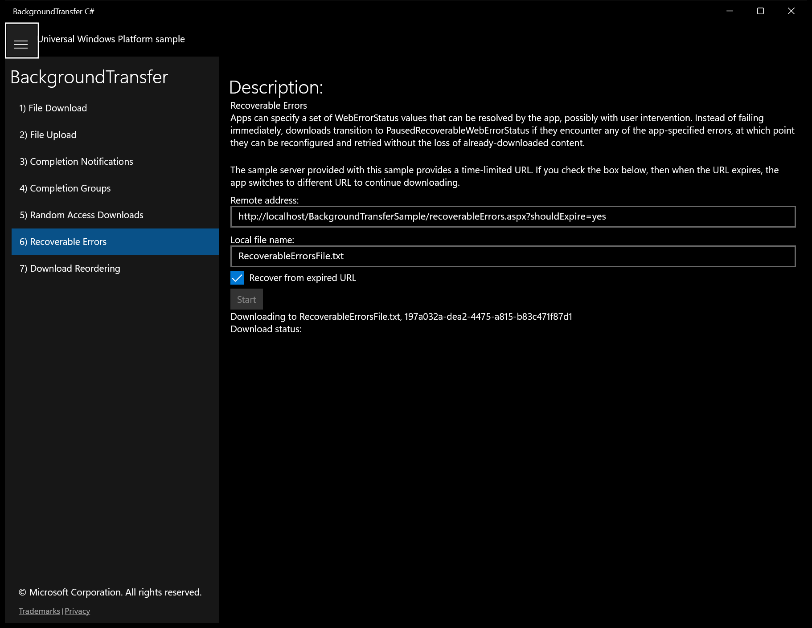

---

## Scenario 7 - Download Reordering

### UI elements
- **TextBlock**  - x:Name="InputTextBlock1"; text="Transfers which belong to the same transfer group can be reordered after they have been started."
- **TextBlock**  - text="Remote address: "
- **TextBox**  - x:Name="remoteAddressField"; text="http://localhost/BackgroundTransferSample/download.aspx"
- **TextBlock**  - text="Local file name: "
- **TextBox**  - x:Name="fileNameField"; text="DownloadReordering.txt"
- **Button**  - x:Name="startDownloadButton"; content="Start Download"; events: Click=StartDownload_Click
- **TextBlock**  - text="Select a pending transfer to reorder the downloads."
- **Button**  - content="Make Current"; events: Click=MakeCurrent_Click
- **TextBlock**  - text="{x:Bind stateText, Mode=OneWay}"

### Code behavior
- **`OnNavigatedTo`**
    - API refs: `MainPage.Current`
- **`CancelActiveDownloadsAsync`**
    - instantiates: `CancellationTokenSource`
    - API refs: `BackgroundDownloader.GetCurrentDownloadsForTransferGroupAsync`, `Task.WhenAll`
- **`RunDownloadsAsync`**
    - instantiates: `BackgroundDownloader`, `DownloadOperationItem`
    - API refs: `Uri.TryCreate`, `Text.Trim`, `UriKind.Absolute`, `NotifyType.ErrorMessage`, `Task.WhenAll`
- **`CreateDownload`**
    - instantiates: `Uri`
    - API refs: `KnownFolders.PicturesLibrary`, `CreationCollisionOption.GenerateUniqueName`, `NotifyType.ErrorMessage`
- **`DownloadAsync`**
    - instantiates: `Progress`
    - API refs: `Progress.Status`, `ResultFile.Name`, `NotifyType.StatusMessage`, `BackgroundTransferStatus.Canceled`
- **`DownloadProgress`**
    - API refs: `Dispatcher.RunAsync`, `CoreDispatcherPriority.Normal`
- **`IsWebException`**
    - API refs: `BackgroundTransferError.GetStatus`, `WebErrorStatus.Unknown`, `NotifyType.ErrorMessage`, `ResultFile.Name`

### Screenshots
Initial state:

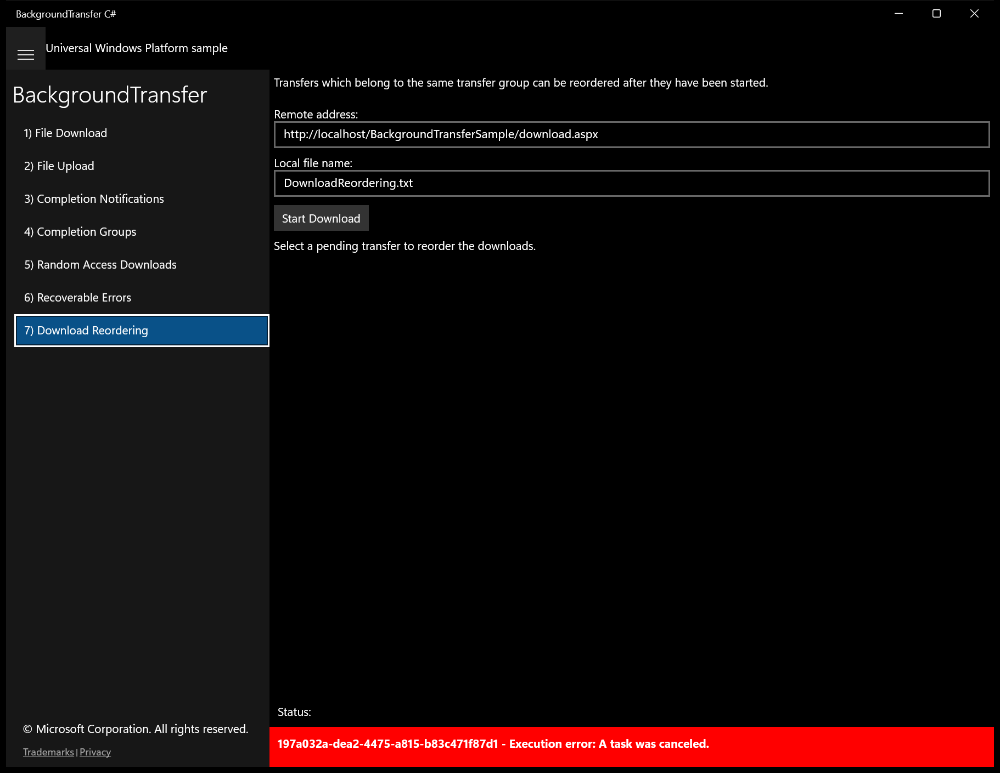

After click **Start Download**:

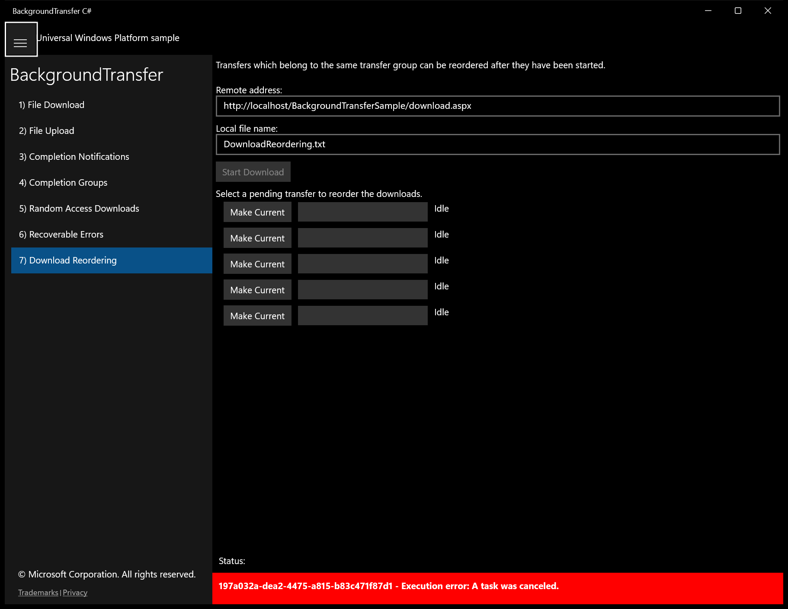

