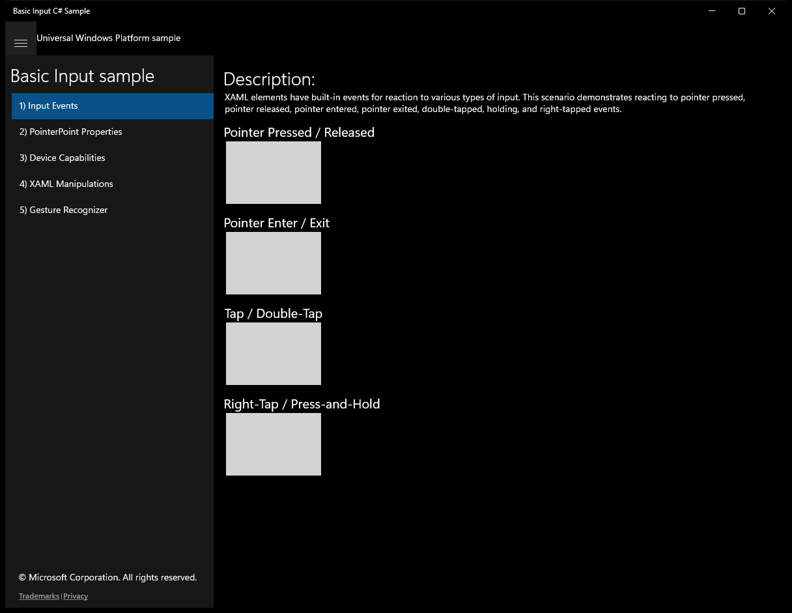
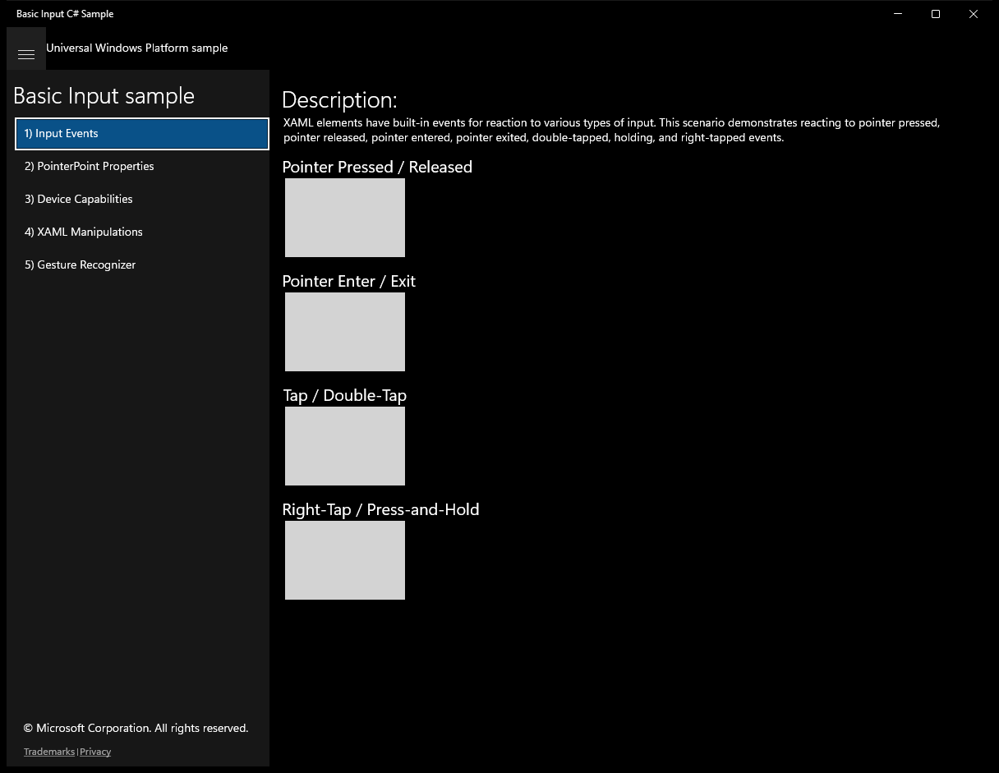
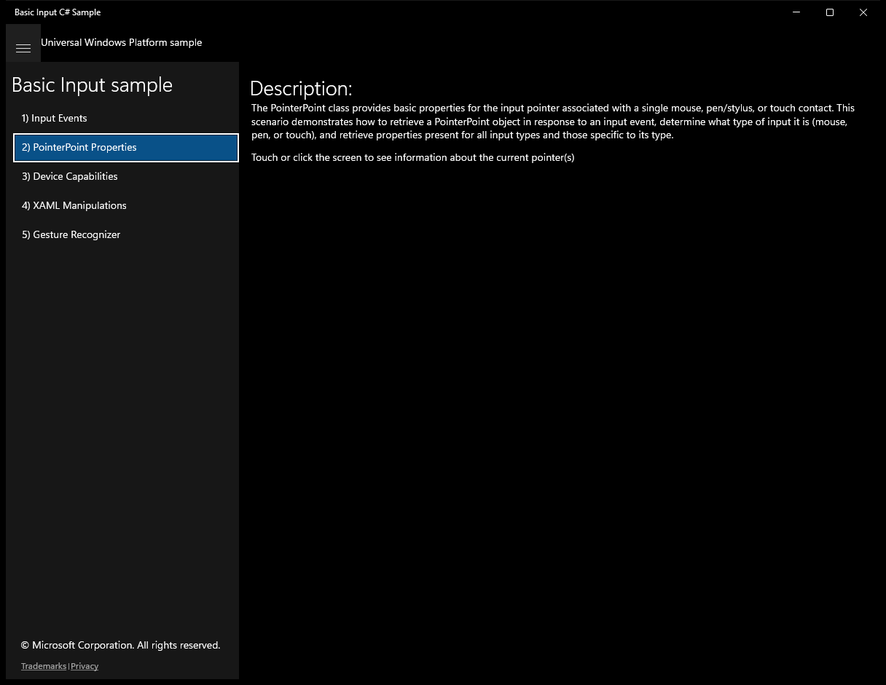
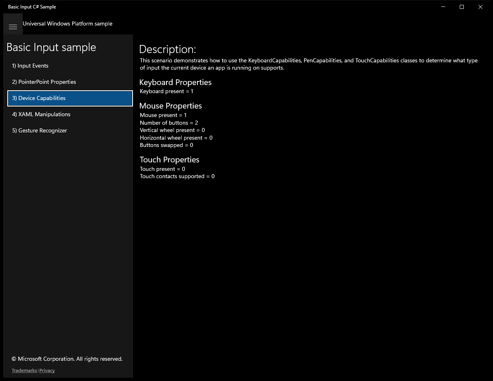
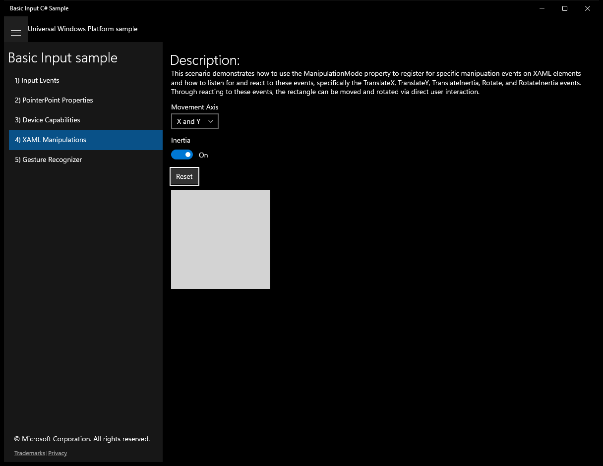
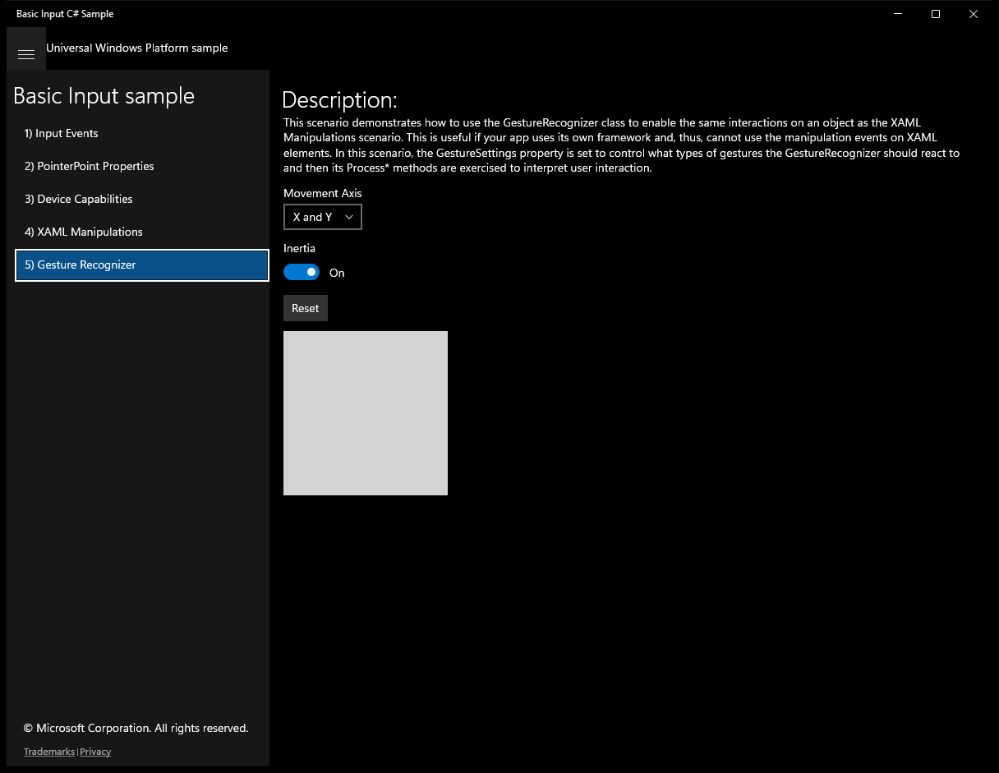

# BasicInput (C#)

> **Source**: `Samples\BasicInput\cs\`  
> **Feature**: Basic Input sample  
> **AUMID**: `Microsoft.SDKSamples.BasicInput.CS_8wekyb3d8bbwe!BasicInput.App`  
> **PackageFamilyName**: `Microsoft.SDKSamples.BasicInput.CS_8wekyb3d8bbwe`  

## Sample purpose
Shows how to handle user input in Universal Windows Platform (UWP) apps.

## Scenarios demonstrated (from README)
- **Listen for events on XAML elements:** Use events on XAML elements to listen for various types of input, such as pointer pressed / released, pointer enter / exited, tap / double-tap, and right-tap / press-and-hold.
- **Retrieve properties about a pointer object:** Use a PointerPoint object to retrieve information common to all pointers (such as X/Y coordinates) as well as information specific to the type of input being used (such as mouse wheel information).
- **Query input capabilities for the system:** Use the KeyboardCapabilities, MouseCapabilities, and TouchCapabilities classes to determine what types of input are available on the current system.
- **Manipulate a XAML element:** Use the ManipulationMode property to register for specific manipulation events on XAML elements and react to them in order to move and rotate the element.
- **Manipulate an object using a GestureRecognizer:** Use an instance of a GestureRecognizer to move and rotate an object. This is useful if your app uses its own framework and, thus, cannot use the manipulation events on XAML elements.

## Build / deploy / capture status
- build: skipped
- deploy: ok
- launch: ok
- capture: ok
- uninstall: ok

## Main page

---

## Scenario 1 - 1) Input Events

### Screenshots
Initial state:

---

## Scenario 2 - 2) PointerPoint Properties

### Screenshots
Initial state:

---

## Scenario 3 - 3) Device Capabilities

### Screenshots
Initial state:

---

## Scenario 4 - 4) XAML Manipulations

### Screenshots
Initial state:

> Button **Inertia** skipped (invoke_failed)

After click **Reset**:

---

## Scenario 5 - 5) Gesture Recognizer

### Screenshots
Initial state:

> Button **Inertia** skipped (invoke_failed)

After click **Reset**:

