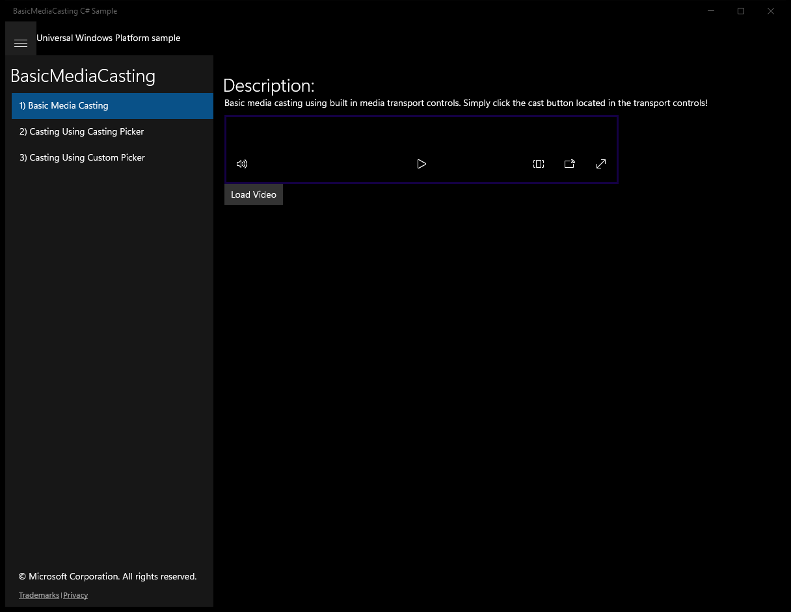
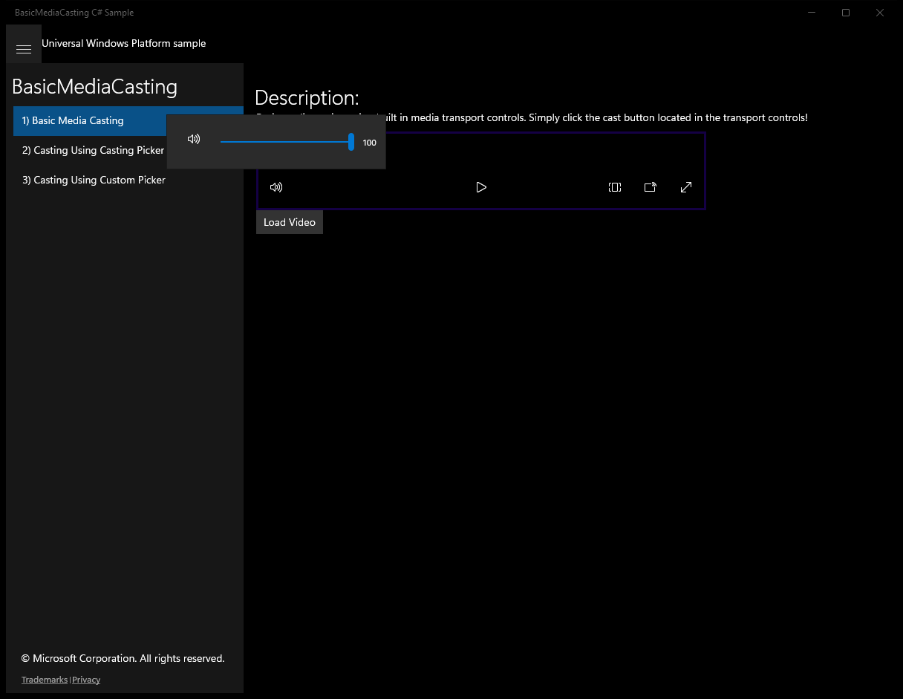
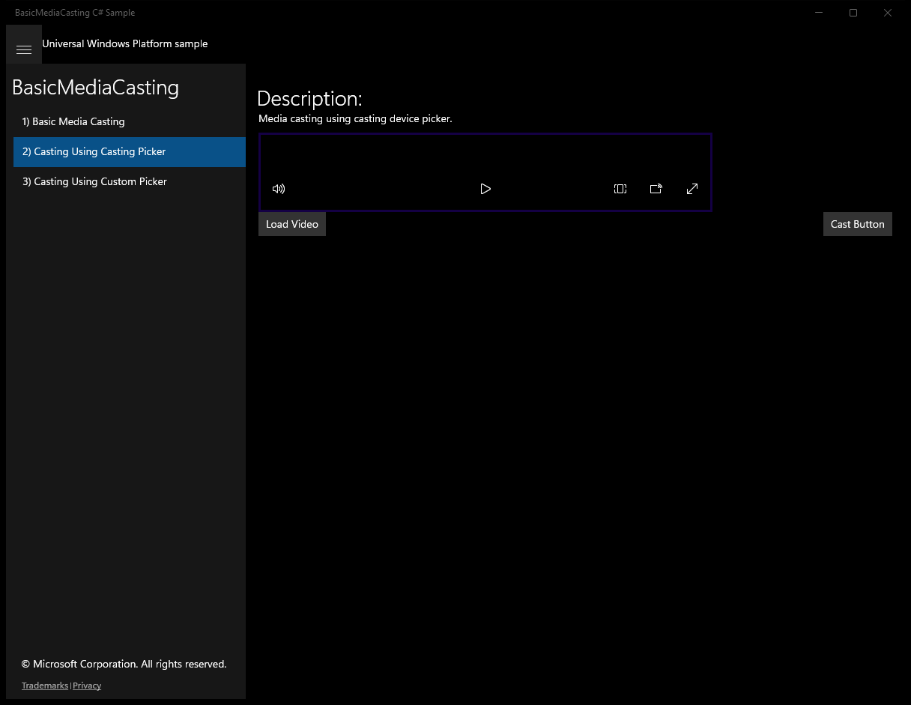
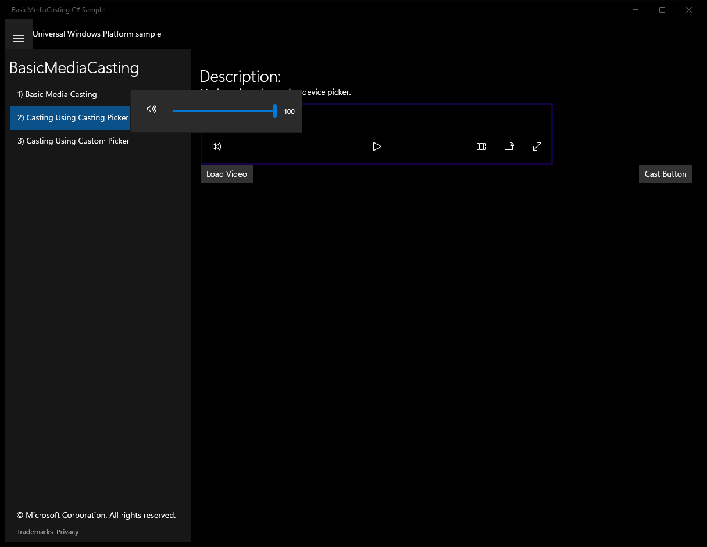
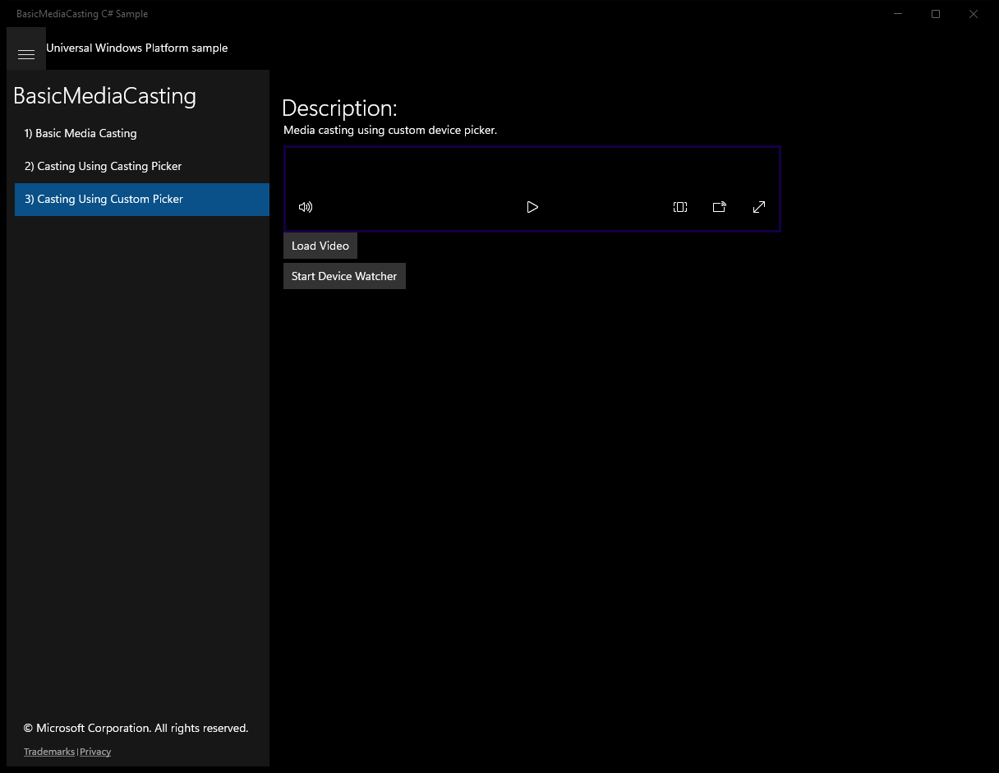
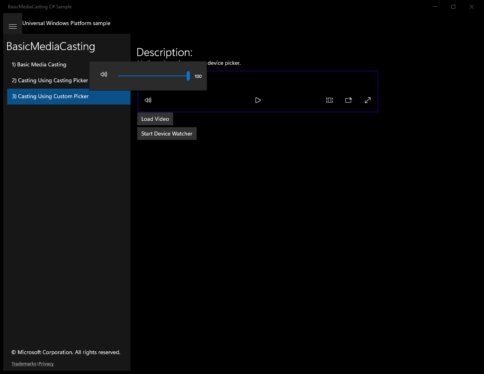

# BasicMediaCasting (C#)

> **Source**: `Samples\BasicMediaCasting\cs\`  
> **Feature**: BasicMediaCasting  
> **AUMID**: `Microsoft.SDKSamples.BasicMediaCasting.CS_8wekyb3d8bbwe!BasicMediaCasting.App`  
> **PackageFamilyName**: `Microsoft.SDKSamples.BasicMediaCasting.CS_8wekyb3d8bbwe`  

## Top-level UWP namespaces used
- `Windows.UI.Core.CoreDispatcherPriority.Normal`

## Build / deploy / capture status
- build: ok
- deploy: ok
- launch: ok
- capture: ok
- uninstall: ok

## Main page

---

## Scenario 1 - Scenario1_BuiltInCasting

**Description**: Basic media casting using built in media transport controls. Simply click the cast button located in the transport controls!

### UI elements
- **TextBlock**  - text="Description:"
- **TextBlock**  - text="Basic media casting using built in media transport controls. Simply click the cast button located in the transport controls!"
- **MediaElement**  - name="video"
- **Button**  - name="loadButton"; content="Load Video"; events: Click=loadButton_Click
- **TextBlock**  - x:Name="StatusBlock"

### Code behavior
- **`OnNavigatedTo`**
    - API refs: `MainPage.Current`

### Screenshots
Initial state:

After click **Volume**:

After click **Play**:

After click **Aspect Ratio**:

---

## Scenario 2 - Scenario2_CastingDevicePicker

**Description**: Media casting using casting device picker.

### UI elements
- **TextBlock**  - text="Description:"
- **TextBlock**  - text="Media casting using casting device picker."
- **MediaElement**  - name="video"
- **Button**  - name="loadButton"; content="Load Video"; events: Click=loadButton_Click
- **Button**  - name="castButton"; content="Cast Button"; events: Click=castButton_Click
- **TextBlock**  - x:Name="StatusBlock"

### Code behavior
- **`Scenario2`**
    - instantiates: `CastingDevicePicker`
    - API refs: `Filter.SupportsVideo`
- **`OnNavigatedTo`**
    - API refs: `MainPage.Current`
- **`Picker_CastingDeviceSelected`**
    - namespaces: `Windows.UI.Core.CoreDispatcherPriority.Normal`
    - API refs: `Dispatcher.RunAsync`, `Windows.UI`, `Core.CoreDispatcherPriority`, `SelectedCastingDevice.CreateCastingConnection`
- **`Connection_StateChanged`**
    - namespaces: `Windows.UI.Core.CoreDispatcherPriority.Normal`
    - API refs: `Dispatcher.RunAsync`, `Windows.UI`, `Core.CoreDispatcherPriority`, `NotifyType.StatusMessage`
- **`Connection_ErrorOccurred`**
    - namespaces: `Windows.UI.Core.CoreDispatcherPriority.Normal`
    - API refs: `Dispatcher.RunAsync`, `Windows.UI`, `Core.CoreDispatcherPriority`, `NotifyType.ErrorMessage`

### Screenshots
Initial state:

After click **Volume**:

After click **Play**:

After click **Aspect Ratio**:

---

## Scenario 3 - Scenario3_CustomPicker

**Description**: Media casting using custom device picker.

### UI elements
- **TextBlock**  - text="Description:"
- **TextBlock**  - text="Media casting using custom device picker."
- **MediaElement**  - x:Name="video"
- **Button**  - x:Name="loadButton"; content="Load Video"; events: Click=loadButton_Click
- **Button**  - name="disconnectButton"; content="Disconnect"; events: Click=disconnectButton_Click
- **Button**  - x:Name="watcherControlButton"; content="Start Device Watcher"; events: Click=watcherControlButton_Click
- **ProgressRing**  - x:Name="progressRing"
- **TextBlock**  - x:Name="progressText"
- **ListBox**  - x:Name="castingDevicesList"; events: SelectionChanged=castingDevicesList_SelectionChanged
- **TextBlock**  - text="{Binding Path=FriendlyName}"
- **TextBlock**  - x:Name="StatusBlock"

### Code behavior
- **`Scenario3`**
    - API refs: `DeviceInformation.CreateWatcher`, `CastingDevice.GetDeviceSelector`, `CastingPlaybackTypes.Video`
- **`OnNavigatedTo`**
    - API refs: `MainPage.Current`
- **`Watcher_Added`**
    - namespaces: `Windows.UI.Core.CoreDispatcherPriority.Normal`
    - API refs: `Dispatcher.RunAsync`, `Windows.UI`, `Core.CoreDispatcherPriority`, `CastingDevice.FromIdAsync`, `Items.Add`
- **`Watcher_Removed`**
    - namespaces: `Windows.UI.Core.CoreDispatcherPriority.Normal`
    - API refs: `Dispatcher.RunAsync`, `Windows.UI`, `Core.CoreDispatcherPriority`, `Items.Remove`
- **`Watcher_EnumerationCompleted`**
    - namespaces: `Windows.UI.Core.CoreDispatcherPriority.Normal`
    - API refs: `Dispatcher.RunAsync`, `Windows.UI`, `Core.CoreDispatcherPriority`, `NotifyType.StatusMessage`
- **`Watcher_Stopped`**
    - namespaces: `Windows.UI.Core.CoreDispatcherPriority.Normal`
    - API refs: `Dispatcher.RunAsync`, `Windows.UI`, `Core.CoreDispatcherPriority`, `NotifyType.StatusMessage`
- **`Connection_StateChanged`**
    - namespaces: `Windows.UI.Core.CoreDispatcherPriority.Normal`
    - API refs: `Dispatcher.RunAsync`, `Windows.UI`, `Core.CoreDispatcherPriority`, `CastingConnectionState.Connected`, `CastingConnectionState.Rendering`, `Visibility.Visible`, `CastingConnectionState.Disconnected`, `Visibility.Collapsed`, `CastingConnectionState.Connecting`
- **`Connection_ErrorOccurred`**
    - namespaces: `Windows.UI.Core.CoreDispatcherPriority.Normal`
    - API refs: `Dispatcher.RunAsync`, `Windows.UI`, `Core.CoreDispatcherPriority`, `NotifyType.ErrorMessage`

### Screenshots
Initial state:

After click **Volume**:

After click **Play**:

After click **Aspect Ratio**:

