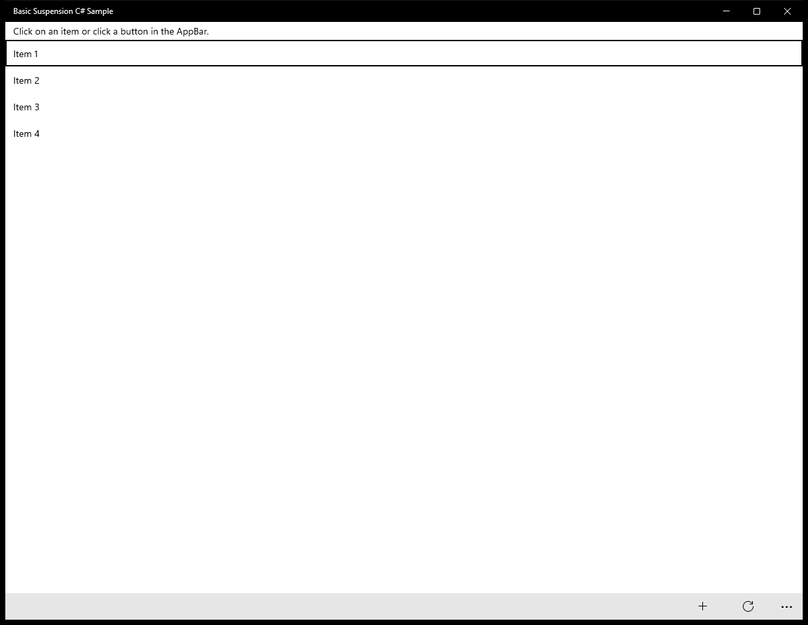
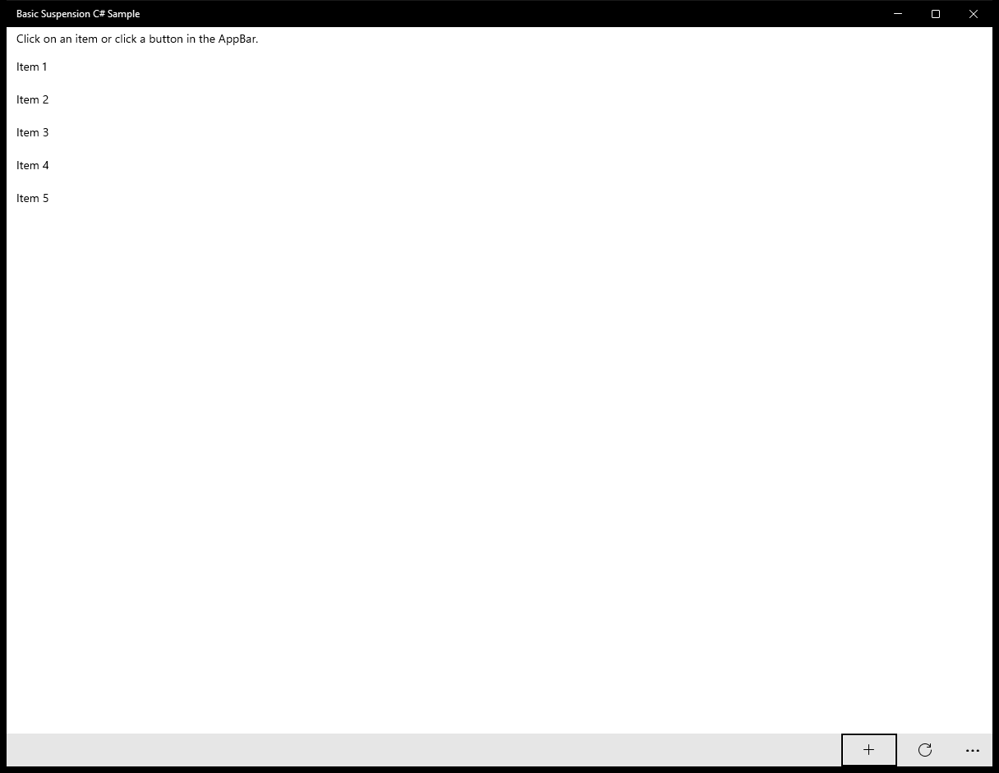
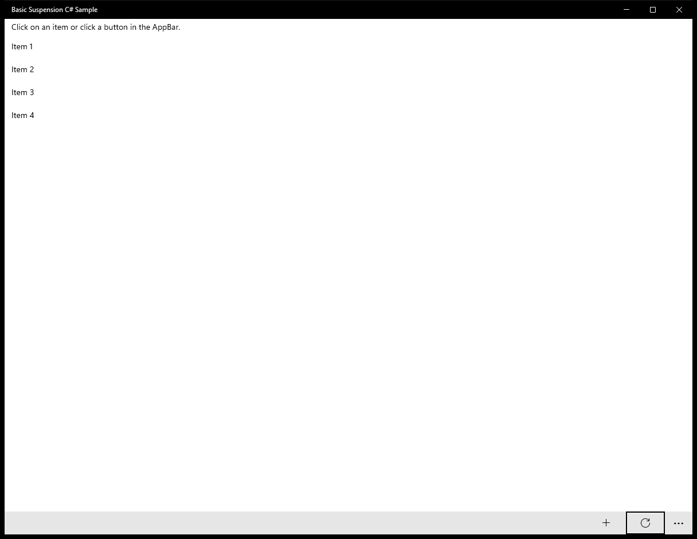
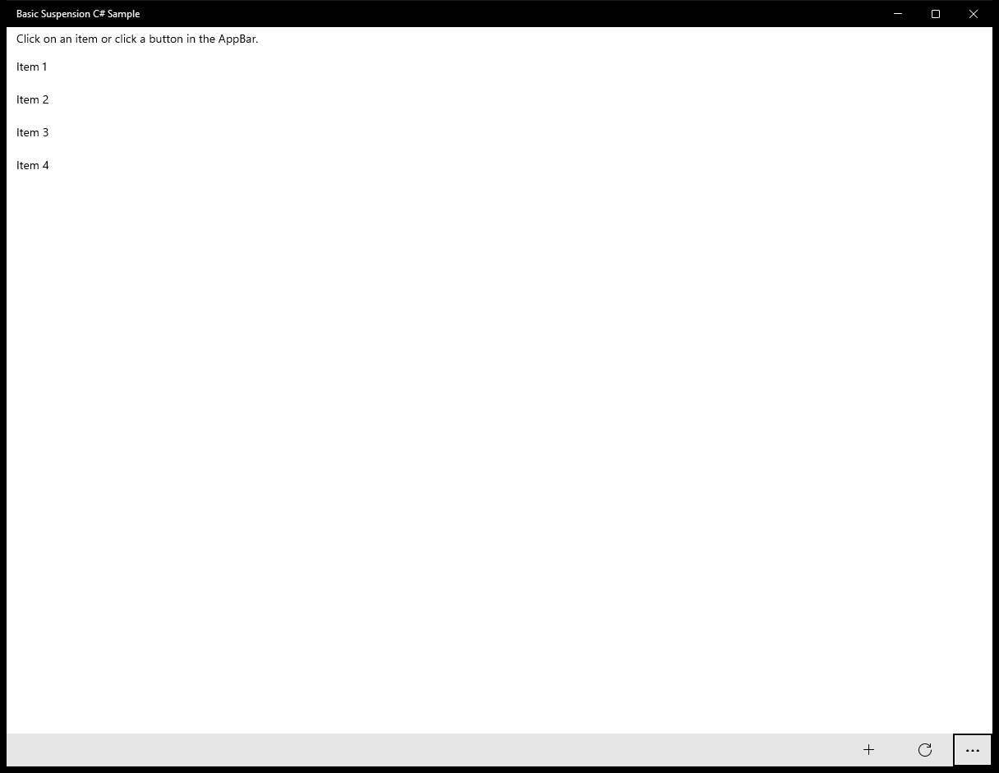

# BasicSuspension (C#)

> **Source**: `Samples\BasicSuspension\cs\`  
> **AUMID**: `Microsoft.SDKSamples.BasicSuspension.CS_8wekyb3d8bbwe!App`  
> **PackageFamilyName**: `Microsoft.SDKSamples.BasicSuspension.CS_8wekyb3d8bbwe`  

## Sample purpose
Shows how to suspend, shut down and resume your application using the Suspension Manager.

## Scenarios demonstrated (from README)
- Saving state when the app is suspended or shut down.
- Restoring state when the app is resumed from suspension or reactivated after being shut down.

## Build / deploy / capture status
- build: skipped
- deploy: ok
- launch: ok
- capture: ok-generic
- uninstall: ok

## Main page

---

## MainPage (generic)

This sample did not expose a standard scenario list. Captures below come from a generic enumeration of buttons / list items / hyperlinks on the main page.

### Interaction captures
Initial state:

After click **Button: add**:

After click **Button: reset**:

After click **Button: More app bar**:

> Button **ListItem: Item 1** skipped (invoke_failed)

> Button **ListItem: Item 2** skipped (invoke_failed)

> Button **ListItem: Item 3** skipped (invoke_failed)

> Button **ListItem: Item 4** skipped (invoke_failed)

---

## MainPage (static analysis)

This sample is a single-page app (no scenario list). The MainPage covers the entire functionality.

### UI elements
- **ListView**  - x:Name="list"; events: ItemClick=ListView_ItemClick
- **TextBlock**  - text="{Binding}"
- **AppBarButton**  - events: Click={x:Bind AddItem}
- **AppBarButton**  - events: Click={x:Bind ResetItems}

### Code behavior
- **`MainPage`**
    - instantiates: `NavigationHelper`, `ItemList`
    - API refs: `NavigationCacheMode.Required`
- **`ListView_ItemClick`**
    - API refs: `Frame.Navigate`, `ClickedItem.ToString`
- **`ResetItems`**
    - API refs: `ItemList.CreateDefaultItemList`
- **`NavigationHelper_Load`**
    - API refs: `SuspensionManager.SessionState`, `ItemList.CreateDefaultItemList`
- **`NavigationHelper_Save`**
    - API refs: `SuspensionManager.SessionState`
- **`OnNavigatedTo`**
    - API refs: `SystemNavigationManager.GetForCurrentView`, `Frame.CanGoBack`, `AppViewBackButtonVisibility.Visible`, `AppViewBackButtonVisibility.Collapsed`

