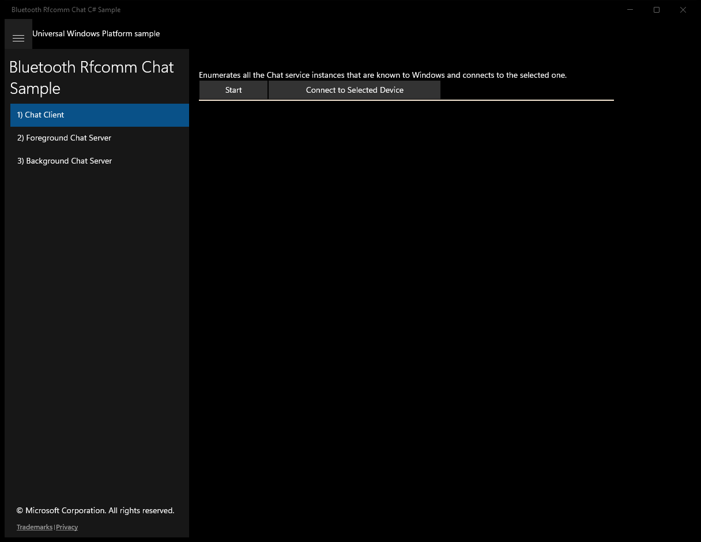
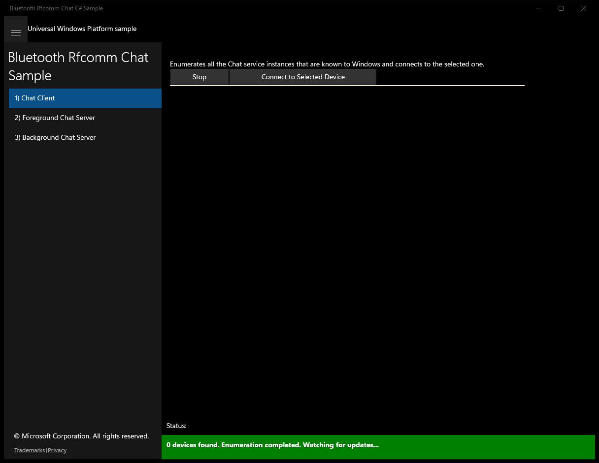
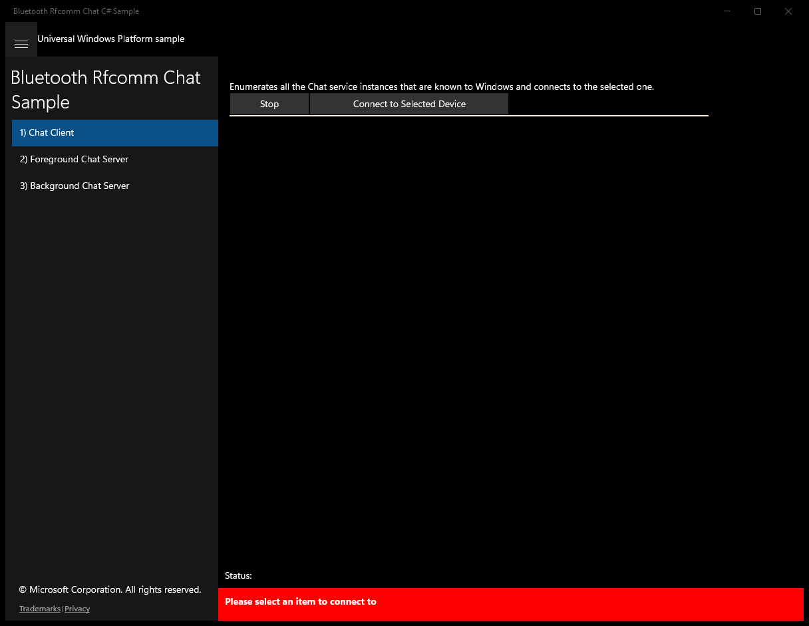
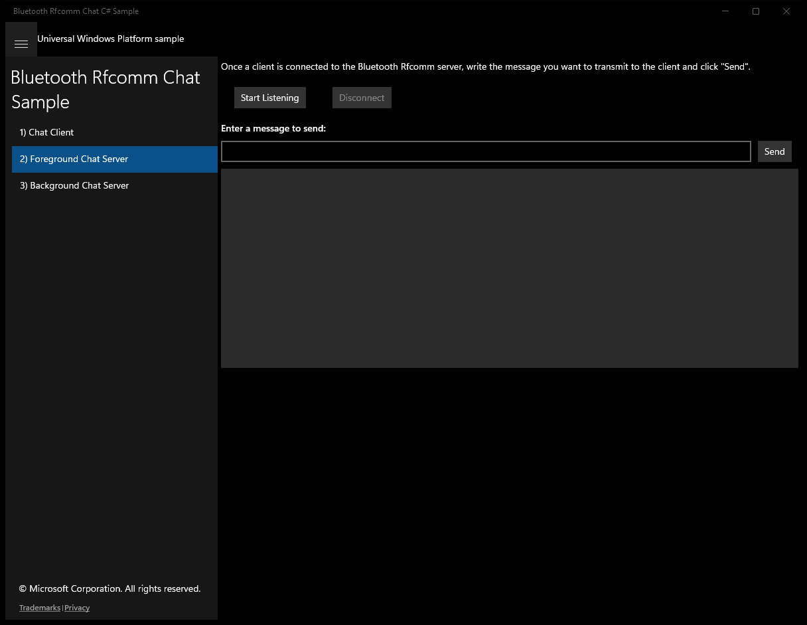
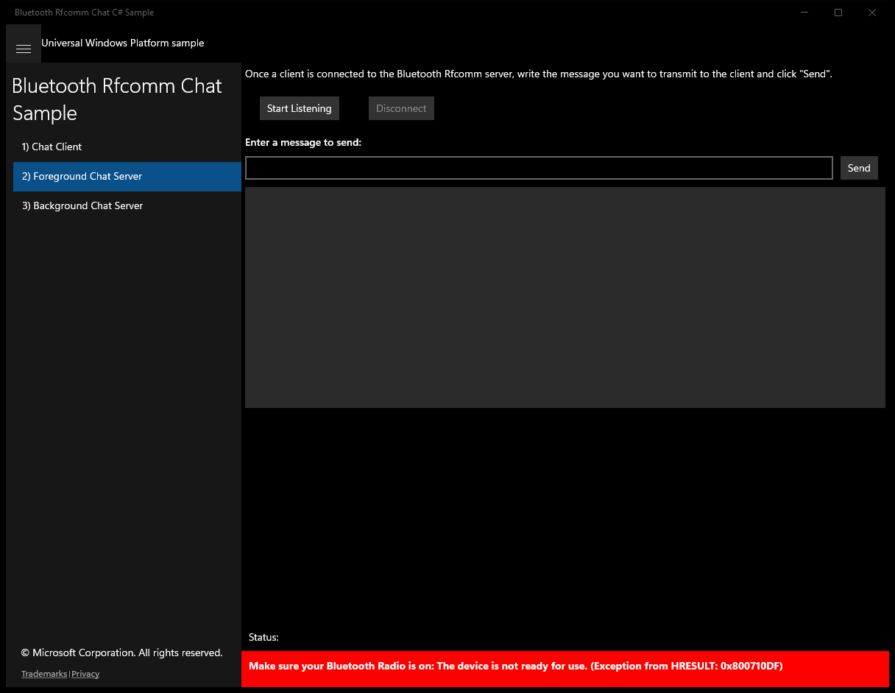
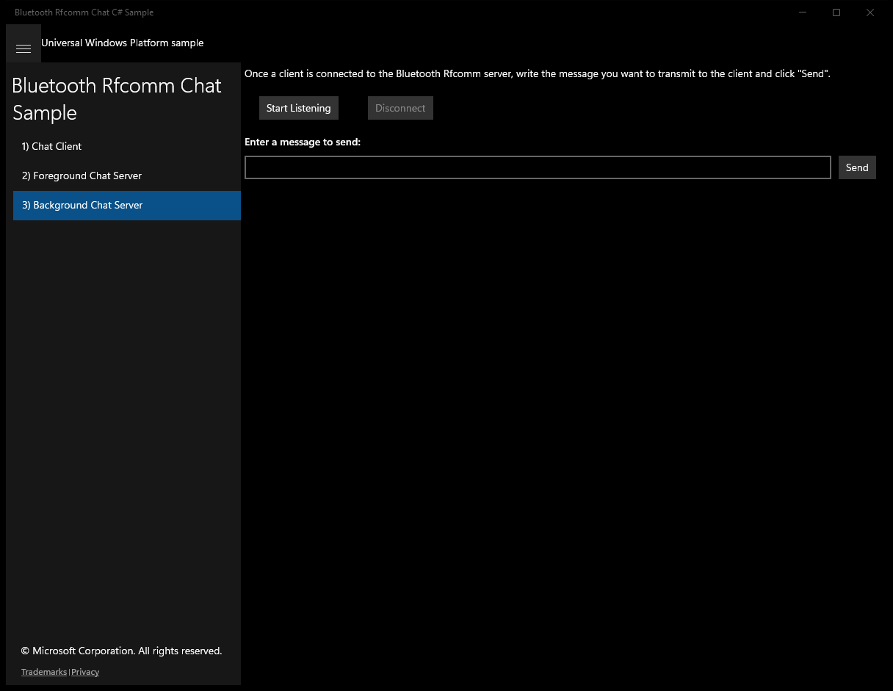
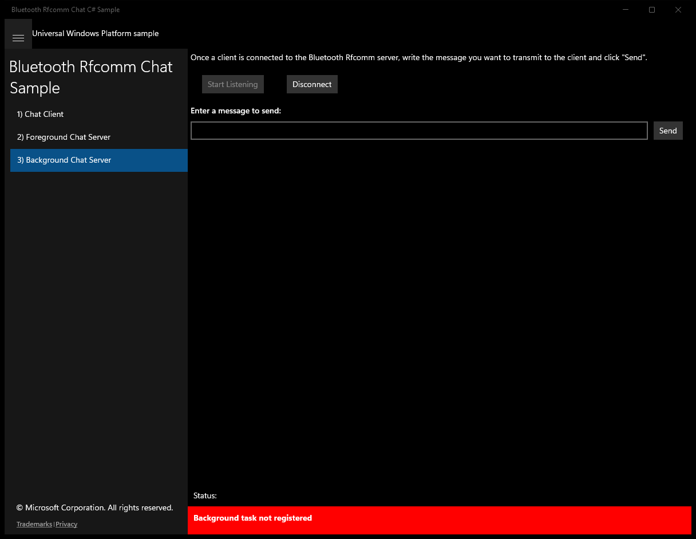
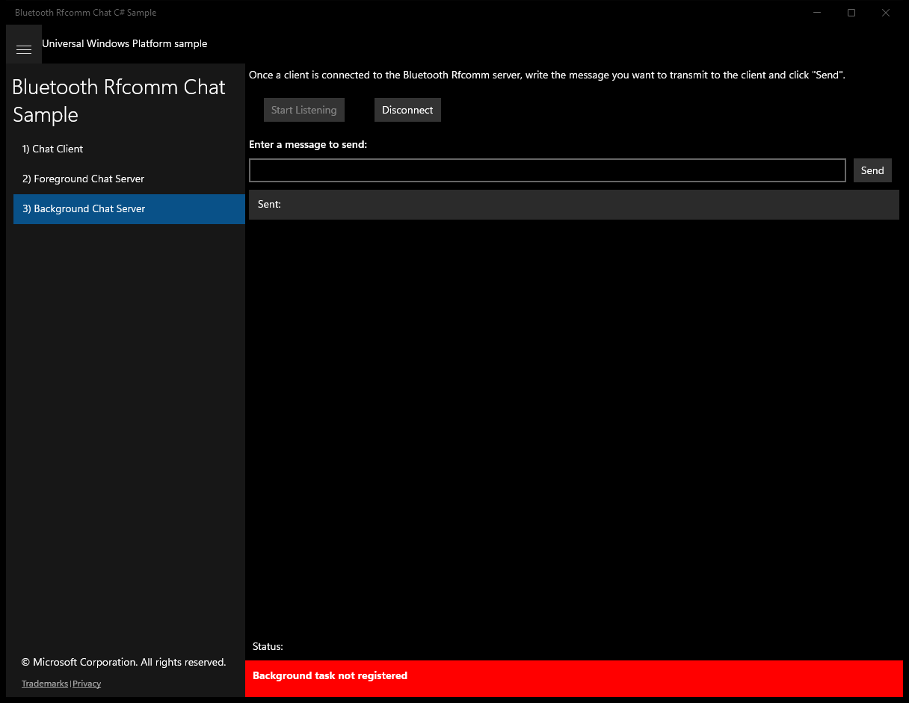

# BluetoothRfcommChat (C#)

> **Source**: `Samples\BluetoothRfcommChat\cs\`  
> **Feature**: Bluetooth Rfcomm Chat Sample  
> **AUMID**: `Microsoft.SDKSamples.RfcommChatSampleCS.CS_8wekyb3d8bbwe!App`  
> **PackageFamilyName**: `Microsoft.SDKSamples.RfcommChatSampleCS.CS_8wekyb3d8bbwe`  

## Top-level UWP namespaces used
- `Windows.System.VirtualKey.Enter`
- `Windows.Storage.Streams.UnicodeEncoding.Utf8`
- `Windows.UI.Core.CoreDispatcherPriority.Normal`

## Build / deploy / capture status
- build: ok
- deploy: ok
- launch: ok
- capture: ok
- uninstall: ok

## Main page

---

## Scenario 1 - Chat Client

**Description**: Enumerates all the Chat service instances that are known to Windows and connects to the selected one.

### UI elements
- **TextBlock**  - text="Name:"
- **TextBlock**  - text="{Binding Path=Name}"
- **TextBlock**  - text="Enumerates all the Chat service instances that are known to Windows and connects to the selected one."
- **Button**  - x:Name="RunButton"; content="Start"; events: Click=RunButton_Click
- **Button**  - x:Name="ConnectButton"; content="Connect to Selected Device"; events: Click=ConnectButton_Click
- **Button**  - x:Name="RequestAccessButton"; content="Request Access to Trusted Device"; events: Click=RequestAccessButton_Click
- **ListView**  - x:Name="resultsListView"; events: SelectionChanged=ResultsListView_SelectionChanged
- **TextBlock**  - x:Name="DeviceName"; text="Connected to: "
- **TextBlock**  - x:Name="ServiceName"; text="Current Service Name"
- **Button**  - x:Name="DisconnectButton"; content="Disconnect"; events: Click=DisconnectButton_Click
- **TextBlock**  - text="Enter a message to send:"
- **TextBox**  - x:Name="MessageTextBox"; events: KeyDown=KeyboardKey_Pressed
- **Button**  - x:Name="SendButton"; content="Send"; events: Click=SendButton_Click
- **ListBox**  - x:Name="ConversationList"

### Code behavior
- **`OnNavigatedTo`**
    - instantiates: `ObservableCollection`
    - API refs: `MainPage.Current`
- **`StopWatcher`**
    - API refs: `DeviceWatcherStatus.Started`, `DeviceWatcherStatus.EnumerationCompleted`
- **`SetDeviceWatcherUI`**
    - API refs: `RunButton.Content`, `NotifyType.StatusMessage`, `Visibility.Visible`
- **`ResetMainUI`**
    - API refs: `RunButton.Content`, `RunButton.IsEnabled`, `ConnectButton.Visibility`, `Visibility.Visible`, `ChatBox.Visibility`, `Visibility.Collapsed`, `RequestAccessButton.Visibility`, `ConversationList.Items`
- **`StartUnpairedDeviceWatcher`**
    - instantiates: `TypedEventHandler`, `RfcommChatDeviceDisplay`
    - API refs: `System.Devices`, `Aep.DeviceAddress`, `Aep.IsConnected`, `DeviceInformation.CreateWatcher`, `Aep.ProtocolId`, `DeviceInformationKind.AssociationEndpoint`, `Dispatcher.RunAsync`, `CoreDispatcherPriority.Normal`, `ResultCollection.Add`, `String.Format`, `ResultCollection.Count`, `NotifyType.StatusMessage`, `CoreDispatcherPriority.Low`, `ResultCollection.Remove`, `ResultCollection.Clear`
- **`ConnectButton_Click`**
    - instantiates: `StreamSocket`, `DataWriter`, `DataReader`
    - API refs: `NotifyType.StatusMessage`, `NotifyType.ErrorMessage`, `DeviceAccessInformation.CreateFromId`, `DeviceAccessStatus.DeniedByUser`, `BluetoothDevice.FromIdAsync`, `RfcommServiceId.FromUuid`, `Constants.RfcommChatServiceUuid`, `BluetoothCacheMode.Uncached`, `Services.Count`, `Constants.SdpServiceNameAttributeId`, `DataReader.FromBuffer`, `Constants.SdpServiceNameAttributeType`, `UnicodeEncoding.Utf8`
- **`RequestAccessButton_Click`**
    - API refs: `DeviceAccessStatus.Allowed`, `NotifyType.StatusMessage`
- **`KeyboardKey_Pressed`**
    - namespaces: `Windows.System.VirtualKey.Enter`
    - API refs: `Windows.System`, `VirtualKey.Enter`
- **`SendMessage`**
    - API refs: `MessageTextBox.Text`, `ConversationList.Items`, `HResult.ToString`, `NotifyType.StatusMessage`
    - updates UI: `MessageTextBox.Text`
- **`ReceiveStringLoop`**
    - API refs: `ConversationList.Items`, `NotifyType.StatusMessage`
- **`Disconnect`**
    - API refs: `NotifyType.StatusMessage`
- **`SetChatUI`**
    - API refs: `NotifyType.StatusMessage`, `ServiceName.Text`, `DeviceName.Text`, `RunButton.IsEnabled`, `ConnectButton.Visibility`, `Visibility.Collapsed`, `RequestAccessButton.Visibility`, `Visibility.Visible`, `ChatBox.Visibility`
- **`UpdatePairingButtons`**
    - API refs: `ConnectButton.IsEnabled`

### Screenshots
Initial state:

After click **Start**:

After click **Connect to Selected Device**:

---

## Scenario 2 - Foreground Chat Server

### UI elements
- **TextBlock**  - x:Name="InputTextBlock1"; text="Once a client is connected to the Bluetooth Rfcomm server, write the message you want to transmit to the client and click "Send"."
- **Button**  - name="ListenButton"; text="Start Listening"; events: Click=ListenButton_Click
- **Button**  - x:Name="DisconnectButton"; content="Disconnect"; events: Click=DisconnectButton_Click
- **TextBlock**  - text="Enter a message to send:"
- **TextBox**  - x:Name="MessageTextBox"; events: KeyDown=KeyboardKey_Pressed
- **Button**  - x:Name="SendButton"; content="Send"; events: Click=SendButton_Click
- **ListBox**  - x:Name="ConversationListBox"

### Code behavior
- **`OnNavigatedTo`**
    - API refs: `MainPage.Current`
- **`InitializeRfcommServer`**
    - instantiates: `StreamSocketListener`
    - API refs: `ListenButton.IsEnabled`, `DisconnectButton.IsEnabled`, `RfcommServiceProvider.CreateAsync`, `RfcommServiceId.FromUuid`, `Constants.RfcommChatServiceUuid`, `NotifyType.ErrorMessage`, `ServiceId.AsString`, `SocketProtectionLevel.BluetoothEncryptionAllowNullAuthentication`, `NotifyType.StatusMessage`
- **`InitializeServiceSdpAttributes`**
    - namespaces: `Windows.Storage.Streams.UnicodeEncoding.Utf8`
    - instantiates: `DataWriter`
    - API refs: `Constants.SdpServiceNameAttributeType`, `Constants.SdpServiceName`, `Windows.Storage`, `Streams.UnicodeEncoding`, `SdpRawAttributes.Add`, `Constants.SdpServiceNameAttributeId`
- **`KeyboardKey_Pressed`**
    - namespaces: `Windows.System.VirtualKey.Enter`
    - API refs: `Windows.System`, `VirtualKey.Enter`
- **`SendMessage`**
    - API refs: `MessageTextBox.Text`, `ConversationListBox.Items`, `NotifyType.StatusMessage`
    - updates UI: `MessageTextBox.Text`
- **`DisconnectButton_Click`**
    - API refs: `NotifyType.StatusMessage`
- **`Disconnect`**
    - namespaces: `Windows.UI.Core.CoreDispatcherPriority.Normal`
    - API refs: `Dispatcher.RunAsync`, `Windows.UI`, `Core.CoreDispatcherPriority`, `ListenButton.IsEnabled`, `DisconnectButton.IsEnabled`, `ConversationListBox.Items`
- **`OnConnectionReceived`**
    - namespaces: `Windows.UI.Core.CoreDispatcherPriority.Normal`
    - instantiates: `DataWriter`, `DataReader`
    - API refs: `Dispatcher.RunAsync`, `Windows.UI`, `Core.CoreDispatcherPriority`, `NotifyType.ErrorMessage`, `BluetoothDevice.FromHostNameAsync`, `Information.RemoteHostName`, `NotifyType.StatusMessage`, `ConversationListBox.Items`

### Screenshots
Initial state:

After click **Start Listening**:

After click **Send**:

---

## Scenario 3 - Background Chat Server

### UI elements
- **TextBlock**  - x:Name="InputTextBlock1"; text="Once a client is connected to the Bluetooth Rfcomm server, write the message you want to transmit to the client and click "Send"."
- **Button**  - name="ListenButton"; text="Start Listening"; events: Click=ListenButton_Click
- **Button**  - x:Name="DisconnectButton"; content="Disconnect"; events: Click=DisconnectButton_Click
- **TextBlock**  - text="Enter a message to send:"
- **TextBox**  - x:Name="MessageTextBox"; events: KeyDown=KeyboardKey_Pressed
- **Button**  - x:Name="SendButton"; content="Send"; events: Click=SendButton_Click
- **ListBox**  - x:Name="ConversationListBox"

### Code behavior
- **`OnNavigatedTo`**
    - API refs: `BackgroundTaskRegistration.AllTasks`, `Value.Name`
- **`ListenButton_Click`**
    - instantiates: `BackgroundTaskBuilder`
    - API refs: `ListenButton.IsEnabled`, `DisconnectButton.IsEnabled`, `BackgroundTaskRegistration.AllTasks`, `Value.Name`, `NotifyType.StatusMessage`, `BackgroundExecutionManager.RequestAccessAsync`, `BackgroundAccessStatus.AlwaysAllowed`, `BackgroundAccessStatus.AllowedSubjectToSystemPolicy`, `NotifyType.ErrorMessage`
- **`KeyboardKey_Pressed`**
    - namespaces: `Windows.System.VirtualKey.Enter`
    - API refs: `Windows.System`, `VirtualKey.Enter`
- **`SendMessage`**
    - API refs: `MessageTextBox.Text`, `ApplicationData.Current`, `LocalSettings.Values`, `ConversationListBox.Items`
    - updates UI: `MessageTextBox.Text`
- **`OnCompleted`**
    - namespaces: `Windows.UI.Core.CoreDispatcherPriority.Normal`
    - API refs: `ApplicationData.Current`, `Values.ContainsKey`, `Dispatcher.RunAsync`, `Windows.UI`, `Core.CoreDispatcherPriority`, `NotifyType.ErrorMessage`, `NotifyType.StatusMessage`
- **`Disconnect`**
    - namespaces: `Windows.UI.Core.CoreDispatcherPriority.Normal`
    - API refs: `Dispatcher.RunAsync`, `Windows.UI`, `Core.CoreDispatcherPriority`, `ListenButton.IsEnabled`, `DisconnectButton.IsEnabled`, `ConversationListBox.Items`, `NotifyType.StatusMessage`
- **`OnProgress`**
    - namespaces: `Windows.UI.Core.CoreDispatcherPriority.Normal`
    - API refs: `ApplicationData.Current`, `LocalSettings.Values`, `Keys.Contains`, `Dispatcher.RunAsync`, `Windows.UI`, `Core.CoreDispatcherPriority`, `NotifyType.StatusMessage`, `ConversationListBox.Items`

### Screenshots
Initial state:

After click **Start Listening**:

After click **Send**:

