#  (C#)

> **Source**: `Samples\\cs\`  
> **Feature**: Calendar C# sample  
> **AUMID**: `Microsoft.SDKSamples.Calendar.CS_8wekyb3d8bbwe!Calendar.App`  
> **PackageFamilyName**: `Microsoft.SDKSamples.Calendar.CS_8wekyb3d8bbwe`  

## Sample purpose
Shows how to use the Calendar class to manipulate and process dates based on a calendar system and the user's globalization preferences.

## Scenarios demonstrated (from README)
- How to create a calendar for the user's default preferences or for specific overrides, and how to display calendar details.
- How to determine statistics for the current calendar date and time, such as the number of days in this month and the number of months in this year.
- How to enumerate through a calendar and perform calendar math, such as determining the number of hours in a day that spans the transition from Daylight Saving Time.
- How to create a calendar using language names with supported Unicode extension tags, and how the extension tags are used by the calendar object.
- How to support time zones in calendars, by changing several time zones within a calendar and showing the effect of the time zone change in the date and time properties of the calendar.
- How to convert between calendars and a language-specific date type.

## Top-level UWP namespaces used
- `Windows.Globalization.Calendar`

## Build / deploy / capture status
- build: skipped
- deploy: ok
- launch: ok
- capture: ok
- uninstall: ok

## Main page
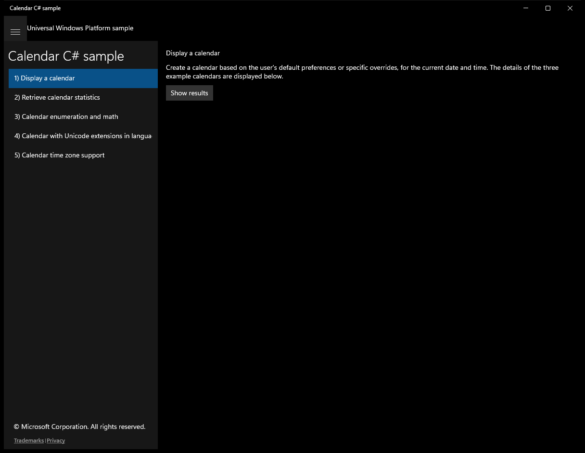

---

## Scenario 1 - Display a calendar

### UI elements
- **TextBlock**  - text="Display a calendar"
- **TextBlock**  - text="Create a calendar based on the user's default preferences or specific overrides, for the current date and time. The details of the three example calendars are displayed below."
- **Button**  - content="Show results"; events: Click=ShowResults_Click
- **TextBlock**  - x:Name="OutputTextBlock"

### Code behavior
- **`ShowResults_Click`**
    - namespaces: `Windows.Globalization.Calendar`
    - instantiates: `Calendar`
    - API refs: `Windows.Globalization`, `CalendarIdentifiers.Japanese`, `ClockIdentifiers.TwelveHour`, `CalendarIdentifiers.Hebrew`, `ClockIdentifiers.TwentyFourHour`, `OutputTextBlock.Text`
    - updates UI: `OutputTextBlock.Text`

### Screenshots
Initial state:

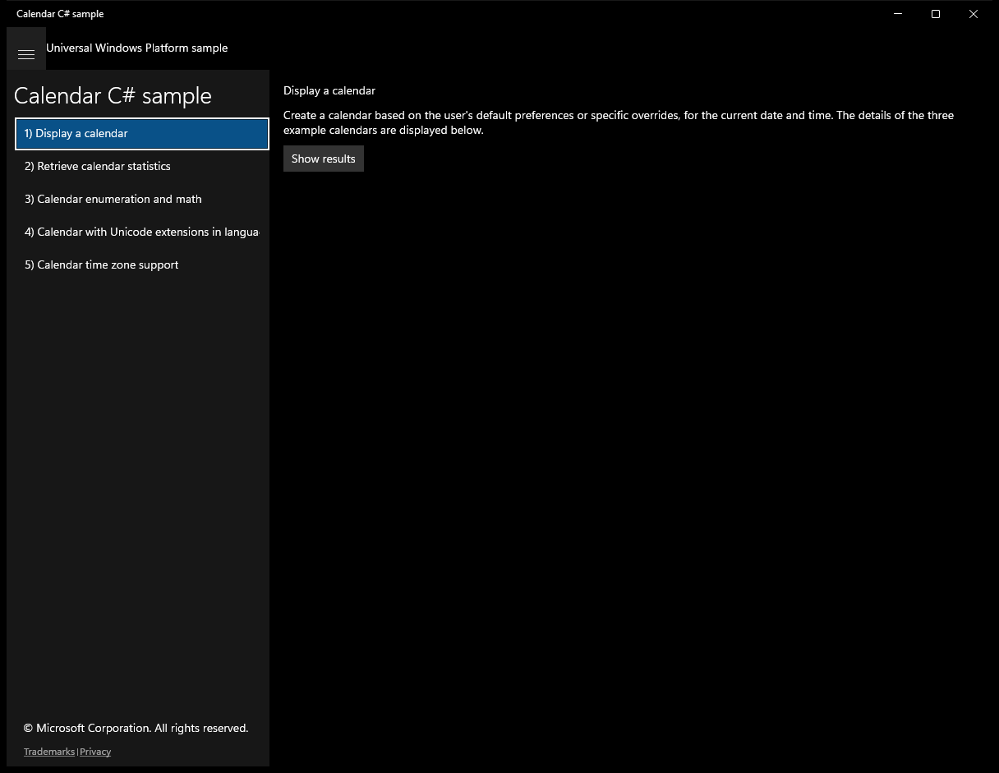

After click **Show results**:

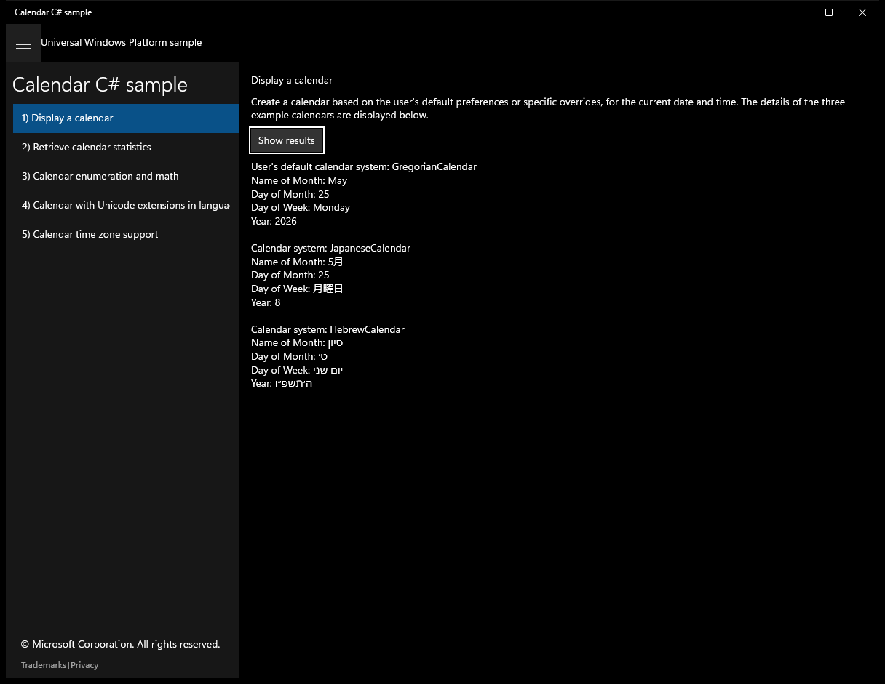

---

## Scenario 2 - Retrieve calendar statistics

### UI elements
- **TextBlock**  - text="Retrieve calendar statistics"
- **TextBlock**  - text="Determines statistics for the current calendar date and time."
- **Button**  - content="Show results"; events: Click=ShowResults_Click
- **TextBlock**  - x:Name="OutputTextBlock"

### Code behavior
- **`ShowResults_Click`**
    - namespaces: `Windows.Globalization.Calendar`
    - instantiates: `Calendar`
    - API refs: `Windows.Globalization`, `CalendarIdentifiers.Japanese`, `ClockIdentifiers.TwelveHour`, `CalendarIdentifiers.Hebrew`, `ClockIdentifiers.TwentyFourHour`, `OutputTextBlock.Text`
    - updates UI: `OutputTextBlock.Text`

### Screenshots
Initial state:

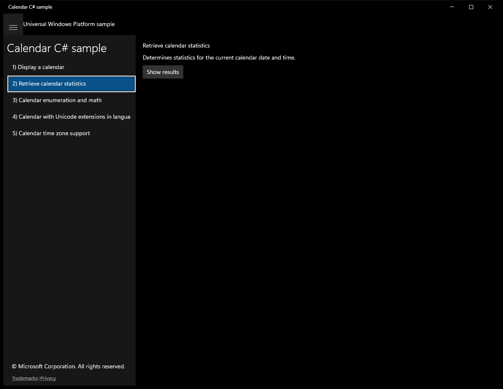

After click **Show results**:

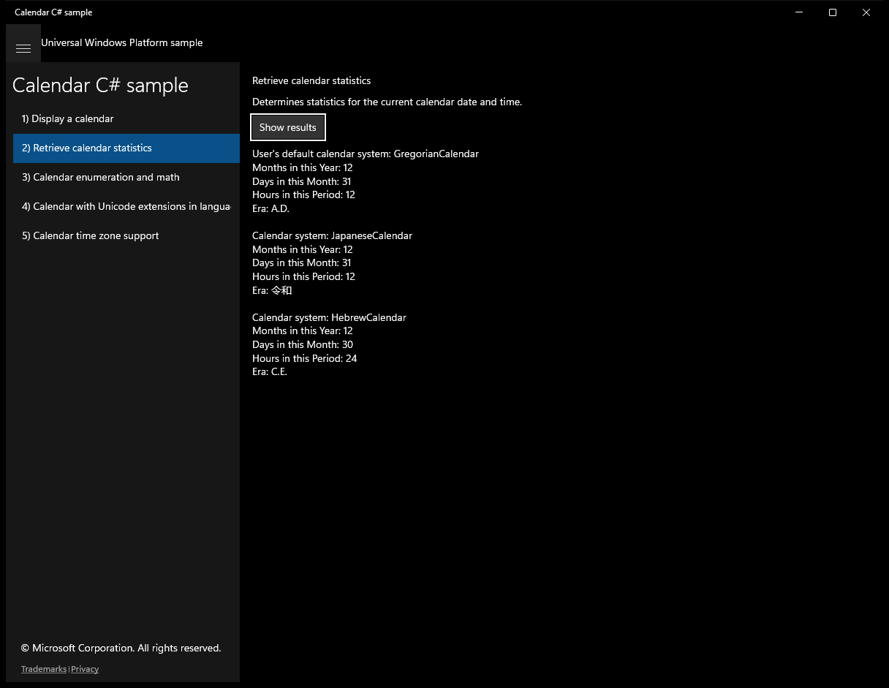

---

## Scenario 3 - Calendar enumeration and math

### UI elements
- **TextBlock**  - text="Calendar enumeration and math"
- **TextBlock**  - text="Enumerates through a calendar and performs calendar math."
- **Button**  - content="Show results"; events: Click=ShowResults_Click
- **TextBlock**  - x:Name="OutputTextBlock"

### Code behavior
- **`ShowResults_Click`**
    - namespaces: `Windows.Globalization.Calendar`
    - instantiates: `StringBuilder`, `Calendar`, `DateTimeFormatter`, `Windows.Globalization.Calendar`, `DateTime`
    - API refs: `Windows.Globalization`, `CalendarIdentifiers.Japanese`, `ClockIdentifiers.TwentyFourHour`, `CalendarIdentifiers.Gregorian`, `DateTimeKind.Utc`, `OutputTextBlock.Text`
    - updates UI: `OutputTextBlock.Text`

### Screenshots
Initial state:

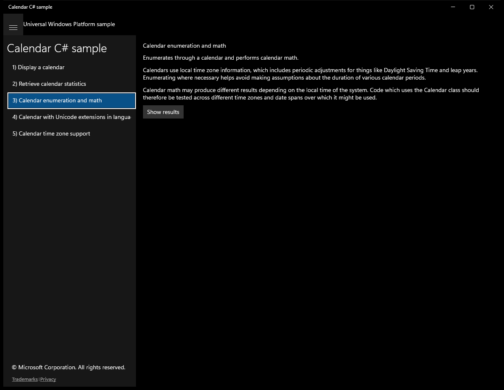

After click **Show results**:

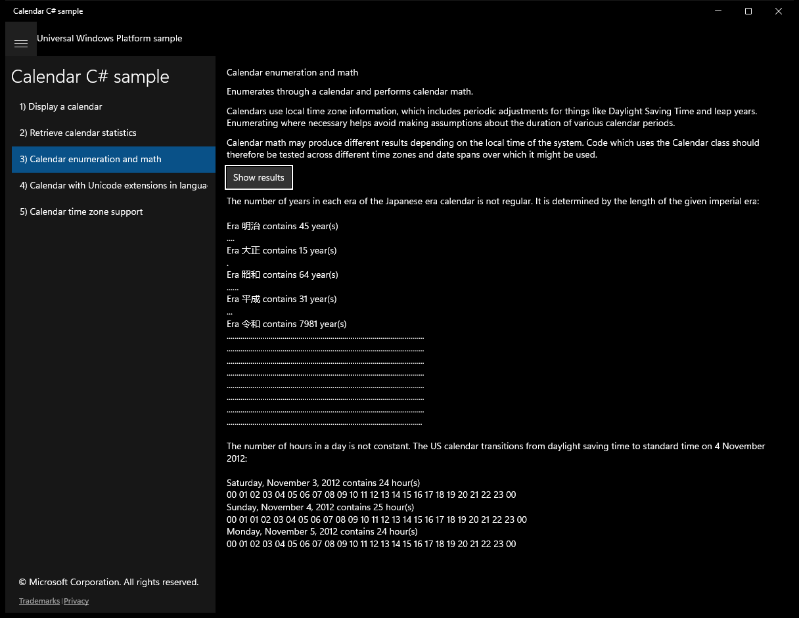

---

## Scenario 4 - Calendar with Unicode extensions in languages

### UI elements
- **TextBlock**  - text="Calendar with Unicode extensions in languages"
- **TextBlock**  - text="Creates a calendar using language names with supported Unicode extension tags and demonstrates how the extension tags are used by the calendar object."
- **Button**  - content="Show results"; events: Click=ShowResults_Click
- **TextBlock**  - x:Name="OutputTextBlock"

### Code behavior
- **`ShowResults_Click`**
    - namespaces: `Windows.Globalization.Calendar`
    - instantiates: `Calendar`
    - API refs: `Windows.Globalization`, `OutputTextBlock.Text`
    - updates UI: `OutputTextBlock.Text`

### Screenshots
Initial state:

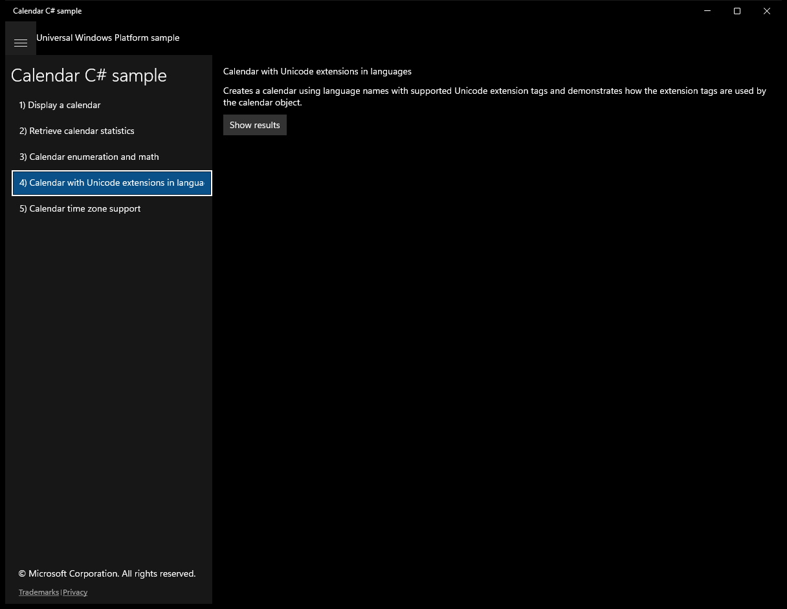

After click **Show results**:

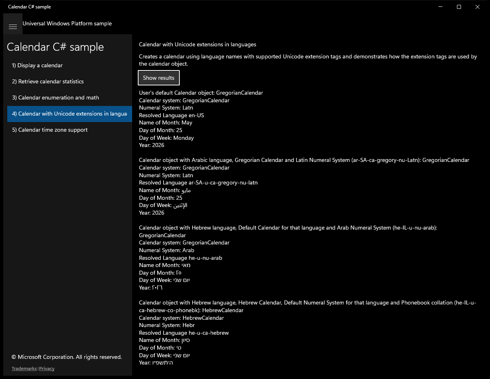

---

## Scenario 5 - Calendar time zone support

### UI elements
- **TextBlock**  - text="Calendar time zone support"
- **TextBlock**  - text="Set and get several time zones within a calendar, and show the effect of the time zone change in the date and time time properties of the calendar."
- **Button**  - content="Show results"; events: Click=ShowResults_Click
- **TextBlock**  - x:Name="OutputTextBlock"

### Code behavior
- **`ShowResults_Click`**
    - namespaces: `Windows.Globalization.Calendar`
    - instantiates: `StringBuilder`, `Calendar`
    - API refs: `Windows.Globalization`, `OutputTextBlock.Text`
    - updates UI: `OutputTextBlock.Text`

### Screenshots
Initial state:

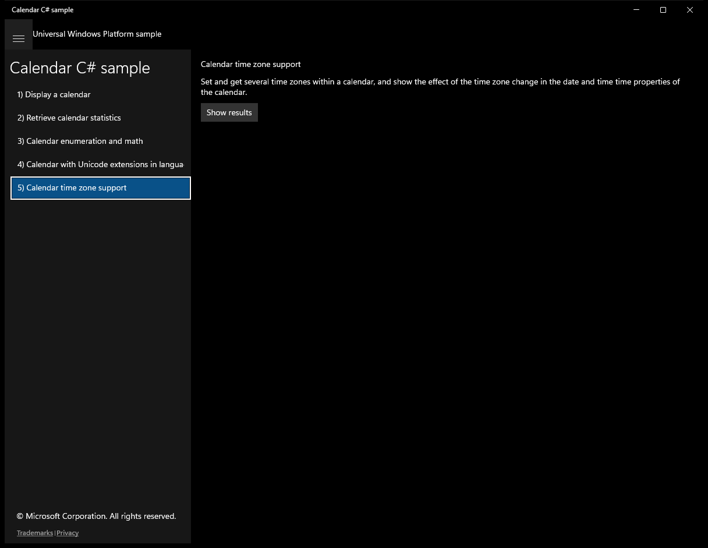

After click **Show results**:

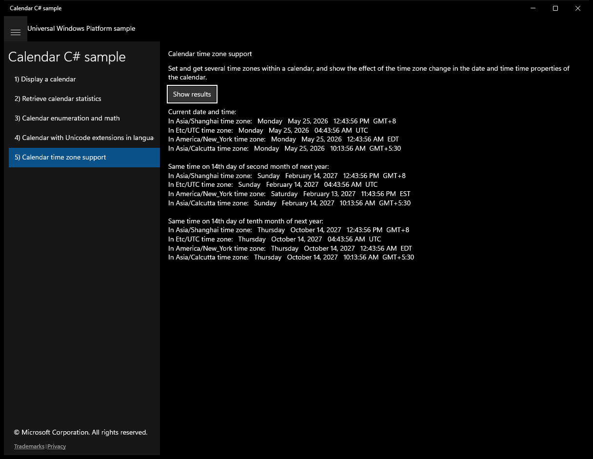

