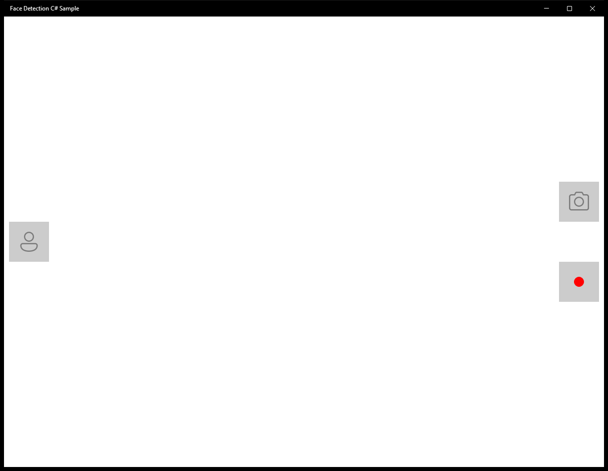

# CameraFaceDetection (C#)

> **Source**: `Samples\CameraFaceDetection\cs\`  
> **AUMID**: `Microsoft.SDKSamples.CameraFaceDetection.CS_8wekyb3d8bbwe!App`  
> **PackageFamilyName**: `Microsoft.SDKSamples.CameraFaceDetection.CS_8wekyb3d8bbwe`  

## Sample purpose
An end-to-end sample camera application that incorporates face detection.

## Scenarios demonstrated (from README)
- **Manage the MediaCapture object** throughout the lifecycle of the app and through navigation events.
- **Acquire a camera located on a specific side of the device**. In this case, the sample attempts to get the front camera.
- **Start and stop the preview** to a UI element, including mirroring for front-facing cameras.
- **Take a regular picture** to a file, taking into account the orientation of the device.
- **Handle rotation events** for both, the device moving in space and the page orientation changing on the screen. Also apply any necessary corrections to the preview stream rotation.
- **Handle MediaCapture Failed event** to clean up the MediaCapture instance when an error occurs.
- **Manage the Face Detection effect**, including creation, configuration, activation/deactivation, registering for events, and cleanup.
- **Render face bounding boxes** as an overlay on the camera preview, taking mirroring and rotation into account.

## Top-level UWP namespaces used
- `Windows.Devices.Enumeration.Panel.Front`
- `Windows.Devices.Enumeration.Panel.Unknown`
- `Windows.UI.ViewManagement.StatusBar`
- `Windows.UI.ViewManagement.StatusBar.GetForCurrentView`
- `Windows.Phone.UI.Input.HardwareButtons`

## Build / deploy / capture status
- build: ok
- deploy: ok
- launch: ok
- capture: ok-generic
- uninstall: ok

## Main page

---

## MainPage (static analysis)

This sample is a single-page app (no scenario list). The MainPage covers the entire functionality.

### UI elements
- **CaptureElement**  - name="PreviewControl"
- **Canvas**  - name="FacesCanvas"
- **Button**  - name="PhotoButton"; events: Click=PhotoButton_Click
- **Button**  - name="VideoButton"; events: Click=VideoButton_Click
- **Button**  - name="FaceDetectionButton"; events: Click=FaceDetectionButton_Click

### Code behavior
- **`MainPage`**
    - API refs: `NavigationCacheMode.Disabled`, `Application.Current`
- **`Application_Suspending`**
    - API refs: `Frame.CurrentSourcePageType`, `SuspendingOperation.GetDeferral`
- **`Application_Resuming`**
    - API refs: `Frame.CurrentSourcePageType`
- **`SystemMediaControls_PropertyChanged`**
    - API refs: `Dispatcher.RunAsync`, `CoreDispatcherPriority.Normal`, `SystemMediaTransportControlsProperty.SoundLevel`, `Frame.CurrentSourcePageType`, `SoundLevel.Muted`
- **`OrientationSensor_OrientationChanged`**
    - API refs: `SimpleOrientation.Faceup`, `SimpleOrientation.Facedown`, `Dispatcher.RunAsync`, `CoreDispatcherPriority.Normal`
- **`DisplayInformation_OrientationChanged`**
    - API refs: `Dispatcher.RunAsync`, `CoreDispatcherPriority.Normal`
- **`FaceDetectionButton_Click`**
    - API refs: `FacesCanvas.Children`
- **`MediaCapture_RecordLimitationExceeded`**
    - API refs: `Dispatcher.RunAsync`, `CoreDispatcherPriority.Normal`
- **`MediaCapture_Failed`**
    - API refs: `Debug.WriteLine`, `Dispatcher.RunAsync`, `CoreDispatcherPriority.Normal`
- **`FaceDetectionEffect_FaceDetected`**
    - API refs: `Dispatcher.RunAsync`, `CoreDispatcherPriority.Normal`, `ResultFrame.DetectedFaces`
- **`InitializeCameraAsync`**
    - namespaces: `Windows.Devices.Enumeration.Panel.Front`, `Windows.Devices.Enumeration.Panel.Unknown`
    - instantiates: `MediaCapture`
    - API refs: `Debug.WriteLine`, `Windows.Devices`, `Enumeration.Panel`, `EnclosureLocation.Panel`
- **`StartPreviewAsync`**
    - API refs: `PreviewControl.Source`, `PreviewControl.FlowDirection`, `FlowDirection.RightToLeft`, `FlowDirection.LeftToRight`, `VideoDeviceController.GetMediaStreamProperties`, `MediaStreamType.VideoPreview`
- **`SetPreviewRotationAsync`**
    - API refs: `VideoDeviceController.GetMediaStreamProperties`, `MediaStreamType.VideoPreview`, `Properties.Add`
- **`StopPreviewAsync`**
    - API refs: `Dispatcher.RunAsync`, `CoreDispatcherPriority.Normal`, `PreviewControl.Source`
- **`CreateFaceDetectionEffectAsync`**
    - instantiates: `FaceDetectionEffectDefinition`
    - API refs: `FaceDetectionMode.HighPerformance`, `MediaStreamType.VideoPreview`, `TimeSpan.FromMilliseconds`
- **`TakePhotoAsync`**
    - instantiates: `InMemoryRandomAccessStream`
    - API refs: `VideoButton.IsEnabled`, `MediaCaptureSettings.ConcurrentRecordAndPhotoSupported`, `VideoButton.Opacity`, `Debug.WriteLine`, `ImageEncodingProperties.CreateJpeg`, `CreationCollisionOption.GenerateUniqueName`
- **`StartRecordingAsync`**
    - API refs: `CreationCollisionOption.GenerateUniqueName`, `MediaEncodingProfile.CreateMp4`, `VideoEncodingQuality.Auto`, `Video.Properties`, `PropertyValue.CreateInt32`, `Debug.WriteLine`
- **`StopRecordingAsync`**
    - API refs: `Debug.WriteLine`
- **`CleanupCameraAsync`**
    - API refs: `Debug.WriteLine`, `MediaCapture.Dispose`
- **`SetupUiAsync`**
    - namespaces: `Windows.UI.ViewManagement.StatusBar`, `Windows.UI.ViewManagement.StatusBar.GetForCurrentView`
    - API refs: `DisplayInformation.AutoRotationPreferences`, `DisplayOrientations.Landscape`, `ApiInformation.IsTypePresent`, `Windows.UI`, `ViewManagement.StatusBar`, `StorageLibrary.GetLibraryAsync`, `KnownLibraryId.Pictures`, `ApplicationData.Current`
- **`CleanupUiAsync`**
    - namespaces: `Windows.UI.ViewManagement.StatusBar`, `Windows.UI.ViewManagement.StatusBar.GetForCurrentView`
    - API refs: `ApiInformation.IsTypePresent`, `Windows.UI`, `ViewManagement.StatusBar`, `DisplayInformation.AutoRotationPreferences`, `DisplayOrientations.None`
- **`UpdateCaptureControls`**
    - API refs: `PhotoButton.IsEnabled`, `VideoButton.IsEnabled`, `FaceDetectionButton.IsEnabled`, `FaceDetectionDisabledIcon.Visibility`, `Visibility.Visible`, `Visibility.Collapsed`, `FaceDetectionEnabledIcon.Visibility`, `FacesCanvas.Visibility`, `StartRecordingIcon.Visibility`, `StopRecordingIcon.Visibility`, `MediaCaptureSettings.ConcurrentRecordAndPhotoSupported`, `PhotoButton.Opacity`
- **`RegisterEventHandlers`**
    - namespaces: `Windows.Phone.UI.Input.HardwareButtons`
    - API refs: `ApiInformation.IsTypePresent`, `Windows.Phone`, `UI.Input`, `HardwareButtons.CameraPressed`
- **`UnregisterEventHandlers`**
    - namespaces: `Windows.Phone.UI.Input.HardwareButtons`
    - API refs: `ApiInformation.IsTypePresent`, `Windows.Phone`, `UI.Input`, `HardwareButtons.CameraPressed`
- **`FindCameraDeviceByPanelAsync`**
    - API refs: `DeviceInformation.FindAllAsync`, `DeviceClass.VideoCapture`, `EnclosureLocation.Panel`
- **`ReencodeAndSavePhotoAsync`**
    - instantiates: `BitmapTypedValue`
    - API refs: `BitmapDecoder.CreateAsync`, `FileAccessMode.ReadWrite`, `BitmapEncoder.CreateForTranscodingAsync`, `System.Photo`, `PropertyType.UInt16`, `BitmapProperties.SetPropertiesAsync`
- **`GetCameraOrientation`**
    - API refs: `SimpleOrientation.NotRotated`, `DisplayOrientations.Portrait`, `SimpleOrientation.Rotated90DegreesCounterclockwise`, `SimpleOrientation.Rotated180DegreesCounterclockwise`, `SimpleOrientation.Rotated270DegreesCounterclockwise`
- **`ConvertDeviceOrientationToDegrees`**
    - API refs: `SimpleOrientation.Rotated90DegreesCounterclockwise`, `SimpleOrientation.Rotated180DegreesCounterclockwise`, `SimpleOrientation.Rotated270DegreesCounterclockwise`, `SimpleOrientation.NotRotated`
- **`ConvertDisplayOrientationToDegrees`**
    - API refs: `DisplayOrientations.Portrait`, `DisplayOrientations.LandscapeFlipped`, `DisplayOrientations.PortraitFlipped`, `DisplayOrientations.Landscape`
- **`ConvertOrientationToPhotoOrientation`**
    - API refs: `SimpleOrientation.Rotated90DegreesCounterclockwise`, `PhotoOrientation.Rotate90`, `SimpleOrientation.Rotated180DegreesCounterclockwise`, `PhotoOrientation.Rotate180`, `SimpleOrientation.Rotated270DegreesCounterclockwise`, `PhotoOrientation.Rotate270`, `SimpleOrientation.NotRotated`, `PhotoOrientation.Normal`

