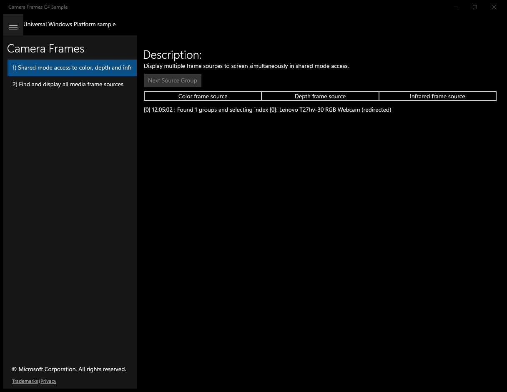
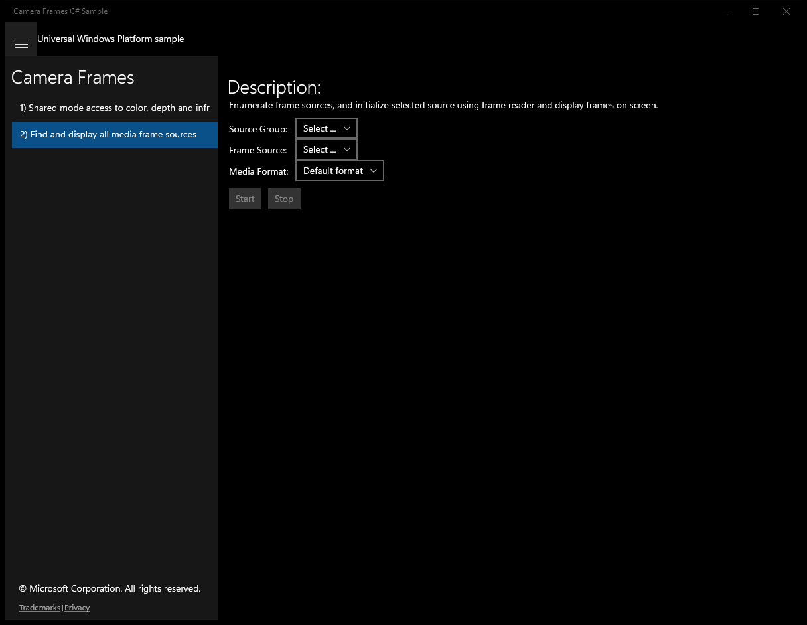

#  (C#)

> **Source**: `Samples\\cs\`  
> **Feature**: Camera Frames  
> **AUMID**: `Microsoft.SDKSamples.CameraFrames.CS_8wekyb3d8bbwe!App`  
> **PackageFamilyName**: `Microsoft.SDKSamples.CameraFrames.CS_8wekyb3d8bbwe`  

## Sample purpose
Shows how to perform various tasks related to individual frames captured through a camera.

## Scenarios demonstrated (from README)
- Find cameras which support color, depth and/or infrared
- Access cameras in shared mode
- Create and read frames from a FrameReader
- Process input frames pixel by pixel
- Rendering frames to an image element
- Use a DeviceWatcher to monitor when cameras are connected and disconnected

## Top-level UWP namespaces used
- `Windows.UI.Core.CoreDispatcherPriority.Normal`

## Build / deploy / capture status
- build: skipped
- deploy: ok
- launch: ok
- capture: ok
- uninstall: ok

## Main page

---

## Scenario 1 - Shared mode access to color, depth and infrared frame sources

**Description**: Display multiple frame sources to screen simultaneously in shared mode access.

### UI elements
- **TextBlock**  - text="Description:"
- **TextBlock**  - text="Display multiple frame sources to screen simultaneously in shared mode access."
- **Button**  - x:Name="NextButton"; content="Next Source Group"; events: Click=NextButton_Click
- **TextBlock**  - text="Color frame source"
- **Image**  - name="colorPreviewImage"
- **TextBlock**  - text="Depth frame source"
- **Image**  - name="depthPreviewImage"
- **TextBlock**  - text="Infrared frame source"
- **Image**  - name="infraredPreviewImage"
- **TextBlock**  - x:Name="outputTextBlock"

### Code behavior
- **`PickNextMediaSourceAsync`**
    - API refs: `NextButton.IsEnabled`
- **`PickNextMediaSourceWorkerAsync`**
    - instantiates: `HashSet`
    - API refs: `MediaFrameSourceGroup.FindAllAsync`, `FrameSources.Values`, `Info.SourceKind`, `FrameRenderer.GetSubtypeForFrameReader`, `MediaFrameReaderStartStatus.Success`
- **`InitializeMediaCaptureAsync`**
    - instantiates: `MediaCapture`
    - API refs: `MediaCaptureSharingMode.SharedReadOnly`, `StreamingCaptureMode.Video`, `MediaCaptureMemoryPreference.Cpu`

### Screenshots
Initial state:

---

## Scenario 2 - Find and display all media frame sources

**Description**: Enumerate frame sources, and initialize selected source using frame reader and display frames on screen.

### UI elements
- **TextBlock**  - text="{Binding Path=DisplayName}"
- **TextBlock**  - text="Description:"
- **TextBlock**  - text="Enumerate frame sources, and initialize selected source using frame reader and display frames on screen."
- **TextBlock**  - text="Source Group:"
- **TextBlock**  - text="Frame Source:"
- **TextBlock**  - text="Media Format:"
- **ComboBox**  - name="GroupComboBox"; events: SelectionChanged=GroupComboBox_SelectionChanged
- **ComboBox**  - name="SourceComboBox"; events: SelectionChanged=SourceComboBox_SelectionChanged
- **ComboBox**  - name="FormatComboBox"; events: SelectionChanged=FormatComboBox_SelectionChanged
- **Button**  - name="StartButton"; content="Start"; events: Click=StartButton_Click
- **Button**  - name="StopButton"; content="Stop"; events: Click=StopButton_Click
- **Image**  - name="PreviewImage"
- **TextBlock**  - x:Name="outputTextBlock"

### Code behavior
- **`OnNavigatedTo`**
    - instantiates: `SourceGroupCollection`
    - API refs: `GroupComboBox.ItemsSource`
- **`UpdateButtonStateAsync`**
    - namespaces: `Windows.UI.Core.CoreDispatcherPriority.Normal`
    - API refs: `Dispatcher.RunAsync`, `Windows.UI`, `Core.CoreDispatcherPriority`, `StartButton.IsEnabled`, `StopButton.IsEnabled`
- **`DisposeMediaCapture`**
    - API refs: `FormatComboBox.ItemsSource`, `SourceComboBox.ItemsSource`
- **`GroupComboBox_SelectionChanged`**
    - API refs: `GroupComboBox.SelectedItem`, `SourceComboBox.ItemsSource`, `SourceComboBox.SelectedIndex`
- **`SourceComboBox_SelectionChanged`**
    - instantiates: `FrameFormatModel`
    - API refs: `SourceComboBox.SelectedItem`, `FrameRenderer.GetSubtypeForFrameReader`, `Info.SourceKind`, `FormatComboBox.ItemsSource`
- **`FormatComboBox_SelectionChanged`**
    - API refs: `FormatComboBox.SelectedItem`
- **`StartReaderAsync`**
    - API refs: `MediaFrameReaderStartStatus.Success`
- **`CreateReaderAsync`**
    - API refs: `FrameRenderer.GetSubtypeForFrameReader`, `Info.SourceKind`, `Info.Id`
- **`UpdateFrameSource`**
    - API refs: `SourceComboBox.SelectedItem`, `GroupComboBox.SelectedItem`, `SourceGroup.Id`, `Info.Id`, `SourceInfo.Id`, `FrameSources.TryGetValue`
- **`InitializeCaptureAsync`**
    - instantiates: `MediaCapture`, `MediaCaptureInitializationSettings`
    - API refs: `GroupComboBox.SelectedItem`, `MediaCaptureSharingMode.ExclusiveControl`, `MediaCaptureMemoryPreference.Cpu`, `StreamingCaptureMode.Video`
- **`MediaCaptureInitializationSettings`**
    - API refs: `MediaCaptureSharingMode.ExclusiveControl`, `MediaCaptureMemoryPreference.Cpu`, `StreamingCaptureMode.Video`

### Screenshots
Initial state:

