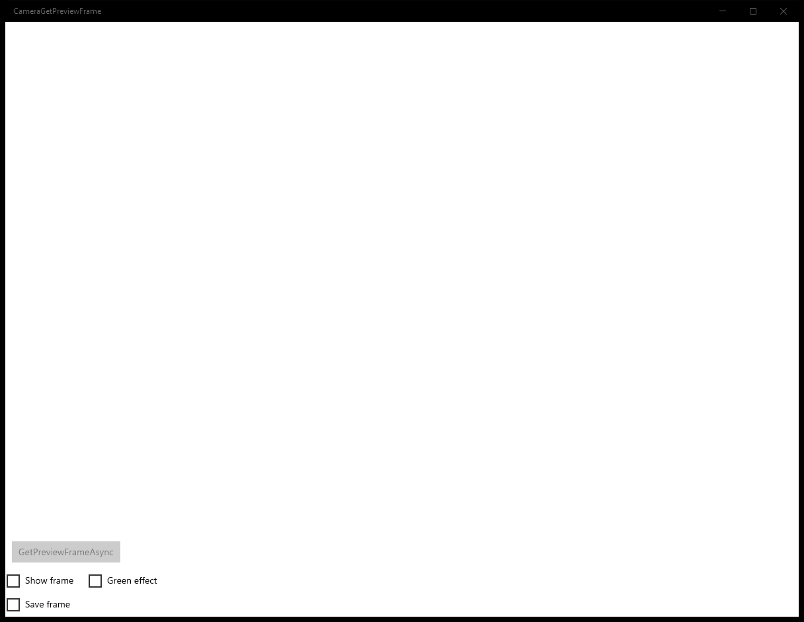

# CameraGetPreviewFrame (C#)

> **Source**: `Samples\CameraGetPreviewFrame\cs\`  
> **AUMID**: `Microsoft.SDKSamples.CameraGetPreviewFrame.CS_8wekyb3d8bbwe!App`  
> **PackageFamilyName**: `Microsoft.SDKSamples.CameraGetPreviewFrame.CS_8wekyb3d8bbwe`  

## Sample purpose
An end-to-end sample camera app which acquires preview frames from the camera stream for further processing.

## Scenarios demonstrated (from README)
- **Manage the MediaCapture object** throughout the lifecycle of the app and through navigation events.
- **Acquire a camera located on a specific side of the device**. In this case, the sample attempts to get the rear camera.
- **Start and stop the preview** to a UI element, including mirroring for front-facing cameras.
- **Get a preview frame** using both overloads for the method.
- Get it as a **Direct3DSurface** and display information about the frame: Width, Height, Format.
- Get it as a **SoftwareBitmap**, display information about the frame: Width, Height, Format, and optionally display it on the screen and/or save it to disk.
- **Handle page rotation events** to apply any necessary corrections to the preview stream rotation, ensuring acquired preview frames have the correct orientation and aspect ratio.
- **Handle MediaCapture Failed event** to clean up the MediaCapture instance when an error occurs.

## Top-level UWP namespaces used
- `Windows.Devices.Enumeration.Panel.Back`
- `Windows.Devices.Enumeration.Panel.Unknown`
- `Windows.Devices.Enumeration.Panel.Front`

## Build / deploy / capture status
- build: skipped
- deploy: ok
- launch: ok
- capture: ok-generic
- uninstall: ok

## Main page

---

## MainPage (generic)

This sample did not expose a standard scenario list. Captures below come from a generic enumeration of buttons / list items / hyperlinks on the main page.

### Interaction captures
Initial state:

---

## MainPage (static analysis)

This sample is a single-page app (no scenario list). The MainPage covers the entire functionality.

### UI elements
- **CaptureElement**  - name="PreviewControl"
- **Image**  - name="PreviewFrameImage"
- **Button**  - name="GetPreviewFrameButton"; content="GetPreviewFrameAsync"; events: Click=GetPreviewFrameButton_Click
- **TextBlock**  - name="FrameInfoTextBlock"
- **CheckBox**  - name="ShowFrameCheckBox"; content="Show frame"
- **CheckBox**  - name="GreenEffectCheckBox"; content="Green effect"
- **CheckBox**  - name="SaveFrameCheckBox"; content="Save frame"

### Code behavior
- **`MainPage`**
    - API refs: `NavigationCacheMode.Required`, `Application.Current`
- **`Application_Suspending`**
    - API refs: `Frame.CurrentSourcePageType`, `SuspendingOperation.GetDeferral`
- **`Application_Resuming`**
    - API refs: `Frame.CurrentSourcePageType`
- **`SystemMediaControls_PropertyChanged`**
    - API refs: `Dispatcher.RunAsync`, `CoreDispatcherPriority.Normal`, `SystemMediaTransportControlsProperty.SoundLevel`, `Frame.CurrentSourcePageType`, `SoundLevel.Muted`
- **`GetPreviewFrameButton_Click`**
    - API refs: `ShowFrameCheckBox.IsChecked`, `SaveFrameCheckBox.IsChecked`
- **`MediaCapture_Failed`**
    - API refs: `Debug.WriteLine`, `Dispatcher.RunAsync`, `CoreDispatcherPriority.Normal`, `GetPreviewFrameButton.IsEnabled`
- **`InitializeCameraAsync`**
    - namespaces: `Windows.Devices.Enumeration.Panel.Back`, `Windows.Devices.Enumeration.Panel.Unknown`, `Windows.Devices.Enumeration.Panel.Front`
    - instantiates: `MediaCapture`
    - API refs: `Debug.WriteLine`, `Windows.Devices`, `Enumeration.Panel`, `EnclosureLocation.Panel`, `StorageLibrary.GetLibraryAsync`, `KnownLibraryId.Pictures`, `ApplicationData.Current`
- **`StartPreviewAsync`**
    - API refs: `Debug.WriteLine`, `PreviewControl.Source`, `PreviewControl.FlowDirection`, `FlowDirection.RightToLeft`, `FlowDirection.LeftToRight`, `GetPreviewFrameButton.IsEnabled`
- **`SetPreviewRotationAsync`**
    - API refs: `VideoDeviceController.GetMediaStreamProperties`, `MediaStreamType.VideoPreview`, `Properties.Add`
- **`StopPreviewAsync`**
    - API refs: `Dispatcher.RunAsync`, `CoreDispatcherPriority.Normal`, `PreviewControl.Source`, `GetPreviewFrameButton.IsEnabled`
- **`GetPreviewFrameAsSoftwareBitmapAsync`**
    - instantiates: `VideoFrame`, `SoftwareBitmapSource`
    - API refs: `VideoDeviceController.GetMediaStreamProperties`, `MediaStreamType.VideoPreview`, `BitmapPixelFormat.Bgra8`, `FrameInfoTextBlock.Text`, `String.Format`, `GreenEffectCheckBox.IsChecked`, `ShowFrameCheckBox.IsChecked`, `PreviewFrameImage.Source`, `SaveFrameCheckBox.IsChecked`, `CreationCollisionOption.GenerateUniqueName`, `Debug.WriteLine`
    - updates UI: `FrameInfoTextBlock.Text`
- **`GetPreviewFrameAsD3DSurfaceAsync`**
    - API refs: `FrameInfoTextBlock.Text`, `String.Format`, `Description.Width`, `Description.Height`, `Description.Format`, `PreviewFrameImage.Source`
    - updates UI: `FrameInfoTextBlock.Text`
- **`CleanupCameraAsync`**
    - API refs: `MediaCapture.Dispose`
- **`FindCameraDeviceByPanelAsync`**
    - API refs: `DeviceInformation.FindAllAsync`, `DeviceClass.VideoCapture`, `EnclosureLocation.Panel`
- **`ConvertDisplayOrientationToDegrees`**
    - API refs: `DisplayOrientations.Portrait`, `DisplayOrientations.LandscapeFlipped`, `DisplayOrientations.PortraitFlipped`, `DisplayOrientations.Landscape`
- **`SaveSoftwareBitmapAsync`**
    - API refs: `FileAccessMode.ReadWrite`, `BitmapEncoder.CreateAsync`, `BitmapEncoder.JpegEncoderId`
- **`ApplyGreenFilter`**
    - API refs: `BitmapPixelFormat.Bgra8`, `BitmapBufferAccessMode.ReadWrite`, `Math.Min`

