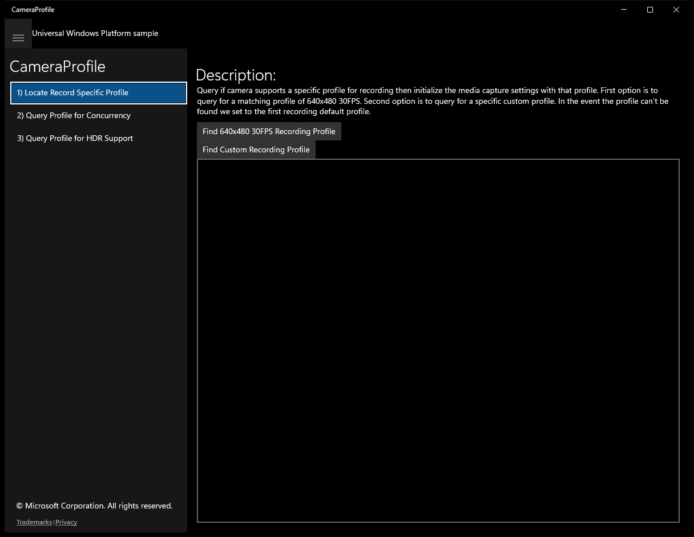
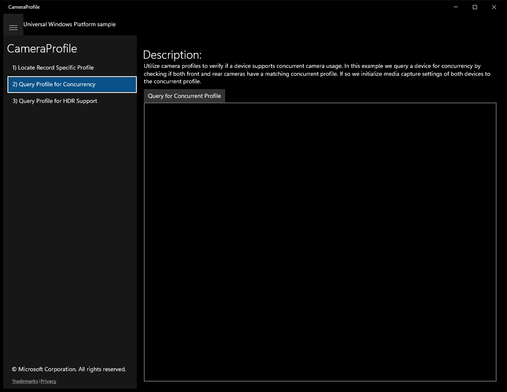
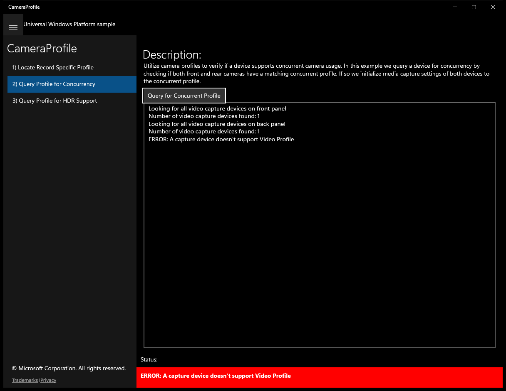
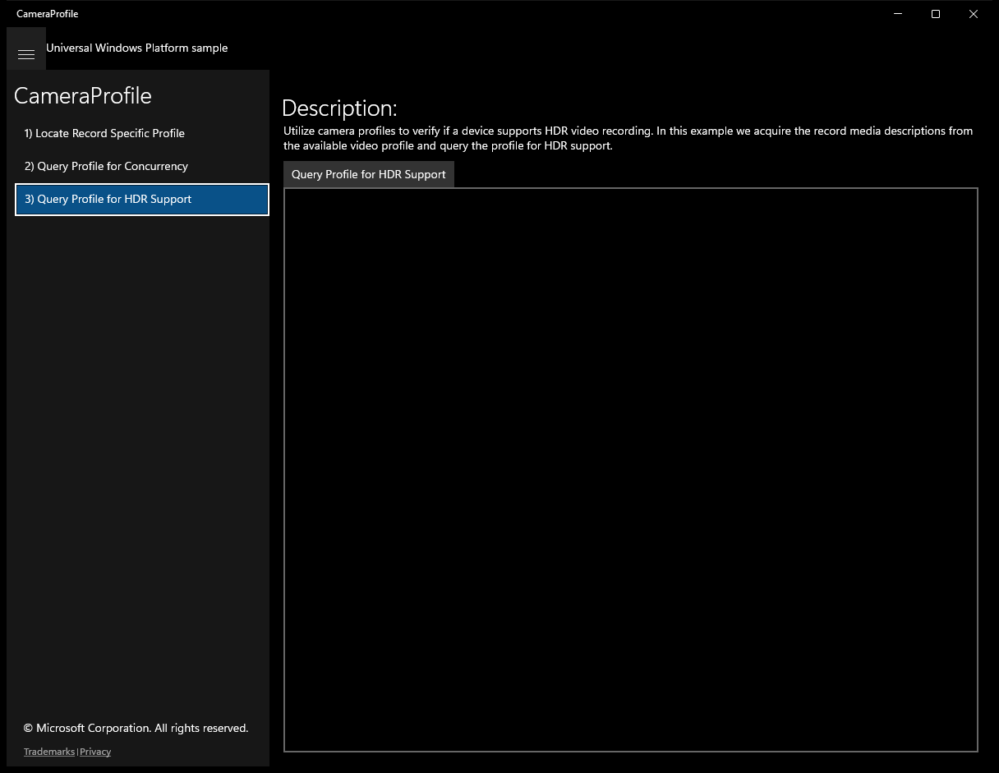
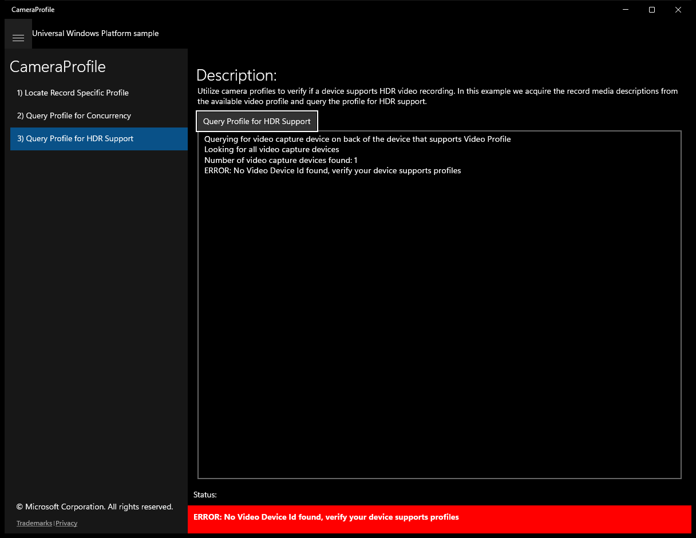

#  (C#)

> **Source**: `Samples\\cs\`  
> **Feature**: CameraProfile  
> **AUMID**: `Microsoft.SDKSamples.CameraProfile.CS_8wekyb3d8bbwe!App`  
> **PackageFamilyName**: `Microsoft.SDKSamples.CameraProfile.CS_8wekyb3d8bbwe`  

## Sample purpose
Shows how to query a media capture device for a collection of media types that can work together on a given device called a Video Profile.

## Top-level UWP namespaces used
- `Windows.Devices.Enumeration.Panel.Back`
- `Windows.UI.Core.CoreDispatcherPriority.Normal`
- `Windows.Devices.Enumeration.Panel.Front`
- `Windows.Media.Devices.HdrVideoMode.Auto`

## Build / deploy / capture status
- build: skipped
- deploy: ok
- launch: ok
- capture: ok
- uninstall: ok

## Main page

---

## Scenario 1 - Locate Record Specific Profile

**Description**: Query if camera supports a specific profile for recording then initialize the media capture settings with that profile. First option is to query for a matching profile of 640x480 30FPS. Second option is to query for a specific custom profile. In the event the profile can't be found we set to the first recording default profile.

### UI elements
- **TextBlock**  - text="Description:"
- **Button**  - content="Find 640x480 30FPS Recording Profile"; events: Click=InitRecordProfileBtn_Click
- **Button**  - content="Find Custom Recording Profile"; events: Click=InitCustomProfileBtn_Click
- **TextBox**  - x:Name="outputBox"
- **TextBlock**  - x:Name="StatusBlock"

### Code behavior
- **`OnNavigatedTo`**
    - API refs: `MainPage.Current`
- **`InitRecordProfileBtn_Click`**
    - namespaces: `Windows.Devices.Enumeration.Panel.Back`
    - instantiates: `MediaCapture`, `MediaCaptureInitializationSettings`
    - API refs: `Windows.Devices`, `Enumeration.Panel`, `NotifyType.ErrorMessage`, `CultureInfo.InvariantCulture`, `MediaCapture.FindAllVideoProfiles`, `Math.Round`, `VideoProfile.Id`, `RecordMediaDescription.Width`, `RecordMediaDescription.Height`, `RecordMediaDescription.FrameRate`, `NotifyType.StatusMessage`
- **`InitCustomProfileBtn_Click`**
    - namespaces: `Windows.Devices.Enumeration.Panel.Back`
    - instantiates: `MediaCapture`, `MediaCaptureInitializationSettings`
    - API refs: `Windows.Devices`, `Enumeration.Panel`, `NotifyType.ErrorMessage`, `CultureInfo.InvariantCulture`, `MediaCapture.FindAllVideoProfiles`, `NotifyType.StatusMessage`
- **`GetVideoProfileSupportedDeviceIdAsync`**
    - API refs: `DeviceInformation.FindAllAsync`, `DeviceClass.VideoCapture`, `CultureInfo.InvariantCulture`, `Count.ToString`, `MediaCapture.IsVideoProfileSupported`, `EnclosureLocation.Panel`
- **`LogStatusToOutputBox`**
    - namespaces: `Windows.UI.Core.CoreDispatcherPriority.Normal`
    - API refs: `Dispatcher.RunAsync`, `Windows.UI`, `Core.CoreDispatcherPriority`
- **`LogStatus`**
    - namespaces: `Windows.UI.Core.CoreDispatcherPriority.Normal`
    - API refs: `Dispatcher.RunAsync`, `Windows.UI`, `Core.CoreDispatcherPriority`

### Screenshots
Initial state:

> Button **Find 640x480 30FPS Recording Profile** skipped (blocklist)

> Button **Find Custom Recording Profile** skipped (blocklist)

---

## Scenario 2 - Query Profile for Concurrency

**Description**: Utilize camera profiles to verify if a device supports concurrent camera usage. In this example we query a device for concurrency by checking if both front and rear cameras have a matching concurrent profile. If so we initialize media capture settings of both devices to the concurrent profile.

### UI elements
- **TextBlock**  - text="Description:"
- **Button**  - content="Query for Concurrent Profile"; events: Click=CheckConcurrentProfileBtn_Click
- **TextBox**  - x:Name="outputBox"
- **TextBlock**  - x:Name="StatusBlock"

### Code behavior
- **`OnNavigatedTo`**
    - API refs: `MainPage.Current`
- **`CheckConcurrentProfileBtn_Click`**
    - namespaces: `Windows.Devices.Enumeration.Panel.Front`, `Windows.Devices.Enumeration.Panel.Back`
    - instantiates: `MediaCapture`, `MediaCaptureInitializationSettings`
    - API refs: `Windows.Devices`, `Enumeration.Panel`, `NotifyType.ErrorMessage`, `CultureInfo.InvariantCulture`, `MediaCapture.FindConcurrentProfiles`, `NotifyType.StatusMessage`
- **`GetVideoProfileSupportedDeviceIdAsync`**
    - API refs: `DeviceInformation.FindAllAsync`, `DeviceClass.VideoCapture`, `CultureInfo.InvariantCulture`, `Count.ToString`, `MediaCapture.IsVideoProfileSupported`, `EnclosureLocation.Panel`
- **`LogStatusToOutputBox`**
    - namespaces: `Windows.UI.Core.CoreDispatcherPriority.Normal`
    - API refs: `Dispatcher.RunAsync`, `Windows.UI`, `Core.CoreDispatcherPriority`
- **`LogStatus`**
    - namespaces: `Windows.UI.Core.CoreDispatcherPriority.Normal`
    - API refs: `Dispatcher.RunAsync`, `Windows.UI`, `Core.CoreDispatcherPriority`

### Screenshots
Initial state:

After click **Query for Concurrent Profile**:

---

## Scenario 3 - Query Profile for HDR Support

**Description**: Utilize camera profiles to verify if a device supports HDR video recording. In this example we acquire the record media descriptions from the available video profile and query the profile for HDR support.

### UI elements
- **TextBlock**  - text="Description:"
- **Button**  - content="Query Profile for HDR Support"; events: Click=CheckHdrSupportBtn_Click
- **TextBox**  - x:Name="outputBox"
- **TextBlock**  - x:Name="StatusBlock"

### Code behavior
- **`OnNavigatedTo`**
    - API refs: `MainPage.Current`
- **`CheckHdrSupportBtn_Click`**
    - namespaces: `Windows.Devices.Enumeration.Panel.Back`, `Windows.Media.Devices.HdrVideoMode.Auto`
    - instantiates: `MediaCapture`, `MediaCaptureInitializationSettings`
    - API refs: `Windows.Devices`, `Enumeration.Panel`, `NotifyType.ErrorMessage`, `CultureInfo.InvariantCulture`, `MediaCapture.FindKnownVideoProfiles`, `KnownVideoProfile.VideoRecording`, `NotifyType.StatusMessage`, `VideoDeviceController.HdrVideoControl`, `Windows.Media`, `Devices.HdrVideoMode`
- **`GetVideoProfileSupportedDeviceIdAsync`**
    - API refs: `DeviceInformation.FindAllAsync`, `DeviceClass.VideoCapture`, `CultureInfo.InvariantCulture`, `Count.ToString`, `MediaCapture.IsVideoProfileSupported`, `EnclosureLocation.Panel`
- **`LogStatusToOutputBox`**
    - namespaces: `Windows.UI.Core.CoreDispatcherPriority.Normal`
    - API refs: `Dispatcher.RunAsync`, `Windows.UI`, `Core.CoreDispatcherPriority`
- **`LogStatus`**
    - namespaces: `Windows.UI.Core.CoreDispatcherPriority.Normal`
    - API refs: `Dispatcher.RunAsync`, `Windows.UI`, `Core.CoreDispatcherPriority`

### Screenshots
Initial state:

After click **Query Profile for HDR Support**:

