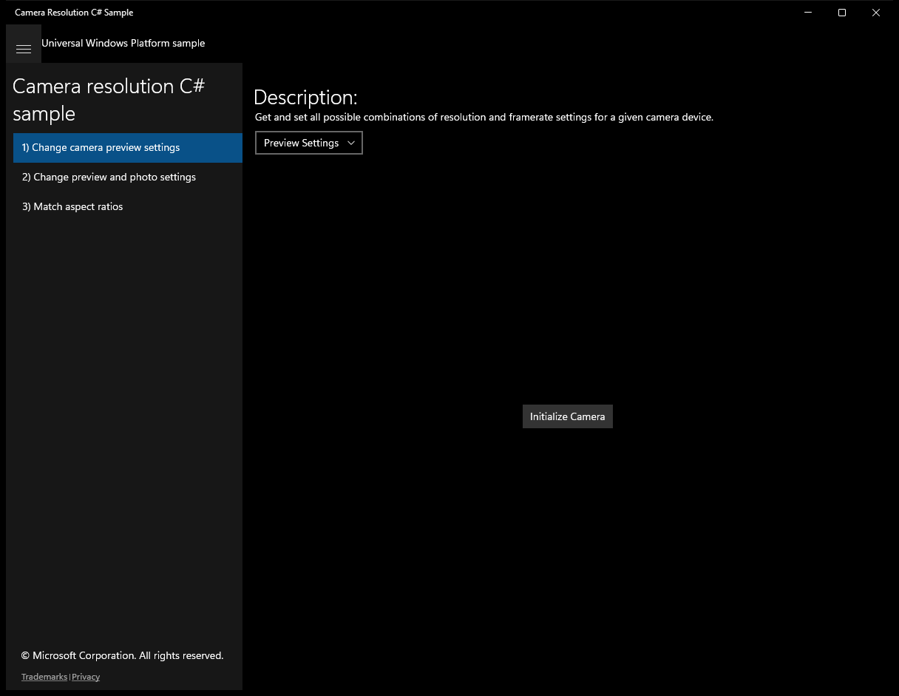
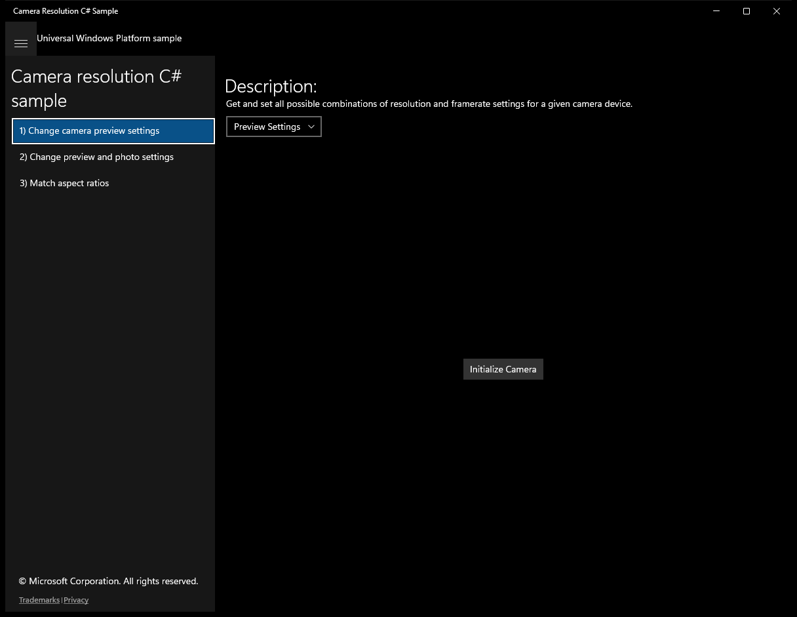
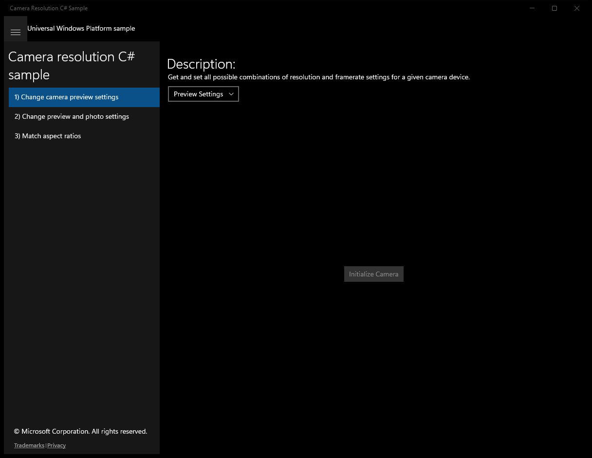
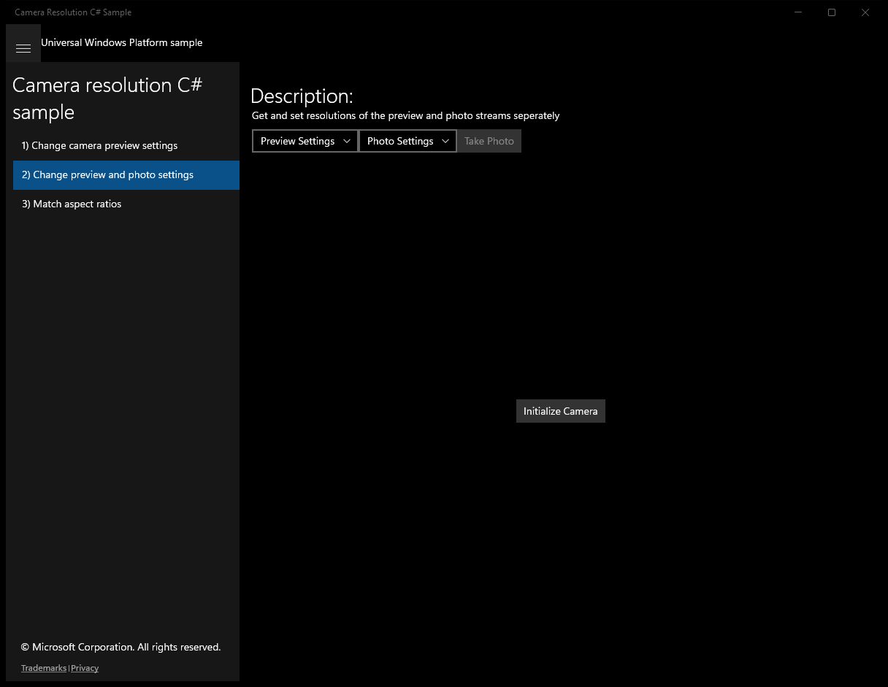
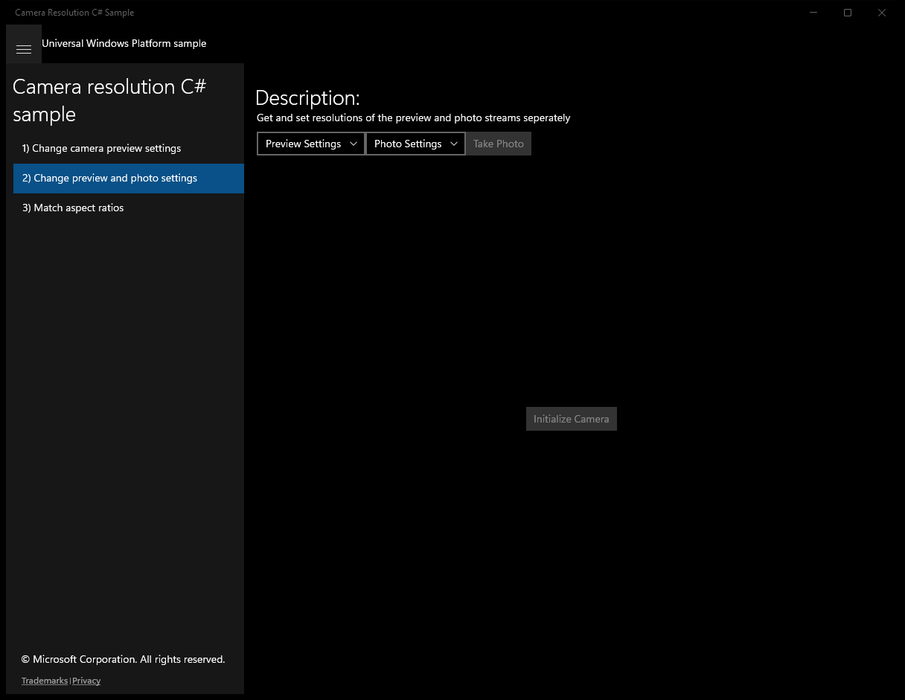
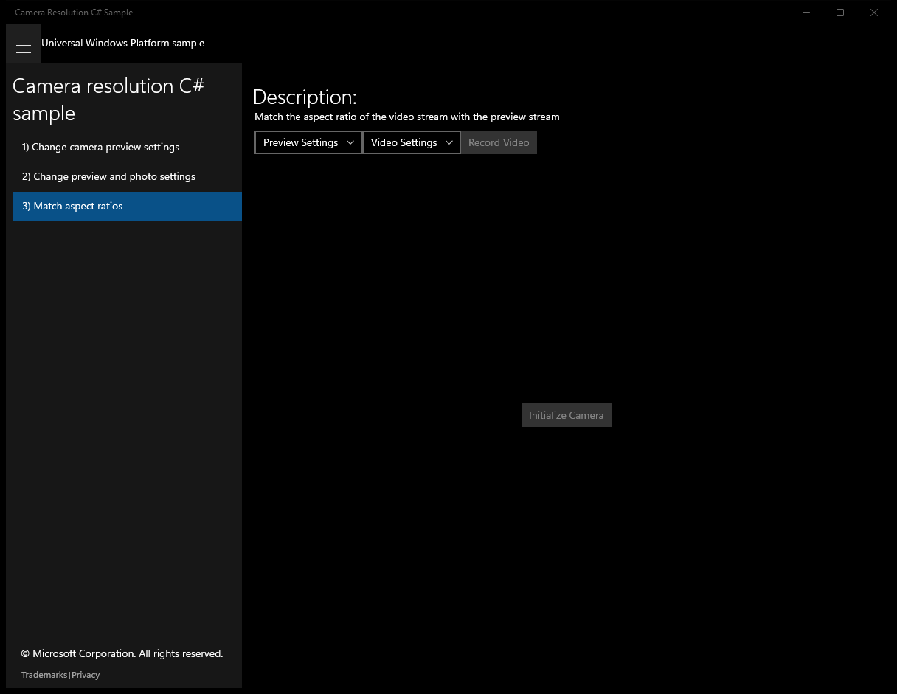

#  (C#)

> **Source**: `Samples\\cs\`  
> **Feature**: Camera resolution C# sample  
> **AUMID**: `Microsoft.SDKSamples.CameraResolution.CS_8wekyb3d8bbwe!App`  
> **PackageFamilyName**: `Microsoft.SDKSamples.CameraResolution.CS_8wekyb3d8bbwe`  

## Sample purpose
Shows how to change the resolution of a capture device.

## Build / deploy / capture status
- build: skipped
- deploy: ok
- launch: ok
- capture: ok
- uninstall: ok

## Main page

---

## Scenario 1 - Change camera preview settings

**Description**: Get and set all possible combinations of resolution and framerate settings for a given camera device.

### UI elements
- **TextBlock**  - text="Description:"
- **TextBlock**  - text="Get and set all possible combinations of resolution and framerate settings for a given camera device."
- **ComboBox**  - name="CameraSettings"; events: SelectionChanged=ComboBoxSettings_Changed
- **Button**  - content="Initialize Camera"; events: Click=InitializeCameraButton_Click
- **CaptureElement**  - name="PreviewControl"

### Code behavior
- **`InitializeCameraButton_Click`**
    - API refs: `NotifyType.StatusMessage`, `Visibility.Collapsed`, `PreviewControl.Visibility`, `Visibility.Visible`
- **`ComboBoxSettings_Changed`**
    - API refs: `MediaStreamType.VideoPreview`
- **`PopulateSettingsComboBox`**
    - instantiates: `StreamResolution`, `ComboBoxItem`
    - API refs: `MediaCapture.VideoDeviceController`, `MediaStreamType.VideoPreview`, `CameraSettings.Items`

### Screenshots
Initial state:

After click **Initialize Camera**:

---

## Scenario 2 - Change preview and photo settings

**Description**: Get and set resolutions of the preview and photo streams seperately

### UI elements
- **TextBlock**  - text="Description:"
- **TextBlock**  - text="Get and set resolutions of the preview and photo streams seperately"
- **ComboBox**  - name="PreviewSettings"; events: SelectionChanged=PreviewSettings_Changed
- **ComboBox**  - name="PhotoSettings"; events: SelectionChanged=PhotoSettings_Changed
- **Button**  - name="PhotoButton"; text="Take Photo"; events: Click=PhotoButton_Click
- **Button**  - content="Initialize Camera"; events: Click=InitializeCameraButton_Click
- **CaptureElement**  - name="PreviewControl"

### Code behavior
- **`CheckIfStreamsAreIdentical`**
    - API refs: `MediaCapture.MediaCaptureSettings`, `VideoDeviceCharacteristic.AllStreamsIdentical`, `VideoDeviceCharacteristic.PreviewPhotoStreamsIdentical`, `NotifyType.ErrorMessage`
- **`InitializeCameraButton_Click`**
    - API refs: `NotifyType.StatusMessage`, `Visibility.Collapsed`, `PreviewControl.Visibility`, `Visibility.Visible`, `MediaStreamType.VideoPreview`, `MediaStreamType.Photo`, `PhotoButton.IsEnabled`, `StorageLibrary.GetLibraryAsync`, `KnownLibraryId.Pictures`, `ApplicationData.Current`
- **`PreviewSettings_Changed`**
    - API refs: `MediaStreamType.VideoPreview`
- **`PhotoSettings_Changed`**
    - API refs: `MediaCapture.VideoDeviceController`, `MediaStreamType.Photo`
- **`PhotoButton_Click`**
    - instantiates: `InMemoryRandomAccessStream`
    - API refs: `PhotoButton.IsEnabled`, `CreationCollisionOption.GenerateUniqueName`, `MediaCapture.CapturePhotoToStorageFileAsync`, `ImageEncodingProperties.CreateJpeg`, `NotifyType.StatusMessage`, `NotifyType.ErrorMessage`
- **`PopulateComboBox`**
    - instantiates: `StreamResolution`, `ComboBoxItem`
    - API refs: `MediaCapture.VideoDeviceController`, `Items.Add`

### Screenshots
Initial state:

After click **Initialize Camera**:

---

## Scenario 3 - Match aspect ratios

**Description**: Match the aspect ratio of the video stream with the preview stream

### UI elements
- **TextBlock**  - text="Description:"
- **TextBlock**  - text="Match the aspect ratio of the video stream with the preview stream"
- **ComboBox**  - name="PreviewSettings"; events: SelectionChanged=PreviewSettings_Changed
- **ComboBox**  - name="VideoSettings"; events: SelectionChanged=VideoSettings_Changed
- **Button**  - name="VideoButton"; text="Record Video"; events: Click=VideoButton_Click
- **Button**  - content="Initialize Camera"; events: Click=InitializeCameraButton_Click
- **CaptureElement**  - name="PreviewControl"

### Code behavior
- **`CheckIfStreamsAreIdentical`**
    - API refs: `MediaCapture.MediaCaptureSettings`, `VideoDeviceCharacteristic.AllStreamsIdentical`, `VideoDeviceCharacteristic.PreviewRecordStreamsIdentical`, `NotifyType.ErrorMessage`
- **`InitializeCameraButton_Click`**
    - API refs: `NotifyType.StatusMessage`, `MediaCapture.MediaCaptureSettings`, `NotifyType.ErrorMessage`, `Visibility.Collapsed`, `PreviewControl.Visibility`, `Visibility.Visible`, `VideoButton.IsEnabled`, `StorageLibrary.GetLibraryAsync`, `KnownLibraryId.Pictures`, `ApplicationData.Current`
- **`PreviewSettings_Changed`**
    - API refs: `MediaStreamType.VideoPreview`
- **`VideoSettings_Changed`**
    - API refs: `VideoSettings.SelectedIndex`, `MediaCapture.VideoDeviceController`, `MediaStreamType.VideoRecord`
- **`VideoButton_Click`**
    - API refs: `CreationCollisionOption.GenerateUniqueName`, `MediaEncodingProfile.CreateMp4`, `VideoEncodingQuality.Auto`, `MediaCapture.StartRecordToStorageFileAsync`, `VideoButton.Content`, `NotifyType.StatusMessage`, `NotifyType.ErrorMessage`, `MediaCapture.StopRecordAsync`
- **`PopulateComboBoxes`**
    - instantiates: `StreamResolution`, `ComboBoxItem`
    - API refs: `MediaCapture.VideoDeviceController`, `MediaStreamType.VideoPreview`, `String.Format`, `AspectRatio.ToString`, `PreviewSettings.Items`
- **`MatchPreviewAspectRatio`**
    - instantiates: `StreamResolution`, `ComboBoxItem`
    - API refs: `MediaCapture.VideoDeviceController`, `MediaStreamType.VideoRecord`, `MediaStreamType.VideoPreview`, `Math.Abs`, `VideoSettings.Items`, `VideoSettings.SelectedIndex`

### Screenshots
Initial state:

After click **Initialize Camera**:

