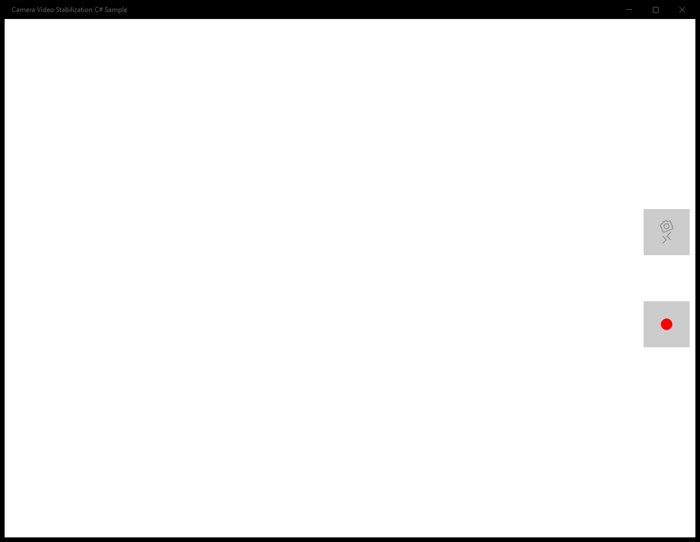

# CameraVideoStabilization (C#)

> **Source**: `Samples\CameraVideoStabilization\cs\`  
> **AUMID**: `Microsoft.SDKSamples.CameraVideoStabilization.CS_8wekyb3d8bbwe!App`  
> **PackageFamilyName**: `Microsoft.SDKSamples.CameraVideoStabilization.CS_8wekyb3d8bbwe`  

## Sample purpose
An end-to-end sample video recording camera application with video stabilization.

## Scenarios demonstrated (from README)
- **Manage the MediaCapture object** throughout the lifecycle of the app and through navigation events.
- **Acquire a camera located on a specific side of the device**. In this case, the sample attempts to get the rear camera.
- **Start and stop the preview** to a UI element, including mirroring for front-facing cameras.
- **Record a video** to a file in the correct orientation (portrait and landscape).
- **Handle rotation events** for both, the device moving in space and the page orientation changing on the screen. Also apply any necessary corrections to the preview stream rotation.
- **Handle MediaCapture RecordLimitationExceeded and Failed events** to be notified that video recording needs to be stopped due to a video being too long, or clean up the MediaCapture instance when an error occurs.
- **Manage the Video Stabilization effect**, including creation, activation/deactivation, registering for the EnabledChanged event, and cleanup. Note that video stabilization is a very intensive task, which may not be possible to achieve on slower devices. In this case, the effect will disable itself so the captured video maintains a good framerate. When this happens, the sample will allow the user to re-enable it without having to restart the recording session.
- **Apply the Encoding Properties recommended by the Video Stabilization effect**, for better quality. On supported devices, this may lead to a larger resolution being configured on the "input" to the effect (by using MediaCapture.VideoDeviceController.SetMediaStreamPropertiesAsync()) to allow for some extra padding to crop as part of the stabilization process. Depending on that, the "output" may be reconfigured (by using a new MediaEncodingProfile that will be passed onto the MediaCapture.StartRecordToStorageFileAsync()) to match. This will result in a stabilized video that has the dimensions configured on the VideoDeviceController in the case that a suitable "padded" resolution is available) or in the case that it isn't, a video that is slightly smaller resolution. If the Video Stabilization recommendations are not applied, the resulting cropped video will be scaled back up to the original configuration of the VideoDeviceController, which may result in a loss of quality.

## Top-level UWP namespaces used
- `Windows.Devices.Enumeration.Panel.Back`
- `Windows.Devices.Enumeration.Panel.Unknown`
- `Windows.Devices.Enumeration.Panel.Front`
- `Windows.UI.ViewManagement.StatusBar`
- `Windows.UI.ViewManagement.StatusBar.GetForCurrentView`

## Build / deploy / capture status
- build: ok
- deploy: ok
- launch: ok
- capture: ok-generic
- uninstall: ok

## Main page

---

## MainPage (static analysis)

This sample is a single-page app (no scenario list). The MainPage covers the entire functionality.

### UI elements
- **CaptureElement**  - name="PreviewControl"
- **Button**  - name="VsToggleButton"; events: Click=VsToggleButton_Click
- **Button**  - name="VideoButton"; events: Click=VideoButton_Click

### Code behavior
- **`MainPage`**
    - API refs: `NavigationCacheMode.Disabled`, `Application.Current`
- **`Application_Suspending`**
    - API refs: `Frame.CurrentSourcePageType`, `SuspendingOperation.GetDeferral`
- **`Application_Resuming`**
    - API refs: `Frame.CurrentSourcePageType`
- **`SystemMediaControls_PropertyChanged`**
    - API refs: `Dispatcher.RunAsync`, `CoreDispatcherPriority.Normal`, `SystemMediaTransportControlsProperty.SoundLevel`, `Frame.CurrentSourcePageType`, `SoundLevel.Muted`
- **`OrientationSensor_OrientationChanged`**
    - API refs: `SimpleOrientation.Faceup`, `SimpleOrientation.Facedown`, `Dispatcher.RunAsync`, `CoreDispatcherPriority.Normal`
- **`DisplayInformation_OrientationChanged`**
    - API refs: `Dispatcher.RunAsync`, `CoreDispatcherPriority.Normal`
- **`VideoStabilizationEffect_EnabledChanged`**
    - API refs: `Dispatcher.RunAsync`, `CoreDispatcherPriority.Normal`, `Debug.WriteLine`
- **`MediaCapture_RecordLimitationExceeded`**
    - API refs: `Dispatcher.RunAsync`, `CoreDispatcherPriority.Normal`
- **`MediaCapture_Failed`**
    - API refs: `Debug.WriteLine`, `Dispatcher.RunAsync`, `CoreDispatcherPriority.Normal`
- **`InitializeCameraAsync`**
    - namespaces: `Windows.Devices.Enumeration.Panel.Back`, `Windows.Devices.Enumeration.Panel.Unknown`, `Windows.Devices.Enumeration.Panel.Front`
    - instantiates: `MediaCapture`
    - API refs: `Debug.WriteLine`, `Windows.Devices`, `Enumeration.Panel`, `MediaEncodingProfile.CreateMp4`, `VideoEncodingQuality.Auto`, `EnclosureLocation.Panel`
- **`StartPreviewAsync`**
    - API refs: `PreviewControl.Source`, `PreviewControl.FlowDirection`, `FlowDirection.RightToLeft`, `FlowDirection.LeftToRight`
- **`SetPreviewRotationAsync`**
    - API refs: `VideoDeviceController.GetMediaStreamProperties`, `MediaStreamType.VideoPreview`, `Properties.Add`
- **`StopPreviewAsync`**
    - API refs: `Dispatcher.RunAsync`, `CoreDispatcherPriority.Normal`, `PreviewControl.Source`
- **`CreateVideoStabilizationEffectAsync`**
    - instantiates: `VideoStabilizationEffectDefinition`
    - API refs: `MediaStreamType.VideoRecord`, `Debug.WriteLine`
- **`SetUpVideoStabilizationRecommendationAsync`**
    - API refs: `Debug.WriteLine`, `VideoDeviceController.GetMediaStreamProperties`, `MediaStreamType.VideoRecord`, `VideoDeviceController.SetMediaStreamPropertiesAsync`
- **`CleanUpVideoStabilizationEffectAsync`**
    - API refs: `Debug.WriteLine`, `VideoDeviceController.SetMediaStreamPropertiesAsync`, `MediaStreamType.VideoRecord`
- **`StartRecordingAsync`**
    - API refs: `CreationCollisionOption.GenerateUniqueName`, `Video.Properties`, `PropertyValue.CreateInt32`, `Debug.WriteLine`
- **`StopRecordingAsync`**
    - API refs: `Debug.WriteLine`
- **`CleanupCameraAsync`**
    - API refs: `Debug.WriteLine`, `MediaCapture.Dispose`
- **`SetupUiAsync`**
    - namespaces: `Windows.UI.ViewManagement.StatusBar`, `Windows.UI.ViewManagement.StatusBar.GetForCurrentView`
    - API refs: `DisplayInformation.AutoRotationPreferences`, `DisplayOrientations.Landscape`, `ApiInformation.IsTypePresent`, `Windows.UI`, `ViewManagement.StatusBar`, `StorageLibrary.GetLibraryAsync`, `KnownLibraryId.Pictures`, `ApplicationData.Current`
- **`CleanupUiAsync`**
    - namespaces: `Windows.UI.ViewManagement.StatusBar`, `Windows.UI.ViewManagement.StatusBar.GetForCurrentView`
    - API refs: `ApiInformation.IsTypePresent`, `Windows.UI`, `ViewManagement.StatusBar`, `DisplayInformation.AutoRotationPreferences`, `DisplayOrientations.None`
- **`UpdateCaptureControls`**
    - API refs: `VideoButton.IsEnabled`, `VsToggleButton.IsEnabled`, `StartRecordingIcon.Visibility`, `Visibility.Collapsed`, `Visibility.Visible`, `StopRecordingIcon.Visibility`, `VsOnIcon.Visibility`, `VsOffIcon.Visibility`
- **`FindCameraDeviceByPanelAsync`**
    - API refs: `DeviceInformation.FindAllAsync`, `DeviceClass.VideoCapture`, `EnclosureLocation.Panel`
- **`GetCameraOrientation`**
    - API refs: `SimpleOrientation.NotRotated`, `DisplayOrientations.Portrait`, `SimpleOrientation.Rotated90DegreesCounterclockwise`, `SimpleOrientation.Rotated180DegreesCounterclockwise`, `SimpleOrientation.Rotated270DegreesCounterclockwise`
- **`ConvertDeviceOrientationToDegrees`**
    - API refs: `SimpleOrientation.Rotated90DegreesCounterclockwise`, `SimpleOrientation.Rotated180DegreesCounterclockwise`, `SimpleOrientation.Rotated270DegreesCounterclockwise`, `SimpleOrientation.NotRotated`
- **`ConvertDisplayOrientationToDegrees`**
    - API refs: `DisplayOrientations.Portrait`, `DisplayOrientations.LandscapeFlipped`, `DisplayOrientations.PortraitFlipped`, `DisplayOrientations.Landscape`
- **`ConvertOrientationToPhotoOrientation`**
    - API refs: `SimpleOrientation.Rotated90DegreesCounterclockwise`, `PhotoOrientation.Rotate90`, `SimpleOrientation.Rotated180DegreesCounterclockwise`, `PhotoOrientation.Rotate180`, `SimpleOrientation.Rotated270DegreesCounterclockwise`, `PhotoOrientation.Rotate270`, `SimpleOrientation.NotRotated`, `PhotoOrientation.Normal`
- **`UpdateButtonOrientation`**
    - API refs: `DisplayOrientations.Portrait`, `VsToggleButton.RenderTransform`, `VideoButton.RenderTransform`

