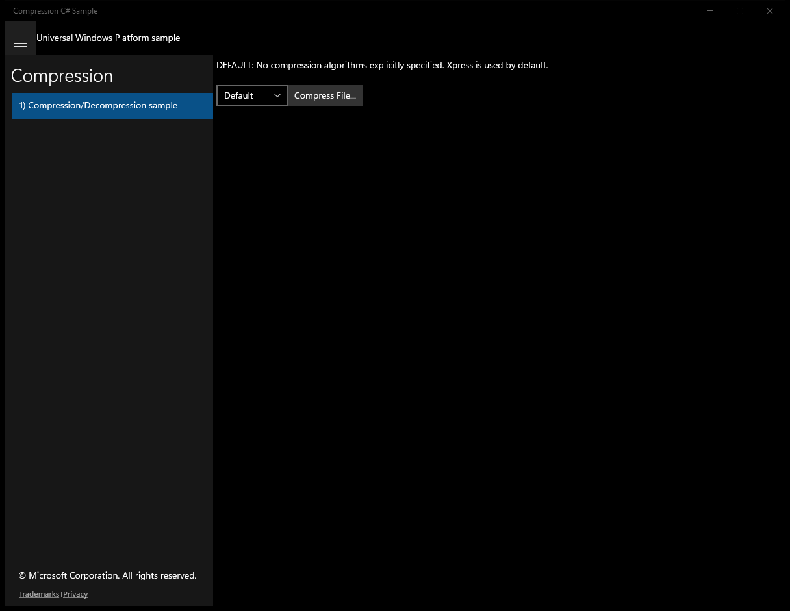
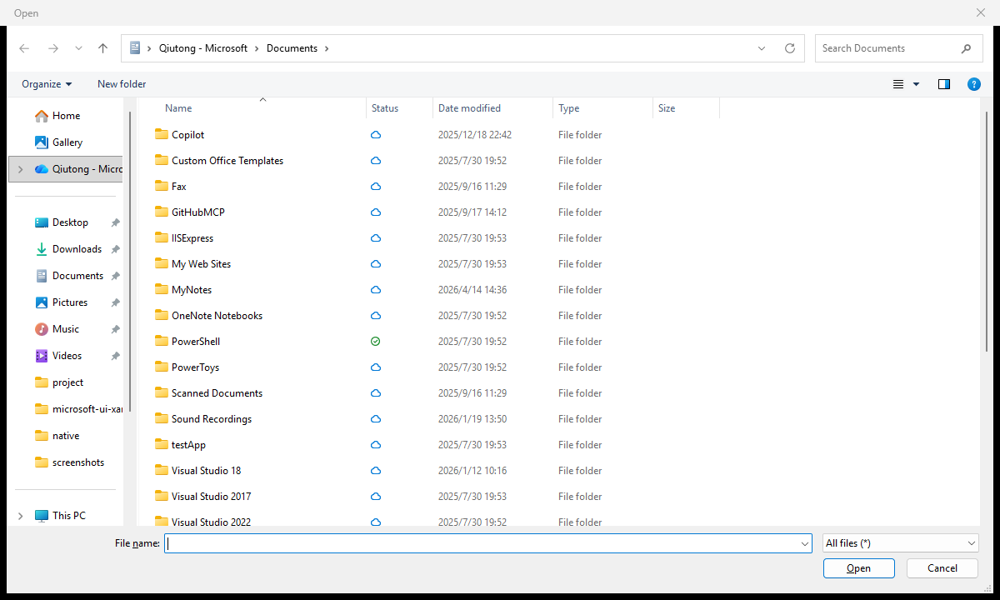
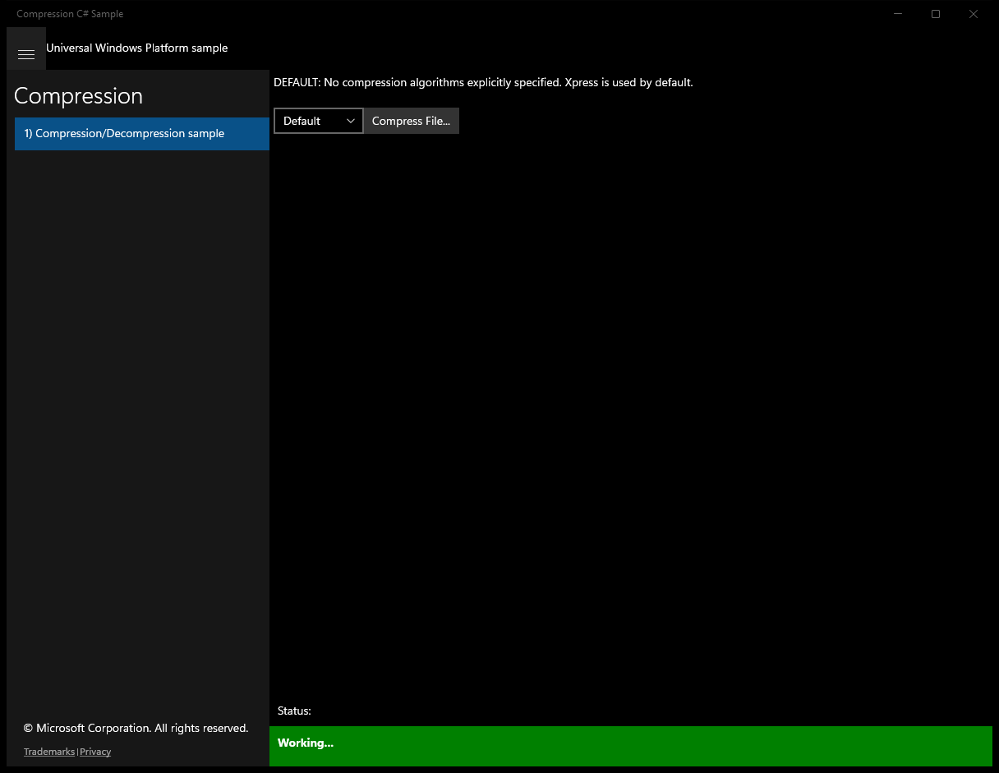

# Compression (C#)

> **Source**: `Samples\Compression\cs\`  
> **Feature**: Compression  
> **AUMID**: `Microsoft.SDKSamples.Compression.CS_8wekyb3d8bbwe!App`  
> **PackageFamilyName**: `Microsoft.SDKSamples.Compression.CS_8wekyb3d8bbwe`  

## Build / deploy / capture status
- build: ok
- deploy: ok
- launch: ok
- capture: ok
- uninstall: ok

## Main page

---

## Scenario 1 - 1) Compression/Decompression sample

### Screenshots
Initial state:

After click **Compress File...** (popup: Open):

After click **Compress File...**:

