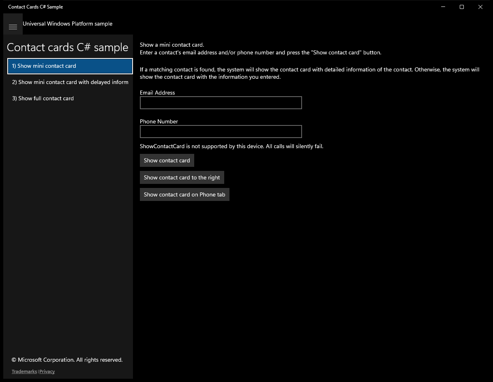
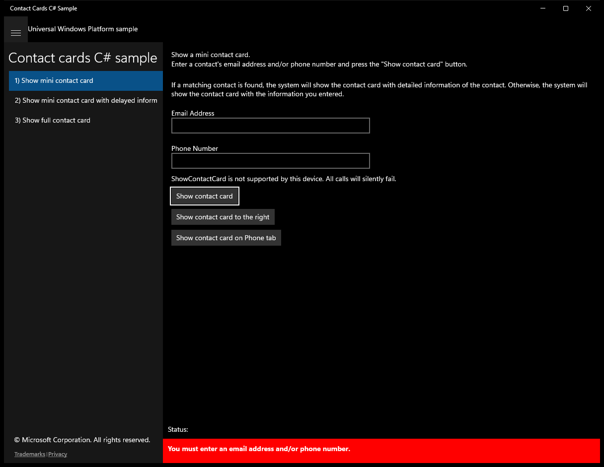
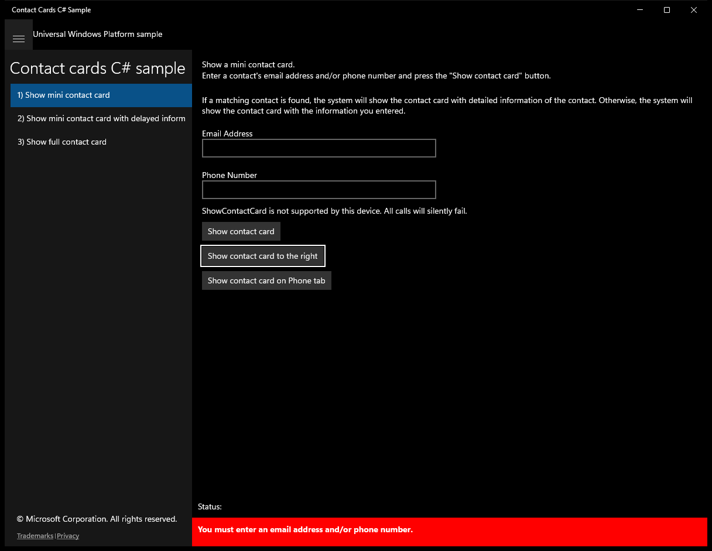
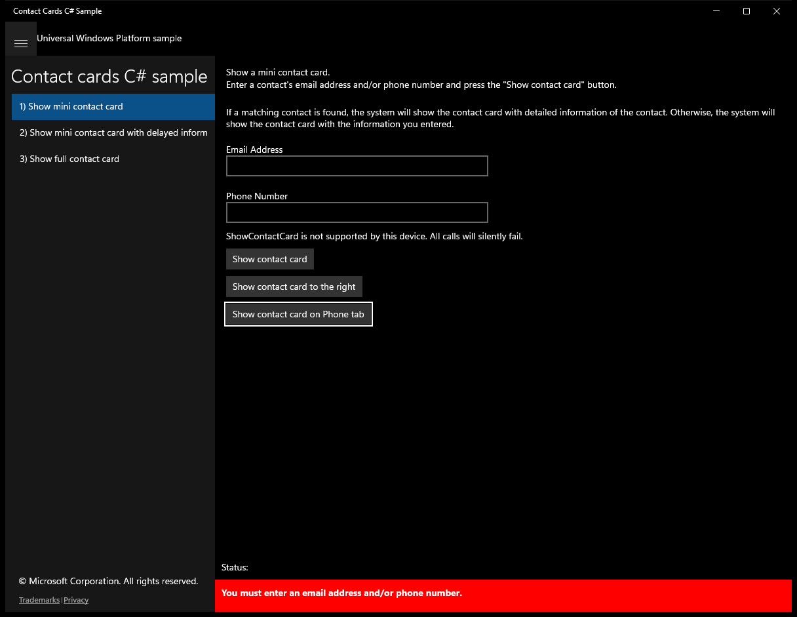
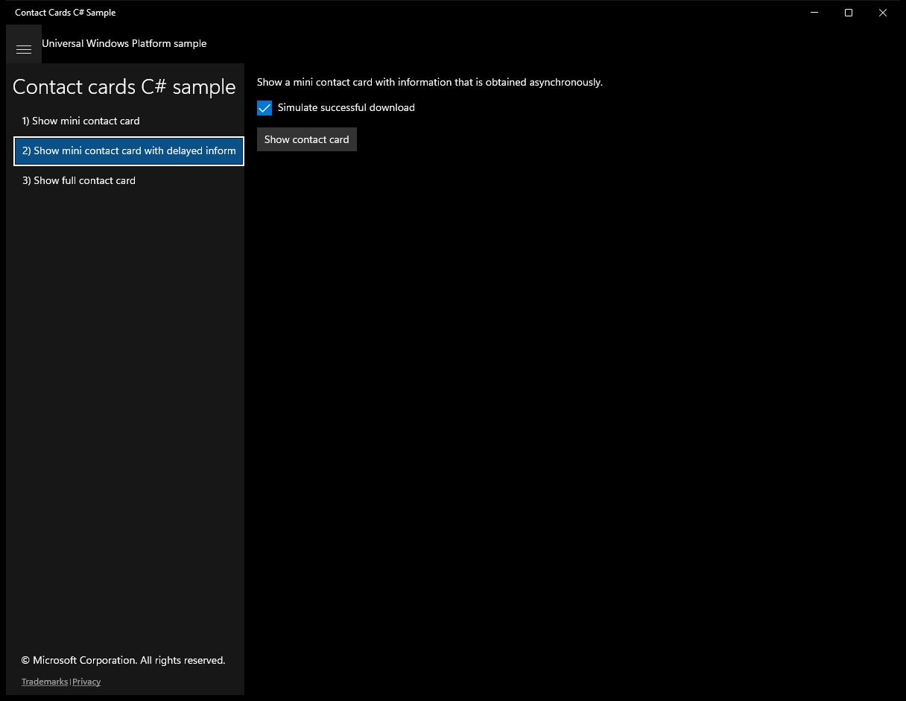
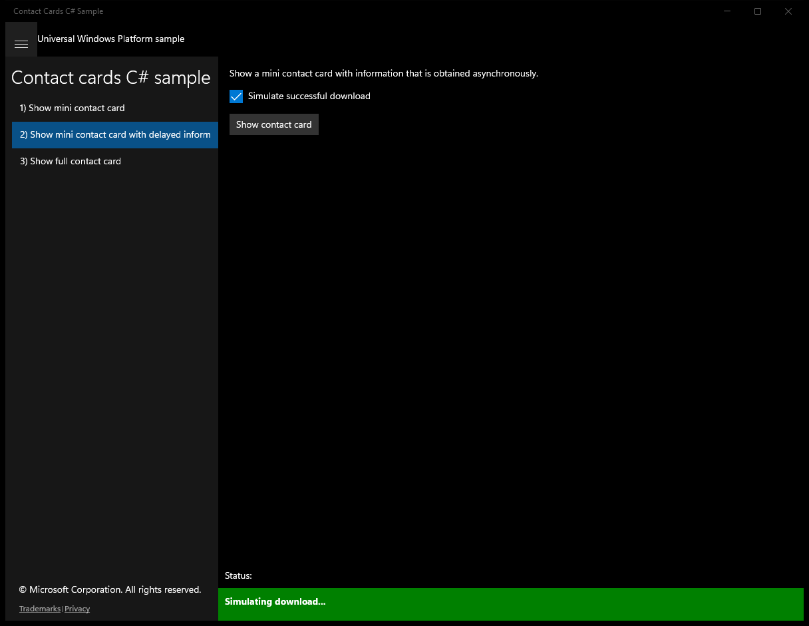
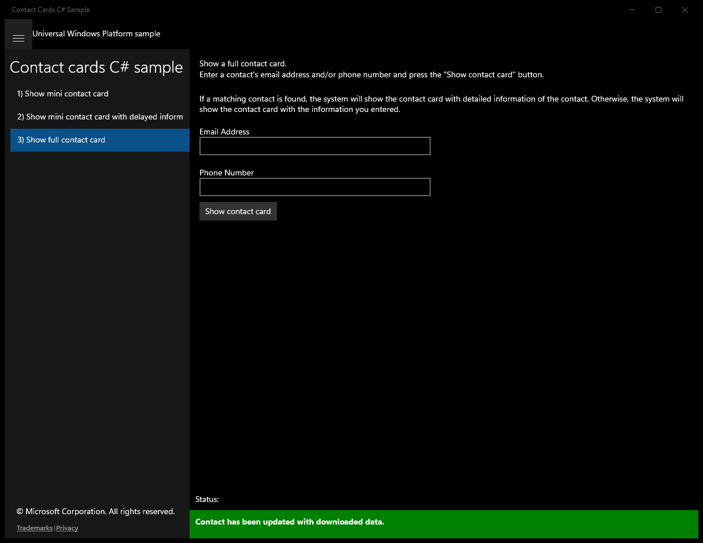
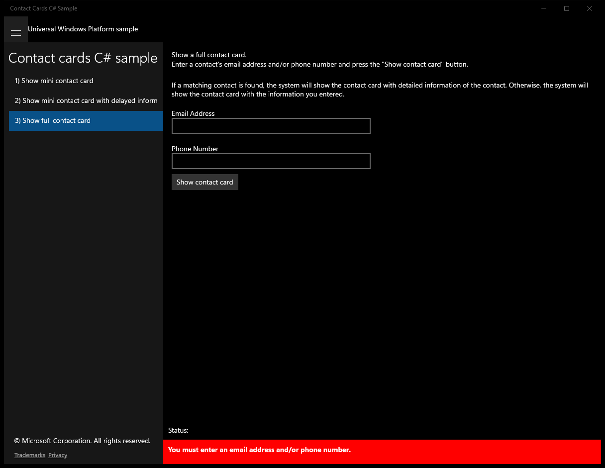

#  (C#)

> **Source**: `Samples\\cs\`  
> **Feature**: Contact cards C# sample  
> **AUMID**: `Microsoft.SDKSamples.ContactCards.CS_8wekyb3d8bbwe!App`  
> **PackageFamilyName**: `Microsoft.SDKSamples.ContactCards.CS_8wekyb3d8bbwe`  

## Sample purpose
Shows how to display contact cards.

## Build / deploy / capture status
- build: skipped
- deploy: ok
- launch: ok
- capture: ok
- uninstall: ok

## Main page

---

## Scenario 1 - Show mini contact card

**Description**: Show a mini contact card.

### UI elements
- **TextBlock**  - text="Show a mini contact card."
- **TextBlock**  - text="Enter a contact's email address and/or phone number and press the "Show contact card" button."
- **TextBlock**  - text="If a matching contact is found, the system will show the contact card with detailed information of the contact. Otherwise, the system will show the contact card with the information you entered."
- **TextBlock**  - text="Email Address"
- **TextBox**  - x:Name="EmailAddress"
- **TextBlock**  - text="Phone Number"
- **TextBox**  - x:Name="PhoneNumber"
- **TextBlock**  - x:Name="NotSupportedWarning"; text="ShowContactCard is not supported by this device. All calls will silently fail."
- **Button**  - content="Show contact card"; events: Click=ShowContactCard_Click
- **Button**  - content="Show contact card to the right"; events: Click=ShowContactCardWithPlacement_Click
- **Button**  - content="Show contact card on Phone tab"; events: Click=ShowContactCardWithOptions_Click

### Code behavior
- **`OnNavigatedTo`**
    - API refs: `ContactManager.IsShowContactCardSupported`, `NotSupportedWarning.Visibility`, `Visibility.Visible`
- **`ShowContactCard_Click`**
    - API refs: `MainPage.GetElementRect`, `ContactManager.ShowContactCard`
- **`ShowContactCardWithPlacement_Click`**
    - API refs: `MainPage.GetElementRect`, `ContactManager.ShowContactCard`, `Placement.Right`
- **`ShowContactCardWithOptions_Click`**
    - instantiates: `ContactCardOptions`
    - API refs: `MainPage.GetElementRect`, `ContactCardTabKind.Phone`, `ContactManager.ShowContactCard`, `Placement.Default`
- **`ContactCardOptions`**
    - API refs: `ContactCardTabKind.Phone`

### Screenshots
Initial state:

After click **Show contact card**:

After click **Show contact card to the right**:

After click **Show contact card on Phone tab**:

---

## Scenario 2 - Show mini contact card with delayed information

**Description**: Show a mini contact card with information that is obtained asynchronously.

### UI elements
- **TextBlock**  - text="Show a mini contact card with information that is obtained asynchronously."
- **TextBlock**  - x:Name="NotSupportedWarning"; text="ShowDelayLoadedContactCard is not supported by this device."
- **CheckBox**  - x:Name="DownloadSucceeded"; content="Simulate successful download"
- **Button**  - content="Show contact card"; events: Click=ShowContactCard_Click

### Code behavior
- **`OnNavigatedTo`**
    - API refs: `ContactManager.IsShowDelayLoadedContactCardSupported`, `NotSupportedWarning.Visibility`, `Visibility.Visible`
- **`CreatePlaceholderContact`**
    - instantiates: `Contact`, `ContactEmail`
    - API refs: `Emails.Add`
- **`DownloadContactDataAsync`**
    - instantiates: `ContactEmail`, `ContactPhone`, `ContactAddress`
    - API refs: `Task.Delay`, `DownloadSucceeded.IsChecked`, `ContactEmailKind.Work`, `Emails.Add`, `ContactPhoneKind.Home`, `Phones.Add`, `ContactPhoneKind.Work`, `ContactPhoneKind.Mobile`, `ContactAddressKind.Home`, `Addresses.Add`
- **`ShowContactCard_Click`**
    - instantiates: `ContactCardOptions`
    - API refs: `MainPage.GetElementRect`, `Placement.Below`, `ContactCardHeaderKind.Enterprise`, `ContactManager.ShowDelayLoadedContactCard`, `NotifyType.StatusMessage`, `NotifyType.ErrorMessage`
- **`ContactCardOptions`**
    - API refs: `ContactCardHeaderKind.Enterprise`

### Screenshots
Initial state:

After click **Show contact card**:

---

## Scenario 3 - Show full contact card

**Description**: Show a full contact card.

### UI elements
- **TextBlock**  - text="Show a full contact card."
- **TextBlock**  - text="Enter a contact's email address and/or phone number and press the "Show contact card" button."
- **TextBlock**  - text="If a matching contact is found, the system will show the contact card with detailed information of the contact. Otherwise, the system will show the contact card with the information you entered."
- **TextBlock**  - text="Email Address"
- **TextBox**  - x:Name="EmailAddress"
- **TextBlock**  - text="Phone Number"
- **TextBox**  - x:Name="PhoneNumber"
- **Button**  - content="Show contact card"; events: Click=ShowContactCard_Click

### Code behavior
- **`ShowContactCard_Click`**
    - instantiates: `FullContactCardOptions`
    - API refs: `ViewSizePreference.UseHalf`, `ContactManager.ShowFullContactCard`

### Screenshots
Initial state:

After click **Show contact card**:

