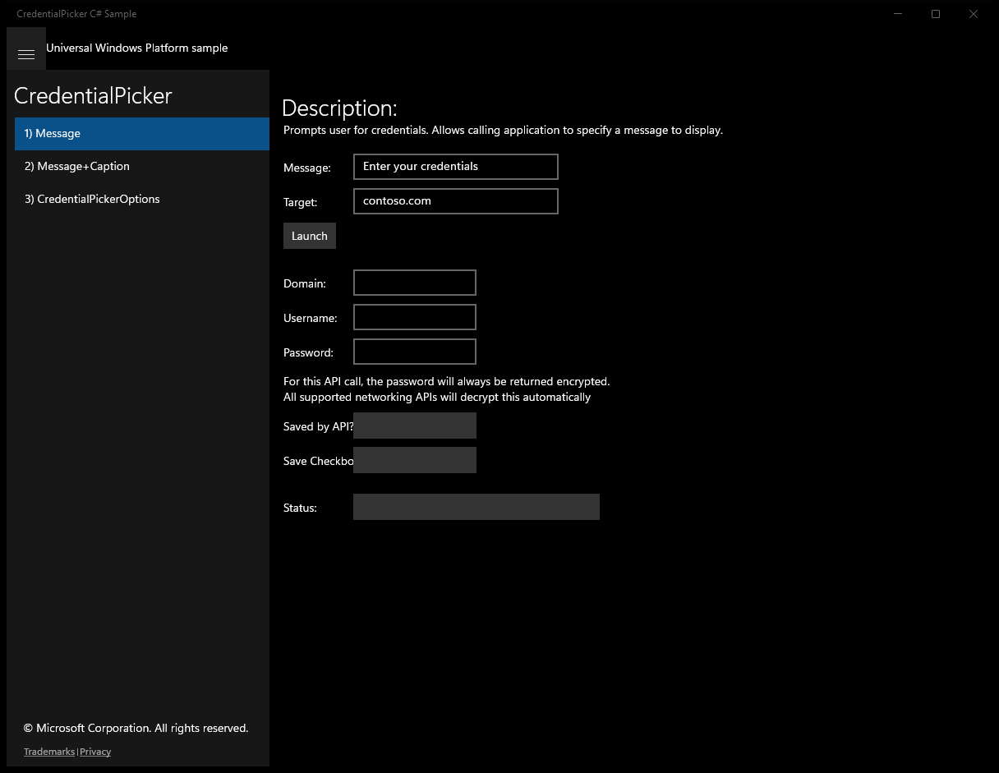
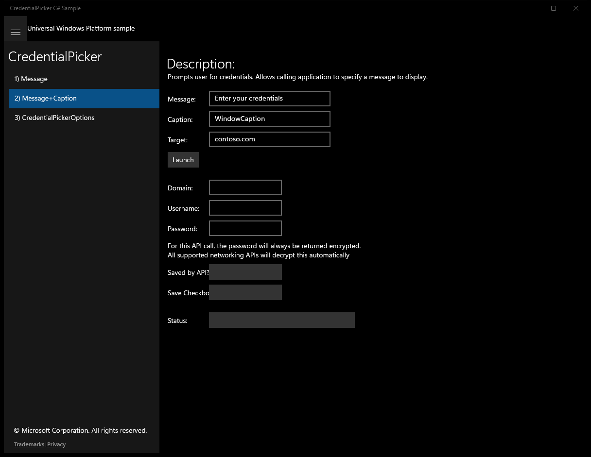
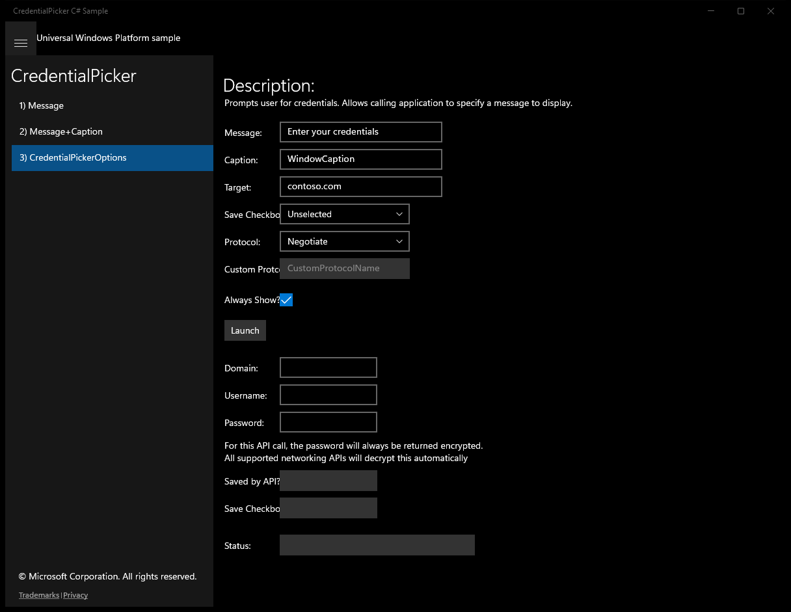

# CredentialPicker (C#)

> **Source**: `Samples\CredentialPicker\cs\`  
> **Feature**: CredentialPicker  
> **AUMID**: `Microsoft.SDKSamples.CredentialPicker.CS_8wekyb3d8bbwe!App`  
> **PackageFamilyName**: `Microsoft.SDKSamples.CredentialPicker.CS_8wekyb3d8bbwe`  

## Top-level UWP namespaces used
- `Windows.Security.Credentials.UI.CredentialPicker.PickAsync`
- `Windows.UI.Xaml.Visibility.Visible`
- `Windows.UI.Xaml.Visibility.Collapsed`

## Build / deploy / capture status
- build: ok
- deploy: ok
- launch: ok
- capture: ok
- uninstall: ok

## Main page

---

## Scenario 1 - Message

**Description**: Prompts user for credentials. Allows calling application to specify a message to display.

### UI elements
- **TextBlock**  - text="Description:"
- **TextBlock**  - text="Prompts user for credentials. Allows calling application to specify a message to display."
- **TextBlock**  - x:Name="MessageLabel"; text="Message:"
- **TextBox**  - x:Name="Message"; text="Enter your credentials"
- **TextBlock**  - x:Name="TargetLabel"; text="Target:"
- **TextBox**  - x:Name="Target"; text="contoso.com"
- **Button**  - x:Name="Launch"; content="Launch"; events: Click=Launch_Click
- **TextBlock**  - text="Domain:"
- **TextBox**  - x:Name="Domain"
- **TextBlock**  - text="Username:"
- **TextBox**  - x:Name="Username"
- **TextBlock**  - text="Password:"
- **TextBox**  - x:Name="Password"
- **TextBlock**  - x:Name="PasswordExplain1"; text="For this API call, the password will always be returned encrypted."
- **TextBlock**  - x:Name="PasswordExplain2"; text="All supported networking APIs will decrypt this automatically"
- **TextBlock**  - text="Saved by API?"
- **TextBox**  - x:Name="CredentialSaved"
- **TextBlock**  - text="Save Checkbox:"
- **TextBox**  - x:Name="CheckboxState"
- **TextBlock**  - text="Status:"
- **TextBox**  - x:Name="Status"
- **TextBlock**  - x:Name="StatusBlock"

### Code behavior
- **`SetError`**
    - API refs: `NotifyType.ErrorMessage`
- **`SetResult`**
    - API refs: `Status.Text`, `String.Format`, `Domain.Text`, `Username.Text`, `Password.Text`, `CredentialSaved.Text`, `CredentialSaveOption.Hidden`, `CheckboxState.Text`, `CredentialSaveOption.Selected`, `CredentialSaveOption.Unselected`
- **`Launch_Click`**
    - namespaces: `Windows.Security.Credentials.UI.CredentialPicker.PickAsync`
    - API refs: `Target.Text`, `Message.Text`, `Windows.Security`, `Credentials.UI`, `CredentialPicker.PickAsync`

### Screenshots
Initial state:

> Button **Launch** skipped (blocklist)

---

## Scenario 2 - Message+Caption

**Description**: Prompts user for credentials. Allows calling application to specify a message to display.

### UI elements
- **TextBlock**  - text="Description:"
- **TextBlock**  - text="Prompts user for credentials. Allows calling application to specify a message to display."
- **TextBlock**  - text="Message:"
- **TextBox**  - x:Name="Message"; text="Enter your credentials"
- **TextBlock**  - text="Caption:"
- **TextBox**  - x:Name="Caption"; text="WindowCaption"
- **TextBlock**  - text="Target:"
- **TextBox**  - x:Name="Target"; text="contoso.com"
- **Button**  - x:Name="Launch"; content="Launch"; events: Click=Launch_Click
- **TextBlock**  - text="Domain:"
- **TextBox**  - x:Name="Domain"
- **TextBlock**  - text="Username:"
- **TextBox**  - x:Name="Username"
- **TextBlock**  - text="Password:"
- **TextBox**  - x:Name="Password"
- **TextBlock**  - x:Name="PasswordExplain1"; text="For this API call, the password will always be returned encrypted."
- **TextBlock**  - x:Name="PasswordExplain2"; text="All supported networking APIs will decrypt this automatically"
- **TextBlock**  - text="Saved by API?"
- **TextBox**  - x:Name="CredentialSaved"
- **TextBlock**  - text="Save Checkbox:"
- **TextBox**  - x:Name="CheckboxState"
- **TextBlock**  - text="Status:"
- **TextBox**  - x:Name="Status"
- **TextBlock**  - x:Name="StatusBlock"

### Code behavior
- **`SetError`**
    - API refs: `NotifyType.ErrorMessage`
- **`SetResult`**
    - API refs: `Status.Text`, `String.Format`, `Domain.Text`, `Username.Text`, `Password.Text`, `CredentialSaved.Text`, `CredentialSaveOption.Hidden`, `CheckboxState.Text`, `CredentialSaveOption.Selected`, `CredentialSaveOption.Unselected`
- **`Launch_Click`**
    - namespaces: `Windows.Security.Credentials.UI.CredentialPicker.PickAsync`
    - API refs: `Target.Text`, `Message.Text`, `Caption.Text`, `Windows.Security`, `Credentials.UI`, `CredentialPicker.PickAsync`

### Screenshots
Initial state:

> Button **Launch** skipped (blocklist)

---

## Scenario 3 - CredentialPickerOptions

**Description**: Prompts user for credentials. Allows calling application to specify a message to display.

### UI elements
- **TextBlock**  - text="Description:"
- **TextBlock**  - text="Prompts user for credentials. Allows calling application to specify a message to display."
- **TextBlock**  - text="Message:"
- **TextBox**  - x:Name="Message"; text="Enter your credentials"
- **TextBlock**  - text="Caption:"
- **TextBox**  - x:Name="Caption"; text="WindowCaption"
- **TextBlock**  - text="Target:"
- **TextBox**  - x:Name="Target"; text="contoso.com"
- **TextBlock**  - text="Save Checkbox:"
- **ComboBox**  - x:Name="SaveCheckboxSelection"
- **TextBlock**  - text="Protocol:"
- **ComboBox**  - x:Name="ProtocolSelection"; events: SelectionChanged=Protocol_SelectionChanged
- **TextBlock**  - text="Custom Protcol:"
- **TextBox**  - x:Name="CustomProtocol"; text="CustomProtocolName"
- **TextBlock**  - text="Always Show?"
- **CheckBox**  - x:Name="AlwaysShowDialog"
- **Button**  - x:Name="Launch"; content="Launch"; events: Click=Launch_Click
- **TextBlock**  - text="Domain:"
- **TextBox**  - x:Name="Domain"
- **TextBlock**  - text="Username:"
- **TextBox**  - x:Name="Username"
- **TextBlock**  - text="Password:"
- **TextBox**  - x:Name="Password"
- **TextBlock**  - x:Name="PasswordExplain1"; text="For this API call, the password will always be returned encrypted."
- **TextBlock**  - x:Name="PasswordExplain2"; text="All supported networking APIs will decrypt this automatically"
- **TextBlock**  - text="Saved by API?"
- **TextBox**  - x:Name="CredentialSaved"
- **TextBlock**  - text="Save Checkbox:"
- **TextBox**  - x:Name="CheckboxState"
- **TextBlock**  - text="Status:"
- **TextBox**  - x:Name="Status"
- **TextBlock**  - x:Name="StatusBlock"

### Code behavior
- **`SetError`**
    - API refs: `NotifyType.ErrorMessage`
- **`SetPasswordExplainVisibility`**
    - namespaces: `Windows.UI.Xaml.Visibility.Visible`, `Windows.UI.Xaml.Visibility.Collapsed`
    - API refs: `PasswordExplain1.Visibility`, `Windows.UI`, `Xaml.Visibility`, `PasswordExplain2.Visibility`
- **`SetResult`**
    - API refs: `Status.Text`, `String.Format`, `Domain.Text`, `Username.Text`, `Password.Text`, `CredentialSaved.Text`, `CredentialSaveOption.Hidden`, `CheckboxState.Text`, `CredentialSaveOption.Selected`, `CredentialSaveOption.Unselected`
- **`Launch_Click`**
    - namespaces: `Windows.Security.Credentials.UI.CredentialPicker.PickAsync`
    - instantiates: `CredentialPickerOptions`
    - API refs: `Target.Text`, `Message.Text`, `Caption.Text`, `AlwaysShowDialog.IsChecked`, `ProtocolSelection.SelectedItem`, `AuthenticationProtocol.Negotiate`, `Content.ToString`, `StringComparison.CurrentCultureIgnoreCase`, `AuthenticationProtocol.Kerberos`, `AuthenticationProtocol.Ntlm`, `AuthenticationProtocol.CredSsp`, `AuthenticationProtocol.Basic`, `AuthenticationProtocol.Digest`, `CustomProtocol.Text`, `String.Empty`, `AuthenticationProtocol.Custom`, `NotifyType.ErrorMessage`, `SaveCheckboxSelection.SelectedItem`, `CredentialSaveOption.Hidden`, `CredentialSaveOption.Selected`, `CredentialSaveOption.Unselected`, `Windows.Security`, `Credentials.UI`, `CredentialPicker.PickAsync`
- **`Protocol_SelectionChanged`**
    - API refs: `ProtocolSelection.SelectedItem`, `Content.ToString`, `StringComparison.CurrentCultureIgnoreCase`, `CustomProtocol.IsEnabled`

### Screenshots
Initial state:

> Button **Launch** skipped (blocklist)

