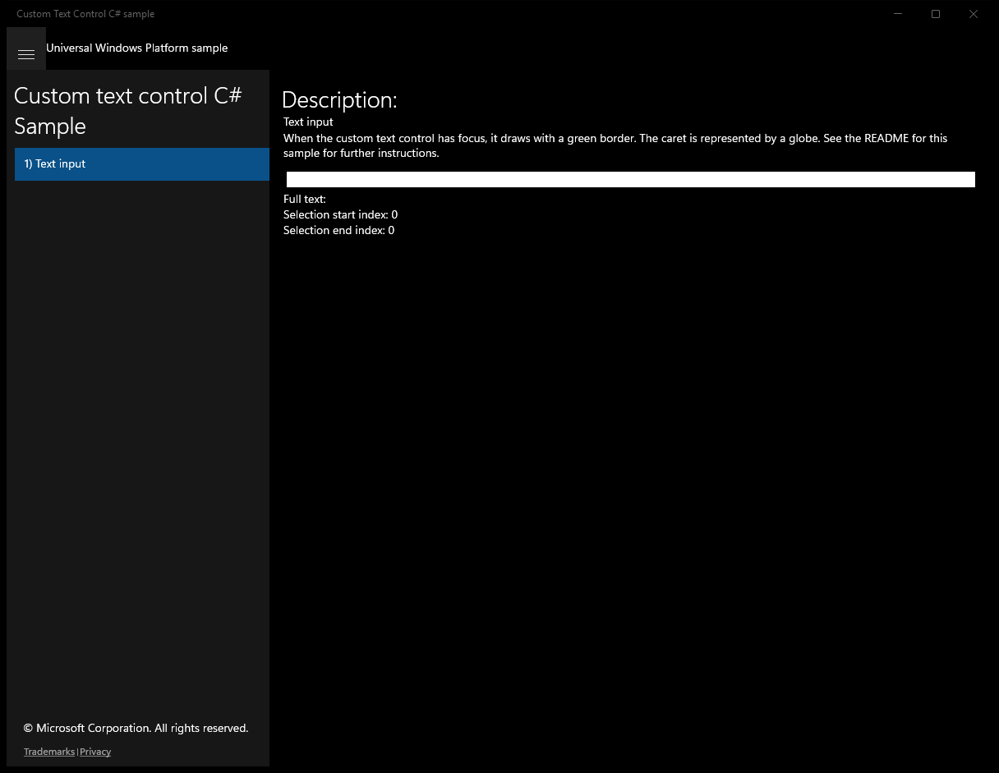
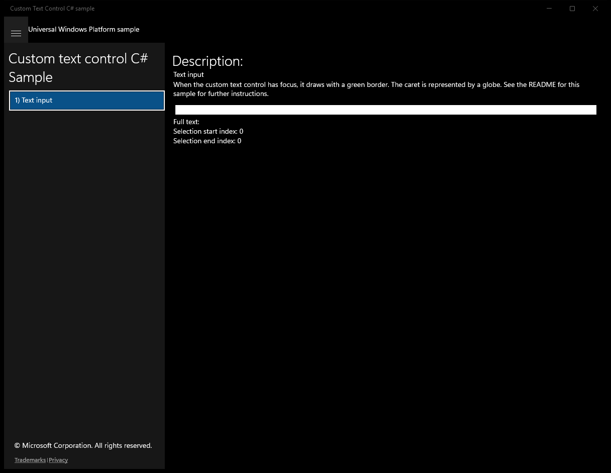

#  (C#)

> **Source**: `Samples\\cs\`  
> **Feature**: Custom text control C# Sample  
> **AUMID**: `Microsoft.SDKSamples.CustomEditControl.CS_8wekyb3d8bbwe!CustomEditControl.App`  
> **PackageFamilyName**: `Microsoft.SDKSamples.CustomEditControl.CS_8wekyb3d8bbwe`  

## Sample purpose
Shows how to use the CoreTextEditContext class to create a rudimentary text control.

## Build / deploy / capture status
- build: skipped
- deploy: ok
- launch: ok
- capture: ok
- uninstall: ok

## Main page

---

## Scenario 1 - Text input

### UI elements
- **TextBlock**  - text="Description:"
- **TextBlock**  - text="Text input"
- **TextBlock**  - text="When the custom text control has focus, it draws with a green border. The caret is represented by a globe. See the README for this sample for further instructions."

### Code behavior
- **`Page_PointerPressed`**
    - API refs: `EditControl.GetLayout`, `CurrentPoint.Position`, `EditControl.Focus`, `FocusState.Programmatic`
- **`OnNavigatingFrom`**
    - API refs: `CoreWindow.GetForCurrentThread`

### Screenshots
Initial state:

