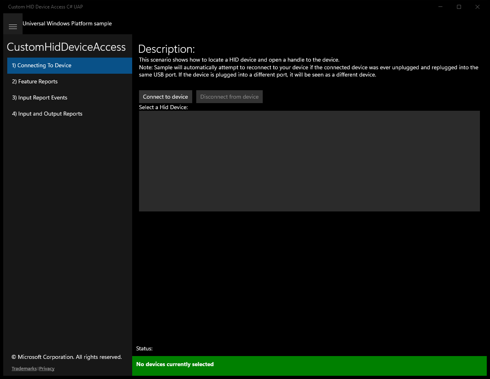
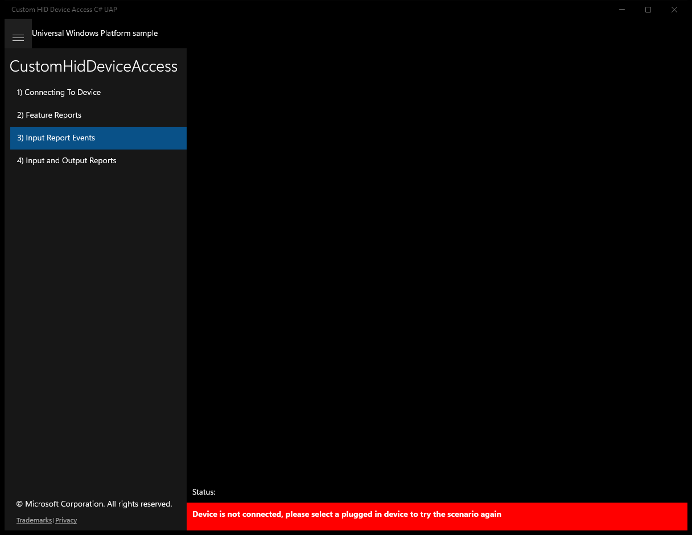
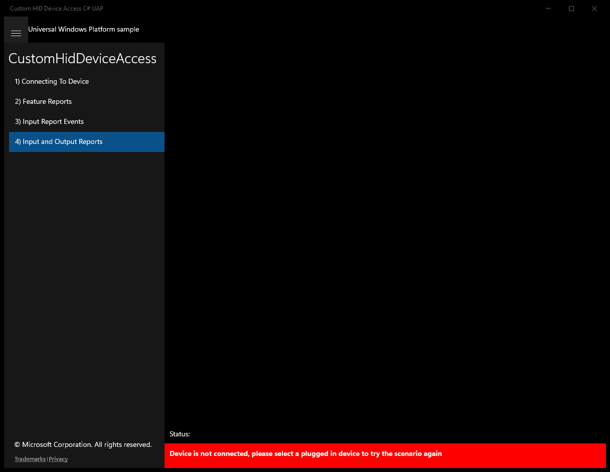

# CustomHidDeviceAccess (C#)

> **Source**: `Samples\CustomHidDeviceAccess\cs\`  
> **Feature**: CustomHidDeviceAccess  
> **AUMID**: `Microsoft.SDKSamples.CustomHidDeviceAccess.CS_8wekyb3d8bbwe!CustomHidDeviceAccess.App`  
> **PackageFamilyName**: `Microsoft.SDKSamples.CustomHidDeviceAccess.CS_8wekyb3d8bbwe`  

## Build / deploy / capture status
- build: ok
- deploy: ok
- launch: ok
- capture: ok
- uninstall: ok

## Main page

---

## Scenario 1 - Scenario1_DeviceConnect

**Description**: This scenario shows how to locate a HID device and open a handle to the device.

### UI elements
- **TextBlock**  - text="Description:"
- **Button**  - x:Name="ButtonConnectToDevice"; content="Connect to device"; events: Click=ConnectToDevice_Click
- **Button**  - x:Name="ButtonDisconnectFromDevice"; content="Disconnect from device"; events: Click=DisconnectFromDevice_Click
- **TextBlock**  - text="Select a Hid Device:"
- **ListBox**  - x:Name="ConnectDevices"
- **TextBlock**  - text="{Binding InstanceId}"
- **TextBlock**  - x:Name="StatusBlock"

### Code behavior
- **`OnNavigatedTo`**
    - API refs: `EventHandlerForDevice.Current`, `DeviceListSource.Source`
- **`OnNavigatedFrom`**
    - API refs: `EventHandlerForDevice.Current`
- **`ConnectToDevice_Click`**
    - API refs: `ConnectDevices.SelectedItems`, `EventHandlerForDevice.CreateNewEventHandlerForDevice`, `EventHandlerForDevice.Current`
- **`DisconnectFromDevice_Click`**
    - API refs: `ConnectDevices.SelectedItems`, `EventHandlerForDevice.Current`, `ButtonDisconnectFromDevice.Content`
- **`InitializeDeviceWatchers`**
    - API refs: `HidDevice.GetDeviceSelector`, `SuperMutt.Device`, `DeviceInformation.CreateWatcher`
- **`StartHandlingAppEvents`**
    - instantiates: `SuspendingEventHandler`, `EventHandler`
    - API refs: `App.Current`
- **`StopHandlingAppEvents`**
    - API refs: `App.Current`
- **`StartDeviceWatchers`**
    - API refs: `DeviceWatcherStatus.Started`, `DeviceWatcherStatus.EnumerationCompleted`
- **`StopDeviceWatchers`**
    - API refs: `DeviceWatcherStatus.Started`, `DeviceWatcherStatus.EnumerationCompleted`
- **`FindDevice`**
    - API refs: `DeviceInformation.Id`
- **`OnDeviceRemoved`**
    - instantiates: `DispatchedHandler`
    - API refs: `Dispatcher.RunAsync`, `CoreDispatcherPriority.Normal`, `NotifyType.StatusMessage`
- **`OnDeviceAdded`**
    - instantiates: `DispatchedHandler`
    - API refs: `Dispatcher.RunAsync`, `CoreDispatcherPriority.Normal`, `NotifyType.StatusMessage`
- **`OnDeviceEnumerationComplete`**
    - instantiates: `DispatchedHandler`
    - API refs: `Dispatcher.RunAsync`, `CoreDispatcherPriority.Normal`, `EventHandlerForDevice.Current`, `DeviceInformation.Id`, `ButtonDisconnectFromDevice.Content`, `NotifyType.StatusMessage`
- **`OnDeviceConnected`**
    - API refs: `ButtonDisconnectFromDevice.Content`, `EventHandlerForDevice.Current`, `DeviceInformation.Id`, `NotifyType.StatusMessage`
- **`OnDeviceClosing`**
    - instantiates: `DispatchedHandler`
    - API refs: `Dispatcher.RunAsync`, `CoreDispatcherPriority.Normal`, `ButtonDisconnectFromDevice.IsEnabled`, `EventHandlerForDevice.Current`, `ButtonDisconnectFromDevice.Content`
- **`SelectDeviceInList`**
    - API refs: `ConnectDevices.SelectedIndex`, `DeviceInformation.Id`
- **`UpdateConnectDisconnectButtonsAndList`**
    - API refs: `ButtonConnectToDevice.IsEnabled`, `ButtonDisconnectFromDevice.IsEnabled`, `ConnectDevices.IsEnabled`

### Screenshots
Initial state:

After click **Connect to device**:

---

## Scenario 2 - Scenario2_FeatureReports

### UI elements
- **TextBlock**  - x:Name="SuperMuttScenarioText"; text="This scenario demonstrates how to use feature report to set/get the LED blink pattern of the SuperMUTT device"
- **Button**  - x:Name="ButtonGetLedBlinkPattern"; content="Get Led Blink Pattern"; events: Click=GetLedBlinkPattern_Click
- **Button**  - x:Name="ButtonSetLedBlinkPattern"; content="Set Led Blink Pattern"; events: Click=SetLedBlinkPattern_Click
- **ComboBox**  - x:Name="LedBlinkPatternInput"
- **TextBlock**  - x:Name="StatusBlock"

### Code behavior
- **`OnNavigatedTo`**
    - instantiates: `Dictionary`
    - API refs: `DeviceType.SuperMutt`, `Utilities.SetUpDeviceScenarios`
- **`GetLedBlinkPattern_Click`**
    - API refs: `EventHandlerForDevice.Current`, `ButtonGetLedBlinkPattern.IsEnabled`, `Utilities.NotifyDeviceNotConnected`
- **`SetLedBlinkPattern_Click`**
    - API refs: `EventHandlerForDevice.Current`, `ButtonSetLedBlinkPattern.IsEnabled`, `LedBlinkPatternInput.SelectedIndex`, `Utilities.NotifyDeviceNotConnected`
- **`SetLedBlinkPatternAsync`**
    - instantiates: `DataWriter`
    - API refs: `EventHandlerForDevice.Current`, `Device.CreateFeatureReport`, `SuperMutt.LedPattern`, `Device.SendFeatureReportAsync`, `NotifyType.StatusMessage`
- **`GetLedBlinkPatternAsync`**
    - API refs: `EventHandlerForDevice.Current`, `Device.GetFeatureReportAsync`, `SuperMutt.LedPattern`, `Data.Length`, `DataReader.FromBuffer`, `NotifyType.StatusMessage`, `NotifyType.ErrorMessage`

### Screenshots
Initial state:

---

## Scenario 3 - Scenario3_InputReportEvents

### UI elements
- **TextBlock**  - x:Name="SuperMuttScenarioText"; text="This scenario shows how to register for an event using the HidDevice. If the device is disconnected and reconnected, you must reregister for the event because it is not automatically done."
- **Button**  - x:Name="ButtonRegisterForInputReportEvents"; content="Register For Event"; events: Click=RegisterForInputReportEvents_Click
- **Button**  - x:Name="ButtonUnregisterFromInputReportEvents"; content="Unregister From Event"; events: Click=UnregisterFromInputReportEvents_Click
- **TextBlock**  - x:Name="StatusBlock"

### Code behavior
- **`OnNavigatedTo`**
    - instantiates: `Dictionary`
    - API refs: `DeviceType.SuperMutt`, `Utilities.SetUpDeviceScenarios`, `EventHandlerForDevice.Current`
- **`OnNavigatedFrom`**
    - API refs: `EventHandlerForDevice.Current`
- **`OnDeviceClosing`**
    - instantiates: `DispatchedHandler`
    - API refs: `Dispatcher.RunAsync`, `CoreDispatcherPriority.Normal`
- **`RegisterForInputReportEvents_Click`**
    - API refs: `EventHandlerForDevice.Current`, `Utilities.NotifyDeviceNotConnected`
- **`UnregisterFromInputReportEvents_Click`**
    - API refs: `EventHandlerForDevice.Current`, `Utilities.NotifyDeviceNotConnected`
- **`StartSuperMuttInputReports`**
    - instantiates: `DataWriter`
    - API refs: `EventHandlerForDevice.Current`, `Device.CreateOutputReport`, `SuperMutt.DeviceInputReportControlInformation`, `Device.SendOutputReportAsync`
- **`StopSuperMuttInputReports`**
    - instantiates: `DataWriter`
    - API refs: `EventHandlerForDevice.Current`, `Device.CreateOutputReport`, `SuperMutt.DeviceInputReportControlInformation`, `Device.SendOutputReportAsync`
- **`OnInputReportEvent`**
    - instantiates: `DispatchedHandler`
    - API refs: `Dispatcher.RunAsync`, `CoreDispatcherPriority.Normal`, `NotifyType.StatusMessage`
- **`RegisterForInputReportEvents`**
    - instantiates: `TypedEventHandler`
    - API refs: `EventHandlerForDevice.Current`
- **`UnregisterFromInputReportEvent`**
    - API refs: `EventHandlerForDevice.Current`
- **`UpdateRegisterEventButtons`**
    - API refs: `ButtonRegisterForInputReportEvents.IsEnabled`, `ButtonUnregisterFromInputReportEvents.IsEnabled`

### Screenshots
Initial state:

---

## Scenario 4 - Scenario4_InputOutputReports

### UI elements
- **TextBlock**  - x:Name="SuperMuttScenarioText"; text="This scenario shows how to read and write to the device using input and output reports."
- **TextBlock**  - text="Numeric Values:"
- **Button**  - x:Name="ButtonSendNumericOutputReport"; content="Send Output Report"; events: Click=SendNumericOutputReport_Click
- **TextBlock**  - text="Value To Write:"
- **ComboBox**  - x:Name="NumericValueToWrite"
- **Button**  - x:Name="ButtonGetNumericInputReport"; content="Get Input Report"; events: Click=GetNumericInputReport_Click
- **TextBlock**  - text="Boolean Value for Button 1:"
- **Button**  - x:Name="ButtonSendBooleanOutputReport"; content="Send Output Report"; events: Click=SendBooleanOutputReport_Click
- **TextBlock**  - text="Bit Value:"
- **ComboBox**  - x:Name="BooleanValueToWrite"
- **Button**  - x:Name="ButtonGetBooleanInputReport"; content="Get Input Report"; events: Click=GetBooleanInputReport_Click
- **TextBlock**  - x:Name="StatusBlock"

### Code behavior
- **`OnNavigatedTo`**
    - instantiates: `Dictionary`
    - API refs: `DeviceType.SuperMutt`, `Utilities.SetUpDeviceScenarios`
- **`GetNumericInputReport_Click`**
    - API refs: `EventHandlerForDevice.Current`, `ButtonGetNumericInputReport.IsEnabled`, `Utilities.NotifyDeviceNotConnected`
- **`SendNumericOutputReport_Click`**
    - API refs: `EventHandlerForDevice.Current`, `ButtonSendNumericOutputReport.IsEnabled`, `NumericValueToWrite.SelectedIndex`, `Utilities.NotifyDeviceNotConnected`
- **`GetBooleanInputReport_Click`**
    - API refs: `EventHandlerForDevice.Current`, `ButtonGetBooleanInputReport.IsEnabled`, `Utilities.NotifyDeviceNotConnected`
- **`SendBooleanOutputReport_Click`**
    - API refs: `EventHandlerForDevice.Current`, `ButtonSendBooleanOutputReport.IsEnabled`, `BooleanValueToWrite.SelectedIndex`, `Utilities.NotifyDeviceNotConnected`
- **`GetNumericInputReportAsync`**
    - API refs: `EventHandlerForDevice.Current`, `Device.GetInputReportAsync`, `SuperMutt.ReadWriteBufferControlInformation`, `NotifyType.StatusMessage`
- **`SendNumericOutputReportAsync`**
    - instantiates: `DataWriter`
    - API refs: `EventHandlerForDevice.Current`, `Device.CreateOutputReport`, `SuperMutt.ReadWriteBufferControlInformation`, `Device.SendOutputReportAsync`, `NotifyType.StatusMessage`
- **`GetBooleanInputReportAsync`**
    - API refs: `EventHandlerForDevice.Current`, `Device.GetInputReportAsync`, `SuperMutt.ReadWriteBufferControlInformation`, `NotifyType.StatusMessage`
- **`SendBooleanOutputReportAsync`**
    - instantiates: `DataWriter`
    - API refs: `EventHandlerForDevice.Current`, `Device.CreateOutputReport`, `SuperMutt.ReadWriteBufferControlInformation`, `Device.SendOutputReportAsync`, `NotifyType.StatusMessage`

### Screenshots
Initial state:

