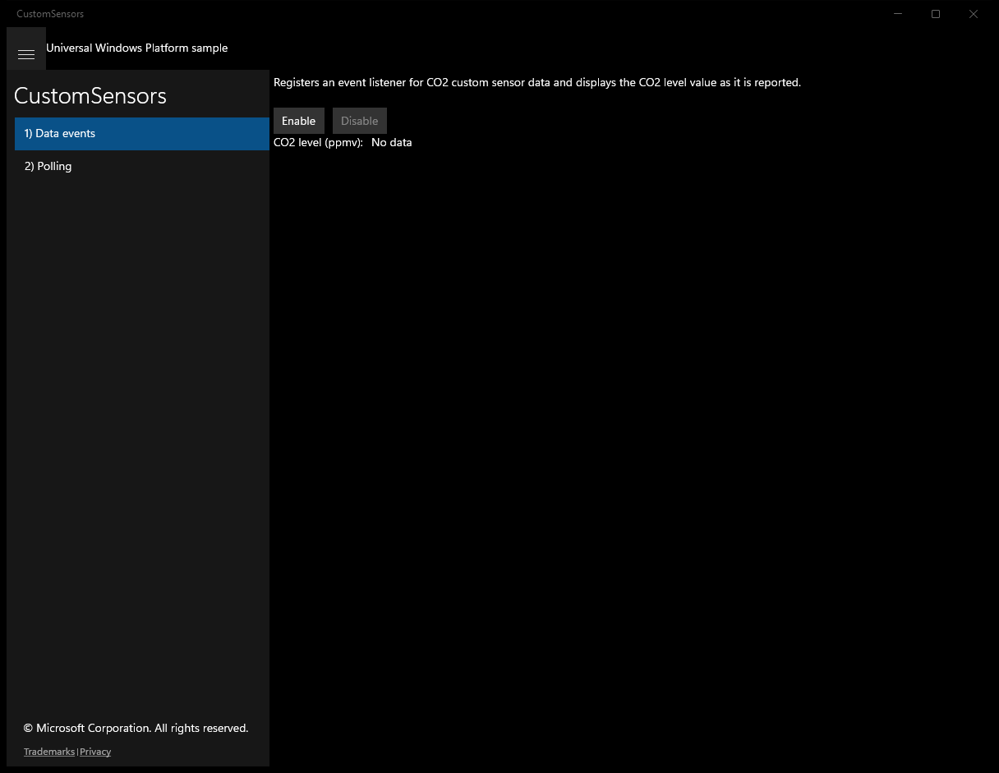
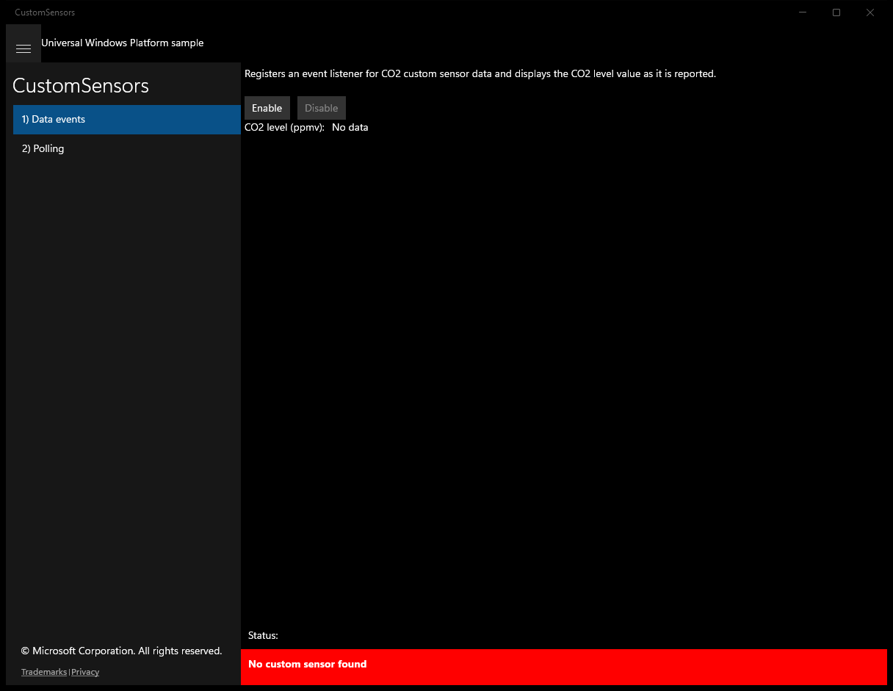
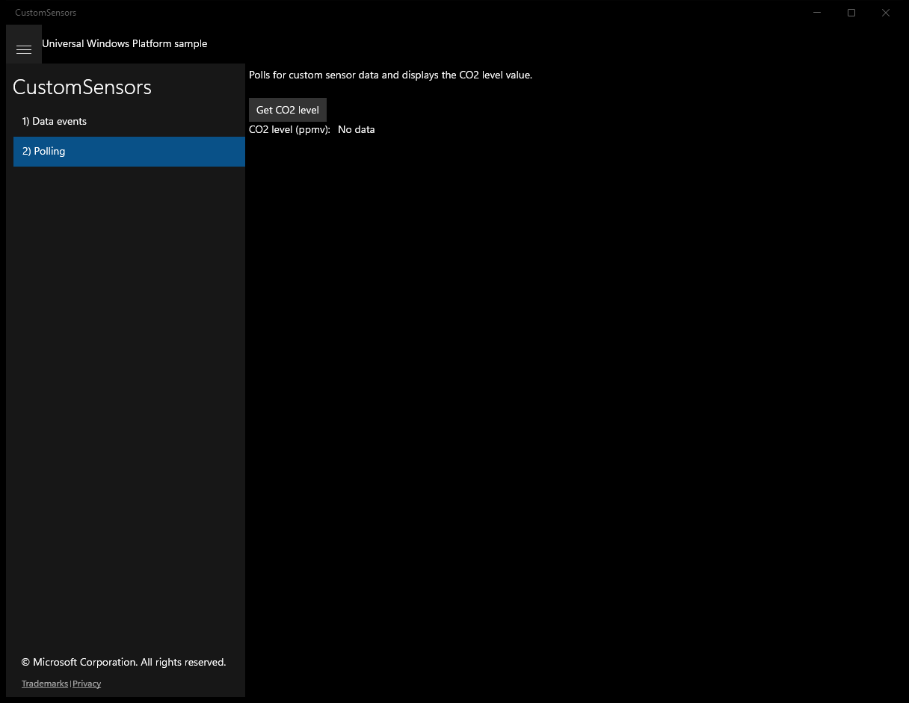
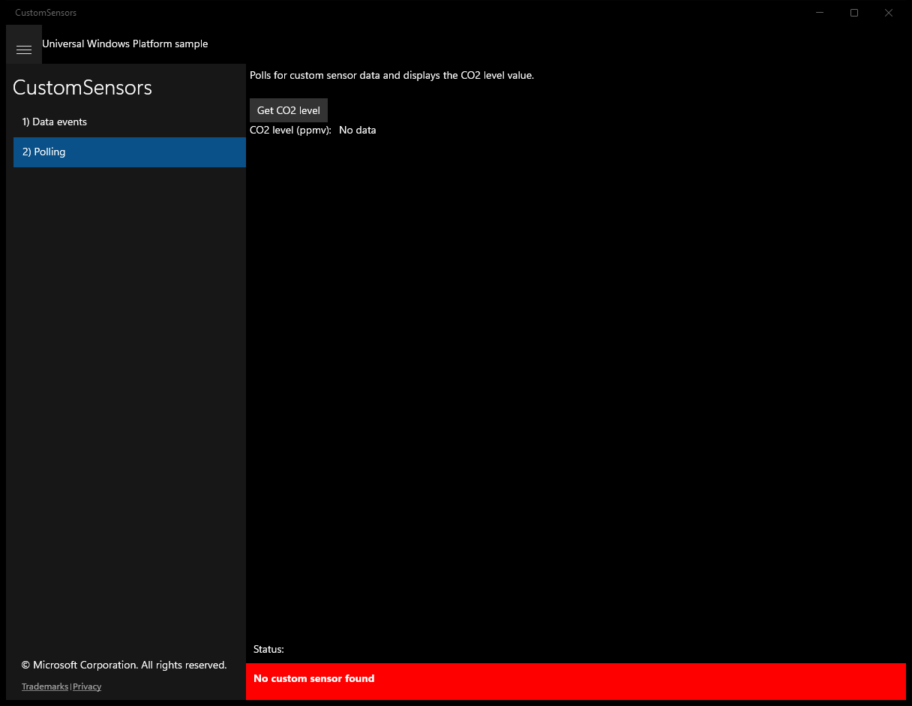

# CustomSensors (C#)

> **Source**: `Samples\CustomSensors\cs\`  
> **Feature**: CustomSensors  
> **AUMID**: `Microsoft.SDKSamples.CustomSensors.CS_8wekyb3d8bbwe!App`  
> **PackageFamilyName**: `Microsoft.SDKSamples.CustomSensors.CS_8wekyb3d8bbwe`  

## Build / deploy / capture status
- build: ok
- deploy: ok
- launch: ok
- capture: ok
- uninstall: ok

## Main page

---

## Scenario 1 - Data events

### UI elements
- **TextBlock**  - x:Name="InputTextBlock"; text="Registers an event listener for CO2 custom sensor data and displays the CO2 level value as it is reported."
- **Button**  - x:Name="ScenarioEnableButton"; content="Enable"; events: Click=ScenarioEnable
- **Button**  - x:Name="ScenarioDisableButton"; content="Disable"; events: Click=ScenarioDisable
- **TextBlock**  - text="CO2 level (ppmv):"
- **TextBlock**  - x:Name="ScenarioOutputCO2Level"; text="No data"

### Code behavior
- **`OnCustomSensorAdded`**
    - API refs: `CustomSensor.FromIdAsync`, `Properties.ContainsKey`, `NotifyType.ErrorMessage`, `Dispatcher.RunAsync`, `CoreDispatcherPriority.Normal`
- **`OnAccessChanged`**
    - API refs: `DeviceAccessStatus.Allowed`, `Dispatcher.RunAsync`, `CoreDispatcherPriority.Normal`, `NotifyType.ErrorMessage`
- **`OnNavigatedTo`**
    - API refs: `ScenarioEnableButton.IsEnabled`, `ScenarioDisableButton.IsEnabled`
- **`OnNavigatingFrom`**
    - instantiates: `WindowVisibilityChangedEventHandler`, `TypedEventHandler`
    - API refs: `ScenarioDisableButton.IsEnabled`, `Window.Current`
- **`OnVisibilityChanged`**
    - instantiates: `TypedEventHandler`
    - API refs: `ScenarioDisableButton.IsEnabled`
- **`OnReadingChanged`**
    - API refs: `String.Format`, `Dispatcher.RunAsync`, `CoreDispatcherPriority.Normal`, `ScenarioOutputCO2Level.Text`
- **`ScenarioEnable`**
    - instantiates: `WindowVisibilityChangedEventHandler`, `TypedEventHandler`
    - API refs: `Window.Current`, `ScenarioEnableButton.IsEnabled`, `ScenarioDisableButton.IsEnabled`, `NotifyType.ErrorMessage`
- **`ScenarioDisable`**
    - instantiates: `WindowVisibilityChangedEventHandler`, `TypedEventHandler`
    - API refs: `Window.Current`, `ScenarioEnableButton.IsEnabled`, `ScenarioDisableButton.IsEnabled`

### Screenshots
Initial state:

After click **Enable**:

---

## Scenario 2 - Polling

### UI elements
- **TextBlock**  - x:Name="InputTextBlock"; text="Polls for custom sensor data and displays the CO2 level value."
- **Button**  - x:Name="GetCO2LevelButton"; content="Get CO2 level"; events: Click=GetCO2Level
- **TextBlock**  - text="CO2 level (ppmv):"
- **TextBlock**  - x:Name="ScenarioOutputCO2Level"; text="No data"

### Code behavior
- **`OnCustomSensorAdded`**
    - API refs: `CustomSensor.FromIdAsync`, `Properties.ContainsKey`, `NotifyType.ErrorMessage`, `Dispatcher.RunAsync`, `CoreDispatcherPriority.Normal`
- **`OnAccessChanged`**
    - API refs: `DeviceAccessStatus.Allowed`, `Dispatcher.RunAsync`, `CoreDispatcherPriority.Normal`, `NotifyType.ErrorMessage`
- **`GetCO2Level`**
    - API refs: `String.Format`, `ScenarioOutputCO2Level.Text`, `NotifyType.ErrorMessage`

### Screenshots
Initial state:

After click **Get CO2 level**:

