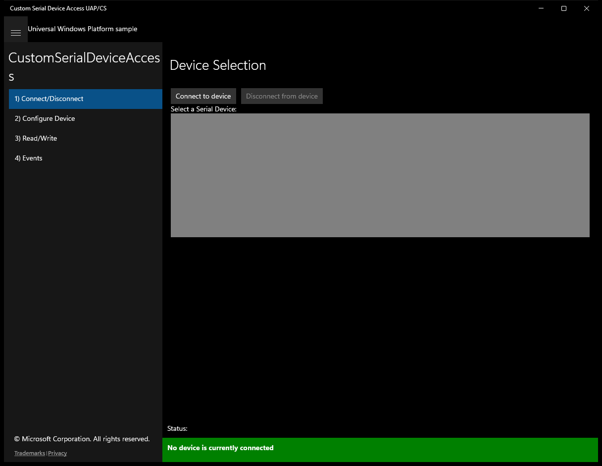
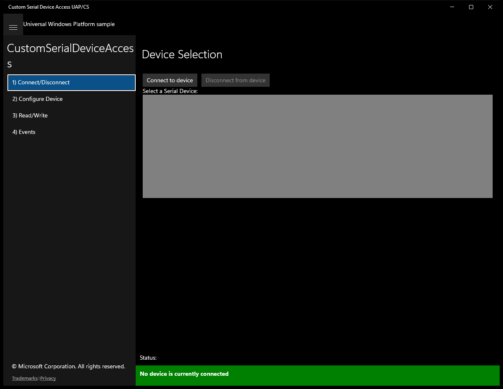
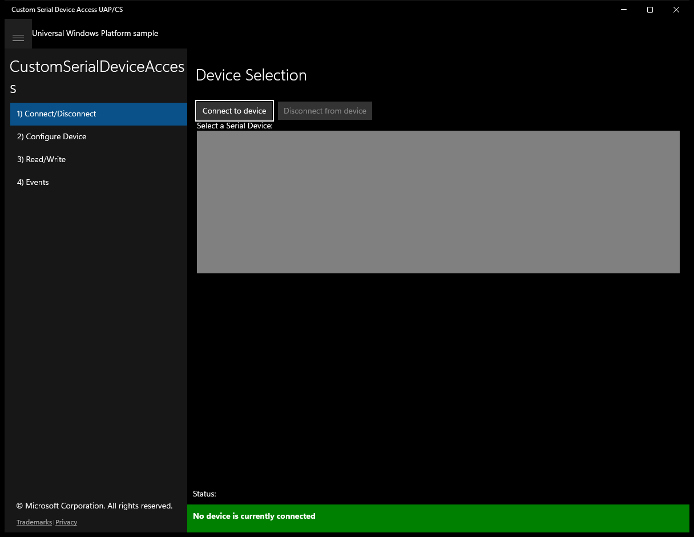
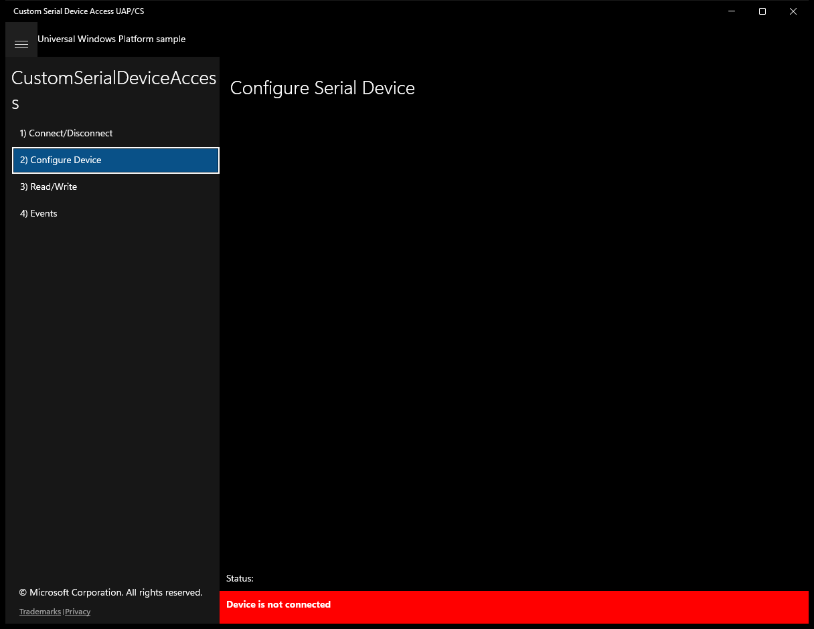
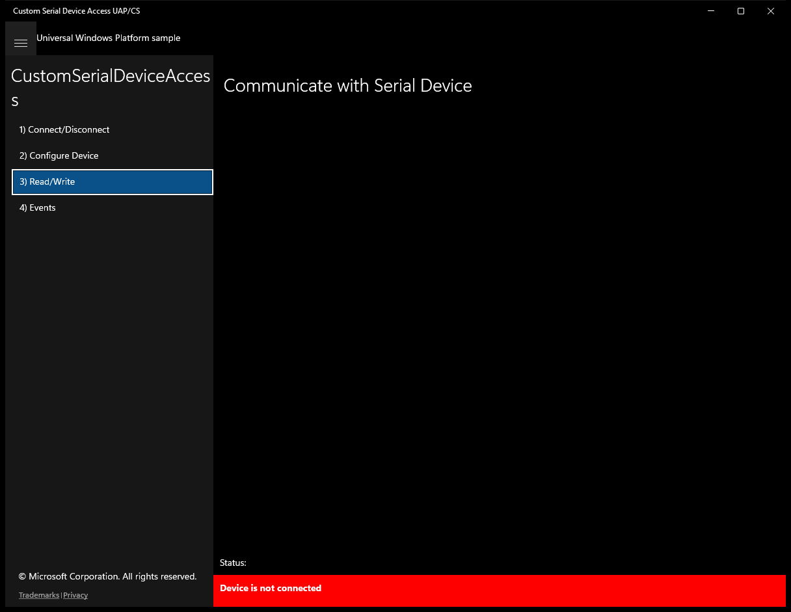
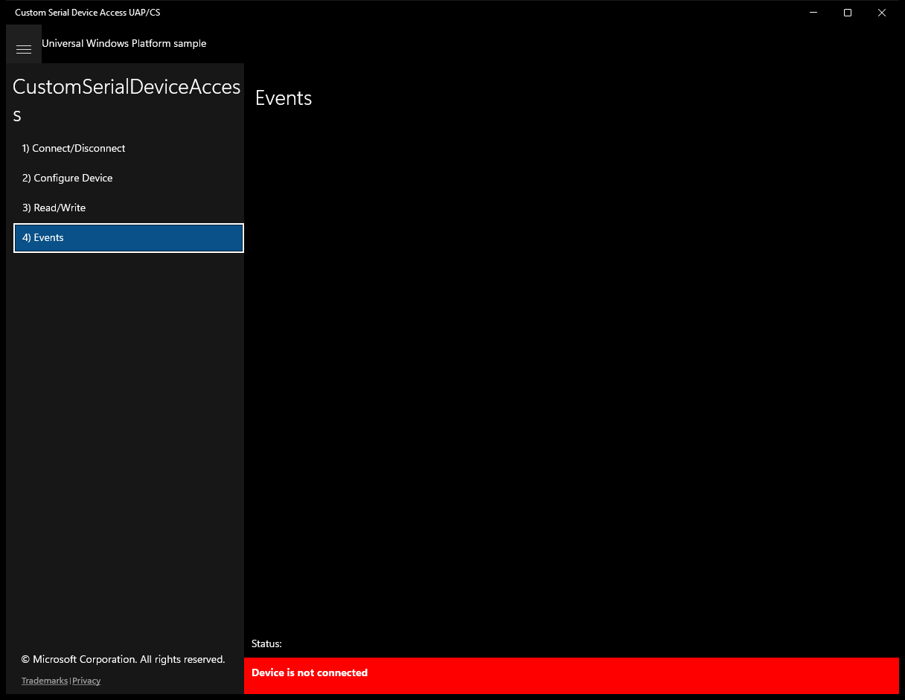

# CustomSerialDeviceAccess (C#)

> **Source**: `Samples\CustomSerialDeviceAccess\cs\`  
> **Feature**: CustomSerialDeviceAccess  
> **AUMID**: `Microsoft.SDKSamples.CustomSerialDeviceAccess.CS_8wekyb3d8bbwe!App`  
> **PackageFamilyName**: `Microsoft.SDKSamples.CustomSerialDeviceAccess.CS_8wekyb3d8bbwe`  

## Top-level UWP namespaces used
- `Windows.Foundation.TypedEventHandler`

## Build / deploy / capture status
- build: ok
- deploy: ok
- launch: ok
- capture: ok
- uninstall: ok

## Main page

---

## Scenario 1 - Connect/Disconnect

### UI elements
- **TextBlock**  - text="Device Selection"
- **Button**  - x:Name="ButtonConnectToDevice"; content="Connect to device"; events: Click=ConnectToDevice_Click
- **Button**  - x:Name="ButtonDisconnectFromDevice"; content="Disconnect from device"; events: Click=DisconnectFromDevice_Click
- **TextBlock**  - text="Select a Serial Device:"
- **ListBox**  - x:Name="ConnectDevices"
- **TextBlock**  - text="{Binding InstanceId}"
- **TextBlock**  - x:Name="StatusBlock"

### Code behavior
- **`OnNavigatedTo`**
    - API refs: `EventHandlerForDevice.Current`, `DeviceListSource.Source`
- **`OnNavigatedFrom`**
    - API refs: `EventHandlerForDevice.Current`
- **`ConnectToDevice_Click`**
    - API refs: `ConnectDevices.SelectedItems`, `EventHandlerForDevice.CreateNewEventHandlerForDevice`, `EventHandlerForDevice.Current`
- **`DisconnectFromDevice_Click`**
    - API refs: `ConnectDevices.SelectedItems`, `EventHandlerForDevice.Current`
- **`InitializeDeviceWatchers`**
    - API refs: `SerialDevice.GetDeviceSelector`, `SerialDevice.GetDeviceSelectorFromUsbVidPid`, `DeviceInformation.CreateWatcher`
- **`StartHandlingAppEvents`**
    - instantiates: `SuspendingEventHandler`, `EventHandler`
    - API refs: `App.Current`
- **`StopHandlingAppEvents`**
    - API refs: `App.Current`
- **`StartDeviceWatchers`**
    - API refs: `DeviceWatcherStatus.Started`, `DeviceWatcherStatus.EnumerationCompleted`
- **`StopDeviceWatchers`**
    - API refs: `DeviceWatcherStatus.Started`, `DeviceWatcherStatus.EnumerationCompleted`
- **`FindDevice`**
    - API refs: `DeviceInformation.Id`
- **`OnDeviceRemoved`**
    - instantiates: `DispatchedHandler`
    - API refs: `Dispatcher.RunAsync`, `CoreDispatcherPriority.Normal`, `NotifyType.StatusMessage`
- **`OnDeviceAdded`**
    - instantiates: `DispatchedHandler`
    - API refs: `Dispatcher.RunAsync`, `CoreDispatcherPriority.Normal`, `NotifyType.StatusMessage`
- **`OnDeviceEnumerationComplete`**
    - instantiates: `DispatchedHandler`
    - API refs: `Dispatcher.RunAsync`, `CoreDispatcherPriority.Normal`, `EventHandlerForDevice.Current`, `DeviceInformation.Id`, `ButtonDisconnectFromDevice.Content`, `Device.PortName`, `NotifyType.StatusMessage`
- **`OnDeviceConnected`**
    - API refs: `EventHandlerForDevice.Current`, `DeviceInformation.Id`, `ButtonDisconnectFromDevice.Content`, `Device.PortName`, `NotifyType.StatusMessage`
- **`OnDeviceClosing`**
    - instantiates: `DispatchedHandler`
    - API refs: `Dispatcher.RunAsync`, `CoreDispatcherPriority.Normal`, `ButtonDisconnectFromDevice.IsEnabled`, `EventHandlerForDevice.Current`, `ButtonDisconnectFromDevice.Content`
- **`SelectDeviceInList`**
    - API refs: `ConnectDevices.SelectedIndex`, `DeviceInformation.Id`
- **`UpdateConnectDisconnectButtonsAndList`**
    - API refs: `ButtonConnectToDevice.IsEnabled`, `ButtonDisconnectFromDevice.IsEnabled`, `ConnectDevices.IsEnabled`

### Screenshots
Initial state:

After click **Connect to device**:

---

## Scenario 2 - Configure Device

### UI elements
- **TextBlock**  - text="Configure Serial Device"
- **TextBlock**  - text="Carrier Detect State = "
- **TextBlock**  - x:Name="CarrierDetectStateValue"; text=" Not Set"
- **TextBlock**  - text="Data Set Ready = "
- **TextBlock**  - x:Name="DataSetReadyStateValue"; text=" Not Set"
- **TextBlock**  - text="Break State Signal : "
- **TextBlock**  - x:Name="BreakStateSignalValue"; text=" Not Set"
- **ToggleSwitch**  - x:Name="BreakStateSignalToggleSwitch"; events: Toggled=BreakStateSignalToggleSwitch_Toggled
- **TextBlock**  - text="Data Terminal Ready Enabled = "
- **TextBlock**  - x:Name="DataTerminalReadyEnabledValue"; text=" Not Set"
- **ToggleSwitch**  - x:Name="DataTerminalReadyEnabledToggleSwitch"; events: Toggled=DataTerminalReadyEnabledToggleSwitch_Toggled
- **TextBlock**  - text="Request To Send Enabled = "
- **TextBlock**  - x:Name="RequestToSendEnabledValue"; text=" Not Set"
- **ToggleSwitch**  - x:Name="RequestToSendEnabledToggleSwitch"; events: Toggled=RequestToSendEnabledToggleSwitch_Toggled
- **TextBlock**  - text="Baud Rate = "
- **TextBlock**  - x:Name="BaudRateValue"; text=" Not Set"
- **TextBox**  - x:Name="BaudRateInputValue"; text="Enter Baud Rate"
- **Button**  - x:Name="BaudRateSetButton"; content="SET"; events: Click=BaudRateSetButton_Click
- **TextBlock**  - text="Parity = "
- **TextBlock**  - x:Name="ParityValue"; text=" Not Set"
- **ComboBox**  - x:Name="ParityComboBox"; events: SelectionChanged=ParityComboBox_SelectionChanged
- **TextBlock**  - text="Stop Bit Count = "
- **TextBlock**  - x:Name="StopBitCountValue"; text=" Not Set"
- **ComboBox**  - x:Name="StopBitCountComboBox"; events: SelectionChanged=StopBitCountComboBox_SelectionChanged
- **TextBlock**  - text="Hand Shake = "
- **TextBlock**  - x:Name="HandShakeValue"; text=" Not Set"
- **ComboBox**  - x:Name="HandShakeComboBox"; events: SelectionChanged=HandShakeComboBox_SelectionChanged
- **TextBlock**  - text="Data Bits = "
- **TextBlock**  - x:Name="DataBitsValue"; text=" Not Set"
- **ComboBox**  - x:Name="DataBitsComboBox"; events: SelectionChanged=DataBitsComboBox_SelectionChanged
- **TextBlock**  - x:Name="StatusBlock"

### Code behavior
- **`OnNavigatedTo`**
    - API refs: `EventHandlerForDevice.Current`, `ConfigureDeviceScrollViewer.Visibility`, `Visibility.Collapsed`, `MainPage.Current`, `NotifyType.ErrorMessage`, `Device.PortName`, `NotifyType.StatusMessage`
- **`UpdateBaudRateView`**
    - API refs: `BaudRateValue.Text`, `EventHandlerForDevice.Current`, `Device.BaudRate`
- **`BaudRateSetButton_Click`**
    - API refs: `BaudRateInputValue.Text`, `EventHandlerForDevice.Current`, `Device.BaudRate`
- **`UpdateParityView`**
    - API refs: `ParityValue.Text`, `EventHandlerForDevice.Current`, `Device.Parity`, `ParityComboBox.SelectedIndex`, `ParityComboBox.Items`
- **`ParityComboBox_SelectionChanged`**
    - API refs: `ParityComboBox.SelectedItem`, `EventHandlerForDevice.Current`, `Device.Parity`, `SerialParity.None`, `SerialParity.Even`, `SerialParity.Odd`, `SerialParity.Mark`, `SerialParity.Space`
- **`UpdateStopBitCountView`**
    - API refs: `StopBitCountValue.Text`, `EventHandlerForDevice.Current`, `Device.StopBits`, `StopBitCountComboBox.SelectedIndex`, `StopBitCountComboBox.Items`
- **`StopBitCountComboBox_SelectionChanged`**
    - API refs: `StopBitCountComboBox.SelectedItem`, `EventHandlerForDevice.Current`, `Device.StopBits`, `SerialStopBitCount.One`, `SerialStopBitCount.OnePointFive`, `SerialStopBitCount.Two`
- **`UpdateHandShakeView`**
    - API refs: `HandShakeValue.Text`, `EventHandlerForDevice.Current`, `Device.Handshake`, `HandShakeComboBox.SelectedIndex`, `HandShakeComboBox.Items`
- **`HandShakeComboBox_SelectionChanged`**
    - API refs: `HandShakeComboBox.SelectedItem`, `EventHandlerForDevice.Current`, `Device.Handshake`, `SerialHandshake.None`, `SerialHandshake.RequestToSend`, `SerialHandshake.XOnXOff`, `SerialHandshake.RequestToSendXOnXOff`
- **`UpdateBreakStateSignalView`**
    - API refs: `EventHandlerForDevice.Current`, `Device.BreakSignalState`, `BreakStateSignalValue.Text`, `BreakStateSignalToggleSwitch.IsOn`
- **`BreakStateSignalToggleSwitch_Toggled`**
    - API refs: `EventHandlerForDevice.Current`, `Device.BreakSignalState`, `BreakStateSignalToggleSwitch.IsOn`
- **`UpdateDataTerminalReadyEnabledView`**
    - API refs: `EventHandlerForDevice.Current`, `Device.IsDataTerminalReadyEnabled`, `DataTerminalReadyEnabledValue.Text`, `DataTerminalReadyEnabledToggleSwitch.IsOn`
- **`DataTerminalReadyEnabledToggleSwitch_Toggled`**
    - API refs: `EventHandlerForDevice.Current`, `Device.IsDataTerminalReadyEnabled`, `DataTerminalReadyEnabledToggleSwitch.IsOn`
- **`UpdateRequestToSendEnabledView`**
    - API refs: `EventHandlerForDevice.Current`, `Device.IsRequestToSendEnabled`, `RequestToSendEnabledValue.Text`, `RequestToSendEnabledToggleSwitch.IsOn`
- **`RequestToSendEnabledToggleSwitch_Toggled`**
    - API refs: `EventHandlerForDevice.Current`, `Device.IsRequestToSendEnabled`, `RequestToSendEnabledToggleSwitch.IsOn`
- **`UpdateCarrierDetectStateView`**
    - API refs: `EventHandlerForDevice.Current`, `Device.CarrierDetectState`, `CarrierDetectStateValue.Text`
- **`UpdateDataSetReadyStateView`**
    - API refs: `EventHandlerForDevice.Current`, `Device.DataSetReadyState`, `DataSetReadyStateValue.Text`
- **`UpdateDataBitsView`**
    - API refs: `EventHandlerForDevice.Current`, `Device.DataBits`, `DataBitsValue.Text`, `DataBitsComboBox.SelectedIndex`
- **`DataBitsComboBox_SelectionChanged`**
    - API refs: `EventHandlerForDevice.Current`, `Device.DataBits`, `DataBitsComboBox.SelectedValue`

### Screenshots
Initial state:

---

## Scenario 3 - Read/Write

### UI elements
- **TextBlock**  - text="Communicate with Serial Device"
- **TextBlock**  - text="Write Timeout (ms) ="
- **TextBlock**  - x:Name="WriteTimeoutValue"; text=" Not Set"
- **TextBox**  - x:Name="WriteTimeoutInputValue"; text="Enter Write Timeout"
- **Button**  - x:Name="WriteTimeoutButton"; content="SET"; events: Click=WriteTimeoutButton_Click
- **TextBox**  - x:Name="WriteBytesInputValue"; text="Enter text to write"; events: TextChanged=WriteBytesInputValue_TextChanged
- **Button**  - x:Name="WriteButton"; content="WRITE BYTES"; events: Click=WriteButton_Click
- **Button**  - x:Name="WriteCancelButton"; content="CANCEL WRITE"; events: Click=WriteCancelButton_Click
- **TextBlock**  - text="Written bytes are displayed here as text: "
- **TextBlock**  - x:Name="WriteBytesCounterValue"; text="0 bytes"
- **TextBlock**  - x:Name="WriteBytesTextBlock"
- **TextBlock**  - text="Read Timeout (ms) ="
- **TextBlock**  - x:Name="ReadTimeoutValue"; text=" Not Set"
- **TextBox**  - x:Name="ReadTimeoutInputValue"; text="Enter Read Timeout"
- **Button**  - x:Name="ReadTimeoutButton"; content="SET"; events: Click=ReadTimeoutButton_Click
- **Button**  - x:Name="ReadButton"; content="READ BYTES"; events: Click=ReadButton_Click
- **Button**  - x:Name="ReadCancelButton"; content="CANCEL READ"; events: Click=ReadCancelButton_Click
- **TextBlock**  - text="Read bytes are displayed here as text: "
- **TextBlock**  - x:Name="ReadBytesCounterValue"; text="0 bytes"
- **TextBlock**  - x:Name="ReadBytesTextBlock"
- **TextBlock**  - x:Name="StatusBlock"

### Code behavior
- **`Dispose`**
    - API refs: `ReadCancellationTokenSource.Dispose`, `WriteCancellationTokenSource.Dispose`
- **`OnNavigatedTo`**
    - API refs: `EventHandlerForDevice.Current`, `ReadWriteScollViewer.Visibility`, `Visibility.Collapsed`, `MainPage.Current`, `NotifyType.ErrorMessage`, `Device.PortName`, `NotifyType.StatusMessage`
- **`UpdateWriteBytesCounterView`**
    - API refs: `WriteBytesCounterValue.Text`, `WriteBytesCounter.ToString`
- **`UpdateWriteTimeoutView`**
    - API refs: `WriteTimeoutValue.Text`, `EventHandlerForDevice.Current`, `Device.WriteTimeout`, `TotalMilliseconds.ToString`
- **`UpdateReadBytesCounterView`**
    - API refs: `ReadBytesCounterValue.Text`, `ReadBytesCounter.ToString`
- **`UpdateReadTimeoutView`**
    - API refs: `ReadTimeoutValue.Text`, `EventHandlerForDevice.Current`, `Device.ReadTimeout`, `TotalMilliseconds.ToString`
- **`ReadTimeoutButton_Click`**
    - instantiates: `System.TimeSpan`
    - API refs: `ReadTimeoutInputValue.Text`, `EventHandlerForDevice.Current`, `Device.ReadTimeout`, `System.TimeSpan`
- **`WriteTimeoutButton_Click`**
    - instantiates: `System.TimeSpan`
    - API refs: `WriteTimeoutInputValue.Text`, `EventHandlerForDevice.Current`, `Device.WriteTimeout`, `System.TimeSpan`
- **`ReadButton_Click`**
    - instantiates: `DataReader`
    - API refs: `EventHandlerForDevice.Current`, `NotifyType.StatusMessage`, `Device.InputStream`, `ReadCancellationTokenSource.Token`, `MainPage.Current`, `Message.ToString`, `NotifyType.ErrorMessage`, `Debug.WriteLine`, `DataReaderObject.DetachStream`, `Utilities.NotifyDeviceNotConnected`
- **`WriteButton_Click`**
    - instantiates: `DataWriter`
    - API refs: `EventHandlerForDevice.Current`, `NotifyType.StatusMessage`, `Device.OutputStream`, `WriteCancellationTokenSource.Token`, `MainPage.Current`, `Message.ToString`, `NotifyType.ErrorMessage`, `Debug.WriteLine`, `DataWriteObject.DetachStream`, `Utilities.NotifyDeviceNotConnected`
- **`UpdateReadButtonStates`**
    - API refs: `ReadButton.IsEnabled`, `ReadCancelButton.IsEnabled`, `ReadTimeoutButton.IsEnabled`, `ReadTimeoutInputValue.IsEnabled`
- **`UpdateWriteButtonStates`**
    - API refs: `WriteButton.IsEnabled`, `WriteCancelButton.IsEnabled`, `WriteTimeoutButton.IsEnabled`, `WriteTimeoutInputValue.IsEnabled`, `WriteBytesInputValue.IsEnabled`
- **`ReadAsync`**
    - API refs: `DataReaderObject.InputStreamOptions`, `InputStreamOptions.Partial`, `DataReaderObject.LoadAsync`, `ReadBytesTextBlock.Text`, `DataReaderObject.ReadString`, `NotifyType.StatusMessage`
- **`WriteAsync`**
    - API refs: `WriteBytesInputValue.Text`, `DataWriteObject.WriteString`, `DataWriteObject.StoreAsync`, `WriteBytesTextBlock.Text`, `InputString.Substring`, `NotifyType.StatusMessage`
- **`CancelReadTask`**
    - API refs: `ReadCancellationTokenSource.IsCancellationRequested`, `ReadCancellationTokenSource.Cancel`
- **`CancelWriteTask`**
    - API refs: `WriteCancellationTokenSource.IsCancellationRequested`, `WriteCancellationTokenSource.Cancel`
- **`ResetReadCancellationTokenSource`**
    - instantiates: `CancellationTokenSource`
    - API refs: `ReadCancellationTokenSource.Token`
- **`ResetWriteCancellationTokenSource`**
    - instantiates: `CancellationTokenSource`
    - API refs: `WriteCancellationTokenSource.Token`
- **`NotifyReadCancelingTask`**
    - instantiates: `DispatchedHandler`
    - API refs: `Dispatcher.RunAsync`, `CoreDispatcherPriority.High`, `ReadButton.IsEnabled`, `ReadCancelButton.IsEnabled`, `NotifyType.StatusMessage`
- **`NotifyWriteCancelingTask`**
    - instantiates: `DispatchedHandler`
    - API refs: `Dispatcher.RunAsync`, `CoreDispatcherPriority.High`, `WriteButton.IsEnabled`, `WriteCancelButton.IsEnabled`, `NotifyType.StatusMessage`
- **`NotifyReadTaskCanceled`**
    - instantiates: `DispatchedHandler`
    - API refs: `Dispatcher.RunAsync`, `CoreDispatcherPriority.Normal`, `NotifyType.StatusMessage`
- **`NotifyWriteTaskCanceled`**
    - instantiates: `DispatchedHandler`
    - API refs: `Dispatcher.RunAsync`, `CoreDispatcherPriority.Normal`, `NotifyType.StatusMessage`
- **`ReadCancelButton_Click`**
    - API refs: `EventHandlerForDevice.Current`, `Utilities.NotifyDeviceNotConnected`
- **`WriteCancelButton_Click`**
    - API refs: `EventHandlerForDevice.Current`, `Utilities.NotifyDeviceNotConnected`
- **`WriteBytesInputValue_TextChanged`**
    - API refs: `WriteBytesInputValue.Text`
- **`WriteBytesInputValue_GotFocus`**
    - API refs: `WriteBytesInputValue.Text`

### Screenshots
Initial state:

---

## Scenario 4 - Events

### UI elements
- **TextBlock**  - text="Events"
- **TextBlock**  - text="Pin Changed Event : "
- **TextBlock**  - x:Name="PinChangedValue"; text=" Not Set"
- **ToggleSwitch**  - x:Name="PinChangedToggleSwitch"; events: Toggled=PinChangedToggleSwitch_Toggled
- **TextBlock**  - text="Error Received Event : "
- **TextBlock**  - x:Name="ErrorReceivedValue"; text=" Not Set"
- **ToggleSwitch**  - x:Name="ErrorReceivedToggleSwitch"; events: Toggled=ErrorReceivedToggleSwitch_Toggled
- **TextBlock**  - x:Name="StatusBlock"

### Code behavior
- **`OnNavigatedTo`**
    - API refs: `EventHandlerForDevice.Current`, `EventsScrollViewer.Visibility`, `Visibility.Collapsed`, `MainPage.Current`, `NotifyType.ErrorMessage`, `Device.PortName`, `NotifyType.StatusMessage`
- **`OnNavigatedFrom`**
    - API refs: `PinChangedToggleSwitch.IsOn`, `ErrorReceivedToggleSwitch.IsOn`
- **`PinChangedEvent`**
    - API refs: `NotifyType.StatusMessage`
- **`ErrorReceivedEvent`**
    - API refs: `NotifyType.ErrorMessage`
- **`PinChangedToggleSwitch_Toggled`**
    - namespaces: `Windows.Foundation.TypedEventHandler`
    - instantiates: `Windows.Foundation.TypedEventHandler`
    - API refs: `PinChangedToggleSwitch.IsOn`, `Windows.Foundation`, `NotifyType.StatusMessage`, `EventHandlerForDevice.Current`, `Device.PinChanged`, `PinChangedValue.Text`
- **`ErrorReceivedToggleSwitch_Toggled`**
    - namespaces: `Windows.Foundation.TypedEventHandler`
    - instantiates: `Windows.Foundation.TypedEventHandler`
    - API refs: `ErrorReceivedToggleSwitch.IsOn`, `Windows.Foundation`, `NotifyType.StatusMessage`, `EventHandlerForDevice.Current`, `Device.ErrorReceived`, `ErrorReceivedValue.Text`

### Screenshots
Initial state:

