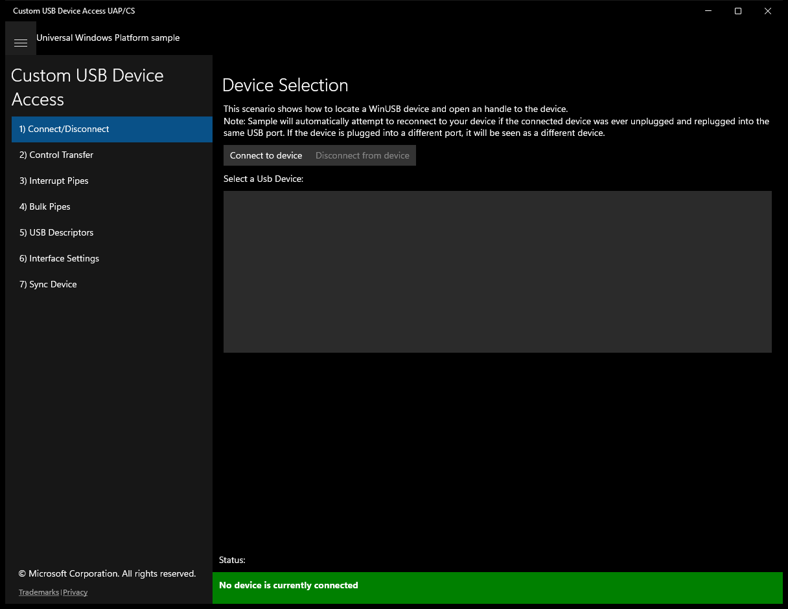
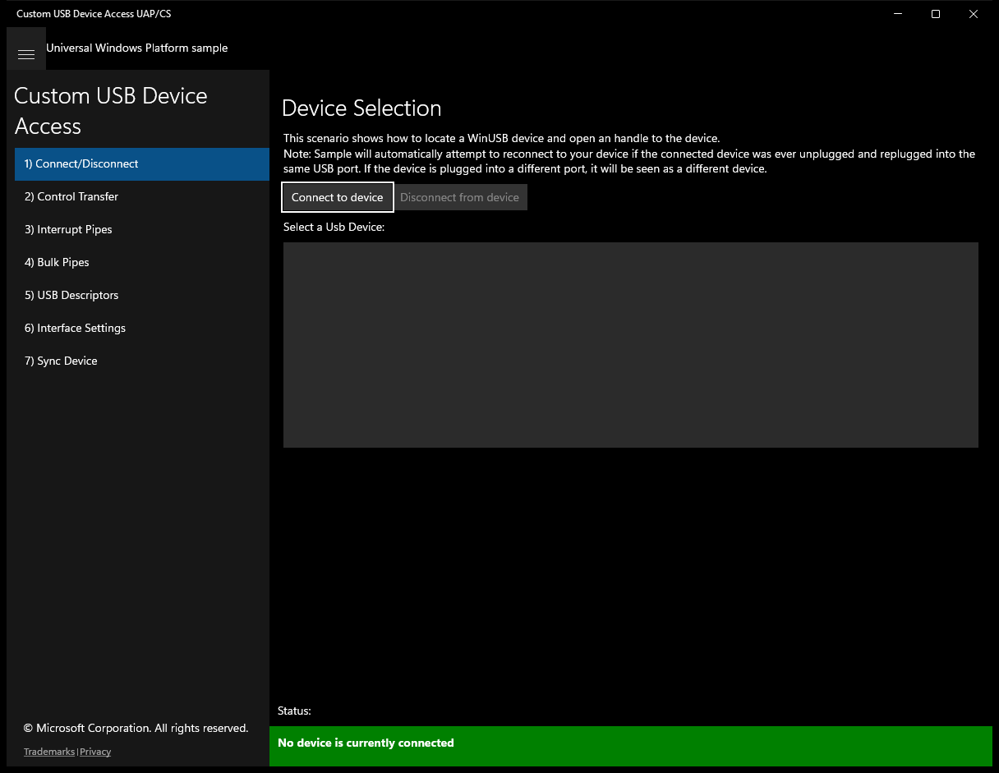
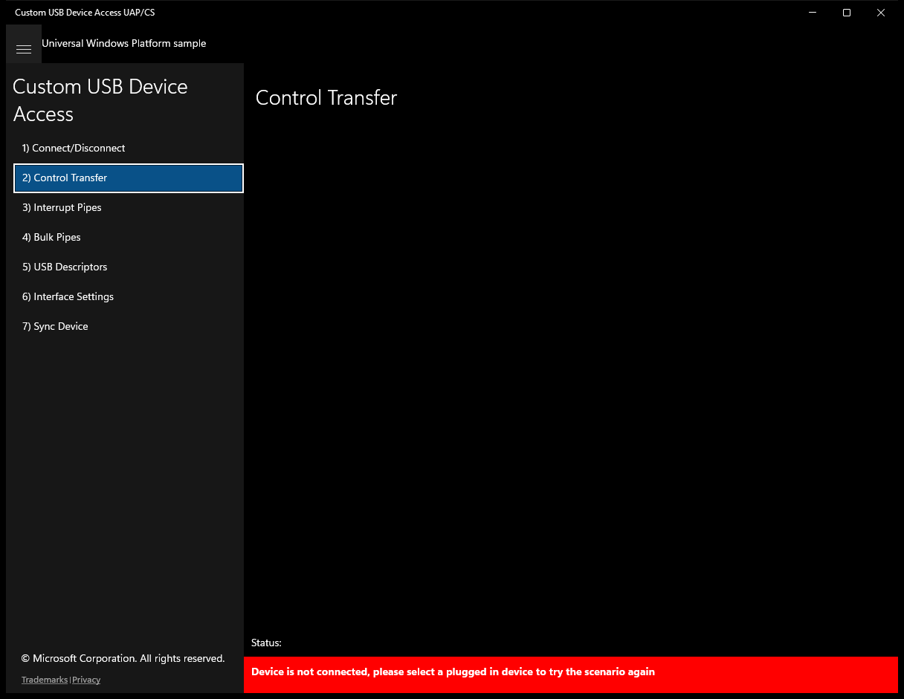
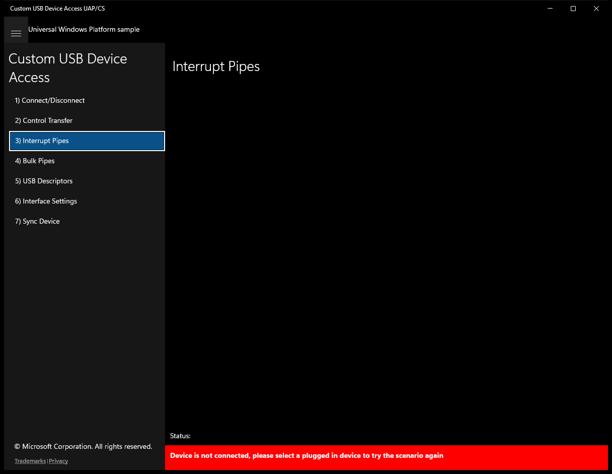
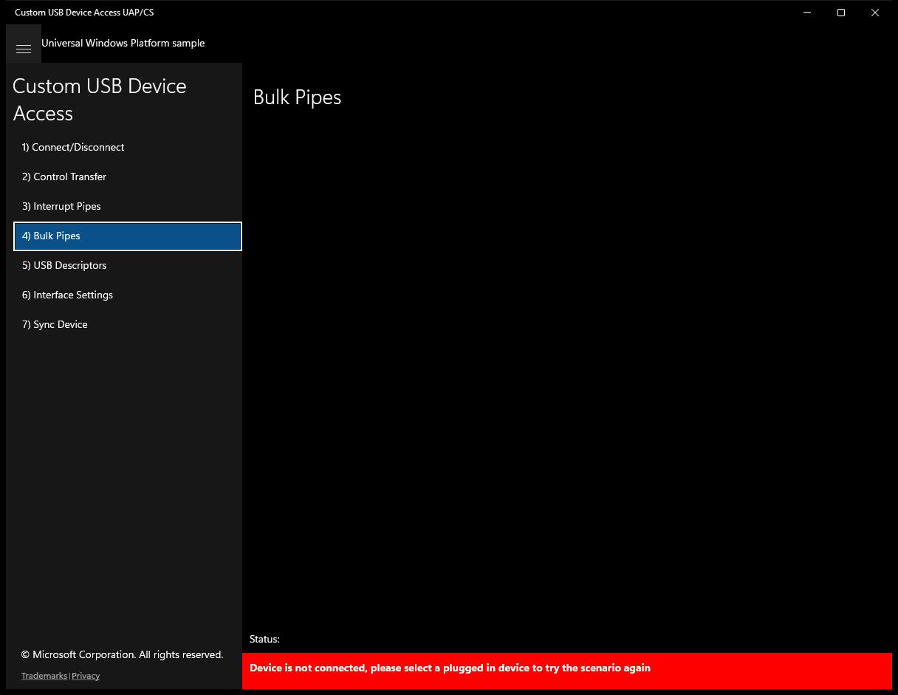
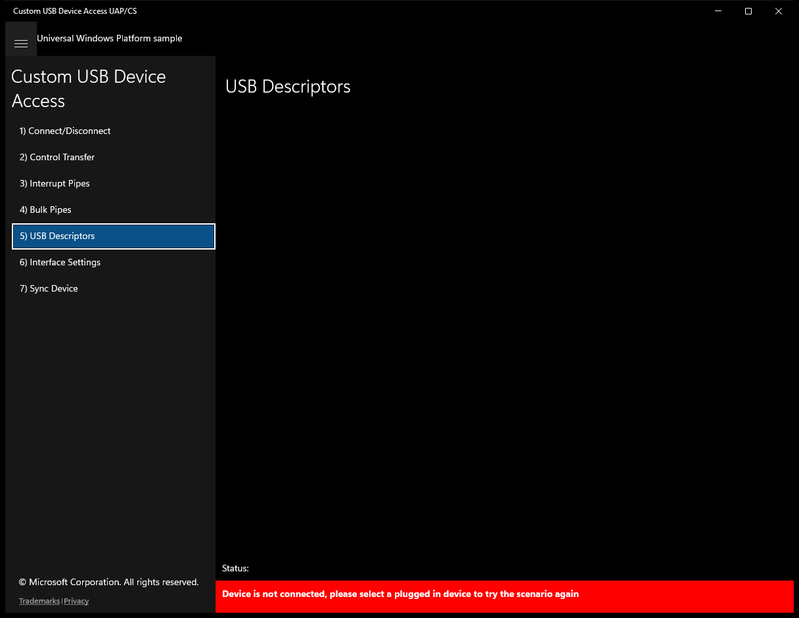
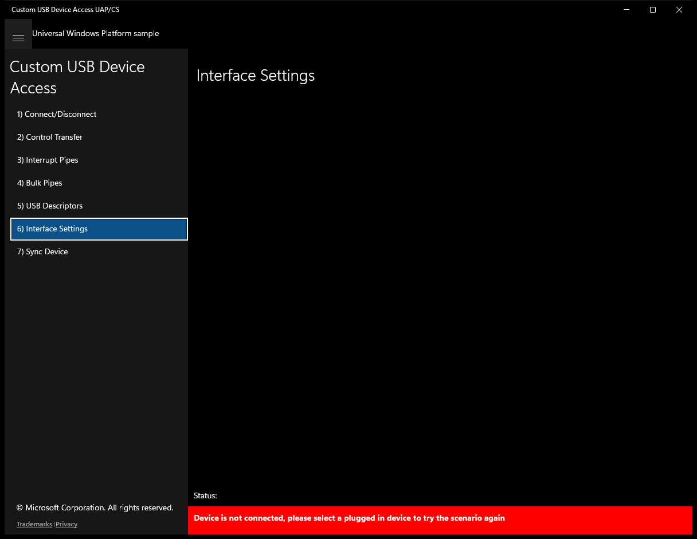
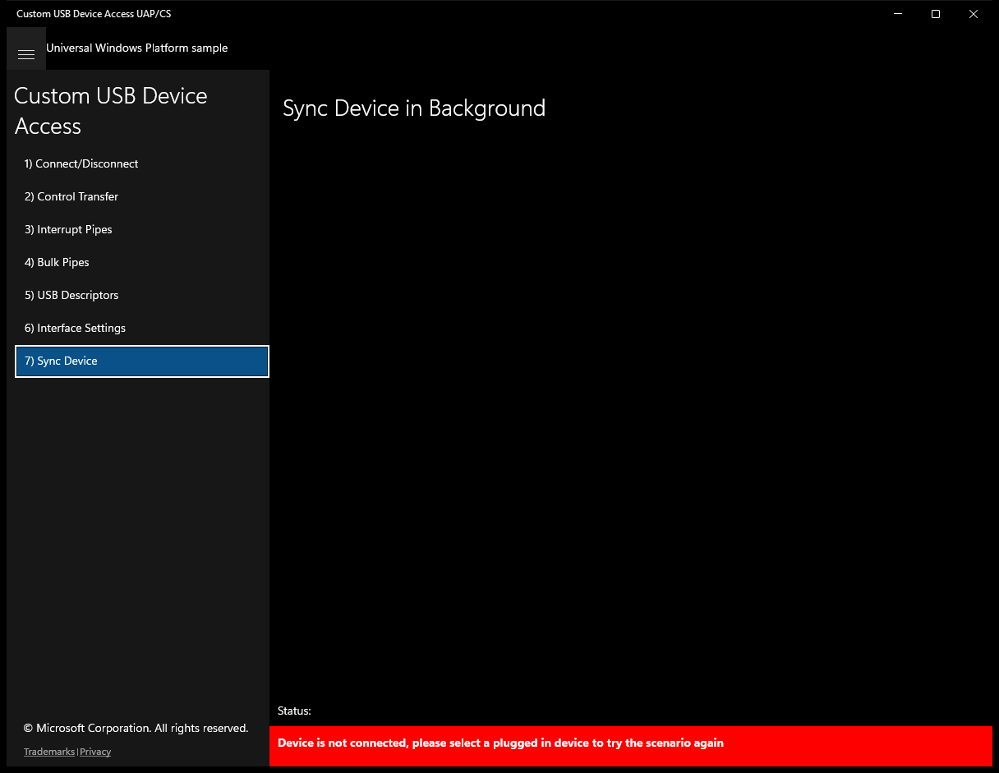

# CustomUsbDeviceAccess (C#)

> **Source**: `Samples\CustomUsbDeviceAccess\cs\`  
> **Feature**: Custom USB Device Access  
> **AUMID**: `Microsoft.SDKSamples.CustomUsbDeviceAccess.CS_8wekyb3d8bbwe!App`  
> **PackageFamilyName**: `Microsoft.SDKSamples.CustomUsbDeviceAccess.CS_8wekyb3d8bbwe`  

## Top-level UWP namespaces used
- `Windows.Storage.Streams.Buffer`
- `Windows.Devices.Enumeration`
- `Windows.Devices.Enumeration.Pnp`

## Build / deploy / capture status
- build: ok
- deploy: ok
- launch: ok
- capture: ok
- uninstall: ok

## Main page

---

## Scenario 1 - Connect/Disconnect

### UI elements
- **TextBlock**  - text="Device Selection"
- **TextBlock**  - x:Name="InputTextBlock1"
- **Button**  - x:Name="ButtonConnectToDevice"; content="Connect to device"; events: Click=ConnectToDevice_Click
- **Button**  - x:Name="ButtonDisconnectFromDevice"; content="Disconnect from device"; events: Click=DisconnectFromDevice_Click
- **TextBlock**  - text="Select a Usb Device:"
- **ListBox**  - x:Name="ConnectDevices"
- **TextBlock**  - text="{Binding InstanceId}"
- **TextBlock**  - x:Name="StatusBlock"

### Code behavior
- **`OnNavigatedTo`**
    - API refs: `EventHandlerForDevice.Current`, `DeviceListSource.Source`
- **`OnNavigatedFrom`**
    - API refs: `EventHandlerForDevice.Current`
- **`ConnectToDevice_Click`**
    - API refs: `ConnectDevices.SelectedItems`, `EventHandlerForDevice.CreateNewEventHandlerForDevice`, `EventHandlerForDevice.Current`
- **`DisconnectFromDevice_Click`**
    - API refs: `ConnectDevices.SelectedItems`, `EventHandlerForDevice.Current`
- **`InitializeOsrFx2DeviceWatcher`**
    - API refs: `UsbDevice.GetDeviceSelector`, `OsrFx2.DeviceVid`, `OsrFx2.DevicePid`, `DeviceInformation.CreateWatcher`
- **`InitializeSuperMuttDeviceWatcher`**
    - API refs: `UsbDevice.GetDeviceSelector`, `SuperMutt.DeviceVid`, `SuperMutt.DevicePid`, `SuperMutt.DeviceInterfaceClass`, `DeviceInformation.CreateWatcher`
- **`StartHandlingAppEvents`**
    - instantiates: `SuspendingEventHandler`, `EventHandler`
    - API refs: `App.Current`
- **`StopHandlingAppEvents`**
    - API refs: `App.Current`
- **`StartDeviceWatchers`**
    - API refs: `DeviceWatcherStatus.Started`, `DeviceWatcherStatus.EnumerationCompleted`
- **`StopDeviceWatchers`**
    - API refs: `DeviceWatcherStatus.Started`, `DeviceWatcherStatus.EnumerationCompleted`
- **`FindDevice`**
    - API refs: `DeviceInformation.Id`
- **`OnDeviceRemoved`**
    - instantiates: `DispatchedHandler`
    - API refs: `Dispatcher.RunAsync`, `CoreDispatcherPriority.Normal`, `NotifyType.StatusMessage`
- **`OnDeviceAdded`**
    - instantiates: `DispatchedHandler`
    - API refs: `Dispatcher.RunAsync`, `CoreDispatcherPriority.Normal`, `NotifyType.StatusMessage`
- **`OnDeviceEnumerationComplete`**
    - instantiates: `DispatchedHandler`
    - API refs: `Dispatcher.RunAsync`, `CoreDispatcherPriority.Normal`, `EventHandlerForDevice.Current`, `DeviceInformation.Id`, `ButtonDisconnectFromDevice.Content`, `NotifyType.StatusMessage`
- **`OnDeviceConnected`**
    - API refs: `EventHandlerForDevice.Current`, `DeviceInformation.Id`, `ButtonDisconnectFromDevice.Content`, `NotifyType.StatusMessage`
- **`OnDeviceClosing`**
    - instantiates: `DispatchedHandler`
    - API refs: `Dispatcher.RunAsync`, `CoreDispatcherPriority.Normal`, `ButtonDisconnectFromDevice.IsEnabled`, `EventHandlerForDevice.Current`, `ButtonDisconnectFromDevice.Content`
- **`SelectDeviceInList`**
    - API refs: `ConnectDevices.SelectedIndex`, `DeviceInformation.Id`
- **`UpdateConnectDisconnectButtonsAndList`**
    - API refs: `ButtonConnectToDevice.IsEnabled`, `ButtonDisconnectFromDevice.IsEnabled`, `ConnectDevices.IsEnabled`

### Screenshots
Initial state:

After click **Connect to device**:

---

## Scenario 2 - Control Transfer

### UI elements
- **TextBlock**  - text="Control Transfer"
- **TextBlock**  - x:Name="OsrFx2ScenarioText"; text="This scenario demonstrates how to use control transfer to set the seven segment on the OSRFX2 device"
- **ComboBox**  - x:Name="OsrFx2SevenSegmentSettingInput"
- **Button**  - x:Name="ButtonGetOsrFx2SevenSegment"; content="Get Seven Segment Display"; events: Click=GetOsrFx2SevenSegmentSetting_Click
- **Button**  - x:Name="ButtonSetOsrFx2SevenSegment"; content="Set Seven Segment Display"; events: Click=SetOsrFx2SevenSegmentSetting_Click
- **TextBlock**  - x:Name="SuperMuttScenarioText"; text="This scenario demonstrates how to use control transfer to set the LED blink pattern of the SuperMUTT device"
- **ComboBox**  - x:Name="SuperMuttLedBlinkPatternInput"
- **Button**  - x:Name="ButtonGetSuperMuttLedBlinkPattern"; content="Get Led Blink Pattern"; events: Click=GetSuperMuttLedBlinkPattern_Click
- **Button**  - x:Name="ButtonSetSuperMuttLedBlinkPattern"; content="Set Led Blink Pattern"; events: Click=SetSuperMuttLedBlinkPattern_Click
- **TextBlock**  - x:Name="StatusBlock"

### Code behavior
- **`OnNavigatedTo`**
    - instantiates: `Dictionary`
    - API refs: `DeviceType.OsrFx2`, `DeviceType.SuperMutt`, `Utilities.SetUpDeviceScenarios`
- **`GetOsrFx2SevenSegmentSetting_Click`**
    - API refs: `EventHandlerForDevice.Current`, `ButtonGetOsrFx2SevenSegment.IsEnabled`, `Utilities.NotifyDeviceNotConnected`
- **`SetOsrFx2SevenSegmentSetting_Click`**
    - API refs: `EventHandlerForDevice.Current`, `ButtonSetOsrFx2SevenSegment.IsEnabled`, `OsrFx2SevenSegmentSettingInput.SelectedIndex`, `Utilities.NotifyDeviceNotConnected`
- **`GetSuperMuttLedBlinkPattern_Click`**
    - API refs: `EventHandlerForDevice.Current`, `ButtonGetSuperMuttLedBlinkPattern.IsEnabled`, `Utilities.NotifyDeviceNotConnected`
- **`SetSuperMuttLedBlinkPattern_Click`**
    - API refs: `EventHandlerForDevice.Current`, `ButtonSetSuperMuttLedBlinkPattern.IsEnabled`, `SuperMuttLedBlinkPatternInput.SelectedIndex`, `Utilities.NotifyDeviceNotConnected`
- **`SetOsrFx2SevenSegmentAsync`**
    - instantiates: `DataWriter`
    - API refs: `OsrFx2.SevenLedSegmentMask`, `UsbTransferDirection.Out`, `UsbControlRecipient.Device`, `UsbControlTransferType.Vendor`, `OsrFx2.VendorCommand`, `EventHandlerForDevice.Current`, `Device.SendControlOutTransferAsync`, `MainPage.Current`, `NotifyType.StatusMessage`, `NotifyType.ErrorMessage`
- **`GetOsrFx2SevenSegmentAsync`**
    - API refs: `OsrFx2.VendorCommand`, `DataReader.FromBuffer`, `OsrFx2.SevenLedSegmentMask`, `MainPage.Current`, `NotifyType.ErrorMessage`, `NotifyType.StatusMessage`, `Length.ToString`
- **`SetSuperMuttLedBlinkPatternAsync`**
    - API refs: `UsbTransferDirection.Out`, `UsbControlRecipient.Device`, `UsbControlTransferType.Vendor`, `SuperMutt.VendorCommand`, `EventHandlerForDevice.Current`, `Device.SendControlOutTransferAsync`, `MainPage.Current`, `NotifyType.StatusMessage`
- **`GetSuperMuttLedBlinkPatternAsync`**
    - API refs: `SuperMutt.VendorCommand`, `DataReader.FromBuffer`, `MainPage.Current`, `NotifyType.StatusMessage`, `NotifyType.ErrorMessage`
- **`SendVendorControlTransferInToDeviceRecipientAsync`**
    - namespaces: `Windows.Storage.Streams.Buffer`
    - instantiates: `Windows.Storage.Streams.Buffer`
    - API refs: `Windows.Storage`, `Streams.Buffer`, `UsbTransferDirection.In`, `UsbControlRecipient.Device`, `UsbControlTransferType.Vendor`, `EventHandlerForDevice.Current`, `Device.SendControlInTransferAsync`

### Screenshots
Initial state:

---

## Scenario 3 - Interrupt Pipes

### UI elements
- **TextBlock**  - text="Interrupt Pipes"
- **TextBlock**  - x:Name="OsrFx2ScenarioText"
- **Button**  - x:Name="ButtonRegisterOsrFx2InterruptEvent"; content="Register For Interrupt Event"; events: Click=RegisterOsrFx2InterruptEvent_Click
- **TextBlock**  - x:Name="SuperMuttScenarioText"
- **Button**  - x:Name="ButtonWriteSuperMuttInterruptOut"; content="Write To Interrupt Out"; events: Click=WriteSuperMuttInterruptOut_Click
- **Button**  - x:Name="ButtonRegisterSuperMuttInterruptEvent"; content="Register For Interrupt Event"; events: Click=RegisterSuperMuttInterruptEvent_Click
- **Button**  - x:Name="ButtonUnregisterInterruptEvent"; content="Unregister From Interrupt Event"; events: Click=UnregisterInterruptEvent_Click
- **TextBlock**  - x:Name="SwitchStates"
- **TextBlock**  - x:Name="StatusBlock"

### Code behavior
- **`OnNavigatedTo`**
    - instantiates: `Dictionary`
    - API refs: `DeviceType.OsrFx2`, `DeviceType.SuperMutt`, `Utilities.SetUpDeviceScenarios`, `EventHandlerForDevice.Current`
- **`OnNavigatedFrom`**
    - API refs: `EventHandlerForDevice.Current`
- **`OnDeviceClosing`**
    - instantiates: `DispatchedHandler`
    - API refs: `Dispatcher.RunAsync`, `CoreDispatcherPriority.Normal`
- **`RegisterOsrFx2InterruptEvent_Click`**
    - instantiates: `TypedEventHandler`
    - API refs: `EventHandlerForDevice.Current`, `OsrFx2.Pipe`, `Utilities.NotifyDeviceNotConnected`
- **`RegisterSuperMuttInterruptEvent_Click`**
    - instantiates: `TypedEventHandler`
    - API refs: `EventHandlerForDevice.Current`, `SuperMutt.Pipe`, `Utilities.NotifyDeviceNotConnected`
- **`UnregisterInterruptEvent_Click`**
    - API refs: `EventHandlerForDevice.Current`, `Utilities.NotifyDeviceNotConnected`
- **`WriteSuperMuttInterruptOut_Click`**
    - API refs: `EventHandlerForDevice.Current`, `SuperMutt.Pipe`, `Device.DefaultInterface`, `EndpointDescriptor.MaxPacketSize`, `MainPage.Current`, `NumberFormatInfo.InvariantInfo`, `NotifyType.ErrorMessage`, `Utilities.NotifyDeviceNotConnected`
- **`RegisterForInterruptEvent`**
    - API refs: `EventHandlerForDevice.Current`, `Device.DefaultInterface`
- **`UnregisterFromInterruptEvent`**
    - API refs: `EventHandlerForDevice.Current`, `Device.DefaultInterface`
- **`OnOsrFx2SwitchStateChangeEvent`**
    - instantiates: `List`, `DispatchedHandler`
    - API refs: `DataReader.FromBuffer`, `Dispatcher.RunAsync`, `CoreDispatcherPriority.Normal`, `NotifyType.StatusMessage`, `NotifyType.ErrorMessage`
- **`OnGeneralInterruptEvent`**
    - instantiates: `DispatchedHandler`
    - API refs: `Dispatcher.RunAsync`, `CoreDispatcherPriority.Normal`, `MainPage.Current`, `NotifyType.StatusMessage`
- **`WriteToInterruptOut`**
    - instantiates: `DataWriter`
    - API refs: `EventHandlerForDevice.Current`, `Device.DefaultInterface`, `MainPage.Current`, `NotifyType.StatusMessage`, `NotifyType.ErrorMessage`
- **`ClearSwitchStateTable`**
    - API refs: `SwitchStates.Inlines`
- **`UpdateSwitchStateTable`**
    - API refs: `SwitchStates.Inlines`
- **`UpdateRegisterEventButton`**
    - API refs: `ButtonRegisterSuperMuttInterruptEvent.IsEnabled`, `ButtonRegisterOsrFx2InterruptEvent.IsEnabled`, `ButtonUnregisterInterruptEvent.IsEnabled`
- **`CreateBooleanChartInTable`**
    - instantiates: `Span`, `Run`, `Bold`, `LineBreak`
    - API refs: `NumberFormatInfo.InvariantInfo`, `Inlines.Add`

### Screenshots
Initial state:

---

## Scenario 4 - Bulk Pipes

### UI elements
- **TextBlock**  - text="Bulk Pipes"
- **TextBlock**  - x:Name="GeneralScenarioText"; text="This scenario shows how to read and write to bulk pipe."
- **Button**  - x:Name="ButtonBulkRead"; content="Read 512 bytes"; events: Click=BulkRead_Click
- **Button**  - x:Name="ButtonBulkWrite"; content="Write 512 bytes"; events: Click=BulkWrite_Click
- **Button**  - x:Name="ButtonBulkReadWrite"; content="Continuously Read and Write 512 bytes"; events: Click=BulkReadWrite_Click
- **Button**  - x:Name="ButtonCancelAllIoTasks"; content="Cancel all Read/Write tasks"; events: Click=CancelAllIoTasks_Click
- **TextBlock**  - x:Name="StatusBlock"

### Code behavior
- **`OnNavigatedTo`**
    - instantiates: `Dictionary`, `SuspendingEventHandler`, `TypedEventHandler`
    - API refs: `DeviceType.OsrFx2`, `DeviceType.SuperMutt`, `Utilities.SetUpDeviceScenarios`, `EventHandlerForDevice.Current`
- **`OnNavigatedFrom`**
    - API refs: `EventHandlerForDevice.Current`
- **`BulkRead_Click`**
    - API refs: `EventHandlerForDevice.Current`, `NotifyType.StatusMessage`, `Utilities.NotifyDeviceNotConnected`
- **`BulkWrite_Click`**
    - API refs: `EventHandlerForDevice.Current`, `NotifyType.StatusMessage`, `Utilities.NotifyDeviceNotConnected`
- **`BulkReadWrite_Click`**
    - instantiates: `DispatchedHandler`
    - API refs: `EventHandlerForDevice.Current`, `NotifyType.StatusMessage`, `Dispatcher.RunAsync`, `CoreDispatcherPriority.Normal`, `Utilities.NotifyDeviceNotConnected`
- **`CancelAllIoTasks_Click`**
    - API refs: `EventHandlerForDevice.Current`, `Utilities.NotifyDeviceNotConnected`
- **`UpdateButtonStates`**
    - API refs: `ButtonBulkReadWrite.IsEnabled`, `ButtonBulkRead.IsEnabled`, `ButtonBulkWrite.IsEnabled`, `ButtonCancelAllIoTasks.IsEnabled`
- **`BulkWriteAsync`**
    - instantiates: `DataWriter`
    - API refs: `EventHandlerForDevice.Current`, `Device.DefaultInterface`
- **`BulkReadAsync`**
    - instantiates: `DataReader`
    - API refs: `EventHandlerForDevice.Current`, `Device.DefaultInterface`
- **`BulkReadWriteAsync`**
    - API refs: `Task.Factory`, `EventHandlerForDevice.Current`, `TaskCreationOptions.AttachedToParent`, `TaskScheduler.Current`
- **`PrintTotalReadWriteBytes`**
    - instantiates: `DispatchedHandler`
    - API refs: `Dispatcher.RunAsync`, `CoreDispatcherPriority.Low`, `NumberFormatInfo.InvariantInfo`, `NotifyType.StatusMessage`
- **`ResetCancellationTokenSource`**
    - instantiates: `CancellationTokenSource`
    - API refs: `Token.Register`
- **`NotifyCancelingTask`**
    - instantiates: `DispatchedHandler`
    - API refs: `Dispatcher.RunAsync`, `CoreDispatcherPriority.High`, `ButtonBulkRead.IsEnabled`, `ButtonBulkWrite.IsEnabled`, `ButtonBulkReadWrite.IsEnabled`, `ButtonCancelAllIoTasks.IsEnabled`, `NotifyType.StatusMessage`
- **`NotifyTaskCanceled`**
    - instantiates: `DispatchedHandler`
    - API refs: `Dispatcher.RunAsync`, `CoreDispatcherPriority.Normal`, `NotifyType.StatusMessage`

### Screenshots
Initial state:

---

## Scenario 5 - USB Descriptors

### UI elements
- **TextBlock**  - text="USB Descriptors"
- **TextBlock**  - x:Name="GenericScenarioText"; text="Please select which descriptor to display:"
- **ListBox**  - x:Name="ListOfDescriptorTypes"; events: SelectionChanged=Descriptor_SelectChanged
- **TextBlock**  - text="{Binding EntryName}"
- **TextBlock**  - x:Name="DescriptorOutput"
- **TextBlock**  - x:Name="StatusBlock"

### Code behavior
- **`OnNavigatedTo`**
    - instantiates: `Dictionary`
    - API refs: `DeviceType.All`, `Utilities.SetUpDeviceScenarios`, `EventHandlerForDevice.Current`, `Utilities.GetDeviceType`, `DeviceType.None`, `ListOfDescriptorTypesSource.Source`
- **`Descriptor_SelectChanged`**
    - API refs: `EventHandlerForDevice.Current`, `Utilities.NotifyDeviceNotConnected`
- **`PrintDescriptor`**
    - API refs: `EventHandlerForDevice.Current`, `Descriptor.Device`, `Descriptor.Configuration`, `Descriptor.Interface`, `Descriptor.Endpoint`, `Descriptor.String`, `Descriptor.Custom`, `DescriptorOutput.Text`
    - updates UI: `DescriptorOutput.Text`
- **`GetDeviceDescriptorAsString`**
    - API refs: `EventHandlerForDevice.Current`, `Device.DeviceDescriptor`, `BcdUsb.ToString`, `NumberFormatInfo.InvariantInfo`, `MaxPacketSize0.ToString`, `VendorId.ToString`, `ProductId.ToString`, `BcdDeviceRevision.ToString`, `NumberOfConfigurations.ToString`
- **`GetConfigurationDescriptorAsString`**
    - API refs: `EventHandlerForDevice.Current`, `Device.Configuration`, `UsbInterfaces.Count`, `NumberFormatInfo.InvariantInfo`, `ConfigurationValue.ToString`, `SelfPowered.ToString`, `RemoteWakeup.ToString`, `MaxPowerMilliamps.ToString`
- **`GetInterfaceDescriptorsAsString`**
    - API refs: `EventHandlerForDevice.Current`, `Device.Configuration`, `InterfaceNumber.ToString`, `NumberFormatInfo.InvariantInfo`, `ClassCode.ToString`, `SubclassCode.ToString`, `ProtocolCode.ToString`, `InterfaceSettings.Count`, `BulkInPipes.Count`, `BulkOutPipes.Count`, `InterruptInPipes.Count`, `InterruptOutPipes.Count`
- **`GetEndpointDescriptorsAsString`**
    - API refs: `EventHandlerForDevice.Current`, `Device.DefaultInterface`, `EndpointNumber.ToString`, `NumberFormatInfo.InvariantInfo`, `MaxPacketSize.ToString`, `Interval.Milliseconds`
- **`GetCustomDescriptorsAsString`**
    - namespaces: `Windows.Storage.Streams.Buffer`
    - instantiates: `Windows.Storage.Streams.Buffer`
    - API refs: `EventHandlerForDevice.Current`, `Device.Configuration`, `Windows.Storage`, `Streams.Buffer`, `DataReader.FromBuffer`, `ByteOrder.LittleEndian`, `NumberFormatInfo.InvariantInfo`
- **`GetProductName`**
    - API refs: `EventHandlerForDevice.Current`, `DeviceInformation.Name`

### Screenshots
Initial state:

---

## Scenario 6 - Interface Settings

### UI elements
- **TextBlock**  - text="Interface Settings"
- **TextBlock**  - x:Name="GenericScenarioText"; text="You can view the number of interface settings that are available on the device, but this sample only allows the SuperMutt device to change its interface settings. Interface Settings:"
- **ComboBox**  - x:Name="InterfaceSettingsToChoose"
- **Button**  - x:Name="ButtonSetSetting"; content="Set Interface Setting"; events: Click=SetSuperMuttInterfaceSetting_Click
- **Button**  - x:Name="ButtonGetSetting"; content="Get Interface Setting"; events: Click=GetInterfaceSetting_Click
- **TextBlock**  - x:Name="StatusBlock"

### Code behavior
- **`OnNavigatedTo`**
    - instantiates: `Dictionary`
    - API refs: `DeviceType.All`, `Utilities.SetUpDeviceScenarios`, `EventHandlerForDevice.Current`, `Device.DefaultInterface`, `InterfaceSettings.Count`, `InterfaceSettingsToChoose.Items`, `NumberFormatInfo.InvariantInfo`, `InterfaceSettingsToChoose.SelectedIndex`, `Utilities.IsSuperMuttDevice`, `ButtonSetSetting.IsEnabled`
- **`SetSuperMuttInterfaceSetting_Click`**
    - API refs: `EventHandlerForDevice.Current`, `UsbInterface.InterfaceSettings`, `InterfaceSettingsToChoose.SelectedIndex`, `Utilities.NotifyDeviceNotConnected`
- **`GetInterfaceSetting_Click`**
    - API refs: `EventHandlerForDevice.Current`, `Utilities.NotifyDeviceNotConnected`
- **`SetInterfaceSetting`**
    - API refs: `EventHandlerForDevice.Current`, `Device.DefaultInterface`, `MainPage.Current`, `NotifyType.StatusMessage`
- **`GetInterfaceSetting`**
    - API refs: `EventHandlerForDevice.Current`, `Device.DefaultInterface`, `InterfaceDescriptor.AlternateSettingNumber`, `MainPage.Current`, `NumberFormatInfo.InvariantInfo`, `NotifyType.StatusMessage`

### Screenshots
Initial state:

---

## Scenario 7 - Sync Device

### UI elements
- **TextBlock**  - text="Sync Device in Background"
- **TextBlock**  - x:Name="GeneralScenarioText"
- **Button**  - x:Name="ButtonSync"; content="Sync with the device"; events: Click=Sync_Click
- **Button**  - x:Name="ButtonCancelSync"; content="Cancel Sync with the device"; events: Click=CancelSync_Click
- **TextBlock**  - x:Name="ProgressBarText"; text="Sync progress:"
- **ProgressBar**  - x:Name="SyncProgressBar"
- **TextBlock**  - x:Name="StatusBlock"

### Code behavior
- **`OnNavigatedTo`**
    - instantiates: `Dictionary`
    - API refs: `DeviceType.OsrFx2`, `DeviceType.SuperMutt`, `Utilities.SetUpDeviceScenarios`
- **`FindSyncTask`**
    - API refs: `BackgroundTaskRegistration.AllTasks`, `SyncBackgroundTaskInformation.Name`
- **`SetupBackgroundTask`**
    - instantiates: `BackgroundTaskBuilder`, `BackgroundTaskCompletedEventHandler`, `BackgroundTaskProgressEventHandler`
    - API refs: `BackgroundExecutionManager.RequestAccessAsync`, `SyncBackgroundTaskInformation.Name`, `SyncBackgroundTaskInformation.TaskEntryPoint`
- **`StartSyncBackgroundTaskAsync`**
    - API refs: `EventHandlerForDevice.Current`
- **`SyncWithDeviceAsync`**
    - API refs: `DeviceTriggerResult.Allowed`, `DeviceTriggerResult.LowBattery`, `DeviceTriggerResult.DeniedByUser`, `DeviceTriggerResult.DeniedBySystem`, `EventHandlerForDevice.Current`, `NotifyType.ErrorMessage`
- **`OnSyncWithDeviceCompleted`**
    - instantiates: `DispatchedHandler`
    - API refs: `Dispatcher.RunAsync`, `CoreDispatcherPriority.Normal`, `EventHandlerForDevice.Current`, `ApplicationData.Current`, `LocalSettings.Values`, `LocalSettingKeys.SyncBackgroundTaskStatus`, `SyncBackgroundTaskInformation.TaskCompleted`, `LocalSettingKeys.SyncBackgroundTaskResult`, `SyncProgressBar.Value`, `NotifyType.StatusMessage`, `SyncBackgroundTaskInformation.TaskCanceled`
- **`OnSyncWithDeviceProgress`**
    - instantiates: `DispatchedHandler`
    - API refs: `Dispatcher.RunAsync`, `CoreDispatcherPriority.Normal`, `SyncProgressBar.Value`
- **`Sync_Click`**
    - API refs: `EventHandlerForDevice.Current`, `NotifyType.StatusMessage`, `SyncProgressBar.Value`, `Utilities.NotifyDeviceNotConnected`
- **`CancelSync_Click`**
    - API refs: `Utilities.NotifyDeviceNotConnected`
- **`UpdateButtonStates`**
    - API refs: `ButtonSync.IsEnabled`, `ButtonCancelSync.IsEnabled`

### Screenshots
Initial state:

