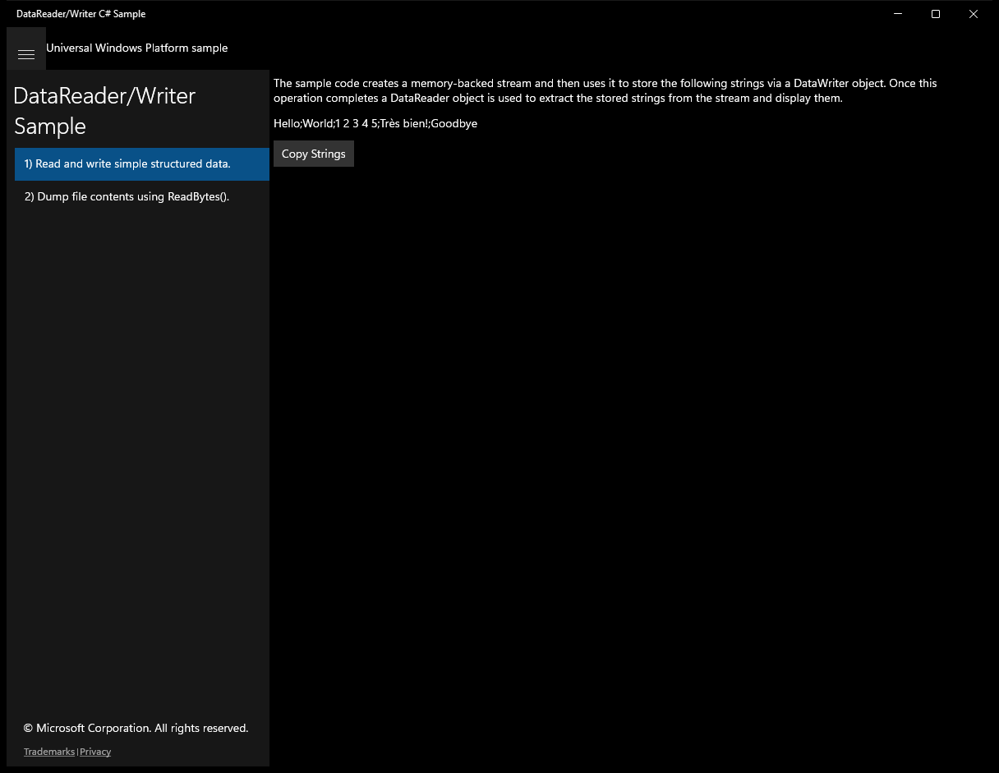
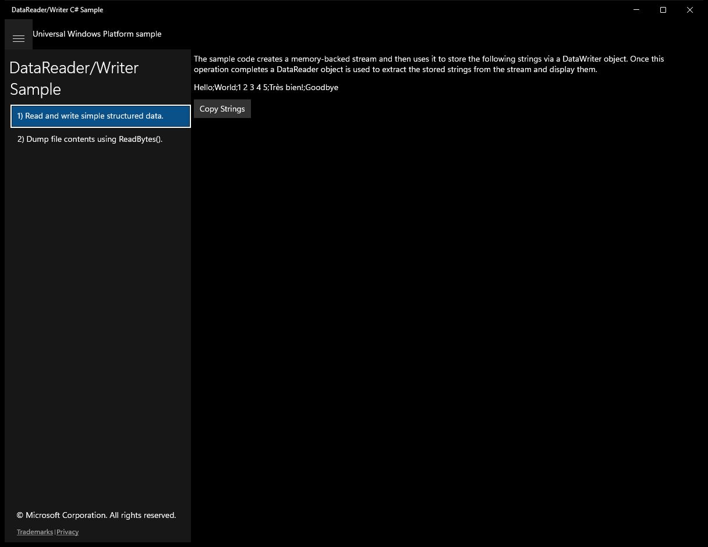
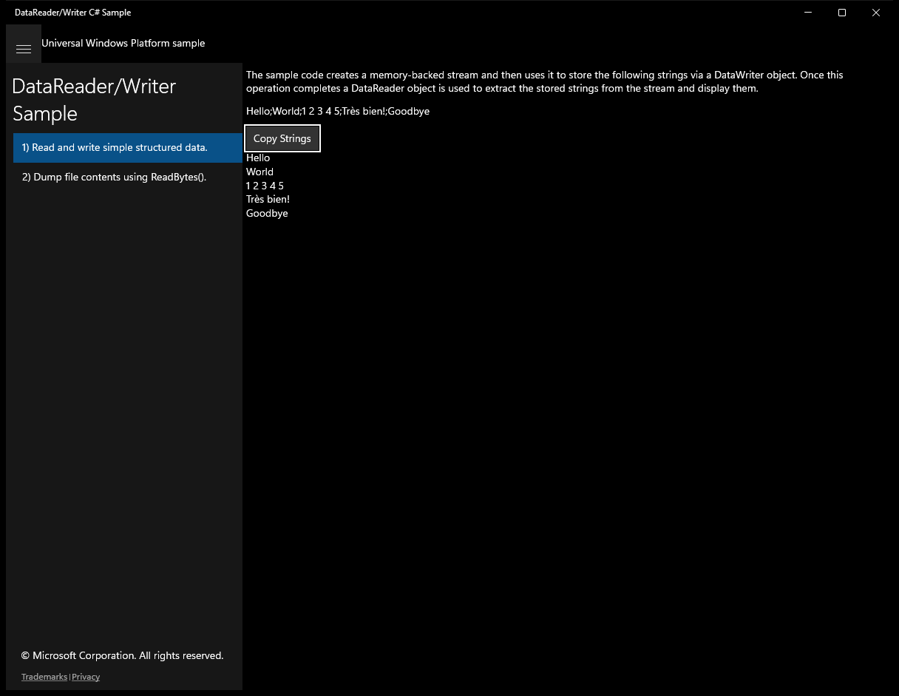
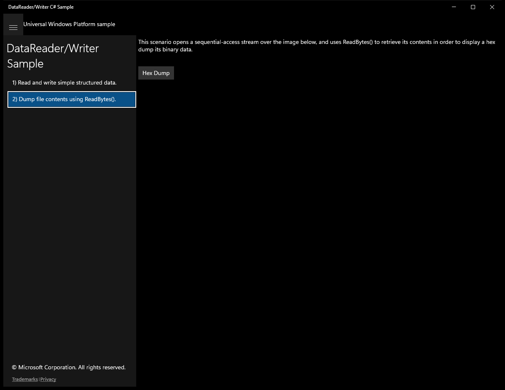
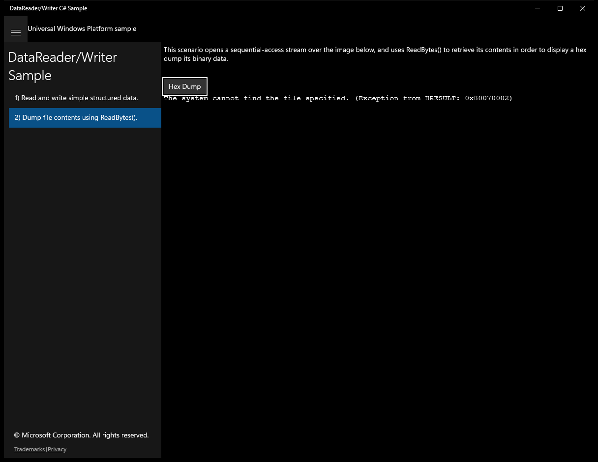

# DataReaderWriter (C#)

> **Source**: `Samples\DataReaderWriter\cs\`  
> **Feature**: DataReader/Writer Sample  
> **AUMID**: `Microsoft.SDKSamples.DataReaderWriter.CS_8wekyb3d8bbwe!App`  
> **PackageFamilyName**: `Microsoft.SDKSamples.DataReaderWriter.CS_8wekyb3d8bbwe`  

## Top-level UWP namespaces used
- `Windows.Storage.Streams.InMemoryRandomAccessStream`
- `Windows.Storage.Streams.DataWriter`
- `Windows.Storage.Streams.UnicodeEncoding.Utf8`
- `Windows.Storage.Streams.ByteOrder.LittleEndian`
- `Windows.Storage.Streams.DataReader`
- `Windows.Storage.StorageFile.GetFileFromApplicationUriAsync`

## Build / deploy / capture status
- build: ok
- deploy: ok
- launch: ok
- capture: ok
- uninstall: ok

## Main page

---

## Scenario 1 - Scenario1_WriteReadStream

### UI elements
- **TextBlock**  - x:Name="Description"
- **TextBlock**  - x:Name="ElementsToWrite"; text="Hello;World;1 2 3 4 5;Très bien!;Goodbye"
- **Button**  - x:Name="SendButton"; content="Copy Strings"; events: Click=TransferData
- **TextBlock**  - x:Name="ElementsRead"

### Code behavior
- **`WriteReadStream`**
    - API refs: `ElementsToWrite.Text`, `String.Join`
- **`TransferData`**
    - namespaces: `Windows.Storage.Streams.InMemoryRandomAccessStream`, `Windows.Storage.Streams.DataWriter`, `Windows.Storage.Streams.UnicodeEncoding.Utf8`, `Windows.Storage.Streams.ByteOrder.LittleEndian`, `Windows.Storage.Streams.DataReader`
    - instantiates: `Windows.Storage.Streams.InMemoryRandomAccessStream`, `Windows.Storage.Streams.DataWriter`, `Windows.Storage.Streams.DataReader`
    - API refs: `Windows.Storage`, `Streams.InMemoryRandomAccessStream`, `Streams.DataWriter`, `Streams.UnicodeEncoding`, `Streams.ByteOrder`, `Streams.DataReader`, `ElementsRead.Text`

### Screenshots
Initial state:

After click **Copy Strings**:

---

## Scenario 2 - Scenario2_ReadBytes

### UI elements
- **TextBlock**  - x:Name="Description"; text="This scenario opens a sequential-access stream over the image below, and uses ReadBytes() to retrieve its contents in order to display a hex dump its binary data."
- **Button**  - x:Name="HexDumpButton"; content="Hex Dump"; events: Click=HexDump
- **TextBlock**  - x:Name="ReadBytesOutput"

### Code behavior
- **`HexDump`**
    - namespaces: `Windows.Storage.StorageFile.GetFileFromApplicationUriAsync`, `Windows.Storage.Streams.DataReader`
    - instantiates: `Uri`, `Windows.Storage.Streams.DataReader`
    - API refs: `Windows.Storage`, `StorageFile.GetFileFromApplicationUriAsync`, `Streams.DataReader`, `ReadBytesOutput.Text`
    - updates UI: `ReadBytesOutput.Text`
- **`PrintRow`**
    - API refs: `ReadBytesOutput.Text`

### Screenshots
Initial state:

After click **Hex Dump**:

