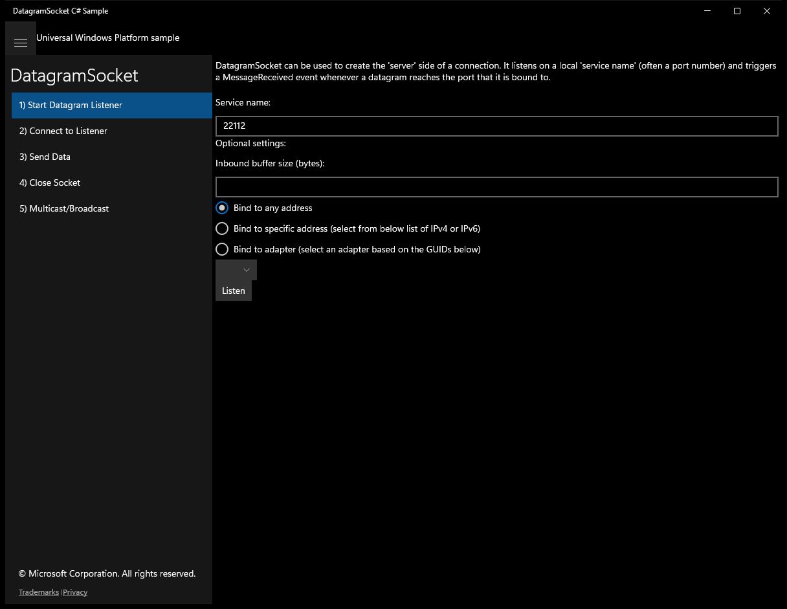
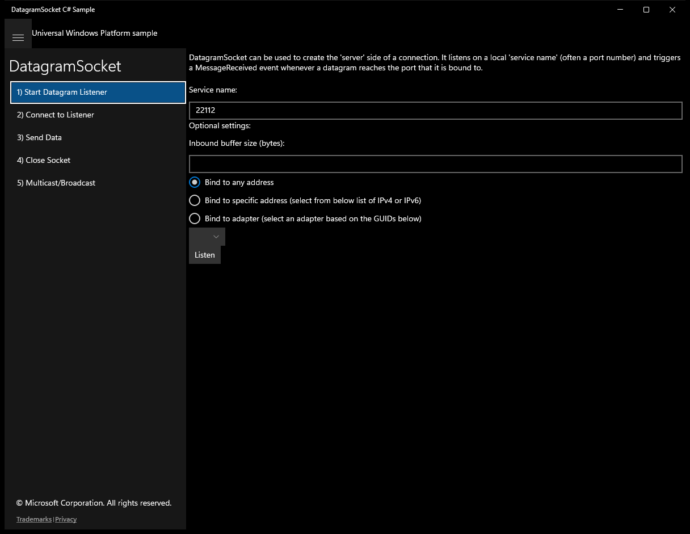
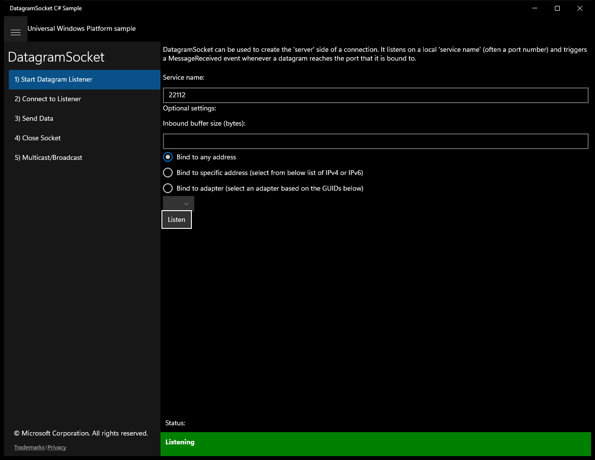
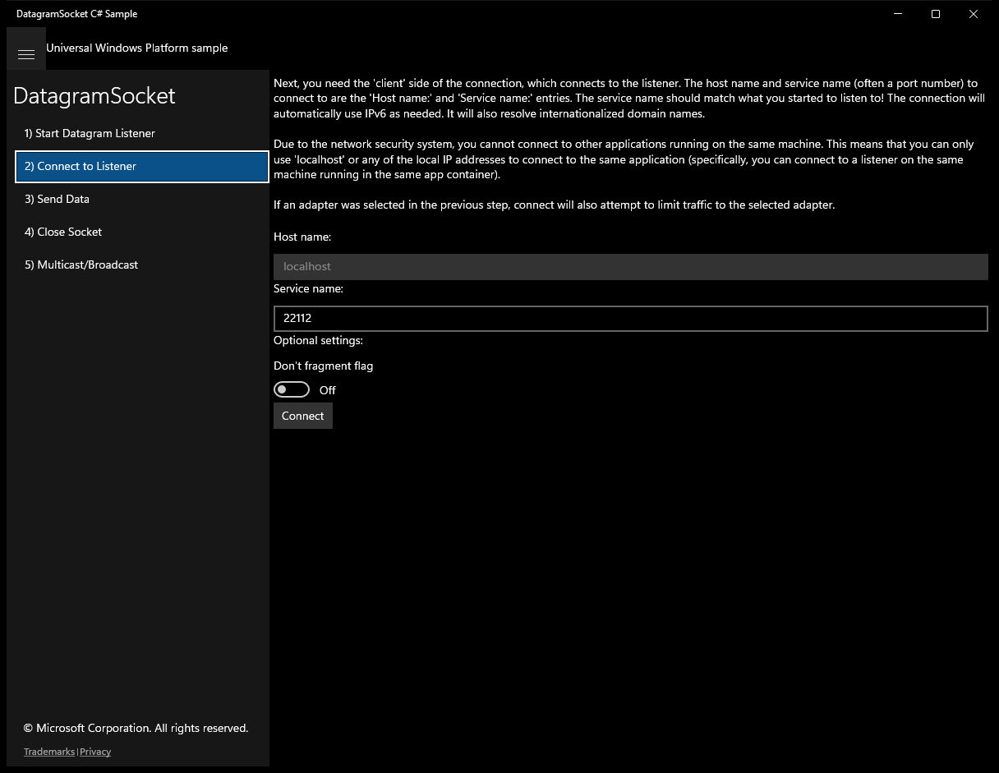
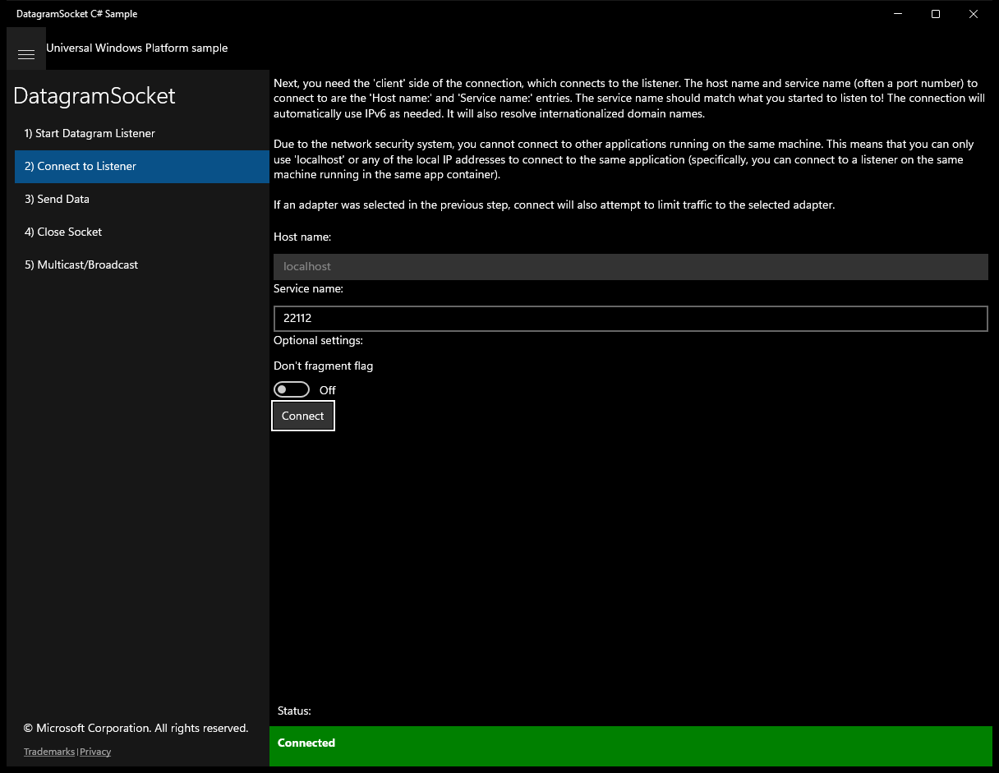
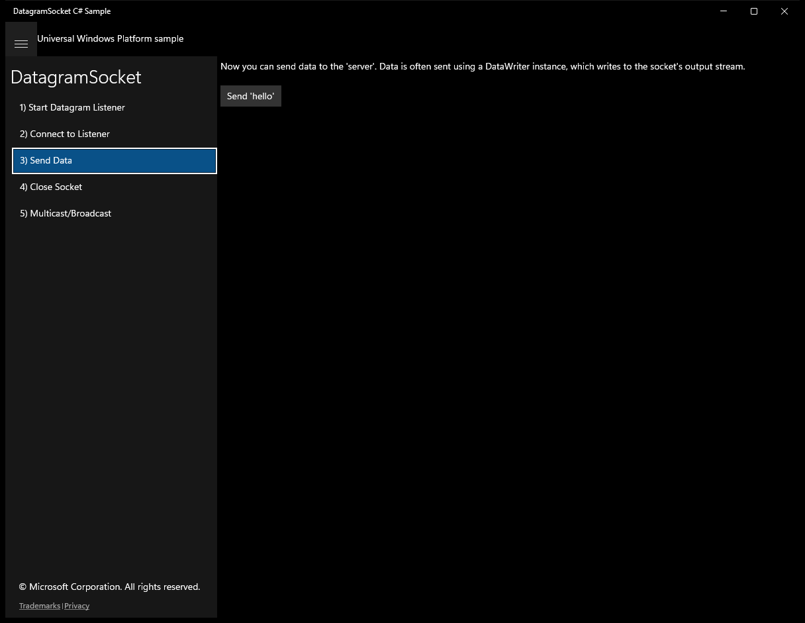
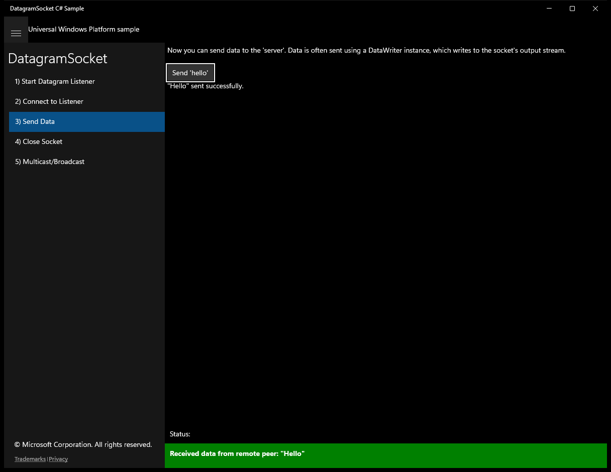
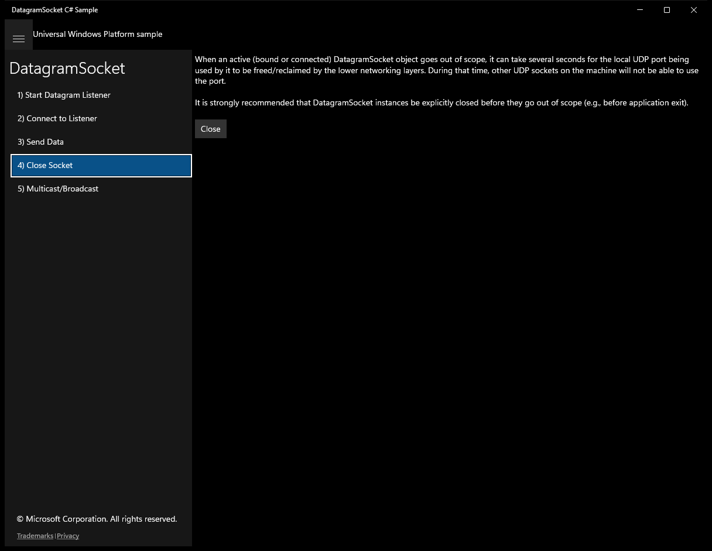
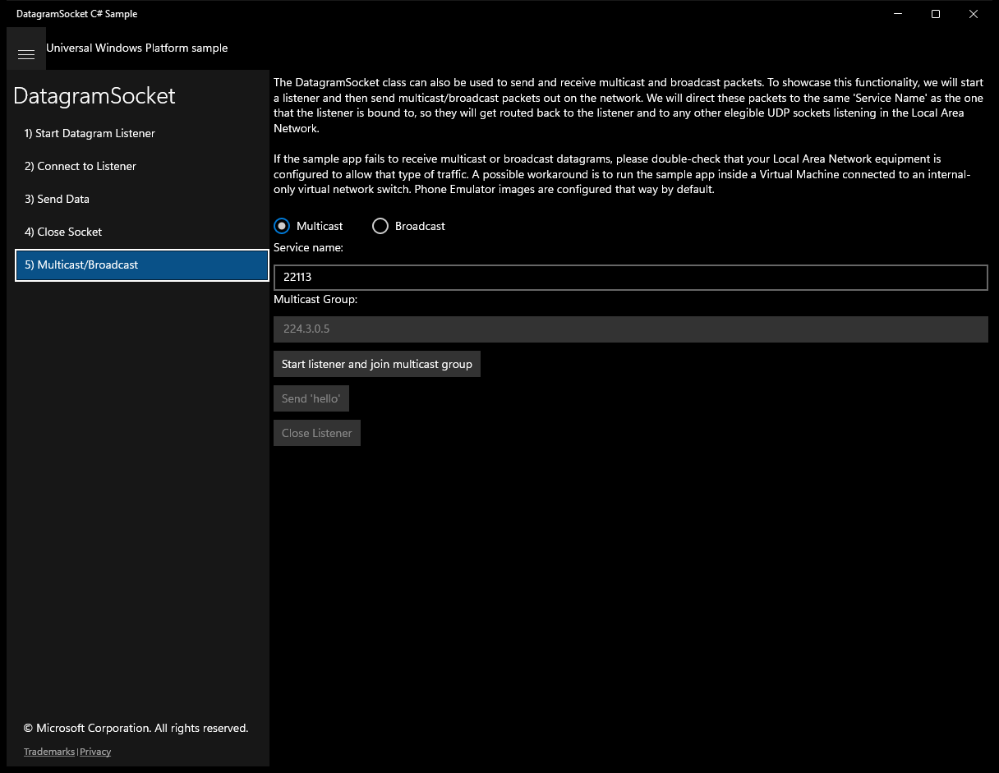
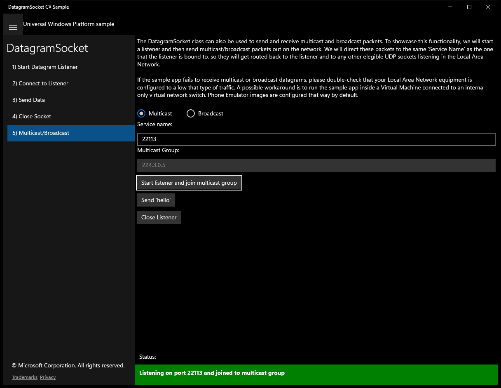

# DatagramSocket (C#)

> **Source**: `Samples\DatagramSocket\cs\`  
> **Feature**: DatagramSocket  
> **AUMID**: `Microsoft.SDKSamples.DatagramSocket.CS_8wekyb3d8bbwe!App`  
> **PackageFamilyName**: `Microsoft.SDKSamples.DatagramSocket.CS_8wekyb3d8bbwe`  

## Build / deploy / capture status
- build: ok
- deploy: ok
- launch: ok
- capture: ok
- uninstall: ok

## Main page

---

## Scenario 1 - Scenario1_Start

### UI elements
- **TextBlock**  - x:Name="InputTextBlock1"
- **TextBlock**  - text="Service name:"
- **TextBox**  - x:Name="ServiceNameForListener"; text="22112"
- **TextBlock**  - text="Optional settings:"
- **TextBlock**  - text="Inbound buffer size (bytes):"
- **TextBox**  - x:Name="InboundBufferSize"
- **RadioButton**  - x:Name="BindToAny"; events: Checked=BindToAny_Checked, Unchecked=BindToAny_Unchecked
- **RadioButton**  - x:Name="BindToAddress"
- **RadioButton**  - x:Name="BindToAdapter"
- **ComboBox**  - x:Name="AdapterList"
- **Button**  - x:Name="StartListener"; content="Listen"; events: Click=StartListener_Click

### Code behavior
- **`OnNavigatedTo`**
    - API refs: `BindToAny.IsChecked`
- **`BindToAny_Checked`**
    - API refs: `AdapterList.IsEnabled`
- **`BindToAny_Unchecked`**
    - API refs: `AdapterList.IsEnabled`
- **`StartListener_Click`**
    - instantiates: `DatagramSocket`
    - API refs: `String.IsNullOrEmpty`, `ServiceNameForListener.Text`, `NotifyType.ErrorMessage`, `CoreApplication.Properties`, `String.IsNullOrWhiteSpace`, `InboundBufferSize.Text`, `Control.InboundBufferSizeInBytes`, `BindToAddress.IsChecked`, `BindToAdapter.IsChecked`, `AdapterList.SelectedItem`, `LocalHost.CanonicalName`, `BindToAny.IsChecked`, `NotifyType.StatusMessage`, `LocalHost.IPInformation`, `SocketError.GetStatus`, `SocketErrorStatus.Unknown`
- **`MessageReceived`**
    - instantiates: `RemotePeer`
    - API refs: `CoreApplication.Properties`, `SocketError.GetStatus`, `SocketErrorStatus.Unknown`, `NotifyType.ErrorMessage`
- **`EchoMessage`**
    - API refs: `String.Format`, `NotifyType.ErrorMessage`, `OutputStream.WriteAsync`, `SocketError.GetStatus`, `SocketErrorStatus.Unknown`
- **`NotifyUserFromAsyncThread`**
    - API refs: `Dispatcher.RunAsync`, `CoreDispatcherPriority.Normal`
- **`PopulateAdapterList`**
    - instantiates: `LocalHostItem`
    - API refs: `AdapterList.ItemsSource`, `AdapterList.DisplayMemberPath`, `NetworkInformation.GetHostNames`
- **`LocalHostItem`**
    - instantiates: `ArgumentNullException`, `ArgumentException`
    - API refs: `IPInformation.NetworkAdapter`

### Screenshots
Initial state:

After click **Listen**:

---

## Scenario 2 - Scenario2_Connect

### UI elements
- **TextBlock**  - text="Host name:"
- **TextBox**  - x:Name="HostNameForConnect"; text="localhost"
- **TextBlock**  - text="Service name:"
- **TextBox**  - x:Name="ServiceNameForConnect"; text="22112"
- **TextBlock**  - text="Optional settings:"
- **ToggleSwitch**  - x:Name="DontFragment"
- **Button**  - x:Name="ConnectSocket"; content="Connect"; events: Click=ConnectSocket_Click

### Code behavior
- **`OnNavigatedTo`**
    - API refs: `CoreApplication.Properties`, `HostNameForConnect.Text`
- **`ConnectSocket_Click`**
    - instantiates: `HostName`, `DatagramSocket`
    - API refs: `String.IsNullOrEmpty`, `ServiceNameForConnect.Text`, `NotifyType.ErrorMessage`, `HostNameForConnect.Text`, `CoreApplication.Properties`, `DontFragment.IsOn`, `Control.DontFragment`, `NotifyType.StatusMessage`, `SocketError.GetStatus`, `SocketErrorStatus.Unknown`
- **`MessageReceived`**
    - API refs: `NotifyType.StatusMessage`, `SocketError.GetStatus`, `SocketErrorStatus.ConnectionResetByPeer`, `NotifyType.ErrorMessage`, `SocketErrorStatus.Unknown`
- **`NotifyUserFromAsyncThread`**
    - API refs: `Dispatcher.RunAsync`, `CoreDispatcherPriority.Normal`

### Screenshots
Initial state:

> Button **Don't fragment flag** skipped (invoke_failed)

After click **Connect**:

---

## Scenario 3 - Scenario3_Send

### UI elements
- **TextBlock**  - x:Name="InputTextBlock1"; text="Now you can send data to the 'server'. Data is often sent using a DataWriter instance, which writes to the socket's output stream."
- **Button**  - x:Name="SendHello"; content="Send 'hello'"; events: Click=SendHello_Click
- **TextBlock**  - x:Name="SendOutput"

### Code behavior
- **`SendHello_Click`**
    - instantiates: `DataWriter`
    - API refs: `CoreApplication.Properties`, `NotifyType.ErrorMessage`, `SendOutput.Text`, `SocketError.GetStatus`, `SocketErrorStatus.Unknown`
    - updates UI: `SendOutput.Text`

### Screenshots
Initial state:

After click **Send 'hello'**:

---

## Scenario 4 - Scenario4_Close

### UI elements
- **TextBlock**  - x:Name="InputTextBlock1"
- **Button**  - x:Name="CloseSockets"; content="Close"; events: Click=CloseSockets_Click

### Code behavior
- **`CloseSockets_Click`**
    - API refs: `CoreApplication.Properties`, `DatagramSocket.Close`, `NotifyType.StatusMessage`

### Screenshots
Initial state:

---

## Scenario 5 - Scenario5_MulticastAndBroadcast

### UI elements
- **TextBlock**  - x:Name="InputTextBlock1"
- **RadioButton**  - x:Name="MulticastRadioButton"; events: Checked=MulticastRadioButton_Checked, Unchecked=MulticastRadioButton_Unchecked
- **TextBlock**  - text="Service name:"
- **TextBox**  - x:Name="ServiceName"; text="22113"
- **TextBlock**  - x:Name="RemoteAddressLabel"
- **TextBox**  - x:Name="RemoteAddress"
- **Button**  - x:Name="StartListener"; events: Click=StartListener_Click
- **Button**  - x:Name="SendMessageButton"; content="Send 'hello'"; events: Click=SendMessage_Click
- **Button**  - x:Name="CloseListenerButton"; content="Close Listener"; events: Click=CloseListener_Click
- **TextBlock**  - x:Name="SendOutput"

### Code behavior
- **`CloseListenerSocket`**
    - API refs: `DatagramSocket.Close`
- **`OnNavigatedTo`**
    - API refs: `MulticastRadioButton.IsChecked`
- **`SetupMulticastScenarioUI`**
    - API refs: `RemoteAddressLabel.Text`, `StartListener.Content`, `RemoteAddress.Text`, `RemoteAddress.IsEnabled`, `SendMessageButton.IsEnabled`, `CloseListenerButton.IsEnabled`, `SendOutput.Text`
    - updates UI: `SendOutput.Text`
- **`SetupBroadcastScenarioUI`**
    - API refs: `RemoteAddressLabel.Text`, `StartListener.Content`, `RemoteAddress.Text`, `RemoteAddress.IsEnabled`, `SendMessageButton.IsEnabled`, `CloseListenerButton.IsEnabled`, `SendOutput.Text`
    - updates UI: `SendOutput.Text`
- **`StartListener_Click`**
    - instantiates: `DatagramSocket`, `HostName`
    - API refs: `String.IsNullOrEmpty`, `ServiceName.Text`, `NotifyType.ErrorMessage`, `MulticastRadioButton.IsChecked`, `Control.MulticastOnly`, `RemoteAddress.Text`, `Information.LocalPort`, `NotifyType.StatusMessage`, `SendMessageButton.IsEnabled`, `CloseListenerButton.IsEnabled`, `SocketError.GetStatus`, `SocketErrorStatus.Unknown`
- **`SendMessage_Click`**
    - instantiates: `HostName`, `DataWriter`
    - API refs: `SendOutput.Text`, `RemoteAddress.Text`, `ServiceName.Text`, `SocketError.GetStatus`, `SocketErrorStatus.Unknown`, `NotifyType.ErrorMessage`
    - updates UI: `SendOutput.Text`
- **`CloseListener_Click`**
    - API refs: `SendMessageButton.IsEnabled`, `CloseListenerButton.IsEnabled`, `SendOutput.Text`, `NotifyType.StatusMessage`
    - updates UI: `SendOutput.Text`
- **`MessageReceived`**
    - API refs: `RemoteAddress.CanonicalName`, `NotifyType.StatusMessage`, `SocketError.GetStatus`, `SocketErrorStatus.Unknown`, `NotifyType.ErrorMessage`
- **`NotifyUserFromAsyncThread`**
    - API refs: `Dispatcher.RunAsync`, `CoreDispatcherPriority.Normal`

### Screenshots
Initial state:

After click **Start listener and join multicast group**:

