# DateTimeFormatting (C#)

> **Source**: `Samples\DateTimeFormatting\cs\`  
> **Feature**: Date and time formatting  
> **AUMID**: `Microsoft.SDKSamples.DateTimeFormatting.CS_8wekyb3d8bbwe!DateTimeFormatting.App`  
> **PackageFamilyName**: `Microsoft.SDKSamples.DateTimeFormatting.CS_8wekyb3d8bbwe`  

## Sample purpose
Shows how to use the DateTimeFormatter to display dates and times according to the user's preferences.

## Scenarios demonstrated (from README)
- How to format the current date and time using the Long and Short formats.
- How to format the current date and time using custom formats that are specified using a template string or a parameterized template.
- How to format dates and times by overriding the user's default global context. This is used when an app presents dates or times that reflect different settings from the user's current defaults.
- How to format dates and times by using Unicode extensions in specified languages, overriding the user's default global context if applicable.
- How to convert and format the current date and time using the time zone support available in the Format method.

## Top-level UWP namespaces used
- `Windows.Globalization.DateTimeFormatting.DateTimeFormatter`

## Build / deploy / capture status
- build: skipped
- deploy: ok
- launch: ok
- capture: ok
- uninstall: ok

## Main page
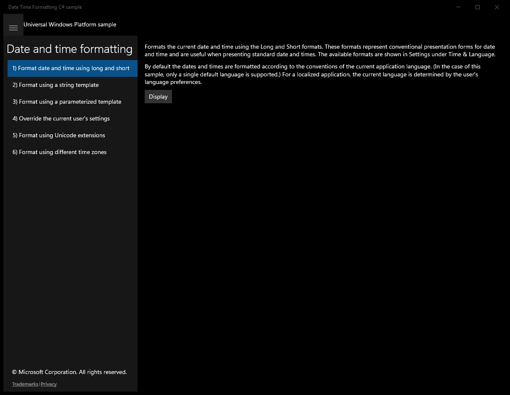

---

## Scenario 1 - Format date and time using long and short

**Description**: Formats the current date and time using the Long and Short formats. These formats represent conventional presentation forms for date and time and are useful when presenting standard date and times. The available formats are shown in Settings under Time &amp; Language.

### UI elements
- **Button**  - content="Display"; events: Click={x:Bind Display}
- **TextBlock**  - x:Name="OutputTextBlock"

### Code behavior
- **`Display`**
    - namespaces: `Windows.Globalization.DateTimeFormatting.DateTimeFormatter`
    - instantiates: `StringBuilder`, `DateTimeFormatter`
    - API refs: `Windows.Globalization`, `DateTimeFormatting.DateTimeFormatter`, `ApplicationLanguages.Languages`, `DateTime.Now`, `OutputTextBlock.Text`
    - updates UI: `OutputTextBlock.Text`

### Screenshots
Initial state:

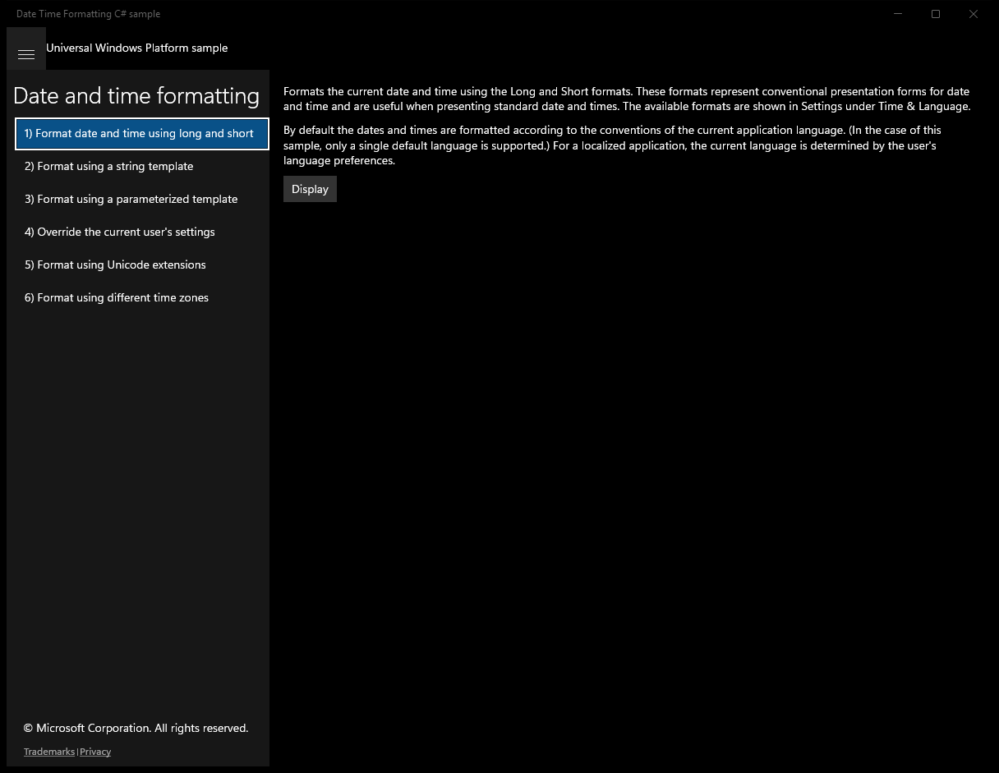

After click **Display**:

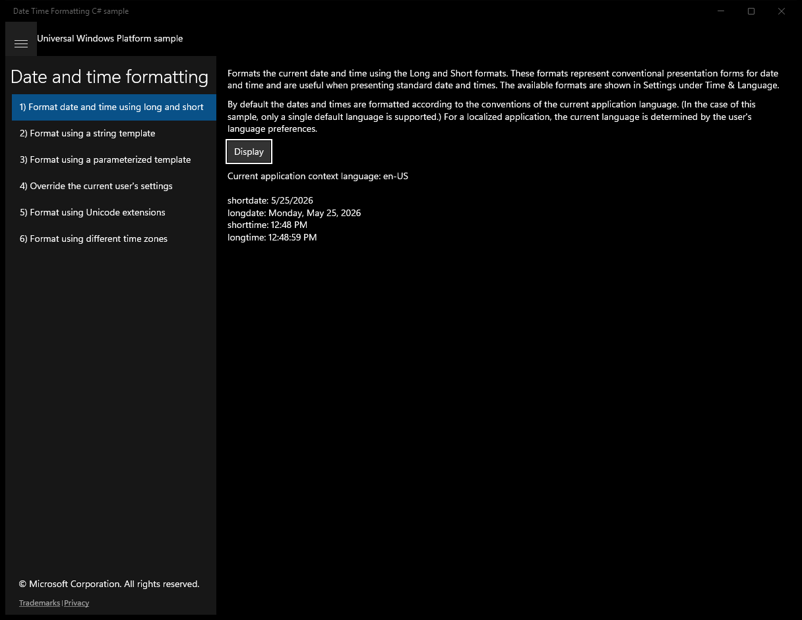

---

## Scenario 2 - Format using a string template

**Description**: Formats the current date and time using custom formats that are specified using a template string. This can be used when the requirements for the date presentation do not match the “short” or “long” form.

### UI elements
- **Button**  - content="Display"; events: Click={x:Bind Display}
- **TextBlock**  - x:Name="OutputTextBlock"

### Code behavior
- **`Display`**
    - namespaces: `Windows.Globalization.DateTimeFormatting.DateTimeFormatter`
    - instantiates: `DateTimeFormatter`, `StringBuilder`
    - API refs: `Windows.Globalization`, `DateTimeFormatting.DateTimeFormatter`, `DateTime.Now`, `ApplicationLanguages.Languages`, `OutputTextBlock.Text`
    - updates UI: `OutputTextBlock.Text`

### Screenshots
Initial state:

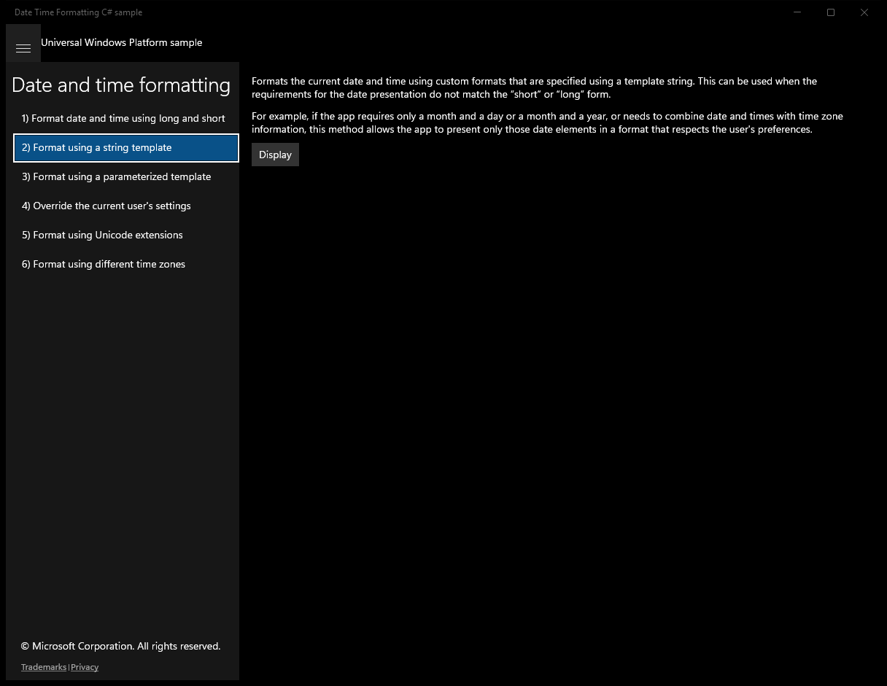

After click **Display**:

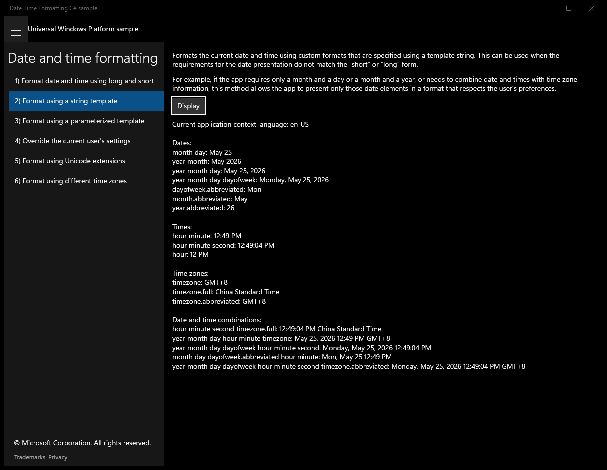

---

## Scenario 3 - Format using a parameterized template

**Description**: Formats the current date and time using custom formats that are specified using a parameterized template. This method for formatting dates or times can be used when the requirements for the date presentation do not match the "short" or "long" form. For example, if the app requires only a month and a day or a month and a year, this method allows the app to present only those date elements in a format that respects the user's preferences.

### UI elements
- **Button**  - content="Display"; events: Click={x:Bind Display}
- **TextBlock**  - x:Name="OutputTextBlock"

### Code behavior
- **`Display`**
    - namespaces: `Windows.Globalization.DateTimeFormatting.DateTimeFormatter`
    - instantiates: `StringBuilder`, `DateTimeFormatter`
    - API refs: `Windows.Globalization`, `DateTimeFormatting.DateTimeFormatter`, `ApplicationLanguages.Languages`, `YearFormat.Full`, `MonthFormat.Abbreviated`, `DayFormat.Default`, `DayOfWeekFormat.Abbreviated`, `YearFormat.Abbreviated`, `DayOfWeekFormat.None`, `MonthFormat.Full`, `DayFormat.None`, `YearFormat.None`, `HourFormat.Default`, `MinuteFormat.Default`, `SecondFormat.Default`, `SecondFormat.None`, `MinuteFormat.None`, `DateTime.Now`, `OutputTextBlock.Text`
    - updates UI: `OutputTextBlock.Text`

### Screenshots
Initial state:

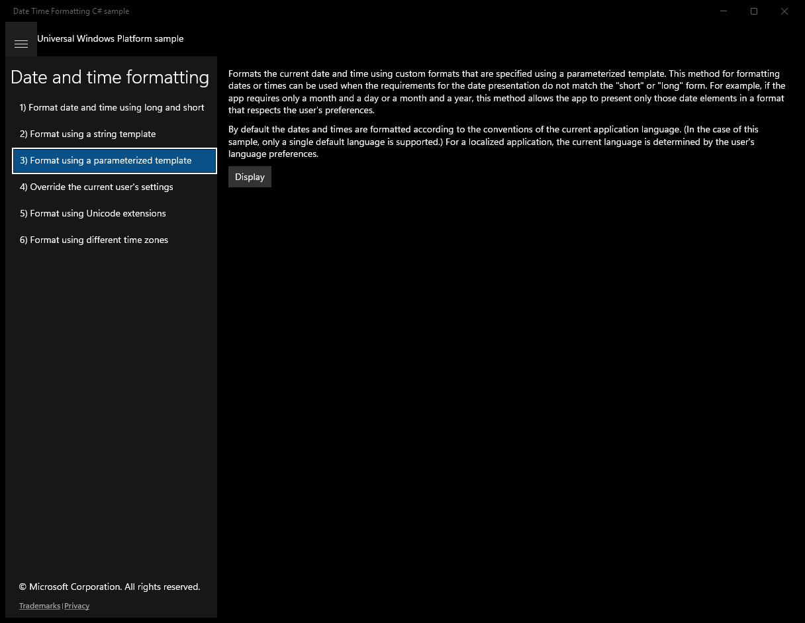

After click **Display**:

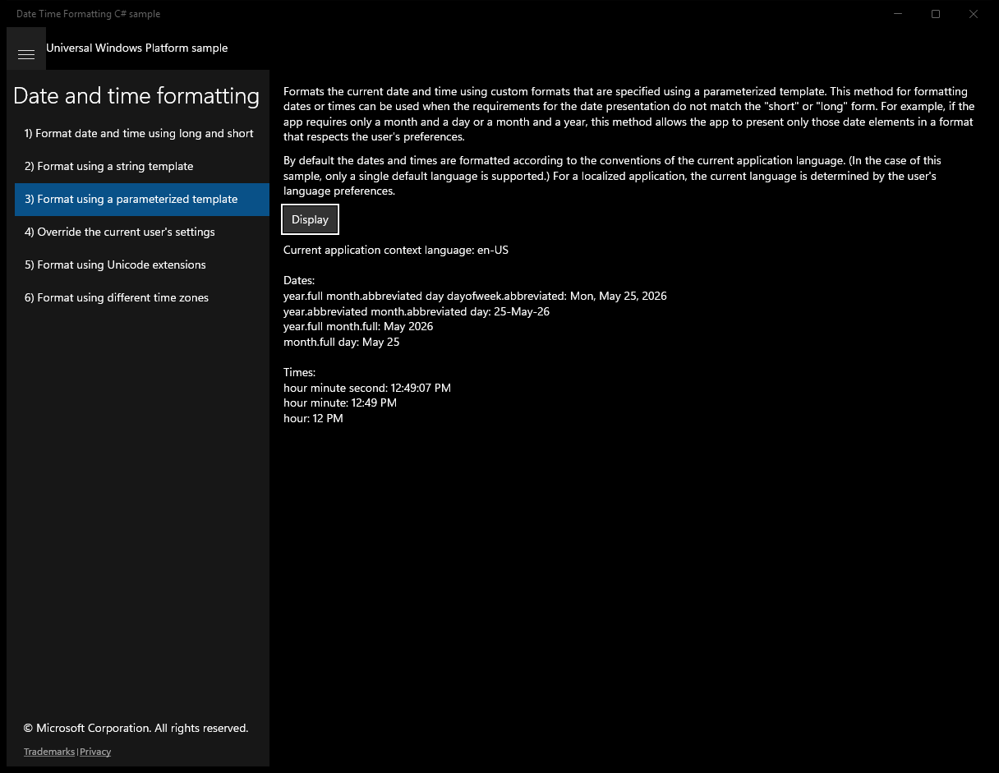

---

## Scenario 4 - Override the current user's settings

**Description**: Formats dates and times by overriding the user's default global context. This method is used when an app presents dates or times that reflect settings different from the user's current defaults. You can specifying overrides for language(s), region, clock, and calendar.

### UI elements
- **Button**  - content="Display"; events: Click={x:Bind Display}
- **TextBlock**  - x:Name="OutputTextBlock"

### Code behavior
- **`Display`**
    - namespaces: `Windows.Globalization.DateTimeFormatting.DateTimeFormatter`
    - instantiates: `StringBuilder`, `DateTimeFormatter`
    - API refs: `Windows.Globalization`, `DateTimeFormatting.DateTimeFormatter`, `ApplicationLanguages.Languages`, `CalendarIdentifiers.Japanese`, `ClockIdentifiers.TwelveHour`, `CalendarIdentifiers.Gregorian`, `ClockIdentifiers.TwentyFourHour`, `YearFormat.Abbreviated`, `MonthFormat.Abbreviated`, `DayFormat.Default`, `DayOfWeekFormat.None`, `HourFormat.None`, `MinuteFormat.None`, `SecondFormat.None`, `YearFormat.None`, `MonthFormat.None`, `DayFormat.None`, `HourFormat.Default`, `MinuteFormat.Default`, `DateTime.Now`, `OutputTextBlock.Text`
    - updates UI: `OutputTextBlock.Text`

### Screenshots
Initial state:

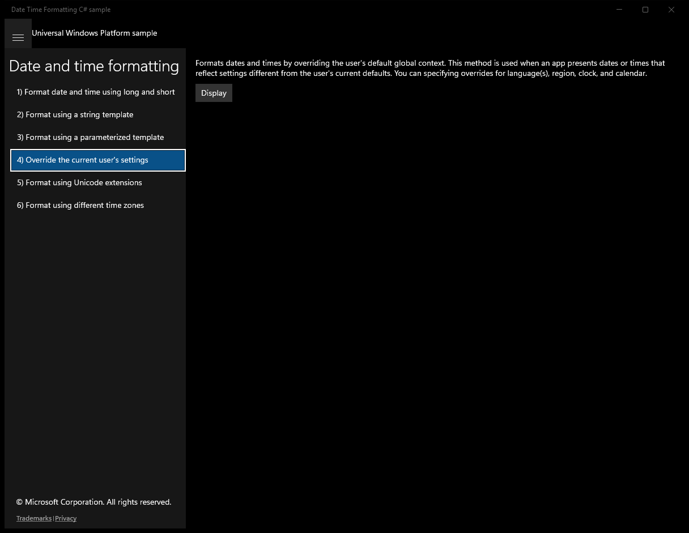

After click **Display**:

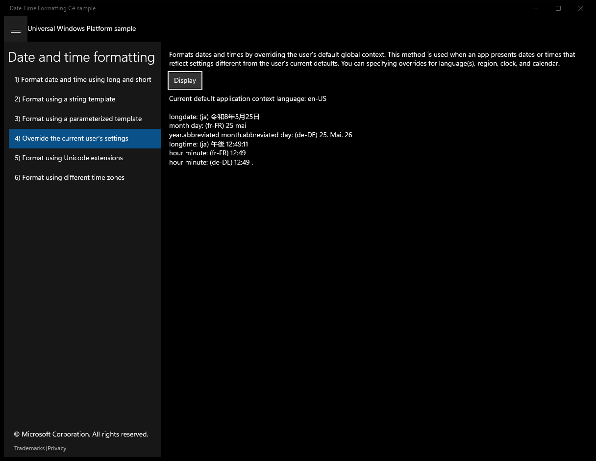

---

## Scenario 5 - Format using Unicode extensions

**Description**: Format dates and times by using Unicode extensions in specified languages, overriding the user’s default global context if applicable. This method is used when an app presents dates or times that reflect different settings from the user’s current defaults by specifying the overrides directly as extensions in language tags.

### UI elements
- **Button**  - content="Display"; events: Click={x:Bind Display}
- **TextBlock**  - x:Name="OutputTextBlock"

### Code behavior
- **`Display`**
    - namespaces: `Windows.Globalization.DateTimeFormatting.DateTimeFormatter`
    - instantiates: `StringBuilder`, `DateTimeFormatter`
    - API refs: `Windows.Globalization`, `DateTimeFormatting.DateTimeFormatter`, `ApplicationLanguages.Languages`, `YearFormat.Default`, `MonthFormat.Default`, `DayFormat.Default`, `DayOfWeekFormat.Default`, `HourFormat.Default`, `MinuteFormat.Default`, `SecondFormat.Default`, `CalendarIdentifiers.Gregorian`, `ClockIdentifiers.TwentyFourHour`, `DateTime.Now`, `OutputTextBlock.Text`
    - updates UI: `OutputTextBlock.Text`

### Screenshots
Initial state:

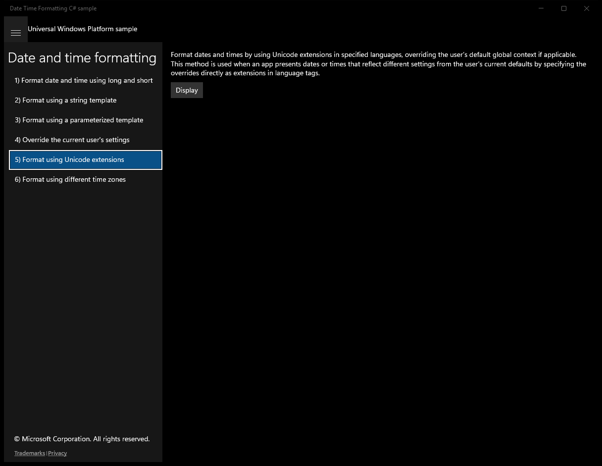

After click **Display**:

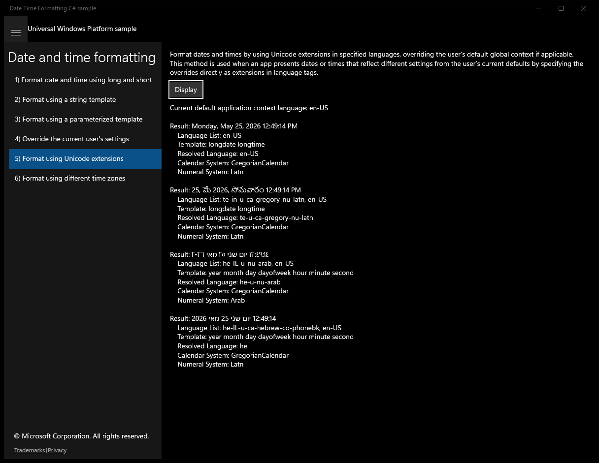

---

## Scenario 6 - Format using different time zones

**Description**: Converts and formats the current date and time using the time zone support available in the Format method.

### UI elements
- **TextBlock**  - text="Converts and formats the current date and time using the time zone support available in the Format method."
- **Button**  - content="Display"; events: Click={x:Bind Display}
- **TextBlock**  - x:Name="OutputTextBlock"

### Code behavior
- **`Display`**
    - instantiates: `StringBuilder`, `DateTimeFormatter`, `DateTime`
    - API refs: `DateTime.Now`, `OutputTextBlock.Text`
    - updates UI: `OutputTextBlock.Text`

### Screenshots
Initial state:

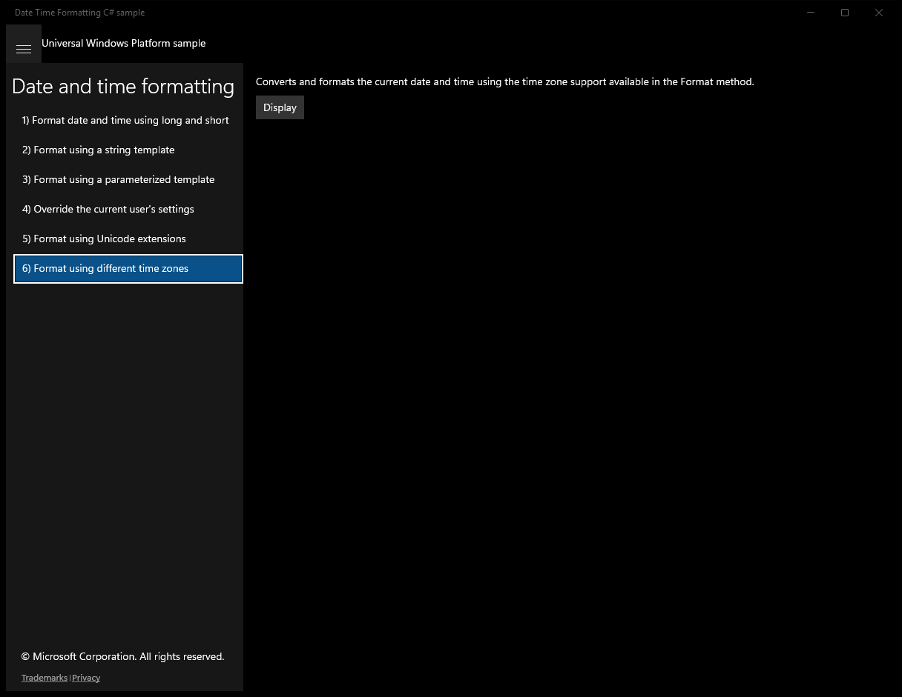

After click **Display**:

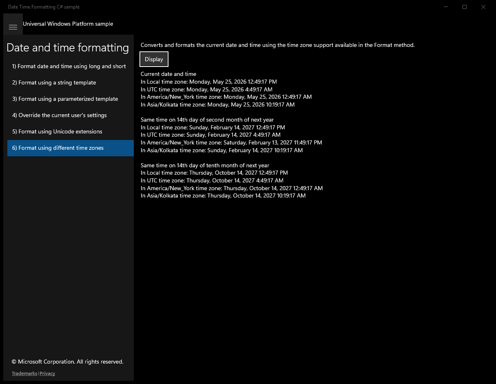

