# DeviceEnumerationAndPairing (C#)

> **Source**: `Samples\DeviceEnumerationAndPairing\cs\`  
> **Feature**: Device Enumeration and Pairing C# Sample  
> **AUMID**: `Microsoft.SDKSamples.DeviceEnumeration.CS_8wekyb3d8bbwe!App`  
> **PackageFamilyName**: `Microsoft.SDKSamples.DeviceEnumeration.CS_8wekyb3d8bbwe`  

## Build / deploy / capture status
- build: ok
- deploy: ok
- launch: ok
- capture: ok
- uninstall: ok

## Main page

---

## Scenario 1 - Device Picker Common Control

### UI elements
- **TextBlock**  - text="{Binding Path=DisplayName}"
- **TextBlock**  - text="Name:"
- **TextBlock**  - text="{x:Bind Name, Mode=OneWay}"
- **TextBlock**  - text="Id:"
- **TextBlock**  - text="{x:Bind Id, Mode=OneWay}"
- **TextBlock**  - text="Description:"
- **TextBlock**  - text="This scenario demonstrates the use of the Windows.Devices.Enumeration.DevicePicker. DevicePicker is a UI control that allows users of your app to pick a device"
- **TextBlock**  - text="Choose a device selector:"
- **ComboBox**  - x:Name="selectorComboBox"
- **Button**  - x:Name="pickSingleDeviceButton"; text="Pick Single Device"; events: Click=PickSingleDeviceButton_Click
- **Button**  - x:Name="showDevicePickerButton"; text="Show Device Picker"; events: Click=ShowDevicePickerButton_Click
- **ListView**  - x:Name="resultsListView"

### Code behavior
- **`OnNavigatedTo`**
    - API refs: `DeviceSelectorChoices.DevicePickerSelectors`
- **`ShowDevicePicker`**
    - instantiates: `DevicePicker`, `Point`, `Rect`, `DeviceInformationDisplay`, `TypedEventHandler`
    - API refs: `Filter.SupportedDeviceClasses`, `Filter.SupportedDeviceSelectors`, `NotifyType.StatusMessage`, `Dispatcher.RunAsync`, `CoreDispatcherPriority.Low`

### Screenshots
Initial state:

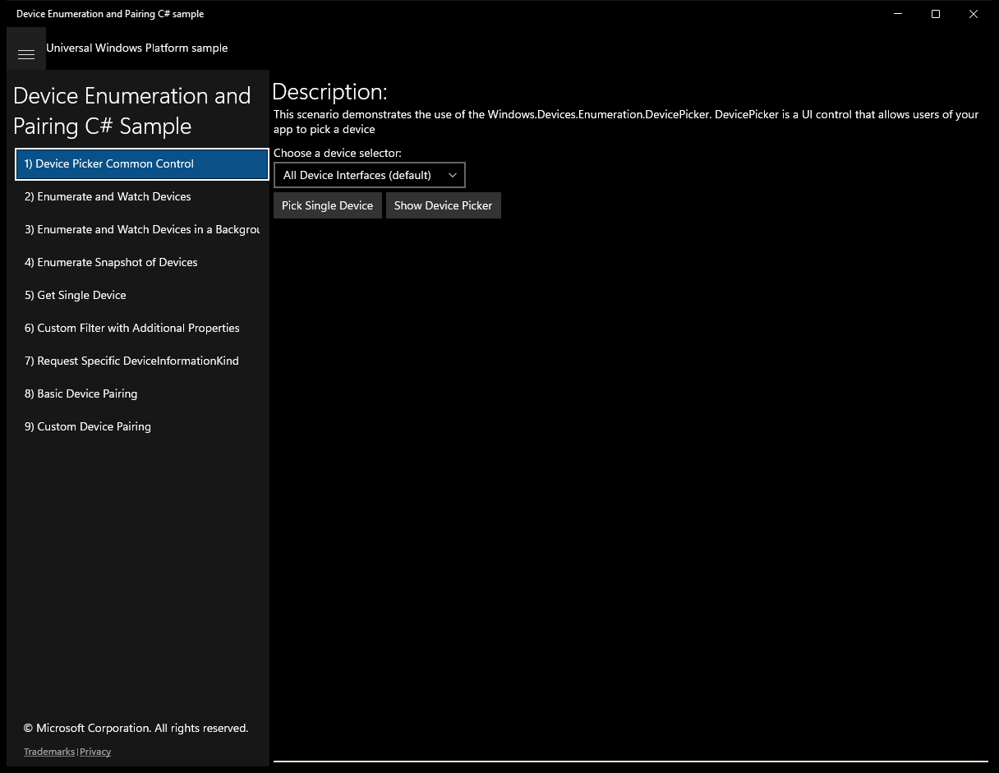

After click **Pick Single Device**:

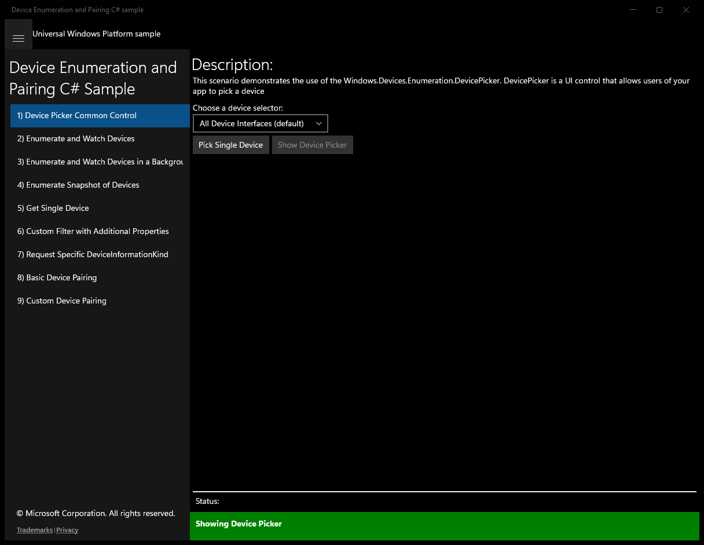

> Button **Show Device Picker** skipped (invoke_failed)

---

## Scenario 2 - Enumerate and Watch Devices

### UI elements
- **TextBlock**  - text="{Binding Path=DisplayName}"
- **TextBlock**  - text="Name:"
- **TextBlock**  - text="{x:Bind Name, Mode=OneWay}"
- **TextBlock**  - text="Id:"
- **TextBlock**  - text="{x:Bind Id, Mode=OneWay}"
- **TextBlock**  - text="Description:"
- **TextBlock**  - text="This scenario demonstrates the use of the Windows.Devices.Enumeration DeviceWatcher. Device Watcher allows you to find and recieve updates for devices that you care about."
- **ComboBox**  - x:Name="selectorComboBox"
- **Button**  - x:Name="startWatcherButton"; content="Start Watcher"; events: Click=StartWatcherButton_Click
- **Button**  - x:Name="stopWatcherButton"; content="Stop Watcher"; events: Click=StopWatcherButton_Click
- **ListView**  - x:Name="resultsListView"

### Code behavior
- **`OnNavigatedTo`**
    - API refs: `DeviceSelectorChoices.DeviceWatcherSelectors`
- **`StartWatcher`**
    - API refs: `DeviceInformation.CreateWatcher`, `DeviceInformationKind.Unknown`, `NotifyType.StatusMessage`

### Screenshots
Initial state:

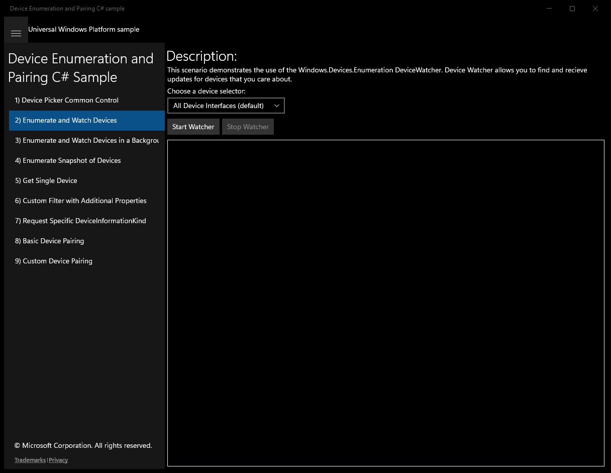

After click **Start Watcher**:

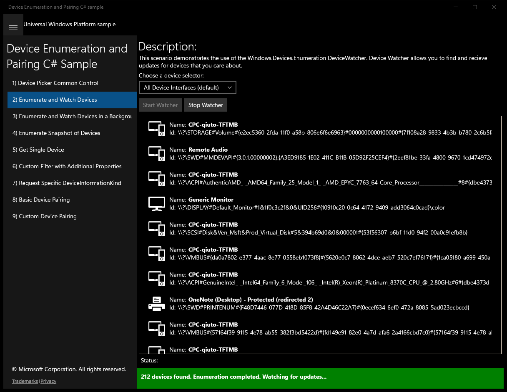

---

## Scenario 3 - Enumerate and Watch Devices in a Background Task

### UI elements
- **TextBlock**  - text="{Binding Path=DisplayName}"
- **TextBlock**  - text="Description:"
- **TextBlock**  - text="This scenario demonstrates the use of the Windows.Devices.Enumeration DeviceWatcherTrigger. DeviceWatcherTrigger is similar to DeviceWatcher, but is performed in a background task. Note that Bluetooth and Wi-Fi Direct selectors that perform 'live' protocol queries aren't support for perforfance reasons."
- **TextBlock**  - text="Choose a device selector:"
- **ComboBox**  - x:Name="selectorComboBox"
- **Button**  - x:Name="startWatcherButton"; text="Start Background Watcher"; events: Click=StartWatcherButton_Click
- **Button**  - x:Name="stopWatcherButton"; text="Stop Background Watcher"; events: Click=StopWatcherButton_Click
- **TextBlock**  - text="You can see results from the DeviceWatcherTrigger in the debugger output window"

### Code behavior
- **`OnNavigatedTo`**
    - API refs: `DeviceSelectorChoices.BackgroundDeviceWatcherSelectors`, `BackgroundTaskRegistration.AllTasks`, `Value.Name`
- **`StartWatcher`**
    - API refs: `DeviceWatcherEventKind.Add`, `DeviceWatcherEventKind.Remove`, `DeviceWatcherEventKind.Update`, `DeviceInformation.CreateWatcher`, `DeviceInformationKind.Unknown`, `NotifyType.StatusMessage`
- **`RegisterBackgroundTask`**
    - instantiates: `BackgroundTaskBuilder`
    - API refs: `BackgroundTaskRegistration.AllTasks`, `Value.Name`, `BackgroundDeviceWatcherTaskCs.BackgroundDeviceWatcher`
- **`OnTaskCompleted`**
    - API refs: `Dispatcher.RunAsync`, `CoreDispatcherPriority.Normal`, `NotifyType.StatusMessage`
- **`UnregisterBackgroundTask`**
    - API refs: `ApplicationData.Current`

### Screenshots
Initial state:

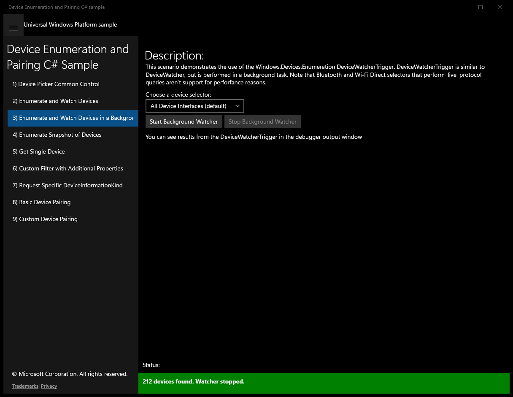

After click **Start Background Watcher**:

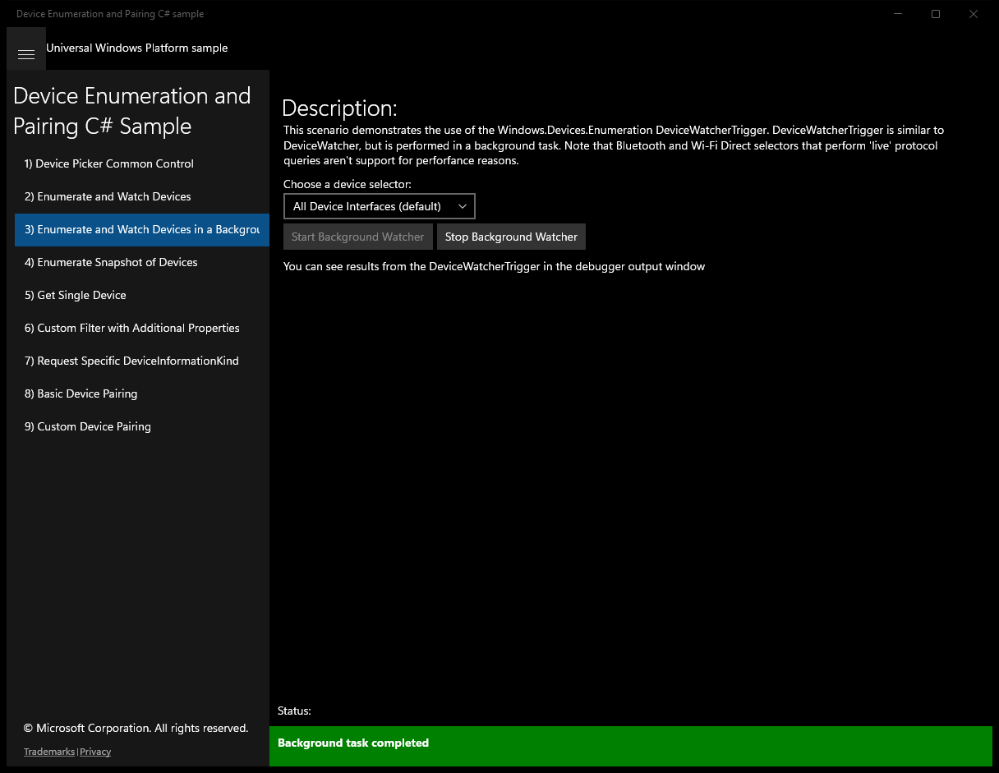

---

## Scenario 4 - Enumerate Snapshot of Devices

### UI elements
- **TextBlock**  - text="{Binding Path=DisplayName}"
- **TextBlock**  - text="Name:"
- **TextBlock**  - text="{x:Bind Name, Mode=OneWay}"
- **TextBlock**  - text="Id:"
- **TextBlock**  - text="{x:Bind Id, Mode=OneWay}"
- **TextBlock**  - text="Description:"
- **TextBlock**  - text="This scenario demonstrates the use of the Windows.Devices.Enumeration DeviceInformation.FindAllAsync. Use for grabbing a quick snapshot of devices you care about."
- **ComboBox**  - x:Name="selectorComboBox"
- **Button**  - x:Name="findButton"; content="Find"; events: Click=FindButton_Click
- **ListView**  - x:Name="resultsListView"

### Code behavior
- **`OnNavigatedTo`**
    - API refs: `DeviceSelectorChoices.FindAllAsyncSelectors`
- **`FindButton_Click`**
    - instantiates: `DeviceInformationDisplay`
    - API refs: `NotifyType.StatusMessage`, `DeviceInformation.FindAllAsync`, `String.Format`

### Screenshots
Initial state:

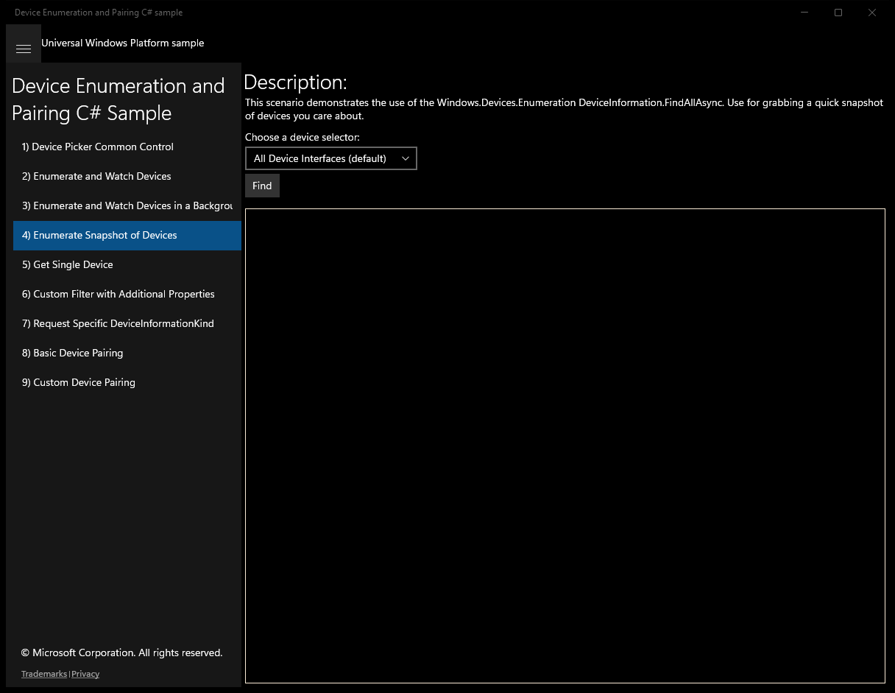

After click **Find**:

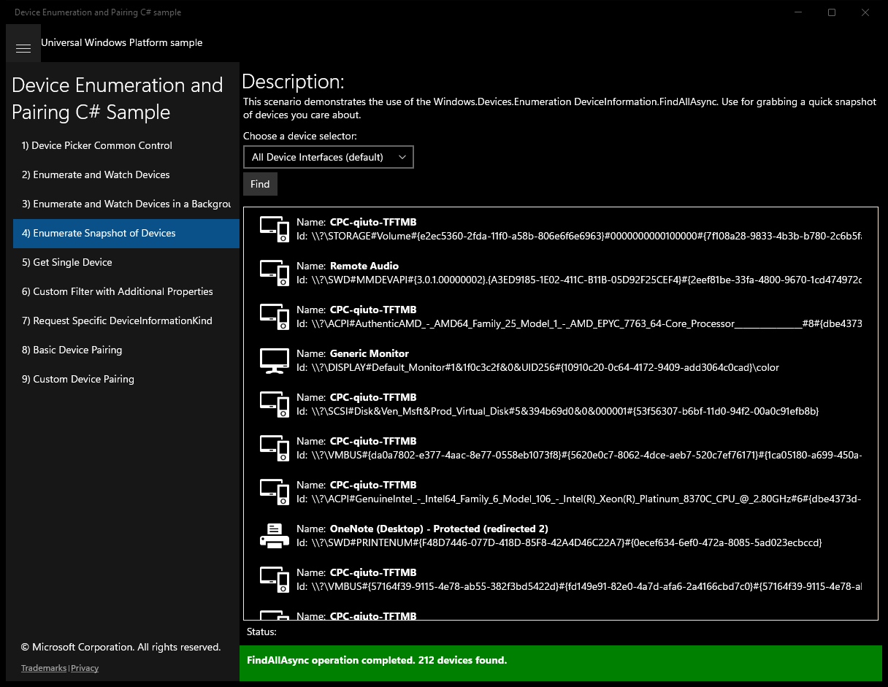

---

## Scenario 5 - Get Single Device

### UI elements
- **TextBlock**  - text="Name:"
- **TextBlock**  - text="{x:Bind Name, Mode=OneWay}"
- **TextBlock**  - text="Id:"
- **TextBlock**  - text="{x:Bind Id, Mode=OneWay}"
- **TextBlock**  - text="Description:"
- **TextBlock**  - text="This scenario demonstrates the use of the DeviceInformation.CreateFromIdAsync method. This would typically be used when you have a device id saved, and want to retrieve information about that device again."
- **TextBox**  - x:Name="interfaceIdTextBox"
- **TextBox**  - x:Name="InformationKindTextBox"
- **Button**  - x:Name="getButton"; content="Get"; events: Click=GetButton_Click
- **ListView**  - x:Name="resultsListView"

### Code behavior
- **`Page_Loaded`**
    - API refs: `DeviceInformation.FindAllAsync`, `DeviceClass.AudioRender`, `DeviceInformation.Kind`, `DeviceInformation.Id`, `InformationKindTextBox.Text`
    - updates UI: `interfaceIdTextBox.Text`, `InformationKindTextBox.Text`
- **`GetButton_Click`**
    - instantiates: `DeviceInformationDisplay`
    - API refs: `NotifyType.StatusMessage`, `DeviceInformation.Kind`, `DeviceInformation.Id`, `DeviceInformation.CreateFromIdAsync`, `NotifyType.ErrorMessage`, `FocusState.Keyboard`

### Screenshots
Initial state:

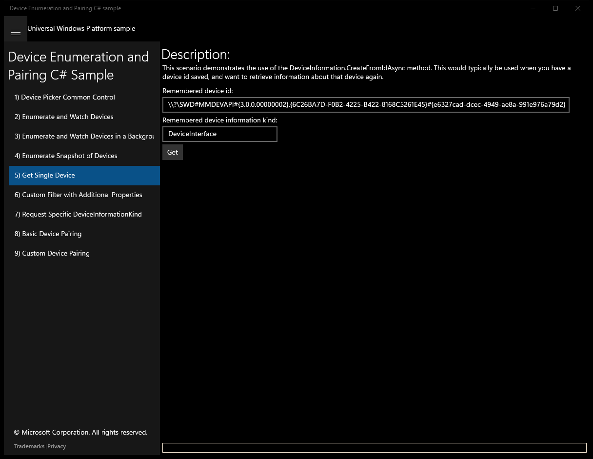

After click **Get**:

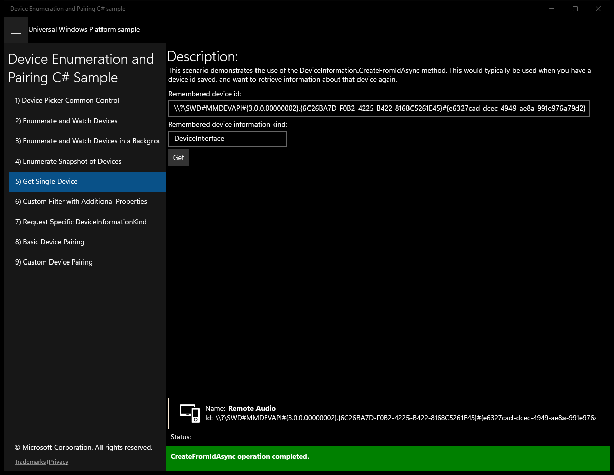

---

## Scenario 6 - Custom Filter with Additional Properties

### UI elements
- **TextBlock**  - text="Name:"
- **TextBlock**  - text="{x:Bind Name, Mode=OneWay}"
- **TextBlock**  - text="Id:"
- **TextBlock**  - text="{x:Bind Id, Mode=OneWay}"
- **TextBlock**  - text="System.Devices.InterfaceClassGuid:"
- **TextBlock**  - text="{x:Bind GetPropertyForDisplay("System.Devices.InterfaceClassGuid"), Mode=OneWay}"
- **TextBlock**  - text="System.ItemNameDisplay:"
- **TextBlock**  - text="{x:Bind GetPropertyForDisplay('System.ItemNameDisplay'), Mode=OneWay}"
- **TextBlock**  - text="Description:"
- **TextBlock**  - text="This scenario demonstrates using custom filters and/or requesting additional properties with the DeviceWatcher. A custom filter and/or requested additional properties can also be done with the DevicePicker, FindAllAsync, and DeviceWatcherTrigger."
- **TextBlock**  - text="Enter an Advanced Query Syntax (AQS) filter"
- **TextBox**  - x:Name="aqsFilterTextBox"; text="System.Devices.InterfaceClassGuid:="{e6327cad-dcec-4949-ae8a-991e976a79d2}" AND System.Devices.InterfaceEnabled:=System.StructuredQueryType.Boolean#True"
- **Button**  - x:Name="startWatcherButton"; text="Start Watcher"; events: Click=StartWatcherButton_Click
- **Button**  - x:Name="stopWatcherButton"; text="Stop Watcher"; events: Click=StopWatcherButton_Click
- **ListView**  - x:Name="resultsListView"

### Code behavior
- **`StartWatcher`**
    - API refs: `DeviceInformation.Properties`, `System.Devices`, `System.ItemNameDisplay`, `DeviceInformation.CreateWatcher`, `NotifyType.StatusMessage`, `FocusState.Keyboard`
    - updates UI: `aqsFilterTextBox.IsEnabled`
- **`StopWatcher`**
    - API refs: `FocusState.Keyboard`
    - updates UI: `aqsFilterTextBox.IsEnabled`

### Screenshots
Initial state:

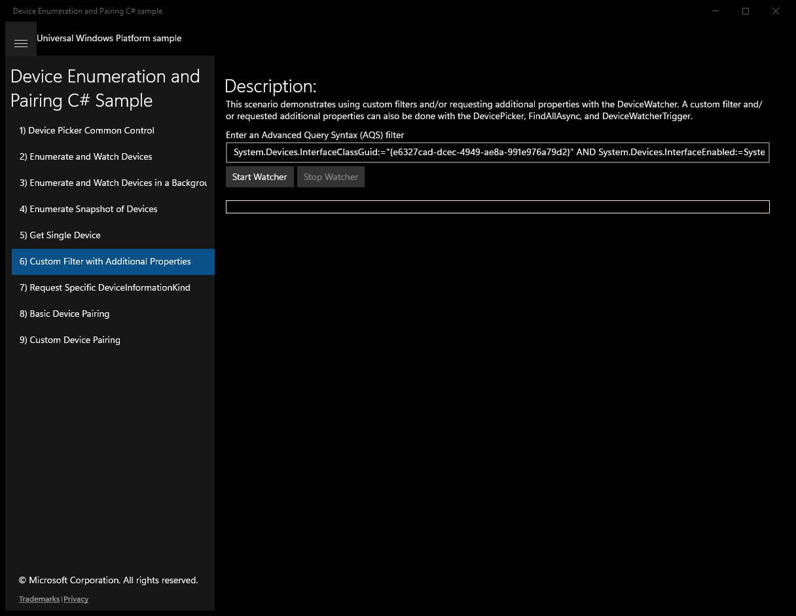

After click **Start Watcher**:

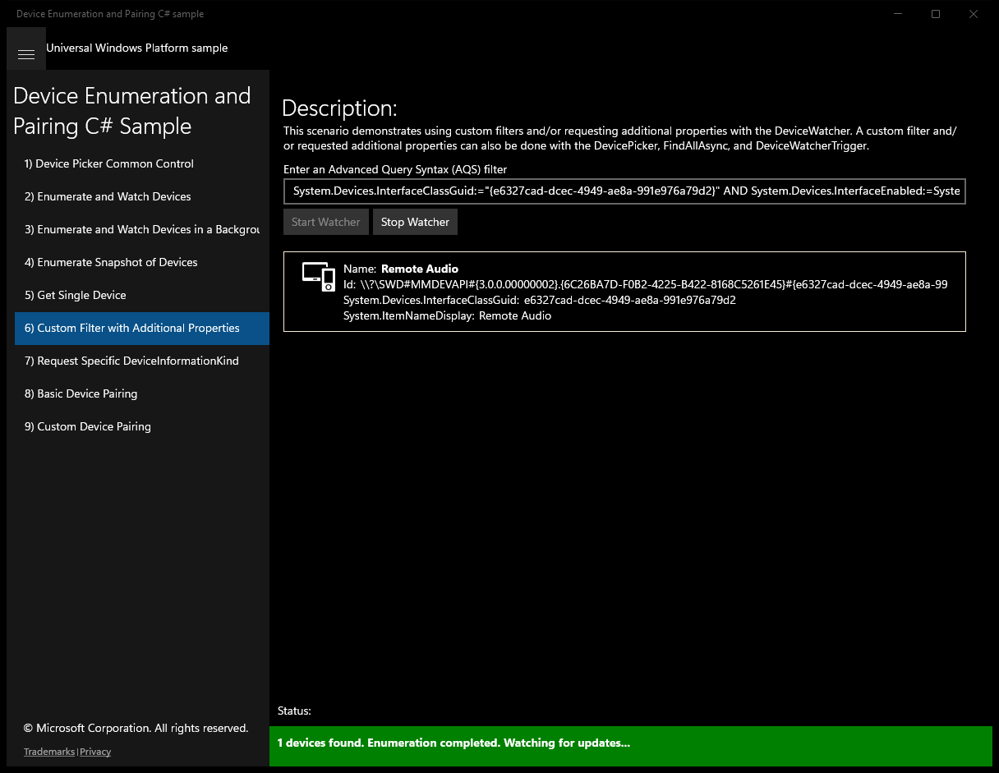

---

## Scenario 7 - Request Specific DeviceInformationKind

**Description**: This scenario demonstrates requesting various DeviceInformationKinds.

### UI elements
- **TextBlock**  - text="{x:Bind DisplayName}"
- **TextBlock**  - text="Kind:"
- **TextBlock**  - text="{x:Bind Kind, Mode=OneWay}"
- **TextBlock**  - text="Name:"
- **TextBlock**  - text="{x:Bind Name, Mode=OneWay}"
- **TextBlock**  - text="Id:"
- **TextBlock**  - text="{x:Bind Id, Mode=OneWay}"
- **TextBlock**  - text="Description:"
- **TextBlock**  - text="This scenario demonstrates requesting various DeviceInformationKinds. Methods without the DeviceInformationKind parameter default to DeviceInterface"
- **ComboBox**  - x:Name="kindComboBox"
- **Button**  - x:Name="startWatcherButton"; content="Start Watcher"; events: Click=StartWatcherButton_Click
- **Button**  - x:Name="stopWatcherButton"; content="Stop Watcher"; events: Click=StopWatcherButton_Click
- **ListView**  - x:Name="resultsListView"

### Code behavior
- **`OnNavigatedTo`**
    - API refs: `DeviceInformationKindChoices.Choices`
- **`StartWatchers`**
    - instantiates: `DeviceWatcherHelper`
    - API refs: `DeviceInformation.CreateWatcher`, `FocusState.Keyboard`
- **`StopWatchers`**
    - API refs: `FocusState.Keyboard`
- **`OnDeviceListChanged`**
    - API refs: `NotifyType.StatusMessage`

### Screenshots
Initial state:

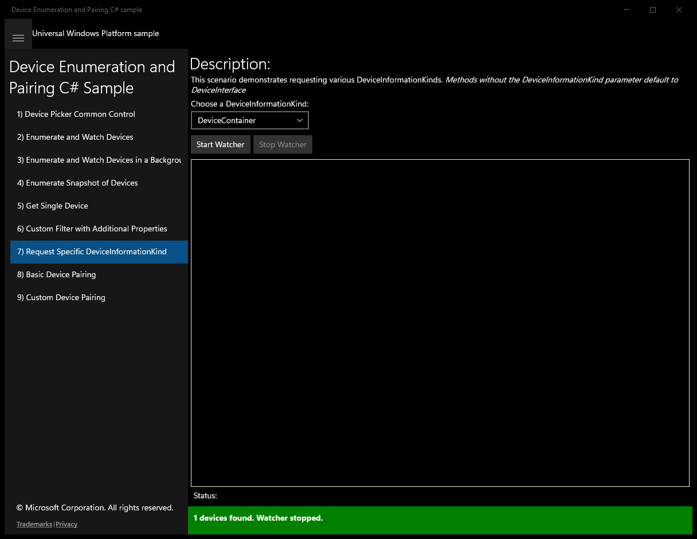

After click **Start Watcher**:

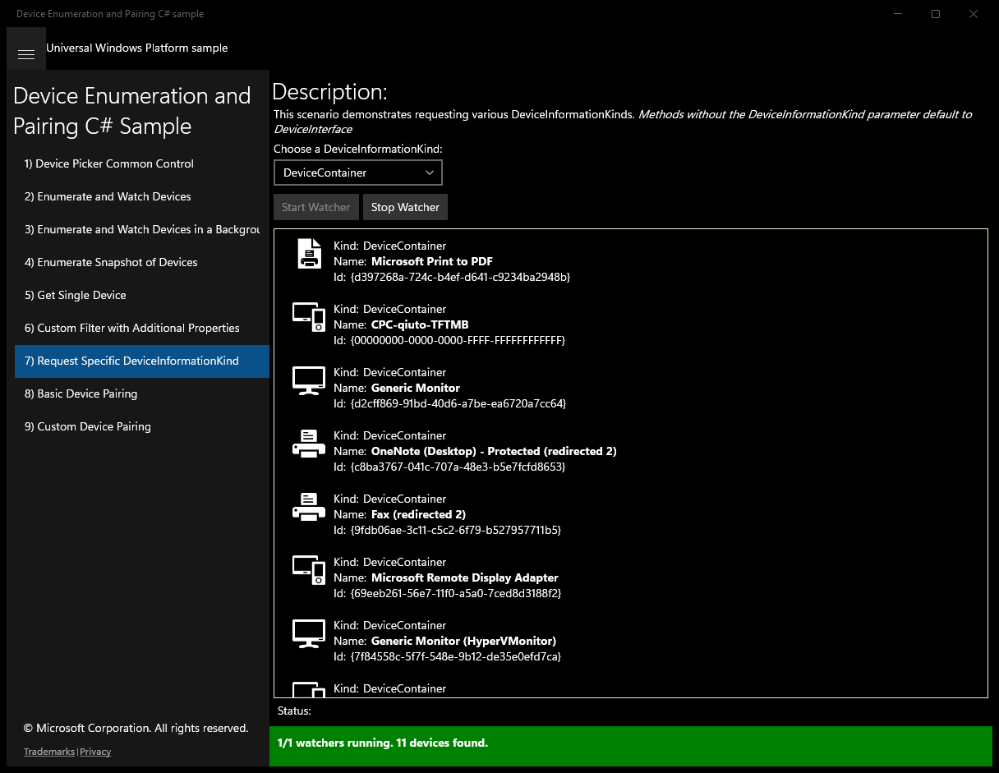

---

## Scenario 8 - Basic Device Pairing

**Description**: This scenario demonstrates how to perform basic pairing. Basic pairing allows you to tell Windows which device you want paired, and then Windows will handle the ceremony and the UI. If you want to display your own UI and be involved in the pairing ceremony, please see the Custom Pairing scenario.

### UI elements
- **TextBlock**  - text="{Binding Path=DisplayName}"
- **TextBlock**  - text="Name:"
- **TextBlock**  - text="{x:Bind Name, Mode=OneWay}"
- **TextBlock**  - text="Id:"
- **TextBlock**  - text="{x:Bind Id, Mode=OneWay}"
- **TextBlock**  - text="CanPair:"
- **TextBlock**  - text="{x:Bind CanPair, Mode=OneWay}"
- **TextBlock**  - text="IsPaired:"
- **TextBlock**  - text="{x:Bind IsPaired, Mode=OneWay}"
- **TextBlock**  - text="Description:"
- **TextBlock**  - text="Choose a device selector:"
- **ComboBox**  - x:Name="selectorComboBox"
- **Button**  - x:Name="startWatcherButton"; text="Start Watcher"; events: Click=StartWatcherButton_Click
- **Button**  - x:Name="stopWatcherButton"; text="Stop Watcher"; events: Click=StopWatcherButton_Click
- **Button**  - x:Name="pairButton"; text="Pair Selected Device"; events: Click=PairButton_Click
- **Button**  - x:Name="unpairButton"; text="Unpair Selected Device"; events: Click=UnpairButton_Click
- **ListView**  - x:Name="resultsListView"; events: SelectionChanged=ResultsListView_SelectionChanged

### Code behavior
- **`OnNavigatedTo`**
    - API refs: `DeviceSelectorChoices.PairingSelectors`
- **`StartWatcher`**
    - API refs: `System.Devices`, `Aep.CanPair`, `System.StructuredQueryType`, `Aep.IsPaired`, `DeviceInformationKind.Unknown`, `DeviceInformation.CreateWatcher`, `NotifyType.StatusMessage`
- **`PairButton_Click`**
    - API refs: `NotifyType.StatusMessage`, `DeviceInformation.Pairing`, `Status.ToString`, `DevicePairingResultStatus.Paired`, `NotifyType.ErrorMessage`
- **`UnpairButton_Click`**
    - API refs: `NotifyType.StatusMessage`, `DeviceInformation.Pairing`, `Status.ToString`, `DeviceUnpairingResultStatus.Unpaired`, `NotifyType.ErrorMessage`
- **`UpdatePairingButtons`**
    - API refs: `DeviceInformation.Pairing`

### Screenshots
Initial state:

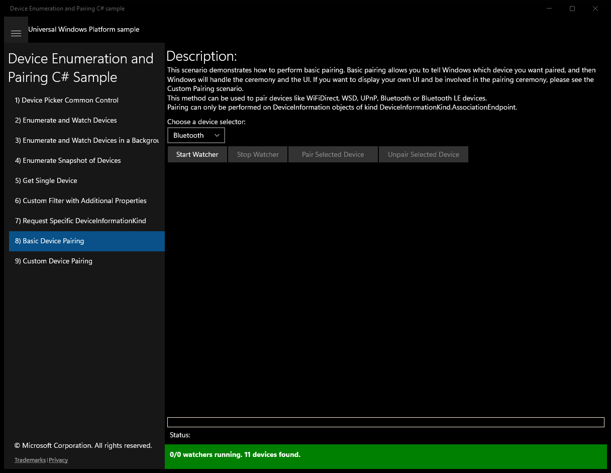

After click **Start Watcher**:

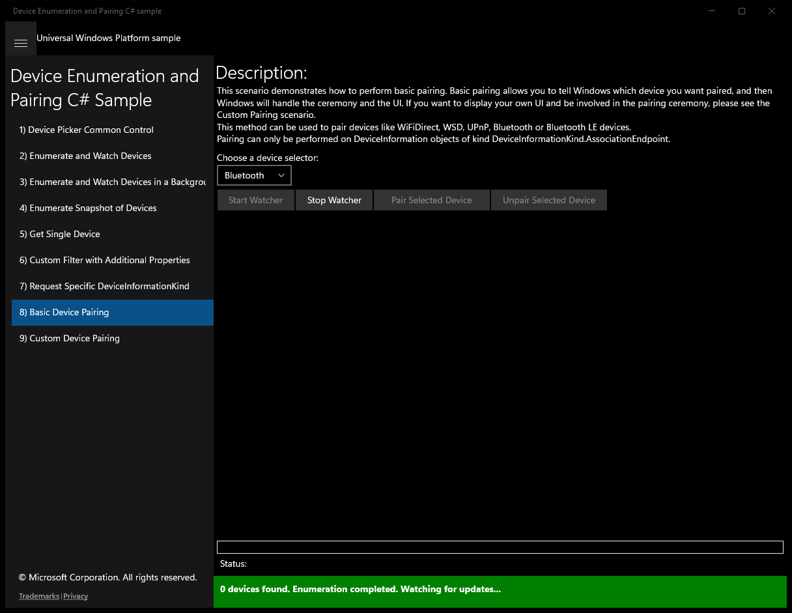

---

## Scenario 9 - Custom Device Pairing

**Description**: Custom pairing allows your app to be involved in the pairing ceremony and use your own UI. If you want Windows to control the ceremony and display system UI, please look at the basic pairing scenario.

### UI elements
- **TextBlock**  - text="{x:Bind DisplayName}"
- **TextBlock**  - text="{x:Bind DisplayName}"
- **TextBlock**  - text="Name:"
- **TextBlock**  - text="{x:Bind Name, Mode=OneWay}"
- **TextBlock**  - text="Id:"
- **TextBlock**  - text="{x:Bind Id, Mode=OneWay}"
- **TextBlock**  - text="CanPair:"
- **TextBlock**  - text="{x:Bind CanPair, Mode=OneWay}"
- **TextBlock**  - text="IsPaired:"
- **TextBlock**  - text="{x:Bind IsPaired, Mode=OneWay}"
- **TextBlock**  - text="Description:"
- **ComboBox**  - x:Name="selectorComboBox"
- **TextBlock**  - text="Select supported pairing ceremonies:"
- **CheckBox**  - x:Name="confirmOnlyOption"; content="ConfirmOnly"
- **CheckBox**  - x:Name="displayPinOption"; content="DisplayPin"
- **CheckBox**  - x:Name="providePinOption"; content="ProvidePin"
- **CheckBox**  - x:Name="confirmPinMatchOption"; content="ConfirmPinMatch"
- **CheckBox**  - x:Name="passwordCredentialOption"; content="Credential"
- **ComboBox**  - x:Name="protectionLevelComboBox"
- **Button**  - x:Name="startWatcherButton"; content="Start Watcher"; events: Click=StartWatcherButton_Click
- **Button**  - x:Name="stopWatcherButton"; content="Stop Watcher"; events: Click=StopWatcherButton_Click
- **Button**  - x:Name="pairButton"; content="Pair Selected Device"; events: Click=PairButton_Click
- **Button**  - x:Name="unpairButton"; content="Unpair Selected Device"; events: Click=UnpairButton_Click
- **TextBlock**  - x:Name="pairingTextBlock"
- **TextBox**  - x:Name="pinEntryTextBox"
- **Button**  - x:Name="okButton"; text="OK"; events: Click=okButton_Click
- **TextBox**  - x:Name="usernameEntryTextBox"
- **TextBox**  - x:Name="passwordEntryTextBox"
- **Button**  - x:Name="verifyButton"; text="Verify"; events: Click=verifyButton_Click
- **Button**  - x:Name="yesButton"; text="Yes"; events: Click=yesButton_Click
- **Button**  - x:Name="noButton"; text="No"; events: Click=noButton_Click
- **ListView**  - x:Name="resultsListView"; events: SelectionChanged=ResultsListView_SelectionChanged

### Code behavior
- **`OnNavigatedTo`**
    - API refs: `DeviceSelectorChoices.PairingSelectors`, `ProtectionSelectorChoices.Selectors`
- **`StartWatcher`**
    - API refs: `System.Devices`, `Aep.CanPair`, `System.StructuredQueryType`, `Aep.IsPaired`, `DeviceInformationKind.Unknown`, `DeviceInformation.CreateWatcher`, `NotifyType.StatusMessage`
- **`PairButton_Click`**
    - API refs: `NotifyType.StatusMessage`, `DeviceInformation.Pairing`, `Status.ToString`, `DevicePairingResultStatus.Paired`, `NotifyType.ErrorMessage`
- **`UnpairButton_Click`**
    - API refs: `NotifyType.StatusMessage`, `DeviceInformation.Pairing`, `Status.ToString`, `DeviceUnpairingResultStatus.Unpaired`, `NotifyType.ErrorMessage`
- **`PairingRequestedHandler`**
    - API refs: `DevicePairingKinds.ConfirmOnly`, `DevicePairingKinds.DisplayPin`, `Dispatcher.RunAsync`, `CoreDispatcherPriority.Normal`, `DevicePairingKinds.ProvidePin`, `DevicePairingKinds.ProvidePasswordCredential`, `DevicePairingKinds.ConfirmPinMatch`
- **`ShowPairingPanel`**
    - API refs: `Visibility.Collapsed`, `DevicePairingKinds.ConfirmOnly`, `DevicePairingKinds.DisplayPin`, `DevicePairingKinds.ProvidePin`, `Visibility.Visible`, `DevicePairingKinds.ConfirmPinMatch`, `DevicePairingKinds.ProvidePasswordCredential`
    - updates UI: `pinEntryTextBox.Visibility`, `usernameEntryTextBox.Visibility`, `passwordEntryTextBox.Visibility`, `pairingTextBlock.Text`, `pinEntryTextBox.Text`, `usernameEntryTextBox.Text`, `passwordEntryTextBox.Text`
- **`HidePairingPanel`**
    - API refs: `Visibility.Collapsed`
    - updates UI: `pairingTextBlock.Text`
- **`GetPinFromUserAsync`**
    - instantiates: `TaskCompletionSource`
    - API refs: `DevicePairingKinds.ProvidePin`
- **`GetPasswordCredentialFromUserAsync`**
    - instantiates: `TaskCompletionSource`
    - API refs: `DevicePairingKinds.ProvidePasswordCredential`
- **`CompletePasswordCredential`**
    - instantiates: `PasswordCredential`
    - API refs: `String.IsNullOrEmpty`
- **`GetUserConfirmationAsync`**
    - instantiates: `TaskCompletionSource`
    - API refs: `DevicePairingKinds.ConfirmPinMatch`
- **`GetSelectedCeremonies`**
    - API refs: `DevicePairingKinds.None`, `IsChecked.Value`, `DevicePairingKinds.ConfirmOnly`, `DevicePairingKinds.DisplayPin`, `DevicePairingKinds.ProvidePin`, `DevicePairingKinds.ConfirmPinMatch`, `DevicePairingKinds.ProvidePasswordCredential`
- **`UpdatePairingButtons`**
    - API refs: `DeviceInformation.Pairing`

### Screenshots
Initial state:

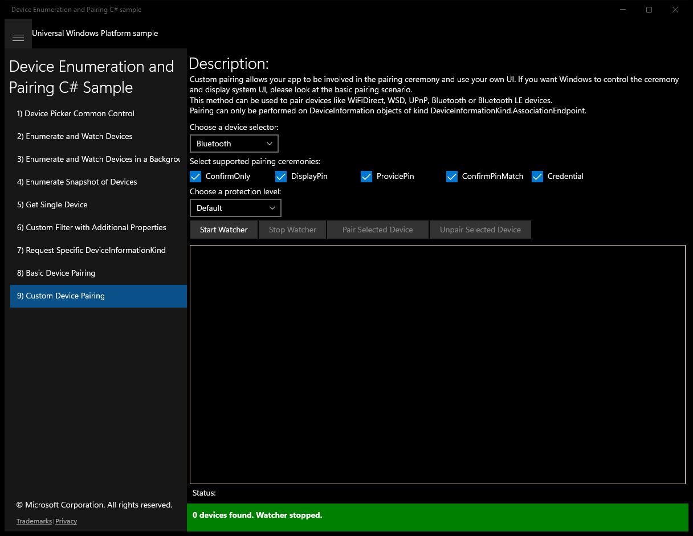

After click **Start Watcher**:

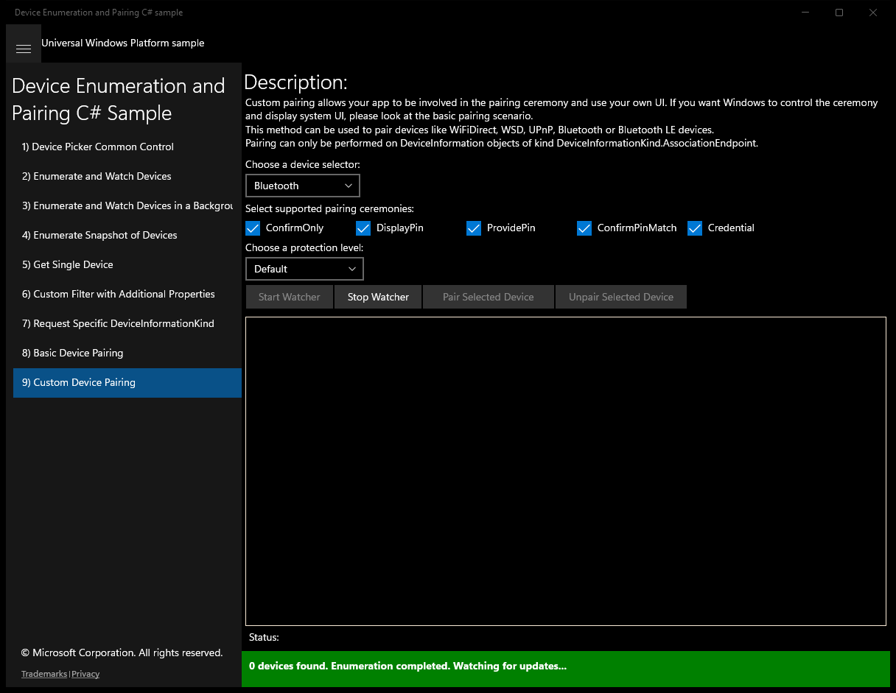

