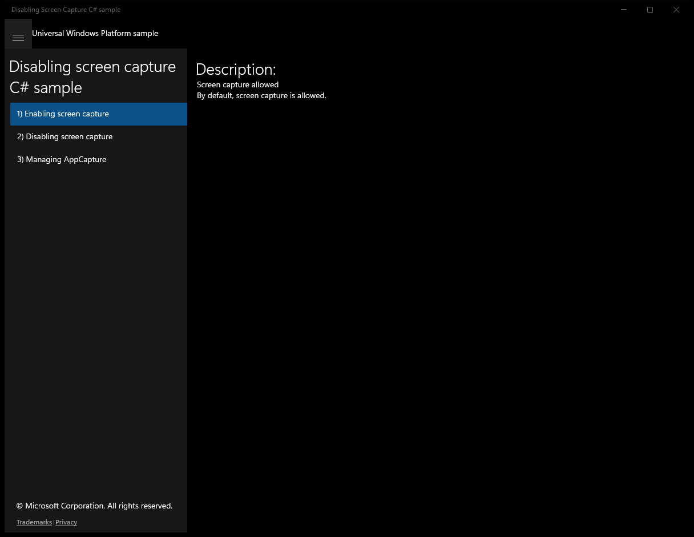
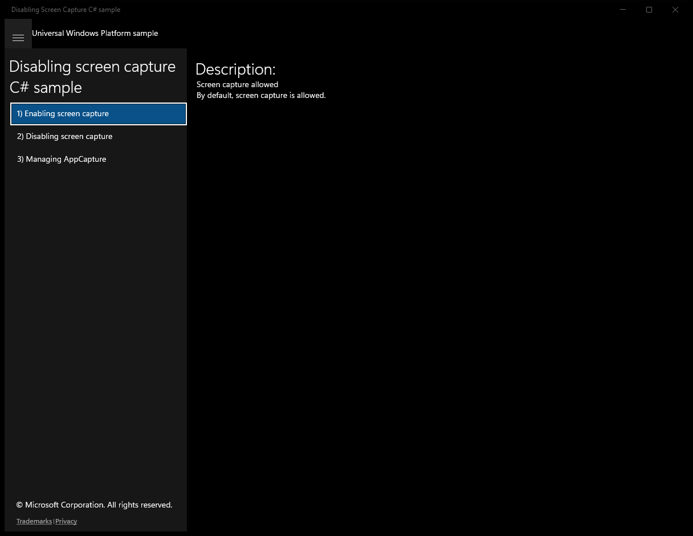
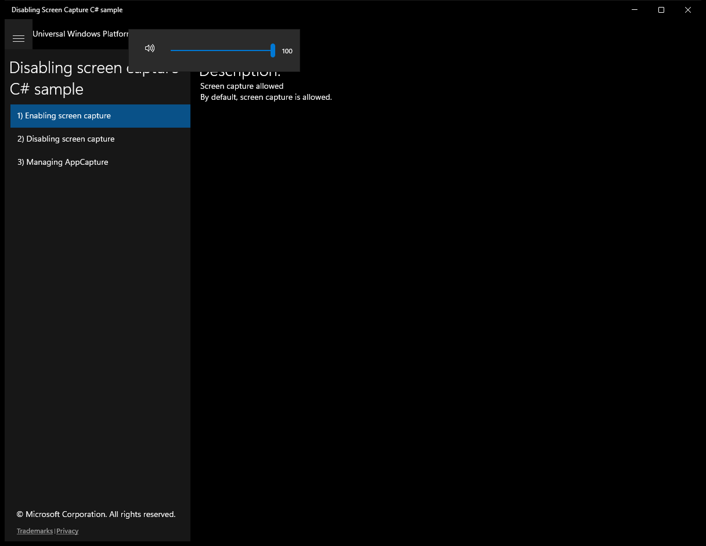
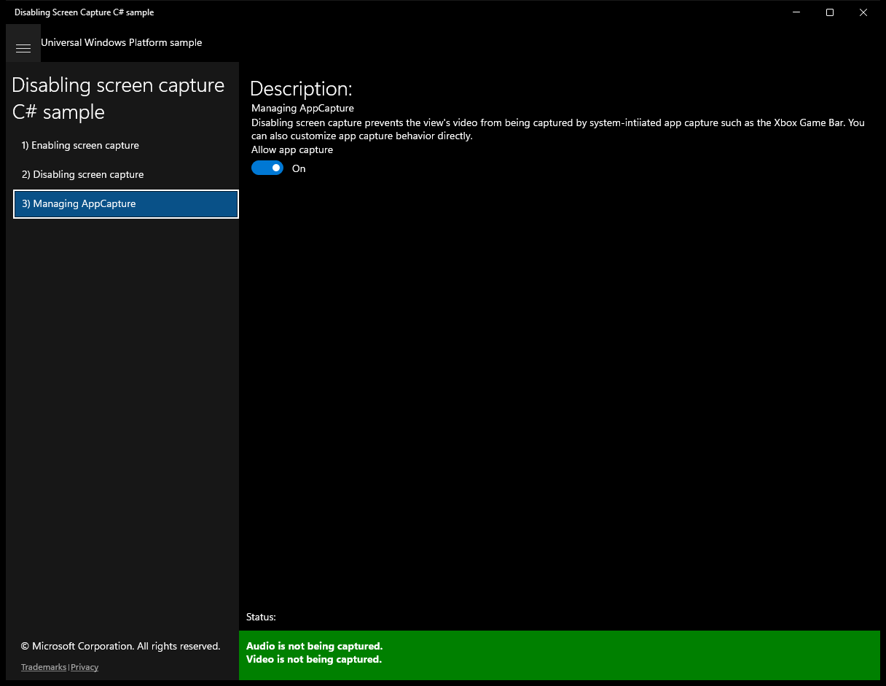
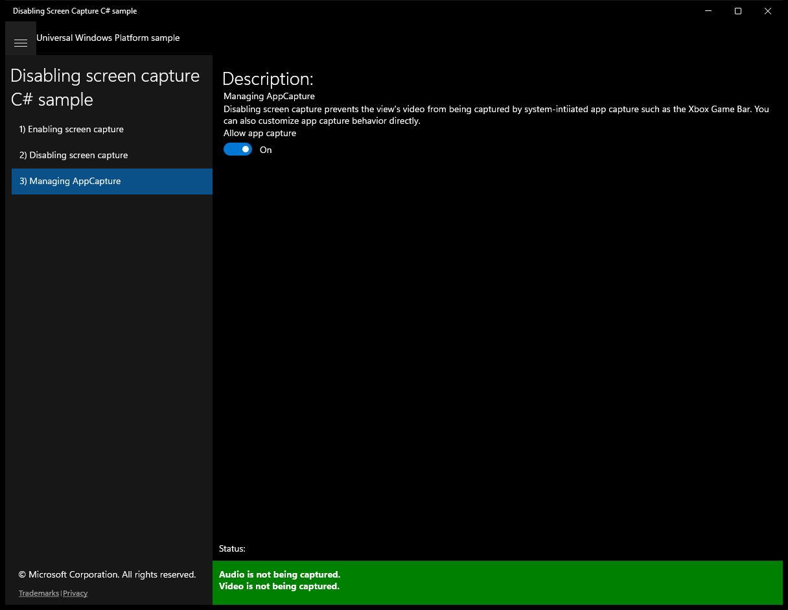

# DisablingScreenCapture (C#)

> **Source**: `Samples\DisablingScreenCapture\cs\`  
> **Feature**: Disabling screen capture C# sample  
> **AUMID**: `Microsoft.SDKSamples.DisablingScreenCapture.CS_8wekyb3d8bbwe!DisablingScreenCapture.App`  
> **PackageFamilyName**: `Microsoft.SDKSamples.DisablingScreenCapture.CS_8wekyb3d8bbwe`  

## Top-level UWP namespaces used
- `Windows.UI.ViewManagement.ApplicationView.GetForCurrentView`

## Build / deploy / capture status
- build: ok
- deploy: ok
- launch: ok
- capture: ok
- uninstall: ok

## Main page

---

## Scenario 1 - Enabling screen capture

**Description**: Screen capture allowed

### UI elements
- **TextBlock**  - text="Description:"
- **TextBlock**  - text="Screen capture allowed"
- **TextBlock**  - text="By default, screen capture is allowed."

### Screenshots
Initial state:

After click **Volume**:

After click **Play**:

After click **Aspect Ratio**:

---

## Scenario 2 - Disabling screen capture

**Description**: Screen capture disabled

### UI elements
- **TextBlock**  - text="Description:"
- **TextBlock**  - text="Screen capture disabled"
- **TextBlock**  - text="This view will be excluded from screen captures."

### Code behavior
- **`OnNavigatedTo`**
    - namespaces: `Windows.UI.ViewManagement.ApplicationView.GetForCurrentView`
    - API refs: `Windows.UI`, `ViewManagement.ApplicationView`
- **`OnNavigatedFrom`**
    - namespaces: `Windows.UI.ViewManagement.ApplicationView.GetForCurrentView`
    - API refs: `Windows.UI`, `ViewManagement.ApplicationView`

### Screenshots
Initial state:

After click **Volume**:

After click **Play**:

After click **Aspect Ratio**:

---

## Scenario 3 - Managing AppCapture

### UI elements
- **TextBlock**  - text="Description:"
- **TextBlock**  - text="Managing AppCapture"
- **TextBlock**  - text="Disabling screen capture prevents the view's video from being captured by system-intiiated app capture such as the Xbox Game Bar. You can also customize app capture behavior directly."
- **TextBlock**  - text="Allow app capture"
- **ToggleSwitch**  - x:Name="AllowAppCaptureCheckBox"; events: Toggled=AllowAppCaptureCheckBox_Toggled

### Code behavior
- **`OnNavigatedTo`**
    - API refs: `AppCapture.GetForCurrentView`
- **`OnNavigatedFrom`**
    - API refs: `AppCapture.SetAllowedAsync`
- **`AllowAppCaptureCheckBox_Toggled`**
    - API refs: `AppCapture.SetAllowedAsync`
- **`UpdateCaptureStatus`**
    - API refs: `NotifyType.StatusMessage`

### Screenshots
Initial state:

After click **Volume**:

After click **Play**:

After click **Aspect Ratio**:

