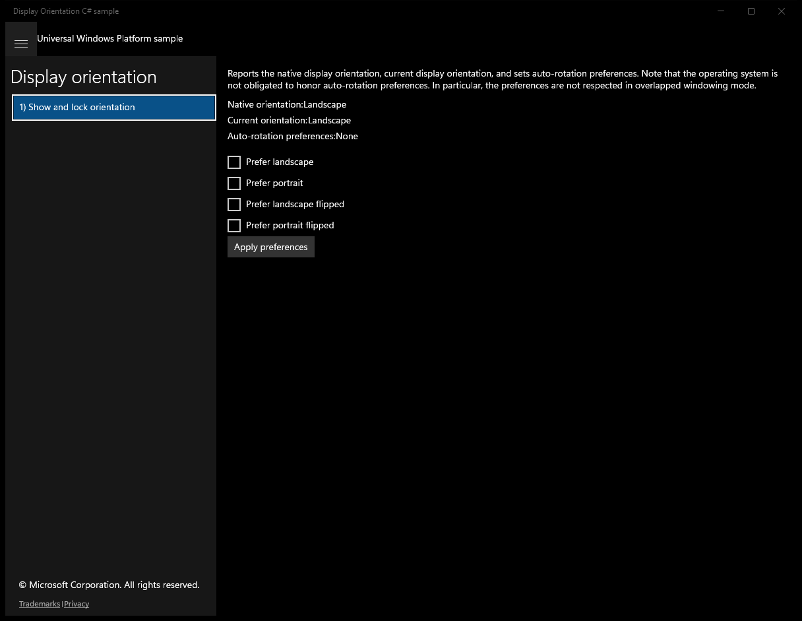
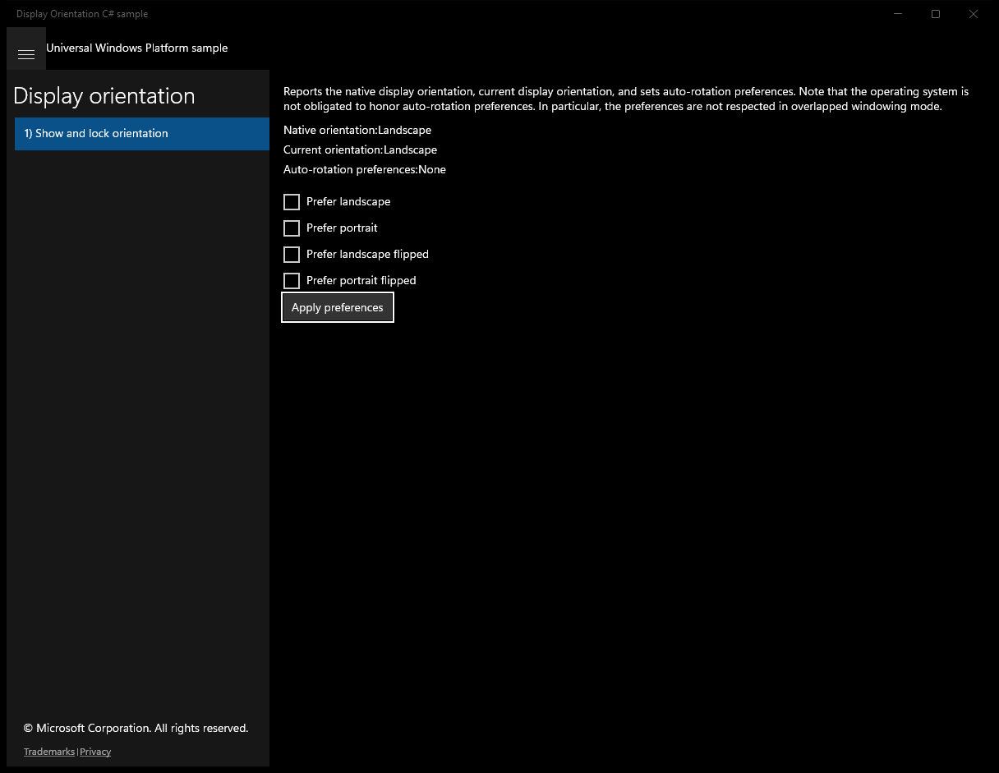

# DisplayOrientation (C#)

> **Source**: `Samples\DisplayOrientation\cs\`  
> **Feature**: Display orientation  
> **AUMID**: `Microsoft.SDKSamples.DisplayOrientation.CS_8wekyb3d8bbwe!DisplayOrientation.App`  
> **PackageFamilyName**: `Microsoft.SDKSamples.DisplayOrientation.CS_8wekyb3d8bbwe`  

## Build / deploy / capture status
- build: ok
- deploy: ok
- launch: ok
- capture: ok
- uninstall: ok

## Main page

---

## Scenario 1 - 1) Show and lock orientation

### Screenshots
Initial state:

After click **Apply preferences**:

