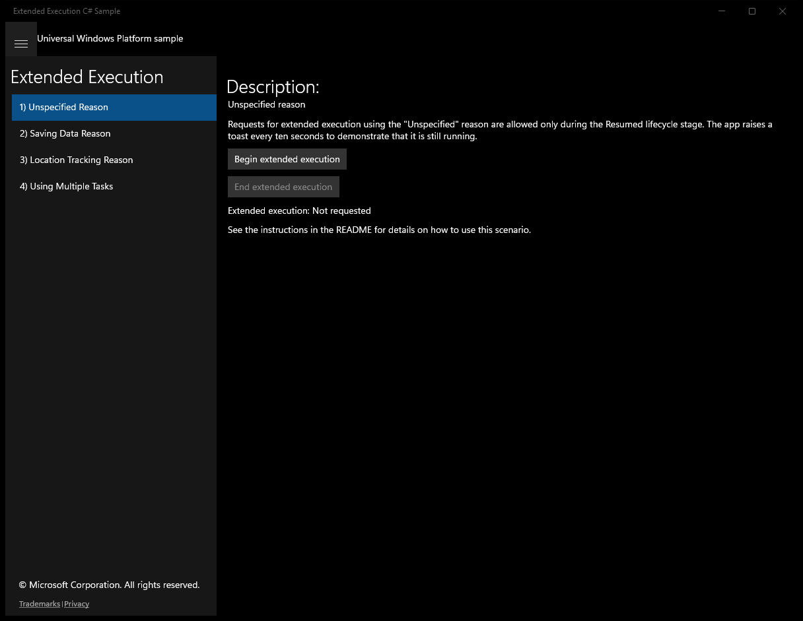
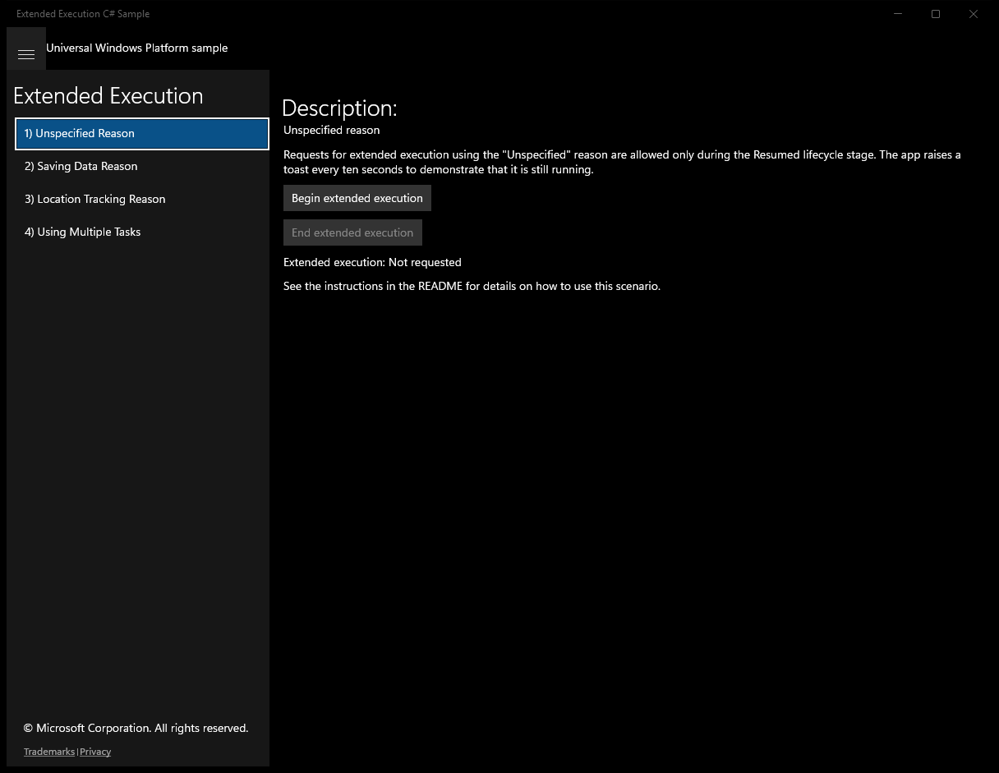
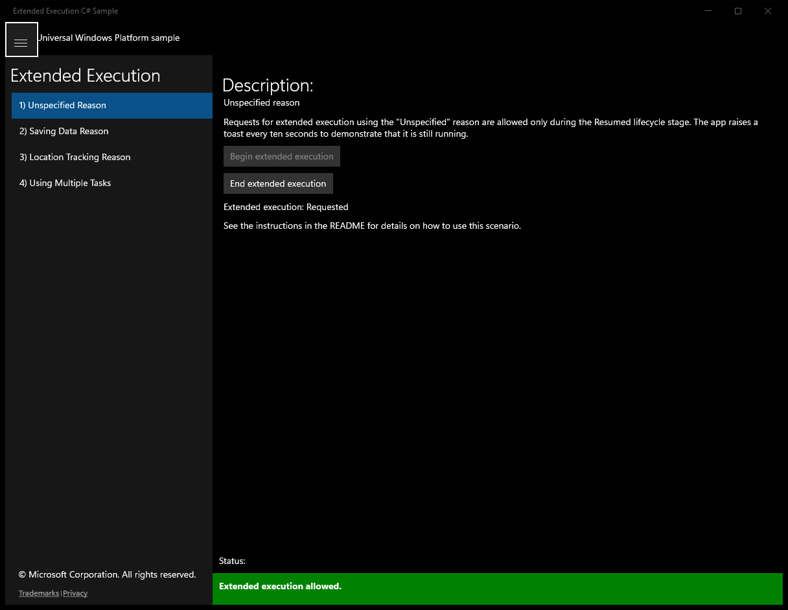
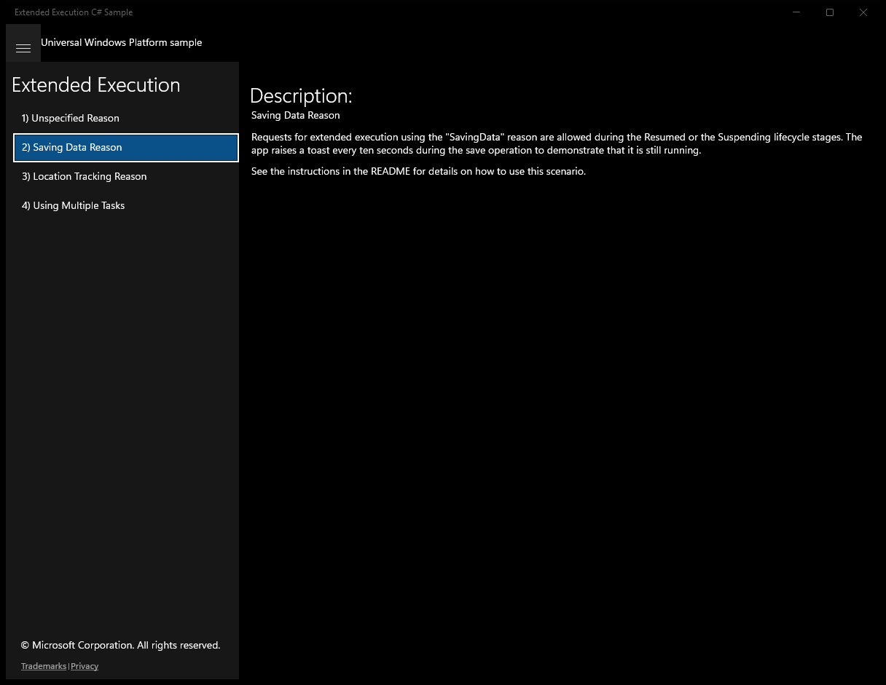
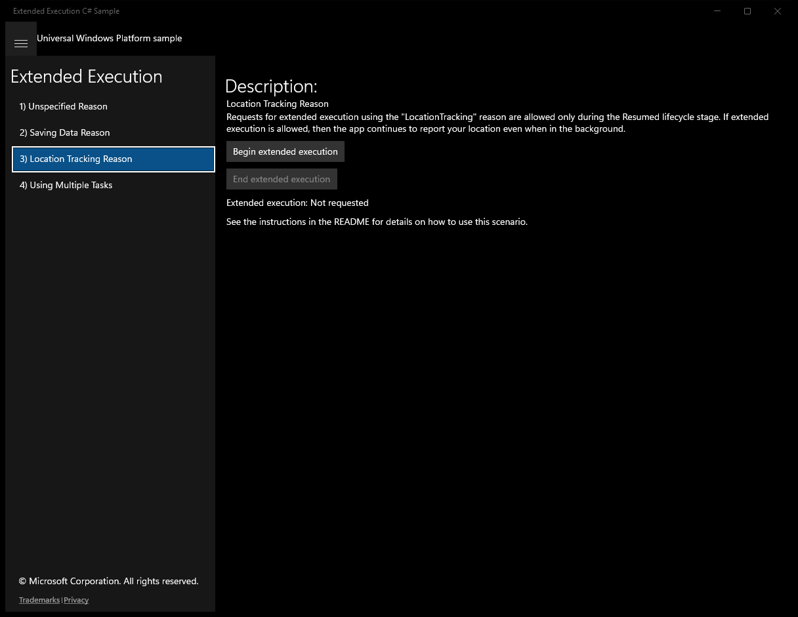
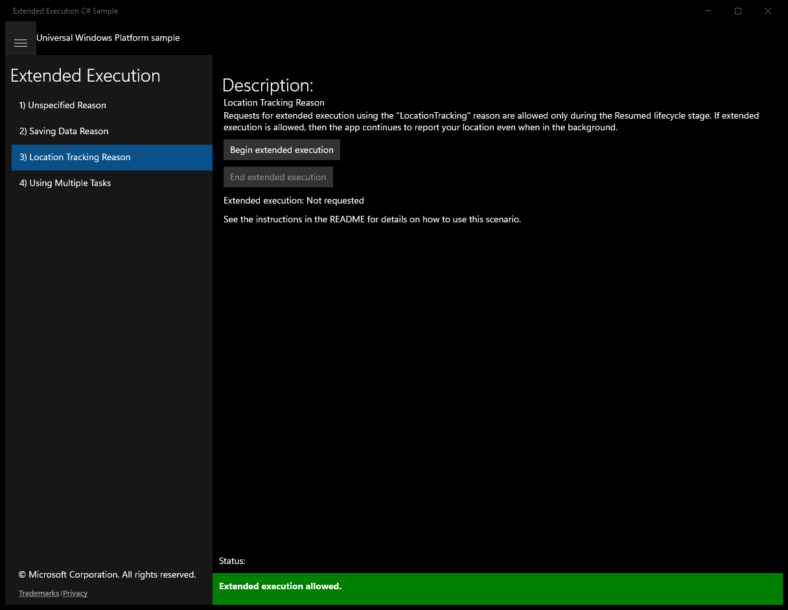
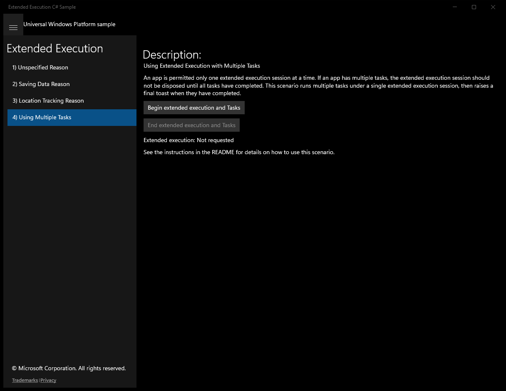
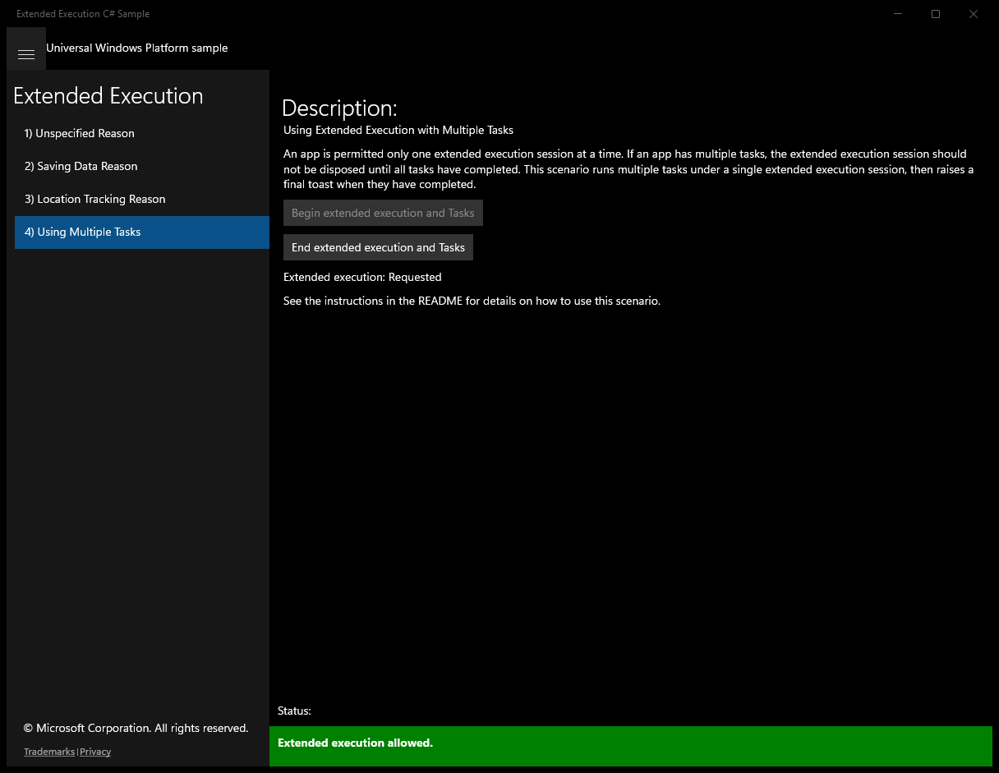

# ExtendedExecution (C#)

> **Source**: `Samples\ExtendedExecution\cs\`  
> **Feature**: Extended Execution  
> **AUMID**: `Microsoft.SDKSamples.ExtendedExecution.CS_8wekyb3d8bbwe!App`  
> **PackageFamilyName**: `Microsoft.SDKSamples.ExtendedExecution.CS_8wekyb3d8bbwe`  

## Build / deploy / capture status
- build: ok
- deploy: ok
- launch: ok
- capture: ok
- uninstall: ok

## Main page

---

## Scenario 1 - Scenario1_UnspecifiedReason

### UI elements
- **TextBlock**  - text="Description:"
- **TextBlock**  - text="Unspecified reason"
- **TextBlock**  - text="Requests for extended execution using the "Unspecified" reason are allowed only during the Resumed lifecycle stage. The app raises a toast every ten seconds to demonstrate that it is still running."
- **Button**  - x:Name="RequestButton"; content="Begin extended execution"; events: Click={x:Bind BeginExtendedExecution}
- **Button**  - x:Name="CloseButton"; content="End extended execution"; events: Click={x:Bind EndExtendedExecution}
- **TextBlock**  - text="Extended execution:"
- **TextBlock**  - text="See the instructions in the README for details on how to use this scenario."

### Code behavior
- **`UpdateUI`**
    - API refs: `Status.Text`, `RequestButton.IsEnabled`, `CloseButton.IsEnabled`
- **`BeginExtendedExecution`**
    - instantiates: `ExtendedExecutionSession`, `Timer`
    - API refs: `ExtendedExecutionReason.Unspecified`, `ExtendedExecutionResult.Allowed`, `NotifyType.StatusMessage`, `DateTime.Now`, `TimeSpan.FromSeconds`, `ExtendedExecutionResult.Denied`, `NotifyType.ErrorMessage`
- **`OnTimer`**
    - API refs: `Math.Round`, `DateTime.Now`, `MainPage.DisplayToast`
- **`SessionRevoked`**
    - API refs: `Dispatcher.RunAsync`, `CoreDispatcherPriority.Normal`, `ExtendedExecutionRevokedReason.Resumed`, `NotifyType.StatusMessage`, `ExtendedExecutionRevokedReason.SystemPolicy`

### Screenshots
Initial state:

After click **Begin extended execution**:

---

## Scenario 2 - Scenario2_SavingDataReason

### UI elements
- **TextBlock**  - text="Description:"
- **TextBlock**  - text="Saving Data Reason"
- **TextBlock**  - text="See the instructions in the README for details on how to use this scenario."

### Code behavior
- **`OnNavigatedTo`**
    - API refs: `App.Current`
- **`OnNavigatingFrom`**
    - API refs: `App.Current`
- **`OnSuspending`**
    - instantiates: `ExtendedExecutionSession`, `CancellationTokenSource`
    - API refs: `SuspendingOperation.GetDeferral`, `NotifyType.StatusMessage`, `ExtendedExecutionReason.SavingData`, `ExtendedExecutionResult.Allowed`, `MainPage.DisplayToast`, `Task.Delay`, `TimeSpan.FromSeconds`, `ExtendedExecutionResult.Denied`
- **`ExtendedExecutionSessionRevoked`**
    - API refs: `Dispatcher.RunAsync`, `CoreDispatcherPriority.Normal`, `ExtendedExecutionRevokedReason.Resumed`, `NotifyType.StatusMessage`, `ExtendedExecutionRevokedReason.SystemPolicy`, `MainPage.DisplayToast`

### Screenshots
Initial state:

---

## Scenario 3 - Scenario3_LocationTrackingReason

### UI elements
- **TextBlock**  - text="Description:"
- **TextBlock**  - text="Location Tracking Reason"
- **Button**  - x:Name="RequestButton"; content="Begin extended execution"; events: Click={x:Bind BeginExtendedExecution}
- **Button**  - x:Name="CloseButton"; content="End extended execution"; events: Click={x:Bind EndExtendedExecution}
- **TextBlock**  - text="Extended execution:"
- **TextBlock**  - text="See the instructions in the README for details on how to use this scenario."

### Code behavior
- **`UpdateUI`**
    - API refs: `Status.Text`, `RequestButton.IsEnabled`, `CloseButton.IsEnabled`
- **`StartLocationTrackingAsync`**
    - API refs: `Geolocator.RequestAccessAsync`, `GeolocationAccessStatus.Allowed`, `GeolocationAccessStatus.Denied`, `NotifyType.ErrorMessage`, `GeolocationAccessStatus.Unspecified`
- **`BeginExtendedExecution`**
    - instantiates: `ExtendedExecutionSession`, `Timer`
    - API refs: `ExtendedExecutionReason.LocationTracking`, `ExtendedExecutionResult.Allowed`, `NotifyType.StatusMessage`, `TimeSpan.FromSeconds`, `ExtendedExecutionResult.Denied`, `NotifyType.ErrorMessage`
- **`OnTimer`**
    - API refs: `Coordinate.Point`, `MainPage.DisplayToast`
- **`SessionRevoked`**
    - API refs: `Dispatcher.RunAsync`, `CoreDispatcherPriority.Normal`, `ExtendedExecutionRevokedReason.Resumed`, `NotifyType.StatusMessage`, `ExtendedExecutionRevokedReason.SystemPolicy`

### Screenshots
Initial state:

After click **Begin extended execution**:

---

## Scenario 4 - Scenario4_MultipleTasks

### UI elements
- **TextBlock**  - text="Description:"
- **TextBlock**  - text="Using Extended Execution with Multiple Tasks"
- **Button**  - x:Name="RequestButton"; content="Begin extended execution and Tasks"; events: Click={x:Bind BeginExtendedExecution}
- **Button**  - x:Name="CloseButton"; content="End extended execution and Tasks"; events: Click={x:Bind EndExtendedExecution}
- **TextBlock**  - text="Extended execution:"
- **TextBlock**  - text="See the instructions in the README for details on how to use this scenario."

### Code behavior
- **`UpdateUI`**
    - API refs: `Status.Text`, `RequestButton.IsEnabled`, `CloseButton.IsEnabled`
- **`OnTaskCompleted`**
    - API refs: `MainPage.DisplayToast`
- **`BeginExtendedExecution`**
    - instantiates: `ExtendedExecutionSession`, `CancellationTokenSource`, `Random`
    - API refs: `ExtendedExecutionReason.Unspecified`, `ExtendedExecutionResult.Allowed`, `NotifyType.StatusMessage`, `ExtendedExecutionResult.Denied`, `NotifyType.ErrorMessage`
- **`RaiseToastAfterDelay`**
    - API refs: `Task.Delay`, `MainPage.DisplayToast`
- **`SessionRevoked`**
    - API refs: `Dispatcher.RunAsync`, `CoreDispatcherPriority.Normal`, `ExtendedExecutionRevokedReason.Resumed`, `NotifyType.StatusMessage`, `ExtendedExecutionRevokedReason.SystemPolicy`

### Screenshots
Initial state:

After click **Begin extended execution and Tasks**:

