# FilePicker (C#)

> **Source**: `Samples\FilePicker\cs\`  
> **Feature**: File picker C# sample  
> **AUMID**: `Microsoft.SDKSamples.FilePicker.CS_8wekyb3d8bbwe!App`  
> **PackageFamilyName**: `Microsoft.SDKSamples.FilePicker.CS_8wekyb3d8bbwe`  

## Sample purpose
Uses file pickers to access files and folders and save files.

## Scenarios demonstrated (from README)
- **Let the user pick one file to access**
- **Let the user pick multiple files to access**
- **Let the user pick one folder to access**
- **Let the user save a file and specify the name, file type, and/or save location**
- **Let the user pick a locally cached file to access**
- **Let the user save a locally cached file**

## Build / deploy / capture status
- build: skipped
- deploy: ok
- launch: ok
- capture: ok
- uninstall: ok

## Main page
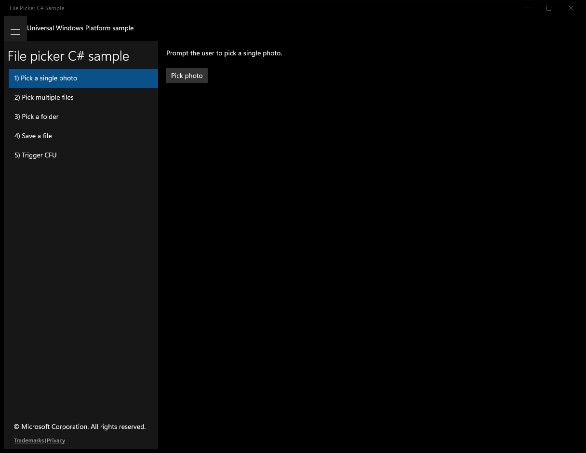

---

## Scenario 1 - Pick a single photo

### UI elements
- **TextBlock**  - text="Prompt the user to pick a single photo."
- **Button**  - x:Name="PickAFileButton"; content="Pick photo"; events: Click=PickAFileButton_Click
- **TextBlock**  - x:Name="OutputTextBlock"

### Code behavior
- **`PickAFileButton_Click`**
    - instantiates: `FileOpenPicker`
    - API refs: `OutputTextBlock.Text`, `PickerViewMode.Thumbnail`, `PickerLocationId.PicturesLibrary`, `FileTypeFilter.Add`
    - updates UI: `OutputTextBlock.Text`

### Screenshots
Initial state:

After click **Pick photo** (popup: Open):

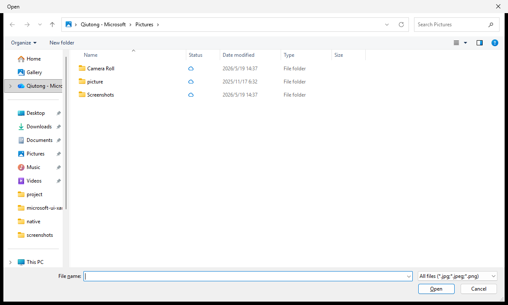

After click **Pick photo**:

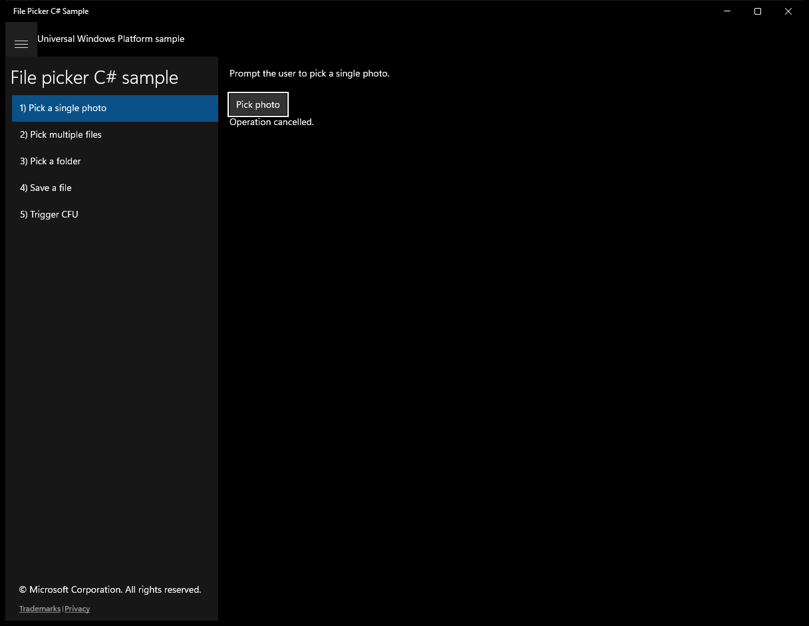

---

## Scenario 2 - Pick multiple files

### UI elements
- **TextBlock**  - text="Prompt the user to pick one or more files."
- **Button**  - x:Name="PickFilesButton"; content="Pick files"; events: Click=PickFilesButton_Click
- **TextBlock**  - x:Name="OutputTextBlock"

### Code behavior
- **`PickFilesButton_Click`**
    - instantiates: `FileOpenPicker`, `StringBuilder`
    - API refs: `OutputTextBlock.Text`, `PickerViewMode.List`, `PickerLocationId.DocumentsLibrary`, `FileTypeFilter.Add`
    - updates UI: `OutputTextBlock.Text`

### Screenshots
Initial state:

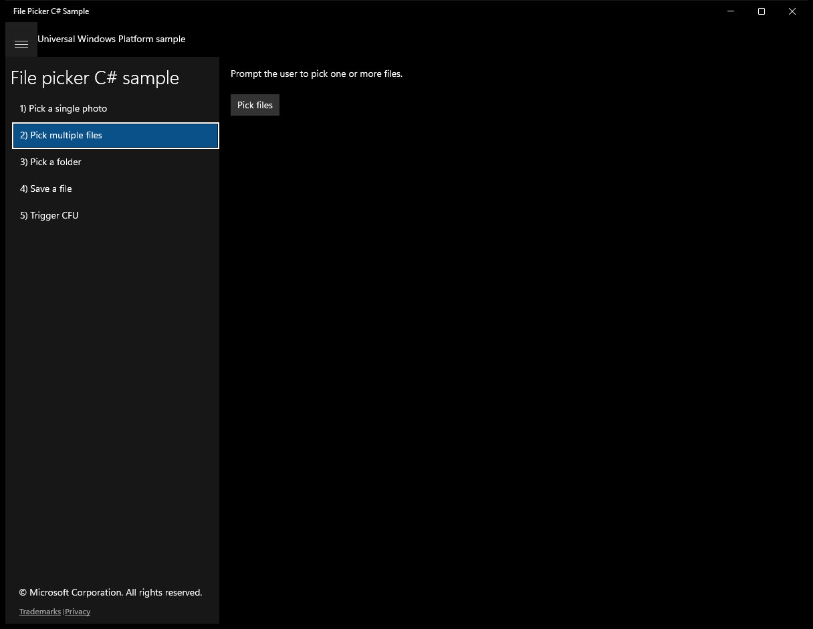

> Button **Pick files** skipped (blocklist)

---

## Scenario 3 - Pick a folder

### UI elements
- **TextBlock**  - text="Prompt the user to pick a folder so its contents can be accessed later."
- **Button**  - x:Name="PickFolderButton"; content="Pick folder"; events: Click=PickFolderButton_Click
- **TextBlock**  - x:Name="OutputTextBlock"

### Code behavior
- **`PickFolderButton_Click`**
    - instantiates: `FolderPicker`
    - API refs: `OutputTextBlock.Text`, `PickerLocationId.Desktop`, `FileTypeFilter.Add`, `StorageApplicationPermissions.FutureAccessList`
    - updates UI: `OutputTextBlock.Text`

### Screenshots
Initial state:

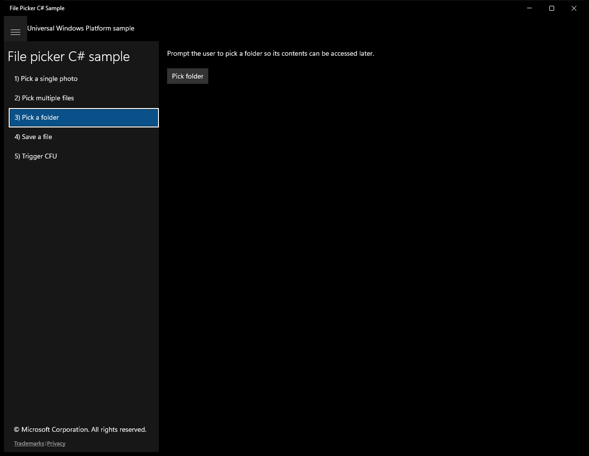

> Button **Pick folder** skipped (blocklist)

---

## Scenario 4 - Save a file

### UI elements
- **TextBlock**  - text="Prompt the user to save a file."
- **Button**  - x:Name="SaveFileButton"; content="Save file"; events: Click=SaveFileButton_Click
- **TextBlock**  - x:Name="OutputTextBlock"

### Code behavior
- **`SaveFileButton_Click`**
    - instantiates: `FileSavePicker`, `List`
    - API refs: `OutputTextBlock.Text`, `PickerLocationId.DocumentsLibrary`, `FileTypeChoices.Add`, `CachedFileManager.DeferUpdates`, `FileIO.WriteTextAsync`, `CachedFileManager.CompleteUpdatesAsync`, `FileUpdateStatus.Complete`, `FileUpdateStatus.CompleteAndRenamed`
    - updates UI: `OutputTextBlock.Text`

### Screenshots
Initial state:

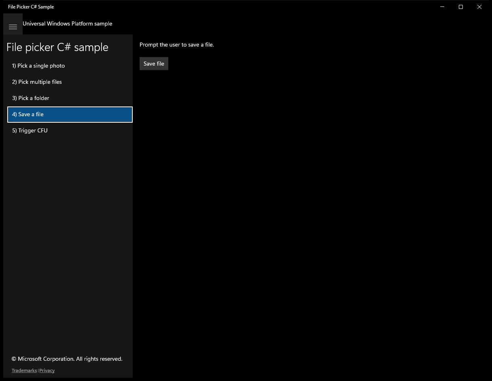

> Button **Save file** skipped (blocklist)

---

## Scenario 5 - Trigger CFU

**Description**: Writes to a file and optionally notifies the CachedFileManager.

### UI elements
- **TextBlock**  - text="Description:"
- **TextBlock**  - text="Writes to a file and optionally notifies the CachedFileManager."
- **Button**  - content="Create a file"; events: Click=CreateFileButton_Click
- **Button**  - x:Name="WriteToFileButton"; content="Write to file"; events: Click=WriteToFileButton_Click
- **Button**  - x:Name="WriteToFileWithCFUButton"; content="Write to file and notify CachedFileManager"; events: Click=WriteToFileWithExplicitCFUButton_Click
- **TextBlock**  - text="Description:"
- **TextBlock**  - text="Opens a file and saves it to the Future Access list, then gets it from the Future Access List."
- **Button**  - content="Open a file"; events: Click=PickAFileButton_Click
- **Button**  - x:Name="SaveToFutureAccessListButton"; content="Save file to Future Access List"; events: Click=SaveToFutureAccessListButton_Click
- **Button**  - x:Name="GetFileFromFutureAccessListButton"; content="Get file from Future Access List"; events: Click=GetFileFromFutureAccessListButton_Click

### Code behavior
- **`UpdateButtons`**
    - API refs: `WriteToFileButton.IsEnabled`, `WriteToFileWithCFUButton.IsEnabled`, `SaveToFutureAccessListButton.IsEnabled`, `GetFileFromFutureAccessListButton.IsEnabled`
- **`CreateFileButton_Click`**
    - instantiates: `FileSavePicker`
    - API refs: `NotifyType.StatusMessage`, `PickerLocationId.DocumentsLibrary`, `FileTypeChoices.Add`, `NotifyType.ErrorMessage`
- **`WriteToFileButton_Click`**
    - API refs: `FileIO.WriteTextAsync`, `WriteActivationMode.AfterWrite`, `NotifyType.StatusMessage`
- **`WriteToFileWithExplicitCFUButton_Click`**
    - API refs: `CachedFileManager.DeferUpdates`, `FileIO.WriteTextAsync`, `NotifyType.StatusMessage`, `CachedFileManager.CompleteUpdatesAsync`, `FileUpdateStatus.Complete`, `FileUpdateStatus.CompleteAndRenamed`, `NotifyType.ErrorMessage`
- **`PickAFileButton_Click`**
    - instantiates: `FileOpenPicker`
    - API refs: `NotifyType.StatusMessage`, `PickerViewMode.Thumbnail`, `FileTypeFilter.Add`, `NotifyType.ErrorMessage`
- **`SaveToFutureAccessListButton_Click`**
    - API refs: `StorageApplicationPermissions.FutureAccessList`, `NotifyType.StatusMessage`
- **`GetFileFromFutureAccessListButton_Click`**
    - API refs: `ReadActivationMode.BeforeAccess`, `NotifyType.StatusMessage`, `StorageApplicationPermissions.FutureAccessList`, `NotifyType.ErrorMessage`

### Screenshots
Initial state:

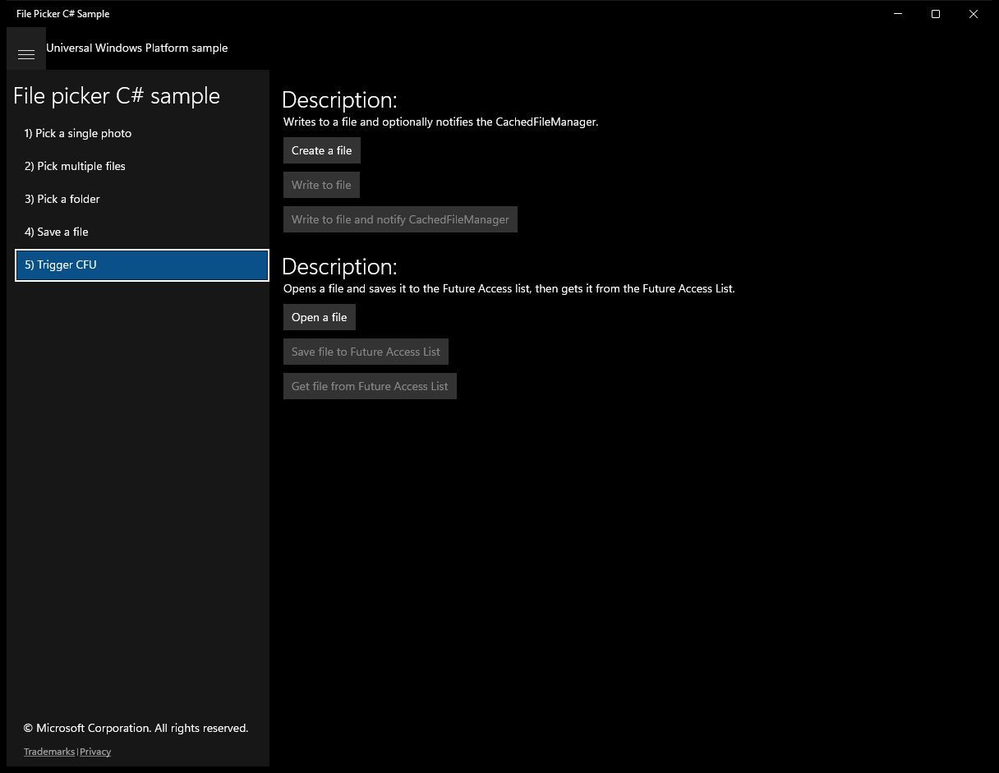

After click **Create a file** (popup: Save As):

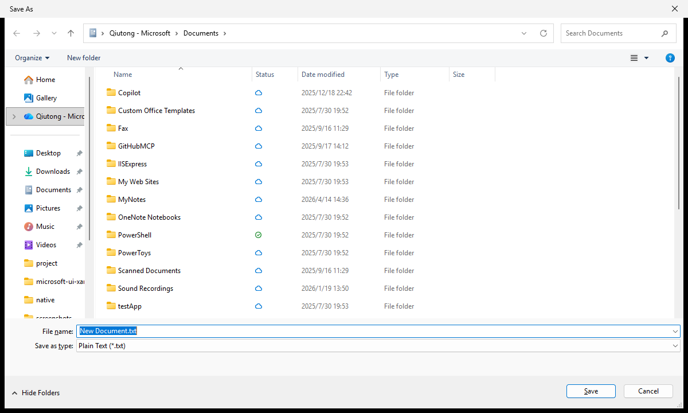

After click **Create a file**:

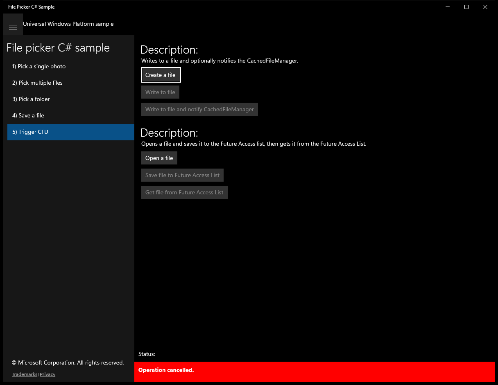

After click **Open a file** (popup: Open):

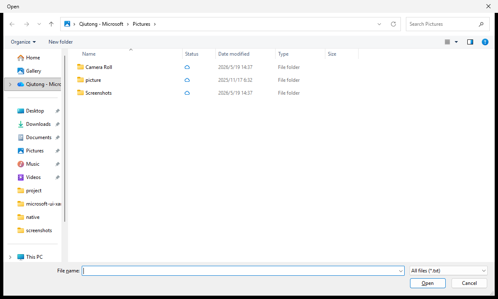

After click **Open a file**:

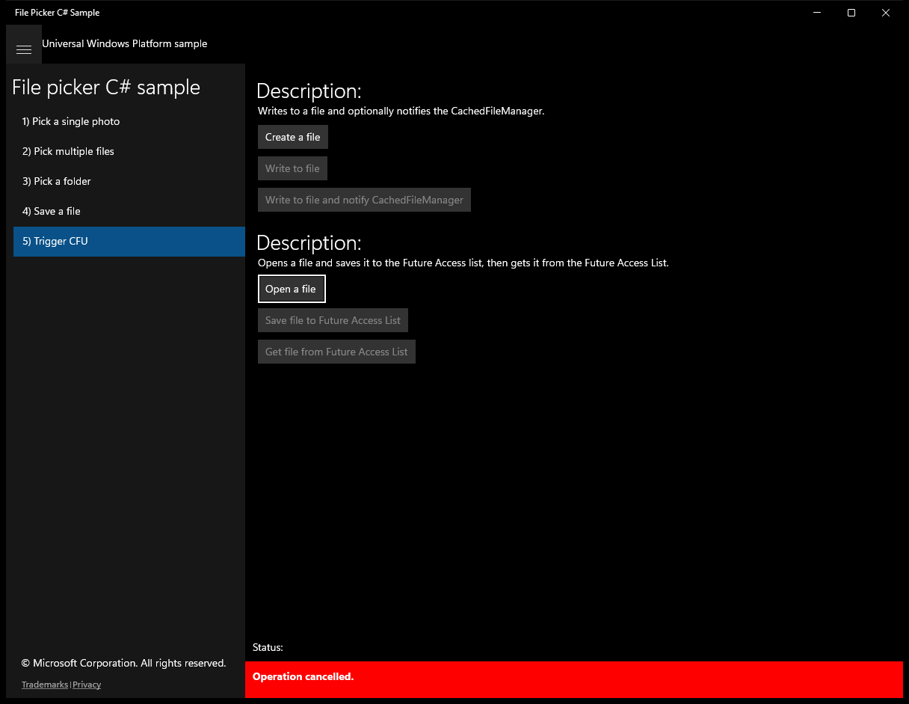

