#  (C#)

> **Source**: `Samples\\cs\`  
> **Feature**: Folder enumeration C# sample  
> **AUMID**: `Microsoft.SDKSamples.FolderEnumeration.CS_8wekyb3d8bbwe!App`  
> **PackageFamilyName**: `Microsoft.SDKSamples.FolderEnumeration.CS_8wekyb3d8bbwe`  

## Sample purpose
Enumerates the files and folders inside a location, and uses queries to enumerate all files inside a location.

## Build / deploy / capture status
- build: skipped
- deploy: ok
- launch: ok
- capture: ok
- uninstall: ok

## Main page

---

## Scenario 1 - Enumerate files and folders in the Pictures library

**Description**: Enumerating

### UI elements
- **TextBlock**  - text="Description:"
- **TextBlock**  - text="Enumerating"
- **TextBlock**  - text="Get the files and folders in the top-level of the Pictures library. Make sure there are folders and/or pictures in your Pictures library before you try to get them."
- **Button**  - x:Name="GetFilesAndFoldersButton"; content="Get files and folders"; events: Click=GetFilesAndFoldersButton_Click
- **TextBlock**  - x:Name="OutputTextBlock"

### Code behavior
- **`GetFilesAndFoldersButton_Click`**
    - instantiates: `StringBuilder`
    - API refs: `KnownFolders.GetFolderForUserAsync`, `KnownFolderId.PicturesLibrary`, `OutputTextBlock.Text`
    - updates UI: `OutputTextBlock.Text`

### Screenshots
Initial state:

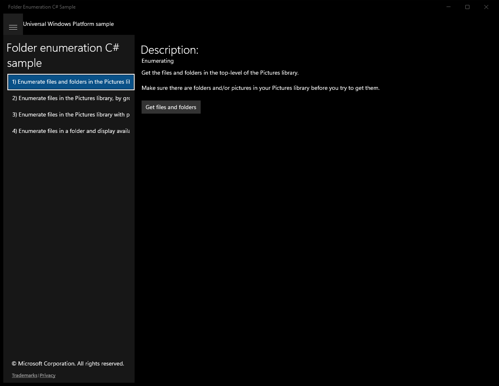

After click **Get files and folders**:

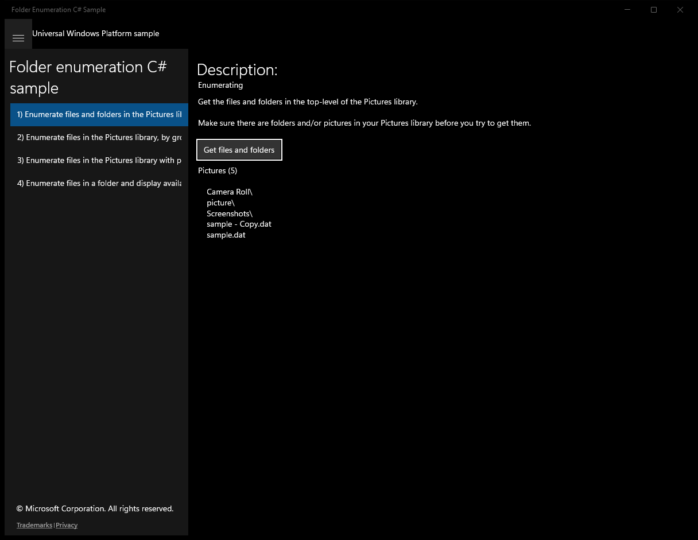

---

## Scenario 2 - Enumerate files in the Pictures library, by groups

**Description**: Grouping

### UI elements
- **TextBlock**  - text="Description:"
- **TextBlock**  - text="Grouping"
- **TextBlock**  - text="Get all the files in the Pictures library, by groups (month, rating, tag). Make sure there are picture files in your Pictures library before running the scenario."
- **Button**  - x:Name="GroupByMonthButton"; content="Group by month"; events: Click=GroupByMonthButton_Click
- **Button**  - x:Name="GroupByRatingButton"; content="Group by rating"; events: Click=GroupByRatingButton_Click
- **Button**  - x:Name="GroupByTagButton"; content="Group by tag"; events: Click=GroupByTagButton_Click

### Code behavior
- **`GroupByMonthButton_Click`**
    - instantiates: `QueryOptions`
    - API refs: `CommonFolderQuery.GroupByMonth`
- **`GroupByRatingButton_Click`**
    - instantiates: `QueryOptions`
    - API refs: `CommonFolderQuery.GroupByRating`
- **`GroupByTagButton_Click`**
    - instantiates: `QueryOptions`
    - API refs: `CommonFolderQuery.GroupByTag`
- **`GroupByHelperAsync`**
    - API refs: `OutputPanel.Children`, `KnownFolders.GetFolderForUserAsync`, `KnownFolderId.PicturesLibrary`
- **`CreateHeaderTextBlock`**
    - instantiates: `TextBlock`
    - API refs: `Application.Current`, `TextWrapping.Wrap`
- **`CreateLineItemTextBlock`**
    - instantiates: `TextBlock`
    - API refs: `Application.Current`, `TextWrapping.Wrap`

### Screenshots
Initial state:

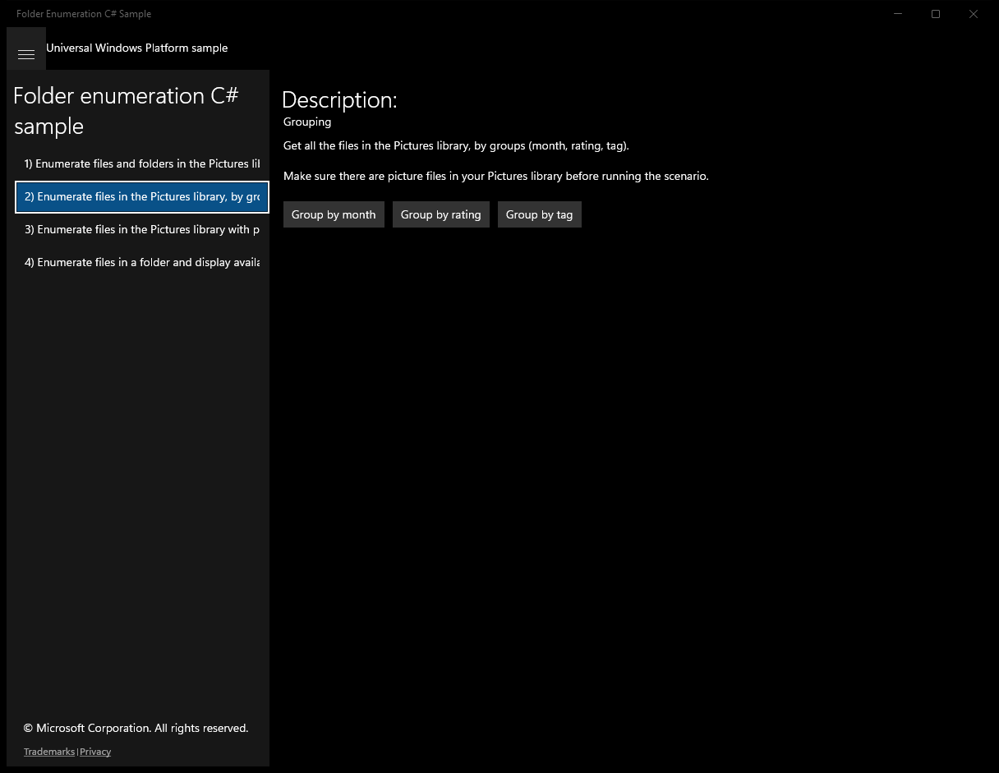

After click **Group by month**:

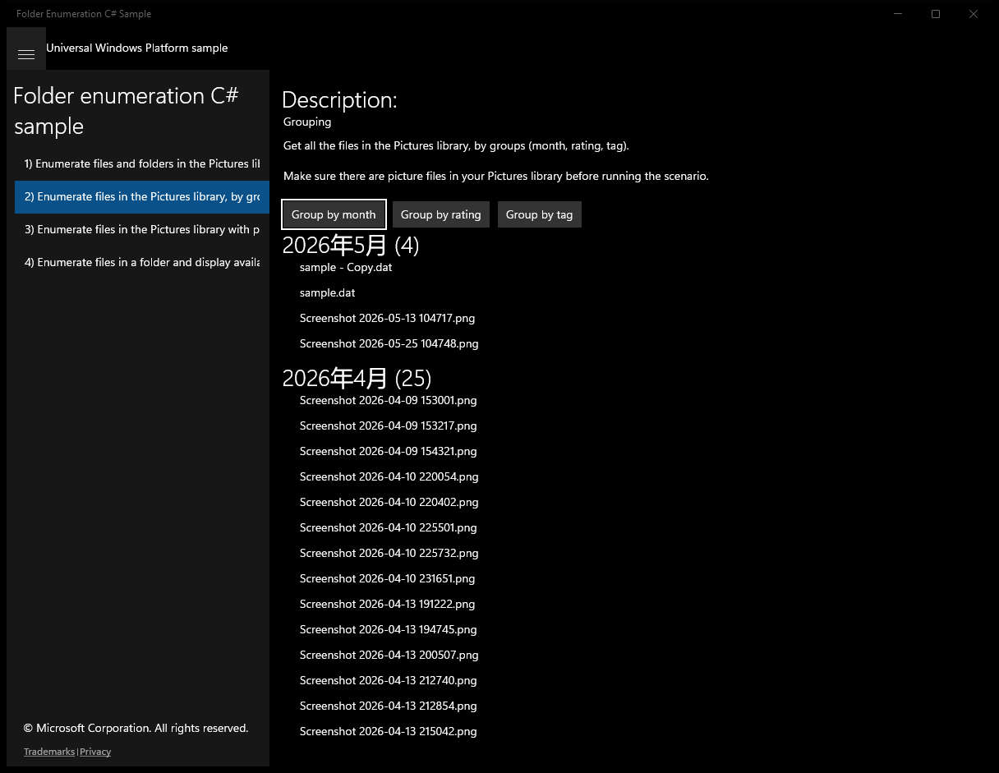

After click **Group by rating**:

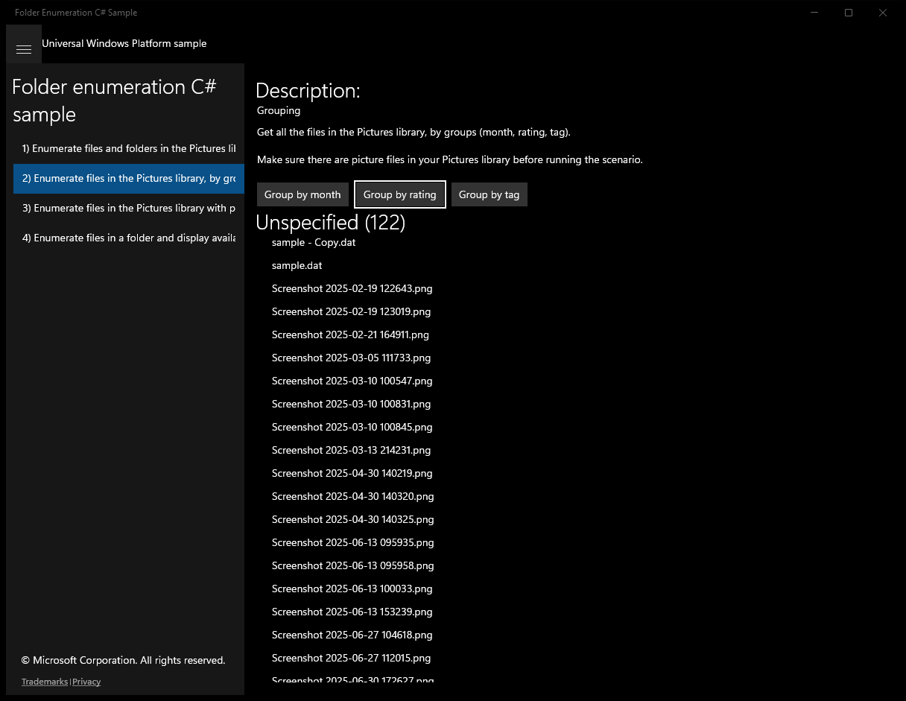

After click **Group by tag**:

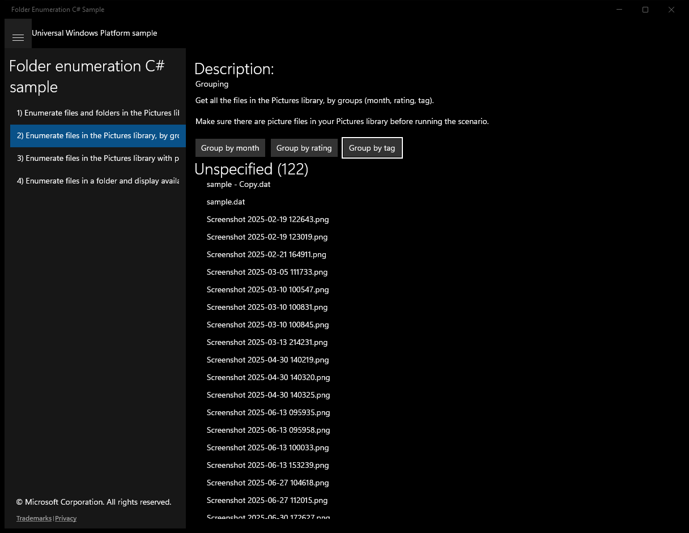

---

## Scenario 3 - Enumerate files in the Pictures library with prefetch APIs

**Description**: Get properties and thumbnails using prefetch

### UI elements
- **TextBlock**  - text="Description:"
- **TextBlock**  - text="Get properties and thumbnails using prefetch"
- **Button**  - x:Name="GetFilesButton"; content="Get files"; events: Click=GetFilesButton_Click

### Code behavior
- **`GetFilesButton_Click`**
    - instantiates: `List`, `QueryOptions`
    - API refs: `OutputPanel.Children`, `CommonFileQuery.OrderByName`, `PropertyPrefetchOptions.ImageProperties`, `ThumbnailMode.PicturesView`, `ThumbnailOptions.UseCurrentScale`, `KnownFolders.GetFolderForUserAsync`, `KnownFolderId.PicturesLibrary`, `Properties.GetImagePropertiesAsync`, `Properties.RetrievePropertiesAsync`
- **`CreateHeaderTextBlock`**
    - instantiates: `TextBlock`
    - API refs: `Application.Current`, `TextWrapping.Wrap`
- **`CreateLineItemTextBlock`**
    - instantiates: `TextBlock`
    - API refs: `Application.Current`, `TextWrapping.Wrap`

### Screenshots
Initial state:

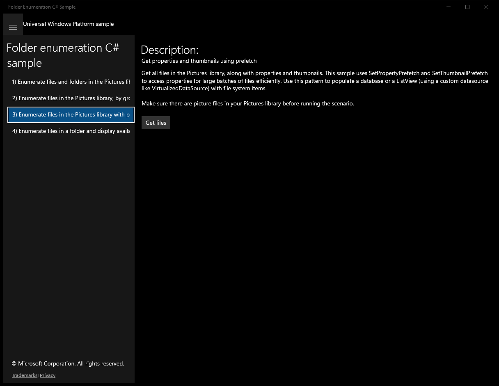

After click **Get files**:

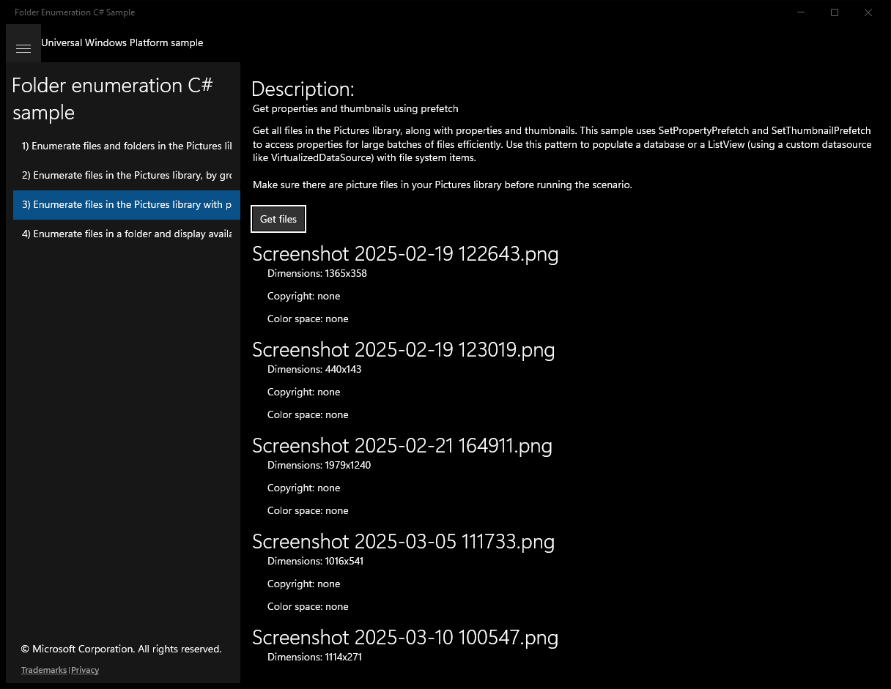

---

## Scenario 4 - Enumerate files in a folder and display availability

**Description**: Get file availability

### UI elements
- **TextBlock**  - text="Description:"
- **TextBlock**  - text="Get file availability"
- **TextBlock**  - text="Get all the files in the picked folder, then indicate their location (This PC, OneDrive, Network, or Application Content) and whether they are available offline."
- **Button**  - x:Name="GetFilesButton"; content="Get files"; events: Click=GetFilesButton_Click

### Code behavior
- **`GetFilesButton_Click`**
    - instantiates: `FolderPicker`
    - API refs: `OutputPanel.Children`, `FileTypeFilter.Add`, `PickerViewMode.List`, `PickerLocationId.DocumentsLibrary`, `Provider.DisplayName`
- **`CreateLineItemTextBlock`**
    - instantiates: `TextBlock`
    - API refs: `Application.Current`, `TextWrapping.Wrap`

### Screenshots
Initial state:

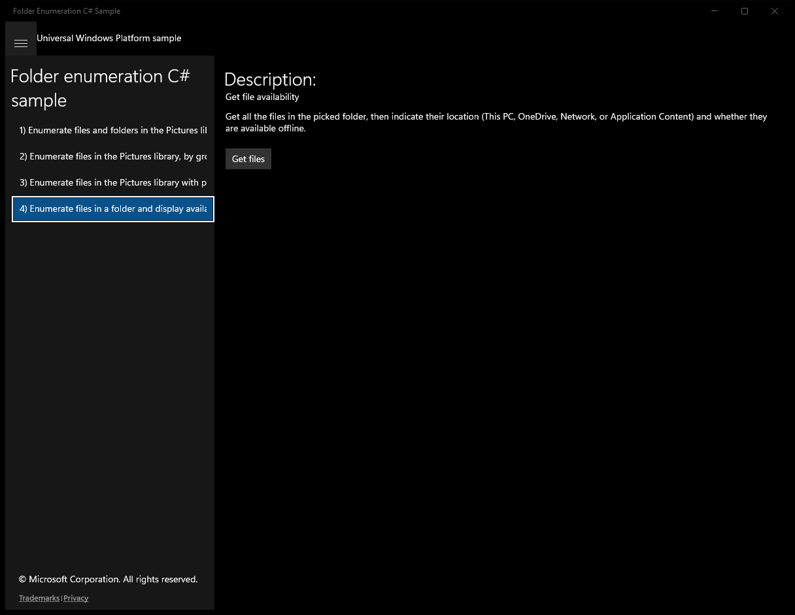

After click **Get files** (popup: Select Folder):

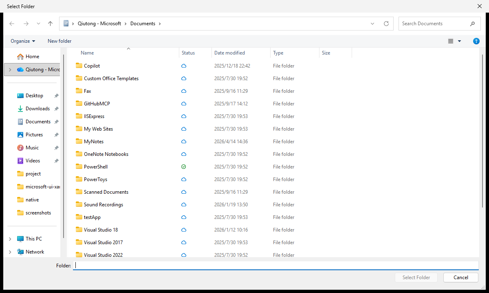

After click **Get files**:

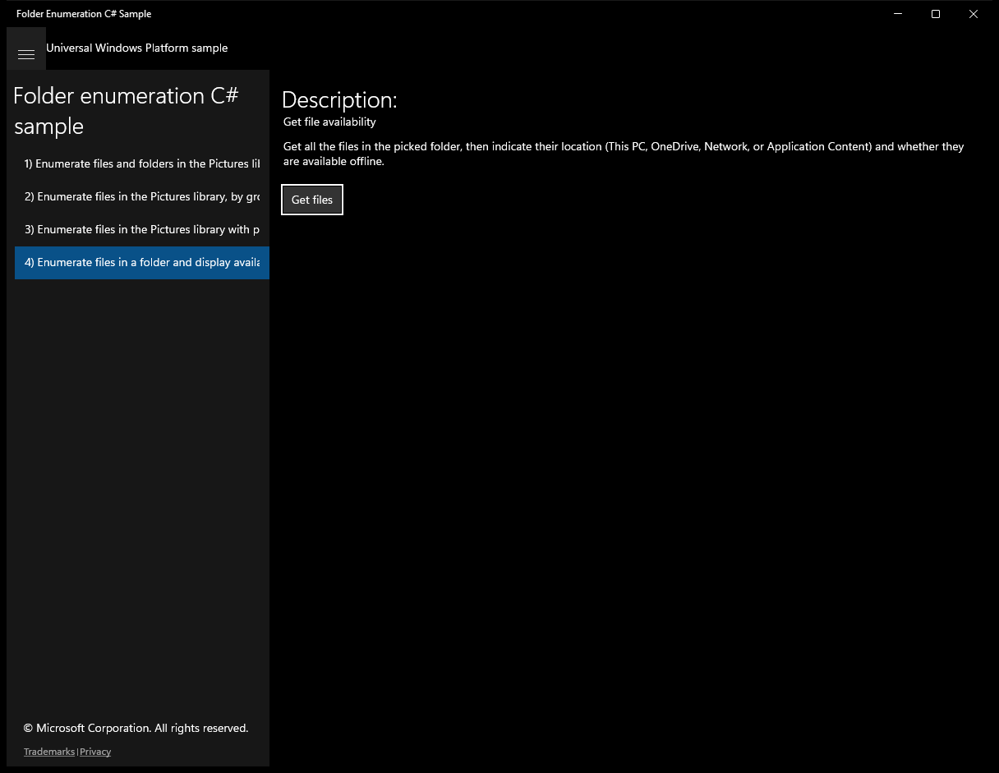

