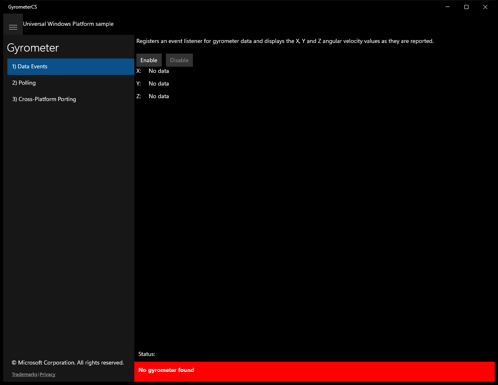
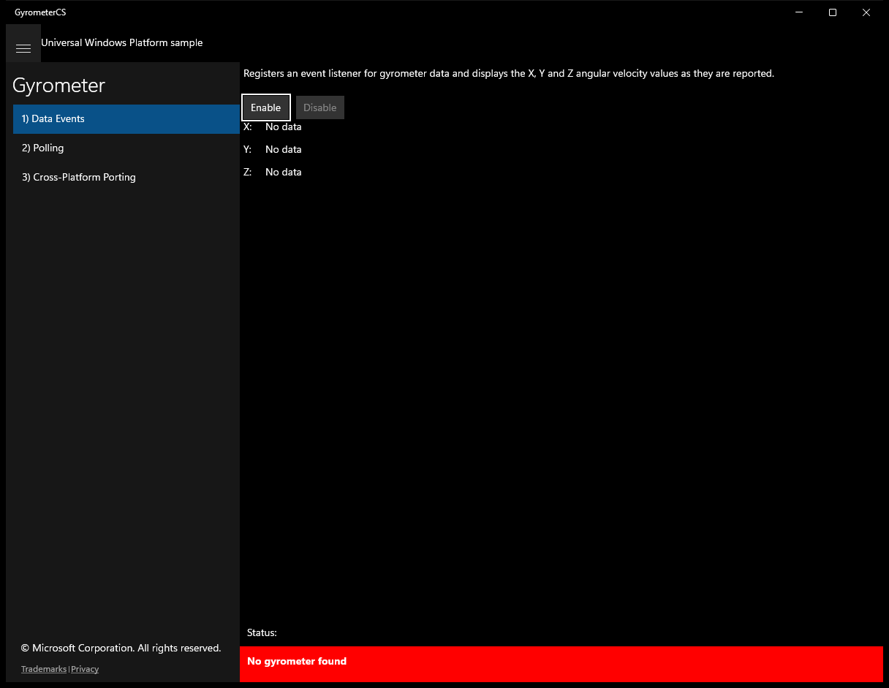
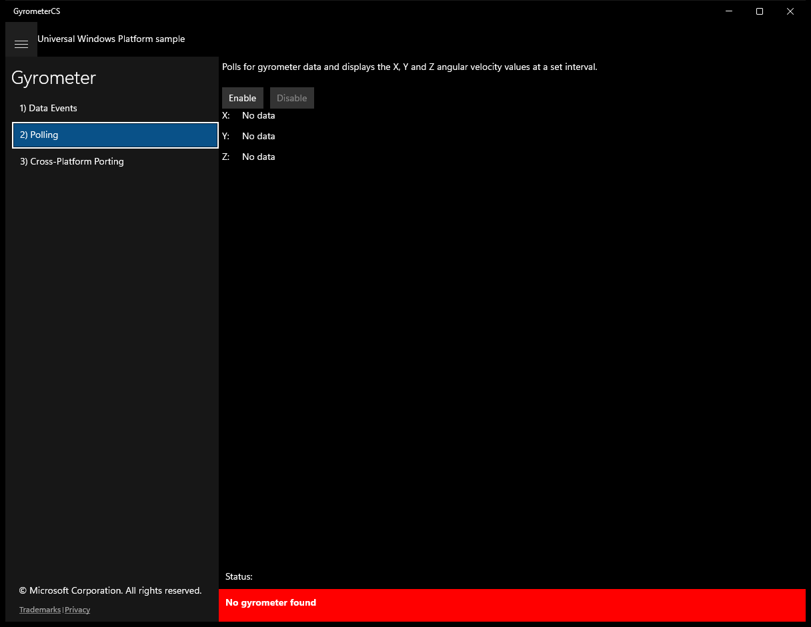
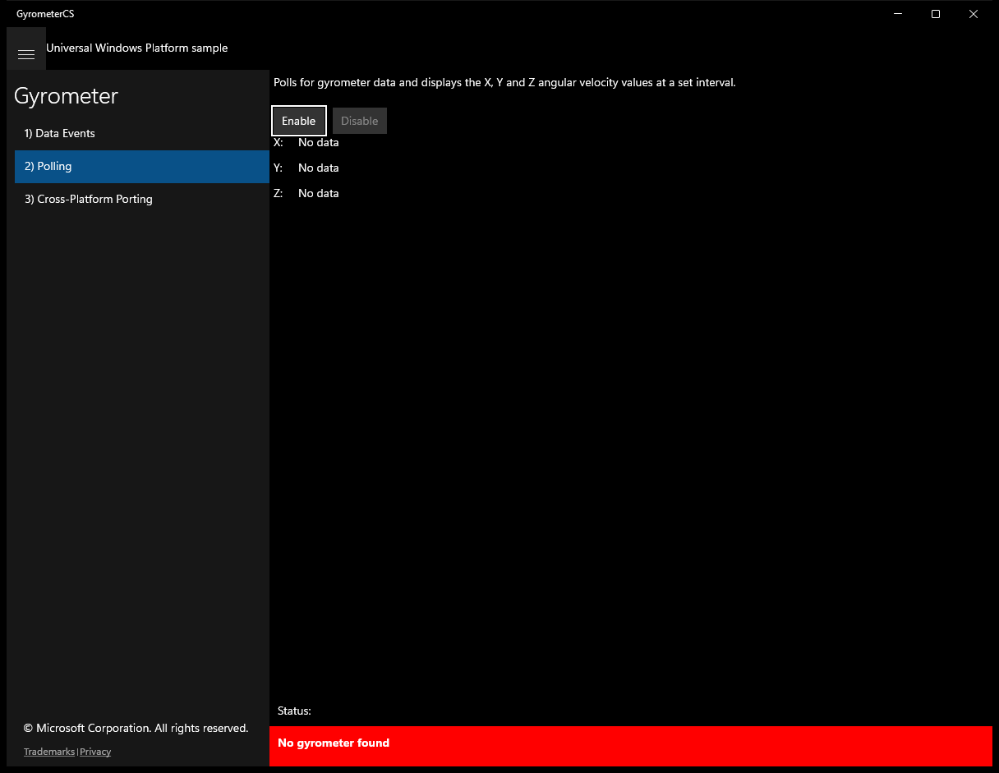
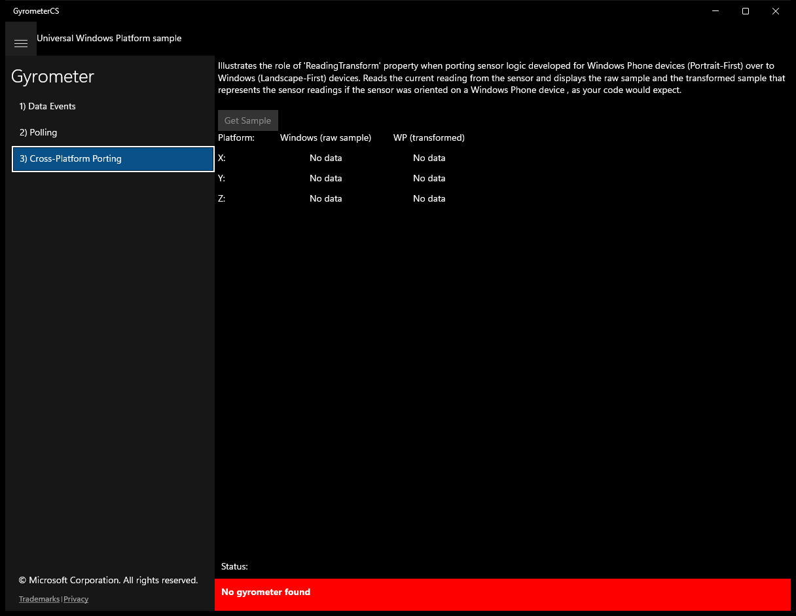

# Gyrometer (C#)

> **Source**: `Samples\Gyrometer\cs\`  
> **Feature**: Gyrometer  
> **AUMID**: `Microsoft.SDKSamples.GyrometerCS.CS_8wekyb3d8bbwe!App`  
> **PackageFamilyName**: `Microsoft.SDKSamples.GyrometerCS.CS_8wekyb3d8bbwe`  

## Top-level UWP namespaces used
- `Windows.Graphics.Display.DisplayOrientations.Portrait`

## Build / deploy / capture status
- build: ok
- deploy: ok
- launch: ok
- capture: ok
- uninstall: ok

## Main page

---

## Scenario 1 - Data Events

### UI elements
- **TextBlock**  - x:Name="InputTextBlock"; text="Registers an event listener for gyrometer data and displays the X, Y and Z angular velocity values as they are reported."
- **Button**  - x:Name="ScenarioEnableButton"; content="Enable"; events: Click=ScenarioEnable
- **Button**  - x:Name="ScenarioDisableButton"; content="Disable"; events: Click=ScenarioDisable
- **TextBlock**  - text="X:"
- **TextBlock**  - text="Y:"
- **TextBlock**  - text="Z:"
- **TextBlock**  - x:Name="ScenarioOutput_X"; text="No data"
- **TextBlock**  - x:Name="ScenarioOutput_Y"; text="No data"
- **TextBlock**  - x:Name="ScenarioOutput_Z"; text="No data"

### Code behavior
- **`OnNavigatedTo`**
    - API refs: `ScenarioEnableButton.IsEnabled`, `ScenarioDisableButton.IsEnabled`
- **`OnNavigatingFrom`**
    - instantiates: `WindowVisibilityChangedEventHandler`, `TypedEventHandler`
    - API refs: `ScenarioDisableButton.IsEnabled`, `Window.Current`
- **`VisibilityChanged`**
    - instantiates: `TypedEventHandler`
    - API refs: `ScenarioDisableButton.IsEnabled`
- **`ReadingChanged`**
    - API refs: `Dispatcher.RunAsync`, `CoreDispatcherPriority.Normal`, `ScenarioOutput_X.Text`, `String.Format`, `ScenarioOutput_Y.Text`, `ScenarioOutput_Z.Text`
- **`ScenarioEnable`**
    - instantiates: `WindowVisibilityChangedEventHandler`, `TypedEventHandler`
    - API refs: `Window.Current`, `ScenarioEnableButton.IsEnabled`, `ScenarioDisableButton.IsEnabled`, `NotifyType.ErrorMessage`
- **`ScenarioDisable`**
    - instantiates: `WindowVisibilityChangedEventHandler`, `TypedEventHandler`
    - API refs: `Window.Current`, `ScenarioEnableButton.IsEnabled`, `ScenarioDisableButton.IsEnabled`

### Screenshots
Initial state:

After click **Enable**:

---

## Scenario 2 - Polling

### UI elements
- **TextBlock**  - x:Name="InputTextBlock"; text="Polls for gyrometer data and displays the X, Y and Z angular velocity values at a set interval."
- **Button**  - x:Name="ScenarioEnableButton"; content="Enable"; events: Click=ScenarioEnable
- **Button**  - x:Name="ScenarioDisableButton"; content="Disable"; events: Click=ScenarioDisable
- **TextBlock**  - text="X:"
- **TextBlock**  - text="Y:"
- **TextBlock**  - text="Z:"
- **TextBlock**  - x:Name="ScenarioOutput_X"; text="No data"
- **TextBlock**  - x:Name="ScenarioOutput_Y"; text="No data"
- **TextBlock**  - x:Name="ScenarioOutput_Z"; text="No data"

### Code behavior
- **`OnNavigatedTo`**
    - API refs: `ScenarioEnableButton.IsEnabled`, `ScenarioDisableButton.IsEnabled`
- **`OnNavigatingFrom`**
    - instantiates: `WindowVisibilityChangedEventHandler`
    - API refs: `ScenarioDisableButton.IsEnabled`, `Window.Current`
- **`VisibilityChanged`**
    - API refs: `ScenarioDisableButton.IsEnabled`
- **`DisplayCurrentReading`**
    - API refs: `ScenarioOutput_X.Text`, `String.Format`, `ScenarioOutput_Y.Text`, `ScenarioOutput_Z.Text`
- **`ScenarioEnable`**
    - instantiates: `WindowVisibilityChangedEventHandler`
    - API refs: `Window.Current`, `ScenarioEnableButton.IsEnabled`, `ScenarioDisableButton.IsEnabled`, `NotifyType.ErrorMessage`
- **`ScenarioDisable`**
    - instantiates: `WindowVisibilityChangedEventHandler`
    - API refs: `Window.Current`, `ScenarioEnableButton.IsEnabled`, `ScenarioDisableButton.IsEnabled`

### Screenshots
Initial state:

After click **Enable**:

---

## Scenario 3 - Cross-Platform Porting

### UI elements
- **TextBlock**  - x:Name="InputTextBlock"; text="Illustrates the role of 'ReadingTransform' property when porting sensor logic developed for Windows Phone devices (Portrait-First) over to Windows (Landscape-First) devices. Reads the current reading from the sensor and displays the raw sample and the transformed sample that represents the sensor readings if the sensor was oriented on a Windows Phone device , as your code would expect."
- **Button**  - x:Name="GetSampleButton"; content="Get Sample"; events: Click=GetGyrometerSample
- **TextBlock**  - text="Platform:"
- **TextBlock**  - text="X:"
- **TextBlock**  - text="Y:"
- **TextBlock**  - text="Z:"
- **TextBlock**  - text="Windows (raw sample)"
- **TextBlock**  - text="WP (transformed)"
- **TextBlock**  - x:Name="ScenarioOutput_X_Windows"; text="No data"
- **TextBlock**  - x:Name="ScenarioOutput_Y_Windows"; text="No data"
- **TextBlock**  - x:Name="ScenarioOutput_Z_Windows"; text="No data"
- **TextBlock**  - x:Name="ScenarioOutput_X_WP"; text="No data"
- **TextBlock**  - x:Name="ScenarioOutput_Y_WP"; text="No data"
- **TextBlock**  - x:Name="ScenarioOutput_Z_WP"; text="No data"

### Code behavior
- **`OnNavigatedTo`**
    - API refs: `GetSampleButton.IsEnabled`
- **`GetGyrometerSample`**
    - API refs: `GetSampleButton.IsEnabled`, `ScenarioOutput_X_WP.Text`, `AngularVelocityX.ToString`, `ScenarioOutput_Y_WP.Text`, `AngularVelocityY.ToString`, `ScenarioOutput_Z_WP.Text`, `AngularVelocityZ.ToString`, `ScenarioOutput_X_Windows.Text`, `ScenarioOutput_Y_Windows.Text`, `ScenarioOutput_Z_Windows.Text`

### Screenshots
Initial state:

