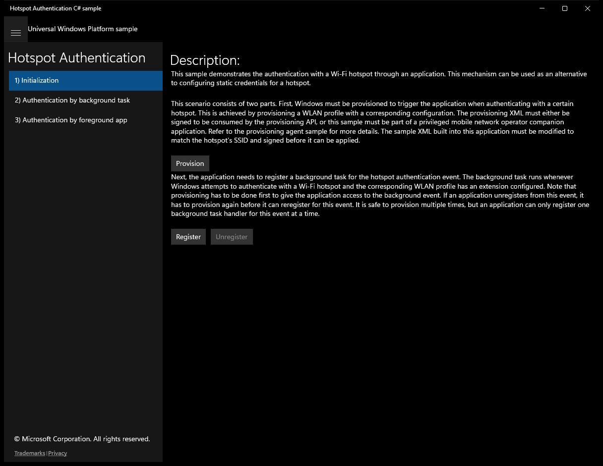

# HotspotAuthentication (C#)

> **Source**: `Samples\HotspotAuthentication\cs\`  
> **Feature**: Hotspot Authentication  
> **AUMID**: `Microsoft.SDKSamples.HotspotAuthentication.CS_8wekyb3d8bbwe!HotspotApp.App`  
> **PackageFamilyName**: `Microsoft.SDKSamples.HotspotAuthentication.CS_8wekyb3d8bbwe`  

## Top-level UWP namespaces used
- `Windows.ApplicationModel.Package.Current.InstalledLocation`
- `Windows.UI.Core.CoreDispatcherPriority.Normal`

## Build / deploy / capture status
- build: ok
- deploy: ok
- launch: ok
- capture: partial
- uninstall: ok
- error: Scenario iteration: You cannot call a method on a null-valued expression.

## Main page

---

## Scenario 1 - Initialization

### UI elements
- **TextBlock**  - text="Description:"
- **TextBlock**  - text="This sample demonstrates the authentication with a Wi-Fi hotspot through an application. This mechanism can be used as an alternative to configuring static credentials for a hotspot."
- **TextBlock**  - text="This scenario consists of two parts. First, Windows must be provisioned to trigger the application when authenticating with a certain hotspot. This is achieved by provisioning a WLAN profile with a corresponding configuration. The provisioning XML must either be signed to be consumed by the provisioning API, or this sample must be part of a privileged mobile network operator companion application. Refer to the provisioning agent sample for more details. The sample XML built into this application must be modified to match the hotspot's SSID and signed before it can be applied."
- **Button**  - x:Name="ProvisionButton"; content="Provision"; events: Click=ProvisionButton_Click
- **TextBlock**  - text="Next, the application needs to register a background task for the hotspot authentication event. The background task runs whenever Windows attempts to authenticate with a Wi-Fi hotspot and the corresponding WLAN profile has an extension configured. Note that provisioning has to be done first to give the application access to the background event. If an application unregisters from this event, it has to provision again before it can reregister for this event. It is safe to provision multiple times, but an application can only register one background task handler for this event at a time."
- **Button**  - x:Name="RegisterButton"; content="Register"; events: Click=RegisterButton_Click
- **Button**  - x:Name="UnregisterButton"; content="Unregister"; events: Click=UnregisterButton_Click

### Code behavior
- **`OnNavigatedTo`**
    - API refs: `ConfigStore.UseNativeWISPr`, `ConfigStore.AuthenticateThroughBackgroundTask`, `ScenarioCommon.Instance`
- **`ProvisionButton_Click`**
    - namespaces: `Windows.ApplicationModel.Package.Current.InstalledLocation`
    - instantiates: `ProvisioningAgent`
    - API refs: `ProvisionButton.IsEnabled`, `Windows.ApplicationModel`, `Package.Current`, `XmlDocument.LoadFromFileAsync`, `NotifyType.StatusMessage`, `NotifyType.ErrorMessage`, `System.Exception`
- **`RegisterButton_Click`**
    - instantiates: `BackgroundTaskBuilder`, `NetworkOperatorHotspotAuthenticationTrigger`
    - API refs: `ScenarioCommon.BackgroundTaskEntryPoint`, `ScenarioCommon.BackgroundTaskName`, `ScenarioCommon.Instance`, `NotifyType.StatusMessage`, `System.Exception`, `NotifyType.ErrorMessage`
- **`UnregisterButton_Click`**
    - API refs: `NotifyType.StatusMessage`, `String.Format`, `ScenarioCommon.BackgroundTaskName`
- **`UnregisterBackgroundTask`**
    - API refs: `BackgroundTaskRegistration.AllTasks`, `Value.Name`, `ScenarioCommon.BackgroundTaskName`, `Value.Unregister`
- **`UpdateButtonState`**
    - API refs: `RegisterButton.IsEnabled`, `UnregisterButton.IsEnabled`

### Screenshots
Initial state:

After click **Provision**:

> Button **Register** skipped (invoke_failed)

---

## Scenario 2 - Authentication by background task

**Description**: The background task handler can be used to perform the actual authentication. Connect to the hotspot configured in step one to see it happen. You may exit this application now.

### UI elements
- **TextBlock**  - text="Description:"
- **TextBlock**  - text="The background task handler can be used to perform the actual authentication. Connect to the hotspot configured in step one to see it happen. You may exit this application now."

### Code behavior
- **`OnNavigatedTo`**
    - API refs: `ConfigStore.AuthenticateThroughBackgroundTask`, `ScenarioCommon.Instance`

---

## Scenario 3 - Authentication by foreground app

**Description**: Authentication can also be performed by the foreground application. In this case, the background task handler triggers the foreground application being launched. This is useful if the application needs additional user input to perform the authentication. Connect to the hotspot configured in step 1 to see it happen. You may exit this application now, and it will be launched on demand.

### UI elements
- **TextBlock**  - text="Description:"
- **Button**  - x:Name="AuthenticateButton"; content="Authenticate"; events: Click=AuthenticateButton_Click
- **Button**  - x:Name="SkipButton"; content="Skip"; events: Click=SkipButton_Click
- **Button**  - x:Name="AbortButton"; content="Abort"; events: Click=AbortButton_Click

### Code behavior
- **`OnNavigatedTo`**
    - API refs: `ConfigStore.AuthenticateThroughBackgroundTask`, `ScenarioCommon.Instance`
- **`OnNavigatedFrom`**
    - API refs: `ScenarioCommon.Instance`
- **`OnBackgroundAuthenticationCompleted`**
    - namespaces: `Windows.UI.Core.CoreDispatcherPriority.Normal`
    - API refs: `Dispatcher.RunAsync`, `Windows.UI`, `Core.CoreDispatcherPriority`, `NotifyType.ErrorMessage`
- **`AuthenticateButton_Click`**
    - API refs: `AuthenticateButton.IsEnabled`, `ConfigStore.UserName`, `ConfigStore.Password`, `ConfigStore.ExtraParameters`, `ConfigStore.MarkAsManualConnect`, `HotspotAuthenticationResponseCode.LoginSucceeded`, `NotifyType.StatusMessage`, `NotifyType.ErrorMessage`
- **`SkipButton_Click`**
    - API refs: `NotifyType.StatusMessage`
- **`AbortButton_Click`**
    - API refs: `ConfigStore.MarkAsManualConnect`, `NotifyType.StatusMessage`
- **`InitializeForegroundAppAuthentication`**
    - API refs: `ConfigStore.AuthenticationToken`, `String.IsNullOrEmpty`, `HotspotAuthenticationContext.TryGetAuthenticationContext`, `NotifyType.ErrorMessage`, `AuthenticateButton.IsEnabled`, `SkipButton.IsEnabled`, `AbortButton.IsEnabled`
- **`ClearAuthenticationToken`**
    - API refs: `ConfigStore.AuthenticationToken`, `AuthenticateButton.IsEnabled`, `SkipButton.IsEnabled`, `AbortButton.IsEnabled`

