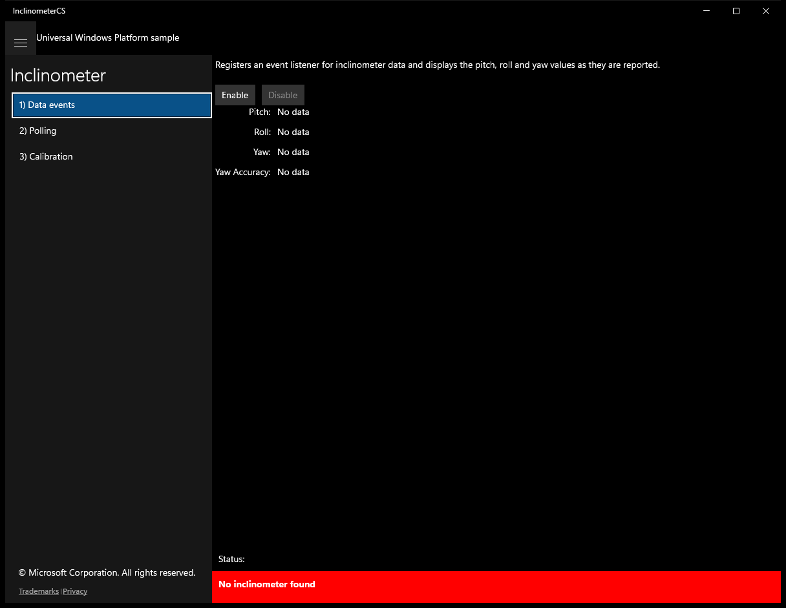
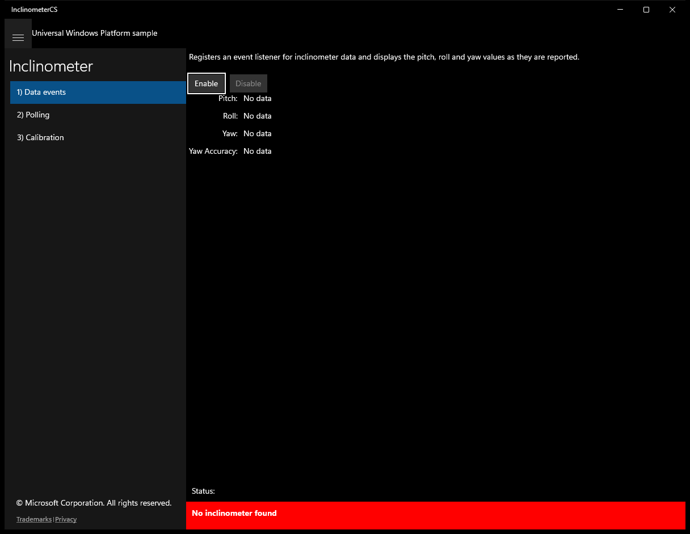
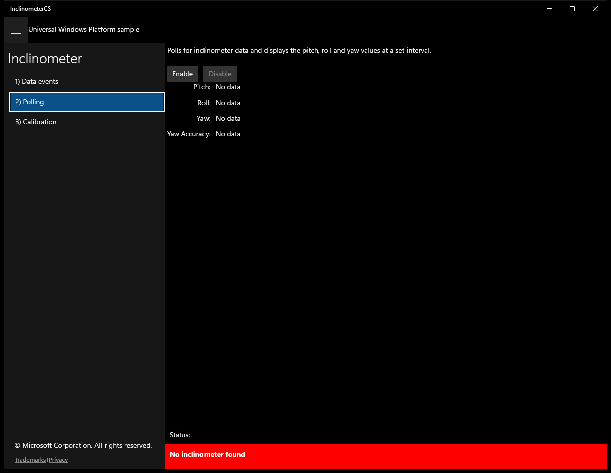
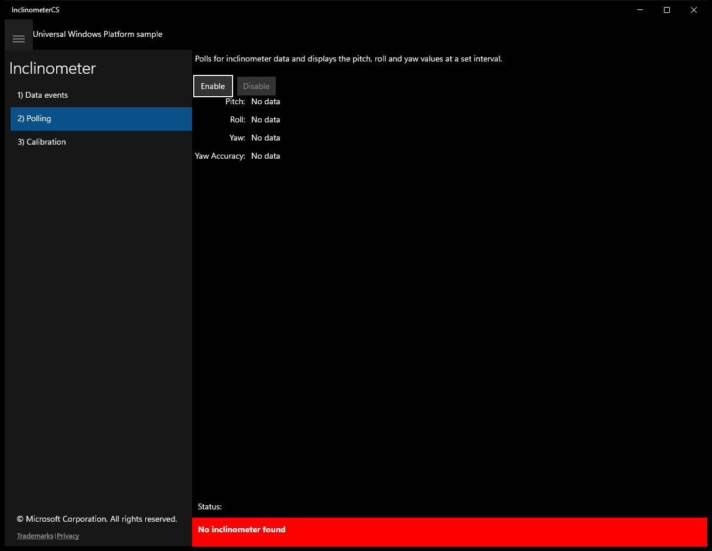
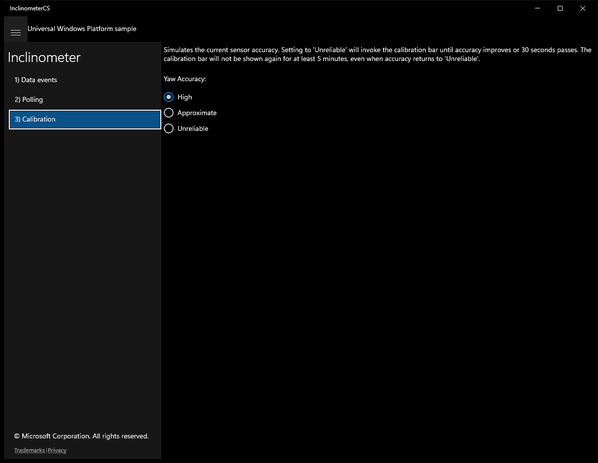

# Inclinometer (C#)

> **Source**: `Samples\Inclinometer\cs\`  
> **Feature**: Inclinometer  
> **AUMID**: `Microsoft.SDKSamples.InclinometerCS.CS_8wekyb3d8bbwe!App`  
> **PackageFamilyName**: `Microsoft.SDKSamples.InclinometerCS.CS_8wekyb3d8bbwe`  

## Build / deploy / capture status
- build: ok
- deploy: ok
- launch: ok
- capture: ok
- uninstall: ok

## Main page

---

## Scenario 1 - Data events

### UI elements
- **TextBlock**  - x:Name="InputTextBlock"; text="Registers an event listener for inclinometer data and displays the pitch, roll and yaw values as they are reported."
- **Button**  - x:Name="ScenarioEnableButton"; content="Enable"; events: Click=ScenarioEnable
- **Button**  - x:Name="ScenarioDisableButton"; content="Disable"; events: Click=ScenarioDisable
- **TextBlock**  - text="Pitch: "
- **TextBlock**  - text="Roll: "
- **TextBlock**  - text="Yaw: "
- **TextBlock**  - text="Yaw Accuracy: "
- **TextBlock**  - x:Name="ScenarioOutput_X"; text="No data"
- **TextBlock**  - x:Name="ScenarioOutput_Y"; text="No data"
- **TextBlock**  - x:Name="ScenarioOutput_Z"; text="No data"
- **TextBlock**  - x:Name="ScenarioOutput_YawAccuracy"; text="No data"

### Code behavior
- **`OnNavigatedTo`**
    - API refs: `ScenarioEnableButton.IsEnabled`, `ScenarioDisableButton.IsEnabled`
- **`OnNavigatingFrom`**
    - instantiates: `WindowVisibilityChangedEventHandler`, `TypedEventHandler`
    - API refs: `ScenarioDisableButton.IsEnabled`, `Window.Current`
- **`VisibilityChanged`**
    - instantiates: `TypedEventHandler`
    - API refs: `ScenarioDisableButton.IsEnabled`
- **`ReadingChanged`**
    - API refs: `Dispatcher.RunAsync`, `CoreDispatcherPriority.Normal`, `ScenarioOutput_X.Text`, `String.Format`, `ScenarioOutput_Y.Text`, `ScenarioOutput_Z.Text`, `MagnetometerAccuracy.Unknown`, `ScenarioOutput_YawAccuracy.Text`, `MagnetometerAccuracy.Unreliable`, `MagnetometerAccuracy.Approximate`, `MagnetometerAccuracy.High`
- **`ScenarioEnable`**
    - instantiates: `WindowVisibilityChangedEventHandler`, `TypedEventHandler`
    - API refs: `Window.Current`, `ScenarioEnableButton.IsEnabled`, `ScenarioDisableButton.IsEnabled`, `NotifyType.ErrorMessage`
- **`ScenarioDisable`**
    - instantiates: `WindowVisibilityChangedEventHandler`, `TypedEventHandler`
    - API refs: `Window.Current`, `ScenarioEnableButton.IsEnabled`, `ScenarioDisableButton.IsEnabled`

### Screenshots
Initial state:

After click **Enable**:

---

## Scenario 2 - Polling

### UI elements
- **TextBlock**  - x:Name="InputTextBlock"; text="Polls for inclinometer data and displays the pitch, roll and yaw values at a set interval."
- **Button**  - x:Name="ScenarioEnableButton"; content="Enable"; events: Click=ScenarioEnable
- **Button**  - x:Name="ScenarioDisableButton"; content="Disable"; events: Click=ScenarioDisable
- **TextBlock**  - text="Pitch: "
- **TextBlock**  - text="Roll: "
- **TextBlock**  - text="Yaw: "
- **TextBlock**  - text="Yaw Accuracy: "
- **TextBlock**  - x:Name="ScenarioOutput_X"; text="No data"
- **TextBlock**  - x:Name="ScenarioOutput_Y"; text="No data"
- **TextBlock**  - x:Name="ScenarioOutput_Z"; text="No data"
- **TextBlock**  - x:Name="ScenarioOutput_YawAccuracy"; text="No data"

### Code behavior
- **`OnNavigatedTo`**
    - API refs: `ScenarioEnableButton.IsEnabled`, `ScenarioDisableButton.IsEnabled`
- **`OnNavigatingFrom`**
    - instantiates: `WindowVisibilityChangedEventHandler`
    - API refs: `ScenarioDisableButton.IsEnabled`, `Window.Current`
- **`VisibilityChanged`**
    - API refs: `ScenarioDisableButton.IsEnabled`
- **`DisplayCurrentReading`**
    - API refs: `ScenarioOutput_X.Text`, `String.Format`, `ScenarioOutput_Y.Text`, `ScenarioOutput_Z.Text`, `MagnetometerAccuracy.Unknown`, `ScenarioOutput_YawAccuracy.Text`, `MagnetometerAccuracy.Unreliable`, `MagnetometerAccuracy.Approximate`, `MagnetometerAccuracy.High`
- **`ScenarioEnable`**
    - instantiates: `WindowVisibilityChangedEventHandler`
    - API refs: `Window.Current`, `ScenarioEnableButton.IsEnabled`, `ScenarioDisableButton.IsEnabled`, `NotifyType.ErrorMessage`
- **`ScenarioDisable`**
    - instantiates: `WindowVisibilityChangedEventHandler`
    - API refs: `Window.Current`, `ScenarioEnableButton.IsEnabled`, `ScenarioDisableButton.IsEnabled`

### Screenshots
Initial state:

After click **Enable**:

---

## Scenario 3 - Calibration

### UI elements
- **TextBlock**  - x:Name="InputTextBlock"; text="Simulates the current sensor accuracy. Setting to 'Unreliable' will invoke the calibration bar until accuracy improves or 30 seconds passes. The calibration bar will not be shown again for at least 5 minutes, even when accuracy returns to 'Unreliable'."
- **TextBlock**  - text="Yaw Accuracy: "
- **RadioButton**  - content="High"; events: Click=OnHighAccuracy
- **RadioButton**  - content="Approximate"; events: Click=OnApproximateAccuracy
- **RadioButton**  - content="Unreliable"; events: Click=OnUnreliableAccuracy

### Code behavior
- **`OnUnreliableAccuracy`**
    - API refs: `MagnetometerAccuracy.Unreliable`

### Screenshots
Initial state:

