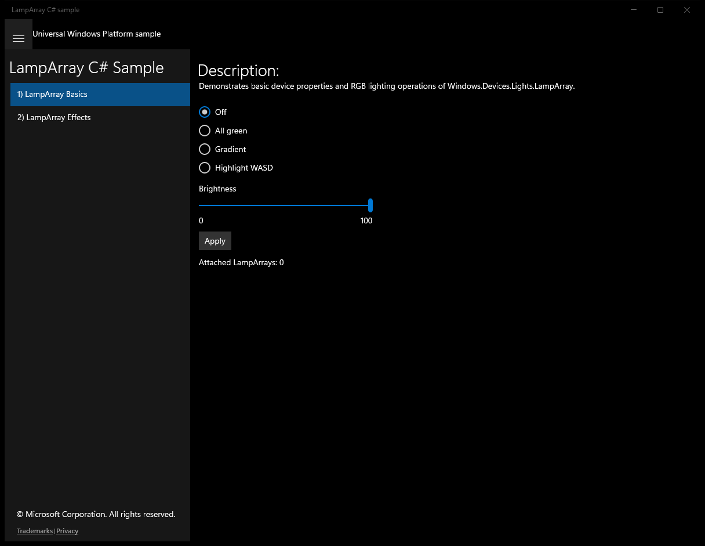
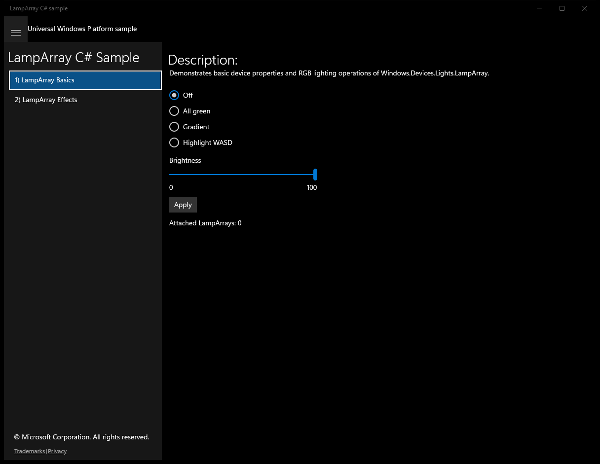
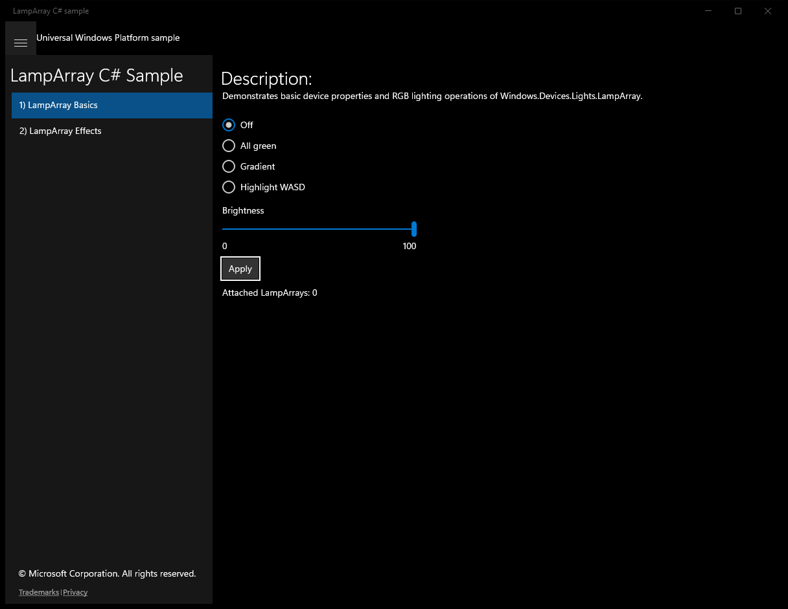
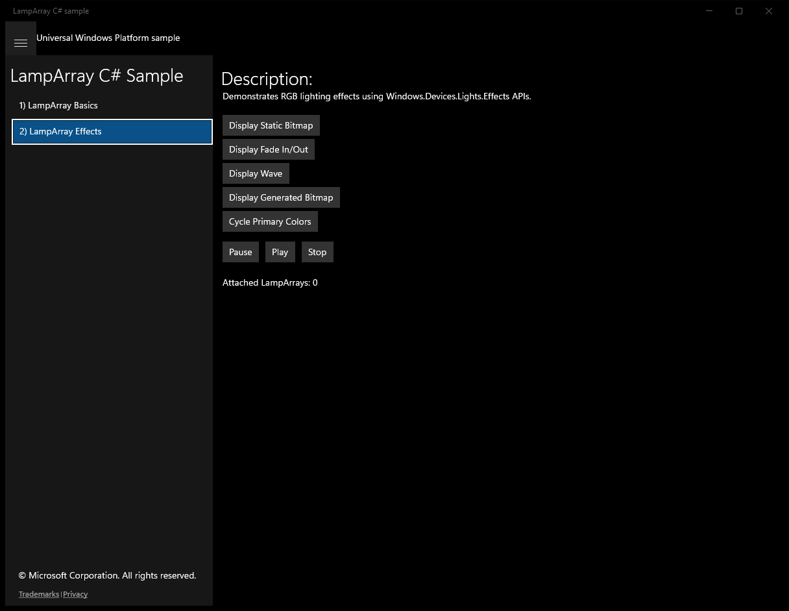

# LampArray (C#)

> **Source**: `Samples\LampArray\cs\`  
> **Feature**: LampArray C# Sample  
> **AUMID**: `Microsoft.SDKSamples.LampArray.CS_8wekyb3d8bbwe!LampArray.App`  
> **PackageFamilyName**: `Microsoft.SDKSamples.LampArray.CS_8wekyb3d8bbwe`  

## Top-level UWP namespaces used
- `Windows.Storage.Streams.Buffer`

## Build / deploy / capture status
- build: ok
- deploy: ok
- launch: ok
- capture: ok
- uninstall: ok

## Main page

---

## Scenario 1 - LampArray Basics

**Description**: Demonstrates basic device properties and RGB lighting operations of Windows.Devices.Lights.LampArray.

### UI elements
- **TextBlock**  - text="Description:"
- **TextBlock**  - text="Demonstrates basic device properties and RGB lighting operations of Windows.Devices.Lights.LampArray."
- **RadioButton**  - x:Name="OffButton"
- **RadioButton**  - x:Name="SetColorButton"
- **RadioButton**  - x:Name="GradientButton"
- **RadioButton**  - x:Name="WasdButton"
- **Slider**  - x:Name="BrightnessSlider"
- **TextBlock**  - text="0"
- **TextBlock**  - text="100"
- **Button**  - content="Apply"; events: Click=Apply_Clicked
- **TextBlock**  - x:Name="LampArraysSummary"; text="Attached LampArrays"

### Code behavior
- **`OnNavigatedTo`**
    - API refs: `DeviceInformation.CreateWatcher`, `LampArray.GetDeviceSelector`
- **`Watcher_Added`**
    - instantiates: `LampArrayInfo`
    - API refs: `LampArray.FromIdAsync`, `Dispatcher.RunAsync`, `CoreDispatcherPriority.Normal`, `NotifyType.ErrorMessage`
- **`Watcher_Removed`**
    - API refs: `Dispatcher.RunAsync`, `CoreDispatcherPriority.Normal`
- **`LampArray_AvailabilityChanged`**
    - API refs: `Dispatcher.RunAsync`, `CoreDispatcherPriority.Normal`
- **`UpdateLampArrayList`**
    - API refs: `LampArrayKind.ToString`, `LampArraysSummary.Text`
- **`ApplySettingsToLampArray`**
    - API refs: `OffButton.IsChecked`, `Colors.Black`, `SetColorButton.IsChecked`, `Colors.Green`, `GradientButton.IsChecked`, `WasdButton.IsChecked`, `BrightnessSlider.Value`, `BrightnessSlider.Maximum`
- **`SetGradientPatternToLampArray`**
    - API refs: `Enumerable.Range`
- **`SetWasdPatternToLampArray`**
    - API refs: `Colors.Blue`, `Enumerable.Repeat`, `Colors.White`

### Screenshots
Initial state:

After click **Apply**:

---

## Scenario 2 - LampArray Effects

**Description**: Demonstrates RGB lighting effects using Windows.Devices.Lights.Effects APIs.

### UI elements
- **TextBlock**  - text="Description:"
- **TextBlock**  - text="Demonstrates RGB lighting effects using Windows.Devices.Lights.Effects APIs."
- **Button**  - text="Display Static Bitmap"; events: Click=StaticBitmapButton_Click
- **Button**  - text="Display Fade In/Out"; events: Click=FadeButton_Click
- **Button**  - text="Display Wave"; events: Click=CustomEffectButton_Click
- **Button**  - text="Display Generated Bitmap"; events: Click=GeneratedBitmapButton_Click
- **Button**  - text="Cycle Primary Colors"; events: Click=CycleButton_Click
- **Button**  - x:Name="PauseButton"; text="Pause"; events: Click=PauseButton_Click
- **Button**  - x:Name="PlayButton"; text="Play"; events: Click=PlayButton_Click
- **Button**  - x:Name="StopButton"; text="Stop"; events: Click=StopButton_Click
- **TextBlock**  - x:Name="LampArraysSummary"; text="Attached LampArrays"
- **Image**  - x:Name="ImageBitmap"

### Code behavior
- **`OnNavigatedTo`**
    - API refs: `DeviceInformation.CreateWatcher`, `LampArray.GetDeviceSelector`
- **`Watcher_Added`**
    - instantiates: `LampArrayInfo`
    - API refs: `LampArray.FromIdAsync`, `Dispatcher.RunAsync`, `CoreDispatcherPriority.Normal`, `NotifyType.ErrorMessage`, `Colors.Black`
- **`Watcher_Removed`**
    - API refs: `Dispatcher.RunAsync`, `CoreDispatcherPriority.Normal`
- **`LampArray_AvailabilityChanged`**
    - API refs: `Dispatcher.RunAsync`, `CoreDispatcherPriority.Normal`
- **`UpdateLampArrayList`**
    - API refs: `LampArrayKind.ToString`, `LampArraysSummary.Text`
- **`CleanupPreviousEffect`**
    - API refs: `ImageBitmap.Source`, `LampArrayEffectPlaylist.StopAll`
- **`StaticBitmapButton_Click`**
    - instantiates: `Uri`, `BitmapImage`, `List`, `LampArrayBitmapEffect`, `LampArrayEffectPlaylist`
    - API refs: `StorageFile.GetFileFromApplicationUriAsync`, `FileAccessMode.Read`, `BitmapDecoder.CreateAsync`, `ImageBitmap.Source`, `TimeSpan.MaxValue`, `LampArrayEffectPlaylist.StartAll`
- **`FadeButton_Click`**
    - instantiates: `List`, `LampArrayEffectPlaylist`, `LampArrayBlinkEffect`
    - API refs: `LampArrayEffectStartMode.Simultaneous`, `TimeSpan.FromMilliseconds`, `LampArrayRepetitionMode.Forever`, `LampArrayEffectPlaylist.StartAll`
- **`LampArrayBlinkEffect`**
    - API refs: `TimeSpan.FromMilliseconds`, `LampArrayRepetitionMode.Forever`
- **`CustomEffectButton_Click`**
    - instantiates: `List`, `CustomEffectState`, `LampArrayCustomEffect`, `LampArrayEffectPlaylist`
    - API refs: `TimeSpan.MaxValue`, `Enumerable.Repeat`, `Colors.Black`, `LampArrayEffectPlaylist.StartAll`
- **`LampArrayCustomEffect`**
    - API refs: `TimeSpan.MaxValue`
- **`CustomEffect_UpdateRequested`**
    - API refs: `Colors.Black`
- **`GeneratedBitmapButton_Click`**
    - namespaces: `Windows.Storage.Streams.Buffer`
    - instantiates: `List`, `GeneratedBitmapState`, `LampArrayBitmapEffect`, `CanvasRenderTarget`, `SoftwareBitmap`, `Windows.Storage.Streams.Buffer`, `LampArrayEffectPlaylist`
    - API refs: `TimeSpan.MaxValue`, `SuggestedBitmapSize.Width`, `SuggestedBitmapSize.Height`, `Math.Min`, `CanvasDevice.GetSharedDevice`, `BitmapPixelFormat.Bgra8`, `BitmapAlphaMode.Premultiplied`, `Windows.Storage`, `Streams.Buffer`, `LampArrayEffectPlaylist.StartAll`
- **`GeneratedBitmapEffect_UpdateRequested`**
    - API refs: `Colors.Blue`, `Colors.Red`
- **`CycleButton_Click`**
    - instantiates: `List`, `LampArrayEffectPlaylist`, `LampArrayColorRampEffect`
    - API refs: `LampArrayEffectStartMode.Sequential`, `LampArrayRepetitionMode.Forever`, `Colors.Red`, `LampArrayEffectCompletionBehavior.KeepState`, `Colors.Yellow`, `Colors.Green`, `Colors.Blue`, `LampArrayEffectPlaylist.StartAll`
- **`LampArrayEffectPlaylist`**
    - API refs: `LampArrayEffectStartMode.Sequential`, `LampArrayRepetitionMode.Forever`
- **`PauseButton_Click`**
    - API refs: `LampArrayEffectPlaylist.PauseAll`
- **`PlayButton_Click`**
    - API refs: `LampArrayEffectPlaylist.StartAll`
- **`StopButton_Click`**
    - API refs: `LampArrayEffectPlaylist.StopAll`

### Screenshots
Initial state:

After click **Display Static Bitmap**:

> Button **Display Fade In/Out** skipped (invoke_failed)

> Button **Display Wave** skipped (invoke_failed)

> Button **Display Generated Bitmap** skipped (invoke_failed)

> Button **Cycle Primary Colors** skipped (invoke_failed)

> Button **Pause** skipped (invoke_failed)

> Button **Play** skipped (invoke_failed)

> Button **Stop** skipped (invoke_failed)

