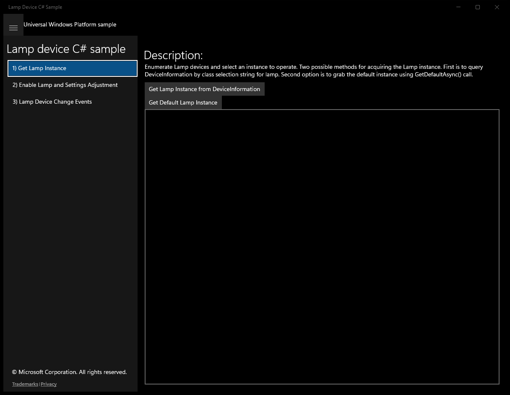
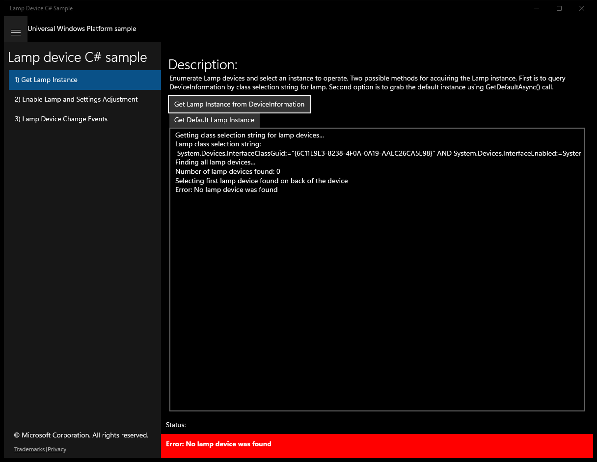
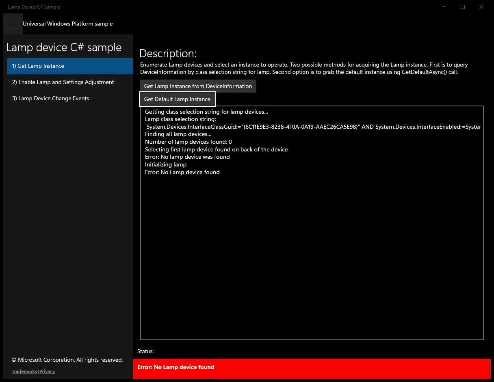
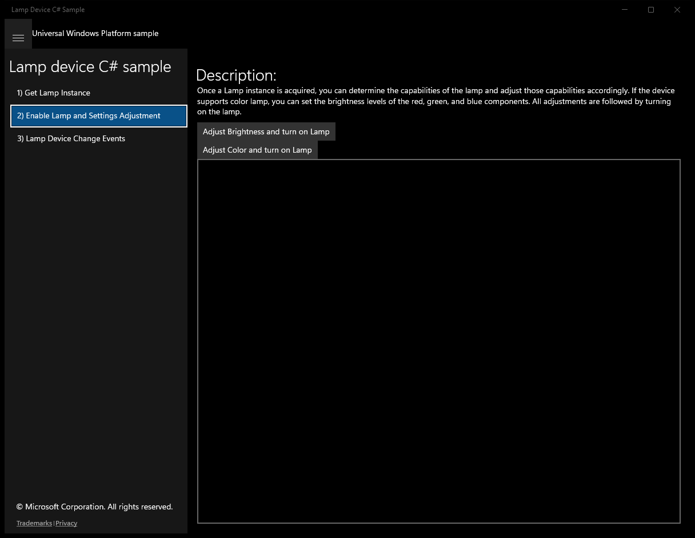
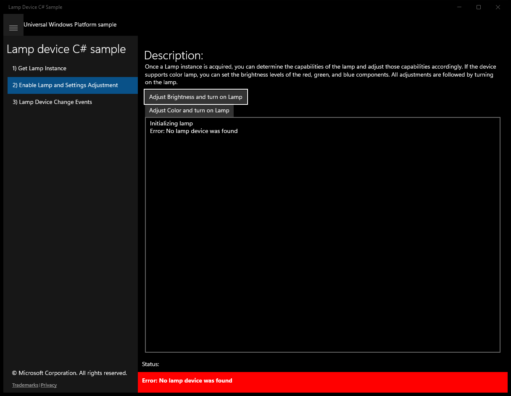
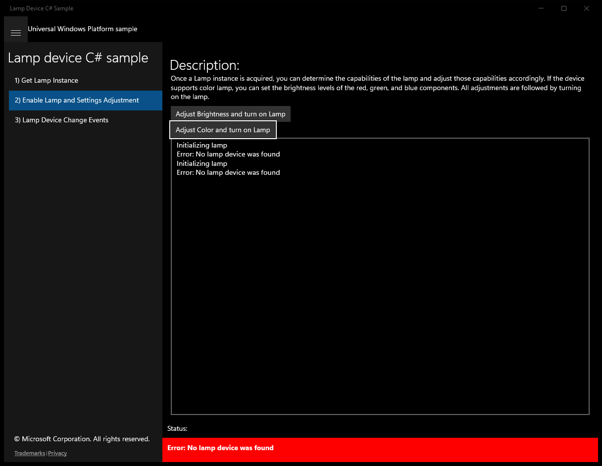
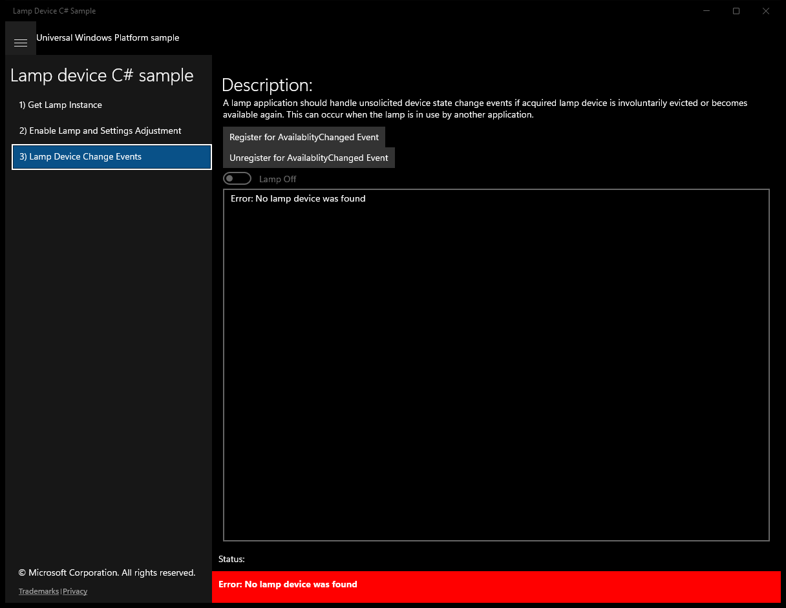
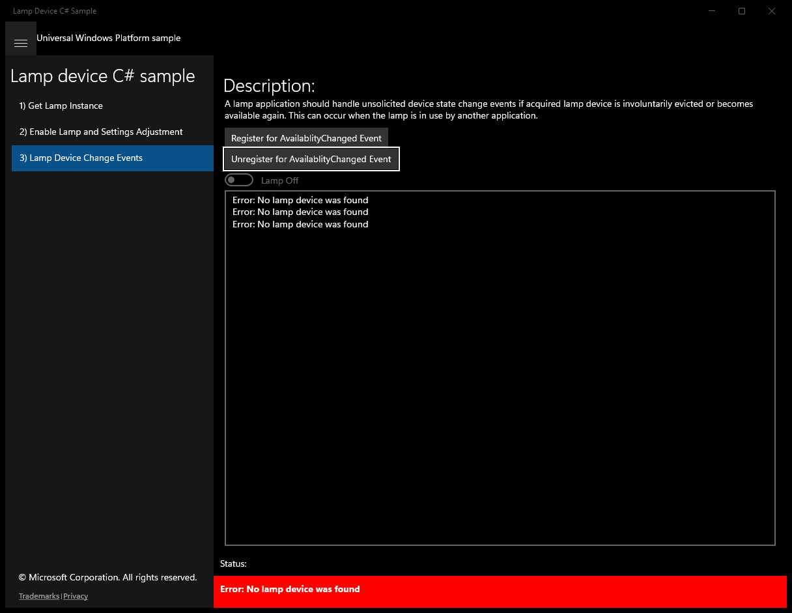

# LampDevice (C#)

> **Source**: `Samples\LampDevice\cs\`  
> **Feature**: Lamp device C# sample  
> **AUMID**: `Microsoft.SDKSamples.Lamp.CS_8wekyb3d8bbwe!App`  
> **PackageFamilyName**: `Microsoft.SDKSamples.Lamp.CS_8wekyb3d8bbwe`  

## Top-level UWP namespaces used
- `Windows.Devices.Enumeration.Panel.Back`
- `Windows.UI.Core.CoreDispatcherPriority.Normal`

## Build / deploy / capture status
- build: ok
- deploy: ok
- launch: ok
- capture: ok
- uninstall: ok

## Main page

---

## Scenario 1 - Get Lamp Instance

**Description**: Enumerate Lamp devices and select an instance to operate. Two possible methods for acquiring the Lamp instance. First is to query DeviceInformation by class selection string for lamp. Second option is to grab the default instance using GetDefaultAsync() call.

### UI elements
- **TextBlock**  - text="Description:"
- **Button**  - content="Get Lamp Instance from DeviceInformation"; events: Click=InitLampBtn_Click
- **Button**  - content="Get Default Lamp Instance"; events: Click=GetDefaultAsyncBtn_Click
- **TextBox**  - x:Name="outputBox"
- **TextBlock**  - x:Name="StatusBlock"

### Code behavior
- **`OnNavigatedTo`**
    - API refs: `MainPage.Current`
- **`InitLampBtn_Click`**
    - namespaces: `Windows.Devices.Enumeration.Panel.Back`
    - instantiates: `InvalidOperationException`
    - API refs: `Lamp.GetDeviceSelector`, `CultureInfo.InvariantCulture`, `DeviceInformation.FindAllAsync`, `Count.ToString`, `EnclosureLocation.Panel`, `Windows.Devices`, `Enumeration.Panel`, `Lamp.FromIdAsync`, `NotifyType.StatusMessage`, `NotifyType.ErrorMessage`
- **`GetDefaultAsyncBtn_Click`**
    - API refs: `Lamp.GetDefaultAsync`, `NotifyType.ErrorMessage`, `CultureInfo.InvariantCulture`, `NotifyType.StatusMessage`
- **`LogStatusToOutputBoxAsync`**
    - namespaces: `Windows.UI.Core.CoreDispatcherPriority.Normal`
    - API refs: `Dispatcher.RunAsync`, `Windows.UI`, `Core.CoreDispatcherPriority`
- **`LogStatusAsync`**
    - namespaces: `Windows.UI.Core.CoreDispatcherPriority.Normal`
    - API refs: `Dispatcher.RunAsync`, `Windows.UI`, `Core.CoreDispatcherPriority`

### Screenshots
Initial state:

After click **Get Lamp Instance from DeviceInformation**:

After click **Get Default Lamp Instance**:

---

## Scenario 2 - Enable Lamp and Settings Adjustment

**Description**: Once a Lamp instance is acquired, you can determine the capabilities of the lamp and adjust those capabilities accordingly. If the device supports color lamp, you can set the brightness levels of the red, green, and blue components. All adjustments are followed by turning on the lamp.

### UI elements
- **TextBlock**  - text="Description:"
- **Button**  - content="Adjust Brightness and turn on Lamp"; events: Click=BrightnessBtn_Click
- **Button**  - content="Adjust Color and turn on Lamp"; events: Click=ColorLampBtn_Click
- **TextBox**  - x:Name="outputBox"
- **TextBlock**  - x:Name="StatusBlock"

### Code behavior
- **`OnNavigatedTo`**
    - API refs: `MainPage.Current`
- **`BrightnessBtn_Click`**
    - API refs: `Lamp.GetDefaultAsync`, `NotifyType.ErrorMessage`, `CultureInfo.InvariantCulture`, `NotifyType.StatusMessage`
- **`ColorLampBtn_Click`**
    - API refs: `Lamp.GetDefaultAsync`, `NotifyType.ErrorMessage`, `NotifyType.StatusMessage`, `CultureInfo.InvariantCulture`, `Colors.Blue`
- **`LogStatusToOutputBoxAsync`**
    - namespaces: `Windows.UI.Core.CoreDispatcherPriority.Normal`
    - API refs: `Dispatcher.RunAsync`, `Windows.UI`, `Core.CoreDispatcherPriority`
- **`LogStatusAsync`**
    - namespaces: `Windows.UI.Core.CoreDispatcherPriority.Normal`
    - API refs: `Dispatcher.RunAsync`, `Windows.UI`, `Core.CoreDispatcherPriority`

### Screenshots
Initial state:

After click **Adjust Brightness and turn on Lamp**:

After click **Adjust Color and turn on Lamp**:

---

## Scenario 3 - Lamp Device Change Events

**Description**: A lamp application should handle unsolicited device state change events if acquired lamp device is involuntarily evicted or becomes available again. This can occur when the lamp is in use by another application.

### UI elements
- **TextBlock**  - text="Description:"
- **Button**  - content="Register for AvailablityChanged Event"; events: Click=RegisterBtn_Click
- **Button**  - content="Unregister for AvailablityChanged Event"; events: Click=UnRegisterBtn_Click
- **ToggleSwitch**  - name="lampToggle"; events: Toggled=lampToggle_Toggled
- **TextBox**  - x:Name="outputBox"
- **TextBlock**  - x:Name="StatusBlock"

### Code behavior
- **`OnNavigatedTo`**
    - API refs: `MainPage.Current`
- **`InitializeLampAsync`**
    - API refs: `Lamp.GetDefaultAsync`, `NotifyType.ErrorMessage`, `CultureInfo.InvariantCulture`, `NotifyType.StatusMessage`
- **`RegisterBtn_Click`**
    - API refs: `NotifyType.ErrorMessage`, `NotifyType.StatusMessage`
- **`Lamp_AvailabilityChanged`**
    - namespaces: `Windows.UI.Core.CoreDispatcherPriority.Normal`
    - API refs: `Dispatcher.RunAsync`, `Windows.UI`, `Core.CoreDispatcherPriority`, `CultureInfo.InvariantCulture`, `NotifyType.StatusMessage`
- **`UnRegisterBtn_Click`**
    - API refs: `NotifyType.ErrorMessage`, `NotifyType.StatusMessage`
- **`LogStatusToOutputBoxAsync`**
    - namespaces: `Windows.UI.Core.CoreDispatcherPriority.Normal`
    - API refs: `Dispatcher.RunAsync`, `Windows.UI`, `Core.CoreDispatcherPriority`
- **`LogStatusAsync`**
    - namespaces: `Windows.UI.Core.CoreDispatcherPriority.Normal`
    - API refs: `Dispatcher.RunAsync`, `Windows.UI`, `Core.CoreDispatcherPriority`

### Screenshots
Initial state:

After click **Register for AvailablityChanged Event**:

After click **Unregister for AvailablityChanged Event**:

