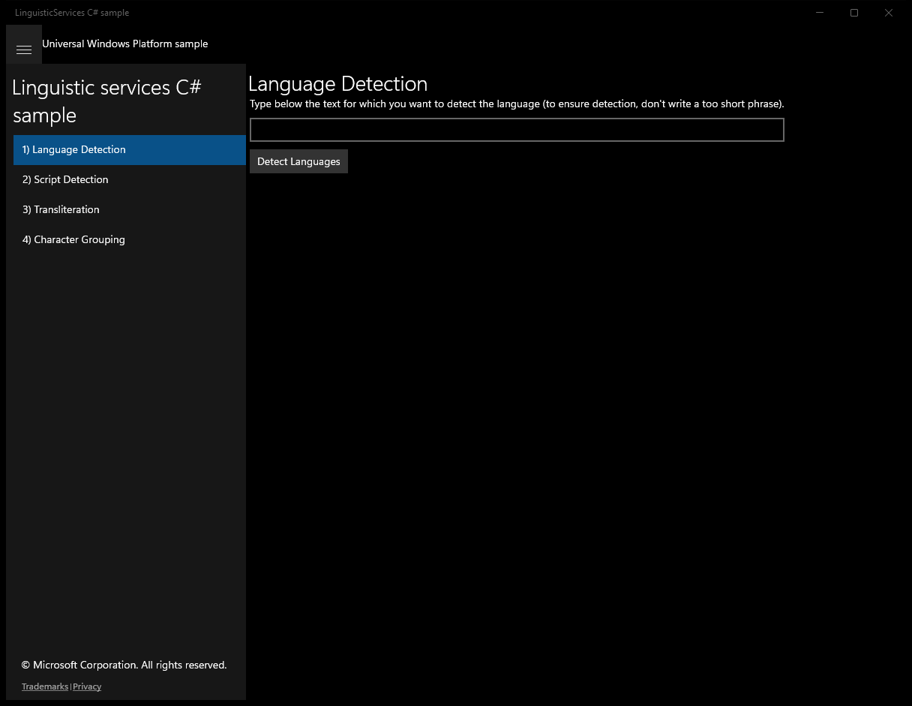
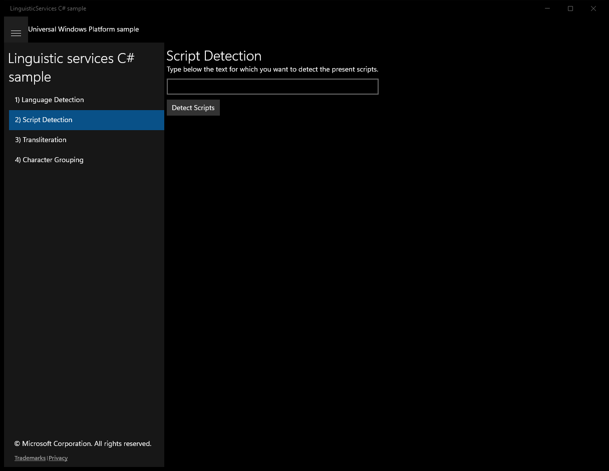
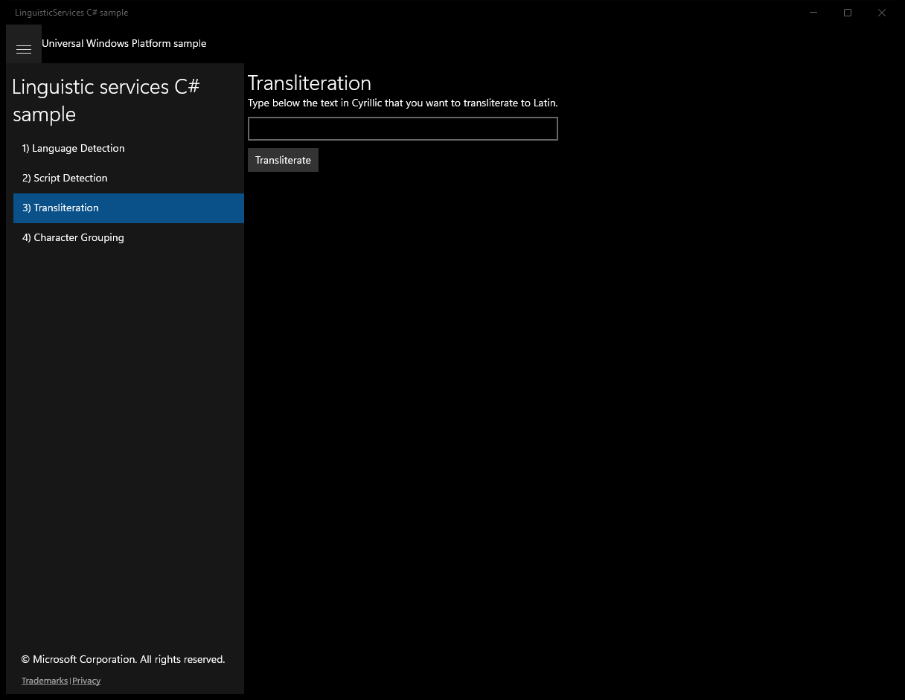
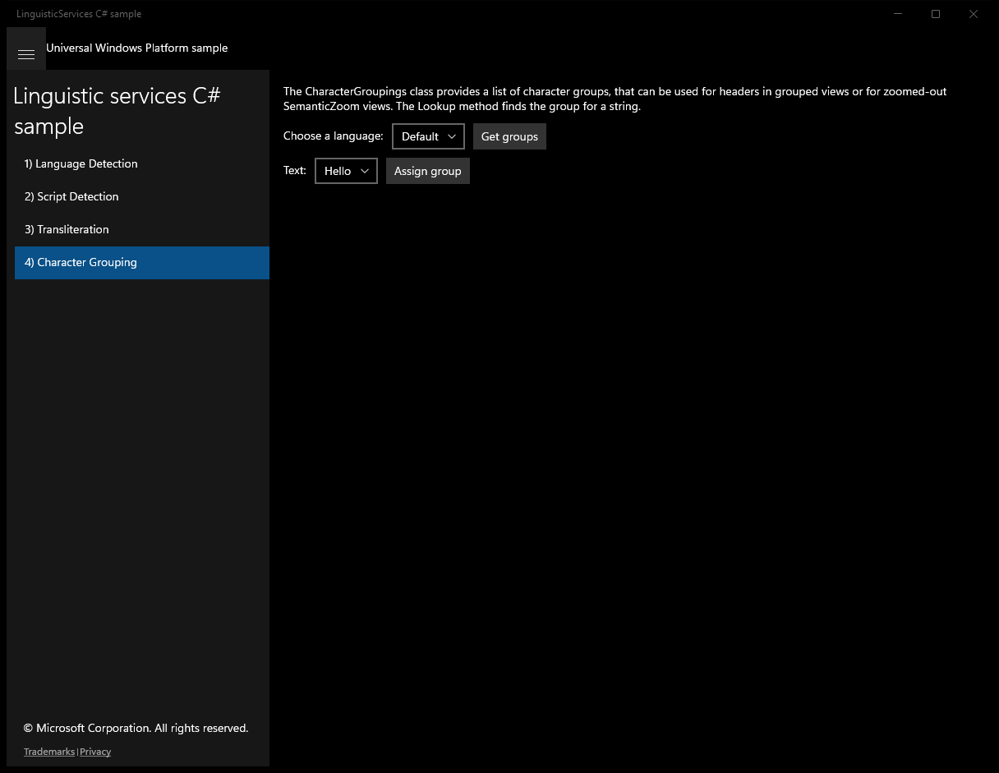
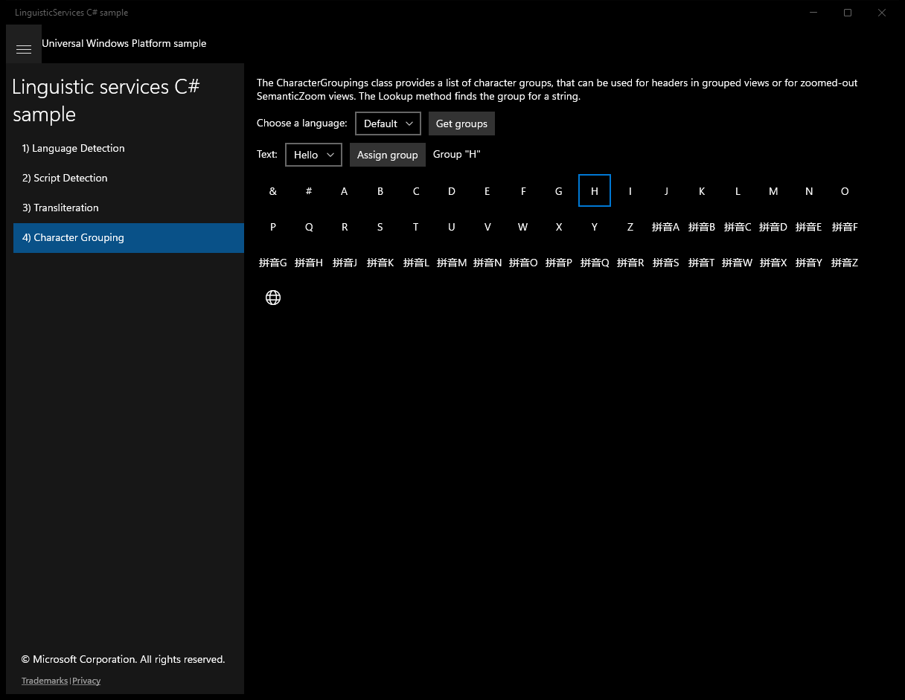

# LinguisticServices (C#)

> **Source**: `Samples\LinguisticServices\cs\`  
> **Feature**: Linguistic services C# sample  
> **AUMID**: `Microsoft.SDKSamples.LinguisticServices.CS_8wekyb3d8bbwe!LinguisticServices.App`  
> **PackageFamilyName**: `Microsoft.SDKSamples.LinguisticServices.CS_8wekyb3d8bbwe`  

## Top-level UWP namespaces used
- `Windows.Globalization.Language.IsWellFormed`

## Build / deploy / capture status
- build: ok
- deploy: ok
- launch: ok
- capture: ok
- uninstall: ok

## Main page

---

## Scenario 1 - Language Detection

### UI elements
- **TextBlock**  - text="Language Detection"
- **TextBlock**  - text="Type below the text for which you want to detect the language (to ensure detection, don't write a too short phrase)."
- **TextBox**  - x:Name="TextInput"
- **Button**  - x:Name="Go"; content="Detect Languages"; events: Click=Go_Click
- **TextBlock**  - x:Name="TextOutput"

### Code behavior
- **`Go_Click`**
    - instantiates: `StringBuilder`
    - API refs: `LinguisticServices.RecognizeTextLanguages`, `TextInput.Text`, `TextOutput.Text`
    - updates UI: `TextOutput.Text`

### Screenshots
Initial state:

After click **Detect Languages**:

---

## Scenario 2 - Script Detection

### UI elements
- **TextBlock**  - text="Script Detection"
- **TextBlock**  - text="Type below the text for which you want to detect the present scripts."
- **TextBox**  - x:Name="TextInput"
- **Button**  - x:Name="Go"; content="Detect Scripts"; events: Click=Go_Click
- **TextBlock**  - x:Name="TextOutput"

### Code behavior
- **`Go_Click`**
    - instantiates: `StringBuilder`
    - API refs: `LinguisticServices.RecognizeTextScripts`, `TextInput.Text`, `TextOutput.Text`
    - updates UI: `TextOutput.Text`

### Screenshots
Initial state:

After click **Detect Scripts**:

---

## Scenario 3 - Transliteration

### UI elements
- **TextBlock**  - text="Transliteration"
- **TextBlock**  - text="Type below the text in Cyrillic that you want to transliterate to Latin."
- **TextBox**  - x:Name="TextInput"
- **Button**  - x:Name="Go"; content="Transliterate"; events: Click=Go_Click
- **TextBlock**  - x:Name="TextOutput"

### Code behavior
- **`Go_Click`**
    - API refs: `TextOutput.Text`, `LinguisticServices.TransliterateFromCyrillicToLatin`, `TextInput.Text`
    - updates UI: `TextOutput.Text`

### Screenshots
Initial state:

> Button **Transliterate** skipped (invoke_failed)

---

## Scenario 4 - Character Grouping

### UI elements
- **TextBlock**  - text="The CharacterGroupings class provides a list of character groups, that can be used for headers in grouped views or for zoomed-out SemanticZoom views. The Lookup method finds the group for a string."
- **TextBlock**  - text="Choose a language:"
- **ComboBox**  - x:Name="LanguageText"
- **Button**  - content="Get groups"; events: Click=GetGroups_Click
- **TextBlock**  - text="Text:"
- **ComboBox**  - x:Name="CandidateText"
- **Button**  - content="Assign group"; events: Click=AssignGroup_Click
- **TextBlock**  - x:Name="GroupingResult"
- **GridView**  - x:Name="GroupingsGrid"

### Code behavior
- **`AddGroup`**
    - API refs: `GroupingsGrid.Items`
- **`GetGroups_Click`**
    - namespaces: `Windows.Globalization.Language.IsWellFormed`
    - instantiates: `CharacterGroupings`
    - API refs: `NotifyType.StatusMessage`, `LanguageText.Text`, `Windows.Globalization`, `Language.IsWellFormed`, `NotifyType.ErrorMessage`, `GroupingsGrid.Items`, `Symbol.Globe`
- **`AssignGroup_Click`**
    - API refs: `NotifyType.StatusMessage`, `NotifyType.ErrorMessage`, `String.IsNullOrEmpty`, `CandidateText.Text`, `ActiveGroupings.Lookup`, `GroupingsGrid.SelectedItem`, `GroupingResult.Text`
    - updates UI: `GroupingResult.Text`

### Screenshots
Initial state:

After click **Get groups**:

After click **Assign group**:

