# MobileBroadband (C#)

> **Source**: `Samples\MobileBroadband\cs\`  
> **Feature**: MobileBroadband  
> **AUMID**: `Microsoft.SDKSamples.MobileBroadband.CS_8wekyb3d8bbwe!App`  
> **PackageFamilyName**: `Microsoft.SDKSamples.MobileBroadband.CS_8wekyb3d8bbwe`  

## Build / deploy / capture status
- build: ok
- deploy: ok
- launch: ok
- capture: ok
- uninstall: ok

## Main page
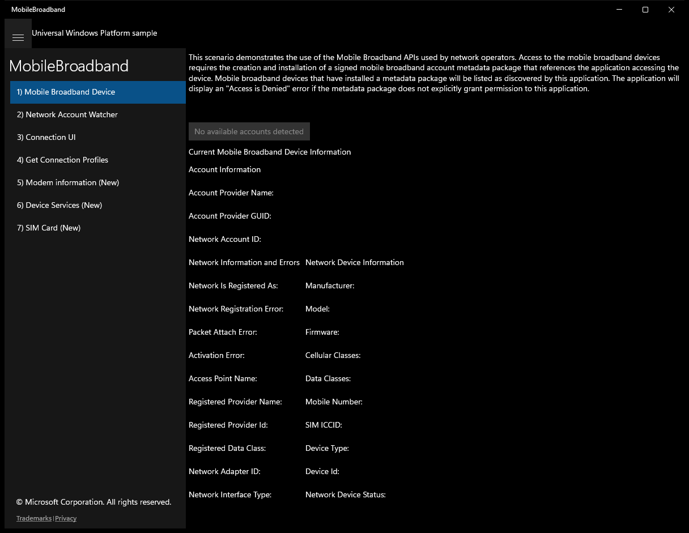

---

## Scenario 1 - 1) Mobile Broadband Device

### Screenshots
Initial state:

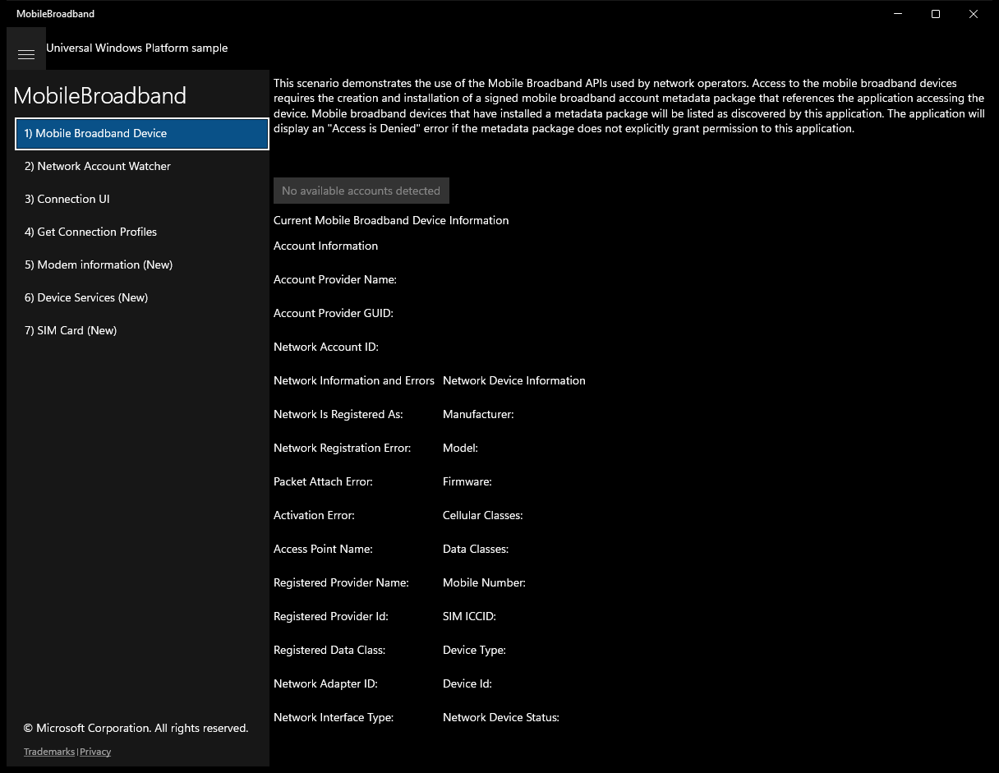

---

## Scenario 2 - 2) Network Account Watcher

### Screenshots
Initial state:

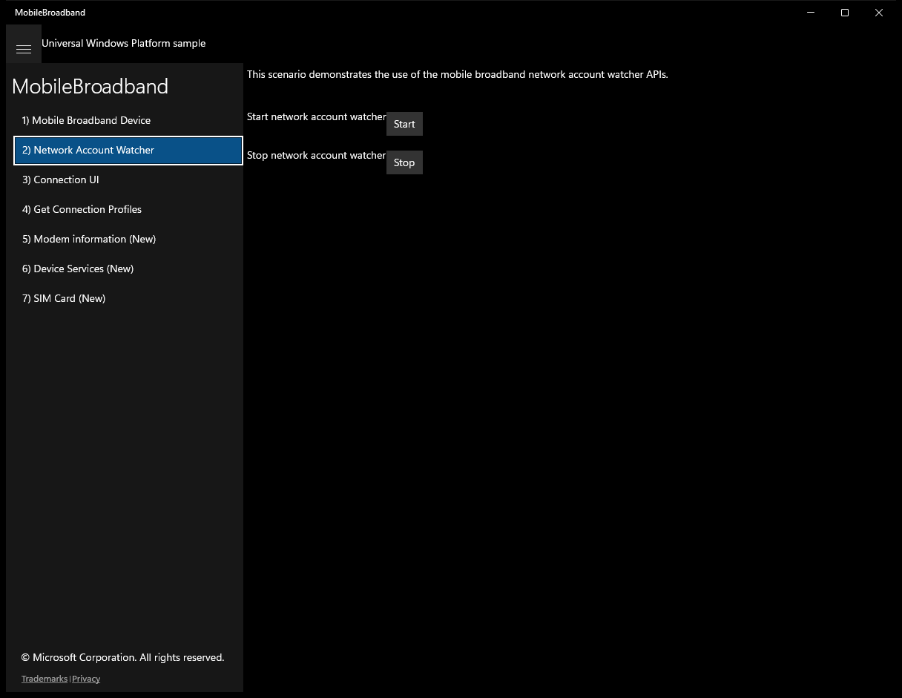

After click **Start**:

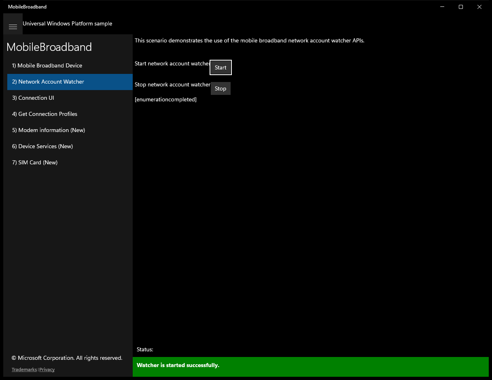

After click **Stop**:

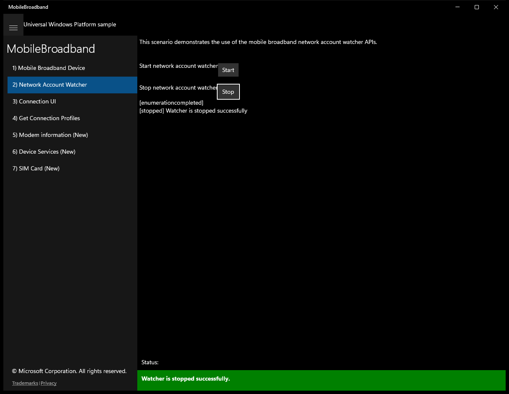

---

## Scenario 3 - 3) Connection UI

### Screenshots
Initial state:

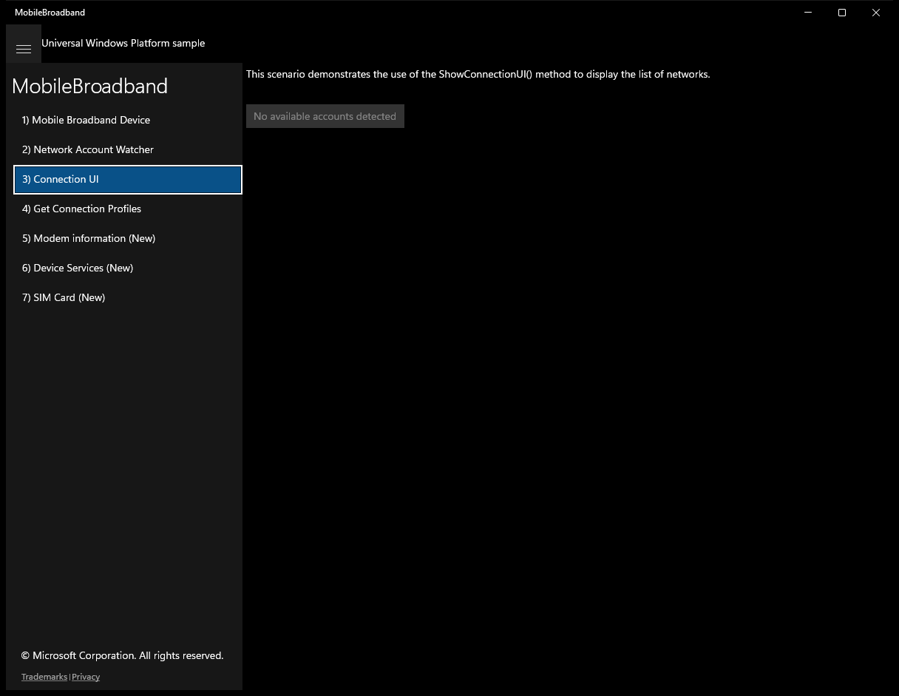

---

## Scenario 4 - 4) Get Connection Profiles

### Screenshots
Initial state:

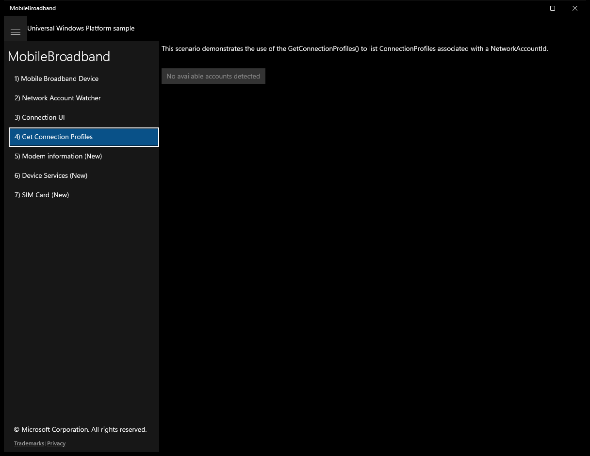

---

## Scenario 5 - 5) Modem information (New)

### Screenshots
Initial state:

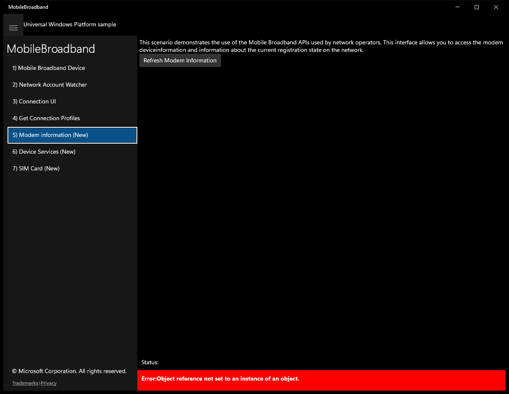

After click **Refresh Modem Information**:

---

## Scenario 6 - 6) Device Services (New)

### Screenshots
Initial state:

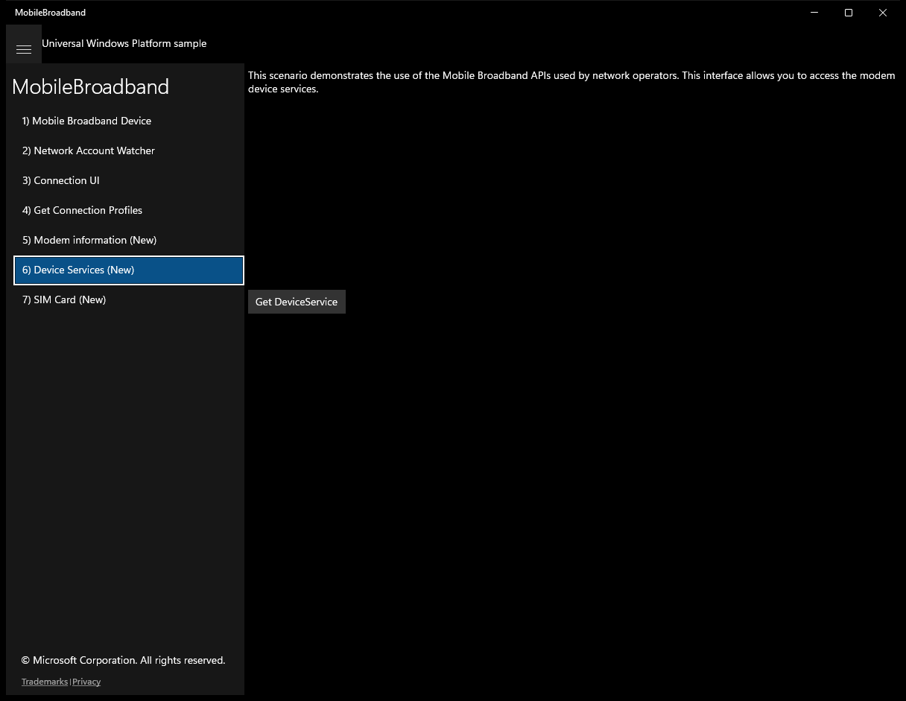

> Button **Get DeviceService** skipped (invoke_failed)

---

## Scenario 7 - 7) SIM Card (New)

### Screenshots
Initial state:

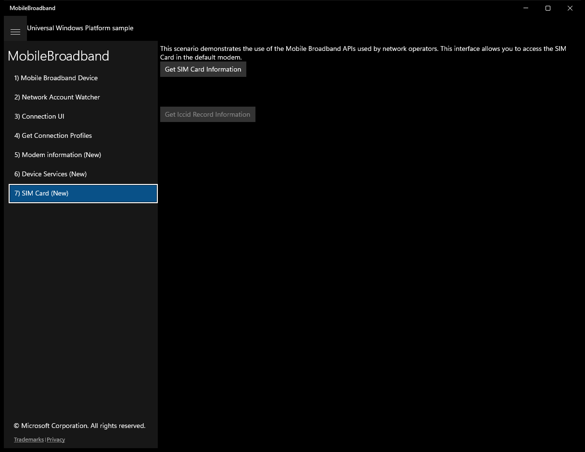

After click **Get SIM Card Information**:

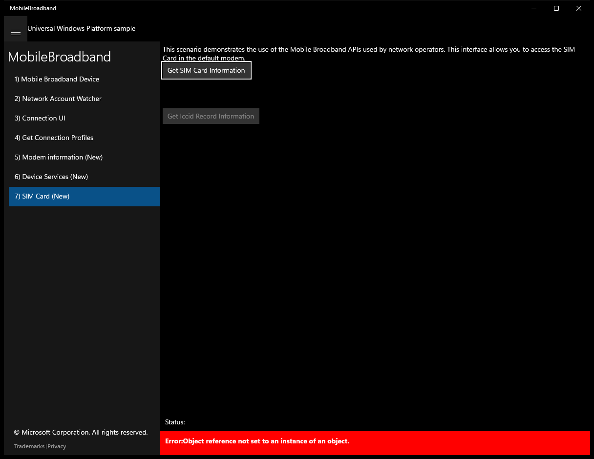

