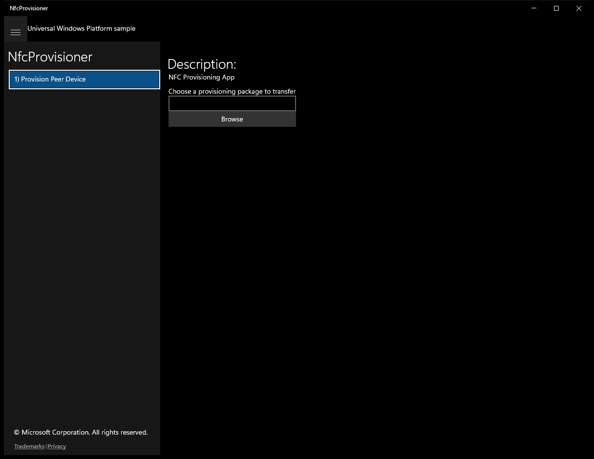

# NfcProvisioner (C#)

> **Source**: `Samples\NfcProvisioner\cs\`  
> **Feature**: NfcProvisioner  
> **AUMID**: `Microsoft.SDKSamples.NfcProvisioner.CS_8wekyb3d8bbwe!App`  
> **PackageFamilyName**: `Microsoft.SDKSamples.NfcProvisioner.CS_8wekyb3d8bbwe`  

## Top-level UWP namespaces used
- `Windows.Networking.Proximity.ProximityDevice`

## Build / deploy / capture status
- build: ok
- deploy: ok
- launch: ok
- capture: ok
- uninstall: ok

## Main page

---

## Scenario 1 - 1) Provision Peer Device

### Screenshots
Initial state:

> Button **Browse** skipped (blocklist)

