# NumberFormatting (C#)

> **Source**: `Samples\NumberFormatting\cs\`  
> **Feature**: Number formatting C# sample  
> **AUMID**: `Microsoft.SDKSamples.NumberFormatting.CS_8wekyb3d8bbwe!App`  
> **PackageFamilyName**: `Microsoft.SDKSamples.NumberFormatting.CS_8wekyb3d8bbwe`  

## Top-level UWP namespaces used
- `Windows.Globalization.NumberFormatting.PercentFormatter`
- `Windows.Globalization.NumberFormatting.PermilleFormatter`
- `Windows.Globalization.NumberFormatting.DecimalFormatter`
- `Windows.Globalization.NumberFormatting.CurrencyFormatter`
- `Windows.Globalization.NumberFormatting.IncrementNumberRounder`
- `Windows.Globalization.NumberFormatting.SignificantDigitsNumberRounder`
- `Windows.Globalization.NumberFormatting.NumeralSystemTranslator`
- `Windows.Globalization.NumberFormatting`

## Build / deploy / capture status
- build: ok
- deploy: ok
- launch: ok
- capture: ok
- uninstall: ok

## Main page

---

## Scenario 1 - Percent and Permille Formatting

### UI elements
- **TextBlock**  - text="Description:"
- **Button**  - content="Display"; events: Click=Display_Click
- **TextBlock**  - x:Name="OutputTextBlock"

### Code behavior
- **`Display_Click`**
    - namespaces: `Windows.Globalization.NumberFormatting.PercentFormatter`, `Windows.Globalization.NumberFormatting.PermilleFormatter`
    - instantiates: `StringBuilder`, `Random`, `PercentFormatter`, `PermilleFormatter`
    - API refs: `Windows.Globalization`, `NumberFormatting.PercentFormatter`, `NumberFormatting.PermilleFormatter`, `OutputTextBlock.Text`
    - updates UI: `OutputTextBlock.Text`

### Screenshots
Initial state:

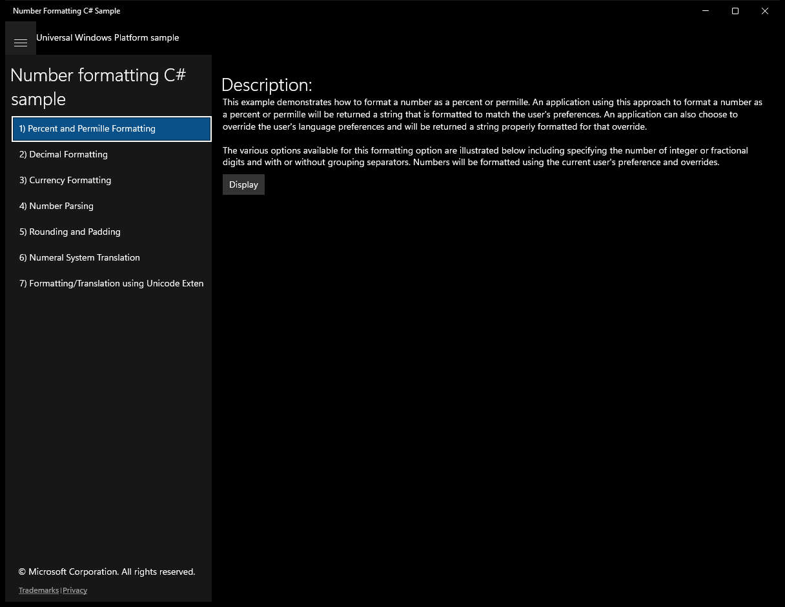

After click **Display**:

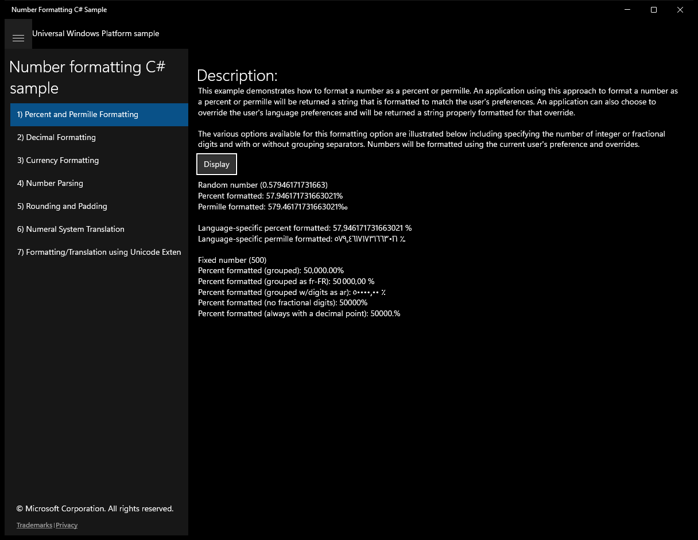

---

## Scenario 2 - Decimal Formatting

### UI elements
- **TextBlock**  - text="Description:"
- **Button**  - content="Display"; events: Click=Display_Click
- **TextBlock**  - x:Name="OutputTextBlock"

### Code behavior
- **`Display_Click`**
    - namespaces: `Windows.Globalization.NumberFormatting.DecimalFormatter`
    - instantiates: `StringBuilder`, `Windows.Globalization.NumberFormatting.DecimalFormatter`, `Random`
    - API refs: `Windows.Globalization`, `NumberFormatting.DecimalFormatter`, `OutputTextBlock.Text`
    - updates UI: `OutputTextBlock.Text`

### Screenshots
Initial state:

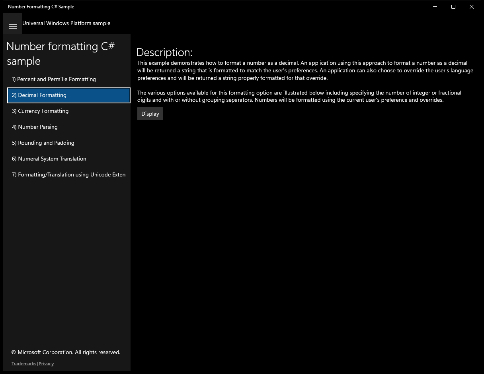

After click **Display**:

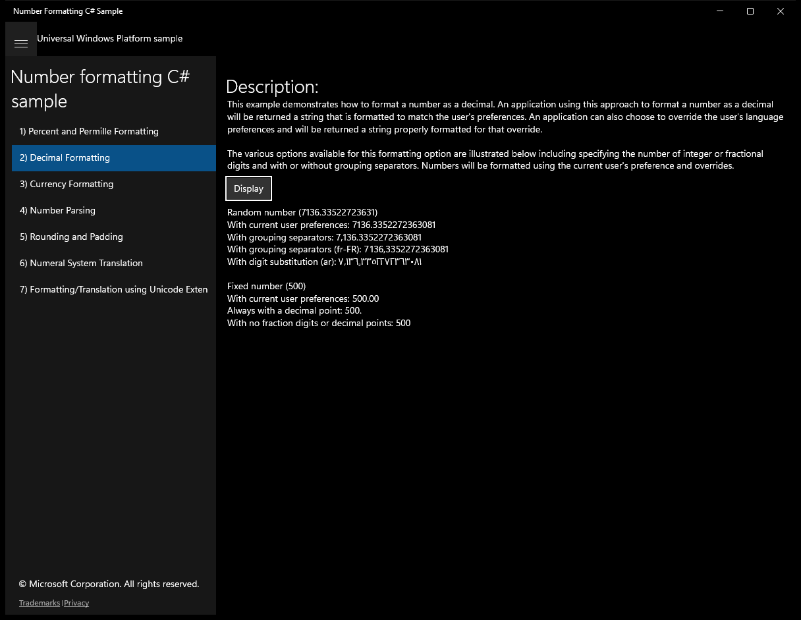

---

## Scenario 3 - Currency Formatting

### UI elements
- **TextBlock**  - text="Description:"
- **Button**  - content="Display"; events: Click=Display_Click
- **TextBlock**  - x:Name="OutputTextBlock"

### Code behavior
- **`Display_Click`**
    - namespaces: `Windows.Globalization.NumberFormatting.CurrencyFormatter`
    - instantiates: `StringBuilder`, `CurrencyFormatter`
    - API refs: `Windows.Globalization`, `NumberFormatting.CurrencyFormatter`, `GlobalizationPreferences.Currencies`, `CurrencyIdentifiers.USD`, `CurrencyIdentifiers.EUR`, `CurrencyFormatterMode.UseCurrencyCode`, `CurrencyFormatterMode.UseSymbol`, `OutputTextBlock.Text`
    - updates UI: `OutputTextBlock.Text`

### Screenshots
Initial state:

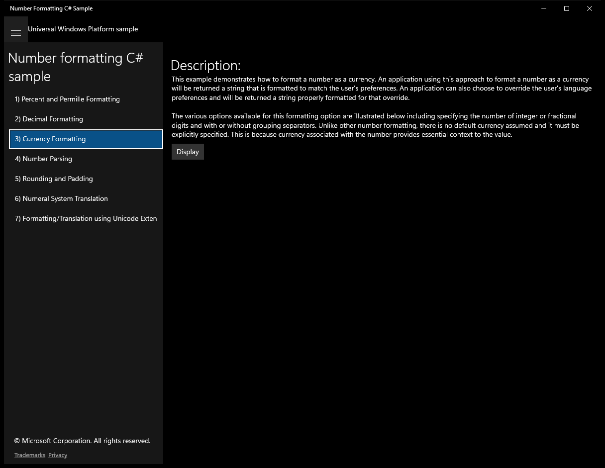

After click **Display**:

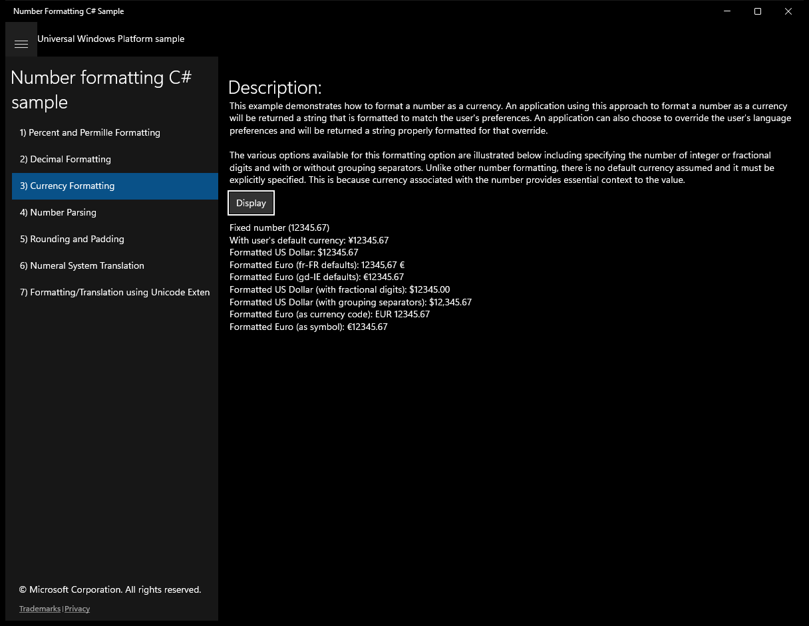

---

## Scenario 4 - Number Parsing

### UI elements
- **TextBlock**  - text="Description:"
- **Button**  - content="Display"; events: Click=Display_Click
- **TextBlock**  - x:Name="OutputTextBlock"

### Code behavior
- **`Display_Click`**
    - namespaces: `Windows.Globalization.NumberFormatting.DecimalFormatter`, `Windows.Globalization.NumberFormatting.CurrencyFormatter`, `Windows.Globalization.NumberFormatting.PercentFormatter`
    - instantiates: `StringBuilder`, `PercentFormatter`, `DecimalFormatter`, `CurrencyFormatter`
    - API refs: `Windows.Globalization`, `NumberFormatting.DecimalFormatter`, `NumberFormatting.CurrencyFormatter`, `NumberFormatting.PercentFormatter`, `GlobalizationPreferences.Currencies`, `OutputTextBlock.Text`
    - updates UI: `OutputTextBlock.Text`

### Screenshots
Initial state:

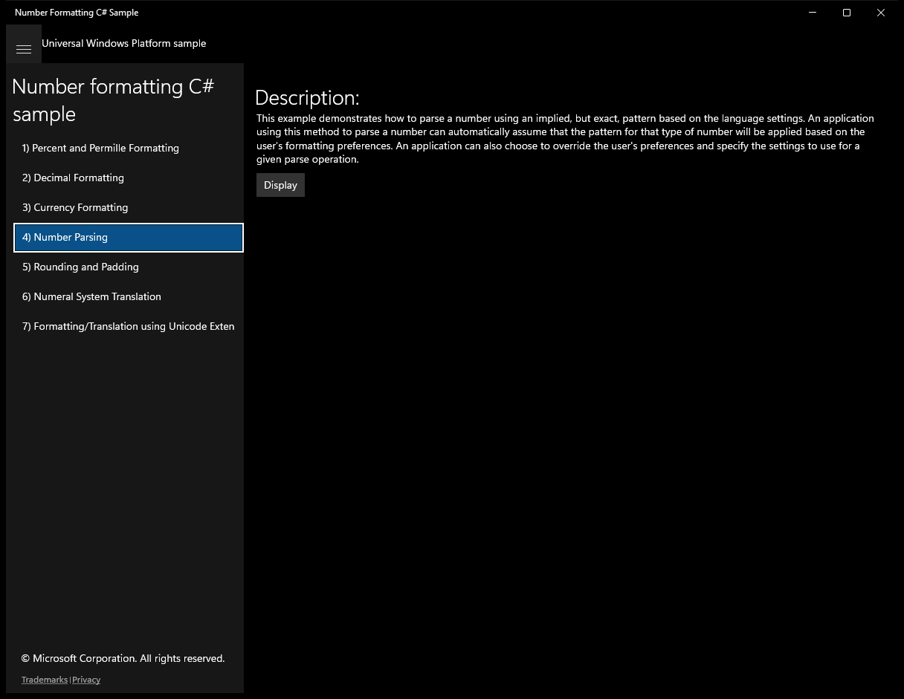

After click **Display**:

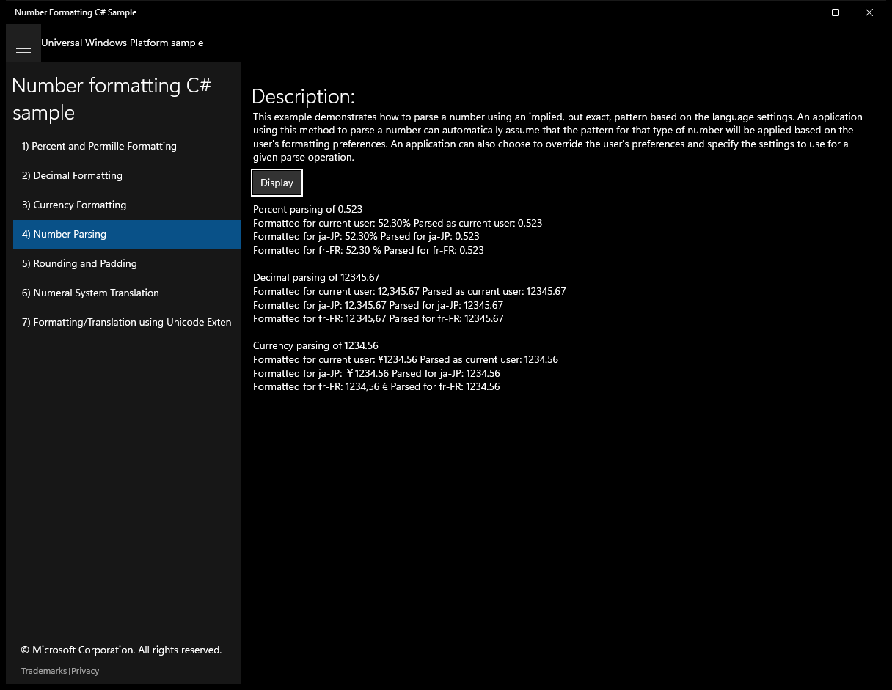

---

## Scenario 5 - Rounding and Padding

### UI elements
- **TextBlock**  - text="Description:"
- **Button**  - content="Display"; events: Click=Display_Click
- **TextBlock**  - x:Name="OutputTextBlock"

### Code behavior
- **`DisplayRoundingAlgorithmAsString`**
    - API refs: `RoundingAlgorithm.None`, `RoundingAlgorithm.RoundAwayFromZero`, `RoundingAlgorithm.RoundDown`, `RoundingAlgorithm.RoundHalfAwayFromZero`, `RoundingAlgorithm.RoundHalfDown`, `RoundingAlgorithm.RoundHalfToEven`, `RoundingAlgorithm.RoundHalfToOdd`, `RoundingAlgorithm.RoundHalfTowardsZero`, `RoundingAlgorithm.RoundHalfUp`, `RoundingAlgorithm.RoundTowardsZero`, `RoundingAlgorithm.RoundUp`
- **`DoPaddingAndRoundingScenarios`**
    - namespaces: `Windows.Globalization.NumberFormatting.IncrementNumberRounder`, `Windows.Globalization.NumberFormatting.DecimalFormatter`
    - instantiates: `Windows.Globalization.NumberFormatting.IncrementNumberRounder`, `Windows.Globalization.NumberFormatting.DecimalFormatter`, `StringBuilder`
    - API refs: `Windows.Globalization`, `NumberFormatting.IncrementNumberRounder`, `NumberFormatting.DecimalFormatter`
- **`DoCurrencyRoundingScenarios`**
    - namespaces: `Windows.Globalization.NumberFormatting.CurrencyFormatter`
    - instantiates: `Windows.Globalization.NumberFormatting.CurrencyFormatter`, `StringBuilder`
    - API refs: `Windows.Globalization`, `NumberFormatting.CurrencyFormatter`
- **`DoIncrementRoundingScenarios`**
    - namespaces: `Windows.Globalization.NumberFormatting.IncrementNumberRounder`, `Windows.Globalization.NumberFormatting.DecimalFormatter`
    - instantiates: `Windows.Globalization.NumberFormatting.IncrementNumberRounder`, `Windows.Globalization.NumberFormatting.DecimalFormatter`, `StringBuilder`
    - API refs: `Windows.Globalization`, `NumberFormatting.IncrementNumberRounder`, `NumberFormatting.DecimalFormatter`
- **`DoSignificantDigitRoundingScenarios`**
    - namespaces: `Windows.Globalization.NumberFormatting.SignificantDigitsNumberRounder`
    - instantiates: `Windows.Globalization.NumberFormatting.SignificantDigitsNumberRounder`, `StringBuilder`
    - API refs: `Windows.Globalization`, `NumberFormatting.SignificantDigitsNumberRounder`
- **`Display_Click`**
    - namespaces: `Windows.Globalization.NumberFormatting.DecimalFormatter`, `Windows.Globalization.NumberFormatting.PercentFormatter`
    - instantiates: `StringBuilder`, `Windows.Globalization.NumberFormatting.DecimalFormatter`, `Windows.Globalization.NumberFormatting.PercentFormatter`
    - API refs: `Windows.Globalization`, `NumberFormatting.DecimalFormatter`, `NumberFormatting.PercentFormatter`, `RoundingAlgorithm.RoundUp`, `RoundingAlgorithm.RoundDown`, `RoundingAlgorithm.RoundHalfUp`, `RoundingAlgorithm.RoundHalfDown`, `RoundingAlgorithm.RoundHalfToOdd`, `RoundingAlgorithm.RoundHalfToEven`, `OutputTextBlock.Text`
    - updates UI: `OutputTextBlock.Text`

### Screenshots
Initial state:

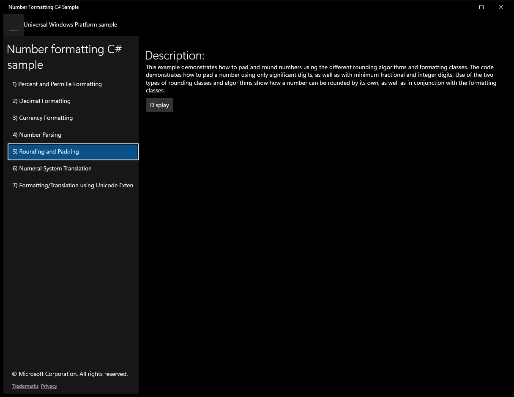

After click **Display**:

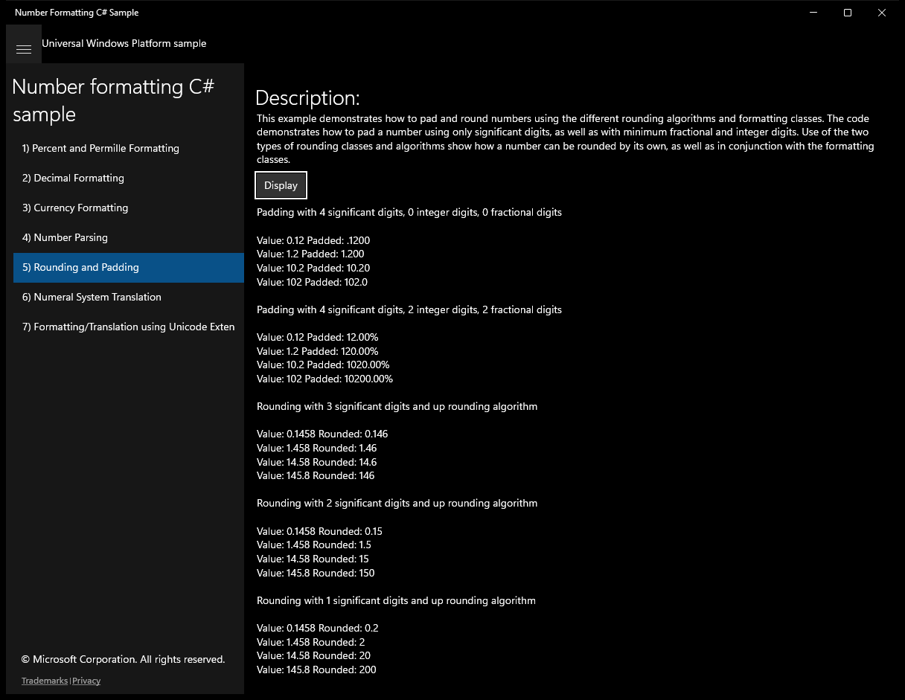

---

## Scenario 6 - Numeral System Translation

### UI elements
- **TextBlock**  - text="Description:"
- **TextBlock**  - text="This example converts strings containing Latin numbers to an appropriate numeral system that can be rendered when digit substitution is not automatically performed."
- **Button**  - content="Display"; events: Click=Display_Click
- **TextBlock**  - x:Name="OutputTextBlock"

### Code behavior
- **`Display_Click`**
    - namespaces: `Windows.Globalization.NumberFormatting.NumeralSystemTranslator`
    - instantiates: `StringBuilder`, `Windows.Globalization.NumberFormatting.NumeralSystemTranslator`
    - API refs: `Windows.Globalization`, `NumberFormatting.NumeralSystemTranslator`, `OutputTextBlock.Text`
    - updates UI: `OutputTextBlock.Text`

### Screenshots
Initial state:

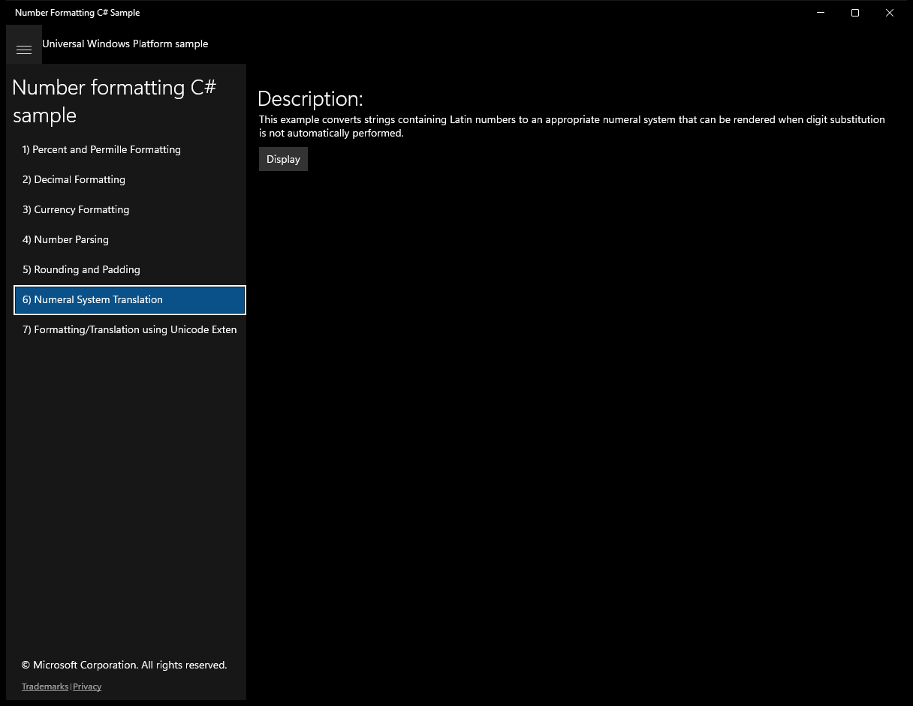

After click **Display**:

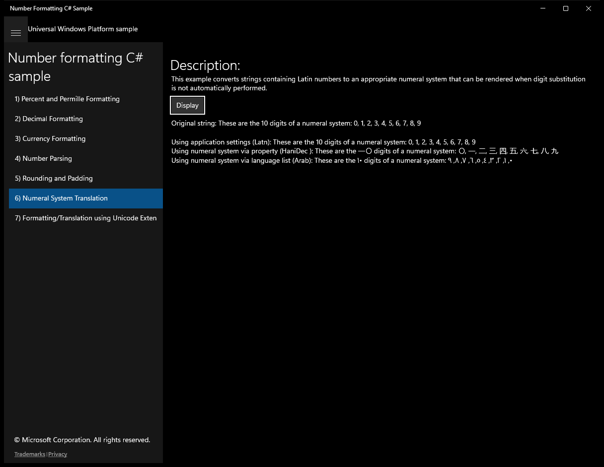

---

## Scenario 7 - Formatting/Translation using Unicode Extensions

### UI elements
- **TextBlock**  - text="Description:"
- **TextBlock**  - text="This example demonstrates how to use language names with Unicode extensions to directly set properties of number formatters."
- **Button**  - content="Display"; events: Click=Display_Click
- **TextBlock**  - x:Name="OutputTextBlock"

### Code behavior
- **`Display_Click`**
    - namespaces: `Windows.Globalization.NumberFormatting`, `Windows.Globalization.NumberFormatting.IncrementNumberRounder`
    - instantiates: `StringBuilder`, `Random`, `Windows.Globalization.NumberFormatting.IncrementNumberRounder`, `DecimalFormatter`, `CurrencyFormatter`, `PercentFormatter`, `PermilleFormatter`, `NumeralSystemTranslator`
    - API refs: `Windows.Globalization`, `NumberFormatting.IncrementNumberRounder`, `CurrencyIdentifiers.EUR`, `OutputTextBlock.Text`
    - updates UI: `OutputTextBlock.Text`

### Screenshots
Initial state:

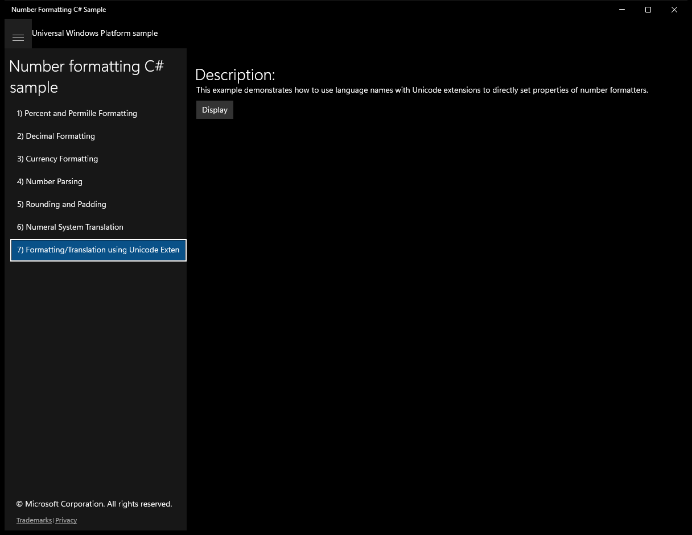

After click **Display**:

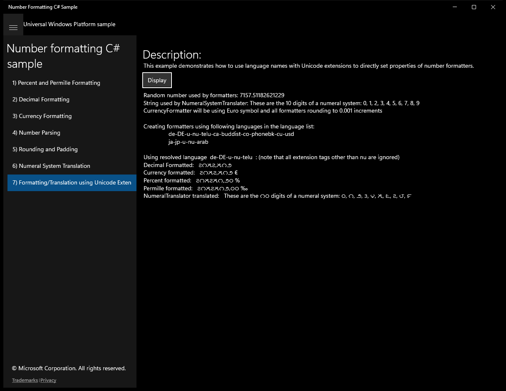

